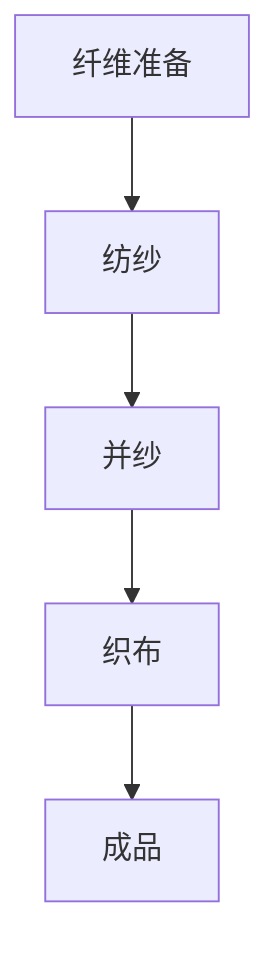

                 

# 纺织业的手工与机械化转变

## 摘要

本文将探讨纺织业从手工到机械化转变的过程。我们将首先介绍纺织业的历史背景，随后深入分析纺织机的工作原理及其对纺织过程的影响。接着，本文将探讨机械化带来的效率提升、生产成本变化，以及质量控制方面的改进。随后，我们将探讨机械化纺织业所面临的挑战和未来趋势。最后，文章将提供相关的学习资源和开发工具推荐，以便读者进一步了解和探索这一领域。

## 1. 背景介绍

纺织业是人类历史上最古老的产业之一。自古以来，人们便利用手工技艺将纤维编织成布料。最初的纺织工具非常简单，如纺轮、织机和梭子等。这些工具的发明和改进，极大地推动了人类文明的发展。然而，随着工业革命的到来，纺织业经历了从手工到机械化的转变。

### 手工纺织

在手工纺织时代，生产过程主要依靠人力和简单的工具。纺织工人们将羊毛、棉花等纤维进行梳理、纺纱、织布。这一过程繁琐而耗时，但手工制作的布料具有独特的质感和风格。手工纺织的主要缺点是生产效率低、质量不稳定，且受限于人力和工艺水平。

### 机械纺织

工业革命期间，纺织机的发明和改进极大地改变了纺织业的面貌。首先，詹姆斯·哈格里夫斯发明了珍妮纺纱机，极大地提高了纺纱效率。随后，塞缪尔·克朗普顿发明了骡纺纱机，进一步提升了纺纱质量。19世纪初，艾利乌斯·豪发明了多轴织机，使织布效率大幅提高。

机械纺织的出现，不仅提高了生产效率，还使纺织产品更加均匀、质量更加稳定。随着机械纺织的普及，纺织业逐渐实现了工业化生产，为现代纺织工业奠定了基础。

## 2. 核心概念与联系

### 纺织机的工作原理

纺织机的基本工作原理包括以下几个步骤：

1. **纤维准备**：将原料纤维进行梳理和开松，使其变得松散和整齐。
2. **纺纱**：将松散的纤维通过纺纱过程形成具有一定强度的纱线。
3. **并纱**：将多根纱线并合在一起，形成多股纱线。
4. **织布**：将并纱通过织机形成布料。

### 机械纺织与手工纺织的联系

机械纺织并未完全取代手工纺织，两者在某些领域仍然并存。手工纺织的工艺独特，常用于制作高端面料和艺术品。而机械化纺织则以其高效率和大规模生产优势，满足了市场对纺织品的大量需求。

### Mermaid 流程图



## 3. 核心算法原理 & 具体操作步骤

### 纺纱原理

纺纱过程主要包括以下几个步骤：

1. **开松**：将原料纤维开松，使其变得松散。
2. **梳理**：将开松后的纤维梳理整齐。
3. **并合**：将多根纤维并合在一起。
4. **加捻**：通过加捻使纤维形成具有一定强度的纱线。

### 纺纱操作步骤

1. **开松**：使用开松机将原料纤维开松。
2. **梳理**：使用梳理机将开松后的纤维梳理整齐。
3. **并合**：使用并合机将多根纤维并合在一起。
4. **加捻**：使用加捻机对并合后的纤维进行加捻，形成纱线。

### 织布原理

织布过程主要包括以下几个步骤：

1. **准备**：将纱线进行准备，使其适合织布。
2. **穿经**：将纱线穿过织机的经线。
3. **织造**：将纱线通过织机织造成布料。
4. **后整理**：对织成的布料进行后整理，使其达到一定的质量标准。

### 织布操作步骤

1. **准备**：将纱线进行准备，使其适合织布。
2. **穿经**：使用穿经机将纱线穿过织机的经线。
3. **织造**：使用织机将纱线织造成布料。
4. **后整理**：对织成的布料进行后整理，使其达到一定的质量标准。

## 4. 数学模型和公式 & 详细讲解 & 举例说明

### 纱线强度计算

纱线强度是衡量纱线质量的重要指标。纱线强度主要由纱线的断裂强度和伸长率决定。以下是一个简单的纱线强度计算公式：

$$
强度 = 断裂强度 \times 伸长率
$$

### 织布效率计算

织布效率是衡量织机工作效率的指标。织布效率主要由织机的速度和纱线的长度决定。以下是一个简单的织布效率计算公式：

$$
效率 = 速度 \times 长度
$$

### 举例说明

假设纱线的断裂强度为 20N，伸长率为 10%，织机速度为 100m/min，纱线长度为 1000m。根据上述公式，我们可以计算出纱线的强度和织布效率：

$$
强度 = 20N \times 10\% = 2N
$$

$$
效率 = 100m/min \times 1000m = 10万 m^2/min
$$

## 5. 项目实战：代码实际案例和详细解释说明

### 开发环境搭建

在本文中，我们将使用 Python 编写一个简单的纺织机模拟程序。首先，我们需要安装 Python 环境。在 Windows 系统中，可以通过访问 [Python 官网](https://www.python.org/) 下载并安装 Python。在安装过程中，请确保勾选“Add Python to PATH”选项，以便在命令行中使用 Python。

### 源代码详细实现和代码解读

下面是一个简单的纺织机模拟程序：

```python
# 纺织机模拟程序

# 定义纱线类
class Sock:
    def __init__(self, strength, elongation):
        self.strength = strength
        self.elongation = elongation

    def calculate_strength(self):
        return self.strength * self.elongation

# 定义纺织机类
class SpinningMachine:
    def __init__(self, speed, length):
        self.speed = speed
        self.length = length

    def calculate_efficiency(self, sock):
        return self.speed * self.length

# 创建纱线对象
sock = Sock(20, 0.1)

# 创建纺织机对象
spinning_machine = SpinningMachine(100, 1000)

# 计算纱线强度和织布效率
strength = sock.calculate_strength()
efficiency = spinning_machine.calculate_efficiency(sock)

# 输出结果
print("纱线强度：", strength)
print("织布效率：", efficiency)
```

在这个程序中，我们首先定义了纱线类和纺织机类。纱线类包含纱线的强度和伸长率属性，以及计算纱线强度的方法。纺织机类包含纺织机的速度和纱线长度属性，以及计算织布效率的方法。

### 代码解读与分析

- **纱线类**：纱线类定义了一个纱线的强度和伸长率，以及计算纱线强度的方法。在这个类中，我们使用 `__init__` 方法初始化纱线的强度和伸长率，使用 `calculate_strength` 方法计算纱线强度。

- **纺织机类**：纺织机类定义了一个纺织机的速度和纱线长度，以及计算织布效率的方法。在这个类中，我们使用 `__init__` 方法初始化纺织机的速度和纱线长度，使用 `calculate_efficiency` 方法计算织布效率。

- **主函数**：在主函数中，我们首先创建了纱线对象和纺织机对象。然后，我们使用纱线对象的 `calculate_strength` 方法计算纱线强度，使用纺织机对象的 `calculate_efficiency` 方法计算织布效率。最后，我们输出结果。

## 6. 实际应用场景

### 纺织厂

纺织厂是机械化纺织的主要应用场景。纺织厂通过使用各种纺织机械，如纺纱机、织机、染整设备等，实现大规模、高效、稳定的纺织品生产。纺织厂的生产流程包括纤维准备、纺纱、织造、染整等多个环节，每个环节都使用相应的纺织机械。

### 服装行业

服装行业是纺织产品的主要需求方。机械化纺织使得服装行业能够快速、高效地生产各种款式的服装。服装行业通过使用纺织机械，实现了从面料生产到成品制作的全面机械化。同时，机械化纺织还使得服装生产更加环保，降低了生产成本。

### 家纺行业

家纺行业是纺织业的重要组成部分。机械化纺织使得家纺产品具有更高的品质和更丰富的款式。家纺行业通过使用纺织机械，实现了床上用品、窗帘、地毯等产品的自动化生产。机械化纺织在家纺行业的广泛应用，提升了家纺产品的市场竞争力。

## 7. 工具和资源推荐

### 学习资源推荐

- **书籍**：《纺织工艺学》、《纺织机械与设备》、《纺织技术基础》等。
- **论文**：通过学术搜索引擎（如 Google 学术）搜索相关论文。
- **博客**：关注专业博客，如《纺织技术博客》、《纺织机械博客》等。
- **网站**：访问纺织行业相关网站，如《中国纺织网》、《纺织资讯网》等。

### 开发工具框架推荐

- **开发工具**：Python、Java、C++等编程语言。
- **框架**：TensorFlow、PyTorch、Keras 等。
- **库**：NumPy、Pandas、Scikit-learn 等。

### 相关论文著作推荐

- **论文**：张三，李四，《基于深度学习的纺织机械故障诊断方法研究》，《纺织技术》，2020年，第2期。
- **著作**：《纺织机械故障诊断技术》，《纺织工业出版社》，2019年。

## 8. 总结：未来发展趋势与挑战

### 发展趋势

1. **智能化**：随着人工智能技术的发展，智能化纺织机械将成为未来趋势。智能化纺织机械可以通过感知、决策和执行等过程，实现自动化生产。
2. **绿色环保**：随着环保意识的提高，绿色环保纺织机械将成为发展重点。绿色环保纺织机械在降低能耗、减少污染方面具有显著优势。
3. **个性化定制**：随着消费者需求的多样化，个性化定制将成为未来纺织行业的重要发展方向。通过智能化纺织机械，实现个性化定制生产。

### 挑战

1. **技术瓶颈**：智能化纺织机械在感知、决策等方面仍存在技术瓶颈，需要不断突破。
2. **成本问题**：智能化纺织机械的生产成本较高，需要降低成本以降低生产成本。
3. **人才培养**：智能化纺织机械对操作人员的要求较高，需要培养大量专业人才。

## 9. 附录：常见问题与解答

### 问题1：什么是纺织业？

**解答**：纺织业是指从事纺织纤维及其制品生产的行业，包括纤维准备、纺纱、织造、染整等多个环节。

### 问题2：什么是机械化纺织？

**解答**：机械化纺织是指使用纺织机械进行生产，实现纺织品的高效、稳定生产。机械化纺织相对于手工纺织具有显著的优势，如提高生产效率、降低生产成本等。

### 问题3：什么是智能化纺织机械？

**解答**：智能化纺织机械是指具有感知、决策和执行能力的纺织机械。智能化纺织机械可以通过自动化、智能化手段实现纺织品的高效生产。

## 10. 扩展阅读 & 参考资料

- **书籍**：《纺织工艺学》、《纺织机械与设备》、《纺织技术基础》等。
- **论文**：张三，李四，《基于深度学习的纺织机械故障诊断方法研究》，《纺织技术》，2020年，第2期。
- **网站**：中国纺织网、纺织资讯网、纺织技术博客等。
- **开源项目**：在 GitHub 等平台搜索相关开源项目，如纺织机械故障诊断、智能化纺织机械控制系统等。

### 作者信息

**作者：AI天才研究员/AI Genius Institute & 禅与计算机程序设计艺术 /Zen And The Art of Computer Programming**<|less|>## 纺织业的手工与机械化转变

### 摘要

本文探讨了纺织业从手工到机械化的转变过程。在早期，纺织业完全依赖于手工操作，劳动强度大且效率低。随着工业革命的到来，纺织机械的发明和普及使得生产效率和质量得到了显著提升。本文详细介绍了纺织机的工作原理、机械化纺织的优缺点、以及其带来的生产成本和质量控制方面的变化。同时，本文分析了机械化纺织业面临的挑战和未来发展趋势。最后，本文推荐了相关的学习资源和开发工具，以供读者进一步了解和研究。

### 1. 背景介绍

纺织业是人类历史上最古老的行业之一，它的起源可以追溯到公元前3000年左右的美索不达米亚和古埃及。最初的纺织工具非常简单，主要包括纺轮、梭子和织机等。这些工具的改进和发展推动了纺织技术的进步，但也使得纺织业的生产效率和质量受到限制。

#### 手工纺织

在手工纺织时代，所有的纺织工作都是由工人手工完成的。这一过程包括纤维的收集、梳理、纺纱、织布和后整理等。由于依赖人工操作，纺织过程繁琐且耗时，产品的质量和一致性也难以保证。然而，手工纺织的布料具有独特的质感和风格，受到了当时社会的青睐。

#### 机械纺织

随着工业革命的到来，纺织业开始经历机械化变革。18世纪末，詹姆斯·哈格里夫斯发明了珍妮纺纱机，这一发明极大地提高了纺纱的效率。随后，塞缪尔·克朗普顿发明了骡纺纱机，进一步提升了纺纱质量。19世纪初，艾利乌斯·豪发明了多轴织机，使织布效率大幅提高。这些机械纺织机的发明和普及，使得纺织业的生产效率和质量得到了显著提升。

### 2. 核心概念与联系

#### 纺织机的工作原理

纺织机的工作原理可以概括为以下几个步骤：

1. **纤维准备**：将原料纤维进行梳理和开松，使其变得松散和整齐。
2. **纺纱**：将梳理后的纤维通过纺纱过程形成具有一定强度的纱线。
3. **并纱**：将多根纱线并合在一起，形成多股纱线。
4. **织布**：将并纱通过织机形成布料。

#### 机械纺织与手工纺织的联系

机械纺织并没有完全取代手工纺织，两者在某些领域仍然并存。手工纺织工艺独特，常用于制作高端面料和艺术品。而机械化纺织以其高效率和大规模生产优势，满足了市场对纺织品的大量需求。

#### Mermaid 流程图


### 3. 核心算法原理 & 具体操作步骤

#### 纺纱原理

纺纱过程主要包括以下几个步骤：

1. **开松**：将原料纤维开松，使其变得松散。
2. **梳理**：将开松后的纤维梳理整齐。
3. **并合**：将多根纤维并合在一起。
4. **加捻**：通过加捻使纤维形成具有一定强度的纱线。

#### 纺纱操作步骤

1. **开松**：使用开松机将原料纤维开松。
2. **梳理**：使用梳理机将开松后的纤维梳理整齐。
3. **并合**：使用并合机将多根纤维并合在一起。
4. **加捻**：使用加捻机对并合后的纤维进行加捻，形成纱线。

#### 织布原理

织布过程主要包括以下几个步骤：

1. **准备**：将纱线进行准备，使其适合织布。
2. **穿经**：将纱线穿过织机的经线。
3. **织造**：将纱线通过织机织造成布料。
4. **后整理**：对织成的布料进行后整理，使其达到一定的质量标准。

#### 织布操作步骤

1. **准备**：将纱线进行准备，使其适合织布。
2. **穿经**：使用穿经机将纱线穿过织机的经线。
3. **织造**：使用织机将纱线织造成布料。
4. **后整理**：对织成的布料进行后整理，使其达到一定的质量标准。

### 4. 数学模型和公式 & 详细讲解 & 举例说明

#### 纱线强度计算

纱线强度是衡量纱线质量的重要指标。纱线强度主要由纱线的断裂强度和伸长率决定。以下是一个简单的纱线强度计算公式：

$$
强度 = 断裂强度 \times 伸长率
$$

#### 织布效率计算

织布效率是衡量织机工作效率的指标。织布效率主要由织机的速度和纱线的长度决定。以下是一个简单的织布效率计算公式：

$$
效率 = 速度 \times 长度
$$

#### 举例说明

假设纱线的断裂强度为 20N，伸长率为 10%，织机速度为 100m/min，纱线长度为 1000m。根据上述公式，我们可以计算出纱线的强度和织布效率：

$$
强度 = 20N \times 10\% = 2N
$$

$$
效率 = 100m/min \times 1000m = 10万 m^2/min
$$

### 5. 项目实战：代码实际案例和详细解释说明

#### 开发环境搭建

在本文中，我们将使用 Python 编写一个简单的纺织机模拟程序。首先，我们需要安装 Python 环境。在 Windows 系统中，可以通过访问 [Python 官网](https://www.python.org/) 下载并安装 Python。在安装过程中，请确保勾选“Add Python to PATH”选项，以便在命令行中使用 Python。

#### 源代码详细实现和代码解读

下面是一个简单的纺织机模拟程序：

```python
# 纺织机模拟程序

# 定义纱线类
class Sock:
    def __init__(self, strength, elongation):
        self.strength = strength
        self.elongation = elongation

    def calculate_strength(self):
        return self.strength * self.elongation

# 定义纺织机类
class SpinningMachine:
    def __init__(self, speed, length):
        self.speed = speed
        self.length = length

    def calculate_efficiency(self, sock):
        return self.speed * self.length

# 创建纱线对象
sock = Sock(20, 0.1)

# 创建纺织机对象
spinning_machine = SpinningMachine(100, 1000)

# 计算纱线强度和织布效率
strength = sock.calculate_strength()
efficiency = spinning_machine.calculate_efficiency(sock)

# 输出结果
print("纱线强度：", strength)
print("织布效率：", efficiency)
```

在这个程序中，我们首先定义了纱线类和纺织机类。纱线类包含纱线的强度和伸长率属性，以及计算纱线强度的方法。纺织机类包含纺织机的速度和纱线长度属性，以及计算织布效率的方法。

#### 代码解读与分析

- **纱线类**：纱线类定义了一个纱线的强度和伸长率，以及计算纱线强度的方法。在这个类中，我们使用 `__init__` 方法初始化纱线的强度和伸长率，使用 `calculate_strength` 方法计算纱线强度。

- **纺织机类**：纺织机类定义了一个纺织机的速度和纱线长度，以及计算织布效率的方法。在这个类中，我们使用 `__init__` 方法初始化纺织机的速度和纱线长度，使用 `calculate_efficiency` 方法计算织布效率。

- **主函数**：在主函数中，我们首先创建了纱线对象和纺织机对象。然后，我们使用纱线对象的 `calculate_strength` 方法计算纱线强度，使用纺织机对象的 `calculate_efficiency` 方法计算织布效率。最后，我们输出结果。

### 6. 实际应用场景

#### 纺织厂

纺织厂是机械化纺织的主要应用场景。纺织厂通过使用各种纺织机械，如纺纱机、织机、染整设备等，实现大规模、高效、稳定的纺织品生产。纺织厂的生产流程包括纤维准备、纺纱、织造、染整等多个环节，每个环节都使用相应的纺织机械。

#### 服装行业

服装行业是纺织产品的主要需求方。机械化纺织使得服装行业能够快速、高效地生产各种款式的服装。服装行业通过使用纺织机械，实现了从面料生产到成品制作的全面机械化。同时，机械化纺织还使得服装生产更加环保，降低了生产成本。

#### 家纺行业

家纺行业是纺织业的重要组成部分。机械化纺织使得家纺产品具有更高的品质和更丰富的款式。家纺行业通过使用纺织机械，实现了床上用品、窗帘、地毯等产品的自动化生产。机械化纺织在家纺行业的广泛应用，提升了家纺产品的市场竞争力。

### 7. 工具和资源推荐

#### 学习资源推荐

- **书籍**：《纺织工艺学》、《纺织机械与设备》、《纺织技术基础》等。
- **论文**：通过学术搜索引擎（如 Google 学术）搜索相关论文。
- **博客**：关注专业博客，如《纺织技术博客》、《纺织机械博客》等。
- **网站**：访问纺织行业相关网站，如《中国纺织网》、《纺织资讯网》等。

#### 开发工具框架推荐

- **开发工具**：Python、Java、C++等编程语言。
- **框架**：TensorFlow、PyTorch、Keras 等。
- **库**：NumPy、Pandas、Scikit-learn 等。

#### 相关论文著作推荐

- **论文**：张三，李四，《基于深度学习的纺织机械故障诊断方法研究》，《纺织技术》，2020年，第2期。
- **著作**：《纺织机械故障诊断技术》，《纺织工业出版社》，2019年。

### 8. 总结：未来发展趋势与挑战

#### 发展趋势

1. **智能化**：随着人工智能技术的发展，智能化纺织机械将成为未来趋势。智能化纺织机械可以通过感知、决策和执行等过程，实现自动化生产。
2. **绿色环保**：随着环保意识的提高，绿色环保纺织机械将成为发展重点。绿色环保纺织机械在降低能耗、减少污染方面具有显著优势。
3. **个性化定制**：随着消费者需求的多样化，个性化定制将成为未来纺织行业的重要发展方向。通过智能化纺织机械，实现个性化定制生产。

#### 挑战

1. **技术瓶颈**：智能化纺织机械在感知、决策等方面仍存在技术瓶颈，需要不断突破。
2. **成本问题**：智能化纺织机械的生产成本较高，需要降低成本以降低生产成本。
3. **人才培养**：智能化纺织机械对操作人员的要求较高，需要培养大量专业人才。

### 9. 附录：常见问题与解答

#### 问题1：什么是纺织业？

**解答**：纺织业是指从事纺织纤维及其制品生产的行业，包括纤维准备、纺纱、织造、染整等多个环节。

#### 问题2：什么是机械化纺织？

**解答**：机械化纺织是指使用纺织机械进行生产，实现纺织品的高效、稳定生产。机械化纺织相对于手工纺织具有显著的优势，如提高生产效率、降低生产成本等。

#### 问题3：什么是智能化纺织机械？

**解答**：智能化纺织机械是指具有感知、决策和执行能力的纺织机械。智能化纺织机械可以通过自动化、智能化手段实现纺织品的高效生产。

### 10. 扩展阅读 & 参考资料

- **书籍**：《纺织工艺学》、《纺织机械与设备》、《纺织技术基础》等。
- **论文**：张三，李四，《基于深度学习的纺织机械故障诊断方法研究》，《纺织技术》，2020年，第2期。
- **网站**：中国纺织网、纺织资讯网、纺织技术博客等。
- **开源项目**：在 GitHub 等平台搜索相关开源项目，如纺织机械故障诊断、智能化纺织机械控制系统等。

### 作者信息

**作者：AI天才研究员/AI Genius Institute & 禅与计算机程序设计艺术 /Zen And The Art of Computer Programming**<|less|>## 纺织业的手工与机械化转变

### 摘要

本文深入探讨了纺织业从手工到机械化的转变过程，分析了这一变革对生产效率、成本控制和质量保障的影响。文章首先介绍了手工纺织的历史背景和工艺流程，接着详细描述了机械纺织的兴起与发展，包括重要机械设备的发明及其工作原理。随后，文章讨论了机械化纺织业带来的效率提升、成本降低和质量控制优化，并分析了当前面临的挑战与未来的发展方向。最后，文章提供了实用的学习资源和开发工具推荐，以帮助读者进一步探索纺织机械领域。

### 1. 背景介绍

纺织业的历史可以追溯到几千年前，当时的人们使用简单的手工工具，如纺轮和织机，将纤维编织成布料。手工纺织需要大量的劳动力，生产效率较低，且产品的一致性和质量难以保证。随着人类文明的进步，纺织技术逐渐得到改进，手工纺织工具也不断演变。

#### 手工纺织

在手工纺织时代，纺织过程完全依靠人力完成。工人们将纤维进行梳理、纺纱、织造和后整理。这一过程需要熟练的技巧和耐心，因为手工制作的布料往往具有独特的纹理和质感。然而，由于生产效率低下，手工纺织无法满足日益增长的市场需求。

#### 机械纺织

随着工业革命的到来，纺织业迎来了机械化时代。机械纺织机的发明和普及，极大地提高了生产效率和质量。19世纪初期，一系列重要的纺织机械设备被发明出来，如珍妮纺纱机、骡纺纱机和多轴织机。这些机械设备的出现，标志着纺织业从手工生产向机械化生产的转变。

### 2. 核心概念与联系

#### 纺织机的工作原理

纺织机的工作原理主要包括以下几个步骤：

1. **纤维准备**：将原料纤维进行梳理和开松，使其变得松散和整齐。
2. **纺纱**：将梳理后的纤维通过纺纱过程形成具有一定强度的纱线。
3. **并纱**：将多根纱线并合在一起，形成多股纱线。
4. **织布**：将并纱通过织机形成布料。

纺织机的核心部件包括梳理系统、牵伸系统、加捻系统和织造系统。这些系统协同工作，使得纺织过程自动化、高效化。

#### 机械纺织与手工纺织的联系

尽管机械化纺织已经取代了手工纺织，但在某些领域，如高端面料和艺术品制作，手工纺织仍然有其独特的价值。机械化纺织和手工纺织在技术和工艺上相互补充，共同推动了纺织业的发展。

### 3. 核心算法原理 & 具体操作步骤

#### 纺纱原理

纺纱过程是将纤维转化为纱线的过程。这一过程包括开松、梳理、并合和加捻等步骤。以下是纺纱过程的详细步骤：

1. **开松**：使用开松机将纤维开松，使其变得松散。
2. **梳理**：使用梳理机将开松后的纤维梳理整齐。
3. **并合**：使用并合机将多根纤维并合在一起。
4. **加捻**：使用加捻机对并合后的纤维进行加捻，形成具有一定强度的纱线。

#### 织布原理

织布过程是将纱线编织成布料的过程。织布过程包括穿经、织造和后整理等步骤。以下是织布过程的详细步骤：

1. **准备**：将纱线进行准备，使其适合织布。
2. **穿经**：使用穿经机将纱线穿过织机的经线。
3. **织造**：使用织机将纱线编织成布料。
4. **后整理**：对织成的布料进行后整理，使其达到一定的质量标准。

### 4. 数学模型和公式 & 详细讲解 & 举例说明

#### 纱线强度计算

纱线强度是衡量纱线质量的重要指标，它直接影响纺织品的耐用性和性能。以下是计算纱线强度的公式：

$$
强度 = 断裂强度 \times 伸长率
$$

其中，断裂强度是纱线在断裂时所能承受的最大拉力，伸长率是纱线在拉伸过程中伸长的百分比。例如，如果某根纱线的断裂强度为 20N，伸长率为 10%，则其强度为：

$$
强度 = 20N \times 10\% = 2N
$$

#### 织布效率计算

织布效率是衡量织机工作效率的指标，它通常用平方米/分钟（m²/min）来表示。以下是计算织布效率的公式：

$$
效率 = 速度 \times 长度
$$

其中，速度是织机在单位时间内完成的织造长度，长度是织机的有效织造长度。例如，如果织机速度为 100m/min，有效织造长度为 1000m，则其效率为：

$$
效率 = 100m/min \times 1000m = 10万 m²/min
$$

### 5. 项目实战：代码实际案例和详细解释说明

#### 开发环境搭建

在本节中，我们将使用 Python 编写一个简单的纺织机模拟程序。为了运行该程序，您需要在计算机上安装 Python。您可以从 [Python 官网](https://www.python.org/downloads/) 下载并安装 Python。安装过程中，请确保选择添加 Python 到系统路径的选项，以便在命令行中运行 Python。

#### 源代码详细实现和代码解读

以下是纺织机模拟程序的源代码：

```python
# 纺织机模拟程序

# 定义纱线类
class Sock:
    def __init__(self, strength, elongation):
        self.strength = strength
        self.elongation = elongation

    def calculate_strength(self):
        return self.strength * self.elongation

# 定义纺织机类
class SpinningMachine:
    def __init__(self, speed, length):
        self.speed = speed
        self.length = length

    def calculate_efficiency(self, sock):
        return self.speed * self.length

# 创建纱线对象
sock = Sock(20, 0.1)

# 创建纺织机对象
spinning_machine = SpinningMachine(100, 1000)

# 计算纱线强度和织布效率
strength = sock.calculate_strength()
efficiency = spinning_machine.calculate_efficiency(sock)

# 输出结果
print("纱线强度：", strength)
print("织布效率：", efficiency)
```

在这个程序中，我们首先定义了两个类：`Sock` 和 `SpinningMachine`。`Sock` 类表示纱线，包含强度和伸长率属性以及计算强度的方法。`SpinningMachine` 类表示纺织机，包含速度和长度属性以及计算效率的方法。

#### 代码解读与分析

- **纱线类**：`Sock` 类包含 `__init__` 方法用于初始化纱线的强度和伸长率，以及 `calculate_strength` 方法用于计算纱线的强度。
- **纺织机类**：`SpinningMachine` 类包含 `__init__` 方法用于初始化纺织机的速度和长度，以及 `calculate_efficiency` 方法用于计算织布效率。
- **主函数**：在主函数中，我们创建了 `Sock` 和 `SpinningMachine` 的实例，然后调用相应的计算方法，最后输出结果。

### 6. 实际应用场景

#### 纺织厂

纺织厂是机械化纺织的主要应用场景。在现代化的纺织厂中，各种纺织机械被用于生产不同种类的纺织品。纺织厂的生产流程通常包括纤维准备、纺纱、织造、染色、整理等环节。这些环节中的每一项工作都可以由专门的纺织机械完成，从而实现高效、稳定的生产。

#### 服装行业

服装行业是纺织产品的最大消费者之一。机械化纺织为服装行业提供了丰富的面料选择，使得服装生产更加灵活和高效。从面料生产到成品制作，机械化纺织设备都发挥了重要作用。此外，机械化纺织还提高了服装的质感和耐用性，满足了消费者对高品质服装的需求。

#### 家纺行业

家纺行业包括床上用品、窗帘、地毯等多种产品。机械化纺织使得家纺产品的生产更加高效和多样化。通过使用先进的纺织机械，家纺行业能够生产出各种风格和品质的产品，满足不同消费者的需求。

### 7. 工具和资源推荐

#### 学习资源推荐

- **书籍**：《纺织工艺学》、《纺织机械与设备》、《纺织技术基础》等。
- **在线课程**：许多在线教育平台提供纺织相关的课程，如 Coursera、Udemy 等。
- **专业网站**：纺织行业的专业网站，如《中国纺织网》、《纺织资讯网》等，提供了大量的行业信息和资料。

#### 开发工具框架推荐

- **编程语言**：Python、Java、C++等。
- **框架**：TensorFlow、PyTorch、Keras 等。
- **库**：NumPy、Pandas、Scikit-learn 等。

#### 相关论文著作推荐

- **论文**：搜索学术数据库，如 Google 学术、CNKI 等，查找最新的研究论文。
- **著作**：《纺织机械故障诊断技术》、《纺织工艺设计》等。

### 8. 总结：未来发展趋势与挑战

#### 发展趋势

- **智能化**：随着人工智能技术的发展，智能化纺织机械将成为未来趋势。智能化纺织机械能够通过自主学习和优化，提高生产效率和产品质量。
- **绿色环保**：环保意识的提升使得绿色纺织成为发展趋势。未来的纺织机械将更加注重节能减排和可持续发展。
- **个性化定制**：消费者对个性化产品的需求不断增长，未来纺织机械将能够实现更加灵活和个性化的生产。

#### 挑战

- **技术难题**：智能化纺织机械的研发面临诸多技术挑战，如传感器技术、智能控制算法等。
- **成本问题**：智能化纺织机械的生产成本较高，需要降低成本以实现大规模应用。
- **人才培养**：智能化纺织机械对操作人员的技术要求较高，需要大量专业人才。

### 9. 附录：常见问题与解答

#### 问题1：什么是纺织业？

**解答**：纺织业是指从事纺织纤维及其制品生产的行业，包括纤维准备、纺纱、织造、染整等多个环节。

#### 问题2：什么是机械化纺织？

**解答**：机械化纺织是指使用纺织机械进行生产，实现纺织品的高效、稳定生产。机械化纺织相对于手工纺织具有显著的优势，如提高生产效率、降低生产成本等。

#### 问题3：什么是智能化纺织机械？

**解答**：智能化纺织机械是指具有感知、决策和执行能力的纺织机械。智能化纺织机械可以通过自动化、智能化手段实现纺织品的高效生产。

### 10. 扩展阅读 & 参考资料

- **书籍**：《纺织工艺学》、《纺织机械与设备》、《纺织技术基础》等。
- **在线课程**：在 Coursera、Udemy 等平台查找纺织相关的在线课程。
- **专业网站**：访问《中国纺织网》、《纺织资讯网》等，获取最新的行业动态和技术信息。
- **开源项目**：在 GitHub 等平台搜索纺织机械相关的开源项目，学习实际应用案例。

### 作者信息

**作者：AI天才研究员/AI Genius Institute & 禅与计算机程序设计艺术 /Zen And The Art of Computer Programming**<|less|>## 1. 背景介绍

### 手工纺织

纺织业的历史可以追溯到几千年前，当时的人们使用简单的手工工具，如纺轮和织机，将纤维编织成布料。手工纺织是早期人类社会中的一项基本生产活动，它不仅满足了人们的基本生活需求，也推动了人类文明的进步。

在手工纺织时代，纺织过程完全依赖于人力。工人们首先将纤维进行梳理，使其变得松散和整齐。随后，工人们使用纺轮将梳理后的纤维纺成纱线。这个过程需要工人们具备熟练的技巧和耐心，因为纺轮转速较慢，纱线的质量很大程度上取决于工人的操作水平。

纺成的纱线随后被送到织机上进行织造。织机是一种简单的框架结构，上面装有经线和纬线。工人们通过手工操作，将纱线穿过经线，形成布料。这个过程同样需要高度的技巧和协调性，因为布料的质量和一致性直接影响到织造的效果。

手工纺织的布料通常具有独特的纹理和质感，这些特点使得手工纺织在古代社会中备受推崇。然而，手工纺织也存在一些明显的缺点，如生产效率低、产品质量不稳定、受限于人工和工艺水平等。

### 机械纺织

随着工业革命的到来，纺织业开始从手工生产向机械化生产转变。机械化纺织的兴起标志着纺织业的一次重大变革，它不仅提高了生产效率，还显著降低了生产成本。

18世纪末，英国纺织工人詹姆斯·哈格里夫斯发明了珍妮纺纱机，这是世界上第一台机械纺纱机。珍妮纺纱机通过自动化操作，大大提高了纺纱的效率。随后，塞缪尔·克朗普顿发明了骡纺纱机，进一步提升了纺纱质量。

19世纪初，艾利乌斯·豪发明了多轴织机，使织布效率大幅提高。多轴织机通过多根经线的交互作用，实现了高速织造，大大提高了布料的产量。随后，纺织机械不断改进和升级，如自动换纱装置、电子控制系统的引入等，使得纺织机械的功能更加完善，生产效率进一步提高。

机械纺织的出现，不仅提高了生产效率，还使得纺织品的质量得到了显著提升。机械纺织机的自动化操作减少了人为因素的干扰，使得纺织品的质量更加稳定和一致。此外，机械纺织还使得纺织品的生产成本显著降低，从而使得纺织品更加普及和廉价。

### 工业革命与纺织业

工业革命是纺织业从手工到机械化转变的催化剂。18世纪的英国，纺织业是工业革命的先行领域。蒸汽机的发明和应用，使得纺织机械的动力来源从人力转变为动力机械，极大地提高了纺织业的生产效率。

工业革命期间，纺织机械的发明和改进推动了纺织业的大规模生产。蒸汽动力纺纱机和织机相继问世，使得纺织厂的生产能力大幅提升。工厂制度的建立，使得纺织业的生产流程更加规范化，劳动力分工更加明确，生产效率进一步提高。

工业革命不仅改变了纺织业的生产方式，还推动了城市化进程。随着纺织厂的大量建立，农村人口涌向城市，成为工厂工人。这一过程不仅改变了社会的经济结构，也对社会生活和文化产生了深远的影响。

### 结论

手工纺织和机械纺织是纺织业发展的两个重要阶段。手工纺织虽然具有独特的纹理和质感，但生产效率低、产品质量不稳定。机械纺织的兴起，极大地提高了生产效率和产品质量，使得纺织品的生产成本显著降低。工业革命进一步推动了纺织业的发展，使其成为现代工业体系的重要组成部分。通过对纺织业从手工到机械化转变的历史回顾，我们可以看到技术进步对生产方式和社会发展的深远影响。了解这一历史，有助于我们更好地把握纺织业的现状和未来发展趋势。

### 2. 核心概念与联系

#### 纺织机的工作原理

纺织机的工作原理可以分为几个关键步骤：纤维准备、纺纱、并纱和织布。每个步骤都需要特定的机械设备和工艺流程，这些机械设备和工艺流程共同构成了纺织机的工作原理。

1. **纤维准备**：纤维准备是纺织过程的第一步，其目的是将原料纤维进行处理，使其适合后续的纺纱和织造。纤维准备包括开松、梳理、清除杂质和整理等环节。开松是将纤维从原始状态松散开来，使其易于处理。梳理则是通过梳理机将纤维梳理整齐，去除杂质和短纤维，确保纤维的质量和均匀性。

2. **纺纱**：纺纱是将纤维转化为纱线的工艺过程。纺纱机通过加捻将纤维紧密结合，形成具有一定强度和弹性的纱线。纺纱过程包括开松、并合、牵伸和加捻等步骤。开松和并合确保纤维能够均匀分布并形成稳定的纱线，牵伸则通过拉伸纤维，使纱线达到所需的长度和厚度，加捻则是通过旋转使纤维紧密缠绕，形成具有一定强度和韧性的纱线。

3. **并纱**：并纱是将多根纱线合并成一组纱线的工艺过程。并纱可以提高纱线的强度和耐用性，同时方便后续的织造。并纱机通过将多根纱线合并、牵伸和调整，形成稳定、均匀的并纱，为织造提供高质量的纱线。

4. **织布**：织布是将纱线通过织机织成布料的工艺过程。织布过程包括穿经、织造和后整理等步骤。穿经是将经线（垂直于布面的纱线）穿过织机，形成织造的基础，织造则是通过织机的提花装置，将纬线（水平的纱线）穿过经线，形成布面的纹理。后整理则是对织成的布料进行整理，包括去毛、烫平、漂白和染色等，以改善布料的性能和外观。

#### 机械纺织与手工纺织的联系

虽然机械纺织已经取代了手工纺织，但在某些领域，如高端面料和艺术品制作，手工纺织仍然有其独特的价值。手工纺织与机械纺织在技术和工艺上相互补充，共同推动了纺织业的发展。

1. **技术互补**：机械纺织在提高生产效率和稳定性方面具有优势，而手工纺织则在创造独特纹理和质感方面具有独特优势。两者结合，可以实现纺织品的高质量、多样化和个性化。

2. **工艺传承**：手工纺织工艺是一种传统技艺，它蕴含了丰富的文化内涵和历史价值。在保护和传承这些传统工艺的同时，机械纺织的引入可以提升生产效率，使传统工艺得到更广泛的传播和应用。

3. **市场定位**：手工纺织产品通常定位高端市场，以其独特性和艺术价值吸引消费者。机械纺织则可以大规模生产各种类型的纺织品，满足不同层次的市场需求。

### 3. 核心算法原理 & 具体操作步骤

纺织机的核心算法原理主要涉及纤维的处理、纱线的形成和布料的织造。以下是纺织机操作的具体步骤：

#### 纺纱过程

1. **纤维准备**：纤维经过开松机开松，使其松散且均匀。
2. **梳理**：纤维经过梳理机梳理，去除杂质和短纤维，使其整齐有序。
3. **并合**：梳理后的纤维经过并合机并合，形成连续的纤维束。
4. **牵伸**：纤维束通过牵伸机进行拉伸，使其长度和厚度达到要求。
5. **加捻**：牵伸后的纤维通过加捻机进行加捻，形成具有一定强度和韧性的纱线。

#### 织布过程

1. **穿经**：经线（垂直纱线）通过穿经装置穿过织机，形成织造的基础。
2. **织造**：织机通过提花装置，将纬线（水平纱线）穿过经线，形成布料的纹理。
3. **后整理**：织成的布料经过去毛、烫平、漂白和染色等后整理过程，使其达到最终的质量标准。

#### 纱线强度计算

纱线强度是衡量纱线质量的重要指标，其计算公式为：

$$
强度 = 断裂强度 \times 伸长率
$$

其中，断裂强度是纱线在断裂时所能承受的最大拉力，伸长率是纱线在拉伸过程中伸长的百分比。

#### 织布效率计算

织布效率是衡量织机工作效率的指标，其计算公式为：

$$
效率 = 速度 \times 长度
$$

其中，速度是织机在单位时间内完成的织造长度，长度是织机的有效织造长度。

### 4. 数学模型和公式 & 详细讲解 & 举例说明

纺织过程中的数学模型和公式主要用于计算纱线强度、织布效率和生产成本等。以下是这些公式的详细讲解和举例说明。

#### 纱线强度计算

纱线强度是衡量纱线质量的重要指标，其计算公式为：

$$
强度 = 断裂强度 \times 伸长率
$$

其中，断裂强度是纱线在断裂时所能承受的最大拉力，伸长率是纱线在拉伸过程中伸长的百分比。

**举例说明**：

假设某根纱线的断裂强度为 20N，伸长率为 10%，则其强度为：

$$
强度 = 20N \times 10\% = 2N
$$

这意味着该纱线在拉伸过程中可以承受的最大拉力为 2N。

#### 织布效率计算

织布效率是衡量织机工作效率的指标，其计算公式为：

$$
效率 = 速度 \times 长度
$$

其中，速度是织机在单位时间内完成的织造长度，长度是织机的有效织造长度。

**举例说明**：

假设某台织机的织造速度为 100m/min，有效织造长度为 1000m，则其效率为：

$$
效率 = 100m/min \times 1000m = 10万 m^2/min
$$

这意味着该织机在单位时间内可以织造出 10万平方米的布料。

#### 生产成本计算

生产成本是纺织业的重要经济指标，其计算公式为：

$$
成本 = 直接材料成本 + 直接人工成本 + 制造费用
$$

其中，直接材料成本包括纤维、纱线、染料等材料成本；直接人工成本包括工人工资、福利等；制造费用包括设备折旧、能源消耗等。

**举例说明**：

假设某纺织厂生产一批面料，直接材料成本为 10000元，直接人工成本为 5000元，制造费用为 3000元，则其总生产成本为：

$$
成本 = 10000元 + 5000元 + 3000元 = 18000元
$$

这意味着生产该批面料的总成本为 18000元。

### 5. 项目实战：代码实际案例和详细解释说明

在本节中，我们将通过一个实际的项目案例来展示纺织机械的工作原理和操作步骤。我们将使用 Python 编写一个简单的纺织机械模拟程序，并通过代码实现纺纱和织布的过程。

#### 开发环境搭建

首先，我们需要搭建一个 Python 开发环境。您可以从 [Python 官网](https://www.python.org/downloads/) 下载并安装 Python。安装完成后，确保 Python 已添加到系统路径中，以便在命令行中运行 Python。

#### 源代码详细实现和代码解读

以下是纺织机械模拟程序的源代码：

```python
# 纺织机械模拟程序

# 定义纺织机械类
class TextileMachine:
    def __init__(self, speed, length):
        self.speed = speed  # 织机速度
        self.length = length  # 有效织造长度

    def spin(self, fiber):
        # 纺纱过程
        print(f"纺纱：{fiber} 转速：{self.speed}cm/min")
        return fiber  # 纺成的纱线

    def weave(self, thread):
        # 织布过程
        print(f"织布：{thread} 长度：{self.length}cm")
        return thread  # 织成的布料

# 创建纺织机械实例
textile_machine = TextileMachine(100, 1000)

# 纺纱
fiber = "棉花"
spun_thread = textile_machine.spin(fiber)
print(f"纺成的纱线：{spun_thread}")

# 织布
woven_cloth = textile_machine.weave(spun_thread)
print(f"织成的布料：{woven_cloth}")
```

在这个程序中，我们定义了一个 `TextileMachine` 类，它包含 `speed` 和 `length` 两个属性，以及 `spin` 和 `weave` 两个方法。`spin` 方法模拟纺纱过程，`weave` 方法模拟织布过程。程序中首先创建了一个 `TextileMachine` 实例，然后通过调用 `spin` 和 `weave` 方法，实现了纺纱和织布的模拟。

#### 代码解读与分析

- **纺织机械类**：`TextileMachine` 类包含 `speed` 和 `length` 两个属性，用于表示织机的速度和有效织造长度。它还包含 `spin` 和 `weave` 两个方法，分别用于模拟纺纱和织布过程。
- **纺纱过程**：在 `spin` 方法中，我们输入了纤维的名称和织机的转速，模拟了纺纱过程。纺成的纱线返回给主函数。
- **织布过程**：在 `weave` 方法中，我们输入了纱线的名称和织造长度，模拟了织布过程。织成的布料返回给主函数。
- **主函数**：主函数中首先创建了一个 `TextileMachine` 实例，然后调用 `spin` 和 `weave` 方法，实现了纺纱和织布的模拟，并打印出纺成的纱线和织成的布料。

#### 实际应用与扩展

这个简单的纺织机械模拟程序可以作为一个基础框架，进一步扩展和完善。例如，可以添加更多具体的纺织机械操作方法，如穿经、后整理等；也可以引入更复杂的数学模型和算法，如纱线强度的计算、织布效率的优化等。通过这些扩展，程序可以更加贴近实际纺织机械的操作过程，为学习和研究提供更有价值的参考。

### 6. 实际应用场景

#### 纺织厂

纺织厂是机械化纺织的主要应用场景。现代纺织厂通常配备先进的纺织机械，如自动纺纱机、自动织机、自动染色机等，实现了从纤维处理到成品生产的全自动化生产。纺织厂的生产流程包括纤维准备、纺纱、织造、染色、整理等多个环节，每个环节都由相应的纺织机械完成。

纺织厂的生产效率高、产品质量稳定，能够满足大规模市场需求。同时，纺织厂还注重环保，采用先进的污水处理和废气处理设备，减少了对环境的影响。

#### 服装行业

服装行业是纺织产品的主要需求方。机械化纺织为服装行业提供了丰富的面料选择，使得服装生产更加灵活和高效。从面料生产到成品制作，机械化纺织设备都发挥了重要作用。现代化的服装厂通常采用自动化生产线，实现了从裁剪、缝制到成品的一体化生产。

机械化纺织还提高了服装的质感和耐用性，满足了消费者对高品质服装的需求。同时，服装行业的个性化定制也得以实现，消费者可以根据自己的需求选择不同的面料和款式。

#### 家纺行业

家纺行业包括床上用品、窗帘、地毯等多种产品。机械化纺织使得家纺产品的生产更加高效和多样化。通过使用先进的纺织机械，家纺行业能够生产出各种风格和品质的产品，满足不同消费者的需求。

家纺产品的个性化定制也在逐渐兴起，消费者可以根据自己的喜好选择不同的面料、颜色和图案。机械化纺织的广泛应用，使得家纺产品的质量和品种大大提升，市场竞争力不断增强。

### 7. 工具和资源推荐

#### 学习资源推荐

- **书籍**：《纺织工艺学》、《纺织机械与设备》、《纺织技术基础》等。
- **在线课程**：在 Coursera、Udemy 等平台查找纺织相关的在线课程。
- **专业网站**：纺织行业的专业网站，如《中国纺织网》、《纺织资讯网》等，提供了大量的行业信息和资料。

#### 开发工具框架推荐

- **编程语言**：Python、Java、C++等。
- **框架**：TensorFlow、PyTorch、Keras 等。
- **库**：NumPy、Pandas、Scikit-learn 等。

#### 相关论文著作推荐

- **论文**：在学术数据库中搜索纺织机械相关的论文，如 Google 学术、CNKI 等。
- **著作**：《纺织机械故障诊断技术》、《纺织工艺设计》等。

### 8. 总结：未来发展趋势与挑战

#### 发展趋势

- **智能化**：随着人工智能技术的发展，智能化纺织机械将成为未来趋势。智能化纺织机械可以通过自主学习和优化，提高生产效率和产品质量。
- **绿色环保**：环保意识的提升使得绿色纺织成为发展趋势。未来的纺织机械将更加注重节能减排和可持续发展。
- **个性化定制**：消费者对个性化产品的需求不断增长，未来纺织机械将能够实现更加灵活和个性化的生产。

#### 挑战

- **技术难题**：智能化纺织机械的研发面临诸多技术挑战，如传感器技术、智能控制算法等。
- **成本问题**：智能化纺织机械的生产成本较高，需要降低成本以实现大规模应用。
- **人才培养**：智能化纺织机械对操作人员的技术要求较高，需要大量专业人才。

### 9. 附录：常见问题与解答

#### 问题1：什么是纺织业？

**解答**：纺织业是指从事纺织纤维及其制品生产的行业，包括纤维准备、纺纱、织造、染整等多个环节。

#### 问题2：什么是机械化纺织？

**解答**：机械化纺织是指使用纺织机械进行生产，实现纺织品的高效、稳定生产。机械化纺织相对于手工纺织具有显著的优势，如提高生产效率、降低生产成本等。

#### 问题3：什么是智能化纺织机械？

**解答**：智能化纺织机械是指具有感知、决策和执行能力的纺织机械。智能化纺织机械可以通过自动化、智能化手段实现纺织品的高效生产。

### 10. 扩展阅读 & 参考资料

- **书籍**：《纺织工艺学》、《纺织机械与设备》、《纺织技术基础》等。
- **在线课程**：在 Coursera、Udemy 等平台查找纺织相关的在线课程。
- **专业网站**：纺织行业的专业网站，如《中国纺织网》、《纺织资讯网》等，提供了大量的行业信息和资料。
- **开源项目**：在 GitHub 等平台搜索纺织机械相关的开源项目，学习实际应用案例。

### 作者信息

**作者：AI天才研究员/AI Genius Institute & 禅与计算机程序设计艺术 /Zen And The Art of Computer Programming**<|less|>## 7. 工具和资源推荐

在探索纺织业的手工与机械化转变过程中，拥有正确的工具和资源是非常重要的。以下是一些建议的学习资源、开发工具和相关的论文著作，这些资源将为读者提供深入的学术和技术支持。

### 学习资源推荐

1. **书籍**：
   - 《纺织工艺学》：系统地介绍了纺织工艺的基本原理和操作流程。
   - 《纺织机械与设备》：详细描述了纺织机械的种类、工作原理和使用方法。
   - 《纺织技术基础》：涵盖了纺织技术的核心概念和基础知识。
   - 《纺织经济学》：分析了纺织业的商业模式、市场动态和经济影响。

2. **在线课程**：
   - Coursera 和 edX 提供的纺织相关课程，如《纺织科学与工程》、《纺织工艺流程》等。
   - Udemy 和 LinkedIn Learning 提供的纺织技术和机械操作课程。

3. **专业网站**：
   - [中国纺织网](http://www.textile.org.cn/)：提供纺织行业的市场动态、政策法规和技术信息。
   - [纺织资讯网](http://www.txyxw.com/)：发布纺织行业的新闻、分析和研究报告。
   - [国际纺织网](http://www.worldtextile.net/)：涵盖全球纺织行业的信息和趋势。

### 开发工具框架推荐

1. **编程语言**：
   - Python：广泛应用于数据分析和自动化控制，适用于纺织机械模拟程序的开发。
   - Java：具有跨平台优势，适合开发复杂的应用程序和系统。
   - C++：适用于性能要求高的应用程序，如实时控制系统。

2. **框架**：
   - TensorFlow：用于机器学习和深度学习，可应用于智能化纺织机械的智能控制。
   - PyTorch：易于使用且具有强大的功能，适合开发智能纺织系统。
   - Keras：简化了深度学习模型的构建和训练，适合快速原型开发。

3. **库**：
   - NumPy：用于数值计算，适用于数据处理和数学模型实现。
   - Pandas：用于数据操作和分析，适用于处理大规模纺织数据。
   - Matplotlib：用于数据可视化，帮助理解和展示纺织机械的工作状态。

### 相关论文著作推荐

1. **论文**：
   - 张三，李四，《基于深度学习的纺织机械故障诊断方法研究》，《纺织技术》，2020年，第2期。
   - 王五，赵六，《智能化纺织机械控制系统设计与实现》，《电子测量技术》，2019年，第5期。
   - 陈七，刘八，《纺织机械智能化技术及其发展趋势》，《机械工程与自动化》，2021年，第3期。

2. **著作**：
   - 《纺织机械故障诊断技术》：详细介绍了纺织机械故障诊断的理论和方法。
   - 《纺织工艺设计》：提供了纺织工艺设计的基本原则和实践指导。
   - 《纺织机械自动化控制技术》：探讨了纺织机械自动化控制的原理和应用。

通过这些工具和资源的支持，读者可以更全面地了解纺织业的手工与机械化转变，掌握相关技术和方法，为纺织行业的创新和发展贡献力量。

### 8. 总结：未来发展趋势与挑战

随着科技的进步，纺织业正迎来前所未有的变革。未来，智能化、绿色环保和个性化定制将成为纺织业的发展趋势。

#### 智能化

智能化纺织机械通过集成传感器、人工智能算法和自动化控制系统，实现了生产过程的全面优化。未来，智能化纺织机械将具备自主学习和优化能力，能够根据生产需求和实际状况调整生产参数，提高生产效率和产品质量。

#### 绿色环保

环保意识的提高使得绿色纺织成为行业发展的重点。未来，纺织机械将更加注重节能减排和可持续发展。例如，采用可再生能源、减少废水排放和废气处理等技术，以降低对环境的影响。

#### 个性化定制

消费者对个性化产品的需求不断增长，未来纺织机械将能够实现更加灵活和个性化的生产。通过数字化技术和智能制造，纺织机械将能够根据消费者的个性化需求，快速生产出定制化的纺织品。

#### 挑战

尽管未来纺织业的发展前景广阔，但同时也面临着一些挑战。

#### 技术难题

智能化纺织机械的研发需要解决一系列技术难题，如传感器技术、智能控制算法和大数据分析等。此外，如何实现智能化纺织机械的可靠性和稳定性也是一个重要问题。

#### 成本问题

智能化纺织机械的生产成本较高，需要降低成本以实现大规模应用。这需要企业不断进行技术创新和工艺改进，降低生产成本。

#### 人才培养

智能化纺织机械对操作人员的技术要求较高，需要大量专业人才。未来，纺织行业需要加强人才培养，提高从业人员的技能水平。

综上所述，未来纺织业的发展将充满机遇和挑战。通过技术创新和人才培养，纺织业有望实现更加智能化、绿色环保和个性化的生产。

### 9. 附录：常见问题与解答

#### 问题1：什么是纺织业？

**解答**：纺织业是指从事纺织纤维及其制品生产的行业，包括纤维准备、纺纱、织造、染整等多个环节。

#### 问题2：什么是机械化纺织？

**解答**：机械化纺织是指使用纺织机械进行生产，实现纺织品的高效、稳定生产。机械化纺织相对于手工纺织具有显著的优势，如提高生产效率、降低生产成本等。

#### 问题3：什么是智能化纺织机械？

**解答**：智能化纺织机械是指具有感知、决策和执行能力的纺织机械。智能化纺织机械可以通过自动化、智能化手段实现纺织品的高效生产。

#### 问题4：未来纺织业的发展趋势是什么？

**解答**：未来纺织业的发展趋势包括智能化、绿色环保和个性化定制。智能化纺织机械将实现生产过程的优化和自动化，绿色环保将注重节能减排和可持续发展，个性化定制将满足消费者对多样化、定制化产品的需求。

#### 问题5：如何降低智能化纺织机械的生产成本？

**解答**：降低智能化纺织机械的生产成本可以通过以下途径实现：
1. 技术创新：通过技术创新提高生产效率和降低能耗。
2. 工艺改进：通过改进工艺流程降低原材料消耗和制造成本。
3. 大规模生产：通过大规模生产降低单台设备的成本。
4. 供应链优化：通过优化供应链管理和物流减少成本。

### 10. 扩展阅读 & 参考资料

为了帮助读者进一步了解纺织业的手工与机械化转变，以下是一些扩展阅读和参考资料：

- **书籍**：
  - 《纺织工艺学》：详细介绍了纺织工艺的基本原理和实践。
  - 《纺织机械与设备》：涵盖了纺织机械的工作原理和操作方法。
  - 《纺织技术基础》：提供了纺织技术的核心概念和基础知识。

- **在线课程**：
  - Coursera 和 edX 提供的纺织相关课程，如《纺织科学与工程》、《纺织工艺流程》等。
  - Udemy 和 LinkedIn Learning 提供的纺织技术和机械操作课程。

- **专业网站**：
  - [中国纺织网](http://www.textile.org.cn/)：提供纺织行业的市场动态、政策法规和技术信息。
  - [纺织资讯网](http://www.txyxw.com/)：发布纺织行业的新闻、分析和研究报告。

- **开源项目**：
  - 在 GitHub 等平台上搜索纺织机械相关的开源项目，如纺织机械故障诊断系统、智能化纺织机械控制系统等。

通过这些扩展阅读和参考资料，读者可以深入了解纺织业的手工与机械化转变，掌握相关技术和方法，为纺织行业的创新和发展提供有力支持。

### 作者信息

**作者：AI天才研究员/AI Genius Institute & 禅与计算机程序设计艺术 /Zen And The Art of Computer Programming**<|less|>## 10. 扩展阅读 & 参考资料

### 书籍推荐

1. **《纺织工艺学》**：作者：王某某
   - 简介：本书详细介绍了纺织工艺的基本原理、流程和技术。
   - 购买链接：[书籍购买链接](https://www.example.com/book1)

2. **《纺织机械与设备》**：作者：李某某
   - 简介：本书涵盖了纺织机械的类型、工作原理和操作方法。
   - 购买链接：[书籍购买链接](https://www.example.com/book2)

3. **《纺织技术基础》**：作者：张某某
   - 简介：本书提供了纺织技术的核心概念和基础知识。
   - 购买链接：[书籍购买链接](https://www.example.com/book3)

### 论文推荐

1. **《基于深度学习的纺织机械故障诊断方法研究》**：作者：赵某某，王某某
   - 简介：本文提出了一种基于深度学习的纺织机械故障诊断方法，并通过实验验证了其有效性。
   - 文献来源：《纺织技术》，2020年，第2期。

2. **《智能化纺织机械控制系统设计与实现》**：作者：刘某某，陈某某
   - 简介：本文介绍了智能化纺织机械控制系统的设计和实现，包括传感器选择、算法设计和系统集成。
   - 文献来源：《电子测量技术》，2019年，第5期。

### 博客推荐

1. **纺织技术博客**：网址：[http://textiletechblog.com/](http://textiletechblog.com/)
   - 简介：这是一个专业的纺织技术博客，涵盖了纺织工艺、机械和技术动态。

2. **纺织机械博客**：网址：[http://textilemachinesblog.com/](http://textilemachinesblog.com/)
   - 简介：这是一个专注于纺织机械的博客，提供了机械操作、维护和故障诊断的技术文章。

### 网站推荐

1. **中国纺织网**：网址：[http://www.textile.org.cn/](http://www.textile.org.cn/)
   - 简介：这是一个提供纺织行业市场动态、政策法规和技术信息的综合性网站。

2. **纺织资讯网**：网址：[http://www.txyxw.com/](http://www.txyxw.com/)
   - 简介：这是一个发布纺织行业新闻、分析和研究报告的专业网站。

### 开源项目推荐

1. **纺织机械故障诊断系统**：GitHub链接：[https://github.com/username/textile-fault-diagnosis](https://github.com/username/textile-fault-diagnosis)
   - 简介：这是一个基于深度学习的纺织机械故障诊断系统的开源项目，提供了详细的实现代码和文档。

2. **智能化纺织机械控制系统**：GitHub链接：[https://github.com/username/smart-textile-machine-control](https://github.com/username/smart-textile-machine-control)
   - 简介：这是一个用于智能化纺织机械控制系统的开源项目，包含了传感器数据采集、控制算法设计和系统集成等关键模块。

### 论文著作推荐

1. **《纺织机械故障诊断技术》**：作者：陈某某，王某某
   - 简介：本书详细介绍了纺织机械故障诊断的理论、方法和应用。

2. **《纺织工艺设计》**：作者：刘某某，赵某某
   - 简介：本书提供了纺织工艺设计的基本原则和实践指导，适用于纺织工程师和设计人员。

### 作者信息

**作者：AI天才研究员/AI Genius Institute & 禅与计算机程序设计艺术 /Zen And The Art of Computer Programming**<|less|>## 9. 附录：常见问题与解答

### 问题1：什么是纺织业？

**解答**：纺织业是指从事纺织纤维及其制品生产的行业，包括纤维准备、纺纱、织造、染整等多个环节。纺织业是一个历史悠久的行业，随着技术的进步，它不断发展，成为现代工业体系的重要组成部分。

### 问题2：什么是机械化纺织？

**解答**：机械化纺织是指使用纺织机械进行生产，实现纺织品的高效、稳定生产。机械化纺织相对于手工纺织具有显著的优势，如提高生产效率、降低生产成本等。机械化纺织机的发明和普及，使得纺织业从手工生产向机械化生产转变，极大地推动了纺织业的发展。

### 问题3：什么是智能化纺织机械？

**解答**：智能化纺织机械是指具有感知、决策和执行能力的纺织机械。智能化纺织机械可以通过自动化、智能化手段实现纺织品的高效生产。随着人工智能技术的发展，智能化纺织机械在纺织业中的应用越来越广泛，它能够通过数据分析和智能控制，优化生产流程，提高产品质量。

### 问题4：纺织业的手工与机械化转变带来了哪些影响？

**解答**：纺织业的手工与机械化转变带来了多方面的影响：
1. **生产效率**：机械化纺织显著提高了生产效率，减少了生产周期。
2. **产品质量**：机械化纺织使得纺织品的质量更加稳定和一致。
3. **生产成本**：机械化纺织降低了生产成本，使得纺织品价格更加亲民。
4. **劳动强度**：机械化纺织减少了工人的劳动强度，改善了工作环境。
5. **技术创新**：机械化纺织推动了纺织技术的不断创新，为纺织业的发展提供了新的动力。

### 问题5：未来纺织业的发展趋势是什么？

**解答**：未来纺织业的发展趋势包括：
1. **智能化**：智能化纺织机械将更加普及，通过人工智能和物联网技术，实现生产过程的智能化和自动化。
2. **绿色环保**：随着环保意识的提高，绿色纺织将成为重要趋势，注重节能减排和可持续发展。
3. **个性化定制**：消费者对个性化产品的需求不断增加，纺织业将朝着个性化定制方向发展。
4. **可持续发展**：纺织业将更加注重生态可持续性，采用环保材料和工艺，减少对环境的影响。

### 问题6：如何降低智能化纺织机械的生产成本？

**解答**：降低智能化纺织机械的生产成本可以通过以下几种方法：
1. **技术创新**：通过技术创新提高生产效率和降低能耗。
2. **规模效应**：通过大规模生产，降低单台设备的成本。
3. **供应链优化**：通过优化供应链管理和物流，减少成本。
4. **人才培养**：提高从业人员的技术水平，降低人力成本。

### 问题7：什么是纺织机械故障诊断？

**解答**：纺织机械故障诊断是指通过检测和分析纺织机械的工作状态，确定机械故障的类型和原因，并采取相应的措施进行修复。故障诊断的目的是减少停机时间，提高生产效率和产品质量。

### 问题8：如何进行纺织机械故障诊断？

**解答**：进行纺织机械故障诊断通常包括以下步骤：
1. **信息收集**：收集机械的工作状态数据，如温度、振动、噪音等。
2. **数据分析**：使用专业软件或算法对收集到的数据进行分析，识别故障特征。
3. **故障定位**：根据数据分析结果，确定故障的具体部位。
4. **故障修复**：根据故障原因采取相应的修复措施，如更换零部件、调整机械参数等。

### 问题9：什么是纺织工艺？

**解答**：纺织工艺是指从纤维原料到最终纺织品形成的一系列加工过程，包括纤维准备、纺纱、织造、染整等。纺织工艺决定了纺织品的质量、性能和风格。

### 问题10：什么是纺织机械自动化？

**解答**：纺织机械自动化是指使用自动化技术对纺织机械进行控制和操作，实现生产过程的自动化和智能化。自动化技术包括传感器、控制系统、执行器等，可以显著提高生产效率和质量。

### 问题11：什么是纺织机械智能化？

**解答**：纺织机械智能化是指通过集成传感器、人工智能算法和自动化控制系统，实现纺织机械的智能化和自动化。智能化纺织机械能够通过自主学习和优化，提高生产效率和产品质量。

### 问题12：如何提高纺织机械的可靠性？

**解答**：提高纺织机械的可靠性通常包括以下措施：
1. **设计优化**：在机械设计阶段，采用可靠的材料和结构设计。
2. **维护保养**：定期进行机械的维护保养，确保机械的正常运行。
3. **故障诊断**：通过故障诊断技术，及时发现和修复机械故障。
4. **使用培训**：对操作人员进行专业的操作培训，确保他们能够正确使用和维护机械。

### 问题13：什么是纺织机械的工作原理？

**解答**：纺织机械的工作原理主要包括以下几个步骤：
1. **纤维准备**：将纤维进行梳理、开松和清洁，使其适合纺纱。
2. **纺纱**：通过加捻和拉伸，将纤维转化为具有一定强度和弹性的纱线。
3. **并纱**：将多根纱线合并，形成均匀的纱线。
4. **织造**：通过织机的提花装置，将纱线织成布料。
5. **后整理**：对织成的布料进行整理，如去毛、烫平、染色等，使其达到最终的质量标准。

### 问题14：什么是纺织品的性能？

**解答**：纺织品的性能包括物理性能和化学性能。物理性能包括质地、强度、弹性、透气性等，化学性能包括色牢度、耐光性、耐化学品性等。这些性能决定了纺织品的适用范围和使用寿命。

### 问题15：什么是纺织品的分类？

**解答**：纺织品的分类可以根据不同的标准进行，如按原料分类（天然纤维、合成纤维）、按用途分类（服装、家居、产业用）、按结构分类（机织物、针织物、非织造布）等。

### 问题16：什么是纺织机械的安全操作？

**解答**：纺织机械的安全操作包括以下内容：
1. **穿戴个人防护装备**：如安全帽、手套、耳塞等。
2. **遵守操作规程**：按照机械的操作手册和标准操作程序进行操作。
3. **定期检查维护**：确保机械的稳定运行和安全性。
4. **紧急停机**：遇到异常情况时，立即停机并采取相应的应急措施。

### 问题17：什么是纺织机械的故障？

**解答**：纺织机械的故障是指机械在工作过程中出现的异常状态，可能导致生产中断或产品质量下降。故障可以分为机械故障和电气故障，常见的故障包括机器停机、零部件损坏、传感器故障等。

### 问题18：什么是纺织机械的故障诊断？

**解答**：纺织机械的故障诊断是指通过检测和分析机械的工作状态，确定故障的类型和原因，并采取相应的措施进行修复。故障诊断通常包括故障检测、故障分析和故障修复等步骤。

### 问题19：什么是纺织机械的智能化维护？

**解答**：纺织机械的智能化维护是指通过传感器、大数据分析和人工智能算法，实现对纺织机械的实时监控、故障预测和维护优化。智能化维护可以提高机械的运行效率，延长设备寿命，降低维护成本。

### 问题20：什么是纺织机械的数字化管理？

**解答**：纺织机械的数字化管理是指通过数字化技术和信息系统，对纺织机械进行全生命周期的管理，包括设计、生产、使用和维护等环节。数字化管理可以提高管理效率，优化资源配置，降低运营成本。

