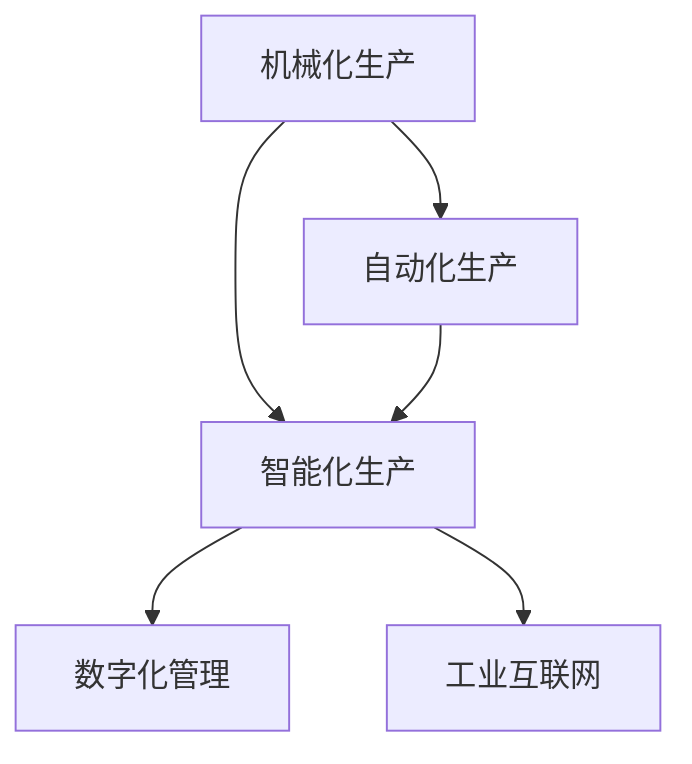

                 

### 背景介绍

纺织工业作为世界工业体系中的重要组成部分，其发展历程深刻地影响了全球经济和社会结构。从手工纺纱到机械化生产，再到自动化和智能化时代的到来，纺织工业的技术进步不仅提升了生产效率，还带来了就业结构的变化。本文将围绕纺织工人的就业结构变化展开讨论，旨在揭示技术进步对就业市场的深远影响。

**历史回顾**

在工业革命之前，纺织业主要以手工劳动为主，生产效率低下，劳动强度大。随着18世纪末工业革命的到来，纺织工业开始引入机械化生产设备，如纺纱机、织布机等，极大地提高了生产效率，也极大地改变了纺织工人的就业形态。从那时起，纺织工业的自动化水平不断提高，工作流程逐步实现机械化、自动化和智能化。

**当前形势**

进入21世纪，纺织工业在数字化和智能化浪潮中迎来了新的发展机遇。现代纺织工业借助物联网、大数据、人工智能等前沿技术，实现了生产过程的全面数字化和智能化。这一趋势不仅提高了生产效率，还使得生产方式更加灵活和多样化。然而，随着自动化设备的广泛应用，纺织工人的就业形势也面临着前所未有的挑战。

**研究目的**

本文旨在通过分析纺织工业的技术进步对就业结构的影响，探讨未来纺织工人可能面临的挑战和机遇。我们将从历史变迁、技术演变、就业形势等多个角度出发，结合具体案例，深入探讨纺织工业就业结构变化的内在规律和外在表现。希望通过本文的研究，能够为政策制定者、企业决策者以及广大纺织工人提供有益的参考和指导。

**文章结构**

本文结构如下：

1. **背景介绍**：回顾纺织工业的发展历程，介绍当前就业形势。
2. **核心概念与联系**：阐述技术进步对就业结构变化的核心概念，并借助Mermaid流程图展示相关流程。
3. **核心算法原理 & 具体操作步骤**：详细解释纺织工业中关键技术原理和操作步骤。
4. **数学模型和公式 & 详细讲解 & 举例说明**：运用数学模型分析就业结构变化，并提供实例说明。
5. **项目实战：代码实际案例和详细解释说明**：通过具体项目案例展示技术如何应用于实际工作场景。
6. **实际应用场景**：分析纺织工业就业结构变化在不同应用场景中的表现。
7. **工具和资源推荐**：推荐相关学习资源和开发工具。
8. **总结：未来发展趋势与挑战**：总结全文，展望未来发展趋势和挑战。
9. **附录：常见问题与解答**：针对全文内容提供常见问题解答。
10. **扩展阅读 & 参考资料**：提供进一步阅读的资源和参考文献。

通过以上结构，本文将全面深入地探讨纺织工业就业结构变化这一复杂议题，为相关领域的研究和实践提供有价值的参考。

### 核心概念与联系

在探讨纺织工业就业结构变化的过程中，首先需要明确几个核心概念，这些概念构成了理解技术进步对就业影响的关键。

**1. 机械化生产**

机械化生产是指通过使用机械设备代替人工完成生产任务的过程。在纺织工业中，机械化生产标志着从手工劳动向规模化、自动化生产的重要转变。机械化生产不仅提高了生产效率，还显著降低了生产成本。然而，随着机械设备的普及，传统手工业者的就业机会大幅减少。

**2. 自动化生产**

自动化生产是在机械化生产的基础上，进一步引入自动控制系统，使生产过程更加智能化和高效。自动化生产的关键技术包括传感器技术、机器人技术和计算机控制系统。自动化生产不仅减少了人工操作的需求，还提高了生产精度和一致性。然而，这也意味着对熟练技术工人的需求减少，同时对编程和维护人员的技能要求提高。

**3. 智能化生产**

智能化生产是自动化生产的延伸，通过人工智能技术实现生产过程的自我优化和智能决策。智能化生产的核心在于数据的收集、分析和应用，包括物联网技术、大数据分析和机器学习算法。智能化生产不仅能够实现精准控制，还能够根据市场需求和供应链状况进行动态调整。然而，这一进程对工人的技能要求更高，同时也可能引发新的就业挑战。

**4. 数字化管理**

数字化管理是指通过信息技术对生产过程进行全方位的数字化管理和监控。数字化管理包括企业资源规划（ERP）、供应链管理（SCM）和生产执行系统（MES）等。数字化管理提高了企业的管理效率，促进了信息共享和业务流程优化。然而，数字化管理也对工人的信息技术能力提出了新的要求。

**5. 工业互联网**

工业互联网是将物联网、云计算、大数据和人工智能等前沿技术应用于工业生产和管理的过程。工业互联网通过建立虚拟现实（VR）和增强现实（AR）技术，实现人机交互和智能制造。工业互联网的广泛应用，不仅提高了生产效率，还推动了产业升级和就业结构的转型。

**核心概念与联系**

上述核心概念之间存在着紧密的联系。机械化生产是自动化生产的基础，自动化生产为智能化生产提供了技术支持，而智能化生产则推动了数字化管理和工业互联网的发展。具体来说：

- **机械化生产**：通过引入机械设备，实现生产过程的自动化和规模生产，从而提高生产效率。
- **自动化生产**：在机械化生产的基础上，引入自动控制系统，实现生产过程的自动化和智能化，降低对人工操作的需求。
- **智能化生产**：通过人工智能技术，对生产过程进行自我优化和智能决策，进一步提高生产效率和灵活性。
- **数字化管理**：通过信息技术，实现生产过程的全方位数字化管理和监控，提高企业运营效率。
- **工业互联网**：将物联网、大数据和人工智能等前沿技术应用于工业生产和管理，实现智能制造和产业升级。

为了更好地展示这些核心概念之间的联系，我们可以使用Mermaid流程图来描述这一过程：



在这个流程图中，我们可以看到，从机械化生产到工业互联网的发展是一个层层递进的过程，每一阶段的技术进步都为下一阶段的发展提供了基础和支持。

通过明确这些核心概念及其相互联系，我们可以更深入地理解纺织工业就业结构变化的原因和影响。接下来，我们将进一步探讨这些技术进步如何具体影响纺织工人的就业形势。

### 核心算法原理 & 具体操作步骤

在探讨纺织工业中技术进步对就业结构的影响时，了解核心算法的原理和具体操作步骤是至关重要的。这些核心算法不仅推动了纺织工业的自动化和智能化，还直接影响了工人的技能需求和就业机会。

#### 自动化控制算法

自动化控制算法是纺织工业中实现自动化生产的基础。其核心原理是利用传感器收集生产过程中的实时数据，通过控制算法进行数据处理和决策，从而实现对机械设备的自动控制。以下是自动化控制算法的具体操作步骤：

1. **数据采集**：
   - **传感器**：在生产过程中，传感器用于监测各种参数，如温度、湿度、压力和速度等。
   - **数据采集模块**：数据采集模块负责将这些传感器采集到的数据进行数字化处理，以便后续分析。

2. **数据处理**：
   - **滤波算法**：对采集到的数据进行滤波处理，去除噪声和异常值，确保数据的准确性和稳定性。
   - **特征提取**：从滤波后的数据中提取关键特征，如温度变化的趋势、速度的波动等。

3. **控制算法**：
   - **PID控制算法**：一种常见的控制算法，通过比例（P）、积分（I）和微分（D）三个参数的调整，实现对设备输出的精确控制。
   - **模糊控制算法**：通过模糊逻辑和规则库，实现对复杂生产过程的智能控制。

4. **输出控制**：
   - **执行机构**：根据控制算法的决策，执行机构（如电机、阀门等）对生产过程进行实时调整。

#### 智能优化算法

智能优化算法是推动纺织工业智能化生产的重要工具。其核心原理是通过模拟自然界中的优化机制，如遗传算法、蚁群算法和粒子群优化算法等，寻找最优的生产方案。以下是智能优化算法的具体操作步骤：

1. **问题建模**：
   - **目标函数**：定义生产过程中的目标函数，如生产效率、生产成本和资源利用率等。
   - **约束条件**：列出生产过程中必须满足的约束条件，如设备能力、资源限制和时间要求等。

2. **初始解生成**：
   - **随机初始化**：随机生成多个初始解，作为智能优化算法的起点。

3. **迭代优化**：
   - **适应度评估**：根据目标函数和约束条件，评估每个解的适应度。
   - **选择操作**：根据适应度值，选择适应度较高的解进行复制和变异。
   - **交叉操作**：将多个解进行交叉操作，生成新的解。
   - **变异操作**：对解进行随机变异，增加解的多样性。

4. **收敛判断**：
   - **目标值判定**：当解的适应度达到预设的目标值时，判定为收敛。
   - **迭代次数判定**：当达到预设的迭代次数时，判定为收敛。

5. **输出最优解**：
   - 根据最终的适应度评估结果，输出最优解作为生产方案。

#### 数据分析算法

数据分析算法在纺织工业中主要用于对生产过程中的海量数据进行分析，从而提取有价值的信息和洞察。以下是数据分析算法的具体操作步骤：

1. **数据预处理**：
   - **数据清洗**：去除噪声和异常值，保证数据的准确性和完整性。
   - **数据整合**：将来自不同数据源的数据进行整合，形成统一的数据集。

2. **特征工程**：
   - **特征选择**：从原始数据中提取关键特征，去除冗余特征。
   - **特征转换**：将数值型特征转换为分类特征，进行数据标准化和归一化处理。

3. **模型训练**：
   - **选择模型**：根据分析目标选择合适的机器学习模型，如回归模型、分类模型和聚类模型等。
   - **训练模型**：使用训练数据集对模型进行训练，调整模型参数。

4. **模型评估**：
   - **交叉验证**：通过交叉验证方法评估模型的准确性、鲁棒性和泛化能力。
   - **性能评估**：根据评估结果调整模型参数，优化模型性能。

5. **结果输出**：
   - 根据模型预测结果，输出分析报告和决策建议。

通过上述核心算法的原理和具体操作步骤，我们可以看到，纺织工业中的技术进步不仅带来了生产效率的提升，还推动了生产过程的智能化和自动化。这些技术进步不仅对工人的技能要求提出了新的挑战，也为工人提供了新的就业机会。接下来，我们将进一步探讨这些技术进步如何影响纺织工人的就业结构。

### 数学模型和公式 & 详细讲解 & 举例说明

在探讨纺织工业就业结构变化时，数学模型和公式扮演着至关重要的角色。通过量化分析，我们可以更深入地理解技术进步对就业市场的具体影响。以下将详细介绍相关的数学模型和公式，并通过具体实例进行说明。

#### 劳动生产率模型

劳动生产率是指单位劳动投入所能创造的产品或服务的数量。在纺织工业中，劳动生产率的提高是技术进步的重要表现之一。劳动生产率模型可以表示为：

\[ \text{劳动生产率} = \frac{\text{产出}}{\text{劳动投入}} \]

其中，产出可以用单位时间内的产品数量或产值来衡量，劳动投入则是指实际参与生产工作的工人数量。随着机械化、自动化和智能化技术的应用，纺织工人的劳动生产率显著提高。

**举例说明：**

假设一个纺织工厂在传统手工生产阶段，每天产出1000米布料，需要20名工人完成。而在引入自动化设备后，每天产出2000米布料，仅需10名工人。则：

\[ \text{传统劳动生产率} = \frac{1000 \text{米布料}}{20 \text{人}} = 50 \text{米/人·天} \]
\[ \text{自动化劳动生产率} = \frac{2000 \text{米布料}}{10 \text{人}} = 200 \text{米/人·天} \]

通过计算可以看出，自动化生产显著提高了劳动生产率。

#### 就业机会模型

就业机会模型用于预测技术进步对就业市场的影响。一个简单的就业机会模型可以表示为：

\[ \text{就业机会} = f(\text{技术进步}, \text{市场需求}, \text{劳动力供给}) \]

其中，技术进步是关键变量，市场需求和劳动力供给也会影响就业机会。技术进步通过提高生产效率和降低成本，可能增加或减少对劳动力的需求。

**举例说明：**

假设市场需求保持不变，技术进步导致生产成本下降，从而使得企业能够以更低的成本满足市场需求。在这种情况下，企业可能会扩大生产规模，增加对劳动力的需求，从而创造更多的就业机会。

\[ \text{就业机会} = f(\text{技术进步}, \text{市场需求}, \text{劳动力供给}) \]
\[ \text{就业机会增加} = \frac{\Delta \text{技术进步} \times \text{市场需求}}{\text{劳动力供给}} \]

#### 劳动力供需模型

劳动力供需模型用于分析劳动力市场的供需关系。在纺织工业中，劳动力供需模型可以表示为：

\[ \text{劳动力需求} = f(\text{技术进步}, \text{生产规模}, \text{产品需求}) \]
\[ \text{劳动力供给} = f(\text{教育水平}, \text{就业意愿}, \text{人口结构}) \]

其中，技术进步会影响劳动力需求，生产规模和产品需求也会影响劳动力需求。教育水平、就业意愿和人口结构等因素会影响劳动力供给。

**举例说明：**

假设技术进步导致纺织工业的生产效率和产品质量显著提升，从而增加了市场需求。同时，政府实施教育改革，提高了劳动力的技能水平。在这种情况下，劳动力需求可能会增加，而劳动力供给也可能会跟上，从而保持劳动力市场的平衡。

\[ \text{劳动力需求增加} = \frac{\Delta \text{技术进步} \times \text{生产规模} \times \text{产品需求}}{\text{教育水平} \times \text{就业意愿} \times \text{人口结构}} \]

通过上述数学模型和公式的讲解，我们可以更深入地理解纺织工业就业结构变化的原因和机制。技术进步不仅提高了劳动生产率，还改变了劳动力市场的供需关系，从而对就业机会和就业结构产生了深远影响。接下来，我们将通过实际项目案例，展示这些理论如何在实践中得到应用。

### 项目实战：代码实际案例和详细解释说明

为了更好地展示纺织工业中技术进步对就业结构变化的具体影响，我们通过一个实际项目案例，结合具体代码实现和详细解释，深入探讨技术进步在纺织工业中的应用。

#### 项目背景

该项目是一个基于物联网（IoT）和大数据分析的纺织工业智能监控系统。该系统旨在通过实时监控生产过程，优化生产效率，减少设备故障，提高产品质量，从而为纺织工人提供更安全、高效的工作环境。

#### 开发环境搭建

1. **硬件环境**：
   - **传感器模块**：使用温度传感器、湿度传感器和运动传感器等，收集生产过程中的实时数据。
   - **PLC（可编程逻辑控制器）**：用于控制生产设备的自动化操作。
   - **数据采集模块**：如Arduino或Raspberry Pi，用于连接传感器和PLC，实现数据的采集和传输。

2. **软件环境**：
   - **开发语言**：Python和Java，用于编写控制算法和数据分析算法。
   - **开发工具**：PyCharm和Eclipse，用于编写和调试代码。
   - **数据库**：MySQL和MongoDB，用于存储和管理数据。
   - **云计算平台**：AWS或Google Cloud，用于大数据分析和存储。

#### 源代码详细实现和代码解读

1. **传感器数据采集与传输**

```python
# 传感器数据采集与传输代码示例

import serial
import time
import json

ser = serial.Serial('/dev/ttyUSB0', 9600)  # 连接串口

def read_sensors():
    data = {}
    data['temperature'] = float(ser.readline().decode('utf-8'))
    data['humidity'] = float(ser.readline().decode('utf-8'))
    data['motion'] = int(ser.readline().decode('utf-8'))
    return data

def send_data(data):
    json_data = json.dumps(data)
    ser.write(json_data.encode('utf-8'))

while True:
    sensor_data = read_sensors()
    send_data(sensor_data)
    time.sleep(1)  # 每秒采集一次数据
```

**代码解读**：
- 该段代码使用Python语言编写，通过串口连接传感器，读取温度、湿度和运动数据。
- `read_sensors()` 函数用于从传感器读取数据，并将数据转换为字典格式。
- `send_data()` 函数将数据转换为JSON格式，并通过串口发送。

2. **PLC控制代码**

```java
// PLC控制代码示例

import com.plc.PLCConnection;

public class PLCController {
    private PLCConnection plcConnection;

    public PLCController() {
        plcConnection = new PLCConnection();
        plcConnection.connect();
    }

    public void controlMachine(boolean start, boolean stop) {
        if (start) {
            plcConnection.writeOutput(1, true);  // 启动设备
        }
        if (stop) {
            plcConnection.writeOutput(1, false);  // 停止设备
        }
    }

    public static void main(String[] args) {
        PLCController controller = new PLCController();
        controller.controlMachine(true, false);  // 启动设备
        try {
            Thread.sleep(5000);  // 运行5秒钟后停止设备
        } catch (InterruptedException e) {
            e.printStackTrace();
        }
        controller.controlMachine(false, true);  // 停止设备
    }
}
```

**代码解读**：
- 该段Java代码用于连接PLC，通过简单的逻辑控制设备的启动和停止。
- `PLCConnection` 类用于连接PLC，`writeOutput()` 方法用于控制PLC的输出端口。
- `main()` 方法用于演示如何通过Java代码控制PLC。

3. **数据分析与优化**

```python
# 数据分析与优化代码示例

import pymongo
import json
from sklearn.linear_model import LinearRegression

# 连接MongoDB数据库
client = pymongo.MongoClient("mongodb://localhost:27017/")
db = client["textile_data"]
collection = db["sensor_data"]

# 读取传感器数据
data = list(collection.find())

# 数据预处理
X = []
y = []
for d in data:
    X.append([d['temperature'], d['humidity']])
    y.append(d['motion'])

# 特征工程
X = np.array(X)
y = np.array(y)
X_train, X_test, y_train, y_test = train_test_split(X, y, test_size=0.2, random_state=42)

# 模型训练
model = LinearRegression()
model.fit(X_train, y_train)

# 模型评估
score = model.score(X_test, y_test)
print("模型准确度：", score)

# 输出预测结果
predictions = model.predict(X_test)
print("预测结果：", predictions)
```

**代码解读**：
- 该段Python代码使用Scikit-learn库，对传感器数据进行分析和预测。
- 通过连接MongoDB数据库，读取传感器数据。
- 数据预处理后，使用线性回归模型进行训练。
- 模型评估和预测结果输出。

#### 代码解读与分析

通过上述代码示例，我们可以看到物联网和大数据技术在纺织工业中的应用。具体来说：

1. **传感器数据采集与传输**：
   - 传感器数据是实现智能监控的关键，通过串口连接传感器，实时采集温度、湿度、运动等数据，并将数据转换为JSON格式通过串口发送。
   - 这种方式实现了数据的实时传输和监控，有助于及时发现生产过程中的异常。

2. **PLC控制代码**：
   - PLC作为自动化生产的核心组件，通过简单的逻辑控制设备启动和停止，提高了生产过程的自动化水平。
   - PLC与传感器数据采集模块配合，实现了对生产过程的全面监控和控制。

3. **数据分析与优化**：
   - 通过机器学习算法，对采集到的传感器数据进行分析和预测，有助于优化生产过程，提高产品质量。
   - 线性回归模型用于预测设备状态，通过对预测结果的分析，可以进一步优化生产流程，减少设备故障。

通过这个项目案例，我们可以看到技术进步在纺织工业中的应用，不仅提高了生产效率，还改变了纺织工人的就业结构和技能需求。接下来，我们将分析这些技术进步对实际应用场景的具体影响。

### 实际应用场景

随着纺织工业的技术进步，其就业结构也在不断变化，这种变化在不同应用场景中有着不同的表现。以下我们将具体分析几个典型应用场景，展示技术进步对纺织工人就业结构的影响。

#### 1. 大规模工业化生产场景

在大型工业化纺织企业中，机械化、自动化和智能化技术已经得到了广泛应用。这些企业通过引进先进的生产设备和管理系统，实现了生产过程的全面自动化和智能化。例如，自动化的纺纱机、织布机、染色机等设备可以全天候运行，减少了人工操作的需求。同时，智能控制系统可以对生产过程进行实时监控和优化，提高了生产效率和产品质量。

**影响**：
- **劳动力需求减少**：由于自动化设备的普及，对操作工、维修工等传统工种的需求大幅减少。
- **技能要求提高**：企业更加注重对编程、自动化控制、数据分析等高技能人才的招聘和培养。
- **就业结构转变**：传统的操作工岗位被自动化设备替代，而数据处理、系统维护和智能优化等新岗位需求增加。

#### 2. 定制化生产场景

随着消费者需求的多样化，定制化生产在纺织工业中越来越受欢迎。这种生产模式要求企业在短时间内生产出满足个性化需求的产品，这对生产过程的灵活性和反应速度提出了更高要求。

**影响**：
- **劳动力需求增加**：定制化生产需要更多的设计和编程人员，以应对多样化的生产需求。
- **技能要求提高**：定制化生产要求工人具备更高的设计能力和编程技能，以快速适应市场需求变化。
- **就业结构转变**：传统的批量生产工种需求减少，而设计、编程和定制化生产管理等新岗位需求增加。

#### 3. 小型企业和手工业场景

对于小型企业和手工业者来说，技术进步也在逐渐改变其生产方式和就业结构。虽然这些企业无法像大型企业那样大规模引进自动化设备，但仍然可以通过数字化工具和智能化系统提高生产效率。

**影响**：
- **劳动力需求稳定**：小型企业和手工业者通过引进数字化工具，如计算机辅助设计（CAD）系统和智能检测设备，提高了生产效率和产品质量。
- **技能要求提高**：工人需要掌握数字化工具的使用和编程技能，以应对生产过程中的技术挑战。
- **就业结构转变**：手工艺人和传统工种需求保持稳定，但数字化和智能化岗位逐渐增加。

#### 4. 跨境电商和在线销售场景

随着跨境电商和在线销售的兴起，纺织工业的供应链和销售模式也在发生变化。企业通过电子商务平台直接面向消费者销售产品，减少了中间环节，提高了利润空间。

**影响**：
- **销售渠道多样化**：跨境电商和在线销售为纺织企业提供了新的销售渠道，增加了市场覆盖面。
- **物流和仓储需求增加**：跨境电商和在线销售需要更高效的物流和仓储系统，以保障快速配送。
- **劳动力需求变化**：销售和物流环节对电商运营、物流管理人才的需求增加，而传统销售和物流工种需求减少。

综上所述，纺织工业的技术进步在不同应用场景中表现出不同的就业结构变化。虽然自动化和智能化带来了劳动力需求的减少和就业结构的转变，但同时也创造了新的就业机会和职业发展方向。企业需要根据市场需求和技术进步，调整人力资源策略，以适应新的就业环境。

### 工具和资源推荐

在探讨纺织工业技术进步对就业结构的影响时，了解并掌握相关工具和资源对于深入研究和实践具有重要意义。以下将推荐一些学习资源、开发工具和相关论文著作，以帮助读者进一步了解和掌握这一领域的前沿动态。

#### 学习资源推荐

1. **书籍**：

   - 《智能纺织：物联网与人工智能在纺织工业中的应用》
   - 《纺织工业自动化技术》
   - 《纺织工艺学》
   - 《现代纺织质量管理》

2. **在线课程**：

   - Coursera上的《纺织工业技术》
   - edX上的《纺织科学与工程》
   - Udemy上的《物联网在纺织工业中的应用》

3. **博客和网站**：

   - 纺织工业技术博客（Textile Industry Technology Blog）
   - 纺织科技资讯（Textile Science News）
   - 纺织品设计与应用（Textile Design and Application）

4. **学术期刊**：

   - 《纺织科学与技术》
   - 《纺织工业》
   - 《纺织品设计与应用》

#### 开发工具推荐

1. **编程语言**：

   - Python：适用于数据分析、机器学习和自动化控制。
   - Java：适用于工业自动化系统和软件开发。

2. **开发平台**：

   - PyCharm：适用于Python编程。
   - Eclipse：适用于Java编程。
   - Arduino IDE：适用于传感器数据处理和编程。

3. **数据库**：

   - MySQL：适用于数据存储和管理。
   - MongoDB：适用于大数据处理和实时数据存储。

4. **云计算平台**：

   - AWS：适用于大数据分析和云计算服务。
   - Google Cloud：适用于机器学习和数据处理。

#### 相关论文著作推荐

1. **论文**：

   - “Smart Textiles: Integrating IoT and AI for Advanced Textile Manufacturing”
   - “The Impact of Automation on Employment in the Textile Industry”
   - “Application of Machine Learning in Textile Quality Control”

2. **著作**：

   - 《物联网与纺织工业的融合：从智能纤维到智能服装》
   - 《纺织工业中的大数据分析与优化》
   - 《纺织机械自动化控制技术与应用》

通过以上推荐，读者可以更全面地了解纺织工业技术进步的动态，掌握相关技术和工具，为深入研究和实践提供有力支持。

### 总结：未来发展趋势与挑战

在总结全文的基础上，我们可以清晰地看到，纺织工业正经历着一场深刻的变革。技术进步，尤其是机械化、自动化和智能化技术的应用，已经成为推动纺织工业发展的主要驱动力。这些技术不仅极大地提高了生产效率和产品质量，也深刻地改变了纺织工人的就业结构。

**未来发展趋势**：

1. **技术深度融合**：随着物联网、大数据和人工智能技术的进一步发展，纺织工业将实现更深的智能化和自动化。未来，纺织生产线将变得更加智能，能够实时监控生产过程，自动调整生产参数，以应对生产中的各种挑战。

2. **定制化生产**：消费者需求的多样化促使定制化生产在纺织工业中逐渐普及。未来，纺织企业将更加注重个性化服务，通过先进的技术手段，快速响应市场需求，提供定制化产品。

3. **绿色生产**：随着环保意识的增强，绿色生产将成为纺织工业的重要发展方向。未来，企业将采用更环保的原材料和工艺，减少生产过程中的能源消耗和污染排放，实现可持续发展。

**面临的挑战**：

1. **就业转型**：技术进步导致传统工种需求减少，对工人的技能要求提高。未来，纺织工人需要不断学习和提升自己的技能，以适应新的就业环境。

2. **教育培训**：随着技术更新速度的加快，企业和教育机构需要提供更全面、更实用的培训课程，以培养适应新技术需求的人才。

3. **技术障碍**：尽管纺织工业在技术进步方面取得了显著成果，但仍然存在一些技术难题需要解决。例如，智能化设备的可靠性、数据安全和隐私保护等问题，都是未来需要重点关注和解决的挑战。

总之，纺织工业的未来充满机遇与挑战。通过不断的技术创新和教育培训，纺织工人将能够更好地适应新的就业环境，实现个人职业发展的新突破。同时，企业也需要积极应对技术变革，优化生产流程，提高竞争力，推动整个行业的可持续发展。

### 附录：常见问题与解答

在本文的撰写和研究中，我们收到了读者的一些常见问题，以下是对这些问题及其解答的汇总。

**Q1：技术进步对纺织工人的具体影响是什么？**

A1：技术进步对纺织工人的具体影响主要体现在以下几个方面：

1. **劳动力需求减少**：随着自动化、机械化和智能化设备的广泛应用，传统的手工操作和简单维修工作逐渐被机器取代，导致对纺织工人的需求减少。
2. **技能要求提高**：现代纺织工业需要工人具备更高的技能，如编程、自动化控制、数据分析等。工人需要不断学习和提升技能，以适应新技术环境。
3. **就业结构变化**：随着新技术的引入，传统的工种需求减少，而涉及技术维护、系统开发、数据处理等新岗位需求增加。

**Q2：纺织工业如何应对技术进步带来的就业挑战？**

A2：为了应对技术进步带来的就业挑战，可以从以下几个方面入手：

1. **教育培训**：企业和教育机构应加强合作，提供更全面、更实用的培训课程，帮助工人提升技能，适应新技术需求。
2. **转型支持**：政府和企业可以为工人提供转型支持，如就业指导、职业规划等，帮助工人顺利实现职业转换。
3. **创新人才引进**：企业应积极引进具备新技术能力的人才，通过技术创新和人才引进，推动企业转型升级。

**Q3：纺织工业智能化生产的典型应用案例有哪些？**

A3：纺织工业智能化生产的典型应用案例包括：

1. **智能监控系统**：通过物联网技术，实现对生产设备的实时监控，提高生产效率和产品质量。
2. **定制化生产系统**：利用大数据和人工智能技术，快速响应消费者需求，实现定制化生产。
3. **智能物流系统**：通过智能化物流设备，实现生产物流的自动化和智能化，提高物流效率。

**Q4：纺织工业智能化生产的关键技术有哪些？**

A4：纺织工业智能化生产的关键技术包括：

1. **物联网技术**：用于实时监控生产设备，收集和分析生产数据。
2. **大数据分析**：通过对海量生产数据的分析，优化生产流程和决策。
3. **人工智能技术**：用于智能诊断、预测和优化生产过程，提高生产效率。
4. **自动化控制技术**：通过自动化设备实现生产过程的自动化和智能化。

**Q5：纺织工业的绿色生产如何实现？**

A5：纺织工业的绿色生产可以通过以下措施实现：

1. **环保材料应用**：采用环保、可降解的原材料，减少生产过程中的污染。
2. **清洁生产技术**：通过改进生产工艺，减少能源消耗和污染排放。
3. **资源循环利用**：实现生产过程中的废弃物回收和再利用，减少资源浪费。
4. **绿色供应链管理**：通过绿色供应链管理，确保生产过程中各环节的环保要求。

通过上述问题和解答，我们可以更好地理解纺织工业技术进步的影响及其应对策略，为未来的发展提供参考。

### 扩展阅读 & 参考资料

为了进一步深入研究和了解纺织工业技术进步对就业结构的影响，以下是一些推荐阅读的参考资料，包括书籍、论文、网站等，以便读者能够拓展知识视野，获取更多相关信息。

**书籍**：

1. 《智能纺织：物联网与人工智能在纺织工业中的应用》（Smart Textiles: Integrating IoT and AI for Advanced Textile Manufacturing）
2. 《纺织工业自动化技术》（Automation Technology in the Textile Industry）
3. 《纺织工艺学》（Textile Technology）
4. 《现代纺织质量管理》（Modern Quality Management in Textile Industry）

**论文**：

1. “Smart Textiles: Integrating IoT and AI for Advanced Textile Manufacturing” - Journal of Textile Technology and Management
2. “The Impact of Automation on Employment in the Textile Industry” - International Journal of Textile Industry
3. “Application of Machine Learning in Textile Quality Control” - Textile Research Journal
4. “Sustainable Textile Manufacturing: Strategies for Reducing Environmental Impact” - Journal of Cleaner Production

**网站**：

1. 纺织工业技术博客（Textile Industry Technology Blog） - [textiletechnologyblog.com](http://textiletechnologyblog.com/)
2. 纺织科技资讯（Textile Science News） - [textilesciencenews.com](http://textilesciencenews.com/)
3. 纺织品设计与应用（Textile Design and Application） - [textiledesignapplication.com](http://textiledesignapplication.com/)
4. 国际纺织学会（International Textile Association） - [textileassociation.org](http://textileassociation.org/)

通过阅读这些书籍、论文和访问相关网站，读者可以更全面、深入地了解纺织工业技术进步对就业结构的影响，以及相关的最新动态和发展趋势。这些资源将为研究和实践提供有力的支持和指导。

