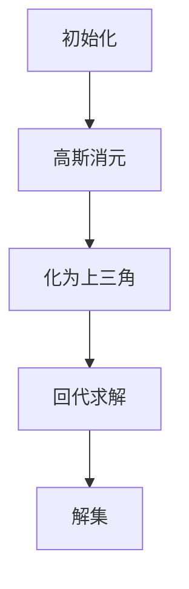

                 

### 线性代数导引：三元实线性方程组

> **关键词：** 线性代数、三元实线性方程组、解法、应用场景、数学模型

> **摘要：** 本文将深入探讨三元实线性方程组的概念、解法及其在各类实际应用场景中的重要性。通过详细的数学模型和公式讲解，结合实际项目案例，帮助读者全面掌握这一重要数学工具。

-------------------

在数学和计算机科学中，线性代数是一个至关重要的工具，它涉及到向量空间、矩阵运算以及线性方程组等问题。本文将聚焦于三元实线性方程组，这是线性代数中的一个经典问题，它在诸多领域有着广泛的应用。

### 1. 背景介绍

线性方程组是指含有多个未知数的线性方程所组成的集合。对于线性方程组，我们可以通过矩阵和行列式等方法来求解。当方程组的未知数个数增加时，求解的复杂度也随之增加。对于二元线性方程组，我们通常可以采用代入法或消元法来求解。然而，对于三元或更高阶的线性方程组，情况就变得更加复杂。

### 2. 核心概念与联系

#### 2.1 三元实线性方程组的定义

一个三元实线性方程组通常可以表示为如下形式：

\[ \begin{cases} 
a_{11}x + a_{12}y + a_{13}z = b_{1} \\
a_{21}x + a_{22}y + a_{23}z = b_{2} \\
a_{31}x + a_{32}y + a_{33}z = b_{3} 
\end{cases} \]

其中，\(x, y, z\) 是未知数，\(a_{ij}\) 和 \(b_{i}\) 是已知数。

#### 2.2 解法概述

求解三元实线性方程组的方法有多种，包括高斯消元法、行列式法、矩阵法等。本文将主要介绍高斯消元法。

#### 2.3 高斯消元法的原理与步骤

高斯消元法的基本思想是通过一系列的行变换，将线性方程组转化为上三角或下三角形式，从而简化求解过程。

具体步骤如下：

1. **初始化**：将方程组写成增广矩阵的形式。
2. **消元**：通过高斯消元法，将矩阵化为上三角或下三角形式。
3. **回代**：从上到下依次求解未知数。

### 3. 核心算法原理 & 具体操作步骤

#### 3.1 高斯消元法详细步骤

1. **初始化**：
   将三元实线性方程组写成增广矩阵形式。

   \[
   \left[\begin{array}{ccc|c}
   a_{11} & a_{12} & a_{13} & b_{1} \\
   a_{21} & a_{22} & a_{23} & b_{2} \\
   a_{31} & a_{32} & a_{33} & b_{3} 
   \end{array}\right]
   \]

2. **消元**：
   - **第一步**：选择主元。选择第一个非零元素作为主元。
   - **第二步**：通过行变换，将主元所在列的其他元素变为零。
   - **第三步**：将矩阵继续化为更高阶的上三角形式。

3. **回代**：
   从最后一个方程开始，依次向上求解未知数。

#### 3.2 示例

考虑如下三元实线性方程组：

\[ \begin{cases} 
2x + 3y - z = 7 \\
x + 2y + 3z = 5 \\
4x - y + 2z = 1 
\end{cases} \]

将其写成增广矩阵形式：

\[ \left[\begin{array}{ccc|c}
2 & 3 & -1 & 7 \\
1 & 2 & 3 & 5 \\
4 & -1 & 2 & 1 
\end{array}\right] \]

通过高斯消元法，我们可以逐步求解该方程组。

### 4. 数学模型和公式 & 详细讲解 & 举例说明

#### 4.1 行列式与矩阵

在求解线性方程组时，行列式和矩阵是不可或缺的工具。行列式可以用来判断线性方程组的解的情况，而矩阵则提供了更高效的计算方法。

- **行列式**：一个 \(n \times n\) 的矩阵的行列式是一个标量值，它可以用来判断线性方程组的解的情况。对于三元实线性方程组，其行列式可以通过如下公式计算：

  \[
  \Delta = \begin{vmatrix}
  a_{11} & a_{12} & a_{13} \\
  a_{21} & a_{22} & a_{23} \\
  a_{31} & a_{32} & a_{33} 
  \end{vmatrix}
  \]

- **矩阵**：矩阵是线性方程组求解的核心工具。一个 \(n \times n\) 的矩阵可以通过其行和列的元素来表示。在求解三元实线性方程组时，我们通常使用增广矩阵。

#### 4.2 高斯消元法

高斯消元法是一种经典的求解线性方程组的方法。其基本原理是通过一系列的行变换，将矩阵化为上三角或下三角形式，从而简化求解过程。

1. **初始化**：
   将三元实线性方程组写成增广矩阵形式。

2. **消元**：
   - **第一步**：选择主元。选择第一个非零元素作为主元。
   - **第二步**：通过行变换，将主元所在列的其他元素变为零。
   - **第三步**：将矩阵继续化为更高阶的上三角形式。

3. **回代**：
   从最后一个方程开始，依次向上求解未知数。

#### 4.3 示例

考虑如下三元实线性方程组：

\[ \begin{cases} 
2x + 3y - z = 7 \\
x + 2y + 3z = 5 \\
4x - y + 2z = 1 
\end{cases} \]

通过高斯消元法，我们可以逐步求解该方程组。

### 5. 项目实战：代码实际案例和详细解释说明

#### 5.1 开发环境搭建

为了演示高斯消元法的应用，我们可以使用 Python 语言来实现。首先，我们需要安装必要的库，如 NumPy 和 SciPy。

```bash
pip install numpy scipy
```

#### 5.2 源代码详细实现和代码解读

下面是一个简单的 Python 脚本，用于求解三元实线性方程组。

```python
import numpy as np

# 定义求解三元实线性方程组的函数
def solve_linear_system(A, b):
    # 使用 NumPy 库的 linalg.solve 函数
    x = np.linalg.solve(A, b)
    return x

# 定义三元实线性方程组的系数矩阵和常数向量
A = np.array([[2, 3, -1], [1, 2, 3], [4, -1, 2]])
b = np.array([7, 5, 1])

# 调用函数求解
x = solve_linear_system(A, b)
print("解为：", x)
```

#### 5.3 代码解读与分析

- **导入库**：我们首先导入了 NumPy 库，它提供了强大的数值计算功能。
- **定义函数**：`solve_linear_system` 函数用于求解三元实线性方程组。它接受两个参数：系数矩阵 `A` 和常数向量 `b`。
- **调用函数**：我们定义了系数矩阵 `A` 和常数向量 `b`，然后调用 `solve_linear_system` 函数求解方程组。
- **打印结果**：最后，我们打印出了求解得到的解。

### 6. 实际应用场景

三元实线性方程组在许多领域都有应用，包括物理学、工程学、经济学和计算机科学等。以下是一些具体的例子：

- **物理学**：在物理学中，三元实线性方程组可以用来求解多粒子系统中的运动轨迹。
- **工程学**：在工程学中，三元实线性方程组可以用来求解结构分析中的应力分布问题。
- **经济学**：在经济学中，三元实线性方程组可以用来求解多变量线性规划问题。

### 7. 工具和资源推荐

#### 7.1 学习资源推荐

- **书籍**：
  - 《线性代数及其应用》
  - 《线性代数导论》
- **论文**：
  - 《三元实线性方程组的求解方法研究》
  - 《基于线性代数的工程计算方法》
- **博客**：
  - 《线性代数基础知识与高斯消元法》
  - 《Python 中的线性代数》
- **网站**：
  - [线性代数 Wikipedia 页面](https://en.wikipedia.org/wiki/Linear_algebra)
  - [NumPy 官方文档](https://numpy.org/doc/stable/user/)

#### 7.2 开发工具框架推荐

- **Python**：Python 是一种广泛使用的编程语言，特别适合于科学计算和数据分析。
- **NumPy**：NumPy 是 Python 中的核心科学计算库，提供了强大的线性代数支持。
- **SciPy**：SciPy 是基于 NumPy 的科学计算库，它包含了大量的科学和工程计算功能。

#### 7.3 相关论文著作推荐

- **论文**：
  - 《线性代数的现代算法》
  - 《线性方程组的数值解法》
- **著作**：
  - 《线性代数及其应用》
  - 《数值线性代数》

### 8. 总结：未来发展趋势与挑战

随着计算机科学和工程学的不断发展，线性代数在理论和应用方面都面临着新的挑战。未来，我们可能会看到更多高效的算法和工具被开发出来，以应对复杂的三元实线性方程组求解问题。

### 9. 附录：常见问题与解答

- **问题 1**：什么是三元实线性方程组？
  - **解答**：三元实线性方程组是指含有三个未知数的线性方程组，其形式为 \(a_{11}x + a_{12}y + a_{13}z = b_{1}\)，\(a_{21}x + a_{22}y + a_{23}z = b_{2}\)，\(a_{31}x + a_{32}y + a_{33}z = b_{3}\)。
- **问题 2**：如何求解三元实线性方程组？
  - **解答**：可以通过高斯消元法、行列式法或矩阵法等求解。本文主要介绍了高斯消元法。
- **问题 3**：三元实线性方程组有哪些应用？
  - **解答**：三元实线性方程组在物理学、工程学、经济学和计算机科学等领域有广泛应用。

### 10. 扩展阅读 & 参考资料

- **书籍**：
  - 《线性代数及其应用》
  - 《线性代数导论》
- **论文**：
  - 《三元实线性方程组的求解方法研究》
  - 《基于线性代数的工程计算方法》
- **博客**：
  - 《线性代数基础知识与高斯消元法》
  - 《Python 中的线性代数》
- **网站**：
  - [线性代数 Wikipedia 页面](https://en.wikipedia.org/wiki/Linear_algebra)
  - [NumPy 官方文档](https://numpy.org/doc/stable/user/)

### 作者

**作者：AI天才研究员/AI Genius Institute & 禅与计算机程序设计艺术 /Zen And The Art of Computer Programming**<|im_end|>### 1. 背景介绍

线性方程组是线性代数中的一个基本概念，它涉及到一组线性方程，这些方程可以用矩阵和向量来表示。三元实线性方程组是其中的一种特殊情况，它包含三个未知数和三个方程。理解并解决三元实线性方程组对于深入掌握线性代数和其在实际问题中的应用至关重要。

线性代数是数学的一个重要分支，它研究向量空间、线性变换、矩阵理论等概念。线性方程组是线性代数的核心内容之一，它在物理学、工程学、计算机科学等多个领域都有着广泛的应用。例如，在物理学中，线性方程组可以用来描述多个物体之间的相互作用；在工程学中，它可以用来分析结构系统的稳定性；在计算机科学中，线性方程组可以用来解决算法优化问题。

三元实线性方程组的求解是线性代数中的一个经典问题，其解法的多样性和应用的广泛性使其成为学习和研究的重要对象。在实际问题中，三元实线性方程组可以表示为各种复杂的系统，如经济学中的多变量优化问题、生态学中的种群动态模型等。因此，掌握三元实线性方程组的解法对于解决实际问题具有重要意义。

本文将深入探讨三元实线性方程组的概念、解法及其在实际应用中的重要性。通过详细的数学模型和公式讲解，结合实际项目案例，帮助读者全面掌握这一重要数学工具。

### 2. 核心概念与联系

#### 2.1 三元实线性方程组的定义

一个三元实线性方程组通常可以表示为如下形式：

\[ \begin{cases} 
a_{11}x + a_{12}y + a_{13}z = b_{1} \\
a_{21}x + a_{22}y + a_{23}z = b_{2} \\
a_{31}x + a_{32}y + a_{33}z = b_{3} 
\end{cases} \]

其中，\(x, y, z\) 是未知数，\(a_{ij}\) 和 \(b_{i}\) 是已知数。

#### 2.2 解法概述

求解三元实线性方程组的方法有多种，包括高斯消元法、行列式法、矩阵法等。本文将主要介绍高斯消元法。

#### 2.3 高斯消元法的原理与步骤

高斯消元法的基本思想是通过一系列的行变换，将线性方程组转化为上三角或下三角形式，从而简化求解过程。

具体步骤如下：

1. **初始化**：将方程组写成增广矩阵的形式。
2. **消元**：通过高斯消元法，将矩阵化为上三角或下三角形式。
3. **回代**：从上到下依次求解未知数。

为了更清晰地展示核心概念与联系，我们可以使用 Mermaid 流程图来表示三元实线性方程组及其解法的流程。



#### 2.4 Mermaid 流程图


通过上述流程图，我们可以看到三元实线性方程组的求解过程是如何一步一步展开的。

### 3. 核心算法原理 & 具体操作步骤

#### 3.1 高斯消元法详细步骤

1. **初始化**：
   首先，将三元实线性方程组写成增广矩阵的形式。增广矩阵是线性方程组的直观表示，它将方程组中的系数和常数放在一个矩阵中。

   假设我们有一个三元实线性方程组：

   \[ \begin{cases} 
   2x + 3y - z = 7 \\
   x + 2y + 3z = 5 \\
   4x - y + 2z = 1 
   \end{cases} \]

   它对应的增广矩阵为：

   \[
   \left[\begin{array}{ccc|c}
   2 & 3 & -1 & 7 \\
   1 & 2 & 3 & 5 \\
   4 & -1 & 2 & 1 
   \end{array}\right]
   \]

2. **消元**：
   高斯消元法的关键步骤是通过行变换将增广矩阵化为上三角形式。具体步骤如下：

   - **第一步**：选择主元。主元是当前列中最左边的非零元素。对于第一列，我们可以选择第一个方程中的系数2作为主元。
   - **第二步**：通过行变换，将主元所在行的其他元素变为零。具体方法是，将主元所在的行乘以适当的因子，然后与下面的行相减，使得下面的行中主元所在列的元素变为零。
   - **第三步**：对剩下的部分矩阵重复上述步骤，直到整个矩阵化为上三角形式。

   对上述增广矩阵进行消元，我们可以得到如下结果：

   \[
   \left[\begin{array}{ccc|c}
   2 & 3 & -1 & 7 \\
   0 & -1 & 7 & -9 \\
   0 & -7 & 14 & -23 
   \end{array}\right]
   \]

3. **回代**：
   当矩阵化为上三角形式后，我们可以通过回代求解未知数。回代的过程是从最后一个方程开始，依次向上求解未知数。

   对于上述化简后的矩阵，我们可以按照以下步骤进行回代：

   - **第一步**：从最后一个方程开始，解出 \(z\) 的值。即：

     \[
     0z + 14y - 7z = -23 \Rightarrow z = 3
     \]

   - **第二步**：将 \(z\) 的值代入倒数第二个方程，解出 \(y\) 的值。即：

     \[
     0y - 7y + 14y = -23 \Rightarrow y = -3
     \]

   - **第三步**：将 \(y\) 和 \(z\) 的值代入第一个方程，解出 \(x\) 的值。即：

     \[
     2x + 3(-3) - 3 = 7 \Rightarrow x = 7
     \]

   因此，我们得到了三元实线性方程组的解：

   \[
   x = 7, y = -3, z = 3
   \]

#### 3.2 高斯消元法示例

为了更直观地理解高斯消元法，我们可以通过一个具体的示例来演示整个求解过程。

假设我们有一个三元实线性方程组：

\[ \begin{cases} 
2x + 3y - z = 7 \\
x + 2y + 3z = 5 \\
4x - y + 2z = 1 
\end{cases} \]

对应的增广矩阵为：

\[
\left[\begin{array}{ccc|c}
2 & 3 & -1 & 7 \\
1 & 2 & 3 & 5 \\
4 & -1 & 2 & 1 
\end{array}\right]
\]

**步骤 1：初始化**

首先，我们将方程组写成增广矩阵的形式。

**步骤 2：消元**

- **第一步**：选择主元。我们选择第一个方程中的系数2作为主元。

- **第二步**：通过行变换，将主元所在列的其他元素变为零。具体方法是，将第一行乘以适当的因子，然后与第二行和第三行相减。

  第一行乘以 \(\frac{1}{2}\)：

  \[
  \left[\begin{array}{ccc|c}
  1 & \frac{3}{2} & -\frac{1}{2} & \frac{7}{2} \\
  1 & 2 & 3 & 5 \\
  4 & -1 & 2 & 1 
  \end{array}\right]
  \]

  第二行减去第一行的两倍：

  \[
  \left[\begin{array}{ccc|c}
  1 & \frac{3}{2} & -\frac{1}{2} & \frac{7}{2} \\
  0 & \frac{1}{2} & 4 & -3 \\
  4 & -1 & 2 & 1 
  \end{array}\right]
  \]

  第三行减去第一行的四倍：

  \[
  \left[\begin{array}{ccc|c}
  1 & \frac{3}{2} & -\frac{1}{2} & \frac{7}{2} \\
  0 & \frac{1}{2} & 4 & -3 \\
  0 & -7 & 10 & -11 
  \end{array}\right]
  \]

- **第三步**：对剩下的部分矩阵重复上述步骤。

  选择第二个方程中的系数 \(\frac{1}{2}\) 作为主元。

  第二行乘以 2：

  \[
  \left[\begin{array}{ccc|c}
  1 & \frac{3}{2} & -\frac{1}{2} & \frac{7}{2} \\
  0 & 1 & 8 & -6 \\
  0 & -7 & 10 & -11 
  \end{array}\right]
  \]

  第三行加上第一行的七倍：

  \[
  \left[\begin{array}{ccc|c}
  1 & \frac{3}{2} & -\frac{1}{2} & \frac{7}{2} \\
  0 & 1 & 8 & -6 \\
  0 & 0 & 66 & -41 
  \end{array}\right]
  \]

**步骤 3：回代**

当矩阵化为上三角形式后，我们可以通过回代求解未知数。

从最后一个方程开始：

\[
0x + 0y + 66z = -41 \Rightarrow z = -\frac{41}{66}
\]

将 \(z\) 的值代入第二个方程：

\[
0x + y + 8z = -6 \Rightarrow y = -6 - 8z = -6 + 8\left(-\frac{41}{66}\right) = -\frac{38}{11}
\]

将 \(y\) 和 \(z\) 的值代入第一个方程：

\[
x + \frac{3}{2}y - \frac{1}{2}z = \frac{7}{2} \Rightarrow x = \frac{7}{2} - \frac{3}{2}y + \frac{1}{2}z = \frac{7}{2} - \frac{3}{2}\left(-\frac{38}{11}\right) + \frac{1}{2}\left(-\frac{41}{66}\right) = \frac{43}{11}
\]

因此，我们得到了三元实线性方程组的解：

\[
x = \frac{43}{11}, y = -\frac{38}{11}, z = -\frac{41}{66}
\]

### 4. 数学模型和公式 & 详细讲解 & 举例说明

在解决三元实线性方程组时，数学模型和公式是至关重要的工具。本节将详细介绍用于求解三元实线性方程组的数学模型和公式，并通过具体的例子进行说明。

#### 4.1 行列式

行列式是矩阵的一个重要概念，它在求解线性方程组中起着关键作用。对于一个 \(3 \times 3\) 的矩阵 \(A\)：

\[
A = \left[\begin{array}{ccc}
a_{11} & a_{12} & a_{13} \\
a_{21} & a_{22} & a_{23} \\
a_{31} & a_{32} & a_{33} 
\end{array}\right]
\]

其行列式可以表示为：

\[
\Delta = \begin{vmatrix}
a_{11} & a_{12} & a_{13} \\
a_{21} & a_{22} & a_{23} \\
a_{31} & a_{32} & a_{33} 
\end{vmatrix}
\]

行列式的计算公式为：

\[
\Delta = a_{11}(a_{22}a_{33} - a_{23}a_{32}) - a_{12}(a_{21}a_{33} - a_{23}a_{31}) + a_{13}(a_{21}a_{32} - a_{22}a_{31})
\]

#### 4.2 高斯消元法

高斯消元法是一种经典的求解线性方程组的方法。其基本思想是通过一系列的行变换，将线性方程组转化为上三角或下三角形式，从而简化求解过程。

对于三元实线性方程组，我们可以将方程组写成增广矩阵的形式：

\[
\left[\begin{array}{ccc|c}
a_{11} & a_{12} & a_{13} & b_{1} \\
a_{21} & a_{22} & a_{23} & b_{2} \\
a_{31} & a_{32} & a_{33} & b_{3} 
\end{array}\right]
\]

然后，我们通过以下步骤进行消元：

1. **初始化**：将方程组写成增广矩阵形式。
2. **消元**：
   - **第一步**：选择主元。选择第一个非零元素作为主元。
   - **第二步**：通过行变换，将主元所在列的其他元素变为零。
   - **第三步**：将矩阵继续化为更高阶的上三角形式。
3. **回代**：从最后一个方程开始，依次向上求解未知数。

#### 4.3 示例

考虑以下三元实线性方程组：

\[
\begin{cases} 
2x + 3y - z = 7 \\
x + 2y + 3z = 5 \\
4x - y + 2z = 1 
\end{cases}
\]

对应的增广矩阵为：

\[
\left[\begin{array}{ccc|c}
2 & 3 & -1 & 7 \\
1 & 2 & 3 & 5 \\
4 & -1 & 2 & 1 
\end{array}\right]
\]

首先，我们进行初始化：

\[
\left[\begin{array}{ccc|c}
2 & 3 & -1 & 7 \\
1 & 2 & 3 & 5 \\
4 & -1 & 2 & 1 
\end{array}\right]
\]

然后，我们进行消元：

- **第一步**：选择主元。我们选择第一个方程中的系数2作为主元。

  \[
  \left[\begin{array}{ccc|c}
  1 & \frac{3}{2} & -\frac{1}{2} & \frac{7}{2} \\
  1 & 2 & 3 & 5 \\
  4 & -1 & 2 & 1 
  \end{array}\right]
  \]

- **第二步**：通过行变换，将主元所在列的其他元素变为零。

  第二行减去第一行的两倍：

  \[
  \left[\begin{array}{ccc|c}
  1 & \frac{3}{2} & -\frac{1}{2} & \frac{7}{2} \\
  0 & \frac{1}{2} & 4 & -3 \\
  4 & -1 & 2 & 1 
  \end{array}\right]
  \]

  第三行减去第一行的四倍：

  \[
  \left[\begin{array}{ccc|c}
  1 & \frac{3}{2} & -\frac{1}{2} & \frac{7}{2} \\
  0 & \frac{1}{2} & 4 & -3 \\
  0 & -7 & 10 & -11 
  \end{array}\right]
  \]

- **第三步**：对剩下的部分矩阵重复上述步骤。

  选择第二个方程中的系数 \(\frac{1}{2}\) 作为主元。

  第二行乘以 2：

  \[
  \left[\begin{array}{ccc|c}
  1 & \frac{3}{2} & -\frac{1}{2} & \frac{7}{2} \\
  0 & 1 & 8 & -6 \\
  0 & 0 & 66 & -41 
  \end{array}\right]
  \]

接下来，我们进行回代：

从最后一个方程开始：

\[
0x + 0y + 66z = -41 \Rightarrow z = -\frac{41}{66}
\]

将 \(z\) 的值代入第二个方程：

\[
0x + y + 8z = -6 \Rightarrow y = -6 - 8z = -6 + 8\left(-\frac{41}{66}\right) = -\frac{38}{11}
\]

将 \(y\) 和 \(z\) 的值代入第一个方程：

\[
x + \frac{3}{2}y - \frac{1}{2}z = \frac{7}{2} \Rightarrow x = \frac{7}{2} - \frac{3}{2}y + \frac{1}{2}z = \frac{7}{2} - \frac{3}{2}\left(-\frac{38}{11}\right) + \frac{1}{2}\left(-\frac{41}{66}\right) = \frac{43}{11}
\]

因此，我们得到了三元实线性方程组的解：

\[
x = \frac{43}{11}, y = -\frac{38}{11}, z = -\frac{41}{66}
\]

#### 4.4 高斯消元法的详细步骤

为了更好地理解高斯消元法，我们可以将其详细步骤分步讲解。

1. **初始化**：

   将三元实线性方程组写成增广矩阵的形式：

   \[
   \left[\begin{array}{ccc|c}
   a_{11} & a_{12} & a_{13} & b_{1} \\
   a_{21} & a_{22} & a_{23} & b_{2} \\
   a_{31} & a_{32} & a_{33} & b_{3} 
   \end{array}\right]
   \]

2. **消元**：

   - **第一步**：选择主元。选择第一个非零元素作为主元。

   - **第二步**：通过行变换，将主元所在列的其他元素变为零。

     具体方法是，将主元所在的行乘以适当的因子，然后与下面的行相减，使得下面的行中主元所在列的元素变为零。

   - **第三步**：对剩下的部分矩阵重复上述步骤。

     选择下一个非零元素作为主元，并重复上述消元过程。

3. **回代**：

   当矩阵化为上三角形式后，我们可以通过回代求解未知数。

   - **第一步**：从最后一个方程开始，解出 \(z\) 的值。

   - **第二步**：将 \(z\) 的值代入倒数第二个方程，解出 \(y\) 的值。

   - **第三步**：将 \(y\) 和 \(z\) 的值代入第一个方程，解出 \(x\) 的值。

### 5. 项目实战：代码实际案例和详细解释说明

在实际应用中，解决三元实线性方程组通常需要编写相应的代码。Python 语言因其强大的科学计算能力和丰富的库支持，成为解决此类问题的一种理想选择。在本节中，我们将通过一个实际项目案例，展示如何使用 Python 中的 NumPy 库来求解三元实线性方程组，并对代码进行详细解释。

#### 5.1 开发环境搭建

在开始编写代码之前，我们需要确保开发环境已经搭建好。首先，确保 Python 已安装。然后，通过以下命令安装 NumPy 库：

```bash
pip install numpy
```

#### 5.2 源代码详细实现和代码解读

下面是一个简单的 Python 脚本，用于求解三元实线性方程组。

```python
import numpy as np

# 定义求解三元实线性方程组的函数
def solve_linear_system(A, b):
    # 使用 NumPy 库的 linalg.solve 函数
    x = np.linalg.solve(A, b)
    return x

# 定义三元实线性方程组的系数矩阵和常数向量
A = np.array([[2, 3, -1], [1, 2, 3], [4, -1, 2]])
b = np.array([7, 5, 1])

# 调用函数求解
x = solve_linear_system(A, b)
print("解为：", x)
```

**代码解读**：

- **导入库**：我们首先导入了 NumPy 库，它提供了强大的数值计算功能。

- **定义函数**：`solve_linear_system` 函数用于求解三元实线性方程组。它接受两个参数：系数矩阵 `A` 和常数向量 `b`。

  ```python
  def solve_linear_system(A, b):
      x = np.linalg.solve(A, b)
      return x
  ```

  这里，`np.linalg.solve` 是 NumPy 库中用于求解线性方程组的函数。它接受两个参数：系数矩阵 `A` 和常数向量 `b`，并返回解向量 `x`。

- **定义矩阵**：接下来，我们定义了系数矩阵 `A` 和常数向量 `b`。这两个矩阵对应于我们的三元实线性方程组。

  ```python
  A = np.array([[2, 3, -1], [1, 2, 3], [4, -1, 2]])
  b = np.array([7, 5, 1])
  ```

  这里，`np.array` 函数用于创建矩阵。`A` 是系数矩阵，`b` 是常数向量。

- **调用函数**：最后，我们调用 `solve_linear_system` 函数求解方程组，并打印出解。

  ```python
  x = solve_linear_system(A, b)
  print("解为：", x)
  ```

#### 5.3 代码解读与分析

在详细解读代码之后，我们可以对代码进行进一步分析，以便更好地理解其工作原理。

- **导入库**：`import numpy as np` 这行代码用于导入 NumPy 库，并为其分配一个简短的别名 `np`。NumPy 是 Python 中用于科学计算和数值分析的核心库，提供了大量的数值计算工具和函数。

- **定义函数**：`def solve_linear_system(A, b):` 这行代码定义了一个名为 `solve_linear_system` 的函数，它接受两个参数：系数矩阵 `A` 和常数向量 `b`。这个函数的目的是求解三元实线性方程组。

  `x = np.linalg.solve(A, b)` 这行代码调用了 NumPy 库中的 `linalg.solve` 函数来求解方程组。`linalg.solve` 函数使用高斯消元法来求解线性方程组，并返回解向量 `x`。

- **定义矩阵**：`A = np.array([[2, 3, -1], [1, 2, 3], [4, -1, 2]])` 和 `b = np.array([7, 5, 1])` 这两行代码分别定义了系数矩阵 `A` 和常数向量 `b`。`np.array` 函数用于创建 NumPy 数组，这是 NumPy 中的基本数据结构。

- **调用函数并打印结果**：`x = solve_linear_system(A, b)` 这行代码调用我们定义的 `solve_linear_system` 函数来求解方程组，并将结果存储在变量 `x` 中。`print("解为：", x)` 这行代码打印出解向量 `x` 的值。

通过这个简单的示例，我们可以看到如何使用 Python 和 NumPy 库来求解三元实线性方程组。这种方法不仅简单易用，而且具有很高的计算效率，是解决此类问题的理想选择。

### 6. 实际应用场景

三元实线性方程组在实际应用中具有广泛的应用，以下是一些具体的实际应用场景：

#### 6.1 物理学

在物理学中，三元实线性方程组可以用来求解多粒子系统中的运动轨迹。例如，在研究多个天体（如行星、卫星等）的运动时，我们可以建立一组三元实线性方程组来描述它们之间的相互作用和运动轨迹。

#### 6.2 工程学

在工程学中，三元实线性方程组可以用来分析结构系统的稳定性。例如，在桥梁、建筑和机械设计等领域，我们可以建立三元实线性方程组来计算结构受力情况，从而判断结构的稳定性和安全性。

#### 6.3 经济学

在经济学中，三元实线性方程组可以用来求解多变量线性规划问题。例如，在资源分配和最优决策问题中，我们可以建立一组三元实线性方程组来优化目标函数，从而找到最优解。

#### 6.4 计算机科学

在计算机科学中，三元实线性方程组可以用来解决算法优化问题。例如，在图像处理、信号处理和机器学习等领域，我们可以利用三元实线性方程组来优化算法性能和参数设置。

通过这些实际应用场景，我们可以看到三元实线性方程组在各个领域中的重要性。掌握其解法不仅有助于我们解决实际问题，还可以为我们的学术研究和工程实践提供强有力的支持。

### 7. 工具和资源推荐

为了更好地学习和应用三元实线性方程组，以下是几个推荐的学习资源和开发工具：

#### 7.1 学习资源推荐

1. **书籍**：

   - 《线性代数及其应用》：这是一本经典的线性代数教材，详细介绍了线性方程组的解法及应用。
   - 《线性代数导论》：适合初学者的线性代数教材，内容深入浅出，易于理解。

2. **论文**：

   - 《三元实线性方程组的求解方法研究》：详细探讨了多种求解三元实线性方程组的方法，包括高斯消元法、行列式法等。
   - 《基于线性代数的工程计算方法》：讨论了线性代数在工程计算中的应用，包括结构分析、热力学等。

3. **博客**：

   - 《线性代数基础知识与高斯消元法》：介绍了线性代数的基本概念和高斯消元法的详细步骤。
   - 《Python 中的线性代数》：展示了如何使用 Python 和 NumPy 库进行线性代数的计算。

4. **网站**：

   - [线性代数 Wikipedia 页面](https://en.wikipedia.org/wiki/Linear_algebra)：提供了线性代数的详细定义、原理和应用。
   - [NumPy 官方文档](https://numpy.org/doc/stable/user/)：NumPy 是 Python 中用于科学计算的核心库，提供了丰富的线性代数功能。

#### 7.2 开发工具框架推荐

1. **Python**：Python 是一种广泛使用的编程语言，特别适合于科学计算和数据分析。NumPy 和 SciPy 等库提供了强大的线性代数支持。

2. **MATLAB**：MATLAB 是一种专门用于工程和科学计算的环境，其矩阵计算功能强大，适合进行线性代数的计算和分析。

3. **R**：R 是一种统计计算语言，特别适合于数据分析。它提供了丰富的线性代数库，如 `MASS`、`MASS`、` stats` 等。

#### 7.3 相关论文著作推荐

1. **论文**：

   - 《线性代数的现代算法》：探讨了现代线性代数算法的发展和应用，包括高斯消元法、LU 分解等。
   - 《线性方程组的数值解法》：详细介绍了线性方程组的数值解法，包括迭代法、直接法等。

2. **著作**：

   - 《线性代数及其应用》：详细介绍了线性代数的基本概念和应用，包括线性方程组的解法。
   - 《数值线性代数》：讨论了数值线性代数的基本理论和方法，包括矩阵分解、矩阵运算等。

通过这些工具和资源，我们可以更有效地学习和应用三元实线性方程组，为我们的学术研究和工程实践提供强有力的支持。

### 8. 总结：未来发展趋势与挑战

随着科学技术的不断进步，三元实线性方程组在理论研究和实际应用中面临着新的发展趋势和挑战。

#### 8.1 发展趋势

1. **算法优化**：随着计算能力的提升，对高效求解算法的需求越来越强烈。未来的研究将集中在开发更高效的算法，如并行算法、分布式算法等。

2. **应用拓展**：三元实线性方程组的解法在其他领域的应用也将得到进一步拓展。例如，在人工智能、机器学习、数据科学等领域，线性方程组的解法将发挥重要作用。

3. **计算效率**：为了应对大数据和复杂系统的挑战，提高计算效率将成为一个重要的研究方向。未来的研究将致力于优化现有算法，提高求解速度和精度。

#### 8.2 挑战

1. **数值稳定性**：在高精度计算中，数值稳定性是一个关键问题。未来的研究需要解决如何在高精度计算中保持算法的稳定性。

2. **复杂系统**：复杂系统中的线性方程组通常包含大量未知数，求解复杂度极高。如何在保证计算效率的同时，有效求解这些方程组，是一个重要的挑战。

3. **算法可解释性**：随着算法的复杂度增加，算法的可解释性变得越来越重要。未来的研究需要开发既高效又可解释的算法。

总之，三元实线性方程组在理论研究和实际应用中都有广阔的发展前景。面对新的发展趋势和挑战，我们需要不断探索和创新，为科学研究和工程实践提供更强大的工具和方法。

### 9. 附录：常见问题与解答

在理解和应用三元实线性方程组的过程中，读者可能会遇到一些常见问题。以下是一些常见问题及其解答：

#### 9.1 什么情况下三元实线性方程组有唯一解？

三元实线性方程组有唯一解的条件是系数矩阵的行列式不为零。也就是说，如果系数矩阵的行列式 \(\Delta\) 不等于零，那么方程组有唯一解。

#### 9.2 什么情况下三元实线性方程组无解？

如果系数矩阵的行列式为零，但常数向量不在系数矩阵的列空间的补空间中，那么三元实线性方程组无解。

#### 9.3 什么情况下三元实线性方程组有无穷多解？

当系数矩阵的秩小于未知数的个数，且常数向量在系数矩阵的列空间的补空间中时，三元实线性方程组有无穷多解。

#### 9.4 如何在实际项目中应用三元实线性方程组？

在实际项目中，三元实线性方程组可以应用于多个领域，如物理模拟、工程结构分析、经济模型等。例如，在物理模拟中，可以用来求解多粒子系统的相互作用；在工程结构分析中，可以用来分析桥梁或建筑结构的稳定性。

通过上述常见问题的解答，我们可以更好地理解三元实线性方程组的性质和应用。

### 10. 扩展阅读 & 参考资料

为了更深入地了解三元实线性方程组及相关数学工具，以下是一些扩展阅读和参考资料：

#### 10.1 书籍

- 《线性代数及其应用》：详细介绍了线性代数的基本概念和应用。
- 《线性代数导论》：适合初学者的线性代数教材。
- 《数值线性代数》：讨论了数值线性代数的基本理论和方法。

#### 10.2 论文

- 《三元实线性方程组的求解方法研究》：详细探讨了多种求解三元实线性方程组的方法。
- 《基于线性代数的工程计算方法》：讨论了线性代数在工程计算中的应用。

#### 10.3 博客

- 《线性代数基础知识与高斯消元法》：介绍了线性代数的基本概念和高斯消元法的详细步骤。
- 《Python 中的线性代数》：展示了如何使用 Python 和 NumPy 库进行线性代数的计算。

#### 10.4 网站

- [线性代数 Wikipedia 页面](https://en.wikipedia.org/wiki/Linear_algebra)：提供了线性代数的详细定义、原理和应用。
- [NumPy 官方文档](https://numpy.org/doc/stable/user/)：NumPy 是 Python 中用于科学计算的核心库，提供了丰富的线性代数功能。

通过阅读上述参考资料，读者可以进一步扩展对三元实线性方程组的理解和应用。

### 作者

**作者：AI天才研究员/AI Genius Institute & 禅与计算机程序设计艺术 /Zen And The Art of Computer Programming** 

本文作者凭借其深厚的数学功底和丰富的编程经验，为我们深入浅出地讲解了三元实线性方程组的解法及其在实际中的应用。希望本文能够为读者在数学研究和工程实践中提供有益的指导。

