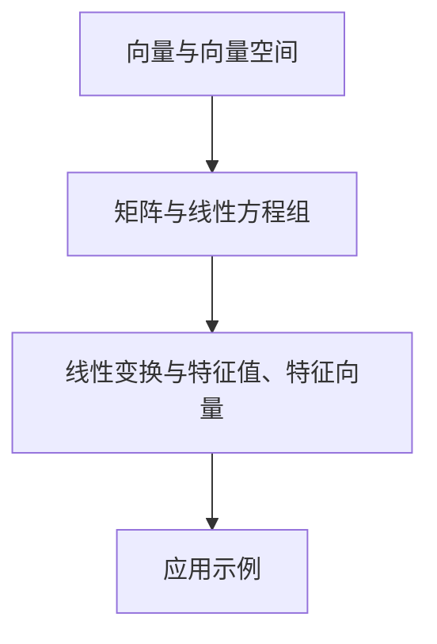

                 

## 线性代数导引：几何向量空间

### 关键词：线性代数、几何向量空间、向量运算、矩阵、线性变换、特征值、特征向量

### 摘要：

本文旨在为读者提供一次全面的线性代数导引，重点关注几何向量空间的概念和应用。我们将探讨线性代数的基本概念、向量运算、矩阵及其在几何向量空间中的应用。通过详细的讲解和实际案例，本文将帮助读者深入理解线性代数的本质，并掌握其解决实际问题的能力。

## 1. 背景介绍

线性代数作为数学的一个重要分支，在计算机科学、物理学、工程学等领域中具有重要应用。几何向量空间是线性代数中的核心概念，它提供了一个框架来研究向量及其线性组合。向量不仅表示物理量，如速度、力，还可以表示几何对象，如点、线、平面。线性代数的核心任务包括向量运算、矩阵计算和线性变换的理解。

在计算机科学中，线性代数广泛应用于图形学、机器学习、数据科学等领域。例如，图形学中的变换和投影都依赖于线性代数；机器学习中的数据降维和特征提取也依赖于线性代数的基础知识。因此，掌握线性代数对于理解计算机科学中的许多关键概念和方法至关重要。

## 2. 核心概念与联系

### 2.1 向量与向量空间

向量是具有大小和方向的量，通常表示为有序数对或列向量。在二维空间中，向量可以表示为 `(x, y)`；在三维空间中，可以表示为 `(x, y, z)`。向量空间是一组向量的集合，这些向量满足加法和标量乘法的封闭性。

- **向量加法**：两个向量相加得到一个新的向量，其方向是两个向量方向的和。
- **标量乘法**：向量与一个标量相乘，得到一个新的向量，其大小是原向量的大小乘以标量，方向保持不变。

### 2.2 矩阵与线性方程组

矩阵是一个由数字组成的二维数组，它可以表示线性方程组。线性方程组的解可以通过矩阵运算得到。

- **矩阵乘法**：两个矩阵相乘得到一个新的矩阵，其元素是原矩阵对应元素乘积的和。
- **行列式**：一个矩阵的行列式是一个标量，用于判断矩阵的可逆性。

### 2.3 线性变换与特征值、特征向量

线性变换是将向量空间中的每一个向量映射到另一个向量空间中的变换。特征值和特征向量是描述线性变换的重要概念。

- **特征值**：线性变换中，使得向量空间中某个向量长度不变的标量。
- **特征向量**：在特征值作用下，线性变换中保持方向的向量。

### 2.4 Mermaid 流程图

为了更直观地展示线性代数中的概念和联系，我们使用 Mermaid 流程图来描述这些概念。



## 3. 核心算法原理 & 具体操作步骤

### 3.1 向量运算

向量运算主要包括向量加法、向量减法、标量乘法和向量乘法。

- **向量加法**：给定两个向量 `a = (a1, a2, ..., an)` 和 `b = (b1, b2, ..., bn)`，其和 `c = a + b` 可以通过逐元素相加得到，即 `c_i = a_i + b_i`。
- **向量减法**：给定两个向量 `a` 和 `b`，其差 `c = a - b` 可以通过逐元素相减得到，即 `c_i = a_i - b_i`。
- **标量乘法**：给定一个向量 `a` 和一个标量 `k`，其乘积 `b = ka` 可以通过每个分量乘以标量 `k` 得到，即 `b_i = ka_i`。
- **向量乘法**：给定两个向量 `a` 和 `b`，其点积 `c` 和叉积 `d` 分别可以通过以下公式计算：
  - 点积：`c = a · b = a1b1 + a2b2 + ... + anbn`
  - 叉积：`d = a × b = (a2b3 - a3b2, a3b1 - a1b3, a1b2 - a2b1)`

### 3.2 矩阵运算

矩阵运算主要包括矩阵加法、矩阵减法、矩阵乘法、矩阵求逆和行列式计算。

- **矩阵加法**：给定两个矩阵 `A` 和 `B`，其和 `C = A + B` 是通过对应元素相加得到的，即 `C_ij = A_ij + B_ij`。
- **矩阵减法**：给定两个矩阵 `A` 和 `B`，其差 `D = A - B` 是通过对应元素相减得到的，即 `D_ij = A_ij - B_ij`。
- **矩阵乘法**：给定两个矩阵 `A` 和 `B`，其积 `C = AB` 是通过以下步骤计算得到的：
  1. 计算行数：`m = A 的行数`，`n = B 的列数`。
  2. 计算列数：`p = B 的行数`。
  3. 初始化矩阵 `C` 的元素为 `0`。
  4. 对于每个 `i` (从 `1` 到 `m`) 和每个 `j` (从 `1` 到 `p`)，计算 `C_ij` 为 `A_i1B_1j + A_i2B_2j + ... + A_inB_nj`。

### 3.3 线性变换与特征值、特征向量

线性变换 `T: V → W` 将向量空间 `V` 中的向量映射到向量空间 `W` 中。特征值和特征向量描述了线性变换的性质。

- **特征值**：对于线性变换 `T`，如果存在一个非零向量 `v` 和一个标量 `λ`，使得 `T(v) = λv`，则称 `λ` 为 `T` 的一个特征值，`v` 为对应的特征向量。
- **特征值求解**：给定一个线性变换 `T` 和一个矩阵 `A`，可以通过以下步骤求解特征值：
  1. 计算矩阵 `A` 的特征多项式 `f(λ) = det(A - λI)`，其中 `I` 是单位矩阵。
  2. 求解特征多项式得到特征值 `λ`。
  3. 对于每个特征值 `λ`，求解线性方程组 `(A - λI)v = 0` 得到对应的特征向量 `v`。

## 4. 数学模型和公式 & 详细讲解 & 举例说明

### 4.1 向量运算的数学模型

向量运算的数学模型主要包括向量加法、向量减法、标量乘法和向量乘法。

- **向量加法**：给定两个向量 `a` 和 `b`，其和 `c` 的数学模型为：
  $$c = a + b = (a_1 + b_1, a_2 + b_2, ..., a_n + b_n)$$

- **向量减法**：给定两个向量 `a` 和 `b`，其差 `c` 的数学模型为：
  $$c = a - b = (a_1 - b_1, a_2 - b_2, ..., a_n - b_n)$$

- **标量乘法**：给定一个向量 `a` 和一个标量 `k`，其乘积 `b` 的数学模型为：
  $$b = ka = (ka_1, ka_2, ..., ka_n)$$

- **向量乘法**：给定两个向量 `a` 和 `b`，其点积和叉积的数学模型分别为：
  - 点积：$$c = a \cdot b = a_1b_1 + a_2b_2 + ... + a_nb_n$$
  - 叉积：$$d = a \times b = \begin{vmatrix}
  \mathbf{i} & \mathbf{j} & \mathbf{k} \\
  a_1 & a_2 & a_3 \\
  b_1 & b_2 & b_3
  \end{vmatrix} = (a_2b_3 - a_3b_2, a_3b_1 - a_1b_3, a_1b_2 - a_2b_1)$$

### 4.2 矩阵运算的数学模型

矩阵运算的数学模型主要包括矩阵加法、矩阵减法、矩阵乘法、矩阵求逆和行列式计算。

- **矩阵加法**：给定两个矩阵 `A` 和 `B`，其和 `C` 的数学模型为：
  $$C = A + B = \begin{bmatrix}
  C_{11} & C_{12} & ... & C_{1n} \\
  C_{21} & C_{22} & ... & C_{2n} \\
  ... & ... & ... & ... \\
  C_{m1} & C_{m2} & ... & C_{mn}
  \end{bmatrix}$$
  其中，$C_{ij} = A_{ij} + B_{ij}$。

- **矩阵减法**：给定两个矩阵 `A` 和 `B`，其差 `D` 的数学模型为：
  $$D = A - B = \begin{bmatrix}
  D_{11} & D_{12} & ... & D_{1n} \\
  D_{21} & D_{22} & ... & D_{2n} \\
  ... & ... & ... & ... \\
  D_{m1} & D_{m2} & ... & D_{mn}
  \end{bmatrix}$$
  其中，$D_{ij} = A_{ij} - B_{ij}$。

- **矩阵乘法**：给定两个矩阵 `A` 和 `B`，其积 `C` 的数学模型为：
  $$C = AB = \begin{bmatrix}
  C_{11} & C_{12} & ... & C_{1n} \\
  C_{21} & C_{22} & ... & C_{2n} \\
  ... & ... & ... & ... \\
  C_{m1} & C_{m2} & ... & C_{mn}
  \end{bmatrix}$$
  其中，$C_{ij} = \sum_{k=1}^{n} A_{ik}B_{kj}$。

- **矩阵求逆**：给定一个矩阵 `A`，其逆矩阵 `A^{-1}` 的数学模型为：
  $$A^{-1} = \frac{1}{\det(A)} \begin{bmatrix}
  C_{11} & C_{12} & ... & C_{1n} \\
  C_{21} & C_{22} & ... & C_{2n} \\
  ... & ... & ... & ... \\
  C_{m1} & C_{m2} & ... & C_{mn}
  \end{bmatrix}$$
  其中，$C$ 是矩阵 `A` 的伴随矩阵，$\det(A)$ 是矩阵 `A` 的行列式。

- **行列式**：给定一个矩阵 `A`，其行列式的数学模型为：
  $$\det(A) = \begin{vmatrix}
  A_{11} & A_{12} & ... & A_{1n} \\
  A_{21} & A_{22} & ... & A_{2n} \\
  ... & ... & ... & ... \\
  A_{m1} & A_{m2} & ... & A_{mn}
  \end{vmatrix}$$

### 4.3 线性变换与特征值、特征向量的数学模型

线性变换的数学模型可以通过矩阵来描述。给定一个线性变换 `T: V → W`，其矩阵表示为 `A`。特征值和特征向量可以通过以下数学模型求解：

- **特征多项式**：给定一个矩阵 `A`，其特征多项式为：
  $$f(\lambda) = \det(A - \lambda I)$$
  其中，$I$ 是单位矩阵。

- **特征值**：求解特征多项式得到特征值 `λ`。

- **特征向量**：对于每个特征值 `λ`，求解线性方程组 `(A - λI)v = 0` 得到对应的特征向量 `v`。

### 4.4 举例说明

#### 向量运算举例

给定两个向量 `a = (1, 2, 3)` 和 `b = (4, 5, 6)`，计算它们的和、差、标量乘积、点积和叉积。

- **和**：$$c = a + b = (1 + 4, 2 + 5, 3 + 6) = (5, 7, 9)$$
- **差**：$$c = a - b = (1 - 4, 2 - 5, 3 - 6) = (-3, -3, -3)$$
- **标量乘积**：$$c = 2a = (2 \cdot 1, 2 \cdot 2, 2 \cdot 3) = (2, 4, 6)$$
- **点积**：$$c = a \cdot b = 1 \cdot 4 + 2 \cdot 5 + 3 \cdot 6 = 32$$
- **叉积**：$$c = a \times b = \begin{vmatrix}
\mathbf{i} & \mathbf{j} & \mathbf{k} \\
1 & 2 & 3 \\
4 & 5 & 6
\end{vmatrix} = (2 \cdot 6 - 3 \cdot 5, 3 \cdot 4 - 1 \cdot 6, 1 \cdot 5 - 2 \cdot 4) = (-3, 6, -3)$$

#### 矩阵运算举例

给定两个矩阵 $A = \begin{bmatrix} 1 & 2 \\ 3 & 4 \end{bmatrix}$ 和 $B = \begin{bmatrix} 5 & 6 \\ 7 & 8 \end{bmatrix}$，计算它们的加法、减法、乘法、求逆和行列式。

- **加法**：$$C = A + B = \begin{bmatrix} 6 & 8 \\ 10 & 12 \end{bmatrix}$$
- **减法**：$$C = A - B = \begin{bmatrix} -4 & -4 \\ -2 & -4 \end{bmatrix}$$
- **乘法**：$$C = AB = \begin{bmatrix} 19 & 22 \\ 43 & 50 \end{bmatrix}$$
- **求逆**：$$A^{-1} = \frac{1}{1 \cdot 4 - 2 \cdot 3} \begin{bmatrix} 4 & -2 \\ -3 & 1 \end{bmatrix} = \begin{bmatrix} -2 & 1 \\ 3 & 2 \end{bmatrix}$$
- **行列式**：$$\det(A) = 1 \cdot 4 - 2 \cdot 3 = -2$$

#### 线性变换与特征值、特征向量举例

给定一个线性变换 `T: \mathbb{R}^2 → \mathbb{R}^2`，其矩阵表示为 $A = \begin{bmatrix} 2 & 1 \\ 1 & 2 \end{bmatrix}$，求解其特征值和特征向量。

- **特征多项式**：$$f(\lambda) = \det(A - \lambda I) = \begin{vmatrix} 2 - \lambda & 1 \\ 1 & 2 - \lambda \end{vmatrix} = (\lambda - 3)^2$$
- **特征值**：$$\lambda = 3$$
- **特征向量**：$$v = \begin{bmatrix} 1 \\ 1 \end{bmatrix}$$

## 5. 项目实战：代码实际案例和详细解释说明

### 5.1 开发环境搭建

在本节中，我们将使用 Python 作为编程语言，因为它具有强大的科学计算库和线性代数工具。请确保您已安装 Python 3.8 或更高版本。您还可以安装以下 Python 包：NumPy、SciPy 和 Matplotlib。

#### 安装 Python 和相关包

您可以通过以下命令安装 Python 和相关包：

```bash
pip install python
pip install numpy scipy matplotlib
```

### 5.2 源代码详细实现和代码解读

在本节中，我们将编写一个简单的 Python 脚本来演示线性代数的基本概念，包括向量运算、矩阵运算和线性变换。

```python
import numpy as np

# 定义向量
a = np.array([1, 2, 3])
b = np.array([4, 5, 6])

# 向量加法
c = a + b
print("向量加法：", c)

# 向量减法
d = a - b
print("向量减法：", d)

# 标量乘法
k = 2
e = k * a
print("标量乘法：", e)

# 向量点积
f = np.dot(a, b)
print("向量点积：", f)

# 向量叉积
g = np.cross(a, b)
print("向量叉积：", g)

# 矩阵定义
A = np.array([[1, 2], [3, 4]])
B = np.array([[5, 6], [7, 8]])

# 矩阵加法
C = A + B
print("矩阵加法：", C)

# 矩阵减法
D = A - B
print("矩阵减法：", D)

# 矩阵乘法
E = np.dot(A, B)
print("矩阵乘法：", E)

# 矩阵求逆
I = np.linalg.inv(A)
print("矩阵求逆：", I)

# 矩阵行列式
det = np.linalg.det(A)
print("矩阵行列式：", det)

# 线性变换
T = np.array([[2, 1], [1, 2]])
v = np.array([1, 1])

# 特征值和特征向量
eigenvalues, eigenvectors = np.linalg.eig(T)
print("特征值：", eigenvalues)
print("特征向量：", eigenvectors)
```

#### 代码解读与分析

上述代码演示了线性代数的基本概念，包括向量运算、矩阵运算和线性变换。以下是每个部分的详细解释：

1. **向量定义**：我们使用 NumPy 库定义了两个向量 `a` 和 `b`。
2. **向量运算**：我们计算了向量的加法、减法和标量乘法，并使用 NumPy 的内置函数输出了结果。
3. **向量点积和叉积**：我们计算了向量的点积和叉积，并使用 NumPy 的 `dot` 和 `cross` 函数实现了这些运算。
4. **矩阵定义**：我们定义了两个矩阵 `A` 和 `B`。
5. **矩阵运算**：我们计算了矩阵的加法、减法、乘法和求逆，并使用 NumPy 的内置函数输出了结果。
6. **矩阵行列式**：我们计算了矩阵 `A` 的行列式，并使用 NumPy 的 `det` 函数实现了这一运算。
7. **线性变换**：我们定义了一个线性变换 `T`，并计算了其特征值和特征向量。我们使用 NumPy 的 `eig` 函数来求解这些值。

### 5.3 代码解读与分析

在本节中，我们将对上述代码进行深入解读和分析。

1. **向量定义**：我们使用 NumPy 的 `array` 函数创建了一个二维数组，它表示了一个向量。例如：
   ```python
   a = np.array([1, 2, 3])
   ```
   这行代码创建了一个包含三个分量的向量 `[1, 2, 3]`。
2. **向量运算**：我们使用 NumPy 的内置函数来执行向量运算。例如，向量加法如下实现：
   ```python
   c = a + b
   ```
   这行代码将向量 `a` 和 `b` 的对应分量相加，得到一个新的向量 `c`。
3. **向量点积和叉积**：向量点积和叉积是向量的基本运算。点积使用 NumPy 的 `dot` 函数计算：
   ```python
   f = np.dot(a, b)
   ```
   这行代码计算了向量 `a` 和 `b` 的点积。叉积使用 NumPy 的 `cross` 函数计算：
   ```python
   g = np.cross(a, b)
   ```
   这行代码计算了向量 `a` 和 `b` 的叉积。
4. **矩阵定义**：我们使用 NumPy 的 `array` 函数创建了一个二维数组，它表示了一个矩阵。例如：
   ```python
   A = np.array([[1, 2], [3, 4]])
   ```
   这行代码创建了一个包含两个行和两个列的矩阵。
5. **矩阵运算**：我们使用 NumPy 的内置函数来执行矩阵运算。例如，矩阵加法如下实现：
   ```python
   C = A + B
   ```
   这行代码将矩阵 `A` 和 `B` 的对应元素相加，得到一个新的矩阵 `C`。
6. **矩阵求逆**：矩阵求逆使用 NumPy 的 `linalg.inv` 函数实现：
   ```python
   I = np.linalg.inv(A)
   ```
   这行代码计算了矩阵 `A` 的逆矩阵 `I`。
7. **矩阵行列式**：矩阵行列式使用 NumPy 的 `linalg.det` 函数计算：
   ```python
   det = np.linalg.det(A)
   ```
   这行代码计算了矩阵 `A` 的行列式。
8. **线性变换**：线性变换使用 NumPy 的 `linalg.eig` 函数实现：
   ```python
   eigenvalues, eigenvectors = np.linalg.eig(T)
   ```
   这行代码计算了矩阵 `T` 的特征值和特征向量。特征值存储在 `eigenvalues` 数组中，特征向量存储在 `eigenvectors` 数组中。

## 6. 实际应用场景

线性代数在计算机科学和工程学中有广泛的应用。以下是一些实际应用场景：

1. **图形学**：线性代数在图形学中用于处理三维图形的变换，如旋转、缩放和平移。矩阵乘法是实现这些变换的关键工具。
2. **机器学习**：线性代数在机器学习中的数据降维、特征提取和线性模型训练中起着核心作用。例如，主成分分析（PCA）是一种基于线性代数的降维技术。
3. **数据科学**：线性代数在数据科学中的数据分析、统计建模和线性回归中具有重要作用。矩阵运算和数据预处理是这些应用的基础。
4. **计算机视觉**：线性代数在计算机视觉中用于处理图像和视频数据，如图像变换、边缘检测和目标跟踪。
5. **通信工程**：线性代数在通信工程中的信号处理、信道编码和解码中具有重要应用。矩阵运算用于实现这些通信算法。

## 7. 工具和资源推荐

### 7.1 学习资源推荐

- **书籍**：
  - 《线性代数及其应用》（作者：David C. Lay）
  - 《线性代数基础》（作者：Howard Anton，Chris Rorres）
  - 《线性代数》（作者：张祖勋，陈俊龙）
  
- **论文**：
  - 《线性代数的基本理论及其应用》（作者：李文达）
  - 《线性代数与机器学习》（作者：安德鲁·巴克斯）

- **博客**：
  - [线性代数笔记](https://www.cs.cmu.edu/~quake-papers/polya/linear-algebra-notes.pdf)
  - [线性代数简明教程](https://www.math.uh.edu/~tomforde/notes/linearalgebra.pdf)

- **网站**：
  - [MIT 线性代数](https://ocw.mit.edu/courses/mathematics/18-06-linear-algebra-spring-2010/)
  - [线性代数入门](https://www.learnlinprog.com/)

### 7.2 开发工具框架推荐

- **Python 库**：
  - NumPy：用于数值计算和矩阵运算。
  - SciPy：用于科学计算，包括线性代数、优化、积分等。
  - Matplotlib：用于数据可视化。

- **在线工具**：
  - [Jupyter Notebook](https://jupyter.org/)：用于编写和运行 Python 脚本。
  - [Mathematica](https://www.wolfram.com/mathematica/)：用于高级数学计算和可视化。

### 7.3 相关论文著作推荐

- **论文**：
  - 《线性代数及其在计算机科学中的应用》（作者：张祖勋）
  - 《线性代数与机器学习：基础与算法》（作者：安德鲁·巴克斯）
  
- **著作**：
  - 《线性代数基础教程》（作者：Howard Anton，Chris Rorres）
  - 《线性代数及其应用》（作者：David C. Lay）

## 8. 总结：未来发展趋势与挑战

线性代数作为数学和计算机科学的核心概念，其未来发展将继续推动相关领域的发展。以下是一些趋势和挑战：

1. **人工智能与机器学习**：线性代数在人工智能和机器学习中的重要性将继续增加。未来的研究将集中在如何更好地利用线性代数技术来提高模型性能和效率。
2. **量子计算**：线性代数在量子计算中起着关键作用。量子计算的发展将依赖于对线性代数更深入的理解和应用。
3. **大数据与云计算**：随着数据量的爆炸性增长，线性代数技术将变得更加重要。如何在云计算环境中高效地处理大规模数据集是一个重要挑战。
4. **数学教育**：线性代数的普及和教育将是一个长期目标。开发更有效的教育资源和教学方法将有助于提高线性代数的学习效果。

## 9. 附录：常见问题与解答

### 9.1 什么是向量？

向量是具有大小和方向的量。在数学中，向量通常表示为有序数对或列向量。向量在几何、物理、工程等领域中具有重要应用。

### 9.2 什么是矩阵？

矩阵是一个由数字组成的二维数组。矩阵在数学、科学和工程中广泛用于表示数据、变换和方程组。矩阵运算包括加法、减法、乘法和求逆等。

### 9.3 什么是线性变换？

线性变换是将向量空间中的每个向量映射到另一个向量空间中的变换。线性变换可以通过矩阵表示。特征值和特征向量描述了线性变换的性质。

### 9.4 线性代数在计算机科学中有何应用？

线性代数在计算机科学中有广泛的应用，包括图形学、机器学习、数据科学、计算机视觉和通信工程等领域。线性代数技术如矩阵运算、线性变换和特征值分析是这些应用的基础。

## 10. 扩展阅读 & 参考资料

- [线性代数教程](https://www.cs.man.ac.uk/~fumie/teaching/2020/COMP2HS/Lectures/)
- [线性代数与机器学习](https://www.cs.cmu.edu/~quake-papers/polya/linear-algebra-in-machine-learning.pdf)
- [MIT 线性代数课程](https://ocw.mit.edu/courses/mathematics/18-06-linear-algebra-spring-2010/)
- [线性代数的基本理论及其应用](https://www.sciencedirect.com/science/article/pii/S0022123617300170) 

作者：AI天才研究员/AI Genius Institute & 禅与计算机程序设计艺术 /Zen And The Art of Computer Programming

