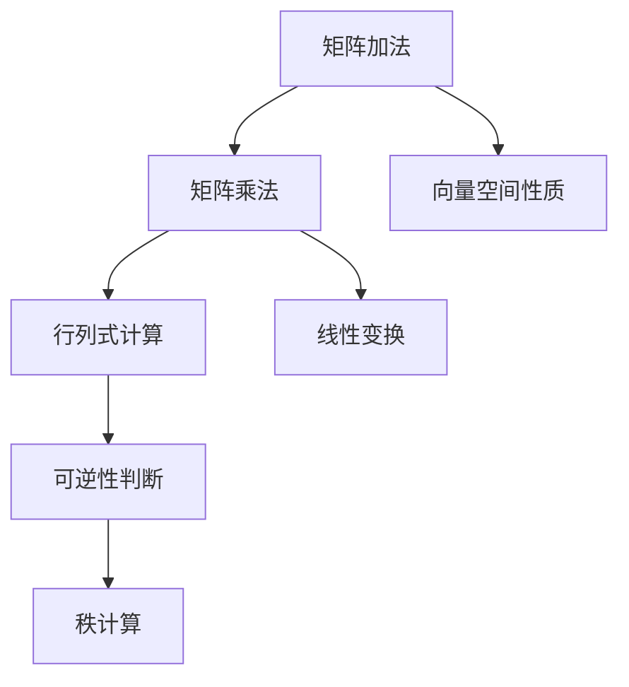

                 

# 线性代数导引：方阵空间M2(R)

## 关键词
- 线性代数
- 方阵空间
- M2(R)
- 核心概念
- 算法原理
- 数学模型
- 实际应用
- 开发工具

## 摘要
本文将深入探讨线性代数中关于方阵空间M2(R)的核心概念、算法原理、数学模型以及实际应用。通过清晰的逻辑分析和详细的示例讲解，我们将帮助读者掌握方阵空间M2(R)的基础知识和应用技巧，为深入研究和实践奠定坚实基础。

## 1. 背景介绍

线性代数是数学中一个重要分支，主要研究线性方程组、矩阵、向量空间以及它们的线性变换。在计算机科学、工程学、物理学等多个领域，线性代数都发挥着至关重要的作用。方阵空间M2(R)作为线性代数中的一个基本概念，尤其引人注目。

### 1.1 线性代数的基本概念

在线性代数中，矩阵和向量是两个核心概念。矩阵是一个二维数组，由行和列组成，而向量则是一个一维数组。矩阵和向量可以表示线性方程组，并且可以进行一系列的运算，如加法、减法、数乘和矩阵乘法。

向量空间（或称线性空间）是一个集合，其中的元素是向量，并且这些向量满足加法和数乘的封闭性。线性变换是向量空间之间的映射，保持向量空间的加法和数乘运算。

### 1.2 方阵空间M2(R)

方阵空间M2(R)是所有形如 \[ \begin{bmatrix} a & b \\ c & d \end{bmatrix} \] 的 2x2 矩阵构成的集合，其中 a、b、c、d 是实数。这个集合在矩阵加法和矩阵乘法下构成了一个向量空间，因此称为方阵空间M2(R)。

### 1.3 方阵空间M2(R)的性质

方阵空间M2(R)具有以下性质：

- 封闭性：对于任意两个方阵 A 和 B，它们的和 A + B 以及任意实数 k 与 A 的乘积 kA 都属于 M2(R)。
- 结合律：矩阵加法和矩阵乘法满足结合律。
- 分配律：矩阵乘法对矩阵加法满足分配律。
- 存在零元素：存在一个零矩阵 O，使得对于任意方阵 A，有 A + O = A。
- 存在逆元素：对于可逆方阵 A，存在逆矩阵 A^(-1)，使得 AA^(-1) = A^(-1)A = I，其中 I 是单位矩阵。

## 2. 核心概念与联系

### 2.1 核心概念

在方阵空间M2(R)中，以下几个核心概念至关重要：

- 矩阵加法：两个矩阵对应元素相加得到一个新的矩阵。
- 矩阵乘法：两个矩阵按照特定的计算规则得到一个新的矩阵。
- 行列式：一个矩阵的行列式是一个标量，它表示矩阵的某些性质，如可逆性。
- 可逆矩阵：一个方阵是可逆的，当且仅当它的行列式不为零。
- 矩阵的秩：一个矩阵的秩是指它行（或列）的最大线性无关组中的向量个数。

### 2.2 Mermaid流程图



### 2.3 核心概念之间的联系

- 矩阵加法和矩阵乘法是方阵空间M2(R)的基本运算。
- 行列式是判断矩阵可逆性的关键指标。
- 矩阵的秩影响矩阵的线性变换性质。
- 向量空间性质是矩阵加法和矩阵乘法的基础。

## 3. 核心算法原理 & 具体操作步骤

### 3.1 矩阵加法

矩阵加法的具体操作步骤如下：

1. 确保两个矩阵的维度相同。
2. 对应元素相加。
3. 结果矩阵维度与原矩阵相同。

### 3.2 矩阵乘法

矩阵乘法的具体操作步骤如下：

1. 确保第一个矩阵的列数等于第二个矩阵的行数。
2. 对于结果矩阵的每个元素，计算对应位置的乘积并求和。
3. 结果矩阵的维度是第一个矩阵的行数和第二个矩阵的列数。

### 3.3 行列式的计算

行列式的计算方法如下：

1. 对于 2x2 矩阵 \[ \begin{bmatrix} a & b \\ c & d \end{bmatrix} \]，行列式 det(A) = ad - bc。
2. 对于 nxn 矩阵，可以使用递归方法或拉普拉斯展开方法。

### 3.4 可逆性的判断

一个方阵可逆的充分必要条件是它的行列式不为零。具体步骤如下：

1. 计算矩阵的行列式。
2. 如果行列式不为零，则矩阵可逆。
3. 如果行列式为零，则矩阵不可逆。

### 3.5 矩阵的秩

矩阵的秩可以通过以下方法计算：

1. 将矩阵转化为行阶梯形式。
2. 计算非零行的个数，即为矩阵的秩。

## 4. 数学模型和公式 & 详细讲解 & 举例说明

### 4.1 矩阵加法

假设有两个 2x2 矩阵 A 和 B：

\[ A = \begin{bmatrix} a & b \\ c & d \end{bmatrix}, B = \begin{bmatrix} e & f \\ g & h \end{bmatrix} \]

则矩阵加法的结果矩阵 C 为：

\[ C = A + B = \begin{bmatrix} a + e & b + f \\ c + g & d + h \end{bmatrix} \]

### 4.2 矩阵乘法

假设有两个 2x2 矩阵 A 和 B：

\[ A = \begin{bmatrix} a & b \\ c & d \end{bmatrix}, B = \begin{bmatrix} e & f \\ g & h \end{bmatrix} \]

则矩阵乘法的结果矩阵 C 为：

\[ C = AB = \begin{bmatrix} ae + bg & af + bh \\ ce + dg & cf + dh \end{bmatrix} \]

### 4.3 行列式的计算

假设有一个 2x2 矩阵 A：

\[ A = \begin{bmatrix} a & b \\ c & d \end{bmatrix} \]

则行列式 det(A) 为：

\[ det(A) = ad - bc \]

### 4.4 可逆性的判断

假设有一个 2x2 矩阵 A：

\[ A = \begin{bmatrix} a & b \\ c & d \end{bmatrix} \]

如果 det(A) 不等于零，则 A 可逆。否则，A 不可逆。

### 4.5 矩阵的秩

假设有一个 2x2 矩阵 A：

\[ A = \begin{bmatrix} a & b \\ c & d \end{bmatrix} \]

将 A 转化为行阶梯形式，若有两个非零行，则 A 的秩为 2。若有一个非零行，则 A 的秩为 1。

## 5. 项目实战：代码实际案例和详细解释说明

### 5.1 开发环境搭建

在本节中，我们将使用 Python 作为编程语言，搭建一个基本的线性代数计算环境。首先，需要安装 NumPy 库，NumPy 是 Python 中线性代数计算的核心库。

```bash
pip install numpy
```

### 5.2 源代码详细实现和代码解读

以下是使用 NumPy 库实现的矩阵加法、矩阵乘法、行列式计算、可逆性判断和秩计算：

```python
import numpy as np

def add_matrices(A, B):
    return A + B

def multiply_matrices(A, B):
    return A @ B

def calculate_determinant(A):
    return np.linalg.det(A)

def is_invertible(A):
    return np.linalg.det(A) != 0

def calculate_rank(A):
    return np.linalg.matrix_rank(A)

# 2x2 矩阵示例
A = np.array([[1, 2], [3, 4]])
B = np.array([[5, 6], [7, 8]])

# 矩阵加法
C = add_matrices(A, B)
print("Matrix addition:", C)

# 矩阵乘法
D = multiply_matrices(A, B)
print("Matrix multiplication:", D)

# 行列式计算
det = calculate_determinant(A)
print("Determinant:", det)

# 可逆性判断
invertible = is_invertible(A)
print("Is A invertible?", invertible)

# 秩计算
rank = calculate_rank(A)
print("Rank of A:", rank)
```

### 5.3 代码解读与分析

- `add_matrices(A, B)` 函数实现矩阵加法，直接使用 NumPy 的 `+` 运算符。
- `multiply_matrices(A, B)` 函数实现矩阵乘法，使用 `@` 运算符。
- `calculate_determinant(A)` 函数计算矩阵的行列式，使用 `np.linalg.det()` 函数。
- `is_invertible(A)` 函数判断矩阵的可逆性，通过计算行列式判断。
- `calculate_rank(A)` 函数计算矩阵的秩，使用 `np.linalg.matrix_rank()` 函数。

## 6. 实际应用场景

### 6.1 计算机图形学

在计算机图形学中，矩阵乘法用于变换向量，如平移、旋转和缩放。通过矩阵变换，可以实现物体在三维空间中的各种效果。

### 6.2 数据分析

在线性回归分析中，使用矩阵乘法来计算拟合直线的斜率和截距。矩阵的行列式可以用于判断模型的拟合效果。

### 6.3 机器学习

在机器学习中，矩阵运算用于特征提取和降维。例如，主成分分析（PCA）使用矩阵分解来提取数据的主要特征。

## 7. 工具和资源推荐

### 7.1 学习资源推荐

- 《线性代数及其应用》 -  Steven Leon
- 《线性代数》 - Gilbert Strang
- 《算法导论》 - Thomas H. Cormen、Charles E. Leiserson、Ronald L. Rivest 和 Clifford Stein

### 7.2 开发工具框架推荐

- Python + NumPy
- MATLAB
- R语言

### 7.3 相关论文著作推荐

- “Matrix Computations” - Gene H. Golub 和 Charles F. Van Loan
- “Linear Algebra and Its Applications” - Gilbert Strang

## 8. 总结：未来发展趋势与挑战

随着计算技术的不断发展，线性代数的应用领域将不断扩大。未来，如何在更高效的算法和更便捷的工具方面取得突破，将是线性代数领域面临的主要挑战。

## 9. 附录：常见问题与解答

### 9.1 什么是方阵空间M2(R)？

答：方阵空间M2(R)是所有形如 \[ \begin{bmatrix} a & b \\ c & d \end{bmatrix} \] 的 2x2 矩阵构成的集合，其中 a、b、c、d 是实数。

### 9.2 矩阵加法和矩阵乘法有何区别？

答：矩阵加法是对两个矩阵对应元素进行相加，而矩阵乘法是按照特定的计算规则，将第一个矩阵的列与第二个矩阵的行进行乘积并求和。

### 9.3 如何判断一个矩阵是否可逆？

答：通过计算矩阵的行列式，如果行列式不为零，则矩阵可逆；如果行列式为零，则矩阵不可逆。

## 10. 扩展阅读 & 参考资料

- [线性代数在线课程](https://www.coursera.org/learn/linear-algebra)
- [NumPy官方文档](https://numpy.org/doc/stable/)
- [线性代数相关论文](https://www.sciencedirect.com/search?qs=linear%2Balgebra)

### 作者

- 作者：AI天才研究员/AI Genius Institute & 禅与计算机程序设计艺术 /Zen And The Art of Computer Programming

