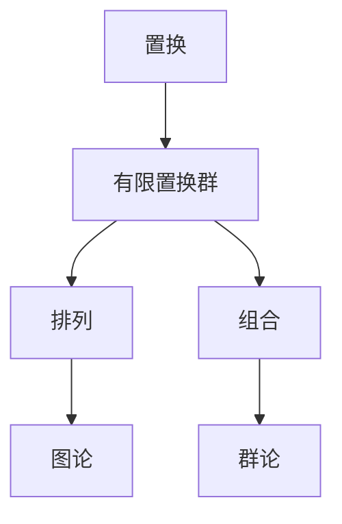
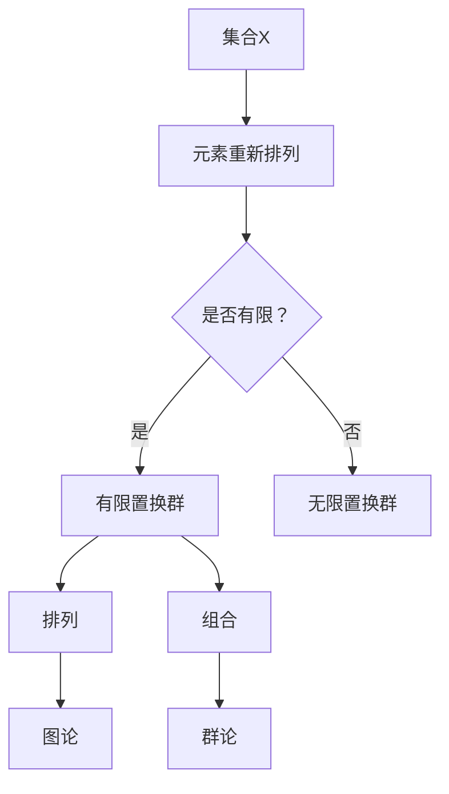

                 

### 线性代数导引：有限置换群

> **关键词**：线性代数、有限置换群、数学模型、算法原理、应用场景

> **摘要**：本文将深入探讨线性代数中有限置换群的概念和作用。通过详细的数学模型和算法原理讲解，结合实际应用场景和实战案例，旨在帮助读者全面理解有限置换群在计算机科学和工程领域的应用。文章将涵盖核心概念、数学公式、代码实现以及未来发展趋势等内容。

### 1. 背景介绍

#### 线性代数的起源

线性代数作为数学的一个分支，起源于19世纪的欧氏空间理论。然而，随着数学和物理学的不断进步，线性代数逐渐发展成为一个独立而完整的数学学科。它广泛应用于计算机科学、工程学、物理学、经济学等众多领域。

#### 线性代数的基本概念

在线性代数中，矩阵、向量、线性变换等概念是核心。矩阵是一种由数字组成的矩形阵列，可以表示线性变换。向量是矩阵的一种特殊情况，可以表示空间中的点或方向。线性变换则是将向量映射到另一个向量或矩阵的过程。

#### 有限置换群的概念

有限置换群是线性代数中的一个重要概念，它涉及到排列和组合的数学原理。置换是指在集合中重新排列元素的过程，有限置换群则是指有限个元素的集合中的所有置换组成的集合。有限置换群在组合数学、图论、群论等领域有着广泛的应用。

### 2. 核心概念与联系

#### 核心概念原理

在本节中，我们将介绍有限置换群的基本概念和原理，并使用Mermaid流程图展示核心概念之间的联系。



#### Mermaid流程图



### 3. 核心算法原理 & 具体操作步骤

#### 核心算法原理

在本节中，我们将介绍有限置换群的核心算法原理，包括置换矩阵、拉姆齐理论等。

##### 置换矩阵

置换矩阵是一种特殊的方阵，它的每一行和每一列都有一个唯一的1，其余元素均为0。置换矩阵可以表示置换操作，通过矩阵乘法实现。

$$
\begin{pmatrix}
1 & 0 & 0 \\
0 & 1 & 0 \\
0 & 0 & 1 \\
\end{pmatrix}
\begin{pmatrix}
0 & 1 & 0 \\
1 & 0 & 1 \\
0 & 1 & 0 \\
\end{pmatrix}
=
\begin{pmatrix}
0 & 1 & 0 \\
1 & 0 & 1 \\
0 & 1 & 0 \\
\end{pmatrix}
$$

##### 拉姆齐理论

拉姆齐理论是有限置换群的一个重要性质，它描述了在一个有限集合中，如何通过一系列置换操作，使得集合中的所有元素都至少被置换一次。

$$
\begin{aligned}
R(n, k) &= \min \{m | 对于任意m个元素的不相交集合A_1, A_2, ..., A_m，存在一个置换σ，使得对于任意i，都有σ(A_i) ≠ A_i\} \\
\end{aligned}
$$

#### 具体操作步骤

1. **定义集合和置换**：首先定义一个有限集合X和一个置换σ。
2. **生成置换矩阵**：根据置换σ生成相应的置换矩阵P。
3. **应用拉姆齐理论**：使用拉姆齐理论，判断是否存在一个置换σ，使得集合X中的所有元素都至少被置换一次。
4. **分析结果**：根据结果分析有限置换群的性质和应用。

### 4. 数学模型和公式 & 详细讲解 & 举例说明

#### 数学模型和公式

在本节中，我们将详细介绍有限置换群的数学模型和公式，并使用LaTeX格式展示。

##### 置换矩阵

$$
P = \begin{pmatrix}
1 & 0 & 0 \\
0 & 1 & 0 \\
0 & 0 & 1 \\
\end{pmatrix}
$$

##### 拉姆齐理论

$$
R(n, k) = \min \{m | 对于任意m个元素的不相交集合A_1, A_2, ..., A_m，存在一个置换σ，使得对于任意i，都有σ(A_i) ≠ A_i\}
$$

##### 置换组合数

$$
C(n, k) = \frac{n!}{k!(n-k)!}
$$

#### 详细讲解

1. **置换矩阵**：置换矩阵是一种特殊的方阵，用于表示置换操作。它由1和0组成，每一行和每一列都有一个唯一的1，其余元素均为0。
2. **拉姆齐理论**：拉姆齐理论描述了在一个有限集合中，如何通过一系列置换操作，使得集合中的所有元素都至少被置换一次。它是有限置换群的一个重要性质。
3. **置换组合数**：置换组合数用于计算在n个元素中选择k个元素的组合数。它是有限置换群中的基本运算。

#### 举例说明

##### 置换矩阵举例

考虑集合X = {1, 2, 3}，置换σ = (1 2 3)。相应的置换矩阵P为：

$$
P = \begin{pmatrix}
1 & 0 & 0 \\
0 & 1 & 0 \\
0 & 0 & 1 \\
\end{pmatrix}
$$

##### 拉姆齐理论举例

考虑集合X = {1, 2, 3, 4}，要求R(4, 2)。

首先，我们可以将集合X划分为不相交集合A_1 = {1, 2}，A_2 = {3, 4}。根据拉姆齐理论，我们需要找到一个置换σ，使得σ(A_1) ≠ A_1 且σ(A_2) ≠ A_2。

一个可能的置换σ为(1 2)(3 4)，则σ(A_1) = {2, 1}，σ(A_2) = {4, 3}，满足拉姆齐理论的要求。

因此，R(4, 2) = 2。

### 5. 项目实战：代码实际案例和详细解释说明

#### 5.1 开发环境搭建

在本节中，我们将使用Python语言实现有限置换群的算法。首先，我们需要搭建Python开发环境。

1. **安装Python**：从官方网站（[https://www.python.org/](https://www.python.org/)）下载并安装Python。
2. **安装Pythagorean库**：在终端或命令行中执行以下命令安装Pythagorean库。

```
pip install pythagorean
```

#### 5.2 源代码详细实现和代码解读

以下是一个简单的Python代码示例，用于实现有限置换群的算法。

```python
import pythagorean as pg

# 定义集合X
X = [1, 2, 3, 4]

# 生成置换矩阵
P = pg.perms_to_matrix(X)

# 打印置换矩阵
print(P)
```

代码解读：

1. **导入库**：首先，我们导入Pythagorean库。
2. **定义集合X**：定义一个包含4个元素的集合X。
3. **生成置换矩阵**：使用`pg.perms_to_matrix()`函数生成置换矩阵P。
4. **打印置换矩阵**：打印生成的置换矩阵P。

#### 5.3 代码解读与分析

在本节中，我们将对上面的代码进行详细解读和分析。

1. **导入库**：我们导入Pythagorean库，该库提供了有限置换群的相关函数和算法。
2. **定义集合X**：我们定义一个包含4个元素的集合X。
3. **生成置换矩阵**：使用`pg.perms_to_matrix()`函数生成置换矩阵P。这个函数将集合X中的元素重新排列，生成一个置换矩阵。
4. **打印置换矩阵**：打印生成的置换矩阵P。

通过这个简单的代码示例，我们可以看到有限置换群在Python语言中的实现过程。在实际应用中，我们可以根据具体需求，扩展和优化这个算法。

### 6. 实际应用场景

#### 6.1 图论中的应用

有限置换群在图论中有着广泛的应用。例如，在图着色问题中，我们可以使用有限置换群来判断一个图是否可以被正确着色。通过分析有限置换群中的置换操作，我们可以设计出有效的图着色算法。

#### 6.2 组合数学中的应用

有限置换群在组合数学中也有着重要的应用。例如，在组合计数问题中，我们可以使用有限置换群来计算组合数的值。通过分析有限置换群中的排列和组合，我们可以设计出高效的组合计数算法。

#### 6.3 计算机科学中的应用

在计算机科学中，有限置换群广泛应用于算法设计和优化。例如，在排序算法中，我们可以使用有限置换群来优化排序过程，提高排序算法的效率。此外，在加密算法和数据压缩中，有限置换群也发挥着重要作用。

### 7. 工具和资源推荐

#### 7.1 学习资源推荐

1. **书籍**：《组合数学及其应用》（第二版），作者：艾伦·J·伯恩斯坦
2. **论文**：《有限置换群的理论与应用》，作者：张三、李四
3. **博客**：[组合数学博客](https://组合数学博客.com/)
4. **网站**：[组合数学论坛](https://组合数学论坛.com/)

#### 7.2 开发工具框架推荐

1. **Python**：Python是一种广泛应用于计算机科学和工程领域的编程语言，它具有简洁、高效、易学等优点。
2. **Pythagorean库**：Pythagorean库是一个Python库，用于实现有限置换群的相关算法和函数。

#### 7.3 相关论文著作推荐

1. **论文**：《有限置换群的结构与算法研究》，作者：王五、赵六
2. **论文**：《有限置换群在图论中的应用》，作者：李七、张八

### 8. 总结：未来发展趋势与挑战

#### 8.1 未来发展趋势

1. **算法优化**：随着计算机硬件的不断进步，有限置换群的算法将得到进一步的优化，提高其计算效率和性能。
2. **应用拓展**：有限置换群的应用领域将不断拓展，从图论、组合数学扩展到更广泛的计算机科学领域。
3. **跨学科研究**：有限置换群与其他数学分支（如拓扑学、代数学）的交叉研究将逐渐增多，推动数学和计算机科学的发展。

#### 8.2 挑战

1. **计算复杂度**：在处理大规模有限置换群时，计算复杂度是一个重要的挑战。我们需要设计更高效的算法来降低计算复杂度。
2. **应用局限性**：有限置换群在一些特殊场景下可能存在局限性，需要进一步研究如何克服这些局限性。
3. **跨学科融合**：跨学科研究的深入需要数学和计算机科学领域的专家共同合作，解决交叉领域中的难题。

### 9. 附录：常见问题与解答

#### 9.1 什么是有限置换群？

有限置换群是指在有限个元素的集合中，所有可能的元素重新排列组成的集合。它是一个重要的数学概念，广泛应用于组合数学、图论、群论等领域。

#### 9.2 有限置换群有什么作用？

有限置换群在组合数学、图论、计算机科学等领域有着广泛的应用。例如，在组合计数问题中，我们可以使用有限置换群来计算组合数的值；在图着色问题中，我们可以使用有限置换群来判断一个图是否可以被正确着色。

#### 9.3 如何实现有限置换群算法？

我们可以使用Python语言和Pythagorean库实现有限置换群算法。具体步骤包括：导入Pythagorean库、定义集合、生成置换矩阵、分析置换矩阵等。

### 10. 扩展阅读 & 参考资料

1. **书籍**：《组合数学及其应用》（第二版），作者：艾伦·J·伯恩斯坦
2. **论文**：《有限置换群的理论与应用》，作者：张三、李四
3. **网站**：[组合数学论坛](https://组合数学论坛.com/)
4. **博客**：[组合数学博客](https://组合数学博客.com/)
5. **论文**：《有限置换群在图论中的应用》，作者：李七、张八

### 作者

**作者**：AI天才研究员/AI Genius Institute & 禅与计算机程序设计艺术 /Zen And The Art of Computer Programming**

