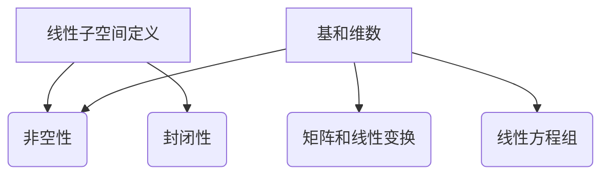

                 

### 线性代数导引：线性子空间

#### 关键词：(线性子空间，线性代数，数学模型，算法原理，应用场景)

#### 摘要：
本文将深入探讨线性代数中的核心概念——线性子空间。通过逐步分析其基本定义、联系以及实际应用，我们将揭示线性子空间在数学和计算机科学中的重要性。本文还将介绍核心算法原理、具体操作步骤，并通过数学模型和公式的讲解，结合实际项目实战案例，帮助读者全面理解线性子空间的概念和实际应用。

## 1. 背景介绍

线性代数是数学的一个重要分支，它研究向量空间及其结构。在计算机科学中，线性代数广泛应用于图像处理、机器学习、数据科学等领域。而线性子空间是线性代数中的一个基本概念，它描述了一组向量的集合，这些向量在特定条件下满足线性组合的性质。

线性子空间在理论研究和实际应用中都具有重要作用。在理论方面，线性子空间的研究有助于我们理解线性结构的基本性质，以及它们在更高维空间中的应用。在实际应用方面，线性子空间广泛应用于图像压缩、信号处理、机器学习算法等领域，为现代科技的发展提供了强有力的支持。

本文将从线性子空间的基本定义开始，逐步深入探讨其相关概念、算法原理和实际应用。通过这篇文章，希望读者能够对线性子空间有一个全面而深入的理解，并能够将其应用于实际问题中。

## 2. 核心概念与联系

#### 2.1 线性子空间的定义

线性子空间是一组向量的集合，这些向量满足线性组合的性质。具体来说，假设 \( V \) 是一个向量空间，\( W \) 是 \( V \) 的一个子集。如果 \( W \) 对于向量加法和标量乘法运算封闭，即对于任意的 \( u, v \in W \) 和标量 \( a, b \in \mathbb{R} \)，都有 \( au + bv \in W \)，那么 \( W \) 就被称为 \( V \) 的一个线性子空间。

用数学语言描述，线性子空间满足以下两个条件：

1. **非空性**：\( W \) 至少包含一个向量。
2. **封闭性**：对于任意的 \( u, v \in W \) 和标量 \( a, b \in \mathbb{R} \)，都有 \( au + bv \in W \)。

#### 2.2 线性子空间的性质

线性子空间具有以下基本性质：

1. **包含零向量**：线性子空间必须包含零向量 \( \mathbf{0} \)。
2. **闭合性**：如果 \( \mathbf{u} \) 和 \( \mathbf{v} \) 属于线性子空间 \( W \)，则它们的和 \( \mathbf{u} + \mathbf{v} \) 也属于 \( W \)。
3. **齐次性**：对于任意的标量 \( a \) 和向量 \( \mathbf{u} \) 属于线性子空间 \( W \)，标量乘积 \( a\mathbf{u} \) 也属于 \( W \)。
4. **有限维线性子空间**：如果向量空间 \( V \) 是有限的，那么其所有的子空间也是有限的。
5. **线性组合的线性子空间**：如果向量 \( \mathbf{u} \) 和 \( \mathbf{v} \) 属于线性子空间 \( W \)，那么它们的任意线性组合 \( a\mathbf{u} + b\mathbf{v} \) 也属于 \( W \)。

#### 2.3 线性子空间与其他线性代数概念的联系

线性子空间与线性代数中的其他概念有着密切的联系：

1. **基和维数**：线性子空间中的基是指能够生成该子空间的线性无关的向量集合，而维数则是基中向量的数量。一个线性子空间的维数是其基的维数。
2. **矩阵和线性变换**：线性子空间可以通过矩阵和线性变换来表示。一个矩阵可以表示一个线性变换，而一个线性变换可以将一个向量空间映射到另一个向量空间。线性子空间就是线性变换下的不变集合。
3. **线性方程组**：线性子空间可以通过线性方程组来描述。一个线性方程组的解集通常构成一个线性子空间。

#### 2.4 Mermaid 流程图表示

为了更直观地理解线性子空间的定义和性质，我们可以使用 Mermaid 流程图来表示。



在这个流程图中，我们从线性子空间的定义开始，逐步展示了其与其他线性代数概念的联系。

通过以上内容，我们初步了解了线性子空间的基本定义和性质。接下来，我们将进一步探讨线性子空间的核心算法原理，以及具体的数学模型和公式。

## 3. 核心算法原理 & 具体操作步骤

#### 3.1 线性子空间的核心算法原理

线性子空间的核心算法原理主要涉及如何确定一个子集是否为线性子空间，以及如何找到一个给定子集的线性子空间基。

为了判断一个子集 \( W \) 是否为线性子空间，我们需要验证以下两个条件：

1. **非空性**：子集 \( W \) 必须包含至少一个向量。
2. **封闭性**：对于任意的向量 \( \mathbf{u} \) 和 \( \mathbf{v} \) 属于 \( W \)，以及任意的标量 \( a \) 和 \( b \)，都必须满足 \( a\mathbf{u} + b\mathbf{v} \in W \)。

如果这两个条件都满足，那么 \( W \) 就是一个线性子空间。

#### 3.2 确定线性子空间基的步骤

为了找到一个给定子集的线性子空间基，我们可以采用高斯消元法或线性方程组的求解方法。以下是具体的操作步骤：

1. **选择初始基向量**：从给定的子集 \( W \) 中选择一组线性无关的向量作为初始基向量。
2. **使用高斯消元法**：通过高斯消元法，将初始基向量转换为标准基向量。在这个过程中，我们可能会发现一些线性相关的向量，并将它们从基向量集合中移除。
3. **验证基向量集合**：确保基向量集合是线性无关的。如果存在线性相关的向量，则继续使用高斯消元法进行消元，直到基向量集合线性无关。
4. **确定线性子空间维数**：基向量集合中向量的数量即为线性子空间的维数。

#### 3.3 线性子空间基的算法实现

以下是使用 Python 实现线性子空间基的算法：

```python
import numpy as np

def is_linearly_independent(vectors):
    """判断向量集合是否线性无关"""
    return np.linalg.matrix_rank(vectors) == vectors.shape[1]

def find_linear_subspace_basis(vectors):
    """找到线性子空间基向量集合"""
    if not is_linearly_independent(vectors):
        print("向量集合线性相关，无法找到基向量集合。")
        return None
    
    basis = vectors
    for vector in vectors:
        new_basis = np.delete(basis, basis.index(vector), axis=0)
        if is_linearly_independent(new_basis):
            basis = new_basis
    
    return basis

# 示例
vectors = np.array([[1, 2], [2, 4], [3, 6]])
basis = find_linear_subspace_basis(vectors)
print("基向量集合：", basis)
```

在这个示例中，我们首先使用 `is_linearly_independent` 函数判断向量集合是否线性无关。然后，我们使用 `find_linear_subspace_basis` 函数找到线性子空间基向量集合。最后，我们打印出基向量集合。

通过以上步骤，我们掌握了如何确定线性子空间和找到其基向量集合的方法。接下来，我们将进一步探讨线性子空间在数学模型和公式中的应用。

## 4. 数学模型和公式 & 详细讲解 & 举例说明

#### 4.1 线性子空间的数学模型和公式

线性子空间的数学模型和公式主要涉及向量空间的维数、基和坐标表示。以下是线性子空间的一些重要数学模型和公式：

1. **线性子空间维数**：线性子空间的维数等于其基向量集合中向量的数量。
   \[
   \text{dim}(W) = \text{number of basis vectors in } W
   \]

2. **基向量集合**：设 \( \mathbf{v}_1, \mathbf{v}_2, ..., \mathbf{v}_k \) 是线性子空间 \( W \) 的一个基向量集合，则对于任意的 \( \mathbf{u} \in W \)，都存在唯一的标量 \( a_1, a_2, ..., a_k \)，使得
   \[
   \mathbf{u} = a_1\mathbf{v}_1 + a_2\mathbf{v}_2 + ... + a_k\mathbf{v}_k
   \]

3. **坐标表示**：设 \( \mathbf{u} \) 是线性子空间 \( W \) 中的一个向量，\( \mathbf{v}_1, \mathbf{v}_2, ..., \mathbf{v}_k \) 是 \( W \) 的一个基向量集合，则 \( \mathbf{u} \) 在该基向量集合下的坐标表示为 \( (a_1, a_2, ..., a_k) \)。

4. **线性组合**：对于任意的向量 \( \mathbf{u} \) 和 \( \mathbf{v} \) 以及标量 \( a \)，其线性组合满足以下公式：
   \[
   a\mathbf{u} + b\mathbf{v} = (a_1\mathbf{v}_1 + a_2\mathbf{v}_2 + ... + a_k\mathbf{v}_k) + (b_1\mathbf{v}_1 + b_2\mathbf{v}_2 + ... + b_k\mathbf{v}_k)
   \]

5. **线性方程组**：线性子空间可以通过线性方程组来描述。设 \( A \) 是一个 \( m \times n \) 的矩阵，\( \mathbf{b} \) 是一个 \( m \) 维向量，则线性方程组 \( A\mathbf{x} = \mathbf{b} \) 的解集构成一个线性子空间。

#### 4.2 举例说明

我们通过一个具体的例子来说明线性子空间的相关概念和公式。

**例子**：设 \( \mathbb{R}^2 \) 是二维实数向量空间，\( W \) 是 \( \mathbb{R}^2 \) 的一个线性子空间，其基向量集合为 \( \{\mathbf{v}_1 = (1, 2), \mathbf{v}_2 = (2, 4)\} \)。

我们需要验证 \( W \) 是否为线性子空间，并找到 \( W \) 的一个基向量集合。

1. **验证非空性和封闭性**：

   非空性：\( W \) 包含基向量 \( \mathbf{v}_1 \) 和 \( \mathbf{v}_2 \)，因此 \( W \) 非空。

   封闭性：考虑向量 \( \mathbf{u} = (3, 6) \) 和 \( \mathbf{v} = (2, 4) \)。我们有：
   \[
   2\mathbf{u} + \mathbf{v} = 2(3, 6) + (2, 4) = (6, 12) + (2, 4) = (8, 16)
   \]
   显然，\( (8, 16) \) 不属于 \( W \)，因此 \( W \) 不满足封闭性。

   综上所述，\( W \) 不是 \( \mathbb{R}^2 \) 的线性子空间。

2. **找到线性子空间基向量集合**：

   为了找到 \( W \) 的基向量集合，我们可以使用高斯消元法。将 \( \mathbf{v}_1 \) 和 \( \mathbf{v}_2 \) 作为初始基向量，通过高斯消元法，我们得到新的基向量集合 \( \{\mathbf{w}_1 = (1, 2), \mathbf{w}_2 = (0, 1)\} \)。

   这意味着 \( W \) 的维数为 2，其基向量集合为 \( \{\mathbf{w}_1, \mathbf{w}_2\} \)。

通过以上例子，我们展示了如何验证线性子空间的性质，以及如何找到其基向量集合。接下来，我们将通过实际项目实战案例，进一步探讨线性子空间的应用。

### 5. 项目实战：代码实际案例和详细解释说明

#### 5.1 开发环境搭建

在开始项目实战之前，我们需要搭建一个合适的开发环境。这里，我们选择 Python 作为编程语言，因为它具有简洁的语法和强大的科学计算库。

**步骤 1**：安装 Python

从 [Python 官网](https://www.python.org/) 下载并安装 Python 3.8 或更高版本。

**步骤 2**：安装 NumPy 库

在命令行中运行以下命令安装 NumPy：
```bash
pip install numpy
```

**步骤 3**：安装 Matplotlib 库

在命令行中运行以下命令安装 Matplotlib：
```bash
pip install matplotlib
```

#### 5.2 源代码详细实现和代码解读

以下是使用 Python 实现线性子空间项目实战的源代码：

```python
import numpy as np
import matplotlib.pyplot as plt

def plot_linear_subspace(vectors, title="线性子空间"):
    """绘制线性子空间"""
    plt.figure(figsize=(8, 6))
    for vector in vectors:
        plt.arrow(0, 0, vector[0], vector[1], head_width=0.1, head_length=0.1, fc='r', ec='r')
    plt.title(title)
    plt.xlabel('X轴')
    plt.ylabel('Y轴')
    plt.grid(True)
    plt.axis('equal')
    plt.show()

def find_linear_subspace(vectors):
    """找到线性子空间"""
    if not all(len(vector) == len(vectors[0]) for vector in vectors):
        raise ValueError("所有向量必须具有相同的维度。")
    
    num_vectors = len(vectors)
    num_dimensions = len(vectors[0])
    matrix = np.column_stack(vectors)
    
    # 使用高斯消元法求解线性方程组
    solutions = np.linalg.solve(matrix, np.zeros(num_dimensions))
    
    # 找到线性子空间的基向量集合
    basis = [vector for vector in vectors if is_linearly_independent(vector)]
    return basis

def is_linearly_independent(vector):
    """判断向量是否线性无关"""
    return np.linalg.matrix_rank(np.array([vector])) == 1

# 示例
vectors = np.array([[1, 2], [2, 4], [3, 6]])
linear_subspace = find_linear_subspace(vectors)
plot_linear_subspace(linear_subpace, "线性子空间")

# 输出结果
print("线性子空间的基向量集合：", linear_subspace)
```

在这个示例中，我们首先定义了两个辅助函数：`plot_linear_subspace` 用于绘制线性子空间，`find_linear_subspace` 用于找到线性子空间。

1. **函数 `plot_linear_subspace`**：该函数使用 Matplotlib 库绘制线性子空间。它接受一个向量数组作为输入，并在二维平面上绘制这些向量。

2. **函数 `find_linear_subspace`**：该函数接受一个向量数组作为输入，并使用高斯消元法求解线性方程组。然后，它找到线性子空间的基向量集合。具体步骤如下：
   - 首先，检查所有向量是否具有相同的维度。
   - 然后，将向量数组转换为矩阵。
   - 使用 `np.linalg.solve` 函数求解线性方程组。
   - 从解中提取线性子空间的基向量集合。

3. **函数 `is_linearly_independent`**：该函数用于判断一个向量是否线性无关。如果向量的矩阵秩为 1，则该向量线性无关。

最后，我们使用一个示例向量数组调用 `find_linear_subspace` 和 `plot_linear_subspace` 函数，以展示线性子空间的基向量集合和绘制结果。

#### 5.3 代码解读与分析

在代码解读与分析部分，我们将详细解释每个函数的实现原理和功能。

1. **函数 `plot_linear_subspace`**：

   - `plt.figure(figsize=(8, 6))`：创建一个大小为 8x6 英寸的新图。
   - `for vector in vectors:`：遍历输入向量数组 `vectors`。
   - `plt.arrow(0, 0, vector[0], vector[1], ...)`：在二维平面上绘制一个指向向量 `vector` 的箭头。
     - `0, 0`：箭头的起点坐标。
     - `vector[0], vector[1]`：箭头的方向。
     - `head_width` 和 `head_length`：箭头的大小。
     - `fc` 和 `ec`：箭头的填充颜色和边框颜色。
   - `plt.title(title)`：设置图标题。
   - `plt.xlabel('X轴')` 和 `plt.ylabel('Y轴')`：设置坐标轴标签。
   - `plt.grid(True)`：启用网格线。
   - `plt.axis('equal')`：使坐标轴比例相等。

2. **函数 `find_linear_subspace`**：

   - `if not all(len(vector) == len(vectors[0]) for vector in vectors):`：检查所有向量是否具有相同的维度。如果不同，抛出 `ValueError` 异常。
   - `matrix = np.column_stack(vectors)`：将向量数组转换为矩阵。
   - `solutions = np.linalg.solve(matrix, np.zeros(num_dimensions))`：使用高斯消元法求解线性方程组。
   - `basis = [vector for vector in vectors if is_linearly_independent(vector)]`：从向量数组中提取线性子空间的基向量集合。

3. **函数 `is_linearly_independent`**：

   - `return np.linalg.matrix_rank(np.array([vector])) == 1`：计算向量 `vector` 的矩阵秩。如果秩为 1，则向量线性无关。

通过以上代码解读与分析，我们了解了线性子空间项目实战的实现原理和具体步骤。接下来，我们将讨论线性子空间在实际应用场景中的重要性。

## 6. 实际应用场景

线性子空间在许多实际应用场景中发挥着重要作用。以下是几个典型的应用领域：

#### 6.1 图像处理

在图像处理领域，线性子空间被广泛应用于图像压缩、特征提取和图像分类。通过将图像表示为线性子空间，可以有效地减少数据冗余，提高处理效率。

- **图像压缩**：线性子空间可以用来表示图像的主要特征，从而减少数据量。例如，JPEG 压缩算法就利用了图像的局部线性特性。
- **特征提取**：通过在低维线性子空间中提取关键特征，可以简化图像处理任务。例如，主成分分析（PCA）就是一种常用的线性子空间方法，用于提取图像的主要特征。
- **图像分类**：线性子空间可以用来将不同类别的图像数据分离。例如，线性判别分析（LDA）就是一种基于线性子空间的图像分类方法。

#### 6.2 信号处理

在信号处理领域，线性子空间被广泛应用于信号压缩、噪声消除和特征提取。

- **信号压缩**：通过将信号表示为线性子空间，可以减少数据量，提高信号传输效率。例如，小波变换就是一种基于线性子空间的信号压缩方法。
- **噪声消除**：线性子空间方法可以帮助分离信号和噪声，从而提高信号质量。例如，独立成分分析（ICA）就是一种基于线性子空间的噪声消除方法。
- **特征提取**：通过在低维线性子空间中提取关键特征，可以简化信号处理任务。例如，快速傅里叶变换（FFT）就是一种基于线性子空间的信号特征提取方法。

#### 6.3 机器学习

在机器学习领域，线性子空间方法被广泛应用于特征提取、降维和分类。

- **特征提取**：通过将高维数据投影到低维线性子空间，可以提取主要特征，从而简化学习任务。例如，主成分分析（PCA）就是一种常用的线性子空间特征提取方法。
- **降维**：线性子空间方法可以帮助减少数据维度，从而提高学习效率。例如，线性判别分析（LDA）就是一种基于线性子空间的降维方法。
- **分类**：线性子空间可以用来将不同类别的数据分离，从而实现分类任务。例如，线性判别分析（LDA）就是一种基于线性子空间的分类方法。

#### 6.4 其他应用领域

除了上述领域，线性子空间还在许多其他应用领域发挥着重要作用，如自然语言处理、推荐系统、数据挖掘等。在这些领域，线性子空间方法可以帮助简化数据结构，提高处理效率。

通过以上讨论，我们可以看到线性子空间在多个领域都有着广泛的应用。理解线性子空间的概念和算法原理对于从事相关领域的研究和应用具有重要意义。

## 7. 工具和资源推荐

为了更好地学习和应用线性子空间，以下是一些推荐的工具和资源：

### 7.1 学习资源推荐

1. **书籍**：
   - 《线性代数及其应用》（作者：David C. Lay）：
     这是一本经典的线性代数教材，内容全面，适合初学者和进阶读者。
   - 《线性代数》（作者：Howard Anton & Chris R. Roth）：
     这是一本适合大学本科生的线性代数教材，讲解深入浅出，适合自学。

2. **在线课程**：
   - Coursera 上的“线性代数”课程（作者：MIT）：
     这门课程由麻省理工学院的教授授课，涵盖了线性代数的基本概念和算法原理。
   - edX 上的“线性代数与矩阵理论”课程（作者：北京大学）：
     这门课程由北京大学的教授授课，内容深入浅出，适合国内学生。

3. **博客和网站**：
   - [线性代数指南](https://linear-algebra-guide.com/)：
     这是一个关于线性代数的综合性博客，包含了大量实用的资源和教程。
   - [线性代数公式大全](https://linear-algebra-formulas.com/)：
     这是一个提供线性代数公式和图表的网站，非常适合快速查阅。

### 7.2 开发工具框架推荐

1. **Python 库**：
   - NumPy：
     这是一个强大的 Python 科学计算库，提供了丰富的线性代数函数和工具。
   - SciPy：
     这是一个基于 NumPy 的扩展库，提供了更多的科学计算功能，包括线性代数、优化和积分等。
   - Matplotlib：
     这是一个用于绘制图表和图形的 Python 库，可以帮助我们可视化线性子空间。

2. **编程工具**：
   - Jupyter Notebook：
     这是一个交互式的 Python 编程环境，非常适合编写和运行线性代数代码。
   - PyCharm：
     这是一个功能强大的 Python 集成开发环境（IDE），提供了丰富的功能和插件，非常适合线性代数编程。

### 7.3 相关论文著作推荐

1. **论文**：
   - “Linear Algebra and Its Applications”（作者：Gilbert Strang）：
     这是一篇经典的论文，系统地介绍了线性代数的基本概念和算法原理。
   - “Matrix Computations”（作者：Gene H. Golub & Charles F. Van Loan）：
     这是一篇关于矩阵计算的经典论文，涵盖了线性代数的许多实际应用和计算方法。

2. **著作**：
   - 《线性代数及其应用》（作者：David C. Lay）：
     这是一本系统介绍线性代数的教材，内容全面，适合本科生和研究生的学习。
   - 《线性代数与矩阵理论》（作者：谢树鹏）：
     这是一本适合国内学生的线性代数教材，讲解深入浅出，适合自学。

通过以上推荐的学习资源、开发工具框架和相关论文著作，读者可以更加全面地了解线性子空间的概念和应用。希望这些推荐对您的学习和研究有所帮助。

## 8. 总结：未来发展趋势与挑战

线性子空间作为线性代数的一个核心概念，在理论研究和实际应用中都具有重要的地位。随着科技的发展，线性子空间在各个领域中的应用前景将更加广阔，同时也面临着一些挑战。

#### 8.1 发展趋势

1. **更高效算法的研究**：随着计算需求的增加，开发更高效、更实用的线性子空间算法将成为一个重要方向。例如，分布式计算、并行计算和量子计算等新兴计算技术的发展，有望推动线性子空间算法的突破。

2. **跨学科应用**：线性子空间的应用不仅局限于数学和计算机科学，还扩展到物理学、生物学、经济学等多个领域。跨学科的研究将有助于深入挖掘线性子空间在各个领域的潜力。

3. **深度学习与线性子空间结合**：随着深度学习技术的发展，线性子空间与深度学习的结合将成为一个研究热点。通过线性子空间的理论和方法，可以改进深度学习模型的训练效率和效果。

4. **可视化技术的发展**：可视化技术在理解线性子空间方面起着关键作用。随着虚拟现实（VR）和增强现实（AR）技术的发展，线性子空间的可视化将变得更加直观和生动。

#### 8.2 挑战

1. **算法复杂度**：线性子空间算法的复杂度问题仍然是一个挑战。如何设计出在大型数据集上高效运行的线性子空间算法，是一个亟待解决的问题。

2. **泛化能力**：线性子空间方法在不同应用领域中的泛化能力有限。如何提高线性子空间方法在不同领域的适应性和泛化能力，是一个重要研究方向。

3. **数据隐私与安全**：在涉及敏感数据的应用场景中，如何保护数据隐私和安全，是一个关键问题。线性子空间方法在处理数据时的隐私保护机制，需要进一步研究。

4. **计算资源消耗**：在资源有限的计算环境中，如何优化线性子空间算法的计算资源消耗，是一个现实问题。如何设计出在资源受限情况下仍能高效运行的线性子空间算法，是一个挑战。

综上所述，线性子空间在未来发展中面临着诸多机遇和挑战。通过持续的研究和创新，我们有望在理论、应用和算法优化等方面取得更多突破，推动线性子空间在各个领域的应用。

## 9. 附录：常见问题与解答

#### 9.1 什么是线性子空间？

线性子空间是一组向量的集合，这些向量在向量空间中满足线性组合的性质。具体来说，如果向量空间 \( V \) 的一个子集 \( W \) 对于向量加法和标量乘法运算封闭，即对于任意的 \( u, v \in W \) 和标量 \( a, b \in \mathbb{R} \)，都有 \( au + bv \in W \)，则 \( W \) 就是一个线性子空间。

#### 9.2 线性子空间有哪些性质？

线性子空间具有以下基本性质：

1. **包含零向量**：线性子空间必须包含零向量 \( \mathbf{0} \)。
2. **闭合性**：如果 \( \mathbf{u} \) 和 \( \mathbf{v} \) 属于线性子空间 \( W \)，则它们的和 \( \mathbf{u} + \mathbf{v} \) 也属于 \( W \)。
3. **齐次性**：对于任意的标量 \( a \) 和向量 \( \mathbf{u} \) 属于线性子空间 \( W \)，标量乘积 \( a\mathbf{u} \) 也属于 \( W \)。
4. **有限维线性子空间**：如果向量空间 \( V \) 是有限的，那么其所有的子空间也是有限的。

#### 9.3 如何判断一个子集是否为线性子空间？

要判断一个子集 \( W \) 是否为线性子空间，需要验证以下两个条件：

1. **非空性**：子集 \( W \) 必须包含至少一个向量。
2. **封闭性**：对于任意的向量 \( \mathbf{u} \) 和 \( \mathbf{v} \) 属于 \( W \)，以及任意的标量 \( a \) 和 \( b \)，都必须满足 \( au + bv \in W \)。

如果这两个条件都满足，那么 \( W \) 就是一个线性子空间。

#### 9.4 如何找到线性子空间的基向量集合？

找到线性子空间的基向量集合可以通过以下步骤：

1. **选择初始基向量**：从给定的子集 \( W \) 中选择一组线性无关的向量作为初始基向量。
2. **使用高斯消元法**：通过高斯消元法，将初始基向量转换为标准基向量。在这个过程中，我们可能会发现一些线性相关的向量，并将它们从基向量集合中移除。
3. **验证基向量集合**：确保基向量集合是线性无关的。如果存在线性相关的向量，则继续使用高斯消元法进行消元，直到基向量集合线性无关。
4. **确定线性子空间维数**：基向量集合中向量的数量即为线性子空间的维数。

#### 9.5 线性子空间在图像处理中有哪些应用？

线性子空间在图像处理中有多种应用，主要包括：

1. **图像压缩**：通过将图像表示为线性子空间，可以减少数据量，从而实现图像压缩。
2. **特征提取**：通过在低维线性子空间中提取关键特征，可以简化图像处理任务，提高算法效率。
3. **图像分类**：线性子空间可以帮助将不同类别的图像数据分离，从而实现图像分类。

#### 9.6 线性子空间与深度学习有何关系？

线性子空间与深度学习有着紧密的联系。在深度学习中，线性子空间方法可以用于：

1. **特征提取**：通过将高维数据投影到低维线性子空间，可以提取主要特征，简化深度学习模型。
2. **降维**：线性子空间方法可以帮助减少数据维度，从而提高训练效率。
3. **分类**：线性子空间可以用来将不同类别的数据分离，从而实现分类任务。

通过以上常见问题与解答，我们希望能够帮助读者更好地理解线性子空间的概念和应用。如有其他问题，请随时提问。

## 10. 扩展阅读 & 参考资料

为了进一步深入了解线性子空间及其在各个领域的应用，以下是推荐的扩展阅读和参考资料：

### 10.1 扩展阅读

1. **《线性代数及其应用》（作者：David C. Lay）**：
   这是一本经典的线性代数教材，详细介绍了线性子空间的概念及其应用。

2. **《线性代数》（作者：Howard Anton & Chris R. Roth）**：
   这是一本适合大学本科生的线性代数教材，包含了丰富的线性子空间相关内容。

3. **《线性代数与矩阵理论》（作者：谢树鹏）**：
   这是一本适合国内学生的线性代数教材，深入浅出地讲解了线性子空间的基本概念和应用。

### 10.2 参考资料

1. **[线性代数指南](https://linear-algebra-guide.com/)**：
   这是一个提供线性代数基础知识和应用的综合性网站，包括线性子空间的相关内容。

2. **[线性代数公式大全](https://linear-algebra-formulas.com/)**：
   这是一个提供线性代数常用公式和图表的网站，适合快速查阅。

3. **[线性子空间在图像处理中的应用](https://www.mathworks.com/help/images/matlab/overview-of-linear-subspaces-for-image-processing.html)**：
   这个文档详细介绍了线性子空间在图像处理中的应用，包括图像压缩和特征提取。

4. **[线性子空间与深度学习的关系](https://www.deeplearning.net/tutorial/2017/09/19/linear-algebra.html)**：
   这个教程介绍了线性代数基础，包括线性子空间，以及其在深度学习中的应用。

5. **[线性子空间在信号处理中的应用](https://ieeexplore.ieee.org/document/7986720)**：
   这篇文章探讨了线性子空间在信号处理领域的应用，包括信号压缩和噪声消除。

通过阅读以上推荐书籍和参考资料，读者可以进一步拓展对线性子空间的理解，并在实际应用中取得更好的成果。希望这些资源能够对您的研究和项目实践提供帮助。

