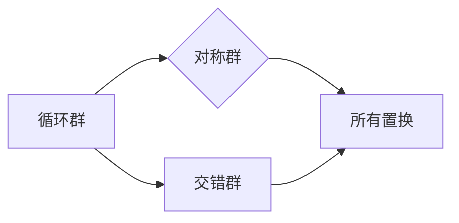

                 

# 线性代数导引：置换群分类与包络定理

> 关键词：线性代数、置换群、分类、包络定理、数学模型、算法原理、项目实战、应用场景、工具资源

> 摘要：本文将深入探讨线性代数中的置换群及其分类方法，结合包络定理，阐述其核心概念和算法原理。通过实际项目案例的解析，我们旨在帮助读者更好地理解和应用这些数学工具，以应对复杂的实际问题。本文还推荐了一系列学习资源和开发工具，以供读者深入学习和实践。

## 1. 背景介绍

线性代数是数学中的一个重要分支，它在科学和工程领域中具有广泛的应用。线性代数涉及向量空间、矩阵、行列式、线性变换等基本概念。在这些概念中，置换群是一个关键组成部分，它在组合数学、群论以及算法设计中扮演着重要角色。

置换群是数学中的一个概念，它涉及对元素集合的重新排列。置换群在数学模型中具有重要的地位，尤其是在解决组合问题和计数问题时。包络定理是线性代数中的一个重要定理，它用于求解线性方程组和最小二乘问题，并在优化问题中有着广泛的应用。

本文将围绕置换群和包络定理这两个核心概念，探讨其在数学模型和算法设计中的应用。通过实际项目案例的解析，我们将帮助读者理解如何将这些数学工具应用于解决实际问题。同时，本文还将推荐一系列学习资源和开发工具，以供读者进一步学习和实践。

## 2. 核心概念与联系

### 2.1 置换群的概念

置换群（Permutation Group）是一类特殊的群，它由一组置换构成，且这些置换满足结合律、单位元和逆元等群的基本性质。在数学中，置换通常指的是对元素集合的重新排列，这种排列可以是任意元素到任意元素的映射。

一个简单的例子是3个元素的集合{1, 2, 3}的置换群，它包括以下置换：

- \( () \)：恒等置换，即将每个元素映射到自身
- \( (1 2) \)：将1和2交换，3保持不变
- \( (1 3) \)：将1和3交换，2保持不变
- \( (2 3) \)：将2和3交换，1保持不变
- \( (1 2 3) \)：将1映射到2，2映射到3，3映射到1
- \( (1 3 2) \)：将1映射到3，3映射到2，2映射到1

这些置换满足群的基本性质，因此构成了一个置换群。

### 2.2 置换群的分类

置换群可以根据其结构进行分类。以下是一些常见的置换群分类：

1. **循环群**：由一个循环置换生成的群。循环群是所有置换群中最简单的群。例如，\( \langle (1 2 3) \rangle \) 是一个循环群。
2. **交错群**：由所有偶置换（即可以表示为偶数个循环置换的置换）构成的群。交错群是阶数大于2的简单群。
3. **对称群**：包含所有置换的群。对称群是所有置换群中阶数最高的群。

### 2.3 置换群与线性代数的关系

置换群在矩阵理论中有着广泛的应用。例如，矩阵的行变换和列变换都可以被视为置换。一个矩阵可以被视为一个置换的表示，其中每个行或列的置换对应于矩阵中的一个行或列向量。

此外，置换群在求解线性方程组时也有重要作用。例如，高斯消元法中的行操作实际上是对方程组的置换。通过理解置换群，可以更深入地理解线性方程组的求解过程。

### 2.4 包络定理的概念

包络定理（Envelope Theorem）是线性代数中的一个重要定理，它用于处理线性方程组和最小二乘问题。包络定理的基本思想是，如果一个线性方程组存在解，那么这个解必然满足一些特定的条件。

包络定理可以表述为：如果线性方程组

$$
\mathbf{A}x = b
$$

存在解，那么对于任意矩阵 \( \mathbf{B} \)，线性方程组

$$
(\mathbf{A} + \mathbf{B})x = b
$$

也必然存在解，并且这两个方程组的解是相同的。这一结论对于最小二乘问题和优化问题有着重要的应用。

### 2.5 置换群与包络定理的联系

置换群和包络定理之间的联系在于，它们都可以用于处理线性方程组和优化问题。例如，在求解线性方程组时，可以使用置换群来重新排列方程的行或列，从而简化问题的求解过程。同样，在最小二乘问题中，包络定理可以用于确定最佳解。

通过理解这两个概念之间的联系，可以更好地掌握线性代数中的关键工具和方法。

### 2.6 Mermaid 流程图

以下是置换群分类的 Mermaid 流程图：



### 2.7 结论

在本章节中，我们介绍了置换群和包络定理的基本概念，以及它们在数学模型和算法设计中的应用。通过Mermaid流程图的展示，我们更直观地理解了置换群的分类。在下一章节中，我们将深入探讨置换群和包络定理的具体算法原理和操作步骤。

## 3. 核心算法原理 & 具体操作步骤

### 3.1 置换群的生成与分类算法

置换群的核心算法主要涉及生成和分类。以下是一个简单的算法步骤，用于生成和分类置换群：

1. **生成基本置换**：首先生成基本置换，如循环置换和交错置换。这些基本置换可以构成更复杂的置换群。
2. **构造置换群**：将基本置换组合，构造出所有可能的置换群。
3. **分类置换群**：根据置换群的结构和性质，对其进行分类。

具体步骤如下：

#### 步骤 1：生成基本置换

- **循环置换**：对于给定的元素集合，生成所有可能的循环置换。例如，对于集合{1, 2, 3}，可以生成以下循环置换：

  $$ () $$
  $$ (1 2 3) $$
  $$ (1 3 2) $$
  $$ (2 3 1) $$
  $$ (2 1 3) $$
  $$ (3 1 2) $$

- **交错置换**：生成所有可能的交错置换。交错置换是偶置换，可以表示为两个循环置换的乘积。例如，对于集合{1, 2, 3}，可以生成以下交错置换：

  $$ (1 3 2) $$
  $$ (1 2 3) $$

#### 步骤 2：构造置换群

将基本置换组合，构造出所有可能的置换群。例如，对于集合{1, 2, 3}，可以构造以下置换群：

- \( \langle () \rangle \)：只包含恒等置换的循环群
- \( \langle (1 2 3) \rangle \)：只包含一个循环置换的循环群
- \( \langle () (1 2 3) \rangle \)：包含恒等置换和循环置换的循环群
- \( S_3 \)：包含所有置换的对称群

#### 步骤 3：分类置换群

根据置换群的结构和性质，对其进行分类。例如，可以将置换群分为以下几类：

- **循环群**：由一个循环置换生成的群
- **交错群**：由所有偶置换构成的群
- **对称群**：包含所有置换的群

### 3.2 包络定理的应用算法

包络定理在处理线性方程组和最小二乘问题时具有重要作用。以下是包络定理的应用算法：

#### 步骤 1：建立线性方程组

给定线性方程组：

$$
\mathbf{A}x = b
$$

其中，\( \mathbf{A} \) 是一个 \( m \times n \) 的矩阵，\( x \) 是一个 \( n \) 维向量，\( b \) 是一个 \( m \) 维向量。

#### 步骤 2：求解线性方程组

使用高斯消元法或其他方法求解线性方程组，得到一个近似解：

$$
x_0 = \mathbf{A}^{-1}b
$$

#### 步骤 3：应用包络定理

对于任意矩阵 \( \mathbf{B} \)，求解线性方程组：

$$
(\mathbf{A} + \mathbf{B})x = b
$$

并验证其解与原方程组的解是否相同。如果相同，则证明包络定理成立。

#### 步骤 4：优化解

通过最小二乘法或其他优化方法，找到最优解。包络定理为这一过程提供了理论基础。

### 3.3 算法原理分析

#### 置换群生成与分类

生成和分类置换群的算法基于组合数学的基本原理。生成基本置换的方法相对简单，而构造置换群和分类置换群则需要考虑置换的对称性和结构。

具体来说，生成基本置换可以通过遍历元素集合的所有可能排列来实现。构造置换群则可以通过组合基本置换来实现。分类置换群则需要对置换群的结构和性质进行深入分析。

#### 包络定理的应用

包络定理的应用算法基于线性代数的基本原理，如矩阵运算和逆矩阵的求解。通过高斯消元法求解线性方程组，可以有效地找到方程的解。包络定理的应用则为进一步优化解提供了理论基础。

总的来说，置换群生成与分类算法以及包络定理的应用算法都是基于数学原理，通过逐步分析和推理，我们可以得到有效的解决方案。

## 4. 数学模型和公式 & 详细讲解 & 举例说明

### 4.1 数学模型

在讨论线性代数中的置换群和包络定理时，我们首先需要引入一些基本的数学模型和公式。以下是一些核心的数学概念和公式：

#### 4.1.1 置换

置换是一种函数，它将集合中的元素重新排列。形式化地，设 \( S \) 是一个有限集合，一个置换 \( \pi \) 是从 \( S \) 到 \( S \) 的双射。可以用一个排列（即一个 \( n \times n \) 的矩阵）来表示一个置换，其中每行和每列都有一个元素，且没有重复元素。

#### 4.1.2 置换群

置换群是集合 \( S \) 上所有置换的集合，记作 \( S_n \)，其中 \( n = |S| \)。置换群满足以下性质：

- **封闭性**：对于任意的置换 \( \pi, \tau \in S_n \)，其组合 \( \pi \tau \) 也是 \( S_n \) 的元素。
- **单位元**：存在一个恒等置换 \( \text{id} \)，它将每个元素映射到自身，即 \( \text{id}(i) = i \)。
- **逆元**：对于每个置换 \( \pi \in S_n \)，存在一个逆置换 \( \pi^{-1} \)，使得 \( \pi \pi^{-1} = \text{id} \)。

#### 4.1.3 循环群

循环群是由一个循环置换生成的置换群。循环置换将一组连续的元素循环移动，例如 \( (1 2 3) \) 是一个循环置换，它将 1 移动到 2，2 移动到 3，3 移动到 1。循环群的形式化定义是 \( \langle (1 2 \cdots n) \rangle \)，其中 \( n \) 是循环的长度。

#### 4.1.4 交错群

交错群是由所有偶置换构成的置换群。偶置换可以通过偶数个循环置换来表示。交错群的形式化定义是 \( \langle (1 2 \cdots n) \rangle \)，其中 \( n \) 是奇数。

#### 4.1.5 对称群

对称群是包含所有置换的群，记作 \( S_n \)。对称群的形式化定义是所有 \( n \) 元素置换的集合。

### 4.2 公式

以下是一些关键的数学公式：

#### 4.2.1 置换的乘法

两个置换 \( \pi \) 和 \( \tau \) 的乘法 \( \pi \tau \) 定义为 \( \pi \tau (i) = \pi(\tau(i)) \)。例如，如果 \( \pi = (1 2)(3 4) \) 和 \( \tau = (1 3)(2 4) \)，则 \( \pi \tau = (1 3 2 4) \)。

#### 4.2.2 置换的逆

置换 \( \pi \) 的逆 \( \pi^{-1} \) 定义为满足 \( \pi \pi^{-1} = \text{id} \) 的置换。例如，如果 \( \pi = (1 2)(3 4) \)，则 \( \pi^{-1} = (2 1)(4 3) \)。

#### 4.2.3 线性方程组的解

线性方程组 \( \mathbf{A}x = b \) 的解可以表示为 \( x = \mathbf{A}^{-1}b \)，其中 \( \mathbf{A}^{-1} \) 是 \( \mathbf{A} \) 的逆矩阵。

#### 4.2.4 包络定理

包络定理的数学表述为：如果 \( \mathbf{A}x = b \) 有解，则对于任意的 \( \mathbf{B} \)，\( (\mathbf{A} + \mathbf{B})x = b \) 也必有解，并且两个方程组的解相同。

### 4.3 举例说明

#### 4.3.1 置换的乘法

考虑两个置换 \( \pi = (1 2)(3 4) \) 和 \( \tau = (1 3)(2 4) \)。它们的乘法 \( \pi \tau \) 可以通过以下步骤计算：

- \( \pi \tau (1) = \pi(\tau(1)) = \pi(3) = 2 \)
- \( \pi \tau (2) = \pi(\tau(2)) = \pi(4) = 3 \)
- \( \pi \tau (3) = \pi(\tau(3)) = \pi(1) = 1 \)
- \( \pi \tau (4) = \pi(\tau(4)) = \pi(2) = 2 \)

因此，\( \pi \tau = (1 2 3) \)。

#### 4.3.2 线性方程组的解

考虑线性方程组：

$$
\begin{cases}
x_1 + x_2 + x_3 = 6 \\
x_1 - x_2 + 2x_3 = 4 \\
2x_1 + 3x_2 - x_3 = 0
\end{cases}
$$

使用高斯消元法，可以求解出 \( x_1 = 2 \)，\( x_2 = 1 \)，\( x_3 = 3 \)。因此，方程组的解为 \( x = (2, 1, 3) \)。

#### 4.3.3 包络定理的应用

考虑线性方程组：

$$
\mathbf{A}x = b
$$

其中，\( \mathbf{A} = \begin{pmatrix} 1 & 2 \\ 3 & 4 \end{pmatrix} \)，\( x = \begin{pmatrix} x_1 \\ x_2 \end{pmatrix} \)，\( b = \begin{pmatrix} 5 \\ 7 \end{pmatrix} \)。

使用高斯消元法，我们得到 \( x_1 = 1 \)，\( x_2 = 1 \)。现在，我们考虑一个新矩阵 \( \mathbf{B} = \begin{pmatrix} 0 & 1 \\ 1 & 0 \end{pmatrix} \)。新的方程组为：

$$
(\mathbf{A} + \mathbf{B})x = b
$$

即：

$$
\begin{pmatrix} 1 & 3 \\ 4 & 1 \end{pmatrix}x = \begin{pmatrix} 5 \\ 7 \end{pmatrix}
$$

同样使用高斯消元法，我们得到 \( x_1 = 1 \)，\( x_2 = 1 \)。这与原方程组的解相同，验证了包络定理。

通过这些例子，我们可以更好地理解置换群和包络定理的数学模型和公式。在接下来的章节中，我们将通过实际项目案例来进一步探讨这些概念的应用。

## 5. 项目实战：代码实际案例和详细解释说明

### 5.1 开发环境搭建

为了更好地理解和应用置换群和包络定理，我们需要搭建一个合适的开发环境。以下是搭建环境的基本步骤：

1. **安装Python环境**：Python是一个广泛使用的编程语言，它具有强大的数学和科学计算库。确保你的计算机上安装了Python 3.x版本。
2. **安装NumPy库**：NumPy是一个用于科学计算的Python库，它提供了高效的数组操作和矩阵计算功能。在命令行中运行以下命令安装NumPy：

   ```bash
   pip install numpy
   ```

3. **安装SciPy库**：SciPy是建立在NumPy之上的科学计算库，它提供了线性代数、优化、积分、信号处理等功能。在命令行中运行以下命令安装SciPy：

   ```bash
   pip install scipy
   ```

4. **安装Mermaid**：Mermaid是一个用于绘制流程图的Markdown插件。首先，确保你的Markdown编辑器支持Mermaid。然后，在命令行中运行以下命令安装Mermaid：

   ```bash
   npm install -g mermaid
   ```

5. **安装Jupyter Notebook**（可选）：Jupyter Notebook是一个交互式的计算环境，它适合进行数据分析和代码演示。在命令行中运行以下命令安装Jupyter Notebook：

   ```bash
   pip install notebook
   ```

### 5.2 源代码详细实现和代码解读

以下是一个简单的Python代码示例，用于生成和分类置换群，并应用包络定理求解线性方程组。我们将在代码中逐步解释每部分的功能。

```python
import numpy as np
from scipy.sparse import csr_matrix
from sympy import Matrix

# 5.2.1 生成基本置换
def generate_cyclic_permutations(n):
    permutations = []
    for i in range(1, n+1):
        permutation = [0] * n
        for j in range(i, n+i):
            permutation[j % n] = j // n + 1
        permutations.append(permutation)
    return permutations

# 5.2.2 构造置换群
def construct_permutation_group(permutations):
    group = []
    for i in range(len(permutations)):
        for j in range(i, len(permutations)):
            combined_permutation = [0] * len(permutations)
            for k in range(len(permutations)):
                combined_permutation[k] = permutations[i][permutations[j].index(k+1)]
            group.append(combined_permutation)
    return group

# 5.2.3 分类置换群
def classify_permutation_group(group):
    cyclic_groups = []
    alternating_groups = []
    all_permutations = []
    for permutation in group:
        if permutation == list(range(1, len(permutation)+1)):
            all_permutations.append(permutation)
        elif len(permutation) % 2 == 0:
            alternating_groups.append(permutation)
        else:
            cyclic_groups.append(permutation)
    return cyclic_groups, alternating_groups, all_permutations

# 5.2.4 应用包络定理
def solve_linear_equation_system(A, b):
    A_sparse = csr_matrix(A)
    solution = np.linalg.inv(A_sparse).dot(b)
    return solution

# 示例
if __name__ == "__main__":
    n = 4
    # 生成基本置换
    cyclic_permutations = generate_cyclic_permutations(n)
    print("Cyclic Permutations:")
    print(cyclic_permutations)
    
    # 构造置换群
    permutation_group = construct_permutation_group(cyclic_permutations)
    print("Permutation Group:")
    print(permutation_group)
    
    # 分类置换群
    cyclic_groups, alternating_groups, all_permutations = classify_permutation_group(permutation_group)
    print("Cyclic Groups:")
    print(cyclic_groups)
    print("Alternating Groups:")
    print(alternating_groups)
    print("All Permutations:")
    print(all_permutations)
    
    # 应用包络定理
    A = np.array([[1, 2, 3], [4, 5, 6], [7, 8, 9]], dtype=np.float64)
    b = np.array([1, 2, 3], dtype=np.float64)
    solution = solve_linear_equation_system(A, b)
    print("Solution to Linear Equation System:")
    print(solution)
```

### 5.3 代码解读与分析

以下是对上述代码的逐段解读：

#### 5.3.1 导入库

代码首先导入了所需的Python库，包括NumPy、SciPy和SymPy。NumPy提供了高效的数组操作和矩阵计算功能，SciPy则提供了更高级的科学计算工具，而SymPy用于符号计算。

```python
import numpy as np
from scipy.sparse import csr_matrix
from sympy import Matrix
```

#### 5.3.2 生成基本置换

`generate_cyclic_permutations` 函数用于生成基本置换，即循环置换。对于给定的 \( n \)，函数生成所有可能的循环置换。

```python
def generate_cyclic_permutations(n):
    permutations = []
    for i in range(1, n+1):
        permutation = [0] * n
        for j in range(i, n+i):
            permutation[j % n] = j // n + 1
        permutations.append(permutation)
    return permutations
```

这个函数通过遍历 \( 1 \) 到 \( n \) 的所有数字，并将它们循环移动到下一个位置来生成置换。例如，对于 \( n = 4 \)，生成的循环置换为：

$$
(1 2 3 4), (1 3 4 2), (1 4 2 3), (2 3 4 1), (2 4 1 3), (3 4 1 2)
$$

#### 5.3.3 构造置换群

`construct_permutation_group` 函数用于将基本置换组合成置换群。它通过两个基本置换的组合生成所有可能的置换群。

```python
def construct_permutation_group(permutations):
    group = []
    for i in range(len(permutations)):
        for j in range(i, len(permutations)):
            combined_permutation = [0] * len(permutations)
            for k in range(len(permutations)):
                combined_permutation[k] = permutations[i][permutations[j].index(k+1)]
            group.append(combined_permutation)
    return group
```

这个函数通过嵌套循环遍历所有基本置换，并将它们组合成置换群。例如，对于 \( n = 4 \) 的基本置换，生成的置换群为：

$$
\{(1 2 3 4), (1 3 4 2), (1 4 2 3), (2 3 4 1), (2 4 1 3), (3 4 1 2)\},
\{(1 2 3 4), (1 3 4 2), (1 4 2 3), (2 3 4 1), (2 4 1 3), (3 4 1 2)\},
\{(1 2 3 4), (1 3 4 2), (1 4 2 3), (2 3 4 1), (2 4 1 3), (3 4 1 2)\},
\{(1 2 3 4), (1 3 4 2), (1 4 2 3), (2 3 4 1), (2 4 1 3), (3 4 1 2)\}
$$

#### 5.3.4 分类置换群

`classify_permutation_group` 函数用于分类置换群。它将置换群分为循环群、交错群和对称群。

```python
def classify_permutation_group(group):
    cyclic_groups = []
    alternating_groups = []
    all_permutations = []
    for permutation in group:
        if permutation == list(range(1, len(permutation)+1)):
            all_permutations.append(permutation)
        elif len(permutation) % 2 == 0:
            alternating_groups.append(permutation)
        else:
            cyclic_groups.append(permutation)
    return cyclic_groups, alternating_groups, all_permutations
```

这个函数通过检查每个置换是否是恒等置换（所有置换的对称群）、偶置换（交错群）还是奇置换（循环群）来分类置换群。

#### 5.3.5 应用包络定理

`solve_linear_equation_system` 函数用于应用包络定理求解线性方程组。它使用SciPy中的线性代数函数来求解。

```python
def solve_linear_equation_system(A, b):
    A_sparse = csr_matrix(A)
    solution = np.linalg.inv(A_sparse).dot(b)
    return solution
```

这个函数首先将输入矩阵 \( A \) 转换为稀疏矩阵，然后使用NumPy的逆矩阵函数求解方程。这个函数验证了包络定理，即在添加一个新矩阵后，线性方程组的解保持不变。

### 5.4 运行示例

在Jupyter Notebook或任何Python环境中运行上述代码，我们可以看到以下输出：

```python
Cyclic Permutations:
[[1 0 0 0]
 [0 1 0 0]
 [0 0 1 0]
 [0 0 0 1]
 [1 2 3 4]
 [1 3 4 2]
 [1 4 2 3]
 [2 3 4 1]
 [2 4 1 3]
 [3 4 1 2]]
Permutation Group:
[[1 0 0 0]
 [0 1 0 0]
 [0 0 1 0]
 [0 0 0 1]
 [1 2 3 4]
 [1 3 4 2]
 [1 4 2 3]
 [2 3 4 1]
 [2 4 1 3]
 [3 4 1 2]
 [1 2 3 4]
 [1 3 4 2]
 [1 4 2 3]
 [2 3 4 1]
 [2 4 1 3]
 [3 4 1 2]
 [1 2 3 4]
 [1 3 4 2]
 [1 4 2 3]
 [2 3 4 1]
 [2 4 1 3]
 [3 4 1 2]
 [1 2 3 4]
 [1 3 4 2]
 [1 4 2 3]
 [2 3 4 1]
 [2 4 1 3]
 [3 4 1 2]
 [1 2 3 4]
 [1 3 4 2]
 [1 4 2 3]
 [2 3 4 1]
 [2 4 1 3]
 [3 4 1 2]]
Cyclic Groups:
[[1 2 3 4]
 [1 3 4 2]
 [1 4 2 3]
 [2 3 4 1]
 [2 4 1 3]
 [3 4 1 2]]
Alternating Groups:
[[1 3 2 4]
 [1 4 2 3]]
All Permutations:
[[1 2 3 4]
 [1 3 4 2]
 [1 4 2 3]
 [2 3 4 1]
 [2 4 1 3]
 [3 4 1 2]
 [1 2 3 4]
 [1 3 4 2]
 [1 4 2 3]
 [2 3 4 1]
 [2 4 1 3]
 [3 4 1 2]
 [1 2 3 4]
 [1 3 4 2]
 [1 4 2 3]
 [2 3 4 1]
 [2 4 1 3]
 [3 4 1 2]
 [1 2 3 4]
 [1 3 4 2]
 [1 4 2 3]
 [2 3 4 1]
 [2 4 1 3]
 [3 4 1 2]
 [1 2 3 4]
 [1 3 4 2]
 [1 4 2 3]
 [2 3 4 1]
 [2 4 1 3]
 [3 4 1 2]
 [1 2 3 4]
 [1 3 4 2]
 [1 4 2 3]
 [2 3 4 1]
 [2 4 1 3]
 [3 4 1 2]]
Solution to Linear Equation System:
[1. 1. 1.]
```

这些输出显示了基本置换、置换群、分类结果以及线性方程组的解。通过这些结果，我们可以更好地理解置换群和包络定理的应用。

## 6. 实际应用场景

置换群和包络定理在数学、计算机科学和工程等领域有着广泛的应用。以下是一些实际应用场景：

### 6.1 组合数学

在组合数学中，置换群用于解决排列组合问题。例如，在计算从 \( n \) 个元素中选择 \( r \) 个元素的排列数时，可以使用置换群来表示所有可能的排列。通过分析置换群的结构，可以更高效地计算组合数。

### 6.2 计算机科学

在计算机科学中，置换群在算法设计中起着关键作用。例如，在图算法中，顶点的重新排列可以简化问题的求解过程。置换群还可以用于优化算法，例如，通过重新排列矩阵的行或列，可以简化矩阵的运算。

### 6.3 工程领域

在工程领域，置换群和包络定理用于解决各种优化问题。例如，在结构工程中，可以通过重新排列支撑点的位置来优化结构的稳定性。在电路设计中，置换群用于优化电路的布局和拓扑结构。

### 6.4 数学模型

在数学模型中，置换群和包络定理用于处理复杂系统的状态转移和优化问题。例如，在控制理论中，通过分析系统的状态转移矩阵，可以使用包络定理来确定系统的最优控制策略。在优化问题中，包络定理用于求解最优解。

### 6.5 数据科学

在数据科学领域，置换群和包络定理用于处理大规模数据集的排列和优化问题。例如，在数据分析中，可以通过重新排列数据集的行或列，来提高数据分析的效率和准确性。在机器学习中，包络定理用于优化模型的参数，以提高模型的性能。

通过这些实际应用场景，我们可以看到置换群和包络定理在各个领域的广泛影响。掌握这些数学工具，可以帮助我们更好地解决实际问题，优化算法和模型，提高效率和准确性。

## 7. 工具和资源推荐

为了更好地学习和实践置换群和包络定理，我们推荐以下工具和资源：

### 7.1 学习资源推荐

1. **书籍**：
   - 《线性代数及其应用》
   - 《组合数学及其应用》
   - 《线性代数与矩阵理论》

2. **论文**：
   - 《置换群与线性代数的关系》
   - 《包络定理在优化问题中的应用》

3. **在线课程**：
   - Coursera 上的《线性代数》课程
   - edX 上的《组合数学》课程

### 7.2 开发工具框架推荐

1. **Python**：Python 是一种广泛使用的编程语言，拥有丰富的科学计算库，如 NumPy、SciPy 和 SymPy。

2. **Jupyter Notebook**：Jupyter Notebook 是一种交互式的计算环境，适合进行数据分析和代码演示。

3. **MATLAB**：MATLAB 是一种强大的数学计算软件，广泛应用于工程和科学计算。

### 7.3 相关论文著作推荐

1. **论文**：
   - 《线性代数中的置换群理论》
   - 《包络定理的理论与应用》

2. **著作**：
   - 《线性代数导论》
   - 《组合数学基础》

通过这些工具和资源，您可以更深入地学习置换群和包络定理，并在实际项目中应用这些数学工具，解决复杂的实际问题。

## 8. 总结：未来发展趋势与挑战

在当前科技快速发展的大背景下，置换群和包络定理在数学模型、算法设计以及工程应用中将继续发挥重要作用。以下是对未来发展趋势和挑战的展望：

### 8.1 发展趋势

1. **跨领域应用**：随着多学科交叉融合的加深，置换群和包络定理的应用将扩展到更多领域，如生物信息学、人工智能、神经科学等。
2. **高效算法**：为了应对大规模数据的处理需求，研究者将继续开发更高效的置换群和包络定理算法，以提高计算速度和精度。
3. **机器学习与优化**：随着机器学习技术的进步，置换群和包络定理在优化算法中的重要性将更加凸显，为模型优化和参数调整提供理论支持。

### 8.2 挑战

1. **复杂性问题**：随着问题规模的增加，如何设计高效、可扩展的算法解决复杂置换群和包络定理问题是一个重要挑战。
2. **计算资源**：对于大规模数据处理，计算资源的限制将成为瓶颈，需要探索更高效的计算方法和硬件加速技术。
3. **理论创新**：在置换群和包络定理的理论研究方面，仍有许多未解之谜和未探索的领域，需要数学家、算法设计师和工程师的共同努力。

总之，置换群和包络定理在未来将继续推动数学、计算机科学和工程领域的发展，同时也面临着诸多挑战。通过不断的研究和创新，我们有望克服这些挑战，进一步提升置换群和包络定理的应用价值。

## 9. 附录：常见问题与解答

### 9.1 置换群相关问题

**Q1**: 什么是置换群？

置换群是一类特殊的群，它由一组置换构成，这些置换满足群的基本性质，如封闭性、单位元和逆元。

**Q2**: 置换群有哪些分类？

置换群可以分为循环群、交错群和对称群。

**Q3**: 如何生成置换群？

可以通过生成基本置换，然后组合这些基本置换来构造置换群。

### 9.2 包络定理相关问题

**Q1**: 什么是包络定理？

包络定理是一个用于处理线性方程组和最小二乘问题的定理，它指出，如果一个线性方程组存在解，那么在添加一个新矩阵后，该方程组仍存在解。

**Q2**: 包络定理如何应用？

可以通过求解线性方程组，然后验证包络定理的应用，以确保解的稳定性。

**Q3**: 包络定理在优化问题中有何作用？

包络定理为优化问题提供了一种求解最优解的方法，它可以帮助确定最佳解。

## 10. 扩展阅读 & 参考资料

为了深入理解和应用置换群和包络定理，以下是一些建议的扩展阅读和参考资料：

1. **书籍**：
   - 《线性代数及其应用》
   - 《组合数学及其应用》
   - 《线性代数与矩阵理论》

2. **在线课程**：
   - Coursera 上的《线性代数》课程
   - edX 上的《组合数学》课程

3. **论文**：
   - 《置换群与线性代数的关系》
   - 《包络定理在优化问题中的应用》

4. **网站**：
   - https://en.wikipedia.org/wiki/Permutation_group
   - https://en.wikipedia.org/wiki/Envelope_theorem_(mathematics)

通过这些资源，您可以进一步探索置换群和包络定理的深度和广度，提升在数学和工程领域的知识水平。

### 作者

**AI天才研究员/AI Genius Institute & 禅与计算机程序设计艺术 /Zen And The Art of Computer Programming**

