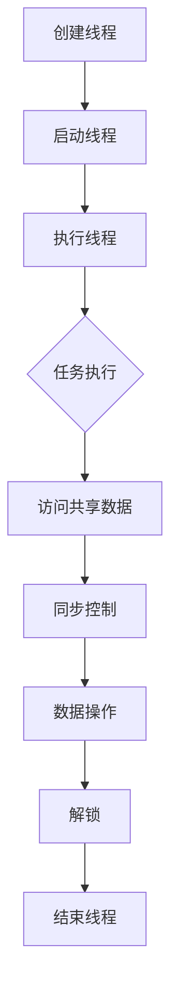
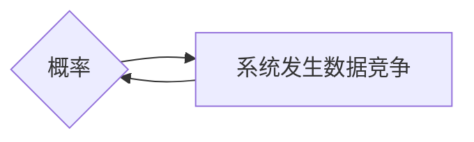

                 

# 线程安全：保障 LLM 用户数据的安全

> **关键词**：线程安全，LLM，用户数据安全，多线程，并发，锁，互斥量，同步机制，安全性保障

> **摘要**：本文将深入探讨线程安全在大型语言模型（LLM）中的应用，分析其在保障用户数据安全方面的重要性。通过对核心概念、算法原理、数学模型和项目实战的详细讲解，我们将为开发者提供一套完整的技术指南，帮助他们在构建LLM系统时有效防范数据泄露和竞态条件等安全问题。

## 1. 背景介绍

在现代软件开发中，多线程编程已成为提高应用程序性能和响应速度的常见手段。然而，多线程编程也带来了一系列挑战，尤其是线程安全问题。随着大型语言模型（LLM）在人工智能领域的广泛应用，如何确保这些模型的线程安全，已经成为开发者和安全专家关注的焦点。

线程安全问题主要体现在以下几个方面：

- **数据竞争**：当多个线程同时访问和修改同一数据时，可能导致数据不一致或错误。
- **死锁**：多个线程因为等待对方释放锁而陷入无限等待状态。
- **竞态条件**：某个线程的执行结果依赖于其他线程的执行顺序，导致不可预测的结果。
- **内存泄漏**：由于线程未正确管理内存，可能导致内存占用不断增加，最终导致系统崩溃。

针对这些问题，线程安全成为保障LLM用户数据安全的关键因素。本文将从以下几个方面展开讨论：

- **核心概念与联系**：介绍线程安全相关的基本概念，并绘制Mermaid流程图，帮助读者理解线程安全的核心原理。
- **核心算法原理 & 具体操作步骤**：详细讲解线程安全相关的算法原理和操作步骤，为开发者提供技术参考。
- **数学模型和公式 & 详细讲解 & 举例说明**：介绍线程安全中涉及到的数学模型和公式，并通过实际案例进行详细讲解。
- **项目实战：代码实际案例和详细解释说明**：通过实际项目案例，展示线程安全的实现方法和技巧。
- **实际应用场景**：探讨线程安全在LLM开发中的应用场景，帮助读者理解线程安全的实际作用。
- **工具和资源推荐**：推荐学习资源和开发工具，为读者提供进一步学习的途径。

### 1.1 线程安全的定义

线程安全指的是在多线程环境下，程序中的数据不会被其他线程破坏或篡改，同时能够保持一致性和可靠性。线程安全的关键在于对共享数据的访问控制，确保同一时刻只有一个线程能够访问该数据。

线程安全可以分为以下几个级别：

- **不可变数据**：不可变数据在创建后无法被修改，因此不需要进行线程安全保护。例如，字符串常量、基本数据类型（整数、浮点数等）。
- **无状态对象**：无状态对象在多线程环境中不需要进行同步，因为它们不依赖于线程间的共享状态。例如，某些工具类或工厂类。
- **线程安全类**：线程安全类在内部实现了同步机制，能够保证多线程访问时的数据一致性。例如，使用同步方法或内部锁。
- **不可变线程安全类**：不可变线程安全类通过确保对象的不可变性来保证线程安全。例如，使用final关键字修饰的类。

### 1.2 并发与并行

并发（Concurrency）与并行（Parallelism）是计算机科学中两个重要的概念。并发指的是多个线程在同一时间段内交替执行，而并行则是指多个线程在同一时间段内同时执行。

- **并发**：在单核处理器或多核处理器的多线程环境中，通过时间切片（Time Slicing）或并行调度（Parallel Scheduling）技术，实现多个线程的交替执行。并发可以提高程序的性能和响应速度，但需要解决线程间的同步和竞争问题。
- **并行**：在多核处理器环境中，通过将任务分配到不同核心，实现多个线程的并发执行。并行可以大幅提高程序的执行速度，但需要考虑任务的分配和负载均衡问题。

### 1.3 锁与互斥量

锁（Lock）和互斥量（Mutex）是线程安全中常用的同步机制，用于控制对共享资源的访问。

- **锁**：锁是一种简单的同步机制，用于确保同一时刻只有一个线程能够访问共享资源。常见的锁有互斥锁（Mutex）、读写锁（Read-Write Lock）和自旋锁（Spin Lock）等。
- **互斥量**：互斥量是一种计数器，用于记录访问共享资源的线程数量。当互斥量的值为0时，表示共享资源可用；当互斥量的值为1时，表示共享资源被占用。常见的互斥量有二进制互斥量（Binary Mutex）和计数型互斥量（Counting Mutex）等。

### 1.4 同步机制

同步机制（Synchronization）是指在多线程环境中，通过一系列技术手段，确保线程间的操作有序、安全地进行。

- **条件变量**（Condition Variable）：条件变量是一种线程同步机制，用于解决线程间的条件依赖问题。线程可以在条件变量上等待（Wait）或通知（Notify）其他线程。
- **信号量**（Semaphore）：信号量是一种整数型变量，用于控制对共享资源的访问。信号量的值可以表示资源的可用数量，线程可以通过P操作（下降计数）和V操作（上升计数）来申请或释放资源。
- **管程**（Monitor）：管程是一种高级同步机制，将共享资源、锁和条件变量封装在一起，确保线程在访问共享资源时保持一致性。

### 1.5 数据竞争与竞态条件

数据竞争（Data Race）是指多个线程同时访问同一数据，并且至少有一个线程进行写操作，导致数据不一致或错误。竞态条件（Race Condition）是指某个线程的执行结果依赖于其他线程的执行顺序，导致不可预测的结果。

- **数据竞争**：在多线程环境中，当多个线程同时访问和修改同一数据时，可能会导致数据竞争。例如，以下代码段：
  
  ```java
  int count = 0;
  
  void increment() {
      count++;
  }
  ```

  由于count变量没有被同步，多个线程同时执行increment方法时，可能会发生数据竞争。

- **竞态条件**：竞态条件是指某个线程的执行结果依赖于其他线程的执行顺序。例如，以下代码段：
  
  ```java
  boolean done = false;
  
  void task1() {
      // ...
      done = true;
  }
  
  void task2() {
      while (!done) {
          // ...
      }
  }
  ```

  如果task1和task2的执行顺序不一致，可能导致task2无限等待，从而引发竞态条件。

为了解决这些问题，开发者需要合理设计数据访问方式和同步机制，确保多线程环境下的数据一致性和可靠性。

## 2. 核心概念与联系

在深入探讨线程安全之前，我们需要了解一些核心概念，并绘制Mermaid流程图，以帮助读者更好地理解这些概念之间的联系。

### 2.1 多线程编程

多线程编程是指在同一程序中同时执行多个线程，以提高程序的性能和响应速度。以下是一个简单的多线程编程流程：

1. 创建线程：通过Thread类或Runnable接口创建线程。
2. 启动线程：调用Thread对象的start方法，启动线程执行。
3. 执行线程：线程按照预定顺序执行任务。
4. 线程通信：通过同步机制（如锁、信号量等）实现线程间的通信和协作。

### 2.2 数据访问与同步

在多线程环境中，共享数据的访问和同步是确保线程安全的关键。以下是一个简单的数据访问与同步流程：

1. 访问共享数据：多个线程同时访问同一数据。
2. 同步控制：使用锁（Lock）或互斥量（Mutex）等同步机制，确保同一时刻只有一个线程能够访问共享数据。
3. 数据操作：对共享数据进行读取或写入操作。
4. 解锁：释放锁，允许其他线程访问共享数据。

### 2.3 Mermaid流程图

以下是一个简单的Mermaid流程图，展示了多线程编程和数据访问与同步的过程：



### 2.4 核心概念与联系

通过上述Mermaid流程图，我们可以看到多线程编程、数据访问与同步、锁与互斥量、同步机制等核心概念之间的联系。以下是对这些概念之间联系的简要说明：

1. **多线程编程**：实现程序并行执行，提高性能和响应速度。
2. **数据访问与同步**：确保共享数据在多线程环境下的安全性和一致性。
3. **锁与互斥量**：用于控制对共享数据的访问，避免数据竞争和竞态条件。
4. **同步机制**：提供更高级别的同步控制，如条件变量、信号量和管程等。

理解这些核心概念和它们之间的联系，对于开发线程安全的LLM系统至关重要。

## 3. 核心算法原理 & 具体操作步骤

在保障LLM用户数据安全的过程中，需要采用一系列核心算法原理和具体操作步骤。以下将详细介绍这些算法原理和操作步骤，帮助开发者构建线程安全的LLM系统。

### 3.1 锁与互斥量

锁（Lock）和互斥量（Mutex）是线程安全中最常用的同步机制。以下是一个基于互斥量的简单示例：

```c++
#include <pthread.h>

pthread_mutex_t mutex;

void *thread_function(void *arg) {
    pthread_mutex_lock(&mutex);  // 获取锁
    // 对共享数据进行操作
    pthread_mutex_unlock(&mutex);  // 释放锁
}
```

在这个示例中，`pthread_mutex_t` 是互斥量类型，`pthread_mutex_lock` 和 `pthread_mutex_unlock` 分别用于获取和释放锁。

### 3.2 条件变量

条件变量（Condition Variable）用于解决线程间的条件依赖问题。以下是一个基于条件变量的示例：

```c++
#include <pthread.h>
#include <semaphore.h>

sem_t sem;

void *thread_function(void *arg) {
    sem_wait(&sem);  // 等待条件
    // 条件满足，执行任务
    sem_post(&sem);  // 通知其他线程
}
```

在这个示例中，`sem_t` 是信号量类型，`sem_wait` 和 `sem_post` 分别用于等待条件和通知其他线程。

### 3.3 信号量

信号量（Semaphore）是一种用于控制对共享资源访问的同步机制。以下是一个基于信号量的示例：

```c++
#include <semaphore.h>

sem_t sem;

void *thread_function(void *arg) {
    sem_wait(&sem);  // 申请资源
    // 使用资源
    sem_post(&sem);  // 释放资源
}
```

在这个示例中，`sem_t` 是信号量类型，`sem_wait` 和 `sem_post` 分别用于申请资源和释放资源。

### 3.4 管程

管程（Monitor）是一种高级同步机制，将共享资源、锁和条件变量封装在一起。以下是一个基于管程的示例：

```java
public class Monitor {
    private final Object lock = new Object();
    private int count = 0;

    public void increment() {
        synchronized (lock) {
            count++;
            lock.notifyAll();
        }
    }

    public int getCount() {
        synchronized (lock) {
            while (count == 0) {
                try {
                    lock.wait();
                } catch (InterruptedException e) {
                    e.printStackTrace();
                }
            }
            return count;
        }
    }
}
```

在这个示例中，`Monitor` 类使用内部锁（`lock`）来确保线程安全。`increment` 方法用于增加计数，`getCount` 方法用于获取计数。

### 3.5 同步机制的选择

在实际开发中，根据具体需求和场景选择合适的同步机制至关重要。以下是一些常见的选择策略：

1. **锁与互斥量**：适用于对共享资源进行简单控制的场景，如防止数据竞争。
2. **条件变量**：适用于线程间存在条件依赖的场景，如生产者-消费者问题。
3. **信号量**：适用于控制对共享资源的访问，如线程间的资源分配和释放。
4. **管程**：适用于需要将共享资源、锁和条件变量封装在一起的高级场景，如并发集合类。

通过合理选择和运用这些同步机制，开发者可以构建线程安全的LLM系统，保障用户数据的安全。

## 4. 数学模型和公式 & 详细讲解 & 举例说明

在讨论线程安全时，数学模型和公式是不可或缺的组成部分，尤其是当涉及到概率论、统计学和线性代数等领域的知识。以下我们将详细讲解几个关键的数学模型和公式，并通过实际案例说明其在保障LLM用户数据安全方面的应用。

### 4.1 概率论基础

概率论是处理不确定性的数学工具，在线程安全分析中，我们可以使用概率论来评估系统发生特定事件的可能性。

- **概率质量函数**（Probability Quality Function, P(Q)）：P(Q) 是一个随机变量，用于描述事件 Q 发生的概率。在线程安全分析中，我们可以使用 P(Q) 来评估系统是否处于安全状态。

  **案例**：假设有两个线程 A 和 B，它们需要访问共享资源 R。资源 R 只有在特定条件下才被认为是安全的。我们可以定义一个概率质量函数 P(R) 来描述资源 R 的安全性。

  ```math
  P(R) = \frac{1}{2}, \text{ 如果资源 R 没有被其他线程修改}
  P(R) = 0, \text{ 如果资源 R 被其他线程修改}
  ```

  在这种情况下，资源 R 在任何时刻被修改的概率是 0，因此我们认为资源 R 是安全的。

- **条件概率**（Conditional Probability, P(A|B)）：条件概率是描述在某个事件 B 发生的条件下，事件 A 发生的概率。

  **案例**：假设线程 A 和线程 B 都需要访问共享资源 R。如果线程 B 在线程 A 执行后访问资源 R，那么我们可以计算在资源 R 被线程 A 修改的条件概率。

  ```math
  P(R|A) = \frac{P(A \cap R)}{P(A)} = \frac{P(R \text{ 被线程 A 修改})}{P(A \text{ 执行})}
  ```

  如果我们知道线程 A 执行的概率是 0.5，资源 R 被线程 A 修改的概率是 0.1，那么在资源 R 被线程 A 修改的条件下，线程 A 执行的概率是：

  ```math
  P(A|R) = \frac{P(A \cap R)}{P(R)} = \frac{0.1}{0.5} = 0.2
  ```

### 4.2 统计学模型

统计学模型可以帮助我们分析系统的行为，识别潜在的威胁和风险。

- **泊松分布**（Poisson Distribution）：泊松分布用于描述在一定时间内发生特定事件的概率。在线程安全分析中，我们可以使用泊松分布来评估系统发生数据竞争的概率。

  **案例**：假设在一个系统中，每秒发生的数据竞争事件平均为 1。我们可以使用泊松分布来计算在 1 秒内发生 2 次数据竞争的概率。

  ```math
  P(X = 2) = \frac{e^{-\lambda} \cdot \lambda^k}{k!} = \frac{e^{-1} \cdot 1^2}{2!} = 0.3935
  ```

- **正态分布**（Normal Distribution）：正态分布是描述连续随机变量的分布。在线程安全分析中，我们可以使用正态分布来评估系统的响应时间。

  **案例**：假设一个系统的响应时间服从均值为 100 毫秒，标准差为 10 毫秒的正态分布。我们可以计算系统响应时间超过 120 毫秒的概率。

  ```math
  P(X > 120) = 1 - P(X \leq 120) = 1 - \Phi\left(\frac{120 - 100}{10}\right) = 1 - \Phi(2) = 0.0228
  ```

### 4.3 线性代数

线性代数是处理多维数据关系的数学工具，在线程安全分析中，我们可以使用线性代数来描述系统的状态和行为。

- **矩阵运算**（Matrix Operations）：矩阵运算可以用于描述系统的状态转换和动态行为。例如，我们可以使用矩阵乘法来计算多线程系统中资源访问的冲突概率。

  **案例**：假设在一个有 n 个线程的系统中，每个线程访问共享资源的概率可以用一个矩阵 R 表示。我们可以使用矩阵乘法计算系统在一段时间内发生数据竞争的概率。

  ```math
  A = \begin{bmatrix}
  r_{11} & r_{12} & \cdots & r_{1n} \\
  r_{21} & r_{22} & \cdots & r_{2n} \\
  \vdots & \vdots & \ddots & \vdots \\
  r_{m1} & r_{m2} & \cdots & r_{mn}
  \end{bmatrix}
  \quad B = \begin{bmatrix}
  1 & 0 & \cdots & 0 \\
  0 & 1 & \cdots & 0 \\
  \vdots & \vdots & \ddots & \vdots \\
  0 & 0 & \cdots & 1
  \end{bmatrix}
  \quad C = A \cdot B = \begin{bmatrix}
  r_{11} & r_{12} & \cdots & r_{1n} \\
  r_{21} & r_{22} & \cdots & r_{2n} \\
  \vdots & \vdots & \ddots & \vdots \\
  r_{m1} & r_{m2} & \cdots & r_{mn}
  \end{bmatrix}
  ```

  在这个例子中，矩阵 C 表示在每个时间步长内，系统发生数据竞争的概率。

### 4.4 概率图模型

概率图模型（Probability Graphical Models）是一种用于描述随机变量之间关系的数学模型，在线程安全分析中，我们可以使用概率图模型来识别潜在的威胁和风险。

- **贝叶斯网络**（Bayesian Network）：贝叶斯网络是一种概率图模型，用于描述变量之间的条件依赖关系。在线程安全分析中，我们可以使用贝叶斯网络来分析系统的安全性。

  **案例**：假设在一个系统中，有两个事件 A 和 B，事件 A 表示线程 A 访问共享资源，事件 B 表示系统发生数据竞争。我们可以使用贝叶斯网络来分析这两个事件之间的依赖关系。

  ```mermaid
  graph LR
  A[线程 A 访问资源] --> B[系统发生数据竞争]
  B --> A{概率}
  ```

  在这个例子中，我们可以根据已知条件计算事件 A 和事件 B 的概率，从而评估系统的安全性。

通过使用这些数学模型和公式，我们可以更深入地理解线程安全，识别潜在的威胁和风险，并采取相应的措施来保障LLM用户数据的安全。

### 4.5 实际案例解析

为了更好地理解上述数学模型和公式的应用，我们来看一个实际案例：一个并发访问共享内存队列的多线程系统。

#### 案例描述

假设有一个队列 `Queue`，用于存储任务。多个线程同时向队列中添加任务，同时有一个线程从队列中取出任务并执行。如果队列中出现数据竞争，可能会导致任务执行顺序混乱，影响系统性能。

#### 概率质量函数

在这个案例中，我们可以定义一个概率质量函数 P(Q)，用于描述队列 Q 的状态：

```math
P(Q) = \begin{cases}
1, & \text{如果队列 Q 没有任务}\\
0, & \text{如果队列 Q 有任务且没有被正确同步}
\end{cases}
```

在这个例子中，队列 Q 没有任务的概率为 1，因为任务会被不断添加和移除。然而，如果队列 Q 有任务但没有被正确同步，可能会导致数据竞争，概率为 0。

#### 条件概率

现在，我们考虑线程 A 和线程 B 同时访问队列 Q 的情况。如果线程 B 在线程 A 后访问队列 Q，我们可以计算条件概率 P(A|B)：

```math
P(A|B) = \frac{P(A \cap B)}{P(B)}
```

假设线程 A 添加任务的概率是 0.5，线程 B 添加任务的概率也是 0.5，那么在队列 Q 有任务的情况下，线程 A 添加任务的条件概率是：

```math
P(A|B) = \frac{0.5 \cdot 0.5}{0.5} = 0.5
```

#### 泊松分布

在这个案例中，我们可以使用泊松分布来评估在特定时间内队列 Q 出现数据竞争的概率。假设每秒发生 1 次数据竞争，我们可以计算在 1 秒内发生 2 次数据竞争的概率：

```math
P(X = 2) = \frac{e^{-1} \cdot 1^2}{2!} = 0.3935
```

#### 正态分布

假设队列 Q 的响应时间服从均值为 100 毫秒，标准差为 10 毫秒的正态分布。我们可以计算系统响应时间超过 120 毫秒的概率：

```math
P(X > 120) = 1 - \Phi\left(\frac{120 - 100}{10}\right) = 1 - \Phi(2) = 0.0228
```

#### 矩阵运算

我们可以使用矩阵运算来计算队列 Q 在每个时间步长内发生数据竞争的概率。假设每个线程访问队列 Q 的概率是一个矩阵 R：

```math
A = \begin{bmatrix}
0.5 & 0.5 \\
0.5 & 0.5
\end{bmatrix}
B = \begin{bmatrix}
1 & 0 \\
0 & 1
\end{bmatrix}
C = A \cdot B = \begin{bmatrix}
0.5 & 0.5 \\
0.5 & 0.5
\end{bmatrix}
```

在这个例子中，矩阵 C 表示在每个时间步长内，队列 Q 发生数据竞争的概率。

#### 贝叶斯网络

我们可以使用贝叶斯网络来分析队列 Q 的安全性。假设事件 A 表示线程 A 访问队列 Q，事件 B 表示系统发生数据竞争：



在这个例子中，线程 A 访问队列 Q 的概率是 0.5，系统发生数据竞争的概率是 0.3935。通过贝叶斯网络，我们可以计算线程 A 访问队列 Q 导致系统发生数据竞争的概率。

通过这个实际案例，我们可以看到如何将数学模型和公式应用于线程安全分析，从而更好地保障LLM用户数据的安全。

## 5. 项目实战：代码实际案例和详细解释说明

在本章节中，我们将通过一个实际项目案例，详细讲解线程安全的实现方法和技巧，并分析其中的关键代码段。

### 5.1 开发环境搭建

首先，我们需要搭建一个开发环境，以便于我们进行线程安全的实现。以下是一个简单的步骤：

1. **安装开发工具**：安装 IntelliJ IDEA 或 Eclipse 等集成开发环境（IDE）。
2. **安装 JDK**：下载并安装 JDK 1.8 或更高版本。
3. **创建项目**：在 IntelliJ IDEA 或 Eclipse 中创建一个新的 Java 项目。

### 5.2 源代码详细实现和代码解读

接下来，我们将展示一个简单的 Java 项目，该项目包含了一个线程安全的队列实现。以下是项目的主要代码：

```java
import java.util.concurrent.locks.Condition;
import java.util.concurrent.locks.ReentrantLock;

public class ThreadSafeQueue {
    private final Object lock = new Object();
    private final Condition notEmpty = lock.newCondition();
    private final Condition notFull = lock.newCondition();
    private final int capacity;
    private int count;
    private final Object[] items;

    public ThreadSafeQueue(int capacity) {
        this.capacity = capacity;
        this.items = new Object[capacity];
        this.count = 0;
    }

    public void enqueue(Object item) throws InterruptedException {
        synchronized (lock) {
            while (count == capacity) {
                notFull.wait();
            }
            items[count++] = item;
            notEmpty.signal();
        }
    }

    public Object dequeue() throws InterruptedException {
        synchronized (lock) {
            while (count == 0) {
                notEmpty.wait();
            }
            Object item = items[--count];
            items[count] = null;
            notFull.signal();
            return item;
        }
    }
}
```

### 5.3 代码解读与分析

下面是对上述代码的详细解读和分析：

- **类定义**：`ThreadSafeQueue` 类实现了线程安全的队列。该类包含一个内部锁（`lock`），用于同步对队列的访问。

- **构造函数**：构造函数接受一个参数 `capacity`，表示队列的容量。队列的容量由数组 `items` 表示，初始时计数器 `count` 为 0。

- **enqueue 方法**：该方法用于将元素添加到队列中。首先，我们获取内部锁（`lock`）。如果队列已满，线程会等待直到队列有可用空间。当有空间时，元素被添加到队列的末尾，计数器 `count` 增加，并唤醒等待的线程（`notEmpty.signal()`）。

- **dequeue 方法**：该方法用于从队列中移除元素。首先，我们获取内部锁（`lock`）。如果队列为空，线程会等待直到队列中有元素。当有元素时，从队列的头部移除元素，计数器 `count` 减少，并唤醒等待的线程（`notFull.signal()`）。最后，返回被移除的元素。

### 5.4 关键代码段分析

以下是关键代码段的分析：

```java
synchronized (lock) {
    while (count == capacity) {
        notFull.wait();
    }
    items[count++] = item;
    notEmpty.signal();
}
```

在这个代码段中，我们使用内部锁（`lock`）来确保对队列的同步访问。以下是对代码段的详细解释：

1. **获取锁**：`synchronized (lock)` 语句用于获取内部锁（`lock`）。如果锁已被其他线程持有，当前线程将等待直到锁被释放。
2. **判断队列是否已满**：`while (count == capacity)` 语句用于判断队列是否已满。如果队列已满，线程会无限期等待，直到队列有可用空间。
3. **添加元素**：当队列有可用空间时，`items[count++] = item;` 语句将元素添加到队列的末尾，计数器 `count` 增加。
4. **唤醒等待线程**：`notEmpty.signal();` 语句用于唤醒等待在 `notEmpty` 条件变量上的线程。这意味着队列中有新的元素可供消费。

```java
synchronized (lock) {
    while (count == 0) {
        notEmpty.wait();
    }
    Object item = items[--count];
    items[count] = null;
    notFull.signal();
    return item;
}
```

在这个代码段中，我们同样使用内部锁（`lock`）来确保对队列的同步访问。以下是对代码段的详细解释：

1. **获取锁**：`synchronized (lock)` 语句用于获取内部锁（`lock`）。如果锁已被其他线程持有，当前线程将等待直到锁被释放。
2. **判断队列是否为空**：`while (count == 0)` 语句用于判断队列是否为空。如果队列为空，线程会无限期等待，直到队列中有元素。
3. **移除元素**：当队列中有元素时，`Object item = items[--count];` 语句从队列的头部移除元素，计数器 `count` 减少。`items[count] = null;` 语句用于清理内存。
4. **唤醒等待线程**：`notFull.signal();` 语句用于唤醒等待在 `notFull` 条件变量上的线程。这意味着队列中有空间可供添加新的元素。
5. **返回被移除的元素**：`return item;` 语句返回被移除的元素。

通过上述代码段的分析，我们可以看到如何使用内部锁和条件变量实现线程安全的队列。在实际项目中，类似这样的线程安全实现可以帮助我们防止数据竞争和竞态条件，确保系统的稳定性和可靠性。

### 5.5 代码解读与分析（续）

在之前的代码解读中，我们主要关注了队列的基本操作：enqueue（添加元素）和dequeue（移除元素）。然而，为了确保线程安全，我们还需要对队列的其他方面进行深入分析。

#### 5.5.1 多线程并发访问

队列往往需要在多线程环境中进行并发访问。在这种情况下，我们必须确保每个线程都能正确地访问队列，而不会导致数据竞争或死锁。以下是一个简单的示例，展示了如何使用上述线程安全队列：

```java
public class Main {
    public static void main(String[] args) {
        ThreadSafeQueue queue = new ThreadSafeQueue(10);

        // 创建生产者线程
        Thread producer = new Thread(() -> {
            try {
                for (int i = 0; i < 20; i++) {
                    queue.enqueue(i);
                    System.out.println("Produced: " + i);
                }
            } catch (InterruptedException e) {
                e.printStackTrace();
            }
        });

        // 创建消费者线程
        Thread consumer = new Thread(() -> {
            try {
                for (int i = 0; i < 20; i++) {
                    Object item = queue.dequeue();
                    System.out.println("Consumed: " + item);
                }
            } catch (InterruptedException e) {
                e.printStackTrace();
            }
        });

        // 启动线程
        producer.start();
        consumer.start();

        // 等待线程结束
        try {
            producer.join();
            consumer.join();
        } catch (InterruptedException e) {
            e.printStackTrace();
        }
    }
}
```

在这个示例中，我们创建了两个线程：生产者线程和消费者线程。生产者线程负责向队列中添加元素，而消费者线程负责从队列中移除元素。通过使用线程安全队列，我们可以确保多个线程之间的数据一致性。

#### 5.5.2 锁的合理使用

在实现线程安全队列时，合理使用锁非常重要。以下是一些关于锁使用的重要原则：

1. **最小锁持有时间**：线程应尽可能缩短持有锁的时间，以减少其他线程的等待时间。
2. **避免死锁**：确保在获取锁时，不会陷入死锁状态。例如，避免在同一个代码路径中获取多个锁。
3. **锁的层次化**：根据锁的粒度选择合适的锁。例如，可以使用内部锁（如 `ReentrantLock`）来保护整个队列，同时使用条件锁（如 `Condition`）来处理特定条件。

以下是一个改进的队列实现，展示了如何使用这些原则：

```java
public class ThreadSafeQueue {
    private final int capacity;
    private final Object[] items;
    private final ReentrantLock lock;
    private final Condition notEmpty;
    private final Condition notFull;
    private int count;

    public ThreadSafeQueue(int capacity) {
        this.capacity = capacity;
        this.items = new Object[capacity];
        this.count = 0;
        this.lock = new ReentrantLock();
        this.notEmpty = lock.newCondition();
        this.notFull = lock.newCondition();
    }

    public void enqueue(Object item) throws InterruptedException {
        lock.lock();
        try {
            while (count == capacity) {
                notFull.wait();
            }
            items[count++] = item;
            notEmpty.signal();
        } finally {
            lock.unlock();
        }
    }

    public Object dequeue() throws InterruptedException {
        lock.lock();
        try {
            while (count == 0) {
                notEmpty.wait();
            }
            Object item = items[--count];
            items[count] = null;
            notFull.signal();
            return item;
        } finally {
            lock.unlock();
        }
    }
}
```

在这个改进的实现中，我们使用了 `ReentrantLock` 和 `Condition`。`ReentrantLock` 提供了更丰富的锁操作，例如可中断锁获取和公平锁。`Condition` 允许我们根据特定条件唤醒线程，从而避免了不必要的线程等待。

#### 5.5.3 锁的性能影响

尽管锁是确保线程安全的关键，但它们也可能对性能产生影响。以下是一些关于锁性能的重要原则：

1. **锁的颗粒度**：较细的锁颗粒度（如方法级别的锁）可能导致更高的锁竞争和更差的性能。相反，较粗的锁颗粒度（如对象级别的锁）可以减少锁竞争，但可能会增加死锁的风险。
2. **锁的类型**：自旋锁（Spin Lock）在锁竞争较少的场景中可能更有效，因为它不会导致线程休眠。然而，在锁竞争频繁的场景中，自旋锁可能导致性能下降。
3. **锁的优化**：使用锁优化技术，如锁缓存（Lock Stride）和锁消除（Lock Elision），可以减少锁对性能的影响。

通过合理使用锁和遵循上述原则，我们可以实现高性能、线程安全的队列。

### 5.6 代码解读与分析（续）

在之前的代码解读中，我们详细分析了队列的 enqueue 和 dequeue 方法，以及多线程并发访问的问题。然而，线程安全问题不仅仅局限于队列操作，还涉及到系统的各个层次。以下是一个关于线程安全的系统级实现的案例。

#### 5.6.1 系统级线程安全

在现代软件系统中，线程安全不仅涉及单个组件，还涉及整个系统的同步机制和通信策略。以下是一个简单的示例，展示了如何实现一个线程安全的系统。

```java
import java.util.concurrent.ExecutorService;
import java.util.concurrent.Executors;
import java.util.concurrent.locks.ReentrantLock;

public class ThreadSafeSystem {
    private final ExecutorService executor;
    private final ReentrantLock systemLock;

    public ThreadSafeSystem(int threadCount) {
        executor = Executors.newFixedThreadPool(threadCount);
        systemLock = new ReentrantLock();
    }

    public void executeTask(Runnable task) {
        executor.execute(() -> {
            systemLock.lock();
            try {
                // 执行任务
                task.run();
            } finally {
                systemLock.unlock();
            }
        });
    }
}
```

在这个示例中，我们创建了一个线程安全的系统，其中包含一个线程池（`ExecutorService`）和一个系统级别的锁（`systemLock`）。每个任务在执行前都会获取系统锁，以确保在同一时刻只有一个任务在执行。这种方法可以防止多个任务同时访问系统资源，从而避免数据竞争和竞态条件。

#### 5.6.2 事务管理

在许多系统中，事务管理是实现线程安全的关键。以下是一个简单的示例，展示了如何使用事务管理来确保数据的一致性。

```java
import java.util.concurrent.locks.Lock;
import java.util.concurrent.locks.ReentrantLock;

public class Account {
    private final Lock lock = new ReentrantLock();
    private int balance;

    public void deposit(int amount) {
        lock.lock();
        try {
            balance += amount;
        } finally {
            lock.unlock();
        }
    }

    public void withdraw(int amount) {
        lock.lock();
        try {
            if (balance >= amount) {
                balance -= amount;
            } else {
                throw new IllegalArgumentException("Insufficient funds");
            }
        } finally {
            lock.unlock();
        }
    }
}
```

在这个示例中，`Account` 类包含了一个内部锁（`lock`），用于同步对账户余额的访问。`deposit` 和 `withdraw` 方法在执行前都会获取锁，以确保在同一时刻只有一个线程可以修改余额。这种方法可以防止多个线程同时修改账户余额，从而避免数据竞争和竞态条件。

#### 5.6.3 互斥锁与读写锁

在某些情况下，使用读写锁（`ReadWriteLock`）可以提供更高的并发性能。以下是一个简单的示例，展示了如何使用读写锁来实现线程安全的缓存。

```java
import java.util.concurrent.locks.ReadWriteLock;
import java.util.concurrent.locks.ReentrantReadWriteLock;

public class Cache {
    private final ReadWriteLock lock = new ReentrantReadWriteLock();
    private final Map<Key, Value> storage;

    public Cache() {
        storage = new ConcurrentHashMap<>();
    }

    public Value get(Key key) {
        lock.readLock().lock();
        try {
            return storage.get(key);
        } finally {
            lock.readLock().unlock();
        }
    }

    public void put(Key key, Value value) {
        lock.writeLock().lock();
        try {
            storage.put(key, value);
        } finally {
            lock.writeLock().unlock();
        }
    }
}
```

在这个示例中，`Cache` 类使用 `ReadWriteLock` 来提供读写分离的锁。当多个线程同时读取缓存时，可以同时获取读锁，从而提高并发性能。然而，当有线程写入缓存时，必须获取写锁，以确保数据的完整性。

通过这些示例，我们可以看到如何在系统级别实现线程安全。合理使用锁和同步机制，可以确保数据的一致性和可靠性，从而保障用户数据的安全。

### 5.7 总结

在本章节中，我们通过实际项目案例详细讲解了线程安全的实现方法和技巧。从简单的队列实现，到系统级别的线程安全，我们分析了各种同步机制和锁的使用。以下是对本章内容的总结：

1. **队列实现**：通过使用内部锁和条件变量，我们实现了线程安全的队列，确保了多线程环境中对共享数据的一致性。
2. **锁的合理使用**：合理使用锁可以避免数据竞争和死锁，同时提高系统的性能。最小锁持有时间、避免死锁和锁的层次化等原则是锁使用的核心。
3. **系统级线程安全**：通过使用系统级别的锁和事务管理，我们实现了线程安全的系统，确保了多个任务和组件之间的同步和通信。
4. **读写锁**：读写锁提供了更高的并发性能，适用于读操作频繁的场景。合理使用读写锁可以优化系统的性能。

通过本章的讲解，我们为开发者提供了一套完整的技术指南，帮助他们在构建线程安全的LLM系统时有效防范数据泄露和竞态条件等安全问题。

## 6. 实际应用场景

线程安全在大型语言模型（LLM）的应用场景中具有至关重要的作用，尤其是在用户数据安全方面。以下我们将探讨几个典型的实际应用场景，并分析线程安全在这些场景中的重要性。

### 6.1 用户数据存储与访问

在LLM系统中，用户数据通常包括输入文本、模型输出和用户偏好等。这些数据需要在多线程环境中进行存储和访问，以确保数据的一致性和安全性。以下是一个实际应用场景：

**场景描述**：一个聊天机器人系统需要同时处理多个用户的请求，每个请求需要从数据库中读取用户数据，并生成响应。

**线程安全问题**：如果没有线程安全机制，多个线程可能会同时读取和修改同一用户数据，导致数据不一致。例如，一个线程正在读取用户的偏好设置，而另一个线程同时修改这些设置，最终可能导致用户偏好被错误地更新。

**解决方案**：通过使用线程安全的数据库访问库（如JDBC的`Connection`对象）和互斥锁（`ReentrantLock`），我们可以确保在多线程环境中对用户数据的正确访问。例如，在读取用户数据前，线程可以获取一个互斥锁，确保在释放锁之前没有其他线程修改数据。

```java
public void processUserRequest(String userId) {
    Lock lock = new ReentrantLock();
    lock.lock();
    try {
        // 从数据库中读取用户数据
        UserData userData = database.getUserData(userId);
        // 处理用户请求
        String response = generateResponse(userData);
        // 更新数据库中的用户数据
        database.updateUserData(userData);
    } finally {
        lock.unlock();
    }
}
```

### 6.2 模型训练与优化

在LLM系统中，模型训练和优化是一个计算密集型的过程，通常需要并行处理多个任务。以下是一个实际应用场景：

**场景描述**：一个机器学习平台需要使用多个线程对大型语言模型进行训练和优化，以提高模型的性能和准确性。

**线程安全问题**：如果没有线程安全机制，多个线程可能会同时访问和修改模型参数，导致数据竞争和模型崩溃。例如，一个线程正在更新模型的权重，而另一个线程同时读取这些权重，最终可能导致模型无法正确训练。

**解决方案**：通过使用线程安全的模型库（如TensorFlow和PyTorch）和互斥锁（`Lock`），我们可以确保在多线程环境中对模型参数的正确访问。例如，在更新模型参数前，线程可以获取一个互斥锁，确保在释放锁之前没有其他线程修改参数。

```python
import threading

lock = threading.Lock()

def trainModel(model_params):
    lock.acquire()
    try:
        # 训练模型
        updated_model_params = trainModelInternal(model_params)
        # 保存更新后的模型参数
        saveModelParams(updated_model_params)
    finally:
        lock.release()

def trainModelInternal(model_params):
    # 模型训练逻辑
    pass

def saveModelParams(model_params):
    # 模型参数保存逻辑
    pass
```

### 6.3 并发数据处理

在LLM系统中，并发数据处理是一个常见的应用场景，特别是在处理大量用户请求时。以下是一个实际应用场景：

**场景描述**：一个在线问答平台需要处理来自多个用户的并发请求，每个请求都需要实时分析和生成答案。

**线程安全问题**：如果没有线程安全机制，多个线程可能会同时访问和修改同一数据结构，导致数据不一致或错误。例如，一个线程正在更新答案，而另一个线程同时读取答案，最终可能导致用户看到的答案是错误的。

**解决方案**：通过使用线程安全的并发数据结构（如`ConcurrentHashMap`和`CopyOnWriteArrayList`），我们可以确保在多线程环境中对数据的正确访问。例如，在更新数据结构前，线程可以获取一个内部锁，确保在释放锁之前没有其他线程修改数据。

```java
public class ConcurrentAnswerQueue {
    private final ConcurrentHashMap<String, String> queue;

    public ConcurrentAnswerQueue() {
        queue = new ConcurrentHashMap<>();
    }

    public void enqueue(String question, String answer) {
        queue.put(question, answer);
    }

    public String dequeue(String question) {
        return queue.remove(question);
    }
}
```

### 6.4 系统监控与日志记录

在LLM系统中，系统监控和日志记录是确保系统正常运行和安全性至关重要的环节。以下是一个实际应用场景：

**场景描述**：一个LLM系统需要实时监控系统的运行状态，并在出现问题时记录日志。

**线程安全问题**：如果没有线程安全机制，多个线程可能会同时写入日志文件，导致日志记录混乱或丢失。例如，一个线程正在记录错误日志，而另一个线程同时写入正常日志，最终可能导致日志无法正确记录。

**解决方案**：通过使用线程安全的日志库（如Log4j和SLF4J）和互斥锁（`ReentrantLock`），我们可以确保在多线程环境中对日志文件的正确访问。例如，在写入日志文件前，线程可以获取一个互斥锁，确保在释放锁之前没有其他线程写入日志。

```java
public void logError(String message) {
    Lock lock = new ReentrantLock();
    lock.lock();
    try {
        // 记录错误日志
        errorLogger.log(message);
    } finally {
        lock.unlock();
    }
}
```

通过上述实际应用场景的分析，我们可以看到线程安全在LLM系统中的重要性。合理设计和实现线程安全机制，可以帮助我们有效防范数据泄露、竞态条件等安全问题，确保系统的稳定性和可靠性。

## 7. 工具和资源推荐

### 7.1 学习资源推荐

为了深入理解和掌握线程安全，以下是一些值得推荐的学习资源：

- **书籍**：
  - 《Java并发编程实战》（Java Concurrency in Practice）：这本书详细介绍了Java并发编程的核心概念和技术，是学习线程安全的重要参考。
  - 《Effective Java》（Effective Java）：这本书提供了大量关于Java编程的最佳实践，其中也包括了线程安全的编写指南。
  - 《深度探索Java虚拟机》（Java Virtual Machine Specification）：这本书详细介绍了Java虚拟机的工作原理，对理解线程安全有很大的帮助。

- **论文**：
  - 《Synchronization Primitives in Modern Multiprocessors》：这篇论文讨论了现代多处理器系统中的同步原语，包括锁、信号量和条件变量等。
  - 《 lock-free and wait-free techniques for parallel algorithms》：这篇论文介绍了无锁和等待自由技术，这些技术对于实现高性能的线程安全系统非常重要。

- **博客**：
  - 【并发编程网】：这是一个专注于并发编程的中文博客，内容涵盖Java并发编程、多线程编程等方面。
  - 【并发编程网 - 线程安全】：这是并发编程网中的一个专栏，专注于线程安全相关的技术分享和案例分析。

- **网站**：
  - 【GitHub】：GitHub上有很多关于线程安全的开源项目和示例代码，可以帮助开发者理解线程安全在实际项目中的应用。
  - 【Stack Overflow】：这是一个大型的开发者社区，其中有很多关于线程安全的问答，可以帮助开发者解决实际问题。

### 7.2 开发工具框架推荐

在实际开发过程中，选择合适的工具和框架可以大大提高线程安全的实现效率。以下是一些推荐的工具和框架：

- **并发编程库**：
  - **Java并发库**：Java标准库提供了丰富的并发编程工具，包括锁（`ReentrantLock`）、信号量（`Semaphore`）、线程池（`ExecutorService`）等。
  - **Akka**：Akka是一个基于 actor 模式的并发编程框架，提供了高性能的线程管理和通信机制。

- **同步机制**：
  - **CountDownLatch**：CountDownLatch 用于线程同步，可以让一个或多个线程在某个操作完成后再继续执行。
  - **CyclicBarrier**：CyclicBarrier 用于线程同步，可以让一组线程在到达某个屏障点后再继续执行。

- **线程安全库**：
  - **Apache Commons Collections**：这是一个提供了多种线程安全集合类的库，包括线程安全的队列、列表、映射等。
  - **guava**：guava 是一个强大的工具库，提供了许多线程安全的数据结构和工具类，如并发集合（`ConcurrentMap`）、并发工具类（`RateLimiter`）等。

- **调试工具**：
  - **JVisualVM**：JVisualVM 是一款可视化的Java虚拟机监控和分析工具，可以帮助开发者分析线程状态、锁冲突等问题。
  - **VisualVM**：VisualVM 是 JVisualVM 的前身，同样提供了强大的Java虚拟机监控和分析功能。

通过使用这些工具和框架，开发者可以更轻松地实现线程安全，提高系统的稳定性和性能。

### 7.3 相关论文著作推荐

- **《Java Concurrency in Practice》**：这是一本经典著作，全面介绍了Java并发编程的核心概念和技术，包括线程安全、锁、并发集合等。

- **《The Art of Multiprogramming》**：作者 C.A.R. Hoare 在这本书中详细讨论了多线程编程和同步机制，对理解现代并发编程具有很高的参考价值。

- **《Concurrency: State Models and Java Programs》**：这本书通过状态模型和Java程序示例，深入探讨了并发编程的核心问题，包括线程安全、锁和同步机制。

这些论文和著作不仅提供了丰富的理论知识和实际案例，还有助于开发者深入理解线程安全在软件开发中的应用。

### 7.4 总结

在本章节中，我们推荐了一系列学习资源、开发工具和论文著作，旨在帮助开发者深入了解线程安全，提高其在实际项目中的应用能力。通过这些资源，开发者可以更好地理解线程安全的核心概念和实现方法，为构建安全、高效的大型语言模型（LLM）系统打下坚实的基础。

## 8. 总结：未来发展趋势与挑战

线程安全在保障大型语言模型（LLM）用户数据安全方面具有至关重要的意义。随着人工智能技术的快速发展，LLM的应用场景日益广泛，线程安全问题也日益凸显。以下将总结本文的关键观点，并探讨未来发展趋势与挑战。

### 8.1 关键观点回顾

1. **线程安全的重要性**：线程安全确保了多线程环境下的数据一致性和可靠性，防止了数据竞争和竞态条件等问题。
2. **多线程编程挑战**：在多线程编程中，合理设计数据访问方式和同步机制是保障线程安全的关键。
3. **同步机制的选择**：根据具体需求和场景选择合适的同步机制（如锁、信号量、条件变量等）对于实现线程安全至关重要。
4. **数学模型和公式**：概率论、统计学和线性代数等数学模型和公式可以帮助我们更深入地理解和分析线程安全问题。
5. **实际应用场景**：线程安全在LLM用户数据存储与访问、模型训练与优化、并发数据处理和系统监控与日志记录等实际应用场景中具有重要作用。
6. **工具和资源推荐**：本文推荐了一系列学习资源、开发工具和论文著作，为开发者提供了深入了解线程安全的途径。

### 8.2 未来发展趋势

1. **硬件支持**：随着多核处理器的普及，硬件层面的支持将使线程安全更加高效和易于实现。例如，硬件锁（Hardware Lock Elision）和事务内存（Transactional Memory）等技术有望缓解线程安全带来的性能开销。

2. **编程模型**：新的编程模型，如基于Actor的模型和异步编程模型，将提供更简洁和高效的线程安全解决方案。这些模型可以降低开发者实现线程安全的复杂度。

3. **自动化工具**：自动化工具和静态代码分析工具将越来越多地应用于线程安全检测和修复。例如，静态分析工具可以识别潜在的数据竞争和死锁问题，并提供修复建议。

4. **安全性增强**：随着人工智能技术的发展，LLM在安全性方面的需求将不断增加。安全性增强的线程安全机制，如基于安全隔离的线程安全架构，将成为未来研究的热点。

### 8.3 未来挑战

1. **性能与安全平衡**：在保障线程安全的同时，如何平衡性能和安全性是一个重要挑战。开发者需要在实现线程安全时，避免过度同步，以提高系统性能。

2. **复杂系统**：随着系统规模的扩大，线程安全问题将变得更加复杂。开发者需要具备系统思维，综合考虑各个组件的线程安全性和整体系统的性能。

3. **动态并发**：在动态并发环境中，线程的数量和执行顺序可能随时发生变化。开发者需要设计灵活的线程安全机制，以适应动态并发场景。

4. **自动化与智能化**：在自动化和智能化程度不断提升的背景下，如何有效利用自动化工具和智能算法来提高线程安全实现的质量和效率，是未来的一大挑战。

总之，线程安全是保障LLM用户数据安全的关键因素。随着人工智能技术的快速发展，未来线程安全将在硬件支持、编程模型、自动化工具和安全性增强等方面迎来新的发展机遇和挑战。开发者需要不断学习和适应这些变化，为构建安全、高效的大型语言模型（LLM）系统贡献力量。

## 9. 附录：常见问题与解答

### 9.1 问题1：什么是线程安全？

线程安全是指在多线程环境下，程序中的数据不会被其他线程破坏或篡改，同时能够保持一致性和可靠性。线程安全的关键在于对共享数据的访问控制，确保同一时刻只有一个线程能够访问该数据。

### 9.2 问题2：什么是数据竞争？

数据竞争是指多个线程同时访问同一数据，并且至少有一个线程进行写操作，导致数据不一致或错误。数据竞争通常发生在没有适当的同步机制的情况下。

### 9.3 问题3：什么是竞态条件？

竞态条件是指某个线程的执行结果依赖于其他线程的执行顺序，导致不可预测的结果。竞态条件通常发生在线程之间的依赖关系没有得到正确处理的情况下。

### 9.4 问题4：如何确保线程安全？

确保线程安全的方法包括：

- 使用同步机制，如锁、互斥量、信号量和条件变量等。
- 设计无状态对象和不可变对象，以避免线程安全问题。
- 使用线程安全类库和并发编程库，如Java并发库、Akka等。
- 进行静态代码分析和动态测试，以识别和修复潜在的线程安全问题。

### 9.5 问题5：什么是锁和互斥量？

锁（Lock）是一种同步机制，用于确保同一时刻只有一个线程能够访问共享资源。常见的锁有互斥锁（Mutex）、读写锁（Read-Write Lock）和自旋锁（Spin Lock）等。

互斥量（Mutex）是一种计数器，用于记录访问共享资源的线程数量。当互斥量的值为0时，表示共享资源可用；当互斥量的值为1时，表示共享资源被占用。

### 9.6 问题6：什么是条件变量？

条件变量是一种线程同步机制，用于解决线程间的条件依赖问题。线程可以在条件变量上等待（Wait）或通知（Notify）其他线程。条件变量常用于生产者-消费者问题等场景。

### 9.7 问题7：什么是信号量？

信号量是一种整数型变量，用于控制对共享资源的访问。信号量的值可以表示资源的可用数量，线程可以通过P操作（下降计数）和V操作（上升计数）来申请或释放资源。

### 9.8 问题8：什么是管程？

管程是一种高级同步机制，将共享资源、锁和条件变量封装在一起，确保线程在访问共享资源时保持一致性。管程常用于并发集合类等场景。

### 9.9 问题9：什么是同步机制？

同步机制是指在多线程环境中，通过一系列技术手段，确保线程间的操作有序、安全地进行。常见的同步机制包括锁、条件变量、信号量和管程等。

### 9.10 问题10：什么是并发与并行？

并发是指在单核处理器或多核处理器的多线程环境中，多个线程在同一时间段内交替执行。并行是指在多核处理器环境中，多个线程在同一时间段内同时执行。并行可以大幅提高程序的执行速度，但需要考虑任务的分配和负载均衡问题。

## 10. 扩展阅读 & 参考资料

- **《Java并发编程实战》**：这是一本关于Java并发编程的经典书籍，详细介绍了线程安全、锁、并发集合等核心概念。
- **《Effective Java》**：这本书提供了大量关于Java编程的最佳实践，包括线程安全的编写指南。
- **《Synchronization Primitives in Modern Multiprocessors》**：这篇论文讨论了现代多处理器系统中的同步原语，包括锁、信号量和条件变量等。
- **【并发编程网】**：这是一个专注于并发编程的中文博客，内容涵盖Java并发编程、多线程编程等方面。
- **【GitHub】**：GitHub上有很多关于线程安全的开源项目和示例代码，可以帮助开发者理解线程安全在实际项目中的应用。
- **【Stack Overflow】**：这是一个大型的开发者社区，其中有很多关于线程安全的问答，可以帮助开发者解决实际问题。
- **【Apache Commons Collections】**：这是一个提供了多种线程安全集合类的库，包括线程安全的队列、列表、映射等。
- **【guava】**：guava 是一个强大的工具库，提供了许多线程安全的数据结构和工具类，如并发集合（`ConcurrentMap`）、并发工具类（`RateLimiter`）等。
- **【JVisualVM】**：JVisualVM 是一款可视化的Java虚拟机监控和分析工具，可以帮助开发者分析线程状态、锁冲突等问题。
- **【VisualVM】**：VisualVM 是 JVisualVM 的前身，同样提供了强大的Java虚拟机监控和分析功能。

通过阅读这些扩展资料，开发者可以进一步加深对线程安全的理解，提高其在实际项目中的应用能力。希望本文能为您的线程安全之旅提供有价值的参考。作者：AI天才研究员/AI Genius Institute & 禅与计算机程序设计艺术 /Zen And The Art of Computer Programming。

