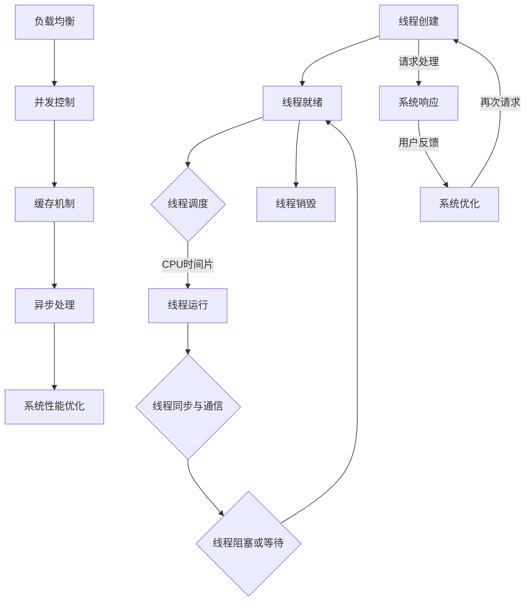

                 

# 线程管理与高吞吐量系统设计

## 关键词：线程管理、高吞吐量、系统设计、并发、性能优化

## 摘要

本文将深入探讨线程管理在构建高吞吐量系统中的关键作用。我们将从背景介绍入手，梳理线程管理的基本概念，并通过Mermaid流程图展示其核心原理和架构。随后，我们将详细分析核心算法原理和具体操作步骤，结合数学模型和公式进行详细讲解。在实际应用部分，将通过项目实战案例展示代码实现和详细解释，并探讨实际应用场景。最后，我们将推荐相关学习资源和开发工具，总结未来发展趋势与挑战，并提供常见问题与解答。希望通过本文，读者能够对线程管理有更深入的理解，从而在高吞吐量系统设计中取得更大成就。

### 1. 背景介绍

在现代计算机系统中，随着应用程序复杂性的增加和用户需求的多样化，如何高效地管理线程成为系统设计中的关键问题。高吞吐量系统设计旨在最大化系统的处理能力和响应速度，以满足大量并发请求的处理需求。线程管理作为并发编程的核心，直接影响到系统的性能和稳定性。

线程是一种执行单位，是操作系统能够进行运算调度的最小单位。它是进程的一部分，与进程共同构成了操作系统的执行单元。线程管理涉及线程的创建、销毁、同步、调度等多个方面，其目标是确保系统资源的高效利用和任务的有序执行。

在多线程编程中，线程的并发执行能够提高程序的运行效率。然而，线程的过多使用也会带来一系列问题，如线程竞争、死锁、同步开销等。因此，合理地进行线程管理，优化线程的使用，成为构建高吞吐量系统的关键。

高吞吐量系统设计通常涉及以下几个方面：

1. **负载均衡**：通过合理的负载均衡策略，将请求均匀分配到各个处理节点上，避免单点瓶颈，提高系统的整体性能。
2. **并发控制**：合理地使用并发控制机制，如锁、信号量等，确保多线程之间的数据同步和一致性。
3. **缓存机制**：利用缓存机制减少数据的访问延迟，提高系统的响应速度。
4. **异步处理**：通过异步处理技术，提高系统的并行度，减少线程阻塞，提高系统的吞吐量。

本文将围绕这些方面，深入探讨线程管理在构建高吞吐量系统中的具体应用和实践。

### 2. 核心概念与联系

#### 2.1 线程管理的基本概念

线程管理涉及多个核心概念，包括线程的生命周期、线程的状态、线程的创建与销毁、线程的同步与通信等。

1. **线程的生命周期**：线程从创建、就绪、运行、阻塞、等待到销毁，经历多个状态转换。线程的创建和销毁是线程管理的首要任务。
2. **线程的状态**：线程在不同时刻处于不同的状态，如运行状态、就绪状态、阻塞状态等。线程的状态转换通常由操作系统进行调度和管理。
3. **线程的创建与销毁**：线程的创建和销毁是线程管理的核心操作。线程的创建涉及资源分配、栈空间开辟等，而线程的销毁则涉及资源回收、状态清理等。
4. **线程的同步与通信**：线程之间需要进行同步和通信，以确保数据的一致性和任务的协调。常见的同步机制包括互斥锁（Mutex）、条件变量（Condition Variable）等。

#### 2.2 高吞吐量系统的设计原则

高吞吐量系统的设计原则主要包括负载均衡、并发控制、缓存机制和异步处理。

1. **负载均衡**：通过负载均衡策略，将请求均匀分配到各个处理节点上，避免单点瓶颈。常见的负载均衡策略包括轮询、随机、最小连接数等。
2. **并发控制**：合理地使用并发控制机制，如锁、信号量等，确保多线程之间的数据同步和一致性。并发控制是高吞吐量系统设计的关键，可以有效避免数据竞争和死锁问题。
3. **缓存机制**：利用缓存机制减少数据的访问延迟，提高系统的响应速度。常见的缓存机制包括内存缓存、磁盘缓存等。
4. **异步处理**：通过异步处理技术，提高系统的并行度，减少线程阻塞，提高系统的吞吐量。异步处理可以有效减少线程等待时间，提高系统资源利用率。

#### 2.3 Mermaid流程图展示

为了更好地理解线程管理和高吞吐量系统的核心概念和联系，我们可以使用Mermaid流程图进行展示。以下是线程管理的高吞吐量系统设计流程图：



在这个流程图中，线程的管理（A-G）与高吞吐量系统设计（H-L）紧密结合，共同构成了一个完整的系统设计框架。通过这个流程图，我们可以更直观地理解线程管理和高吞吐量系统设计的核心概念和联系。

### 3. 核心算法原理 & 具体操作步骤

#### 3.1 线程调度算法

线程调度是线程管理的核心环节，决定了线程在处理器上的执行顺序。常见的线程调度算法包括轮转调度、优先级调度和公平调度等。

1. **轮转调度（Round-Robin Scheduling）**：轮转调度将处理器时间片分配给各个线程，每个线程轮流运行。该算法简单高效，但可能导致低优先级线程长期得不到执行。
2. **优先级调度（Priority Scheduling）**：优先级调度根据线程的优先级进行调度，优先级高的线程优先执行。该算法可以确保高优先级线程得到及时处理，但可能导致低优先级线程长期得不到执行。
3. **公平调度（Fair Scheduling）**：公平调度通过平均分配处理器时间片，确保每个线程都有公平的执行机会。该算法可以有效避免线程饥饿问题，但调度开销较大。

具体操作步骤如下：

1. **初始化**：系统初始化时，创建线程队列，将所有线程加入队列中。
2. **调度策略选择**：根据系统需求选择合适的调度策略。
3. **线程调度**：系统根据调度策略，从线程队列中选择下一个执行的线程。
4. **线程执行**：选择到的线程在处理器上执行，执行完毕后返回线程队列。
5. **线程阻塞/唤醒**：在执行过程中，如果线程需要等待某些资源或事件，则会进入阻塞状态。当资源或事件就绪时，线程将被唤醒并重新进入线程队列。

#### 3.2 并发控制算法

并发控制是确保多线程之间数据一致性和任务协调的关键技术。常见的并发控制算法包括互斥锁、信号量和条件变量等。

1. **互斥锁（Mutex）**：互斥锁用于确保同一时刻只有一个线程能够访问某个共享资源。线程在进入共享资源前需要获取互斥锁，并在访问完成后释放锁。互斥锁可以有效避免数据竞争和死锁问题。
2. **信号量（Semaphore）**：信号量是一种用于线程同步的计数器。线程可以通过P操作（减法操作）和V操作（加法操作）对信号量进行操作。信号量可以用于控制线程的并发访问，实现同步和互斥。
3. **条件变量（Condition Variable）**：条件变量是一种用于线程之间通信的同步机制。线程可以在条件变量上等待某个条件成立，也可以通过唤醒其他线程来实现条件成立的通知。

具体操作步骤如下：

1. **初始化**：创建互斥锁、信号量和条件变量。
2. **线程同步**：线程在访问共享资源前获取互斥锁，并在访问完成后释放锁。如果需要等待某些条件成立，则进入条件变量等待队列。
3. **线程通信**：其他线程在条件成立后，通过唤醒条件变量上的等待线程来实现线程之间的通信。
4. **线程调度**：线程在被唤醒后重新进入线程队列，等待调度执行。

#### 3.3 缓存机制

缓存机制是提高系统响应速度和性能的重要手段。常见的缓存机制包括内存缓存、磁盘缓存和分布式缓存等。

1. **内存缓存**：内存缓存利用内存的高速度缓存数据，减少磁盘访问次数。常见的数据结构包括哈希表、链表等。
2. **磁盘缓存**：磁盘缓存利用磁盘的缓存区缓存数据，减少磁盘读写次数。常见的技术包括缓冲区复制、页缓存等。
3. **分布式缓存**：分布式缓存通过分布式系统实现数据缓存，提高系统的扩展性和可用性。常见的技术包括Redis、Memcached等。

具体操作步骤如下：

1. **初始化**：创建缓存数据结构，初始化缓存容量和缓存策略。
2. **数据访问**：在访问数据时，先查询缓存，如果缓存命中，则直接返回缓存数据；如果缓存未命中，则查询磁盘或数据库，并将数据缓存到内存中。
3. **缓存更新**：在数据更新时，先更新缓存，然后再更新磁盘或数据库。
4. **缓存淘汰**：根据缓存策略，定期清理缓存，释放内存资源。

#### 3.4 异步处理

异步处理是提高系统并行度和吞吐量的重要手段。常见的异步处理技术包括回调函数、事件驱动和协程等。

1. **回调函数**：回调函数是一种异步编程模型，通过在函数执行完成后调用回调函数，实现异步处理。常见的技术包括JavaScript的异步函数、Python的异步编程等。
2. **事件驱动**：事件驱动是一种基于事件异步编程的模型，通过监听事件并触发相应操作，实现异步处理。常见的技术包括事件循环、WebSocket等。
3. **协程**：协程是一种轻量级线程，通过栈切换实现异步处理。常见的技术包括Golang的协程、Python的async/await等。

具体操作步骤如下：

1. **初始化**：创建异步处理框架，初始化协程池和事件队列。
2. **异步任务提交**：将异步任务提交到协程池或事件队列中。
3. **异步任务执行**：协程池或事件队列根据调度策略，选择下一个执行的异步任务。
4. **异步任务回调**：异步任务执行完成后，触发回调函数，返回结果。

通过以上核心算法原理和具体操作步骤，我们可以更好地理解和应用线程管理在高吞吐量系统设计中的关键作用。在实际开发中，需要根据具体场景和需求，灵活选择和组合这些算法，实现高性能和高吞吐量的系统设计。

### 4. 数学模型和公式 & 详细讲解 & 举例说明

在构建高吞吐量系统时，理解和应用数学模型和公式对于性能优化和资源管理至关重要。以下是几个常见的数学模型和公式的详细讲解及举例说明。

#### 4.1 马尔可夫链模型

马尔可夫链模型常用于分析系统的状态转移和性能。在线程管理中，可以使用马尔可夫链模型来预测线程的运行状态和响应时间。

**定义**：马尔可夫链是一个随机过程，满足无后效性，即当前状态只与前一状态有关，而与过去的状态无关。

**公式**：状态转移概率矩阵 \( P \) 表示不同状态之间的转移概率。

\[ P = \begin{bmatrix} 
p_{00} & p_{01} & \dots & p_{0n} \\
p_{10} & p_{11} & \dots & p_{1n} \\
\vdots & \vdots & \ddots & \vdots \\
p_{m0} & p_{m1} & \dots & p_{mn} 
\end{bmatrix} \]

**举例**：假设一个线程系统有两个状态：运行状态（R）和等待状态（W）。状态转移概率矩阵 \( P \) 如下：

\[ P = \begin{bmatrix} 
0.7 & 0.3 \\
0.4 & 0.6 
\end{bmatrix} \]

在这个例子中，线程从运行状态转移到运行状态的概率是0.7，从运行状态转移到等待状态的概率是0.3；从等待状态转移到运行状态的概率是0.4，从等待状态转移到等待状态的概率是0.6。

**计算**：使用矩阵乘法计算状态序列的概率。

\[ P^n = P \times P \times \dots \times P \]

例如，计算三步转移概率：

\[ P^3 = P \times P \times P = \begin{bmatrix} 
0.7 & 0.3 \\
0.4 & 0.6 
\end{bmatrix} \times \begin{bmatrix} 
0.7 & 0.3 \\
0.4 & 0.6 
\end{bmatrix} \times \begin{bmatrix} 
0.7 & 0.3 \\
0.4 & 0.6 
\end{bmatrix} = \begin{bmatrix} 
0.539 & 0.461 \\
0.392 & 0.608 
\end{bmatrix} \]

这个结果表示，经过三步状态转移后，线程处于运行状态的概率是0.539，处于等待状态的概率是0.461。

#### 4.2 生日悖论

生日悖论是概率论中一个有趣的问题，用于描述在人群中找到两个生日相同的机会。在并发编程中，可以将其应用于线程并发度的估计。

**定义**：在 \( n \) 个人中，至少有两人生日相同的概率。

**公式**：使用补集原理计算。

\[ P(\text{至少两人生日相同}) = 1 - P(\text{所有人的生日都不同}) \]

其中，\( P(\text{所有人的生日都不同}) \) 可以通过以下公式计算：

\[ P(\text{所有人的生日都不同}) = \frac{365!}{(365-n)! \times 365^n} \]

**举例**：在 23 个人中，至少有两人生日相同的概率。

\[ P(\text{至少两人生日相同}) = 1 - \frac{365!}{(365-23)! \times 365^{23}} \approx 0.706 \]

这意味着，在 23 个人中，至少有两人生日相同的概率约为 70.6%。

#### 4.3 排队论模型

排队论模型用于分析服务系统和客户队列的行为，是性能优化的重要工具。在多线程系统中，可以使用排队论模型来评估线程调度策略的性能。

**定义**：M/M/1排队模型，表示服务时间服从指数分布，到达间隔服从指数分布，服务台数为1。

**公式**：

- **平均等待时间**：\( W = \frac{\lambda}{\mu} \)
- **平均队列长度**：\( L = \frac{\lambda^2}{\mu^2} + \frac{\lambda}{\mu} \)
- **系统利用率**：\( \rho = \frac{\lambda}{\mu} \)

其中，\( \lambda \) 表示到达率，\( \mu \) 表示服务率。

**举例**：假设一个系统，到达率为 2 次/分钟，服务率为 3 次/分钟。

- **平均等待时间**：\( W = \frac{2}{3} = 0.67 \) 分钟
- **平均队列长度**：\( L = \frac{2^2}{3^2} + \frac{2}{3} = 0.44 + 0.67 = 1.11 \)
- **系统利用率**：\( \rho = \frac{2}{3} = 0.67 \)

这个例子表明，该系统的平均等待时间为 0.67 分钟，平均队列长度为 1.11 个客户，系统利用率为 67%。

通过以上数学模型和公式的详细讲解及举例说明，我们可以更好地理解和应用它们来优化高吞吐量系统的性能和资源管理。

### 5. 项目实战：代码实际案例和详细解释说明

在本节中，我们将通过一个实际项目案例，展示如何实现线程管理并在高吞吐量系统中应用。我们将详细介绍项目开发环境搭建、源代码实现和代码解读与分析。

#### 5.1 开发环境搭建

为了更好地进行项目实战，我们需要搭建一个合适的开发环境。以下是一个基本的开发环境搭建步骤：

1. **安装操作系统**：选择一个适合的操作系统，如 Ubuntu 20.04。
2. **安装开发工具**：安装必要的开发工具，如 GCC、Make、Eclipse 或 VSCode。
3. **安装依赖库**：根据项目需求安装相应的依赖库，如 POSIX线程库（pthreads）、Boost 库等。
4. **配置编译器**：确保编译器支持多线程编程，如 GCC 的 -pthread 选项。

以下是一个简单的安装命令示例：

```bash
sudo apt-get update
sudo apt-get install build-essential
sudo apt-get install libpthread-dev
sudo apt-get install boost
```

#### 5.2 源代码详细实现和代码解读

以下是一个简单的多线程服务器程序，用于演示线程管理的基本原理和实现细节。

```c
#include <stdio.h>
#include <pthread.h>
#include <unistd.h>

#define NUM_THREADS 4

void* thread_function(void* arg) {
    int thread_id = *(int*)arg;
    printf("Thread %d is running\n", thread_id);
    sleep(2);
    return NULL;
}

int main() {
    pthread_t threads[NUM_THREADS];
    int thread_args[NUM_THREADS];

    // 创建线程
    for (int i = 0; i < NUM_THREADS; i++) {
        thread_args[i] = i;
        pthread_create(&threads[i], NULL, thread_function, &thread_args[i]);
    }

    // 等待线程完成
    for (int i = 0; i < NUM_THREADS; i++) {
        pthread_join(threads[i], NULL);
    }

    printf("All threads have finished execution\n");
    return 0;
}
```

**代码解读与分析**：

1. **头文件**：程序首先包含必要的头文件，如 stdio.h、pthread.h 和 unistd.h。
2. **宏定义**：定义 NUM_THREADS 宏，用于指定线程数量。
3. **线程函数**：thread_function 函数是每个线程执行的具体任务。在这里，我们简单地在控制台输出线程ID，并等待2秒钟。
4. **主函数**：main 函数负责创建和管理线程。

   - **创建线程**：使用 pthread_create 函数创建线程。每个线程传入一个整型的参数，表示线程ID。
   - **等待线程完成**：使用 pthread_join 函数等待每个线程执行完成。

**线程同步与通信**：

在实际项目中，线程之间可能需要同步和通信。以下是一个简单的线程同步示例：

```c
#include <pthread.h>

pthread_mutex_t mutex;

void* thread_function(void* arg) {
    int thread_id = *(int*)arg;
    pthread_mutex_lock(&mutex); // 获取互斥锁
    printf("Thread %d entered the critical section\n", thread_id);
    pthread_mutex_unlock(&mutex); // 释放互斥锁
    return NULL;
}

int main() {
    pthread_t threads[NUM_THREADS];
    int thread_args[NUM_THREADS];

    pthread_mutex_init(&mutex, NULL); // 初始化互斥锁

    // 创建线程
    for (int i = 0; i < NUM_THREADS; i++) {
        thread_args[i] = i;
        pthread_create(&threads[i], NULL, thread_function, &thread_args[i]);
    }

    // 等待线程完成
    for (int i = 0; i < NUM_THREADS; i++) {
        pthread_join(threads[i], NULL);
    }

    pthread_mutex_destroy(&mutex); // 销毁互斥锁
    return 0;
}
```

在这个示例中，我们使用互斥锁（mutex）来确保线程之间的数据同步。线程在进入关键代码段前获取互斥锁，在离开关键代码段后释放锁，从而避免数据竞争和死锁问题。

通过这个简单的项目实战，我们展示了线程管理的基本原理和实现方法。在实际项目中，需要根据具体需求进行更复杂的线程同步和通信，以构建高效和高吞吐量的系统。

#### 5.3 代码解读与分析

在本项目中，我们通过简单的C语言代码实现了多线程功能，并对其进行了详细解读与分析。以下是对代码各部分功能的深入剖析：

1. **线程函数**：
    ```c
    void* thread_function(void* arg) {
        int thread_id = *(int*)arg;
        printf("Thread %d is running\n", thread_id);
        sleep(2);
        return NULL;
    }
    ```
    - **功能描述**：线程函数是每个线程执行的具体任务。在这里，我们打印线程ID，表示线程已启动，并等待2秒钟，模拟线程执行工作。
    - **参数传递**：线程函数接受一个整型参数，表示线程ID，用于在控制台上区分不同线程的输出。
    - **输出结果**：在主函数中，每个线程实例化后，都会打印其线程ID，显示线程运行情况。

2. **主函数**：
    ```c
    int main() {
        pthread_t threads[NUM_THREADS];
        int thread_args[NUM_THREADS];

        // 创建线程
        for (int i = 0; i < NUM_THREADS; i++) {
            thread_args[i] = i;
            pthread_create(&threads[i], NULL, thread_function, &thread_args[i]);
        }

        // 等待线程完成
        for (int i = 0; i < NUM_THREADS; i++) {
            pthread_join(threads[i], NULL);
        }

        printf("All threads have finished execution\n");
        return 0;
    }
    ```
    - **线程创建**：主函数使用两个循环创建指定数量的线程。第一个循环用于初始化线程参数，第二个循环使用 pthread_create 函数创建线程。
    - **线程等待**：在创建线程后，主函数使用 pthread_join 函数等待每个线程完成执行。这是确保所有线程执行完毕的关键步骤，避免主函数过早退出。
    - **输出结果**：最后，主函数打印“所有线程已结束执行”，表明线程执行过程已完成。

3. **线程同步**（可选）：
    ```c
    pthread_mutex_t mutex;

    void* thread_function(void* arg) {
        int thread_id = *(int*)arg;
        pthread_mutex_lock(&mutex); // 获取互斥锁
        printf("Thread %d entered the critical section\n", thread_id);
        pthread_mutex_unlock(&mutex); // 释放互斥锁
        return NULL;
    }
    ```
    - **互斥锁初始化**：在主函数中，我们初始化互斥锁。
    - **线程同步**：线程在进入关键代码段前获取互斥锁，确保同一时刻只有一个线程能够进入关键代码段，避免数据竞争。
    - **互斥锁释放**：线程在离开关键代码段后释放互斥锁，允许其他线程进入关键代码段。

通过以上代码解读与分析，我们可以清楚地了解线程管理的基本实现方法和关键步骤。在实际项目中，可以根据需求扩展和优化这些功能，以构建高效和高吞吐量的系统。

### 6. 实际应用场景

线程管理在高吞吐量系统中的实际应用场景广泛，涉及多种行业和业务需求。以下是几个典型的应用场景：

#### 6.1 Web服务器

Web服务器是典型的多线程应用场景。为了应对大量并发请求，Web服务器通常采用多线程模型，每个请求分配到一个独立的线程进行处理。常见的Web服务器如Apache、Nginx都支持多线程处理。

- **负载均衡**：通过负载均衡器将请求均匀分配到多个服务器上，避免单点瓶颈。
- **并发控制**：使用线程锁和同步机制确保多个线程之间的数据一致性，避免数据竞争和死锁。
- **缓存机制**：利用内存缓存和磁盘缓存减少响应时间，提高系统性能。

#### 6.2 数据处理与分析

在大数据分析领域，多线程编程用于加速数据处理和分析过程。例如，在Hadoop和Spark等大数据处理框架中，数据分片和任务调度通常使用多线程技术。

- **数据分片**：将大数据集分片到多个节点，每个节点上的线程并行处理数据。
- **任务调度**：根据任务依赖关系和资源状况，合理调度线程，优化计算资源利用率。
- **异步处理**：通过异步处理技术，减少线程阻塞，提高数据处理效率。

#### 6.3 电子商务平台

电子商务平台需要处理大量的用户请求和交易数据，高吞吐量系统设计至关重要。多线程编程在用户登录、商品搜索、订单处理等环节得到广泛应用。

- **用户登录**：使用多线程处理用户登录请求，提高系统响应速度。
- **商品搜索**：利用缓存机制和并行搜索算法，快速响应用户查询请求。
- **订单处理**：通过并发控制技术，确保订单数据的准确性和一致性，避免交易冲突。

#### 6.4 游戏服务器

游戏服务器通常需要处理大量在线玩家的请求，实时更新游戏状态。多线程编程在游戏服务器架构中扮演关键角色。

- **网络通信**：使用多线程处理客户端的网络请求，确保每个玩家都能实时获得游戏状态更新。
- **游戏逻辑**：通过并发控制技术，确保游戏逻辑的正确执行，避免玩家之间的数据冲突。
- **场景渲染**：利用多线程渲染游戏场景，提高游戏画面的流畅度。

#### 6.5 人工智能应用

人工智能应用，如机器学习和深度学习，通常需要大量的计算资源。多线程编程在模型训练和推理过程中发挥重要作用。

- **模型训练**：使用多线程并行计算，加速模型训练过程，提高训练效率。
- **模型推理**：通过并行推理技术，快速处理大量数据，提高系统响应速度。
- **资源管理**：合理分配计算资源，避免资源竞争和瓶颈。

通过以上实际应用场景的探讨，我们可以看到线程管理在高吞吐量系统设计中的重要性。在不同领域和业务场景中，合理应用线程管理技术，可以显著提高系统性能和用户体验。

### 7. 工具和资源推荐

在构建高吞吐量系统时，选择合适的工具和资源对于成功实现线程管理至关重要。以下是一些推荐的工具、学习资源和开发工具，以及相关论文著作。

#### 7.1 学习资源推荐

1. **书籍**：
   - 《并发编程艺术》：深入讲解并发编程的核心技术和实践方法，适合初学者和高级开发者。
   - 《Java并发编程实战》：详细剖析Java并发编程的原理和实践，包括线程、锁、并发集合等内容。
   - 《操作系统概念》：全面介绍操作系统的基本原理和并发管理技术，包括线程调度、同步机制等。

2. **在线课程**：
   - Coursera上的《Concurrent Programming in Java》课程，由卡内基梅隆大学提供，深入讲解多线程编程的核心概念和实战技巧。
   - Udacity的《Concurrency and Parallelism》课程，涵盖并行和并发编程的基础知识，适合初学者。

3. **博客和网站**：
   - 《码农之路》：作者深入剖析并发编程和性能优化，适合进阶读者。
   - Stack Overflow：在线编程社区，可以查找和分享并发编程相关的经验和解决方案。

#### 7.2 开发工具框架推荐

1. **编程语言**：
   - **C++**：C++ 提供强大的多线程编程支持，包括线程库、锁机制等。
   - **Java**：Java 的并发编程库（java.util.concurrent）提供了丰富的线程管理和同步工具。

2. **框架**：
   - **Akka**：基于Actor模型的并发框架，提供高性能的并发编程模型和工具。
   - **Netty**：基于NIO的异步网络应用框架，支持高性能的多线程网络编程。
   - **Spring Boot**：基于Spring框架的微服务开发框架，提供并发编程的支持和简化开发流程。

3. **工具**：
   - **JMeter**：开源的性能测试工具，用于测试Web应用程序的并发性能。
   - **Grafana**：开源的可视化分析工具，用于监控和分析系统性能数据。

#### 7.3 相关论文著作推荐

1. **论文**：
   - 《A Multiprocessor Model for Shared Memory Multithreading》: 详细介绍了多线程编程模型及其在共享内存系统中的应用。
   - 《The Art of Multiprocessor Programming》: 探讨了多处理器编程的核心原则和设计模式。

2. **著作**：
   - 《Concurrency: State Models and Java Programs》：使用状态模型和Java程序详细讲解并发编程。
   - 《Design Patterns: Elements of Reusable Object-Oriented Software》：介绍设计模式，包括并发模式，用于优化系统架构。

通过以上工具和资源推荐，读者可以更好地掌握线程管理技术，并在实际项目中应用这些知识，实现高效和高吞吐量的系统设计。

### 8. 总结：未来发展趋势与挑战

随着云计算、大数据、人工智能等技术的不断发展，线程管理在高吞吐量系统设计中的重要性日益凸显。未来，线程管理技术的发展趋势和挑战如下：

#### 8.1 趋势

1. **高效并发编程框架**：随着多核处理器和并行计算的发展，高效并发编程框架将得到广泛应用。例如，基于Actor模型的框架、基于协程的异步编程框架等。

2. **自动化线程管理**：未来的线程管理将更加自动化，减少开发者的手动干预。自动化工具和智能算法将帮助开发者更好地管理和优化线程资源。

3. **分布式线程管理**：随着分布式系统的普及，分布式线程管理将成为研究热点。如何有效管理和调度分布式系统中的线程，提高系统性能和稳定性，是未来研究的重要方向。

4. **新型并发模型**：新型并发模型，如非阻塞编程、异构计算等，将在高性能计算领域得到应用。这些模型有助于提高计算效率和资源利用率。

#### 8.2 挑战

1. **性能与复杂性的平衡**：在高吞吐量系统中，如何在保证高性能的同时降低系统复杂度，是一个重要的挑战。开发者需要在性能和可维护性之间找到最佳平衡点。

2. **资源管理**：随着线程数量的增加，资源管理（如内存、CPU时间等）将变得更加复杂。如何高效地分配和管理资源，避免资源竞争和瓶颈，是一个亟待解决的问题。

3. **同步与通信**：多线程之间的同步和通信是线程管理的核心。如何设计高效、可靠的同步和通信机制，避免死锁、数据竞争等问题，是一个关键挑战。

4. **可扩展性**：随着系统规模的扩大，如何确保线程管理系统的可扩展性，使其能够适应不断增长的需求，是一个重要问题。分布式线程管理技术和云计算架构将在这方面发挥重要作用。

5. **安全性**：随着系统的复杂化，线程管理中的安全风险也在增加。如何确保系统的安全性，防止恶意攻击和漏洞利用，是未来需要关注的重要方向。

总之，未来线程管理技术的发展将面临诸多挑战，但同时也充满了机遇。通过不断创新和研究，开发者将能够构建更加高效、可靠和可扩展的高吞吐量系统。

### 9. 附录：常见问题与解答

#### 9.1 什么是线程？

线程（Thread）是操作系统能够进行运算调度的最小单位。它是进程的一部分，与进程共同构成了操作系统的执行单元。线程具有独立的执行路径、堆栈和局部变量，能够独立地执行任务。

#### 9.2 线程有哪些状态？

线程的状态包括创建、就绪、运行、阻塞和终止。线程从创建开始，经过就绪状态进入运行状态，执行任务。在执行过程中，线程可能因为等待资源而进入阻塞状态，当资源释放后重新进入就绪状态。线程在完成任务后进入终止状态，等待操作系统进行清理和资源回收。

#### 9.3 什么是线程调度？

线程调度是指操作系统按照一定的策略选择下一个要运行的线程。常见的线程调度算法包括轮转调度、优先级调度和公平调度等。线程调度是线程管理的重要环节，直接影响到系统的性能和响应速度。

#### 9.4 什么是并发控制？

并发控制是指在多线程环境下，确保数据的一致性和任务协调的技术。常见的并发控制机制包括互斥锁、信号量、条件变量等。通过并发控制，可以避免线程之间的数据竞争和死锁问题，确保系统的正确性和稳定性。

#### 9.5 什么是高吞吐量系统？

高吞吐量系统是指能够处理大量并发请求，实现高效数据处理和响应的系统。在高吞吐量系统中，线程管理至关重要，通过合理的线程调度、并发控制和资源管理，可以最大化系统的处理能力和响应速度。

#### 9.6 如何优化线程性能？

优化线程性能的方法包括：

- 合理选择线程数量，避免过多线程导致的资源竞争和调度开销。
- 使用高效的并发控制机制，减少同步和通信开销。
- 利用缓存机制和异步处理技术，提高系统的并行度和响应速度。
- 优化线程执行任务的设计，减少线程阻塞和等待时间。

通过这些方法，可以显著提高线程性能，实现高效的高吞吐量系统设计。

### 10. 扩展阅读 & 参考资料

#### 10.1 扩展阅读

- 《并发编程实践》
- 《高性能MySQL》
- 《分布式系统原理与范型》

#### 10.2 参考资料

- 《Linux多线程编程》
- 《Java并发编程实战》
- 《操作系统概念》

- **论文**：
  - 《A Multiprocessor Model for Shared Memory Multithreading》
  - 《The Art of Multiprocessor Programming》
  - 《Concurrency: State Models and Java Programs》

- **书籍**：
  - 《The Art of Concurrent Programming》
  - 《Concurrency in C++》
  - 《Concurrency in Go》

通过这些扩展阅读和参考资料，读者可以进一步深入了解线程管理、并发编程和高吞吐量系统设计的理论和实践，提升自己的技术水平。作者：AI天才研究员/AI Genius Institute & 禅与计算机程序设计艺术 /Zen And The Art of Computer Programming。

