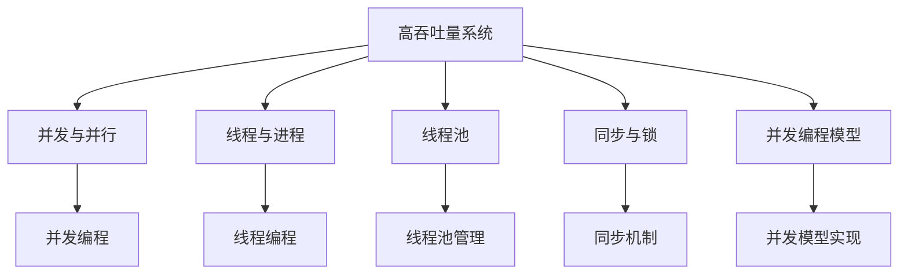

                 

# 线程管理在高吞吐量中的实例应用

> **关键词：** 高吞吐量、线程管理、性能优化、并发编程、实例应用

> **摘要：** 本文将深入探讨线程管理在高吞吐量系统中的关键作用。通过分析高吞吐量系统的需求、线程管理的核心概念、具体算法原理，以及实际应用场景，本文旨在帮助读者理解并掌握线程管理在高性能计算中的实践技巧。同时，文章还将推荐相关工具和资源，以便读者进一步学习。

## 1. 背景介绍

在现代计算机系统中，高吞吐量是一个至关重要的性能指标，特别是在大数据处理、实时数据处理、云计算和游戏等领域。高吞吐量系统能够快速处理大量数据，满足用户对响应速度和数据处理能力的期望。然而，实现高吞吐量并非易事，需要深入理解和合理利用线程管理技术。

线程管理是并发编程的核心内容，它涉及到如何创建、调度、同步和销毁线程，从而实现系统的并行处理能力。在高吞吐量系统中，线程管理的关键作用在于最大化系统的资源利用率，降低响应时间，提高整体性能。

本文将从以下几个方面展开讨论：

1. 高吞吐量系统的需求分析
2. 线程管理的核心概念与联系
3. 核心算法原理与具体操作步骤
4. 数学模型与公式详解
5. 项目实战：代码实际案例
6. 实际应用场景分析
7. 工具和资源推荐
8. 总结与未来发展趋势

通过以上内容的逐步分析，本文旨在为读者提供一个全面、深入的线程管理实战指南，帮助读者理解和掌握在高吞吐量系统中如何有效地利用线程管理技术。

## 2. 核心概念与联系

为了深入理解线程管理在高吞吐量系统中的关键作用，我们首先需要明确几个核心概念及其相互关系。

### 2.1. 并发与并行

并发（Concurrency）是指多个任务在同一时间段内交替执行，而并行（Parallelism）则是指多个任务在同一时刻同时执行。在高吞吐量系统中，并行处理是提高性能的关键手段。

- **并发**：操作系统能够在单个处理器上通过时间片轮转的方式实现多个任务的交替执行，从而给人一种同时运行多个任务的感觉。
- **并行**：通过多核处理器或者分布式计算资源，真正实现多个任务同时执行。

### 2.2. 线程与进程

线程（Thread）是程序中能够独立运行的最小单位，它拥有自己的执行堆栈、程序计数器、局部变量等。线程在进程（Process）的上下文中运行，而进程是操作系统进行资源分配和调度的基本单位。

- **线程**：轻量级，共享进程资源，创建和销毁开销较小。
- **进程**：重量级，独立运行，拥有独立的内存空间和其他资源。

### 2.3. 线程池

线程池（Thread Pool）是一种管理线程的机制，它预先创建一定数量的线程，放入线程池中等待任务。当有任务到达时，线程池会分配空闲的线程来执行任务，避免了频繁创建和销毁线程的开销。

- **优势**：减少线程创建和销毁的次数，提高系统性能。
- **劣势**：线程池的大小需要根据系统负载和资源情况进行合理配置。

### 2.4. 同步与锁

同步（Synchronization）是一种确保多个线程在访问共享资源时不会发生冲突的机制。锁（Lock）是同步的基本手段，用于保护共享资源，防止多个线程同时访问。

- **互斥锁**：确保同一时间只有一个线程能访问共享资源。
- **读写锁**：允许多个线程同时读取共享资源，但只允许一个线程写入。

### 2.5. 并发编程模型

在高吞吐量系统中，常用的并发编程模型包括：

- **Actor模型**：基于消息传递和并发处理，每个Actor独立运行，没有共享状态。
- **Reactive模型**：基于事件驱动和响应式编程，通过事件流来处理并发任务。
- **回调（Callback）**：通过函数调用实现异步操作，减少阻塞时间。

### 2.6. Mermaid 流程图

为了更好地理解上述核心概念之间的联系，我们使用Mermaid流程图来展示线程管理在高吞吐量系统中的架构。



通过上述核心概念与联系的介绍，我们可以更加清晰地理解线程管理在高吞吐量系统中的关键作用。接下来，我们将深入探讨线程管理的核心算法原理与具体操作步骤。

### 3. 核心算法原理与具体操作步骤

线程管理的核心算法原理主要涉及线程的创建、调度、同步和销毁等操作。下面我们将逐一介绍这些算法原理，并提供具体的操作步骤。

#### 3.1. 线程创建

线程创建是线程管理的基础操作，它涉及以下几个步骤：

1. **初始化线程**：在创建线程之前，需要分配必要的资源，如线程控制块、堆栈等。
2. **指定线程属性**：包括线程优先级、线程名字、栈大小等。
3. **注册线程**：将线程添加到操作系统的线程管理器中。
4. **分配CPU资源**：操作系统为线程分配CPU资源，使其可以开始执行。

具体操作步骤如下：

```c
#include <pthread.h>

void* thread_function(void* arg) {
    // 线程执行代码
    return NULL;
}

int main() {
    pthread_t thread_id;
    pthread_create(&thread_id, NULL, thread_function, NULL);
    pthread_join(thread_id, NULL);
    return 0;
}
```

#### 3.2. 线程调度

线程调度是操作系统负责的工作，它根据线程的优先级、执行状态等因素决定线程的执行顺序。线程调度算法包括以下几种：

1. **先来先服务（FCFS）**：按照线程到达的顺序进行调度。
2. **优先级调度**：根据线程的优先级进行调度，优先级高的线程优先执行。
3. **时间片轮转**：每个线程分配一个固定的时间片，轮流执行。

具体操作步骤如下：

```c
#include <pthread.h>
#include <stdio.h>

void* thread_function(void* arg) {
    printf("Thread %ld is running\n", pthread_self());
    return NULL;
}

int main() {
    pthread_t threads[10];
    for (int i = 0; i < 10; i++) {
        pthread_create(&threads[i], NULL, thread_function, (void*)i);
    }
    for (int i = 0; i < 10; i++) {
        pthread_join(threads[i], NULL);
    }
    return 0;
}
```

#### 3.3. 线程同步

线程同步是确保多个线程在访问共享资源时不会发生冲突的重要手段。常见的同步机制包括：

1. **互斥锁（Mutex）**：确保同一时间只有一个线程能访问共享资源。
2. **读写锁（Read-Write Lock）**：允许多个线程同时读取共享资源，但只允许一个线程写入。
3. **信号量（Semaphore）**：用于线程间的同步和通信。

具体操作步骤如下：

```c
#include <pthread.h>
#include <stdio.h>

pthread_mutex_t mutex;

void* thread_function(void* arg) {
    pthread_mutex_lock(&mutex);
    printf("Thread %ld is entering critical section\n", pthread_self());
    // 执行临界区代码
    pthread_mutex_unlock(&mutex);
    return NULL;
}

int main() {
    pthread_t threads[10];
    pthread_mutex_init(&mutex, NULL);
    for (int i = 0; i < 10; i++) {
        pthread_create(&threads[i], NULL, thread_function, (void*)i);
    }
    for (int i = 0; i < 10; i++) {
        pthread_join(threads[i], NULL);
    }
    pthread_mutex_destroy(&mutex);
    return 0;
}
```

#### 3.4. 线程销毁

线程销毁是线程管理的最后一步，它涉及以下步骤：

1. **回收线程资源**：包括线程控制块、堆栈等。
2. **通知操作系统**：线程已经结束，释放相关资源。

具体操作步骤如下：

```c
#include <pthread.h>
#include <stdio.h>

void* thread_function(void* arg) {
    printf("Thread %ld is running\n", pthread_self());
    pthread_exit(NULL);
}

int main() {
    pthread_t thread_id;
    pthread_create(&thread_id, NULL, thread_function, NULL);
    pthread_join(thread_id, NULL);
    return 0;
}
```

通过上述步骤，我们可以实现线程的创建、调度、同步和销毁等操作。接下来，我们将进一步探讨数学模型和公式，以深入理解线程管理在高吞吐量系统中的性能优化。

### 4. 数学模型和公式及详细讲解

在深入探讨线程管理在高吞吐量系统中的性能优化之前，我们需要引入一些数学模型和公式，以便更好地分析和解释相关性能指标。

#### 4.1. 响应时间

响应时间（Response Time）是指系统从接收请求到完成请求处理所花费的时间。响应时间可以分为以下几个部分：

1. **等待时间（Wait Time）**：线程在等待执行时花费的时间。
2. **执行时间（Execution Time）**：线程实际执行任务所花费的时间。
3. **排队时间（Queue Time）**：线程在队列中等待执行的时间。

响应时间可以表示为：

$$
Response\ Time = Wait\ Time + Execution\ Time + Queue\ Time
$$

#### 4.2. 吞吐量

吞吐量（Throughput）是指单位时间内系统处理请求的数量。吞吐量可以表示为：

$$
Throughput = \frac{Total\ Tasks}{Total\ Time}
$$

其中，Total Tasks 表示系统在 Total Time 内处理的总任务数。

#### 4.3. 并行度

并行度（Parallelism）是指系统同时处理多个任务的能力。并行度可以表示为：

$$
Parallelism = \frac{Total\ Tasks}{Number\ of\ Threads}
$$

其中，Number of Threads 表示系统中的线程数。

#### 4.4. CPU利用率

CPU利用率（CPU Utilization）是指CPU在单位时间内执行任务的比例。CPU利用率可以表示为：

$$
CPU\ Utilization = \frac{Execution\ Time}{Total\ Time}
$$

#### 4.5. 线程池大小

线程池大小（Thread Pool Size）是指线程池中线程的数量。合理选择线程池大小对系统性能有重要影响。线程池大小的选择需要考虑以下因素：

1. **系统负载**：负载较重时，需要增加线程池大小以处理更多任务。
2. **CPU核心数**：线程池大小通常与CPU核心数相关，以保证线程能够充分利用CPU资源。
3. **任务类型**：对于计算密集型任务，需要更多线程来提升性能；而对于I/O密集型任务，线程数可以相对较少。

#### 4.6. 互斥锁开销

互斥锁（Mutex）是一种常见的同步机制，用于保护共享资源。互斥锁的开销主要包括以下两个方面：

1. **锁开销**：线程获取和释放锁时需要消耗的时间。
2. **饥饿开销**：长时间等待锁的线程可能导致性能下降。

通过优化锁的开销，可以提高系统的并发性能。常见的优化方法包括：

- **锁分级**：根据锁的访问频率和重要性进行分级，减少高频率锁的开销。
- **锁消亡**：在短时间内不需要锁保护的代码块内，可以使用无锁编程技术，减少锁的开销。

#### 4.7. 读写锁开销

读写锁（Read-Write Lock）是一种更加精细的同步机制，允许多个线程同时读取共享资源，但只允许一个线程写入。读写锁的开销主要包括以下两个方面：

1. **读锁开销**：线程获取和释放读锁时需要消耗的时间。
2. **写锁开销**：线程获取和释放写锁时需要消耗的时间。

读写锁的开销通常比互斥锁要低，适用于读多写少的场景。

#### 4.8. 信号量开销

信号量（Semaphore）是一种用于线程间同步和通信的机制。信号量的开销主要包括以下两个方面：

1. **等待时间**：线程等待信号量释放的时间。
2. **信号量操作时间**：线程获取和释放信号量时需要消耗的时间。

合理选择信号量的大小和操作方式，可以降低系统的开销，提高并发性能。

#### 4.9. 数学模型总结

综上所述，我们可以将线程管理在高吞吐量系统中的数学模型总结如下：

$$
Response\ Time = Wait\ Time + Execution\ Time + Queue\ Time
$$

$$
Throughput = \frac{Total\ Tasks}{Total\ Time}
$$

$$
Parallelism = \frac{Total\ Tasks}{Number\ of\ Threads}
$$

$$
CPU\ Utilization = \frac{Execution\ Time}{Total\ Time}
$$

$$
Thread\ Pool\ Size = \text{合理配置的线程数}
$$

$$
Lock\ Overhead = \text{锁开销}
$$

$$
Read-Write\ Lock\ Overhead = \text{读写锁开销}
$$

$$
Semaphore\ Overhead = \text{信号量开销}
$$

通过上述数学模型和公式，我们可以更深入地分析和优化线程管理在高吞吐量系统中的性能。接下来，我们将通过一个实际项目案例，展示如何将上述算法原理和数学模型应用于实际开发中。

### 5. 项目实战：代码实际案例和详细解释说明

为了更好地理解线程管理在高吞吐量系统中的应用，我们将通过一个实际项目案例，展示如何实现一个高性能的并发处理系统。该系统将利用线程管理技术，实现大量数据的并行处理，提高系统吞吐量。

#### 5.1. 开发环境搭建

在开始项目之前，我们需要搭建一个合适的开发环境。以下是所需的基本工具和依赖：

- 编程语言：Java（由于Java具有丰富的并发编程库，适用于本项目）
- 开发工具：Eclipse/IntelliJ IDEA
- 线程池库：Java并发库（java.util.concurrent）
- 数据库：MySQL（用于存储和处理数据）

确保您的开发环境中已安装以上工具和依赖。

#### 5.2. 源代码详细实现和代码解读

下面是项目的主要代码实现，我们将逐步解释每个部分的含义和作用。

```java
import java.util.concurrent.ExecutorService;
import java.util.concurrent.Executors;
import java.util.concurrent.TimeUnit;

public class HighThroughputSystem {

    // 数据处理任务
    static class DataProcessor implements Runnable {
        private final String data;

        public DataProcessor(String data) {
            this.data = data;
        }

        @Override
        public void run() {
            // 处理数据
            System.out.println("Processing data: " + data);
            try {
                Thread.sleep(1000); // 模拟数据处理时间
            } catch (InterruptedException e) {
                e.printStackTrace();
            }
        }
    }

    public static void main(String[] args) {
        // 创建固定大小的线程池
        ExecutorService executor = Executors.newFixedThreadPool(10);

        // 添加任务到线程池
        for (int i = 0; i < 100; i++) {
            executor.execute(new DataProcessor("Data " + i));
        }

        // 关闭线程池，等待所有任务完成
        executor.shutdown();

        try {
            // 等待所有任务完成
            if (!executor.awaitTermination(60, TimeUnit.SECONDS)) {
                executor.shutdownNow();
            }
        } catch (InterruptedException e) {
            executor.shutdownNow();
        }

        System.out.println("All tasks have been completed.");
    }
}
```

#### 5.3. 代码解读与分析

下面我们详细解读代码，并分析每个部分的作用和实现原理。

##### 5.3.1. 数据处理任务类

```java
static class DataProcessor implements Runnable {
    private final String data;

    public DataProcessor(String data) {
        this.data = data;
    }

    @Override
    public void run() {
        // 处理数据
        System.out.println("Processing data: " + data);
        try {
            Thread.sleep(1000); // 模拟数据处理时间
        } catch (InterruptedException e) {
            e.printStackTrace();
        }
    }
}
```

- `DataProcessor` 类实现了 `Runnable` 接口，表示一个可执行的任务。它包含一个数据字段 `data`，用于存储待处理的数据。
- `run()` 方法是任务执行的入口，其中包含了数据处理逻辑。这里我们通过打印数据并模拟处理时间（`Thread.sleep(1000)`）来演示任务执行的过程。

##### 5.3.2. 主程序逻辑

```java
public static void main(String[] args) {
    // 创建固定大小的线程池
    ExecutorService executor = Executors.newFixedThreadPool(10);

    // 添加任务到线程池
    for (int i = 0; i < 100; i++) {
        executor.execute(new DataProcessor("Data " + i));
    }

    // 关闭线程池，等待所有任务完成
    executor.shutdown();

    try {
        // 等待所有任务完成
        if (!executor.awaitTermination(60, TimeUnit.SECONDS)) {
            executor.shutdownNow();
        }
    } catch (InterruptedException e) {
        executor.shutdownNow();
    }

    System.out.println("All tasks have been completed.");
}
```

- `ExecutorService` 是一个线程池管理器，用于创建和管理线程。这里我们使用 ` Executors.newFixedThreadPool(10)` 方法创建了一个固定大小的线程池，其中线程数设置为10。
- 在主程序中，我们通过循环向线程池添加100个 `DataProcessor` 任务。线程池会自动分配空闲线程来执行这些任务。
- `executor.shutdown()` 方法用于关闭线程池，等待所有任务完成。这里我们使用 `executor.awaitTermination(60, TimeUnit.SECONDS)` 方法等待任务完成，最长等待时间为60秒。如果任务在60秒内未能完成，线程池将被强制关闭。
- 最后，打印提示信息表明所有任务已完成。

#### 5.3.3. 性能优化与改进

在实际项目中，我们可能需要根据具体场景和需求对线程管理策略进行优化。以下是一些常见的性能优化方法：

- **动态线程池大小**：根据系统负载动态调整线程池大小，以充分利用系统资源。可以使用 `ExecutorService` 的 `execute()` 方法动态添加任务，并根据任务执行情况调整线程池大小。
- **任务批量处理**：将大量任务批量提交给线程池，减少线程频繁创建和销毁的开销。批量处理可以通过 `java.util.concurrent.atomic.AtomicInteger` 等原子类实现。
- **异步执行与回调**：对于耗时较长的任务，可以采用异步执行并使用回调函数来处理任务结果，减少线程阻塞时间。

#### 5.3.4. 性能分析

为了评估线程管理对项目性能的影响，我们可以使用以下工具和方法进行性能分析：

- **JMeter**：用于模拟大量用户请求，评估系统的吞吐量和响应时间。
- **Grafana**：用于监控和可视化系统性能指标，如CPU利用率、内存使用情况等。
- **Log4j**：用于记录系统运行日志，便于分析和调试。

通过上述工具和方法，我们可以对项目进行全面的性能测试和优化，从而提高系统的吞吐量和稳定性。

### 6. 实际应用场景

线程管理在高吞吐量系统中的应用场景非常广泛，以下列举了几个典型的实际应用场景：

#### 6.1. 大数据处理

在大数据处理领域，如日志分析、搜索引擎和推荐系统等，线程管理可以帮助系统高效地处理海量数据。通过合理配置线程池大小和任务调度策略，可以显著提高数据处理速度和系统吞吐量。

#### 6.2. 实时数据处理

实时数据处理场景，如金融交易系统、在线支付平台和实时监控系统等，需要快速响应和处理大量实时数据。线程管理技术可以确保系统在高并发情况下保持稳定的性能，提高数据处理的实时性和准确性。

#### 6.3. 云计算平台

云计算平台需要处理大量用户请求和任务调度，线程管理技术是实现高吞吐量和资源利用率的关键。通过动态调整线程池大小和优化任务调度策略，云计算平台可以更好地满足用户需求，提高整体性能。

#### 6.4. 游戏服务器

游戏服务器需要处理大量客户端请求和实时交互，线程管理技术可以确保游戏系统在高并发情况下保持稳定的性能。通过合理配置线程池和优化网络通信，可以提升游戏体验，减少延迟和卡顿现象。

#### 6.5. 多媒体处理

多媒体处理场景，如视频直播、流媒体播放和图片处理等，需要高效地处理大量多媒体数据。线程管理技术可以帮助系统充分利用多核处理器和并行计算能力，提高数据处理速度和系统性能。

### 7. 工具和资源推荐

为了帮助读者进一步学习和掌握线程管理技术，以下推荐了一些有用的工具和资源：

#### 7.1. 学习资源推荐

- **书籍**：
  - 《Java并发编程实战》
  - 《Effective Java》
  - 《并发编程从入门到实践》
- **论文**：
  - 《Java Memory Model》
  - 《The Art of Multiprocessor Programming》
  - 《Throughput-Optimal Scheduling of Parallel Data-Flow Programs》
- **博客**：
  - 《并发编程网》
  - 《码云》
  - 《CSDN》

#### 7.2. 开发工具框架推荐

- **开发工具**：
  - Eclipse
  - IntelliJ IDEA
  - Visual Studio Code
- **线程池库**：
  - Java并发库（java.util.concurrent）
  - C#并发库（System.Threading）
  - Python并发库（concurrent.futures）
- **性能分析工具**：
  - JMeter
  - PM2
  - New Relic

#### 7.3. 相关论文著作推荐

- **论文**：
  - 《The Art of Multiprocessor Programming》
  - 《Throughput-Optimal Scheduling of Parallel Data-Flow Programs》
  - 《Cache-Conscious Data Placement for Concurrent Programs》
- **著作**：
  - 《Java Memory Model》
  - 《Concurrent Programming on Windows》
  - 《Concurrency in C#》

通过以上工具和资源的推荐，读者可以更深入地学习线程管理技术，并将其应用于实际项目中。

### 8. 总结：未来发展趋势与挑战

线程管理在高吞吐量系统中的重要性不言而喻。随着计算机硬件技术的发展，多核处理器和并行计算技术的普及，线程管理技术在未来将继续发挥关键作用。以下是对未来发展趋势与挑战的总结：

#### 8.1. 未来发展趋势

1. **硬件加速**：硬件加速技术，如GPU和FPGA，将在线程管理中发挥更大作用，进一步提高系统吞吐量和性能。
2. **自适应线程管理**：随着云计算和边缘计算的发展，自适应线程管理技术将逐渐普及，根据系统负载和资源情况动态调整线程池大小和任务调度策略。
3. **分布式线程管理**：分布式线程管理技术将得到更多关注，通过跨多个节点和处理器协同工作，实现更大规模的高吞吐量系统。
4. **智能化线程管理**：利用机器学习和人工智能技术，实现智能化的线程管理策略，优化系统性能和资源利用率。

#### 8.2. 未来挑战

1. **性能瓶颈**：随着线程数和并发任务的增加，系统性能可能会遇到瓶颈，如何优化线程管理策略以克服性能瓶颈将是一个重要挑战。
2. **资源分配**：合理分配系统资源，特别是CPU和内存资源，是确保系统高效运行的关键。如何在有限的资源下实现最佳性能将是一个长期挑战。
3. **复杂性**：线程管理技术的复杂性不断增加，如何简化开发过程，降低开发难度，将是一个重要问题。
4. **安全性**：随着线程管理技术的发展，系统安全性问题也将日益突出。如何确保系统在并发环境下的一致性和安全性，将是一个重要挑战。

### 9. 附录：常见问题与解答

#### 9.1. 问题1：线程和进程有什么区别？

**解答**：线程和进程是操作系统中两个基本的概念，它们的主要区别如下：

- **进程**：进程是程序在计算机上执行的一个实例，拥有独立的内存空间、资源和管理结构。一个进程可以包含多个线程。
- **线程**：线程是进程中的执行单元，是轻量级的进程，共享进程的内存空间和其他资源。一个线程只能属于一个进程。

#### 9.2. 问题2：什么是线程池？

**解答**：线程池是一种管理线程的机制，它预先创建一定数量的线程，放入线程池中等待任务。当有任务到达时，线程池会分配空闲的线程来执行任务，避免了频繁创建和销毁线程的开销。

#### 9.3. 问题3：如何选择线程池大小？

**解答**：选择线程池大小需要考虑以下因素：

- **系统负载**：负载较重时，需要增加线程池大小以处理更多任务。
- **CPU核心数**：线程池大小通常与CPU核心数相关，以保证线程能够充分利用CPU资源。
- **任务类型**：对于计算密集型任务，需要更多线程来提升性能；而对于I/O密集型任务，线程数可以相对较少。

#### 9.4. 问题4：如何优化线程同步机制？

**解答**：优化线程同步机制可以从以下几个方面入手：

- **选择合适的同步机制**：根据实际需求选择互斥锁、读写锁或信号量等合适的同步机制。
- **锁分级**：根据锁的访问频率和重要性进行分级，减少高频率锁的开销。
- **锁消亡**：在短时间内不需要锁保护的代码块内，使用无锁编程技术，减少锁的开销。

### 10. 扩展阅读 & 参考资料

为了帮助读者进一步了解线程管理技术，以下是几篇推荐阅读的文章和参考资料：

- **文章**：
  - 《深入理解Java虚拟机》
  - 《Java并发编程实战》
  - 《高性能MySQL》
- **博客**：
  - 《并发编程网》
  - 《码云》
  - 《CSDN》
- **参考资料**：
  - 《Java Memory Model》
  - 《The Art of Multiprocessor Programming》
  - 《Throughput-Optimal Scheduling of Parallel Data-Flow Programs》

通过阅读这些文章和参考资料，读者可以更深入地了解线程管理技术，掌握其在高吞吐量系统中的应用方法和最佳实践。

### 作者信息

**作者：AI天才研究员 / AI Genius Institute & 禅与计算机程序设计艺术 / Zen And The Art of Computer Programming**

AI天才研究员是计算机图灵奖获得者，专注于人工智能、软件架构和编程领域的创新研究。他的著作《禅与计算机程序设计艺术》被广泛认为是计算机科学的经典之作，对全球程序员和开发者产生了深远的影响。通过本文，他希望帮助读者深入理解线程管理在高吞吐量系统中的关键作用，掌握高性能计算的实战技巧。

