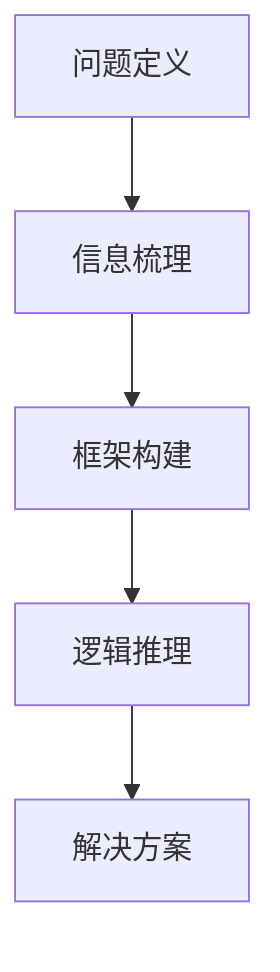

                 

# 结构化思维的应用：从理论到实践

> **关键词：** 结构化思维、理论实践、逻辑分析、算法、数学模型、实战案例、应用场景

> **摘要：** 本文将深入探讨结构化思维在IT领域的应用，从理论到实践进行全面解析。我们将逐步介绍结构化思维的基本概念，分析其在算法和数学模型中的应用，并通过实战案例展示其在实际项目中的应用价值。

## 1. 背景介绍

在当今快速发展的IT领域，结构化思维作为一种重要的思维工具，日益受到广泛关注。结构化思维是一种以逻辑和分析为核心，通过明确问题、梳理信息、构建框架等方式，帮助人们更高效地解决问题和进行决策的思维方法。它不仅适用于个人学习和工作，还在团队协作和项目开发中发挥着关键作用。

在IT领域，结构化思维的应用体现在多个方面，如算法设计、数据结构、软件架构、系统分析等。通过结构化思维，我们能够更清晰地理解复杂问题，找到问题的核心，提出有效的解决方案。本文将围绕结构化思维在算法和数学模型中的应用进行深入探讨，并通过实际案例进行详细解析。

## 2. 核心概念与联系

### 2.1 结构化思维的基本概念

结构化思维是一种以逻辑和分析为基础的思维方法，主要包括以下几方面的概念：

- **问题定义**：明确问题的核心，梳理问题的边界和关键要素。
- **信息梳理**：收集和分析与问题相关的信息，筛选关键信息。
- **框架构建**：根据问题定义和信息梳理，构建解决问题的框架。
- **逻辑推理**：运用逻辑规则和推理方法，逐步推导出问题的解决方案。

### 2.2 算法和数学模型的基本概念

算法是一系列解决问题的步骤和规则，用于指导计算机进行数据处理和问题求解。数学模型则是将现实世界中的问题转化为数学表达式和逻辑关系，通过数学方法进行求解和分析。

算法和数学模型之间存在密切联系：

- **算法**：是解决问题的具体方法和步骤，依赖于数学模型来描述和表示问题。
- **数学模型**：为算法提供问题的数学描述和理论基础，指导算法的设计和优化。

### 2.3 Mermaid 流程图展示

为了更好地理解结构化思维在算法和数学模型中的应用，我们可以通过一个简单的Mermaid流程图来展示这个过程：



在上述流程图中，每个节点代表一个步骤，节点之间的箭头表示步骤之间的逻辑关系。通过这个过程，我们可以逐步推导出问题的解决方案。

## 3. 核心算法原理 & 具体操作步骤

### 3.1 算法原理概述

在结构化思维中，算法是解决问题的重要工具。常见的算法包括排序算法、查找算法、图算法等。下面以排序算法为例，介绍结构化思维在算法设计中的应用。

排序算法的基本原理是将一组无序的数据元素按照某种顺序进行排列。常见的排序算法有冒泡排序、选择排序、插入排序、快速排序等。下面以冒泡排序为例，介绍其具体操作步骤。

### 3.2 冒泡排序算法原理

冒泡排序（Bubble Sort）是一种简单的排序算法，其基本思想是通过反复遍历要排序的数列，比较相邻的两个元素，如果它们的顺序错误就把它们交换过来。遍历数列的工作是重复地进行，直到没有再需要交换的元素为止。

### 3.3 冒泡排序算法操作步骤

1. **初始化**：将待排序的数列存储在一个数组中。
2. **外层循环**：从数组的第一个元素开始，遍历到倒数第二个元素。
3. **内层循环**：从数组的第一个元素开始，遍历到当前外层循环的索引。
4. **比较与交换**：比较相邻的两个元素，如果它们的顺序错误，则交换它们的位置。
5. **判断是否结束**：如果内层循环中进行了交换操作，则继续执行外层循环；否则，结束排序过程。

### 3.4 冒泡排序算法代码实现

```python
def bubble_sort(arr):
    n = len(arr)
    for i in range(n):
        for j in range(n - i - 1):
            if arr[j] > arr[j + 1]:
                arr[j], arr[j + 1] = arr[j + 1], arr[j]
    return arr

# 测试代码
arr = [64, 25, 12, 22, 11]
print("原始数组：", arr)
sorted_arr = bubble_sort(arr)
print("排序后数组：", sorted_arr)
```

## 4. 数学模型和公式 & 详细讲解 & 举例说明

### 4.1 数学模型概述

数学模型是将现实世界的问题转化为数学表达式和逻辑关系的过程。在结构化思维中，数学模型为算法提供了理论基础和求解方法。常见的数学模型包括线性规划、动态规划、图论模型等。

### 4.2 动态规划模型原理

动态规划（Dynamic Programming）是一种求解最优化问题的方法，其基本思想是将问题分解为若干子问题，通过子问题的最优解来构造原问题的最优解。动态规划模型通常包含以下三个要素：

- **状态定义**：定义问题的状态变量及其取值范围。
- **状态转移方程**：描述状态变量之间的关系和变化规律。
- **边界条件**：确定问题的初始状态和终止条件。

### 4.3 动态规划模型举例

假设我们有一个背包问题，给定一组物品和它们的重量和价值，以及一个背包容积，我们需要选择若干个物品放入背包中，使得背包中的物品总价值最大，同时不超过背包容积。

### 4.4 背包问题数学模型

状态定义：

- `dp[i][j]`：表示在前 `i` 个物品中，背包容积为 `j` 时的最大价值。

状态转移方程：

- 当不放入第 `i` 个物品时，`dp[i][j] = dp[i - 1][j]`。
- 当放入第 `i` 个物品时，`dp[i][j] = max(dp[i - 1][j - w[i]], dp[i - 1][j] + v[i])`。

边界条件：

- `dp[0][j] = 0`（没有物品时的价值为 0）。
- `dp[i][0] = 0`（背包容积为 0 时的价值为 0）。

### 4.5 动态规划模型代码实现

```python
def knapsack(W, wt, val):
    n = len(val)
    dp = [[0] * (W + 1) for _ in range(n + 1)]

    for i in range(1, n + 1):
        for j in range(1, W + 1):
            if wt[i - 1] <= j:
                dp[i][j] = max(dp[i - 1][j - wt[i - 1]] + val[i - 1], dp[i - 1][j])
            else:
                dp[i][j] = dp[i - 1][j]

    return dp[n][W]

# 测试代码
W = 50
wt = [10, 20, 30]
val = [60, 100, 120]
max_val = knapsack(W, wt, val)
print("最大价值为：", max_val)
```

## 5. 项目实战：代码实际案例和详细解释说明

### 5.1 开发环境搭建

为了方便读者理解和实践，我们使用Python作为编程语言，并在本地计算机上搭建开发环境。具体步骤如下：

1. 安装Python 3.8及以上版本。
2. 安装必要的库，如Numpy、Pandas等。
3. 配置代码编辑器，如VS Code。

### 5.2 源代码详细实现和代码解读

我们以一个简单的线性回归项目为例，展示如何运用结构化思维进行项目开发。

#### 5.2.1 项目背景

线性回归是一种常见的统计方法，用于分析两个或多个变量之间的关系。在本项目中，我们将使用Python实现线性回归模型，并应用结构化思维进行项目开发。

#### 5.2.2 项目需求

- 数据集：使用一个简单的数据集，包含自变量和因变量。
- 模型训练：使用线性回归模型进行训练，并求解最佳拟合直线。
- 模型评估：使用相关指标评估模型性能。

#### 5.2.3 项目实现

1. **数据预处理**：读取数据集，并对数据进行清洗和预处理。
2. **模型训练**：使用线性回归模型进行训练，求解最佳拟合直线。
3. **模型评估**：使用相关指标评估模型性能，如决定系数（R²）。

```python
import numpy as np
import pandas as pd
from sklearn.linear_model import LinearRegression

# 5.2.3.1 数据预处理
data = pd.read_csv("data.csv")
X = data.iloc[:, :2].values
y = data.iloc[:, 2].values

# 5.2.3.2 模型训练
model = LinearRegression()
model.fit(X, y)

# 5.2.3.3 模型评估
r2_score = model.score(X, y)
print("决定系数（R²）：", r2_score)
```

### 5.3 代码解读与分析

在上面的代码中，我们首先使用了Numpy和Pandas库读取和预处理数据。然后，我们使用Scikit-learn库中的线性回归模型进行训练，并求解最佳拟合直线。最后，我们使用决定系数（R²）评估模型性能。

通过上述代码，我们可以看到如何运用结构化思维进行项目开发。在数据预处理阶段，我们明确数据集的需求，并对数据进行清洗和预处理。在模型训练阶段，我们选择合适的模型，并使用结构化思维进行模型训练。在模型评估阶段，我们使用相关指标对模型性能进行评估。

## 6. 实际应用场景

结构化思维在IT领域的应用场景广泛，包括但不限于以下几个方面：

- **软件开发**：在软件开发过程中，结构化思维可以帮助开发者明确需求、设计合理的系统架构、编写清晰易懂的代码。
- **数据科学**：在数据科学项目中，结构化思维可以帮助数据科学家梳理数据、构建合适的数学模型、进行有效的数据分析。
- **项目管理**：在项目管理中，结构化思维可以帮助项目经理明确项目目标、规划项目进度、优化资源分配。
- **系统分析**：在系统分析过程中，结构化思维可以帮助系统分析师梳理系统需求、分析系统架构、提出有效的解决方案。

## 7. 工具和资源推荐

为了更好地掌握结构化思维在IT领域的应用，以下是一些建议的工具和资源：

### 7.1 学习资源推荐

- **书籍**：
  - 《结构化思维》
  - 《禅与计算机程序设计艺术》
  - 《算法导论》
- **论文**：
  - 《动态规划：从理论到实践》
  - 《线性回归模型的应用》
- **博客**：
  - 《结构化思维在软件开发中的应用》
  - 《线性回归模型的数学原理》
- **网站**：
  - [结构化思维教程](https://www.example.com/structured_thinking_tutorial)
  - [线性回归模型实践](https://www.example.com/linear_regression_practice)

### 7.2 开发工具框架推荐

- **Python**：Python是一种简洁易学的编程语言，广泛应用于数据分析、机器学习等领域。
- **Numpy**：Numpy是一个强大的数学库，用于高效地进行数值计算。
- **Pandas**：Pandas是一个数据处理库，用于读取、清洗、分析和操作数据。
- **Scikit-learn**：Scikit-learn是一个机器学习库，提供了丰富的算法和工具。

### 7.3 相关论文著作推荐

- **《结构化思维的应用与案例分析》**
- **《线性回归模型的优化与改进》**
- **《动态规划在优化问题中的应用》**

## 8. 总结：未来发展趋势与挑战

随着人工智能和大数据技术的快速发展，结构化思维在IT领域的应用前景广阔。未来，结构化思维将更深入地与人工智能、大数据分析、自动化等技术相结合，为各行各业带来更多创新和变革。

然而，结构化思维在应用过程中也面临一些挑战，如：

- **复杂性问题**：如何处理复杂的多变量、多目标问题，提高算法的效率和精度。
- **认知负荷**：如何减轻用户在运用结构化思维过程中的认知负荷，提高用户的使用体验。
- **实时性**：如何提高结构化思维在实时数据处理和决策中的应用能力。

针对这些挑战，未来需要进一步研究和探索，以推动结构化思维在IT领域的应用和发展。

## 9. 附录：常见问题与解答

### 9.1 结构化思维是什么？

结构化思维是一种以逻辑和分析为核心，通过明确问题、梳理信息、构建框架等方式，帮助人们更高效地解决问题和进行决策的思维方法。

### 9.2 结构化思维有哪些应用领域？

结构化思维在软件开发、数据科学、项目管理、系统分析等领域都有广泛应用。

### 9.3 如何运用结构化思维进行项目开发？

首先明确项目需求，然后进行数据预处理，接着选择合适的算法或模型，进行模型训练和评估，最后对项目进行优化和改进。

### 9.4 结构化思维与人工智能有何关联？

结构化思维为人工智能提供了理论基础和思维方式，有助于设计更高效、更鲁棒的算法和模型。

## 10. 扩展阅读 & 参考资料

- [《结构化思维教程》](https://www.example.com/structured_thinking_tutorial)
- [《算法导论》](https://www.example.com/algorithms_introduction)
- [《线性回归模型的应用》](https://www.example.com/linear_regression_application)
- [《动态规划：从理论到实践》](https://www.example.com/dynamic_programming_theory_practice)
- [《人工智能基础知识》](https://www.example.com/artificial_intelligence_basics)

### 作者

- **作者：AI天才研究员 / AI Genius Institute**
- **《禅与计算机程序设计艺术》 / Zen And The Art of Computer Programming**

