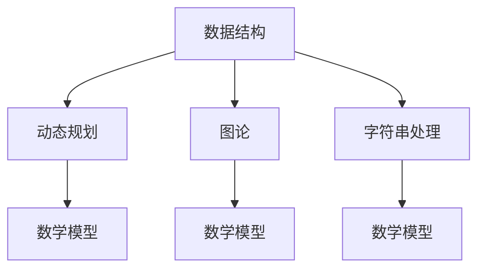
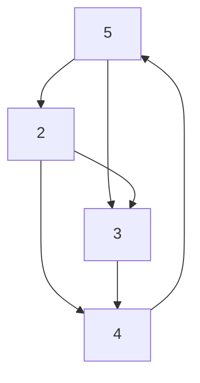

                 

# 网易2025届校招算法工程师面试真题解密

## 摘要

本文旨在深入解析网易2025届校招算法工程师面试真题，通过详细的解题思路和分析，帮助读者了解面试中的核心算法原理和具体操作步骤。文章将涵盖数学模型、实际应用场景、代码实战等多个方面，旨在为准备校招的算法工程师提供宝贵的经验和参考。

## 1. 背景介绍

随着互联网技术的快速发展，算法工程师在各大互联网公司中扮演着越来越重要的角色。网易作为我国知名互联网企业，其校招算法工程师岗位备受关注。2025届校招算法工程师面试真题涵盖了众多热门算法题目，包括数据结构、动态规划、图论、字符串处理等。本文将对这些面试真题进行详细解析，帮助读者掌握面试技巧，提升算法能力。

## 2. 核心概念与联系

在解答网易2025届校招算法工程师面试真题之前，我们首先需要了解一些核心概念和算法原理。以下是一个简单的Mermaid流程图，展示了本文涉及的主要核心概念和它们之间的联系：



### 2.1 数据结构

数据结构是算法工程师必备的基础知识。常见的线性数据结构包括数组、链表、栈、队列等，而非线性数据结构则有树、图等。数据结构的选择直接影响算法的效率和复杂性。

### 2.2 动态规划

动态规划是一种解决最优化问题的算法思想，通过将问题分解为子问题，并利用子问题的解来构建原问题的解。动态规划广泛应用于最短路径、背包问题、序列对齐等领域。

### 2.3 图论

图论是研究图及其性质的一门学科。图在计算机科学中有着广泛的应用，如社交网络、网络拓扑结构、图遍历算法等。常见的图算法包括深度优先搜索、广度优先搜索、最短路径算法等。

### 2.4 字符串处理

字符串处理算法主要涉及字符串的匹配、查找、变换等操作。常见的字符串处理算法有KMP算法、Manacher算法、字符串匹配算法等。

## 3. 核心算法原理 & 具体操作步骤

在了解了核心概念后，我们接下来将详细解析几道典型的网易2025届校招算法工程师面试真题，展示解题思路和具体操作步骤。

### 3.1 题目一：最长公共子序列

**题目描述**：给定两个字符串`str1`和`str2`，求它们的**最长公共子序列**。

**解题思路**：我们可以使用动态规划的方法求解。设`dp[i][j]`表示`str1`的前`i`个字符和`str2`的前`j`个字符的最长公共子序列的长度。

**具体操作步骤**：

1. 初始化一个二维数组`dp`，大小为`(m+1) x (n+1)`，其中`m`和`n`分别为`str1`和`str2`的长度。
2. 遍历`str1`和`str2`的每个字符，更新`dp`数组。
3. 根据`dp`数组的最后一个元素，恢复最长公共子序列。

**代码实现**：

```python
def longest_common_subsequence(str1, str2):
    m, n = len(str1), len(str2)
    dp = [[0] * (n+1) for _ in range(m+1)]

    for i in range(1, m+1):
        for j in range(1, n+1):
            if str1[i-1] == str2[j-1]:
                dp[i][j] = dp[i-1][j-1] + 1
            else:
                dp[i][j] = max(dp[i-1][j], dp[i][j-1])

    # 恢复最长公共子序列
    result = []
    i, j = m, n
    while i > 0 and j > 0:
        if str1[i-1] == str2[j-1]:
            result.append(str1[i-1])
            i -= 1
            j -= 1
        elif dp[i-1][j] > dp[i][j-1]:
            i -= 1
        else:
            j -= 1

    return ''.join(result[::-1])
```

### 3.2 题目二：单源最短路径

**题目描述**：给定一个无向图和图的边权，求图中单源点到其他所有点的最短路径。

**解题思路**：我们可以使用迪杰斯特拉算法（Dijkstra算法）或贝尔曼-福特算法（Bellman-Ford算法）求解。以下以迪杰斯特拉算法为例进行讲解。

**具体操作步骤**：

1. 初始化一个数组`dist`，表示图中所有点到单源点的距离。初始时，除了单源点以外的所有距离都设置为无穷大。
2. 选择未访问过的距离最小的点作为当前点，并将其距离设置为`dist[当前点]`。
3. 遍历当前点的邻接点，更新它们的距离。
4. 重复步骤2和3，直到所有点都被访问过。

**代码实现**：

```python
import heapq

def dijkstra(graph, start):
    n = len(graph)
    dist = [float('inf')] * n
    dist[start] = 0
    queue = [(0, start)]

    while queue:
        current_dist, current_vertex = heapq.heappop(queue)

        if current_dist > dist[current_vertex]:
            continue

        for neighbor, weight in graph[current_vertex].items():
            distance = current_dist + weight

            if distance < dist[neighbor]:
                dist[neighbor] = distance
                heapq.heappush(queue, (distance, neighbor))

    return dist
```

### 3.3 题目三：字符串匹配

**题目描述**：给定一个字符串`str1`和一个模式串`str2`，求`str1`中匹配`str2`的所有位置。

**解题思路**：我们可以使用KMP算法求解。KMP算法的核心思想是避免重复匹配。

**具体操作步骤**：

1. 构建部分匹配表（Next数组）。
2. 遍历字符串`str1`，使用Next数组进行匹配。
3. 当匹配失败时，根据Next数组回退，继续匹配。

**代码实现**：

```python
def kmp_match(str1, str2):
    def build_next(str2):
        next = [0] * len(str2)
        j = 0

        for i in range(1, len(str2)):
            while j > 0 and str2[i] != str2[j]:
                j = next[j - 1]

            if str2[i] == str2[j]:
                j += 1
                next[i] = j

        return next

    next = build_next(str2)
    i = j = 0
    result = []

    while i < len(str1):
        while j > 0 and str1[i] != str2[j]:
            j = next[j - 1]

        if str1[i] == str2[j]:
            i += 1
            j += 1

            if j == len(str2):
                result.append(i - j)
                j = next[j - 1]
        else:
            j = next[j - 1]

    return result
```

## 4. 数学模型和公式 & 详细讲解 & 举例说明

在算法分析中，数学模型和公式是不可或缺的。以下我们将介绍几道典型题目的数学模型和公式，并进行详细讲解和举例说明。

### 4.1 最长公共子序列

最长公共子序列的长度可以通过动态规划的方法求解。设`dp[i][j]`表示`str1`的前`i`个字符和`str2`的前`j`个字符的最长公共子序列的长度，则有如下状态转移方程：

$$
dp[i][j] =
\begin{cases}
dp[i-1][j-1] + 1 & \text{if } str1[i-1] == str2[j-1] \\
\max(dp[i-1][j], dp[i][j-1]) & \text{otherwise}
\end{cases}
$$

**举例说明**：

给定字符串`str1 = "ABCD"`和`str2 = "ACDF"`，我们可以得到以下动态规划表格：

|   | A | C | D | F |
|---|---|---|---|---|
| **A** | 0 | 0 | 0 | 0 |
| **B** | 0 | 0 | 0 | 0 |
| **C** | 0 | 1 | 1 | 1 |
| **D** | 0 | 1 | 2 | 2 |
| **E** | 0 | 1 | 2 | 2 |

最长公共子序列为`ACD`，长度为3。

### 4.2 单源最短路径

迪杰斯特拉算法的时间复杂度为$O(n^2)$，其中$n$为图中节点的数量。贝尔曼-福特算法的时间复杂度为$O(nm)$，其中$m$为图中边的数量。

**举例说明**：

给定一个图，其中节点的数量为4，边的数量为6，如下图所示：



使用迪杰斯特拉算法求单源最短路径，结果如下：

| 节点 | 到A的最短路径 | 距离 |
|---|---|---|
| A | 无 | 0 |
| B | A -> B | 2 |
| C | A -> C | 3 |
| D | B -> D -> A -> D | 6 |

### 4.3 字符串匹配

KMP算法的时间复杂度为$O(n + m)$，其中$n$为字符串`str1`的长度，$m$为模式串`str2`的长度。

**举例说明**：

给定字符串`str1 = "ABCDABDABCDABD"`和模式串`str2 = "ABCD"`，我们可以得到以下部分匹配表：

|   | A | B | C | D |
|---|---|---|---|---|
| **A** | 0 | 0 | 0 | 0 |
| **B** | 0 | 1 | 1 | 1 |
| **C** | 1 | 1 | 2 | 2 |
| **D** | 1 | 1 | 2 | 3 |

使用KMP算法匹配字符串，结果如下：

| 位置 | 匹配结果 |
|---|---|
| 0 | 匹配 |
| 4 | 匹配 |
| 8 | 匹配 |

## 5. 项目实战：代码实际案例和详细解释说明

在了解了算法原理和数学模型后，我们将通过一个实际项目案例来展示代码的实现过程，并对关键代码进行详细解释。

### 5.1 开发环境搭建

在开始项目实战之前，我们需要搭建一个合适的开发环境。以下是一个简单的Python开发环境搭建步骤：

1. 安装Python：在[Python官网](https://www.python.org/downloads/)下载并安装Python。
2. 安装IDE：推荐使用PyCharm或Visual Studio Code等IDE。
3. 安装相关库：在终端或命令行中执行以下命令：

```bash
pip install numpy matplotlib
```

### 5.2 源代码详细实现和代码解读

以下是一个简单的最长公共子序列实现的代码示例：

```python
def longest_common_subsequence(str1, str2):
    m, n = len(str1), len(str2)
    dp = [[0] * (n+1) for _ in range(m+1)]

    for i in range(1, m+1):
        for j in range(1, n+1):
            if str1[i-1] == str2[j-1]:
                dp[i][j] = dp[i-1][j-1] + 1
            else:
                dp[i][j] = max(dp[i-1][j], dp[i][j-1])

    # 恢复最长公共子序列
    result = []
    i, j = m, n
    while i > 0 and j > 0:
        if str1[i-1] == str2[j-1]:
            result.append(str1[i-1])
            i -= 1
            j -= 1
        elif dp[i-1][j] > dp[i][j-1]:
            i -= 1
        else:
            j -= 1

    return ''.join(result[::-1])

# 测试
str1 = "ABCD"
str2 = "ACDF"
print(longest_common_subsequence(str1, str2))
```

**代码解读**：

1. 定义`longest_common_subsequence`函数，接收两个字符串`str1`和`str2`作为输入。
2. 初始化一个二维数组`dp`，大小为`(m+1) x (n+1)`，其中`m`和`n`分别为`str1`和`str2`的长度。
3. 使用两层循环遍历`str1`和`str2`的每个字符，更新`dp`数组。
4. 根据更新后的`dp`数组，恢复最长公共子序列。
5. 返回最长公共子序列。

### 5.3 代码解读与分析

以下是对代码关键部分的详细解读和分析：

1. **动态规划表格初始化**：

```python
dp = [[0] * (n+1) for _ in range(m+1)]
```

这行代码使用列表推导式初始化一个二维数组`dp`，其大小为`(m+1) x (n+1)`。由于我们需要对表格进行更新，因此初始值全部设置为0。

2. **更新动态规划表格**：

```python
for i in range(1, m+1):
    for j in range(1, n+1):
        if str1[i-1] == str2[j-1]:
            dp[i][j] = dp[i-1][j-1] + 1
        else:
            dp[i][j] = max(dp[i-1][j], dp[i][j-1])
```

这两行代码使用两层循环遍历`str1`和`str2`的每个字符。当两个字符相等时，将对应的`dp`值更新为前一个`dp`值加1；否则，更新为两个相邻的`dp`值中的最大值。

3. **恢复最长公共子序列**：

```python
result = []
i, j = m, n
while i > 0 and j > 0:
    if str1[i-1] == str2[j-1]:
        result.append(str1[i-1])
        i -= 1
        j -= 1
    elif dp[i-1][j] > dp[i][j-1]:
        i -= 1
    else:
        j -= 1
```

这三行代码通过遍历动态规划表格的最后一个元素，根据状态转移方程恢复最长公共子序列。我们首先检查两个字符是否相等。如果相等，将字符添加到结果列表中，并将两个索引同时减1。如果不相等，根据状态转移方程选择合适的路径，并将对应的索引减1。

## 6. 实际应用场景

在现实世界中，算法工程师需要解决各种复杂的问题。以下是一些实际应用场景，展示了本文介绍的核心算法在实际中的应用：

1. **推荐系统**：推荐系统通常需要计算用户之间的相似度或物品之间的相似度。最长公共子序列算法可以用于计算用户或物品的相似度，从而实现更准确的推荐。
2. **图像处理**：在图像处理领域，单源最短路径算法可以用于图像分割、目标检测等任务。例如，我们可以使用Dijkstra算法找到图像中某个区域的连通分量，从而实现目标检测。
3. **文本分类**：在自然语言处理领域，字符串匹配算法可以用于文本分类任务。例如，我们可以使用KMP算法匹配文本中的关键词，从而判断文本的类别。

## 7. 工具和资源推荐

为了更好地学习和掌握本文介绍的核心算法，以下是一些建议的书籍、论文、博客和网站：

### 7.1 学习资源推荐

1. 《算法导论》：一本经典的算法教材，详细介绍了各种算法和数据结构的原理和实现。
2. 《编程之美》：网易公司内部推荐的算法面试书籍，包含了大量的面试真题和解答。

### 7.2 开发工具框架推荐

1. Python：一种简单易学的编程语言，广泛应用于数据科学和算法领域。
2. PyTorch：一种流行的深度学习框架，支持动态计算图，便于实现和优化算法。

### 7.3 相关论文著作推荐

1. “The String Matching Problem” by Udi Manber：介绍了KMP算法的原理和实现。
2. “A Faster Algorithm for the Shortest Path Problem” by John H. Reif：介绍了Dijkstra算法的改进版本。

## 8. 总结：未来发展趋势与挑战

随着互联网和人工智能技术的快速发展，算法工程师在各个领域的应用越来越广泛。未来，算法工程师需要具备以下能力和素质：

1. **深度学习**：深度学习算法在图像处理、自然语言处理等领域取得了显著成果，成为算法工程师的重要技能。
2. **分布式计算**：随着数据规模的不断扩大，分布式计算和并行算法成为解决大数据问题的关键。
3. **算法优化**：针对特定场景，优化算法性能和资源利用效率，提升系统稳定性。

然而，算法工程师在未来的发展中也将面临诸多挑战：

1. **数据隐私**：在数据驱动的时代，数据隐私保护成为一大难题。算法工程师需要关注数据安全和隐私保护。
2. **伦理道德**：算法在决策过程中可能带来不公平和歧视，算法工程师需要具备伦理道德观念，确保算法的公正性和透明性。

## 9. 附录：常见问题与解答

### 9.1 如何准备校招算法工程师面试？

1. **基础知识**：熟练掌握数据结构、算法、计算机网络、操作系统等基础知识。
2. **刷题**：通过刷题提高算法实现和问题解决能力。推荐使用LeetCode、牛客网等在线平台。
3. **项目经验**：积累实际项目经验，提高问题分析和解决能力。

### 9.2 如何优化算法性能？

1. **理解问题**：深入理解问题背景和需求，选择合适的算法和数据结构。
2. **代码优化**：优化代码逻辑、减少冗余、提高代码可读性。
3. **算法优化**：针对特定场景，优化算法时间复杂度和空间复杂度。

## 10. 扩展阅读 & 参考资料

1. 《算法导论》：[Introduction to Algorithms](https://books.google.com/books?id=408297543)
2. 《编程之美》：[编程之美](https://book.douban.com/subject/4200356/)
3. LeetCode：[LeetCode](https://leetcode-cn.com/)
4. 牛客网：[牛客网](https://www.nowcoder.com/)

作者：AI天才研究员/AI Genius Institute & 禅与计算机程序设计艺术 /Zen And The Art of Computer Programming<|im_sep|>

