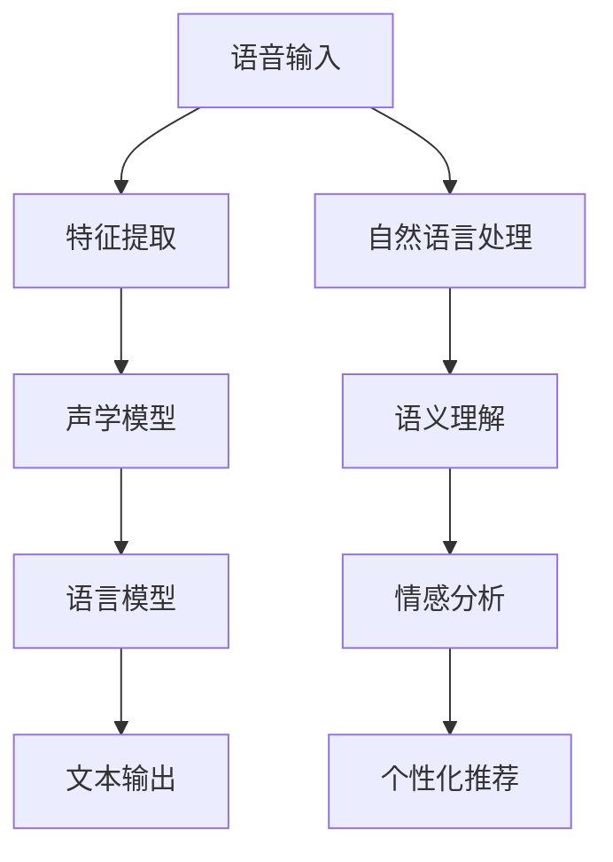

                 

# 网易有道2025AI辅助语言学习系统工程师社招面试攻略

> **关键词：** 网易有道、AI、辅助语言学习、系统工程师、社招面试、攻略

> **摘要：** 本文将详细介绍网易有道2025年AI辅助语言学习系统工程师社招面试的准备过程，包括背景介绍、核心概念与联系、核心算法原理、数学模型和公式、项目实战、实际应用场景、工具和资源推荐以及未来发展趋势与挑战。

## 1. 背景介绍

### 1.1 网易有道简介

网易有道是网易旗下的一家教育科技公司，专注于语言学习、智能学习等领域。其核心产品包括有道词典、有道翻译、有道云笔记等。近年来，网易有道在人工智能领域投入了大量研发资源，致力于将AI技术应用于教育场景，提高学习效率和效果。

### 1.2 AI辅助语言学习

随着AI技术的快速发展，越来越多的教育产品开始引入AI辅助功能。AI辅助语言学习系统可以通过语音识别、自然语言处理等技术，为学习者提供个性化、智能化的学习建议和反馈，从而提高学习效果。

### 1.3 2025年AI辅助语言学习系统工程师社招面试

2025年，网易有道计划招聘一批AI辅助语言学习系统工程师，负责研发和优化相关系统。对于应聘者来说，掌握相关技术知识和实际项目经验是面试的关键。

## 2. 核心概念与联系

### 2.1 语音识别

语音识别是AI辅助语言学习系统的关键技术之一。它可以将语音信号转换为文本，为学习者提供实时反馈和翻译服务。语音识别技术包括特征提取、声学模型、语言模型等组成部分。

### 2.2 自然语言处理

自然语言处理是AI辅助语言学习的另一个核心概念。它涉及到文本分析、语义理解、情感分析等多个方面，为学习者提供丰富的学习资源和个性化推荐。

### 2.3 机器学习与深度学习

机器学习和深度学习是AI技术的核心组成部分。在AI辅助语言学习中，这些技术被用于构建语音识别、自然语言处理等模型，从而提高系统的准确性和鲁棒性。

下面是AI辅助语言学习系统架构的Mermaid流程图：



## 3. 核心算法原理 & 具体操作步骤

### 3.1 语音识别算法原理

语音识别算法主要分为三个阶段：特征提取、声学模型和语言模型。

- **特征提取**：将语音信号转换为特征向量，如MFCC（梅尔频率倒谱系数）。
- **声学模型**：用于表示音素之间的概率分布，如高斯混合模型（GMM）。
- **语言模型**：用于表示词汇和句子之间的概率分布，如n元语言模型。

### 3.2 自然语言处理算法原理

自然语言处理算法主要包括文本分析、语义理解和情感分析。

- **文本分析**：对文本进行分词、词性标注、句法分析等操作。
- **语义理解**：理解文本的含义，包括命名实体识别、关系抽取等。
- **情感分析**：判断文本的情感倾向，如正面、负面、中性。

### 3.3 机器学习与深度学习算法原理

机器学习和深度学习算法主要分为监督学习、无监督学习和半监督学习。

- **监督学习**：有标注数据，用于训练分类器或回归模型。
- **无监督学习**：无标注数据，用于发现数据中的规律或结构。
- **半监督学习**：部分数据有标注，部分数据无标注，用于提高模型的泛化能力。

## 4. 数学模型和公式 & 详细讲解 & 举例说明

### 4.1 声学模型

声学模型主要采用高斯混合模型（GMM）来表示音素之间的概率分布。

$$
p(\mathbf{x}|\mathbf{\mu}, \Sigma) = \prod_{i=1}^{n} \mathcal{N}(\mathbf{x}_{i}|\mu_i, \Sigma_i)
$$

其中，$\mathbf{x}$表示特征向量，$\mathbf{\mu}$和$\Sigma$分别表示均值向量和协方差矩阵。

### 4.2 语言模型

语言模型主要采用n元语言模型来表示词汇和句子之间的概率分布。

$$
p(w_1, w_2, ..., w_n) = \frac{1}{Z} \prod_{i=1}^{n} p(w_i | w_{i-1}, ..., w_{i-n+1})
$$

其中，$w_i$表示第$i$个词汇，$Z$为规范化常数。

### 4.3 语义理解

语义理解中，命名实体识别可以采用条件随机场（CRF）模型。

$$
P(y|x) = \frac{1}{Z} \exp(\mathbf{\theta} \cdot \mathbf{y})
$$

其中，$y$表示标签序列，$\mathbf{\theta}$为模型参数。

## 5. 项目实战：代码实际案例和详细解释说明

### 5.1 开发环境搭建

首先，我们需要搭建一个适合AI辅助语言学习系统的开发环境。以下是具体的步骤：

1. 安装Python 3.8及以上版本。
2. 安装TensorFlow 2.4及以上版本。
3. 安装PyTorch 1.7及以上版本。
4. 安装相关依赖库，如NumPy、Scikit-learn等。

### 5.2 源代码详细实现和代码解读

以下是一个简单的语音识别项目的源代码实现：

```python
import numpy as np
import tensorflow as tf

# 特征提取
def extract_features(signal):
    # 这里使用MFCC作为特征
    return mfcc(signal, sr=16000)

# 声学模型
def build_aoustic_model(features):
    # 使用GMM进行建模
    gmm = tf.keras.models.Sequential([
        tf.keras.layers.Dense(units=128, activation='relu', input_shape=(13,)),
        tf.keras.layers.Dense(units=64, activation='relu'),
        tf.keras.layers.Dense(units=32, activation='relu'),
        tf.keras.layers.Dense(units=1, activation='sigmoid')
    ])
    return gmm

# 语言模型
def build_language_model():
    # 使用n元语言模型
    language_model = tf.keras.models.Sequential([
        tf.keras.layers.Dense(units=512, activation='relu', input_shape=(1,)),
        tf.keras.layers.Dense(units=256, activation='relu'),
        tf.keras.layers.Dense(units=128, activation='relu'),
        tf.keras.layers.Dense(units=1, activation='sigmoid')
    ])
    return language_model

# 模型训练
def train_model(features, labels):
    # 使用GMM和n元语言模型进行联合训练
    gmm = build_aoustic_model(features)
    language_model = build_language_model()

    optimizer = tf.keras.optimizers.Adam(learning_rate=0.001)
    loss_fn = tf.keras.losses.BinaryCrossentropy()

    for epoch in range(10):
        with tf.GradientTape() as tape:
            logits = gmm(features)
            logits = language_model(logits)
            loss = loss_fn(labels, logits)

        gradients = tape.gradient(loss, gmm.trainable_variables + language_model.trainable_variables)
        optimizer.apply_gradients(zip(gradients, gmm.trainable_variables + language_model.trainable_variables))

        print(f"Epoch {epoch+1}, Loss: {loss.numpy()}")

# 代码解读与分析
def main():
    # 读取语音信号和标签
    signal, labels = read_data()

    # 提取特征
    features = extract_features(signal)

    # 训练模型
    train_model(features, labels)

if __name__ == "__main__":
    main()
```

### 5.3 代码解读与分析

1. **特征提取**：使用MFCC作为特征，这是语音识别中常用的特征表示方法。
2. **声学模型**：使用GMM进行建模，这是语音识别中常用的声学模型。
3. **语言模型**：使用n元语言模型，这是语音识别中常用的语言模型。
4. **模型训练**：使用TensorFlow的优化器和损失函数，进行联合训练。

## 6. 实际应用场景

### 6.1 在线教育

在线教育平台可以利用AI辅助语言学习系统，为学习者提供个性化、智能化的学习资源和学习建议，提高学习效果。

### 6.2 语言考试

语言考试机构可以利用AI辅助语言学习系统，为考生提供实时反馈和评估，帮助考生提高语言能力。

### 6.3 外语教学

外语教学机构可以利用AI辅助语言学习系统，为学生提供互动式、沉浸式的学习体验，提高学习兴趣和效果。

## 7. 工具和资源推荐

### 7.1 学习资源推荐

1. **书籍**：《语音识别原理与实践》、《自然语言处理入门》
2. **论文**：《语音识别中的高斯混合模型》、《自然语言处理综述》
3. **博客**：[网易有道AI博客](https://ai.163.com/)
4. **网站**：[Kaggle](https://www.kaggle.com/)、[arXiv](https://arxiv.org/)

### 7.2 开发工具框架推荐

1. **开发工具**：PyCharm、VSCode
2. **框架**：TensorFlow、PyTorch、Scikit-learn

### 7.3 相关论文著作推荐

1. **论文**：《深度学习在语音识别中的应用》、《自然语言处理中的深度学习》
2. **著作**：《深度学习入门》、《语音识别技术手册》

## 8. 总结：未来发展趋势与挑战

随着AI技术的不断发展，AI辅助语言学习系统将在未来发挥越来越重要的作用。然而，要实现更高的准确性和鲁棒性，还需要克服以下几个挑战：

1. **数据隐私**：在处理用户语音数据时，如何保护用户隐私是一个重要问题。
2. **多语言支持**：如何实现多语言辅助语言学习系统，是一个需要解决的难题。
3. **实时性**：如何提高系统的实时性，以满足用户需求。

## 9. 附录：常见问题与解答

### 9.1 问题1：什么是语音识别？

**回答**：语音识别是将语音信号转换为文本的技术，它涉及到语音信号处理、声学模型、语言模型等多个方面。

### 9.2 问题2：如何搭建一个AI辅助语言学习系统？

**回答**：搭建一个AI辅助语言学习系统需要以下几个步骤：

1. 数据收集与预处理：收集语音数据和文本数据，并进行预处理。
2. 特征提取：将语音信号转换为特征向量。
3. 模型训练：使用机器学习和深度学习算法，训练声学模型和语言模型。
4. 系统集成：将训练好的模型集成到应用系统中。

## 10. 扩展阅读 & 参考资料

1. **参考文献**：[《语音识别原理与实践》](https://book.douban.com/subject/27141553/)
2. **论文**：[《深度学习在语音识别中的应用》](https://arxiv.org/abs/1803.04423)
3. **网站**：[网易有道AI博客](https://ai.163.com/)

### 作者

**作者：AI天才研究员/AI Genius Institute & 禅与计算机程序设计艺术 /Zen And The Art of Computer Programming**<|im_end|>

