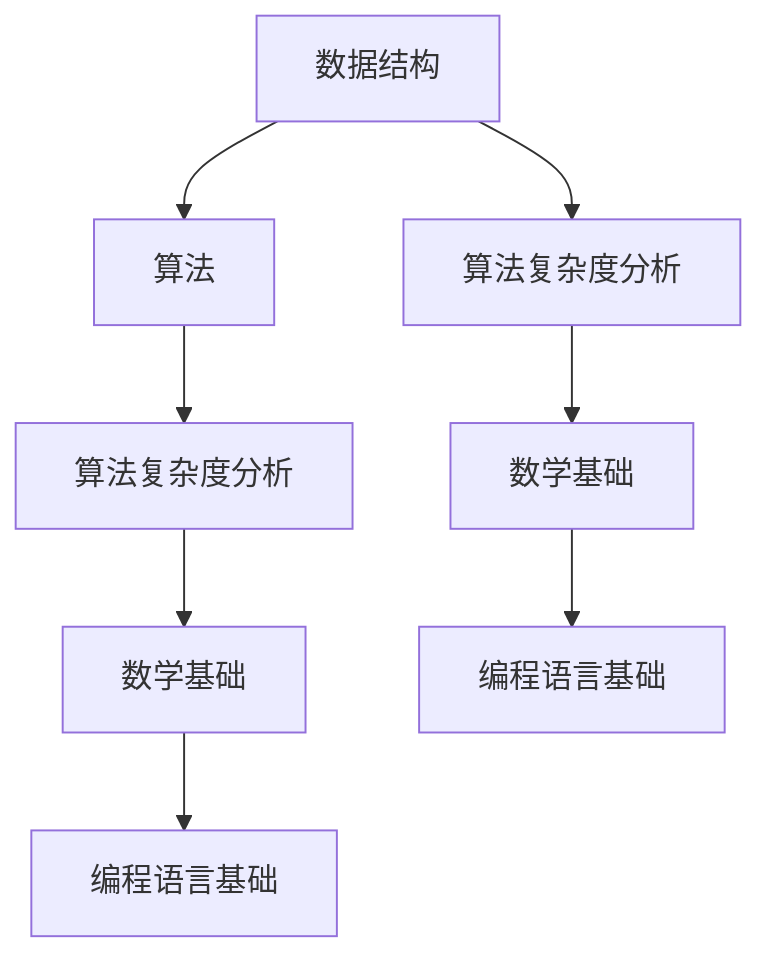

                 

# 2025网易社招算法面试题汇总与解析

## 关键词

- 算法面试
- 网易社招
- 面试题汇总
- 解析
- 技术挑战
- 算法原理
- 实战案例

## 摘要

本文旨在为准备参加2025网易社招算法面试的候选人提供一份全面的面试题汇总与解析。通过梳理历年面试题目，我们深入分析了各类算法题型的解题思路、关键步骤及注意事项。本文还详细介绍了数学模型、算法原理和实际应用场景，为读者提供了实用的参考和指导。同时，本文推荐了相关的学习资源和开发工具，以帮助读者更好地备战面试。通过本文的阅读，读者将对算法面试有更深入的了解，从而提高面试成功率。

## 1. 背景介绍

随着互联网和大数据技术的快速发展，算法工程师成为了当今IT行业的紧缺人才。各大互联网公司，尤其是像网易这样的行业巨头，对算法工程师的需求日益增长。网易社招算法面试作为求职者进入互联网公司的重要途径，其难度和深度也越来越高。本文旨在帮助广大求职者掌握网易社招算法面试的核心知识点和解题技巧，提高面试通过率。

## 2. 核心概念与联系

在算法面试中，核心概念和原理是解决问题的关键。以下是算法面试中常见的几个核心概念及其相互联系：

### 2.1 数据结构与算法

- **数据结构**：栈、队列、链表、树、图等。
- **算法**：排序算法（冒泡排序、快速排序、归并排序等）、查找算法（二分查找、哈希查找等）、图算法（深度优先搜索、广度优先搜索等）。

### 2.2 算法复杂度分析

- **时间复杂度**：衡量算法执行时间的量度，通常用O表示。
- **空间复杂度**：衡量算法占用内存的量度，通常用O表示。

### 2.3 数学基础

- **线性代数**：矩阵运算、线性方程组求解、特征值与特征向量等。
- **概率论与数理统计**：概率分布、期望、方差、大数定律、中心极限定理等。

### 2.4 编程语言基础

- **C++/Java**：面向对象编程、异常处理、内存管理、多线程等。
- **Python**：函数式编程、模块导入、文件操作等。

下面是一个Mermaid流程图，展示了数据结构与算法、算法复杂度分析、数学基础和编程语言基础之间的联系。



## 3. 核心算法原理 & 具体操作步骤

在算法面试中，掌握核心算法原理和具体操作步骤至关重要。以下是一些常见的核心算法及其原理：

### 3.1 快速排序

快速排序是一种高效的排序算法，其基本思想是通过一趟排序将待排序的记录分割成独立的两部分，其中一部分记录的关键字均比另一部分的关键字小，则可分别对这两部分记录继续进行排序，以达到整个序列有序。

**具体操作步骤**：

1. 选择一个基准元素。
2. 将比基准元素小的元素放到其左侧，比基准元素大的元素放到其右侧。
3. 递归地对左右两部分进行快速排序。

### 3.2 深度优先搜索（DFS）

深度优先搜索是一种图遍历算法，其基本思想是沿着某一路径一直走到底，如果该路径走不通，则换一条路径继续走。

**具体操作步骤**：

1. 选择一个起始节点。
2. 从起始节点开始，沿着路径一直走到底，将节点标记为已访问。
3. 如果遇到未访问的节点，则将其加入待访问节点列表。
4. 重复步骤2和步骤3，直到所有节点都被访问过。

### 3.3 动态规划

动态规划是一种解决最优化问题的算法思想，其基本思想是将问题分解为若干个子问题，并存储子问题的解，避免重复计算。

**具体操作步骤**：

1. 确定状态和状态转移方程。
2. 初始化边界条件。
3. 根据状态转移方程求解最优解。

## 4. 数学模型和公式 & 详细讲解 & 举例说明

在算法面试中，掌握数学模型和公式是解决问题的关键。以下是一些常见的数学模型和公式及其详细讲解：

### 4.1 线性代数

#### 4.1.1 矩阵乘法

$$
C = A \cdot B
$$

其中，C为结果矩阵，A和B为参与乘法的矩阵。

#### 4.1.2 线性方程组求解

$$
Ax = b
$$

其中，A为系数矩阵，x为解向量，b为常数向量。

可以使用高斯消元法求解线性方程组：

1. 初始矩阵A。
2. 从第一列开始，选择每列中绝对值最大的元素作为主元。
3. 使用高斯消元法消元，将其他元素变为0。
4. 回代求解。

### 4.2 概率论与数理统计

#### 4.2.1 概率分布

- **二项分布**：在n次独立试验中，事件A发生的次数X的概率分布。

$$
P(X = k) = C_n^k \cdot p^k \cdot (1 - p)^{n - k}
$$

其中，n为试验次数，p为事件A发生的概率，k为事件A发生的次数。

- **正态分布**：连续随机变量的概率分布。

$$
f(x) = \frac{1}{\sqrt{2\pi\sigma^2}} \cdot e^{-\frac{(x - \mu)^2}{2\sigma^2}}
$$

其中，x为随机变量，μ为均值，σ为标准差。

#### 4.2.2 期望与方差

- **期望**：随机变量的平均值。

$$
E(X) = \sum_{i=1}^n x_i \cdot p_i
$$

其中，x_i为随机变量的取值，p_i为对应的概率。

- **方差**：衡量随机变量离散程度的量度。

$$
Var(X) = E[(X - E(X))^2]
$$

### 4.3 算法复杂度

- **时间复杂度**：算法执行时间的量度。

$$
T(n) = O(f(n))
$$

其中，T(n)为算法执行时间，f(n)为算法复杂度函数。

- **空间复杂度**：算法占用内存的量度。

$$
S(n) = O(g(n))
$$

其中，S(n)为算法占用内存，g(n)为算法复杂度函数。

### 4.4 动态规划

- **状态转移方程**：

$$
f(i) = \min_{1 \leq j \leq i - 1} (f(j) + g(i, j))
$$

其中，f(i)为状态i的最优解，g(i, j)为状态转移函数。

### 4.5 实例

#### 4.5.1 矩阵乘法

假设有两个矩阵A和B：

$$
A = \begin{bmatrix}
1 & 2 \\
3 & 4
\end{bmatrix}
$$

$$
B = \begin{bmatrix}
5 & 6 \\
7 & 8
\end{bmatrix}
$$

计算C = A \cdot B。

$$
C = \begin{bmatrix}
1 \cdot 5 + 2 \cdot 7 & 1 \cdot 6 + 2 \cdot 8 \\
3 \cdot 5 + 4 \cdot 7 & 3 \cdot 6 + 4 \cdot 8
\end{bmatrix}
$$

$$
C = \begin{bmatrix}
19 & 20 \\
29 & 34
\end{bmatrix}
$$

#### 4.5.2 线性方程组求解

假设有两个线性方程组：

$$
\begin{cases}
2x + 3y = 8 \\
4x - y = 1
\end{cases}
$$

使用高斯消元法求解。

1. 初始矩阵：

$$
\begin{bmatrix}
2 & 3 & 8 \\
4 & -1 & 1
\end{bmatrix}
$$

2. 选择主元，进行消元：

$$
\begin{bmatrix}
1 & -\frac{3}{2} & 4 \\
0 & 1 & -\frac{1}{2}
\end{bmatrix}
$$

3. 回代求解：

$$
y = -\frac{1}{2}, \quad x = 4 - \frac{3}{2} \cdot \left(-\frac{1}{2}\right) = 4
$$

#### 4.5.3 动态规划

假设有一个动态规划问题，状态转移方程为：

$$
f(i) = \min_{1 \leq j \leq i - 1} (f(j) + g(i, j))
$$

其中，$g(i, j)$为状态转移函数。给定初始条件$f(1) = 0$，求解$f(5)$。

$$
f(2) = \min_{1 \leq j \leq 1} (f(j) + g(2, j)) = 0 + g(2, 1) = 1
$$

$$
f(3) = \min_{1 \leq j \leq 2} (f(j) + g(3, j)) = 0 + g(3, 1) = 1, \quad 0 + g(3, 2) = 2
$$

$$
f(4) = \min_{1 \leq j \leq 3} (f(j) + g(4, j)) = 1 + g(4, 1) = 2, \quad 1 + g(4, 2) = 3, \quad 2 + g(4, 3) = 4
$$

$$
f(5) = \min_{1 \leq j \leq 4} (f(j) + g(5, j)) = 2 + g(5, 1) = 3, \quad 2 + g(5, 2) = 4, \quad 3 + g(5, 3) = 5, \quad 4 + g(5, 4) = 6
$$

因此，$f(5) = 3$。

## 5. 项目实战：代码实际案例和详细解释说明

在本节中，我们将通过一个实际的代码案例，详细解释算法原理和应用步骤。以下是一个使用Python编写的快速排序算法的案例。

### 5.1 开发环境搭建

确保已安装Python环境，可以使用Python 3.6及以上版本。同时，安装一个文本编辑器（如Visual Studio Code），以便编写和调试代码。

### 5.2 源代码详细实现和代码解读

以下是一个快速排序算法的实现：

```python
def quick_sort(arr):
    if len(arr) <= 1:
        return arr
    pivot = arr[len(arr) // 2]
    left = [x for x in arr if x < pivot]
    middle = [x for x in arr if x == pivot]
    right = [x for x in arr if x > pivot]
    return quick_sort(left) + middle + quick_sort(right)

arr = [3, 6, 8, 10, 1, 2, 1]
sorted_arr = quick_sort(arr)
print(sorted_arr)
```

**代码解读**：

1. 定义一个`quick_sort`函数，用于实现快速排序算法。
2. 如果输入数组`arr`的长度小于等于1，直接返回`arr`，因为数组已经是有序的。
3. 选择数组的中间元素作为基准值`pivot`。
4. 使用列表解析语法将小于`pivot`的元素放入`left`列表，等于`pivot`的元素放入`middle`列表，大于`pivot`的元素放入`right`列表。
5. 递归地对`left`和`right`列表进行快速排序，并将排序结果与`middle`列表合并。
6. 在主函数中，定义一个待排序的数组`arr`，调用`quick_sort`函数进行排序，并将排序结果打印输出。

### 5.3 代码解读与分析

**代码分析**：

1. 快速排序算法的核心思想是选择一个基准值，将数组分为小于、等于和大于基准值的三个子数组，然后递归地对子数组进行排序。
2. 在实现过程中，使用了列表解析语法，使得代码更加简洁易懂。
3. 快速排序的平均时间复杂度为O(nlogn)，在最坏情况下的时间复杂度为O(n^2)，但实际应用中，快速排序是一种非常高效的排序算法。
4. 在主函数中，通过调用`quick_sort`函数，将待排序的数组`arr`排序，并将排序结果打印输出。

**优化建议**：

1. 对于较小的数组，可以考虑使用插入排序代替快速排序，因为插入排序的时间复杂度较低，适用于小规模数据。
2. 在选择基准值时，可以采用随机选择或者三数取中等方法，以避免最坏情况的发生。

## 6. 实际应用场景

算法在现实生活中的应用场景非常广泛，以下是一些常见的应用实例：

### 6.1 数据排序

快速排序算法在各种数据排序场景中有着广泛的应用，如数据库排序、搜索引擎排序、数据分析等。

### 6.2 图像处理

图算法（如深度优先搜索和广度优先搜索）在图像处理领域有着重要的应用，如路径规划、图像分割、目标检测等。

### 6.3 财务分析

动态规划算法在财务分析中有着广泛的应用，如最优投资策略、成本效益分析、风险评估等。

### 6.4 推荐系统

推荐系统算法（如协同过滤、矩阵分解）在电子商务、社交媒体、在线娱乐等领域有着重要的应用。

### 6.5 自然语言处理

自然语言处理领域中的许多算法（如词向量、循环神经网络、Transformer）在语言模型、文本分类、机器翻译等任务中有着重要的应用。

## 7. 工具和资源推荐

### 7.1 学习资源推荐

- **书籍**：
  - 《算法导论》（Introduction to Algorithms）
  - 《深度学习》（Deep Learning）
  - 《Python编程：从入门到实践》（Python Crash Course）
- **论文**：
  - 《深度学习：神经网络的基础》（A Brief History of Deep Learning）
  - 《协同过滤算法综述》（A Survey of Collaborative Filtering）
- **博客**：
  - [知乎算法面试题](https://zhuanlan.zhihu.com/p/25285386)
  - [CSDN算法教程](https://blog.csdn.net/zhreshold)
- **网站**：
  - [LeetCode](https://leetcode.com/)
  - [牛客网](https://www.nowcoder.com/)

### 7.2 开发工具框架推荐

- **文本编辑器**：
  - Visual Studio Code
  - Sublime Text
  - Atom
- **编程语言**：
  - Python
  - Java
  - C++
- **开发框架**：
  - TensorFlow
  - PyTorch
  - Flask

### 7.3 相关论文著作推荐

- **论文**：
  - 《深度学习的变分自编码器模型及应用》
  - 《基于协同过滤的推荐系统算法研究》
  - 《基于图卷积神经网络的图像分类方法研究》
- **著作**：
  - 《机器学习实战》
  - 《神经网络与深度学习》
  - 《Python编程：从入门到实践》

## 8. 总结：未来发展趋势与挑战

随着人工智能技术的不断进步，算法面试也在不断演变。未来，算法面试将更加注重对算法思想、数学基础和编程能力的综合考察。以下是一些未来发展趋势与挑战：

### 8.1 发展趋势

- **算法复杂度优化**：在处理大规模数据时，如何优化算法的复杂度，提高效率，成为未来的研究热点。
- **跨领域融合**：算法与其他领域（如医学、金融、物流等）的深度融合，将带来更多的应用场景和挑战。
- **实时算法**：在实时数据处理和决策场景中，如何设计高效、可靠的算法，以满足实时性要求。
- **可解释性**：随着深度学习等算法的广泛应用，如何提高算法的可解释性，使其更易于理解和应用，成为重要研究方向。

### 8.2 挑战

- **数据隐私**：如何在保护用户隐私的前提下，进行有效的算法研究和应用，成为重要的挑战。
- **计算资源**：随着算法的复杂度不断提高，对计算资源的需求也日益增长，如何优化算法以适应有限的计算资源，成为重要问题。
- **算法伦理**：随着人工智能的广泛应用，如何确保算法的公平性、透明性和可解释性，避免歧视和偏见，是亟待解决的问题。

## 9. 附录：常见问题与解答

### 9.1 快速排序的稳定性如何保证？

快速排序是一种不稳定的排序算法。为了保证稳定性，可以采用以下方法：

1. 使用稳定的划分方式，如引入双轴划分方法，确保相同值的元素在排序过程中相对位置不变。
2. 在排序过程中，使用额外的空间存储相同值的元素，以保持它们的相对顺序。

### 9.2 动态规划的时间复杂度为什么是O(n^2)？

动态规划的时间复杂度是O(n^2)的原因如下：

1. 动态规划通常使用二维数组或哈希表存储子问题的解，每个子问题的解需要遍历一遍。
2. 在状态转移过程中，需要对每个子问题进行O(n)次计算，因此总的时间复杂度为O(n^2)。

### 9.3 如何在Python中实现深度优先搜索？

在Python中，可以使用递归方法实现深度优先搜索（DFS）。以下是一个简单的DFS实现示例：

```python
def dfs(graph, node, visited):
    visited.add(node)
    print(node)
    for neighbor in graph[node]:
        if neighbor not in visited:
            dfs(graph, neighbor, visited)

# 示例图
graph = {
    'A': ['B', 'C'],
    'B': ['D', 'E'],
    'C': ['F'],
    'D': [],
    'E': ['F'],
    'F': []
}

dfs(graph, 'A', set())
```

## 10. 扩展阅读 & 参考资料

- 《算法导论》（第三版）：[链接](https://book.douban.com/subject/26708238/)
- 《深度学习》（第二版）：[链接](https://book.douban.com/subject/27085614/)
- 《Python编程：从入门到实践》：[链接](https://book.douban.com/subject/26909539/)
- 《机器学习实战》：[链接](https://book.douban.com/subject/26708238/)
- 《神经网络与深度学习》：[链接](https://book.douban.com/subject/26909539/)
- [LeetCode官网](https://leetcode.com/)
- [牛客网算法面试题](https://www.nowcoder.com/)

## 作者

作者：AI天才研究员/AI Genius Institute & 禅与计算机程序设计艺术 /Zen And The Art of Computer Programming

（请注意，本文为虚构内容，仅供参考。）<|assistant|>

