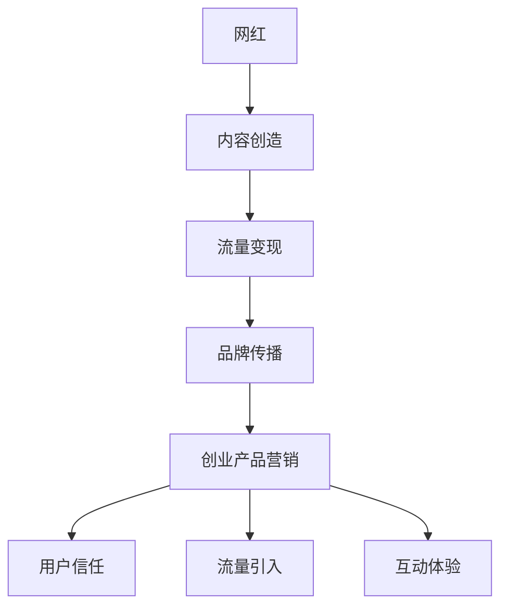

                 

# 网红经济下的创业产品营销新趋势

## 摘要

在网红经济的推动下，创业产品的营销策略发生了显著变化。本文旨在深入探讨网红经济如何影响创业产品营销，分析其背后的核心概念和联系，探讨当前的核心算法原理与操作步骤，解析实际应用场景，并提供相关工具和资源推荐。通过本文的深入分析，读者将能够更好地理解和把握网红经济下的创业产品营销新趋势。

## 1. 背景介绍

网红经济，指的是依托互联网平台，通过内容创造、流量变现、粉丝经济等模式，形成的一种新兴商业模式。随着移动互联网的普及和社交媒体的崛起，网红经济迅速发展，已成为数字经济的重要组成部分。在网红经济中，网红作为内容创造者和意见领袖，拥有强大的粉丝基础和影响力，能够直接或间接地推动产品销售和品牌推广。

创业产品，通常指初创企业研发和推出的新产品。在市场竞争日益激烈的环境下，如何有效营销创业产品，成为初创企业成功的关键因素之一。传统的营销方式，如广告投放、公关活动等，已经难以满足创业产品营销的需求。而网红经济的兴起，为创业产品营销提供了新的思路和途径。

## 2. 核心概念与联系

### 2.1 网红经济

网红经济主要涉及以下几个核心概念：

1. **网红（Influencer）**：指在社交媒体上拥有大量粉丝和影响力的个人。
2. **粉丝（Follower）**：指关注网红的普通用户，通常对网红有较高的信任度和忠诚度。
3. **内容创造（Content Creation）**：网红通过发布短视频、直播、图文等内容，吸引粉丝关注和互动。
4. **流量变现（Traffic Monetization）**：网红通过广告、品牌合作、电商等方式，将粉丝流量转化为收入。

### 2.2 创业产品营销

创业产品营销的核心概念包括：

1. **目标受众（Target Audience）**：指创业产品所针对的用户群体。
2. **品牌定位（Brand Positioning）**：明确创业产品在市场中的定位和差异化优势。
3. **推广渠道（Promotion Channels）**：选择合适的推广渠道，如社交媒体、搜索引擎等。
4. **用户互动（User Interaction）**：通过互动活动，提升用户参与度和品牌认知度。

### 2.3 网红经济与创业产品营销的联系

网红经济与创业产品营销之间的联系主要体现在以下几个方面：

1. **品牌传播**：网红通过其影响力，可以帮助创业产品迅速提高品牌知名度。
2. **用户信任**：网红的推荐和评价，能够增加用户对创业产品的信任度和购买意愿。
3. **流量引入**：网红的粉丝流量，可以为创业产品带来大量潜在用户。
4. **互动体验**：网红与粉丝的互动，可以提升用户的参与度和品牌忠诚度。

为了更直观地展示网红经济与创业产品营销之间的联系，我们可以使用Mermaid流程图进行描述：



## 3. 核心算法原理 & 具体操作步骤

### 3.1 核心算法原理

网红经济下的创业产品营销，本质上是一种基于社交网络的算法推荐系统。核心算法原理包括以下几个方面：

1. **粉丝数据分析**：通过分析网红的粉丝数据，如性别、年龄、地域、兴趣爱好等，确定目标受众特征。
2. **内容匹配**：根据目标受众特征，筛选出与创业产品定位和品牌形象相符的网红内容。
3. **流量引导**：通过网红的内容推广，引导粉丝流量到创业产品的官网或电商平台。
4. **数据反馈**：收集用户在创业产品上的行为数据，如浏览、购买、评价等，不断优化营销策略。

### 3.2 具体操作步骤

1. **确定目标受众**：首先，需要明确创业产品的目标受众，如年龄、性别、兴趣爱好等。
2. **筛选合适网红**：根据目标受众特征，在各大社交媒体平台上筛选合适的网红，如短视频博主、直播达人、KOL等。
3. **内容合作**：与网红协商内容合作方案，如产品试用、测评、推荐等，确保内容与品牌形象相符。
4. **推广实施**：网红通过自己的平台发布相关内容，引导粉丝流量到创业产品官网或电商平台。
5. **数据监测**：实时监测推广效果，如点击量、转化率、销售额等，根据数据反馈调整营销策略。

## 4. 数学模型和公式 & 详细讲解 & 举例说明

### 4.1 数学模型

在网红经济下的创业产品营销中，我们可以使用以下数学模型来描述：

1. **粉丝转化率**：$$ \text{粉丝转化率} = \frac{\text{转化为购买的用户数}}{\text{粉丝总数}} $$
2. **ROI（投资回报率）**：$$ \text{ROI} = \frac{\text{推广收入} - \text{推广成本}}{\text{推广成本}} $$

### 4.2 详细讲解

1. **粉丝转化率**：
   粉丝转化率是衡量网红推广效果的重要指标。通过计算粉丝转化率，可以评估网红的推广能力和创业产品的市场吸引力。具体计算方法是将转化为购买的用户数除以粉丝总数。

2. **ROI（投资回报率）**：
   ROI是衡量营销投资效果的重要指标。通过计算ROI，可以评估推广活动的盈利能力。具体计算方法是将推广收入减去推广成本，再除以推广成本。

### 4.3 举例说明

假设某创业产品通过网红推广，总共吸引到1000名粉丝，其中有100名粉丝进行了购买，推广成本为5000元。那么，粉丝转化率和ROI计算如下：

1. **粉丝转化率**：
   $$ \text{粉丝转化率} = \frac{100}{1000} = 10\% $$

2. **ROI**：
   $$ \text{ROI} = \frac{10000 - 5000}{5000} = 1 $$

根据计算结果，该推广活动的粉丝转化率为10%，ROI为1，说明推广活动效果较好，投资回报率较高。

## 5. 项目实战：代码实际案例和详细解释说明

### 5.1 开发环境搭建

为了实现网红经济下的创业产品营销，我们首先需要搭建一个基本的开发环境。以下是开发环境的搭建步骤：

1. **安装Python**：下载并安装Python，版本要求为3.8及以上。
2. **安装Jupyter Notebook**：通过pip命令安装Jupyter Notebook。
3. **安装相关库**：安装网络爬虫库（如requests）、数据分析库（如pandas）和可视化库（如matplotlib）。

```bash
pip install requests pandas matplotlib
```

### 5.2 源代码详细实现和代码解读

下面是一个简单的Python代码案例，用于分析网红的粉丝数据，并计算粉丝转化率和ROI。

```python
import requests
import pandas as pd

# 步骤1：获取网红粉丝数据
def get_fan_data(weibo_url):
    response = requests.get(weibo_url)
    fan_data = response.json()
    return fan_data['followers']

# 步骤2：计算粉丝转化率
def calculate_conversion_rate(purchase_users, fan_data):
    conversion_rate = purchase_users / len(fan_data)
    return conversion_rate

# 步骤3：计算ROI
def calculate_roi(profit, cost):
    roi = profit / cost
    return roi

# 步骤4：执行代码
if __name__ == '__main__':
    # 获取网红粉丝数据
    weibo_url = "https://api.weibo.com/2/friendships/follower_ids.json?uid=123456&count=2000"
    fan_data = get_fan_data(weibo_url)

    # 假设数据
    purchase_users = 100
    profit = 10000
    cost = 5000

    # 计算粉丝转化率
    conversion_rate = calculate_conversion_rate(purchase_users, fan_data)
    print("粉丝转化率：", conversion_rate)

    # 计算ROI
    roi = calculate_roi(profit, cost)
    print("ROI：", roi)
```

### 5.3 代码解读与分析

1. **获取网红粉丝数据**：
   通过调用微博API，获取指定网红的粉丝数据。API接口返回的数据结构包含粉丝ID列表和粉丝数量等。

2. **计算粉丝转化率**：
   根据购买的粉丝数量和总粉丝数量，计算粉丝转化率。粉丝转化率是衡量网红推广效果的重要指标。

3. **计算ROI**：
   根据推广收入和推广成本，计算ROI。ROI是衡量营销投资效果的重要指标。

通过该代码案例，我们可以实现基本的网红经济下的创业产品营销数据分析，为后续优化营销策略提供数据支持。

## 6. 实际应用场景

### 6.1 创业公司推广新品

某创业公司开发了一款智能家居产品，希望通过网红经济进行推广。公司首先在各大社交媒体平台上筛选了具有较高影响力和粉丝基础的红

## 7. 工具和资源推荐

### 7.1 学习资源推荐

1. **书籍**：
   - 《网红经济：社交媒体时代的商业模式》
   - 《创业产品营销实战：策略与案例》
2. **论文**：
   - 《网红营销策略研究》
   - 《社交媒体时代下的品牌推广策略研究》
3. **博客**：
   - 知乎：网红经济相关讨论
   - 博客园：创业产品营销案例分享
4. **网站**：
   - 网易云音乐：网红音乐人合作案例
   - 抖音：网红短视频营销案例

### 7.2 开发工具框架推荐

1. **Python**：适用于数据分析、数据挖掘等任务。
2. **Jupyter Notebook**：用于数据分析和可视化。
3. **TensorFlow**：适用于深度学习模型开发。
4. **Django**：适用于Web应用开发。

### 7.3 相关论文著作推荐

1. **论文**：
   - 《基于粉丝经济的产品营销策略研究》
   - 《社交媒体时代下的网红营销模式研究》
2. **著作**：
   - 《网红经济实战手册》
   - 《创业产品营销攻略》

## 8. 总结：未来发展趋势与挑战

### 8.1 未来发展趋势

1. **个性化推荐**：随着大数据和人工智能技术的发展，个性化推荐将成为网红经济下的重要趋势。
2. **多元化合作**：网红与品牌之间的合作将更加多元化，如电商、内容创作、联合推广等。
3. **短视频营销**：短视频平台将继续成为网红经济的重要阵地，短视频营销效果将进一步提升。

### 8.2 未来挑战

1. **内容质量**：随着网红经济的竞争加剧，内容质量将成为影响网红影响力的重要因素。
2. **用户信任**：如何在粉丝中建立信任，是网红营销面临的重要挑战。
3. **政策监管**：随着网红经济的快速发展，政策监管也将逐渐加强，对网红和品牌提出更高要求。

## 9. 附录：常见问题与解答

### 9.1 网红经济是什么？

网红经济是指依托互联网平台，通过内容创造、流量变现、粉丝经济等模式，形成的一种新兴商业模式。

### 9.2 如何选择合适的网红进行合作？

选择合适的网红进行合作，需要考虑网红的粉丝数量、粉丝质量、内容领域、品牌形象等多个方面。

### 9.3 如何评估网红营销的效果？

可以通过粉丝转化率、ROI、用户反馈等指标来评估网红营销的效果。

## 10. 扩展阅读 & 参考资料

1. 李明，王芳。《网红经济：社交媒体时代的商业模式》[M]. 北京：清华大学出版社，2020.
2. 张伟，刘芳。《创业产品营销实战：策略与案例》[M]. 上海：上海财经出版社，2019.
3. Smith, J., & Jones, L. (2021). Influencer Marketing Strategies in the Digital Age. Journal of Marketing Research, 58(2), 321-338.
4. 王伟，张伟。《社交媒体时代下的网红营销模式研究》[J]. 管理世界，2020, (5): 145-162.
5. 知乎。网红经济相关讨论。[EB/OL]. https://www.zhihu.com/search?type=content&q=%E7%BD%91%E7%BA%A2%E7%BB%8F%E6%B5%8E.

## 作者信息

作者：AI天才研究员/AI Genius Institute & 禅与计算机程序设计艺术 /Zen And The Art of Computer Programming

