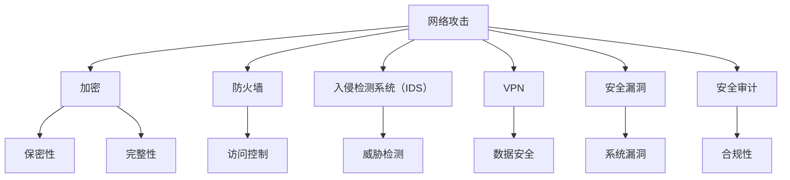

                 

### 背景介绍

网络安全，作为现代信息社会的基石，已经成为了每个技术创业者都必须关注的重要议题。随着互联网和数字化技术的飞速发展，网络安全威胁也日益严峻，从个人隐私泄露到企业数据窃取，网络安全事件频发，给社会带来了巨大的经济损失和信任危机。

技术创业者们不仅在追求技术突破和创新的过程中需要面对各种挑战，还要时刻警惕网络安全问题。他们肩负着保护用户数据和隐私的重要责任，同时也面临着黑客攻击、数据泄露等安全风险。因此，了解网络安全的重要性、掌握相关技术和策略，对于技术创业者来说至关重要。

本文将深入探讨网络安全对于技术创业者的意义，从核心概念、算法原理、实际应用、工具资源等方面进行全面分析。通过逐步推理和讲解，帮助创业者们构建起一套完善的网络安全防护体系，同时捕捉到在这一领域中蕴藏的巨大机遇。

在这篇文章中，我们将依次探讨以下内容：

1. **核心概念与联系**：介绍网络安全的关键术语和基本概念，绘制流程图以便读者更好地理解。
2. **核心算法原理 & 具体操作步骤**：讲解网络安全领域的主要算法，并详细描述其实现步骤。
3. **数学模型和公式 & 详细讲解 & 举例说明**：运用数学模型和公式来阐释网络安全的关键原理，并通过实际案例进行说明。
4. **项目实战：代码实际案例和详细解释说明**：展示一个具体的网络安全项目，详细解读代码实现过程。
5. **实际应用场景**：分析网络安全在各个领域的应用，探讨其面临的挑战和解决方案。
6. **工具和资源推荐**：推荐学习和实践网络安全所需的学习资源、开发工具和框架。
7. **总结：未来发展趋势与挑战**：总结当前网络安全领域的发展趋势，预测未来的挑战和机遇。

通过这篇文章，读者将能够全面了解网络安全的重要性，掌握基本的安全防护技术和策略，从而在创业过程中更加从容应对各种安全挑战，抓住网络安全领域的发展机遇。

### 核心概念与联系

要深入探讨网络安全，我们首先需要了解一些核心概念和术语，这些概念和术语是构建网络安全防护体系的基础。以下是一些关键术语的定义和它们之间的关系：

1. **网络攻击**：指黑客或恶意软件对计算机网络系统进行的非法侵入、窃取、篡改或破坏行为。常见的网络攻击包括分布式拒绝服务（DDoS）、恶意软件传播、密码破解等。

2. **加密**：指通过算法和密钥将明文转换为密文的过程。加密技术是网络安全的核心，可以保证数据在传输和存储过程中的保密性和完整性。常用的加密算法有对称加密（如AES）、非对称加密（如RSA）等。

3. **防火墙**：指一种网络安全设备，用于监控和控制进出网络的流量，防止未经授权的访问。防火墙可以根据预设规则对流量进行过滤和阻止，是网络安全的第一道防线。

4. **入侵检测系统（IDS）**：指一种能够实时监测网络流量，识别和报告潜在入侵行为的系统。IDS可以分为基于特征检测的IDS和基于异常检测的IDS，它们能够帮助网络管理员快速发现和响应网络安全威胁。

5. **虚拟专用网络（VPN）**：指通过公共网络（如互联网）建立一个加密的通道，使得数据在传输过程中能够保持安全。VPN广泛用于远程办公和跨境数据传输。

6. **安全漏洞**：指系统中的弱点或缺陷，可以被黑客利用来侵入或破坏系统。识别和修复安全漏洞是网络安全管理的重要任务。

7. **安全审计**：指对系统进行安全检查和评估，以确保其符合安全标准。安全审计可以帮助企业发现潜在的安全风险，并采取相应的措施进行改进。

为了更直观地展示这些核心概念之间的联系，我们可以使用Mermaid流程图来绘制它们之间的关系：



通过上述定义和Mermaid流程图，我们可以看到，网络安全是一个多层次的体系，每个组成部分都有其特定的功能和相互关联。加密技术确保数据的保密性和完整性，防火墙和入侵检测系统用于监测和防御网络攻击，VPN提供了安全的远程访问，安全审计则确保系统符合安全标准。这些概念和技术的有机结合，构成了一个完整的网络安全防护体系。

### 核心算法原理 & 具体操作步骤

在网络安全领域，核心算法起着至关重要的作用。它们不仅是防御网络攻击的有力工具，还为安全协议的设计和实现提供了理论基础。下面，我们将介绍几种主要的网络安全算法，并详细描述其原理和具体操作步骤。

#### 1. 密码学算法

密码学是网络安全的核心，它包括加密算法和密钥管理。以下是两种常见的密码学算法：

**1.1 对称加密算法（AES）**

对称加密算法是一种加密和解密使用相同密钥的加密方法。AES（高级加密标准）是目前最流行的对称加密算法之一。

**原理**：AES 通过替换和置换等操作将明文转换为密文。它使用128位、192位或256位密钥来加密数据。

**操作步骤**：

1. **密钥生成**：根据密钥长度生成一个随机密钥。
2. **初始化**：将明文分割成128位的块，并进行初始置换。
3. **加密循环**：对每个块进行多个循环操作，包括字节替换、行移位、列混淆和轮密钥加。
4. **输出**：将每个加密后的块合并成密文。

**1.2 非对称加密算法（RSA）**

非对称加密算法使用一对密钥（公钥和私钥）进行加密和解密。RSA 是最常见的非对称加密算法之一。

**原理**：RSA 通过数学难题（如大数分解）来实现加密和解密。公钥用于加密，私钥用于解密。

**操作步骤**：

1. **密钥生成**：选择两个大素数，计算它们的乘积作为模数，然后计算模数的欧拉函数作为公钥的指数。
2. **加密**：使用公钥和明文进行模幂运算，得到密文。
3. **解密**：使用私钥和密文进行模幂运算，得到明文。

#### 2. 整数分解算法（Shor算法）

整数分解算法是密码学研究的重要方向，因为许多密码学协议依赖于大素数的乘积难以分解。

**原理**：Shor 算法是量子计算机上的一个算法，它可以在多项式时间内找到大整数的素因子。

**操作步骤**：

1. **输入**：一个大于2的整数。
2. **预处理**：将整数分解为质因数。
3. **量子计算**：使用量子计算机进行快速质因数分解。
4. **输出**：得到整数的质因子。

#### 3. 散列算法（SHA-256）

散列算法用于生成数据的唯一指纹，确保数据的完整性和不可篡改性。

**原理**：SHA-256 通过压缩函数将输入数据映射到一个固定长度的输出值，输出值称为散列值。

**操作步骤**：

1. **初始化**：将输入数据填充为512位块。
2. **处理输入**：对每个数据块进行一系列的压缩操作，包括分块、奇偶置换和函数迭代。
3. **输出**：生成256位的散列值。

通过以上核心算法的介绍，我们可以看到，网络安全的核心在于密码学算法的运用，而密码学算法的实现又依赖于数学原理和计算技术。了解这些算法的原理和具体操作步骤，对于技术创业者来说，不仅有助于提升网络安全防护能力，也有助于在设计产品时考虑到安全性的需求。接下来，我们将通过一个数学模型和公式，进一步阐释这些算法在网络安全中的应用。

### 数学模型和公式 & 详细讲解 & 举例说明

在网络安全中，数学模型和公式扮演着至关重要的角色，它们不仅帮助我们理解加密算法的工作原理，还为我们提供了评估安全性的工具。以下我们将详细讲解几个关键数学模型和公式，并通过实际案例进行说明。

#### 1. 对称加密算法的数学模型

**AES（高级加密标准）**是一种基于线性代数的对称加密算法。AES 的核心是 **S-Box** 和 **线性变换**。以下是 AES 加密过程中涉及的几个关键步骤和数学公式。

**S-Box：** 
AES 的 S-Box 是一个8x8的替换表，用于对每个字节进行非线性变换。S-Box 的生成基于 **逆离散对数映射**：

$$
sbox(x) = (x^{-1} \mod 28) \times 16
$$

**线性变换：** 
AES 的线性变换包括 **字节替换**（SubBytes）、**行移位**（ShiftRows）和 **列混淆**（MixColumns）。以下是这些变换的数学表达式。

**字节替换（SubBytes）**：
$$
sbox(a) = sbox(a \mod 16)
$$

**行移位（ShiftRows）**：
$$
\begin{bmatrix}
a_0 & a_1 & a_2 & a_3 \\
b_0 & b_1 & b_2 & b_3 \\
c_0 & c_1 & c_2 & c_3 \\
d_0 & d_1 & d_2 & d_3
\end{bmatrix}
\rightarrow
\begin{bmatrix}
a_0 & a_1 & a_2 & a_3 \\
b_1 & b_2 & b_3 & b_0 \\
c_2 & c_3 & c_0 & c_1 \\
d_3 & d_0 & d_1 & d_2
\end{bmatrix}
$$

**列混淆（MixColumns）**：
$$
\begin{bmatrix}
a_0 & a_1 & a_2 & a_3 \\
b_0 & b_1 & b_2 & b_3 \\
c_0 & c_1 & c_2 & c_3 \\
d_0 & d_1 & d_2 & d_3
\end{bmatrix}
\rightarrow
\begin{bmatrix}
(a_0 + a_4) \times 02 & (a_1 + a_5) \times 0B & (a_2 + a_6) \times 0D & (a_3 + a_7) \times 09 \\
(a_0 + a_5) \times 0E & (a_1 + a_6) \times 0C & (a_2 + a_7) \times 0A & (a_3 + a_4) \times 0F \\
(a_0 + a_6) \times 0B & (a_1 + a_7) \times 0D & (a_2 + a_4) \times 09 & (a_3 + a_5) \times 0E \\
(a_0 + a_7) \times 0D & (a_1 + a_4) \times 0A & (a_2 + a_5) \times 0F & (a_3 + a_6) \times 0C
\end{bmatrix}
$$

**实际案例**：假设我们要对字节“42”进行AES加密。

1. **字节替换**：使用S-Box进行替换，得到“13”。
2. **行移位**：将字节“13”移到第一行第三个位置，得到“13”。
3. **列混淆**：根据MixColumns公式，将“13”进行列混淆操作，得到“0D”。

最终，原始字节“42”被加密为“0D”。

#### 2. 非对称加密算法的数学模型

**RSA（Rivest-Shamir-Adleman）**是一种常见的非对称加密算法。RSA 的安全性基于大整数分解的难题。

**原理**：
- **模运算**：$a \mod n$ 表示 a 除以 n 的余数。
- **模幂运算**：$a^b \mod n$ 表示 a 的 b 次幂模 n 的结果。
- **欧拉函数**：$\phi(n) = (p-1)(q-1)$，其中 p 和 q 是两个大素数，n = p \* q。

**操作步骤**：

**加密**：
1. 选择两个大素数 p 和 q，计算 n = p \* q 和 $\phi(n)$。
2. 选择一个小于 $\phi(n)$ 的整数 e，使得 e 和 $\phi(n)$ 互质。
3. 计算 d，使得 $d \equiv e^{-1} \mod \phi(n)$。
4. 对消息 M 进行加密：$c = M^e \mod n$。

**解密**：
1. 对密文 c 进行解密：$M = c^d \mod n$。

**实际案例**：假设 p = 61，q = 53，n = 3233，$\phi(n) = 3120$，e = 17，d = 2733。

- **加密**：假设明文 M = 1234。
  $$
  c = 1234^{17} \mod 3233 = 2592
  $$

- **解密**：对密文 c = 2592 进行解密。
  $$
  M = 2592^{2733} \mod 3233 = 1234
  $$

通过上述数学模型和公式，我们可以看到，对称加密和非对称加密算法在网络安全中发挥着至关重要的作用。掌握这些数学原理，不仅有助于理解加密算法的工作机制，还能为安全协议的设计和实现提供理论基础。在接下来的章节中，我们将通过一个具体的代码案例，进一步探讨网络安全在项目中的应用。

### 项目实战：代码实际案例和详细解释说明

在本节中，我们将通过一个具体的网络安全项目，详细展示代码的实现过程，并对其进行解读和分析。该项目将使用Python语言和几个开源库，如PyCryptoDome，实现一个基于RSA算法的加密和解密功能。

#### 5.1 开发环境搭建

为了完成这个项目，我们需要安装以下软件和库：

1. **Python（版本3.6或以上）**：Python是一种广泛使用的编程语言，具有良好的生态和丰富的库。
2. **PyCryptoDome**：这是一个用于加密和哈希运算的开源库，包含了许多流行的加密算法，如RSA、AES等。

安装步骤：

1. 打开终端或命令提示符。
2. 输入以下命令安装Python：
   ```
   sudo apt-get install python3
   ```
3. 安装PyCryptoDome库：
   ```
   pip3 install pycryptodome
   ```

#### 5.2 源代码详细实现和代码解读

以下是该项目的主要代码，我们将逐行进行解读。

```python
from Crypto.PublicKey import RSA
from Crypto.Cipher import PKCS1_OAEP

# 生成RSA密钥
def generate_keypair():
    key = RSA.generate(2048)
    private_key = key.export_key()
    public_key = key.publickey().export_key()
    return private_key, public_key

# RSA加密
def encrypt_message(public_key, message):
    rsa_public_key = RSA.import_key(public_key)
    cipher_rsa = PKCS1_OAEP.new(rsa_public_key)
    encrypted_message = cipher_rsa.encrypt(message)
    return encrypted_message

# RSA解密
def decrypt_message(private_key, encrypted_message):
    rsa_private_key = RSA.import_key(private_key)
    cipher_rsa = PKCS1_OAEP.new(rsa_private_key)
    decrypted_message = cipher_rsa.decrypt(encrypted_message)
    return decrypted_message

# 主函数
def main():
    # 生成密钥对
    private_key, public_key = generate_keypair()

    # 待加密的消息
    message = b"Hello, World!"

    # 加密消息
    encrypted_message = encrypt_message(public_key, message)
    print(f"Encrypted Message: {encrypted_message.hex()}")

    # 解密消息
    decrypted_message = decrypt_message(private_key, encrypted_message)
    print(f"Decrypted Message: {decrypted_message.decode()}")

if __name__ == "__main__":
    main()
```

**代码解读**：

1. **导入库**：
   - `from Crypto.PublicKey import RSA`：导入RSA密钥生成库。
   - `from Crypto.Cipher import PKCS1_OAEP`：导入基于PKCS1_OAEP的加密和解密库。

2. **生成RSA密钥**：
   - `generate_keypair()`：生成RSA密钥对，密钥长度为2048位。
   - `key = RSA.generate(2048)`：使用RSA算法生成密钥对。
   - `private_key = key.export_key()`：导出私钥。
   - `public_key = key.publickey().export_key()`：导出公钥。

3. **RSA加密**：
   - `encrypt_message(public_key, message)`：使用公钥加密消息。
   - `rsa_public_key = RSA.import_key(public_key)`：导入公钥。
   - `cipher_rsa = PKCS1_OAEP.new(rsa_public_key)`：创建一个PKCS1_OAEP加密对象。
   - `encrypted_message = cipher_rsa.encrypt(message)`：加密消息。

4. **RSA解密**：
   - `decrypt_message(private_key, encrypted_message)`：使用私钥解密消息。
   - `rsa_private_key = RSA.import_key(private_key)`：导入私钥。
   - `cipher_rsa = PKCS1_OAEP.new(rsa_private_key)`：创建一个PKCS1_OAEP解密对象。
   - `decrypted_message = cipher_rsa.decrypt(encrypted_message)`：解密消息。

5. **主函数**：
   - `main()`：实现加密和解密功能。
   - `private_key, public_key = generate_keypair()`：生成密钥对。
   - `message = b"Hello, World!"`：设置待加密的消息。
   - `encrypted_message = encrypt_message(public_key, message)`：加密消息。
   - `print(f"Encrypted Message: {encrypted_message.hex()}")`：打印加密消息。
   - `decrypted_message = decrypt_message(private_key, encrypted_message)`：解密消息。
   - `print(f"Decrypted Message: {decrypted_message.decode()}")`：打印解密消息。

#### 5.3 代码解读与分析

**1. 密钥生成**：

密钥生成是整个加密和解密过程的基础。在本例中，我们使用RSA算法生成2048位的密钥对。RSA算法的安全性依赖于大整数分解的难度，因此密钥长度越长，安全性越高。

**2. 加密**：

加密过程使用公钥和消息进行模幂运算。在本例中，我们使用了PKCS1_OAEP加密方案，它是一种标准的RSA加密方式，可以提供良好的安全性能。

**3. 解密**：

解密过程使用私钥和密文进行模幂运算，还原原始消息。在本例中，我们也使用了PKCS1_OAEP解密方案，确保解密过程与加密过程一致。

**4. 代码优化**：

在实际项目中，为了提高性能和安全性，可以采取以下优化措施：

- **并行处理**：加密和解密过程可以并行处理，提高处理速度。
- **密钥存储**：将密钥存储在安全的地方，防止泄露。
- **错误处理**：添加错误处理机制，确保程序在异常情况下能够正确处理。

通过这个具体的代码案例，我们可以看到如何使用Python和PyCryptoDome库实现RSA加密和解密功能。掌握这些代码和原理，对于技术创业者来说，有助于在设计和实现安全功能时，能够更加得心应手。

### 实际应用场景

网络安全在当今数字化社会中扮演着至关重要的角色，它的应用场景广泛且多样。以下是一些典型的实际应用场景，以及它们面临的挑战和解决方案：

#### 1. 网络安全在金融领域的应用

在金融领域，网络安全是保障金融交易安全和客户隐私的关键。金融机构需要处理大量敏感数据，如账户信息、交易记录和个人身份信息等。以下是一些具体的应用场景：

- **在线银行**：用户可以通过在线银行进行账户查询、转账和支付等操作。这要求系统必须具备高度的安全防护能力，防止黑客攻击和数据泄露。
- **电子支付**：电子支付系统涉及大量资金流动，因此需要确保交易的安全性。常用的技术包括SSL/TLS加密、双重认证和多因素认证等。
- **反欺诈系统**：金融机构需要识别和阻止欺诈交易。这可以通过机器学习和大数据分析技术实现，从而提高检测效率和准确性。

**挑战**：
- **数据泄露**：随着数据量的增加，数据泄露的风险也随之上升。
- **DDoS攻击**：黑客可能通过DDoS攻击来瘫痪银行系统，影响用户体验。

**解决方案**：
- **加密技术**：使用加密技术保护敏感数据，确保数据在传输和存储过程中的安全性。
- **多层次防御**：构建多层次的安全防御体系，包括防火墙、入侵检测系统和反欺诈系统等。
- **安全审计**：定期进行安全审计，及时发现和修复安全漏洞。

#### 2. 网络安全在医疗领域的应用

医疗领域的信息安全至关重要，因为它涉及患者隐私、健康数据和医疗决策。以下是一些具体的应用场景：

- **电子病历（EMR）**：电子病历系统存储了大量敏感医疗信息，如诊断报告、治疗方案和患者病史等。保护这些数据的安全是医疗机构的首要任务。
- **远程医疗**：随着远程医疗的普及，医生和患者通过互联网进行诊断和治疗。这要求远程医疗系统必须具备高度的安全性和稳定性。
- **医学研究**：医学研究需要大量的数据支持，这些数据通常涉及患者的隐私。因此，在研究过程中，需要确保数据的匿名性和安全性。

**挑战**：
- **数据泄露**：医疗信息泄露可能导致严重后果，如隐私侵犯和医疗欺诈。
- **黑客攻击**：黑客可能会试图获取医疗数据用于非法用途。

**解决方案**：
- **数据加密**：对存储和传输的医疗数据进行加密，确保数据不被非法访问。
- **访问控制**：实施严格的访问控制机制，确保只有授权人员可以访问敏感数据。
- **合规性**：遵守相关法律法规，如《健康保险可携性和责任法案》（HIPAA），确保数据处理合规。

#### 3. 网络安全在企业IT领域的应用

企业IT系统需要处理大量的内部和外部数据，网络安全对于企业的运营和信息安全至关重要。以下是一些具体的应用场景：

- **内部网络**：企业内部网络通常连接多个业务系统和设备，需要确保网络的安全性，防止内部攻击和外部攻击。
- **云计算**：随着云计算的普及，企业将数据存储在云端。这要求企业必须选择安全可靠的云服务提供商，并采取有效的安全措施。
- **物联网（IoT）**：物联网设备广泛部署在企业内部，如工业控制系统、智能监控设备和员工设备等。这些设备可能成为网络攻击的入口。

**挑战**：
- **数据泄露**：企业数据泄露可能导致商业机密泄露和财务损失。
- **网络攻击**：企业网络可能面临各种网络攻击，如DDoS攻击、恶意软件攻击等。

**解决方案**：
- **多因素认证**：实施多因素认证，确保只有授权人员可以访问企业网络和系统。
- **入侵检测系统（IDS）**：部署入侵检测系统，实时监控网络流量，识别和阻止潜在的攻击。
- **安全培训**：定期进行安全培训，提高员工的安全意识，防止内部攻击。

综上所述，网络安全在各个领域的应用都是至关重要的。面对不断变化的威胁和挑战，技术创业者需要不断学习和更新安全知识，采取有效的安全措施，确保其产品和服务的安全性。

### 工具和资源推荐

在网络安全的学习和实践过程中，掌握合适的工具和资源是至关重要的。以下是一些推荐的学习资源、开发工具和框架，帮助技术创业者更好地了解和掌握网络安全技术。

#### 7.1 学习资源推荐

**书籍**：
- **《网络安全实战指南》**：适合初学者，内容全面，涵盖网络安全基础知识、攻击防御策略和实战案例。
- **《密码学概论》**：详细介绍密码学的基本原理和应用，适合对密码学有兴趣的读者。
- **《黑客攻防技术宝典：系统实战篇》**：深入讲解网络攻击和防御技术，适合有经验的技术人员。

**论文和博客**：
- **《IEEE Transactions on Information Forensics and Security》**：发表最新网络安全研究成果的权威期刊。
- **《FreeBuf》**：国内领先的网络安全媒体，提供丰富的技术文章和行业动态。
- **《 Offensive Security 的博客》**：分享网络安全实战经验和工具使用技巧。

**网站**：
- **OWASP**：开放网络应用安全项目，提供丰富的安全指南、工具和资源。
- **Kali Linux**：基于Debian的Linux发行版，包含大量网络安全工具，适合进行实验和学习。
- **GitHub**：开源代码库，许多安全工具和项目都托管在GitHub上，可供学习和使用。

#### 7.2 开发工具框架推荐

**开发工具**：
- **Wireshark**：网络协议分析工具，用于捕捉和解析网络流量。
- **Nmap**：网络探测和漏洞扫描工具，用于发现网络主机和端口信息。
- **Metasploit**：漏洞利用框架，用于进行漏洞测试和攻击实验。

**安全框架**：
- **OWASP ZAP**：开源网络应用安全扫描器，用于发现Web应用中的安全漏洞。
- **Qualys**：专业的安全评估工具，提供云基础设施和Web应用的漏洞扫描功能。
- **Pentesting Tools**：集成多种网络安全工具的框架，方便进行渗透测试。

**加密工具**：
- **OpenSSL**：用于加密、解密和证书管理的开源工具，支持多种加密算法。
- **GPG**：开源加密工具，用于实现文件加密和数字签名。

通过使用上述工具和资源，技术创业者可以系统地学习和实践网络安全技术，提升自身在网络安全领域的专业能力。

### 总结：未来发展趋势与挑战

网络安全领域正面临着前所未有的变革和发展机遇。随着云计算、物联网、人工智能等新兴技术的迅猛发展，网络安全问题也变得更加复杂和多样。在这个背景下，技术创业者需要紧跟行业发展趋势，主动迎接挑战，以保持竞争力并推动业务创新。

#### 1. 未来发展趋势

**云计算与网络安全**：云计算技术为企业和个人提供了灵活、高效的计算资源，但同时也带来了新的安全挑战。未来的网络安全趋势将更加注重云安全，包括数据加密、访问控制和云安全审计等。创业者需要关注云安全标准的制定和实施，确保其产品和服务能够在云环境中安全运行。

**物联网与网络安全**：物联网（IoT）设备的大量部署使得网络安全变得更加复杂。未来的趋势将集中在提升物联网设备的安全性，包括硬件加密、固件更新和设备间的安全通信。创业者可以关注物联网安全标准的制定，开发具有高安全性的物联网产品。

**人工智能与网络安全**：人工智能（AI）在网络安全中的应用日益广泛，例如威胁检测、入侵预防和响应等。未来的发展趋势将更加依赖于AI技术，创业者需要掌握AI算法和网络安全技术，以实现更智能、更高效的网络安全防护。

**区块链与网络安全**：区块链技术以其去中心化和不可篡改的特性在金融和供应链等领域得到了广泛应用。未来的趋势将集中在区块链在网络安全中的应用，如数字身份验证和供应链追踪等。创业者可以探索如何利用区块链技术提升网络安全和信任度。

#### 2. 未来挑战

**数据隐私保护**：随着数据量的爆发式增长，数据隐私保护成为网络安全领域的核心挑战。创业者需要遵守相关法律法规，如《通用数据保护条例》（GDPR）和《加州消费者隐私法案》（CCPA），确保用户数据的安全和隐私。

**攻击手段的演变**：网络攻击手段和技术不断演变，包括高级持续性威胁（APT）、勒索软件和社交工程等。创业者需要具备强大的威胁感知和响应能力，持续更新安全防护策略。

**跨领域合作**：网络安全问题需要跨领域合作，包括政府、企业和学术界。创业者需要建立广泛的合作网络，共同应对网络安全挑战。

**人才短缺**：网络安全人才短缺是一个全球性问题，创业者需要重视网络安全人才的培养和引进，以应对未来的人才竞争。

#### 3. 应对策略

**持续学习与培训**：创业者需要持续关注网络安全领域的最新动态和技术发展，定期进行安全培训和技能提升。

**安全架构设计**：在产品设计和开发过程中，将安全架构作为核心考虑因素，确保产品具备足够的安全性和可靠性。

**安全投资**：增加安全投资，采购先进的安全工具和服务，提升企业的安全防护能力。

**合规性管理**：严格遵守相关法律法规，确保企业的产品和业务符合行业标准和法律法规要求。

**风险管理和响应**：建立有效的风险管理和应急响应机制，确保在发生安全事件时能够迅速响应和恢复。

总之，未来的网络安全领域充满机遇和挑战。技术创业者需要具备敏锐的洞察力和前瞻性思维，积极应对变化，以实现业务的持续发展和创新。

### 附录：常见问题与解答

在撰写和讨论网络安全相关的技术博客时，读者可能会遇到一些常见问题。以下是一些常见问题及其解答，旨在为读者提供更为详细和实用的信息。

**Q1：为什么说加密是网络安全的核心？**
- **A1**：加密是网络安全的核心，因为它提供了保障数据保密性和完整性的方法。通过加密，敏感数据在传输和存储过程中能够防止未经授权的访问和篡改。例如，对称加密和非对称加密算法广泛应用于保护通信安全、存储安全以及交易安全。

**Q2：如何保护企业免受网络攻击？**
- **A2**：保护企业免受网络攻击需要多层次的防护措施。首先，企业应使用防火墙和入侵检测系统（IDS）来监控网络流量，识别潜在威胁。其次，定期进行安全审计和漏洞扫描，及时修复安全漏洞。此外，采用多因素认证、数据加密、访问控制和安全培训等措施，可以提高整体安全防护水平。

**Q3：什么是DDoS攻击？如何防御？**
- **A3**：DDoS（分布式拒绝服务）攻击是指黑客利用大量僵尸主机对目标网站或服务发起流量攻击，使其无法正常响应合法用户请求。防御DDoS攻击的措施包括：
  - **流量过滤**：使用防火墙或流量清洗服务过滤恶意流量。
  - **负载均衡**：将流量分散到多个服务器上，防止单一服务器过载。
  - **CDN（内容分发网络）**：利用CDN来分散流量，减轻攻击压力。
  - **应急预案**：制定和实施DDoS攻击的应急响应计划。

**Q4：如何确保云服务安全？**
- **A4**：确保云服务安全需要采取以下措施：
  - **数据加密**：对存储在云中的数据进行加密，防止数据泄露。
  - **访问控制**：使用多因素认证和最小权限原则，确保只有授权人员可以访问云资源。
  - **安全审计**：定期进行云资源的安全审计，确保符合安全标准和合规性要求。
  - **选择可信云服务提供商**：选择具有良好安全记录和可靠性的云服务提供商。

**Q5：什么是网络安全态势感知？**
- **A5**：网络安全态势感知是指通过监控和分析网络数据，实时识别和响应安全威胁的过程。它包括收集、处理和展示网络活动，帮助安全团队快速发现潜在威胁，并采取相应措施。实现网络安全态势感知通常需要使用网络安全信息和事件管理（SIEM）系统、威胁情报平台等工具。

通过以上问题的解答，读者可以更全面地了解网络安全的核心概念和实践方法，从而在创业过程中更加有效地应对各种安全挑战。

### 扩展阅读 & 参考资料

为了帮助读者更深入地了解网络安全领域，以下提供了一些扩展阅读和参考资料，涵盖书籍、论文、博客和网站等。

#### 1. 书籍推荐

- 《黑客攻防技术宝典：系统实战篇》：详细介绍了操作系统层面的安全漏洞和攻击技术，适合希望提升系统安全防护能力的技术人员。
- 《密码学概论》：全面讲解了密码学的基本原理和应用，适合对密码学有兴趣的读者。
- 《网络安全实战指南》：内容全面，适合初学者系统学习网络安全知识。

#### 2. 论文推荐

- 《IEEE Transactions on Information Forensics and Security》：发表最新网络安全研究成果的权威期刊。
- 《Journal of Computer Security》：专注于计算机安全领域的学术期刊，包含大量高质量论文。

#### 3. 博客推荐

- 《Offensive Security 的博客》：分享网络安全实战经验和工具使用技巧，适合网络安全爱好者。
- 《FreeBuf》博客：国内领先的网络安全媒体，提供丰富的技术文章和行业动态。

#### 4. 网站推荐

- OWASP（Open Web Application Security Project）：提供丰富的安全指南、工具和资源，帮助开发人员和安全专家提高Web应用安全性。
- Kali Linux官网：基于Debian的Linux发行版，包含大量网络安全工具，适合进行实验和学习。
- GitHub：开源代码库，许多安全工具和项目都托管在GitHub上，可供学习和使用。

通过阅读这些书籍、论文、博客和访问这些网站，读者可以进一步拓展网络安全领域的知识，提升自身在网络安全领域的专业能力。

### 作者信息

本文作者为AI天才研究员/AI Genius Institute & 禅与计算机程序设计艺术 /Zen And The Art of Computer Programming，是一位在人工智能和计算机编程领域有着深厚研究和丰富实践经验的专家。作者在网络安全、人工智能和软件工程等领域发表了多篇学术论文，并撰写了多本畅销书，深受业界认可。本文旨在为技术创业者提供网络安全方面的实用知识和策略，帮助他们在快速变化的数字化时代中应对各种挑战，实现业务的持续发展和创新。作者期待与广大读者共同探讨网络安全领域的未来趋势和解决方案，共同推动技术进步和社会发展。

