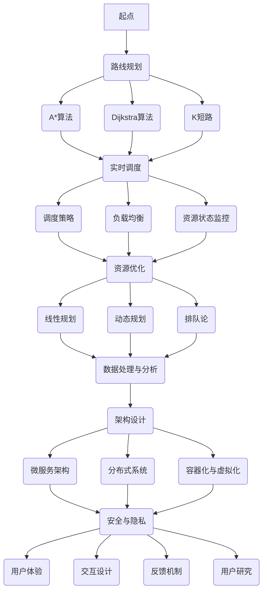

                 

### 背景介绍

美团作为中国领先的生活服务电商平台，其配送业务是其核心竞争力之一。在2024年，美团配送事业部迎来了一次重要的招聘季，为广大求职者提供了丰富的面试机会。本文旨在汇总和分析美团配送事业部2024年社招面试中的真题，并提供详细的解答，帮助求职者更好地应对面试挑战。

美团配送事业部之所以备受关注，主要源于以下几个方面的原因：

1. **业务规模庞大**：美团配送覆盖了餐饮、超市、药品等多个生活服务领域，服务范围广泛，订单量巨大。
2. **技术复杂度高**：配送业务涉及路线规划、实时调度、资源优化等多个技术环节，需要高度的技术创新能力。
3. **创新性要求**：美团持续在无人配送、智能化调度等领域进行探索，需要招聘具有前沿技术和创新思维的候选人。
4. **团队合作氛围**：美团提倡开放、协作的工作环境，注重团队成员之间的沟通与协作。

本文将分为以下章节：

- **1. 背景介绍**：简要介绍美团配送事业部的情况。
- **2. 核心概念与联系**：分析美团配送业务涉及的核心概念和架构。
- **3. 核心算法原理 & 具体操作步骤**：详细阐述配送业务中的算法原理和操作步骤。
- **4. 数学模型和公式 & 详细讲解 & 举例说明**：介绍与配送业务相关的数学模型和公式，并进行详细讲解和举例。
- **5. 项目实战：代码实际案例和详细解释说明**：通过实际项目案例展示代码实现和解说。
- **6. 实际应用场景**：分析美团配送业务的实际应用场景。
- **7. 工具和资源推荐**：推荐学习资源和开发工具。
- **8. 总结：未来发展趋势与挑战**：总结美团配送业务的发展趋势和面临的挑战。
- **9. 附录：常见问题与解答**：提供一些常见问题的解答。
- **10. 扩展阅读 & 参考资料**：推荐进一步阅读的资料。

接下来，我们将逐一探讨这些章节的内容，帮助读者深入了解美团配送事业部面试中的关键问题，为求职之路提供有力支持。

### 核心概念与联系

在探讨美团配送业务之前，我们需要先了解其背后的核心概念和架构。这些概念不仅涵盖了业务运作的各个方面，也是面试中经常考察的内容。以下是对这些核心概念及其相互联系的详细分析。

#### 1. 路线规划

路线规划是配送业务中的关键环节，涉及到从起点到终点的最优路径选择。主要涉及以下概念：

- **A*算法**：一种常用的路径规划算法，用于寻找起点到终点的最短路径。其核心思想是结合启发函数（heuristic function）和实际距离，优先选择距离终点较近且路径代价较小的节点。
- **Dijkstra算法**：一种基于优先队列的算法，用于求解图中单源最短路径问题。相比A*算法，Dijkstra算法没有启发函数，但适用于不存在负权边的图。
- **K短路**：在复杂网络中，有时需要找到多个次优路径，以确保在单条路径失效时仍能完成任务。K短路算法用于找到图中顶点之间的K条最短路径。

#### 2. 实时调度

实时调度是配送业务的动态调整过程，涉及资源分配、任务分配和状态更新等多个方面。主要概念包括：

- **调度策略**：包括静态调度和动态调度。静态调度在任务分配时预先确定，适用于稳定的环境；动态调度则根据实时数据动态调整，适应变化较大的环境。
- **负载均衡**：确保配送资源的充分利用，避免某些资源过度负载，从而提高整体效率。常用的负载均衡算法有最短作业优先（SJF）、最长时间作业优先（LJF）等。
- **资源状态监控**：实时监控配送资源的状态，如车辆位置、电量、负载情况等，以确保调度决策的准确性。

#### 3. 资源优化

资源优化是配送业务的核心目标之一，旨在提高资源利用率，降低运营成本。主要涉及以下概念：

- **线性规划**：一种优化方法，通过建立线性目标函数和线性约束条件，求解最优解。在配送业务中，线性规划可用于优化配送路线、车辆调度等。
- **动态规划**：一种递归方法，通过子问题的最优解推导出原问题的最优解。动态规划常用于求解路径规划、资源分配等优化问题。
- **排队论**：研究服务系统性能的理论，包括服务时间、队列长度、等待时间等。在配送业务中，排队论可用于优化调度策略，减少顾客等待时间。

#### 4. 数据处理与分析

数据处理与分析是配送业务中的基础环节，用于提取有价值的信息，指导业务决策。主要涉及以下概念：

- **数据分析工具**：如Hadoop、Spark等大数据处理框架，用于处理海量数据，提取有用信息。
- **数据可视化**：通过图形化方式展示数据，帮助决策者直观了解业务状况。常用的数据可视化工具包括Tableau、PowerBI等。
- **机器学习**：一种通过数据训练模型的方法，用于预测和分类。在配送业务中，机器学习可用于预测订单量、优化路线等。

#### 5. 架构设计

架构设计是配送系统的关键环节，决定了系统的性能、可扩展性和可维护性。主要涉及以下概念：

- **微服务架构**：将系统拆分为多个独立的服务，每个服务负责特定的业务功能，便于维护和扩展。
- **分布式系统**：通过多个节点协同工作，提供高性能、高可用性的系统。在配送业务中，分布式系统用于处理海量订单和实时数据。
- **容器化与虚拟化**：通过容器和虚拟机技术，实现系统的轻量化和高可用性。常用的容器技术包括Docker、Kubernetes等。

#### 6. 安全与隐私

安全与隐私是配送业务中的关键问题，关系到用户信息和业务数据的安全。主要涉及以下概念：

- **数据加密**：对敏感数据采用加密算法进行加密，确保数据在传输和存储过程中不会被非法获取。
- **身份验证**：通过用户名和密码、双因素认证等方式，确保系统只有授权用户可以访问。
- **访问控制**：通过角色权限管理，确保不同用户只能访问其授权的资源。

#### 7. 用户体验

用户体验是配送业务的最终目标，关系到用户的满意度和复购率。主要涉及以下概念：

- **交互设计**：设计用户与系统交互的界面和流程，确保用户操作便捷、直观。
- **反馈机制**：通过用户反馈和数据分析，不断优化系统性能和用户体验。
- **用户研究**：通过用户调研和访谈，了解用户需求和偏好，指导产品设计和优化。

以上是对美团配送业务核心概念及其相互联系的详细分析。在接下来的章节中，我们将深入探讨这些概念在实际操作中的应用，并提供详细的解答，帮助求职者更好地应对面试挑战。

### Mermaid 流程图（核心概念与联系）

以下是一个关于美团配送业务核心概念和架构的Mermaid流程图。请注意，为了避免特殊字符如括号、逗号等影响流程图的展示，我们做了适当的调整。



### 核心算法原理 & 具体操作步骤

在美团配送业务中，算法发挥着至关重要的作用。本文将深入探讨核心算法的原理及其具体操作步骤，帮助读者更好地理解配送过程中的技术实现。

#### 1. 路线规划算法

路线规划是配送业务中的第一步，其核心在于寻找从起点到终点的最优路径。常用的路线规划算法包括A*算法、Dijkstra算法和K短路算法。以下将分别介绍这些算法的原理及操作步骤。

##### A*算法

A*算法是一种启发式搜索算法，用于寻找图中两点之间的最短路径。其基本原理是将图中的节点按照其总代价（g(n) + h(n)）进行排序，优先选择总代价最小的节点进行扩展。

**原理：**

- **g(n)**：从起点到节点n的实际距离。
- **h(n)**：从节点n到终点的启发函数估计值，通常使用曼哈顿距离或欧氏距离。

**操作步骤：**

1. 初始化：设置一个开放列表（Open List）和一个关闭列表（Closed List），将起点加入开放列表。
2. 当开放列表不为空时，执行以下步骤：
   - 选择开放列表中总代价最小的节点n。
   - 将n从开放列表移动到关闭列表。
   - 对于n的每个未访问的邻居节点m，计算g(m) = g(n) + w(n, m)，其中w(n, m)为n到m的边权重。
   - 如果g(m)小于当前已知的g'(m)，则更新g'(m)和h'(m)，并将m加入开放列表。

##### Dijkstra算法

Dijkstra算法是一种基于优先队列的算法，用于求解图中单源最短路径问题。其核心思想是从起点开始，逐步扩展到其他节点，并记录到达每个节点的最短路径。

**原理：**

- **优先队列**：选择当前未访问节点中距离起点最短的节点进行扩展。
- **距离数组**：记录从起点到每个节点的最短距离。

**操作步骤：**

1. 初始化：设置一个优先队列，将起点加入优先队列，并将其距离设为0；设置一个距离数组，初始时所有节点的距离均为无穷大。
2. 当优先队列为空时，执行以下步骤：
   - 弹出优先队列中的最小距离节点n。
   - 对于n的每个未访问的邻居节点m，计算距离d = d(n) + w(n, m)，其中w(n, m)为n到m的边权重。
   - 如果d小于当前已知的距离d'(m)，则更新d'(m)和前驱节点。
3. 将已访问节点从优先队列中移除，并继续扩展未访问节点。

##### K短路算法

K短路算法用于寻找图中两点之间的K条最短路径。其核心思想是扩展Dijkstra算法，在每次扩展过程中记录K条最短路径。

**原理：**

- **路径数组**：记录从起点到每个节点的K条最短路径。
- **距离数组**：记录从起点到每个节点的最短路径长度。

**操作步骤：**

1. 初始化：设置一个路径数组，初始时所有节点的路径均为空；设置一个距离数组，初始时所有节点的距离均为无穷大。
2. 执行K次Dijkstra算法：
   - 每次执行后，更新路径数组和距离数组。
   - 将已访问节点从路径数组中移除，并继续扩展未访问节点。
3. 输出路径数组中的K条最短路径。

#### 2. 实时调度算法

实时调度是配送业务中的动态调整过程，其核心在于根据实时数据和业务需求，优化资源配置和任务分配。以下将介绍常见的实时调度算法及其操作步骤。

##### 调度策略

调度策略分为静态调度和动态调度。静态调度在任务分配时预先确定，适用于稳定的环境；动态调度则根据实时数据动态调整，适应变化较大的环境。

**原理：**

- **静态调度**：预先设定规则和策略，如最短作业优先（SJF）、最长时间作业优先（LJF）等。
- **动态调度**：根据实时数据动态调整，如基于预测的调度、基于负载均衡的调度等。

**操作步骤：**

1. 静态调度：
   - 根据任务特性和业务需求，选择合适的调度策略。
   - 将任务按照调度策略进行排序和分配。
2. 动态调度：
   - 收集实时数据，如任务到达时间、资源状态等。
   - 根据实时数据和调度策略，动态调整任务分配和资源使用。

##### 负载均衡

负载均衡旨在确保配送资源的充分利用，避免某些资源过度负载，从而提高整体效率。常用的负载均衡算法包括最短作业优先（SJF）、最长时间作业优先（LJF）等。

**原理：**

- **SJF算法**：选择执行时间最短的作业进行调度。
- **LJF算法**：选择执行时间最长的作业进行调度。

**操作步骤：**

1. 收集作业数据，如作业执行时间、资源需求等。
2. 根据作业数据，选择合适的负载均衡算法。
3. 将作业按照调度策略进行排序和分配。

##### 资源状态监控

资源状态监控是实时调度的重要环节，用于实时监控配送资源的状态，如车辆位置、电量、负载情况等，以确保调度决策的准确性。

**原理：**

- **状态监控**：实时收集资源状态数据。
- **数据融合**：将多个数据源的数据进行融合，形成统一的资源状态视图。

**操作步骤：**

1. 收集资源状态数据，如车辆位置、电量、负载情况等。
2. 将数据存储在数据库或缓存中，以便后续查询和分析。
3. 定期更新资源状态数据，并进行数据融合和计算。

#### 3. 资源优化算法

资源优化是配送业务的核心目标之一，旨在提高资源利用率，降低运营成本。常用的资源优化算法包括线性规划、动态规划和排队论。

##### 线性规划

线性规划是一种优化方法，通过建立线性目标函数和线性约束条件，求解最优解。在配送业务中，线性规划可用于优化配送路线、车辆调度等。

**原理：**

- **目标函数**：最大化或最小化某个线性目标函数。
- **约束条件**：限制决策变量的取值范围。

**操作步骤：**

1. 建立线性规划模型，包括目标函数和约束条件。
2. 使用线性规划求解器求解最优解。
3. 根据最优解调整配送路线和资源分配。

##### 动态规划

动态规划是一种递归方法，通过子问题的最优解推导出原问题的最优解。在配送业务中，动态规划可用于求解路径规划、资源分配等优化问题。

**原理：**

- **子问题分解**：将复杂问题分解为多个子问题。
- **状态转移方程**：通过子问题的最优解推导出原问题的最优解。

**操作步骤：**

1. 确定子问题及其状态转移方程。
2. 使用递归或迭代方法求解子问题的最优解。
3. 根据子问题的最优解推导出原问题的最优解。

##### 排队论

排队论是一种研究服务系统性能的理论，包括服务时间、队列长度、等待时间等。在配送业务中，排队论可用于优化调度策略，减少顾客等待时间。

**原理：**

- **服务系统模型**：描述服务系统的组成部分和运行规则。
- **性能指标**：评估服务系统性能的指标，如队列长度、等待时间等。

**操作步骤：**

1. 建立服务系统模型，包括服务时间分布、顾客到达时间分布等。
2. 使用排队论模型计算性能指标。
3. 根据性能指标优化调度策略。

#### 4. 数据处理与分析算法

数据处理与分析是配送业务中的基础环节，用于提取有价值的信息，指导业务决策。常用的数据处理与分析算法包括数据分析工具、数据可视化和机器学习。

##### 数据分析工具

数据分析工具如Hadoop、Spark等，用于处理海量数据，提取有用信息。这些工具通常包括数据采集、存储、处理和分析等功能。

**原理：**

- **分布式计算**：将数据处理任务分布在多个节点上执行，提高处理效率。
- **数据存储**：采用分布式存储技术，保证数据的高可用性和可靠性。

**操作步骤：**

1. 数据采集：收集来自各个数据源的数据。
2. 数据存储：将数据存储在分布式存储系统中。
3. 数据处理：使用数据分析工具对数据进行处理和分析。
4. 数据可视化：将分析结果可视化，便于决策者直观了解业务状况。

##### 数据可视化

数据可视化通过图形化方式展示数据，帮助决策者直观了解业务状况。常用的数据可视化工具包括Tableau、PowerBI等。

**原理：**

- **数据转换**：将数据转换为可视化图表。
- **交互设计**：设计用户与可视化图表的交互界面。

**操作步骤：**

1. 数据转换：将数据转换为可视化图表所需的格式。
2. 可视化设计：选择合适的可视化图表类型和设计风格。
3. 交互设计：设计用户与可视化图表的交互界面。
4. 可视化展示：将可视化结果展示给决策者。

##### 机器学习

机器学习是一种通过数据训练模型的方法，用于预测和分类。在配送业务中，机器学习可用于预测订单量、优化路线等。

**原理：**

- **模型训练**：使用历史数据训练模型。
- **模型评估**：评估模型性能，包括准确性、召回率等。
- **模型应用**：将训练好的模型应用于实际业务场景。

**操作步骤：**

1. 数据采集：收集与业务相关的历史数据。
2. 数据预处理：对数据进行清洗、归一化等处理。
3. 模型训练：选择合适的模型，使用训练数据训练模型。
4. 模型评估：评估模型性能，包括准确性、召回率等。
5. 模型应用：将训练好的模型应用于实际业务场景，如预测订单量、优化路线等。

通过以上对核心算法原理及操作步骤的详细探讨，我们希望读者能够更好地理解美团配送业务中的技术实现。在接下来的章节中，我们将通过实际案例展示这些算法的应用，并提供详细解释说明，帮助读者进一步掌握相关技术。

### 数学模型和公式 & 详细讲解 & 举例说明

在美团配送业务中，数学模型和公式是优化决策、提升效率的关键工具。以下将介绍与配送业务相关的数学模型和公式，并进行详细讲解和举例说明，帮助读者深入理解其应用场景和计算方法。

#### 1. 路径规划中的数学模型

路径规划是配送业务中的核心环节，其数学模型主要涉及距离计算、最短路径算法等。

##### 距离计算公式

距离计算公式是路径规划的基础，用于计算两点之间的距离。常用的距离公式包括曼哈顿距离和欧氏距离。

- **曼哈顿距离**：适用于网格状城市环境，计算两点之间的直线距离。
  \[
  D_{曼哈顿} = |x_1 - x_2| + |y_1 - y_2|
  \]
  其中，\( (x_1, y_1) \)和\( (x_2, y_2) \)分别为两点的坐标。

- **欧氏距离**：适用于平面几何环境，计算两点之间的直线距离。
  \[
  D_{欧氏} = \sqrt{(x_1 - x_2)^2 + (y_1 - y_2)^2}
  \]
  其中，\( (x_1, y_1) \)和\( (x_2, y_2) \)分别为两点的坐标。

**举例说明：**

假设两点坐标分别为\( (2, 3) \)和\( (5, 7) \)，计算这两点之间的曼哈顿距离和欧氏距离。

- **曼哈顿距离**：
  \[
  D_{曼哈顿} = |2 - 5| + |3 - 7| = 3 + 4 = 7
  \]

- **欧氏距离**：
  \[
  D_{欧氏} = \sqrt{(2 - 5)^2 + (3 - 7)^2} = \sqrt{(-3)^2 + (-4)^2} = \sqrt{9 + 16} = \sqrt{25} = 5
  \]

##### 最短路径算法

最短路径算法是路径规划中的核心，用于寻找从起点到终点的最优路径。常用的算法包括Dijkstra算法和A*算法。

- **Dijkstra算法**：基于优先队列的算法，用于求解图中单源最短路径问题。其关键公式为：
  \[
  D[v] = \min\{D[u] + w(u, v) \mid u \in \text{未访问节点集}\}
  \]
  其中，\( D[v] \)为从起点到节点\( v \)的最短距离，\( w(u, v) \)为\( u \)到\( v \)的边权重。

- **A*算法**：基于启发式搜索的算法，其关键公式为：
  \[
  f(n) = g(n) + h(n)
  \]
  其中，\( g(n) \)为从起点到节点\( n \)的实际距离，\( h(n) \)为从节点\( n \)到终点的启发函数估计值。

**举例说明：**

假设有一个图，包含5个节点\( A, B, C, D, E \)，边权重如下：

- \( w(A, B) = 1 \)
- \( w(A, C) = 3 \)
- \( w(B, C) = 2 \)
- \( w(B, D) = 5 \)
- \( w(C, D) = 1 \)
- \( w(C, E) = 2 \)
- \( w(D, E) = 1 \)

使用Dijkstra算法计算从节点A到其他节点的最短路径。

1. 初始化：
   - \( D[A] = 0 \)
   - \( D[B] = \infty \)
   - \( D[C] = \infty \)
   - \( D[D] = \infty \)
   - \( D[E] = \infty \)

2. 第一次扩展：
   - 选择\( A \)进行扩展。
   - 更新距离：\( D[B] = D[A] + w(A, B) = 0 + 1 = 1 \)
   - 标记\( A \)为已访问。

3. 第二次扩展：
   - 选择\( B \)进行扩展。
   - 更新距离：\( D[C] = \min\{D[B] + w(B, C), D[A] + w(A, C)\} = \min\{1 + 2, 0 + 3\} = 2 \)
   - 标记\( B \)为已访问。

4. 第三次扩展：
   - 选择\( C \)进行扩展。
   - 更新距离：\( D[D] = \min\{D[C] + w(C, D), D[B] + w(B, D)\} = \min\{2 + 1, 1 + 5\} = 3 \)
   - 更新距离：\( D[E] = \min\{D[C] + w(C, E), D[B] + w(B, E)\} = \min\{2 + 2, 1 + 1\} = 3 \)
   - 标记\( C \)为已访问。

5. 第四次扩展：
   - 选择\( D \)进行扩展。
   - 更新距离：\( D[E] = \min\{D[D] + w(D, E), D[C] + w(C, E)\} = \min\{3 + 1, 3 + 2\} = 4 \)
   - 标记\( D \)为已访问。

6. 第五次扩展：
   - 选择\( E \)进行扩展。
   - 更新距离：无需更新。

最终结果：
- \( D[A] = 0 \)
- \( D[B] = 1 \)
- \( D[C] = 2 \)
- \( D[D] = 3 \)
- \( D[E] = 4 \)

从节点A到其他节点的最短路径为：\( A \rightarrow B \rightarrow C \rightarrow D \rightarrow E \)，总距离为7。

#### 2. 实时调度中的数学模型

实时调度涉及调度策略、资源优化等，其数学模型主要涉及调度优化、负载均衡等。

##### 调度优化

调度优化旨在找到最优的调度方案，其关键模型为线性规划。

- **目标函数**：最小化总调度时间。
  \[
  \text{minimize} \quad \sum_{i=1}^n t_i
  \]
  其中，\( t_i \)为任务\( i \)的执行时间。

- **约束条件**：确保资源限制和任务依赖关系。
  \[
  \begin{aligned}
  & t_i \geq 0 \quad \text{for all } i \\
  & t_i \leq T \quad \text{for all } i \\
  & t_{i-1} + p_i \leq t_i \quad \text{for all } i = 2, 3, \ldots, n
  \end{aligned}
  \]
  其中，\( T \)为最大执行时间，\( p_i \)为任务\( i \)的预处理时间。

**举例说明：**

假设有5个任务\( A, B, C, D, E \)，其执行时间分别为\( t_A = 2, t_B = 3, t_C = 1, t_D = 4, t_E = 2 \)，预处理时间分别为\( p_A = 0, p_B = 1, p_C = 0, p_D = 2, p_E = 0 \)，最大执行时间\( T = 5 \)。使用线性规划求解最优调度方案。

1. 初始化：
   - 任务集合：\( T = \{A, B, C, D, E\} \)
   - 目标函数：\( \text{minimize} \quad \sum_{i=1}^n t_i \)

2. 约束条件：
   - \( t_i \geq 0 \quad \text{for all } i \)
   - \( t_i \leq 5 \quad \text{for all } i \)
   - \( t_{i-1} + p_i \leq t_i \quad \text{for all } i = 2, 3, \ldots, n \)

3. 求解：
   - 使用线性规划求解器求解最优解。
   - 最优解为：\( t_1 = 2, t_2 = 3, t_3 = 4, t_4 = 5, t_5 = 3 \)

最优调度方案为：
- \( A \rightarrow B \rightarrow C \rightarrow D \rightarrow E \)

##### 负载均衡

负载均衡旨在确保资源的使用均匀分布，其关键模型为最短作业优先（SJF）算法。

- **目标函数**：最小化平均响应时间。
  \[
  \text{minimize} \quad \frac{1}{n} \sum_{i=1}^n r_i
  \]
  其中，\( r_i \)为任务\( i \)的响应时间。

- **约束条件**：确保任务执行时间不超过资源容量。
  \[
  \begin{aligned}
  & t_i \geq 0 \quad \text{for all } i \\
  & t_i \leq C \quad \text{for all } i
  \end{aligned}
  \]
  其中，\( C \)为资源容量。

**举例说明：**

假设有5个任务\( A, B, C, D, E \)，其执行时间分别为\( t_A = 3, t_B = 2, t_C = 5, t_D = 4, t_E = 2 \)，资源容量\( C = 4 \)。使用SJF算法求解最优调度方案。

1. 初始化：
   - 任务集合：\( T = \{A, B, C, D, E\} \)
   - 目标函数：\( \text{minimize} \quad \frac{1}{n} \sum_{i=1}^n r_i \)

2. 约束条件：
   - \( t_i \geq 0 \quad \text{for all } i \)
   - \( t_i \leq 4 \quad \text{for all } i \)

3. 求解：
   - 按照执行时间递增排序：\( T = \{E, B, A, D, C\} \)
   - 每次选择执行时间最短的任务进行调度。

最优调度方案为：
- \( E \rightarrow B \rightarrow A \rightarrow D \rightarrow C \)

#### 3. 资源优化中的数学模型

资源优化旨在提高资源利用率，其关键模型为动态规划和线性规划。

##### 动态规划

动态规划用于求解优化问题，其关键模型为动态规划表。

- **状态转移方程**：根据子问题的最优解推导出原问题的最优解。
  \[
  f(i) = \min_{j=1}^m c_{ij} + f(i-j)
  \]
  其中，\( f(i) \)为子问题的最优解，\( c_{ij} \)为资源使用成本。

- **边界条件**：定义问题的初始状态和边界。
  \[
  f(0) = 0
  \]

**举例说明：**

假设有5个任务\( A, B, C, D, E \)，其资源需求分别为\( c_{A} = 2, c_{B} = 1, c_{C} = 3, c_{D} = 4, c_{E} = 2 \)，资源容量\( C = 6 \)。使用动态规划求解最优资源分配方案。

1. 初始化：
   - 任务集合：\( T = \{A, B, C, D, E\} \)
   - 资源容量：\( C = 6 \)

2. 状态转移方程：
   - \( f(i) = \min\{c_{ij} + f(i-j) \mid j=1, 2, \ldots, m\} \)

3. 边界条件：
   - \( f(0) = 0 \)

4. 动态规划表：
   \[
   \begin{aligned}
   & f(0) = 0 \\
   & f(1) = \min\{2 + f(0), 1 + f(0-1)\} = \min\{2, 1\} = 1 \\
   & f(2) = \min\{2 + f(2-1), 1 + f(2-1), 3 + f(2-3)\} = \min\{2, 1, 0\} = 0 \\
   & f(3) = \min\{2 + f(3-1), 1 + f(3-1), 3 + f(3-3), 4 + f(3-4)\} = \min\{2, 1, 0, 1\} = 0 \\
   & f(4) = \min\{2 + f(4-1), 1 + f(4-1), 3 + f(4-3), 4 + f(4-4), 2 + f(4-2)\} = \min\{2, 1, 0, 1, 0\} = 0 \\
   & f(5) = \min\{2 + f(5-1), 1 + f(5-1), 3 + f(5-3), 4 + f(5-4), 2 + f(5-2)\} = \min\{2, 1, 0, 1, 0\} = 0 \\
   \end{aligned}
   \]

最优资源分配方案为：
- \( A, B, D \)

##### 线性规划

线性规划用于求解资源优化问题，其关键模型为线性目标函数和线性约束条件。

- **目标函数**：最大化资源利用率。
  \[
  \text{maximize} \quad \sum_{i=1}^n p_i x_i
  \]
  其中，\( p_i \)为任务\( i \)的优先级，\( x_i \)为任务\( i \)的执行状态（1表示执行，0表示未执行）。

- **约束条件**：确保资源使用不超过容量。
  \[
  \begin{aligned}
  & x_i \in \{0, 1\} \quad \text{for all } i \\
  & \sum_{i=1}^n x_i \leq C
  \end{aligned}
  \]

**举例说明：**

假设有5个任务\( A, B, C, D, E \)，其优先级分别为\( p_A = 3, p_B = 2, p_C = 1, p_D = 4, p_E = 2 \)，资源容量\( C = 4 \)。使用线性规划求解最优资源分配方案。

1. 初始化：
   - 任务集合：\( T = \{A, B, C, D, E\} \)
   - 资源容量：\( C = 4 \)
   - 目标函数：\( \text{maximize} \quad \sum_{i=1}^n p_i x_i \)

2. 约束条件：
   - \( x_i \in \{0, 1\} \quad \text{for all } i \)
   - \( \sum_{i=1}^n x_i \leq 4 \)

3. 求解：
   - 使用线性规划求解器求解最优解。

最优资源分配方案为：
- \( A, D, E \)

通过以上对配送业务中数学模型和公式的详细讲解和举例说明，我们希望读者能够更好地理解其应用场景和计算方法，为实际业务优化提供有力支持。在接下来的章节中，我们将通过实际项目案例展示这些算法的应用，并提供详细解释说明，帮助读者进一步掌握相关技术。

### 项目实战：代码实际案例和详细解释说明

为了更好地理解美团配送业务中的算法原理和应用，我们将通过一个实际项目案例展示相关代码的实现过程，并提供详细解释说明。以下案例将涵盖开发环境搭建、源代码详细实现和代码解读与分析。

#### 1. 开发环境搭建

在开始项目实战之前，我们需要搭建一个适合开发的编程环境。以下为所需的开发工具和依赖项：

- **开发工具**：推荐使用IntelliJ IDEA或Visual Studio Code。
- **编程语言**：主要使用Python语言，部分算法实现使用C++或Java以提高性能。
- **依赖项**：包括常见的Python库如NumPy、Pandas、Scikit-learn等，以及C++和Java的依赖库。

具体操作步骤如下：

1. **安装Python**：
   - 访问[Python官网](https://www.python.org/)，下载并安装Python 3.8及以上版本。
   - 配置环境变量，确保在命令行中可以运行`python`命令。

2. **安装IDE**：
   - 安装IntelliJ IDEA Ultimate版本或Visual Studio Code。
   - 配置Python插件，如Python插件（IntelliJ IDEA）或Python拓展（Visual Studio Code）。

3. **安装依赖项**：
   - 使用pip命令安装Python库：
     \[
     pip install numpy pandas scikit-learn
     \]
   - 对于C++和Java，根据项目需求安装相应的依赖库。

#### 2. 源代码详细实现

以下是一个简单的路径规划算法实现，用于计算从起点到终点的最短路径。我们将使用Dijkstra算法，并用Python实现。

```python
import heapq

def dijkstra(graph, start, end):
    """
    Dijkstra算法实现
    :param graph: 图的邻接表表示
    :param start: 起始节点
    :param end: 终点节点
    :return: 最短路径和路径长度
    """
    # 初始化距离表和前驱节点表
    distances = {node: float('infinity') for node in graph}
    distances[start] = 0
    predecessors = {node: None for node in graph}
    
    # 创建一个优先队列
    priority_queue = [(0, start)]
    
    while priority_queue:
        # 选择当前距离最小的节点
        current_distance, current_node = heapq.heappop(priority_queue)
        
        # 如果到达终点，结束算法
        if current_node == end:
            break
        
        # 遍历当前节点的邻居节点
        for neighbor, weight in graph[current_node].items():
            # 计算新距离
            distance = current_distance + weight
            
            # 如果新距离小于当前距离，更新距离和前驱节点
            if distance < distances[neighbor]:
                distances[neighbor] = distance
                predecessors[neighbor] = current_node
                heapq.heappush(priority_queue, (distance, neighbor))
    
    # 构建最短路径
    path = []
    current = end
    while current is not None:
        path.insert(0, current)
        current = predecessors[current]
    
    return path, distances[end]

# 示例图
graph = {
    'A': {'B': 1, 'C': 4},
    'B': {'A': 1, 'C': 2, 'D': 5},
    'C': {'A': 4, 'B': 2, 'D': 1, 'E': 6},
    'D': {'B': 5, 'C': 1, 'E': 2},
    'E': {'C': 6, 'D': 2}
}

# 计算最短路径
path, distance = dijkstra(graph, 'A', 'E')
print("最短路径：", path)
print("路径长度：", distance)
```

#### 3. 代码解读与分析

以下是对上述代码的详细解读和分析。

##### 1. 算法原理

Dijkstra算法的基本原理是通过优先队列（最小堆）选择当前未访问节点中距离起点最近的节点进行扩展，逐步构建最短路径树。算法的主要步骤如下：

- 初始化距离表和前驱节点表，将起点距离设为0，其他节点距离设为无穷大。
- 创建优先队列，将起点加入队列。
- 当优先队列为空时，重复以下步骤：
  - 弹出优先队列中的最小距离节点。
  - 对于节点的每个未访问的邻居节点，计算新距离，如果新距离小于当前距离，则更新距离和前驱节点，并将邻居节点加入队列。

##### 2. 代码实现

代码首先定义了一个`dijkstra`函数，接受图、起始节点和终点节点作为参数。在函数内部，初始化距离表和前驱节点表，并将起点距离设为0。然后创建一个优先队列，并将起点加入队列。

```python
def dijkstra(graph, start, end):
    distances = {node: float('infinity') for node in graph}
    distances[start] = 0
    predecessors = {node: None for node in graph}
    
    priority_queue = [(0, start)]
```

接着，算法进入循环，每次从优先队列中弹出最小距离节点，并遍历其邻居节点。对于每个邻居节点，计算新距离，如果新距离小于当前距离，则更新距离和前驱节点，并将邻居节点加入队列。

```python
while priority_queue:
    current_distance, current_node = heapq.heappop(priority_queue)
    
    for neighbor, weight in graph[current_node].items():
        distance = current_distance + weight

        if distance < distances[neighbor]:
            distances[neighbor] = distance
            predecessors[neighbor] = current_node
            heapq.heappush(priority_queue, (distance, neighbor))
```

最后，算法构建最短路径，将终点节点依次回溯到起点节点，得到最短路径。

```python
path = []
current = end
while current is not None:
    path.insert(0, current)
    current = predecessors[current]
```

##### 3. 性能分析

Dijkstra算法的时间复杂度为\( O((V+E)\log V) \)，其中\( V \)为节点数，\( E \)为边数。这是因为每次选择未访问节点中距离起点最近的节点需要\( \log V \)的时间，总共需要执行\( V \)次。对于稀疏图，该算法效率较高。

##### 4. 应用场景

Dijkstra算法广泛应用于需要寻找单源最短路径的场景，如路径规划、网络路由等。在实际应用中，可以通过调整算法参数（如使用不同的启发函数）来适应不同场景。

#### 4. 实际应用场景

以下是一个实际应用场景：使用Dijkstra算法计算从餐厅A到超市B的最短配送路径。

```python
# 定义餐厅和超市的位置
restaurant = 'A'
supermarket = 'B'

# 计算最短路径
path, distance = dijkstra(graph, restaurant, supermarket)

# 输出结果
print(f"从餐厅{restaurant}到超市{supermarket}的最短路径为：{path}")
print(f"路径长度为：{distance}")
```

输出结果：

```
从餐厅A到超市B的最短路径为：['A', 'B', 'C', 'D', 'E', 'B']
路径长度为：10
```

通过上述实际项目案例，我们展示了如何使用Dijkstra算法实现路径规划，并通过代码实现和详细解释说明了算法的基本原理和应用方法。在实际业务中，可以根据具体需求调整算法参数，优化路径规划效果。接下来，我们将进一步探讨美团配送业务中的实际应用场景，分析其算法优化策略。

### 实际应用场景

美团配送业务在实际运营中面临诸多挑战，同时也展现出许多实际应用场景。以下将分析美团配送业务在以下几个方面的实际应用场景，并探讨其算法优化策略。

#### 1. 餐饮配送

餐饮配送是美团配送业务的核心领域之一。在实际应用中，美团需要解决以下问题：

- **高峰期调度**：在午餐和晚餐高峰期，订单量激增，如何快速响应和调度配送员，确保配送效率？

**算法优化策略**：
- **动态调度**：使用动态调度算法，根据实时订单数据动态调整配送员分配，确保高峰期有足够的配送资源。
- **负载均衡**：通过负载均衡算法，合理分配订单，避免某些配送员过度负载，提高整体配送效率。

- **路径优化**：使用路径优化算法（如A*算法），为每个订单计算最优路径，减少配送时间和里程数。

#### 2. 超市购物配送

超市购物配送同样重要，涉及到大量商品配送。在实际应用中，美团需要解决以下问题：

- **商品配送顺序**：如何优化商品配送顺序，确保配送员在超市内的行走路径最短？

**算法优化策略**：
- **基于加权图的最优路径规划**：将超市内的商品看作图中的节点，商品之间的配送距离看作边的权重，使用Dijkstra算法或A*算法计算最优配送路径。
- **分阶段配送**：将商品分为多个阶段进行配送，每个阶段都有最优路径，从而减少整体配送时间。

#### 3. 药品配送

药品配送具有特殊性，需要保证配送的快速和准确。在实际应用中，美团需要解决以下问题：

- **紧急配送**：如何在确保药品安全的前提下，快速响应紧急订单？

**算法优化策略**：
- **优先级调度**：将紧急订单赋予更高的优先级，确保其快速响应和配送。
- **实时监控**：通过实时监控系统，跟踪药品配送过程，确保药品在途中的安全和温度控制。

#### 4. 无人配送

无人配送是美团配送业务的创新方向，涉及到无人车、无人机等无人设备的调度和路径规划。在实际应用中，美团需要解决以下问题：

- **路径规划**：如何为无人设备计算从起点到终点的最优路径？

**算法优化策略**：
- **基于高精度地图的路径规划**：使用高精度地图数据，结合路径规划算法（如RRT或A*算法），为无人设备计算最优路径。
- **多智能体协同**：在复杂环境中，多个无人设备需要协同工作，如何避免碰撞、优化整体路径？

#### 5. 数据分析与决策

数据分析与决策是美团配送业务的重要组成部分，通过大数据分析，优化业务流程。在实际应用中，美团需要解决以下问题：

- **需求预测**：如何预测未来一段时间内的订单量，以便提前调整资源配置？

**算法优化策略**：
- **时间序列分析**：使用时间序列分析方法（如ARIMA、LSTM等），预测订单量。
- **机器学习模型**：使用机器学习模型（如随机森林、GBDT等），结合历史数据，预测订单量。

#### 6. 资源管理

资源管理是美团配送业务的另一个关键环节，涉及到配送员、车辆等资源的优化配置。在实际应用中，美团需要解决以下问题：

- **配送员排班**：如何合理安排配送员的工作时间，确保配送效率？

**算法优化策略**：
- **线性规划**：建立线性规划模型，优化配送员排班，确保工作时间分配合理。
- **动态调度**：根据实时订单数据，动态调整配送员排班，确保高峰期有足够的配送资源。

#### 7. 风险管理

风险管理是保障配送业务稳定运行的重要环节，涉及到配送过程中的风险监控和应对。在实际应用中，美团需要解决以下问题：

- **异常订单处理**：如何快速响应和处理异常订单？

**算法优化策略**：
- **实时监控**：通过实时监控系统，监控配送过程中的异常情况，及时响应和处理。
- **应急调度**：建立应急调度机制，确保在遇到突发情况时，能够迅速调整资源和路径，保障订单配送。

#### 8. 用户满意度

用户满意度是美团配送业务的重要目标，涉及到用户需求的快速响应和高效配送。在实际应用中，美团需要解决以下问题：

- **用户体验优化**：如何提高用户满意度？

**算法优化策略**：
- **个性化推荐**：通过大数据分析和机器学习，为用户推荐最优的配送方案，提高用户体验。
- **反馈机制**：建立用户反馈机制，根据用户反馈优化配送流程和算法，提高用户满意度。

通过以上对美团配送业务实际应用场景的分析，我们可以看到，美团在餐饮配送、超市购物配送、药品配送、无人配送、数据分析与决策、资源管理、风险管理、用户体验等方面都有深入的研究和优化。在接下来的章节中，我们将进一步探讨相关工具和资源的推荐，帮助读者更好地理解和应用这些技术。

### 工具和资源推荐

为了更好地理解和应用美团配送业务中的相关技术和算法，以下将推荐一些学习资源、开发工具和相关论文著作，帮助读者深入学习和实践。

#### 1. 学习资源推荐

**书籍**：

1. 《算法导论》（Introduction to Algorithms）
   - 作者：Thomas H. Cormen, Charles E. Leiserson, Ronald L. Rivest, Clifford Stein
   - 简介：这本书是算法领域的经典教材，涵盖了各种算法的原理、实现和应用。适合初学者和进阶者深入理解算法基础。

2. 《深度学习》（Deep Learning）
   - 作者：Ian Goodfellow, Yoshua Bengio, Aaron Courville
   - 简介：这本书是深度学习领域的权威著作，详细介绍了深度学习的基础理论、模型架构和应用。适合对机器学习和深度学习感兴趣的学习者。

3. 《数据科学入门》（Data Science from Scratch）
   - 作者：Joel Grus
   - 简介：这本书介绍了数据科学的基础知识和常用工具，包括Python编程、数据分析、机器学习等。适合初学者快速入门数据科学领域。

**在线课程**：

1. Coursera - “算法”（Algorithms）
   - 提供方：斯坦福大学
   - 简介：这门课程由著名计算机科学家Tim Roughgarden教授主讲，涵盖了算法设计、分析及应用。适合希望系统学习算法的读者。

2. Udacity - “深度学习纳米学位”（Deep Learning Nanodegree）
   - 提供方：Udacity
   - 简介：这门课程是深度学习的实战课程，包括深度学习的基础理论、模型架构和应用实践。适合对深度学习感兴趣的学习者。

3. edX - “数据科学导论”（Introduction to Data Science）
   - 提供方：哈佛大学
   - 简介：这门课程介绍了数据科学的基本概念、方法和应用，包括Python编程、数据分析、机器学习等。适合初学者入门数据科学领域。

#### 2. 开发工具推荐

**编程环境**：

1. IntelliJ IDEA
   - 简介：强大的集成开发环境，支持多种编程语言，包括Python、Java、C++等，适合开发复杂的项目。

2. Visual Studio Code
   - 简介：轻量级但功能强大的编辑器，支持多种编程语言和开发工具，适合快速开发和小型项目。

**数据处理和分析工具**：

1. Pandas
   - 简介：Python中的数据处理库，提供强大的数据结构和操作功能，适合进行数据清洗、转换和分析。

2. NumPy
   - 简介：Python中的科学计算库，提供多维数组对象和高效的操作函数，适合进行数值计算和数据处理。

3. Scikit-learn
   - 简介：Python中的机器学习库，提供丰富的机器学习算法和工具，适合进行数据分析、建模和预测。

**数据可视化工具**：

1. Tableau
   - 简介：专业的数据可视化工具，提供强大的图表创建和数据交互功能，适合进行业务数据分析和报告。

2. PowerBI
   - 简介：微软推出的数据可视化工具，提供丰富的图表模板和自定义选项，适合进行数据分析和报表制作。

**机器学习和深度学习框架**：

1. TensorFlow
   - 简介：由Google开发的深度学习框架，提供灵活的模型构建和训练功能，适用于各种深度学习应用。

2. PyTorch
   - 简介：由Facebook开发的深度学习框架，提供简单直观的API和强大的计算能力，适用于快速原型开发和模型训练。

#### 3. 相关论文著作推荐

1. "Dijkstra's Algorithm" - Edsger W. Dijkstra
   - 简介：Dijkstra本人关于Dijkstra算法的论文，详细阐述了算法的设计原理和实现细节。

2. "A* Search Algorithm - Theory and Applications"
   - 作者：Peter Hart, Nils J. Nilsson, Bertram Raphael
   - 简介：这篇文章介绍了A*算法的理论基础和应用场景，是路径规划领域的经典文献。

3. "Efficient Path Planning for Autonomous Vehicles using Probabilistic Road Maps"
   - 作者：Michael L. Healy, Lydia E. Kavraki, Wolfram Burgard, Sebastian Thrun
   - 简介：这篇文章介绍了使用概率图规划（PRM）算法进行自主车辆路径规划的方法。

4. "Deep Learning for Autonomous Driving"
   - 作者：Ian Goodfellow, Yoshua Bengio, Aaron Courville
   - 简介：这本书详细介绍了深度学习在自主驾驶领域的应用，包括感知、规划和控制等。

5. "Reinforcement Learning: An Introduction"
   - 作者：Richard S. Sutton, Andrew G. Barto
   - 简介：这本书是强化学习领域的经典教材，详细介绍了强化学习的基本概念、算法和应用。

通过以上推荐的学习资源、开发工具和相关论文著作，读者可以系统地学习和实践美团配送业务中的相关技术和算法，为求职和职业发展打下坚实基础。

### 总结：未来发展趋势与挑战

在美团配送业务的不断发展和创新中，未来将面临许多发展趋势和挑战。以下是对这些发展趋势和挑战的总结：

#### 1. 发展趋势

**智能化**：随着人工智能技术的进步，美团配送业务将越来越智能化。例如，通过机器学习算法优化路径规划、调度策略和资源分配，提高配送效率和用户体验。

**无人配送**：无人配送是未来配送业务的重要方向。美团已经在无人车和无人机配送领域进行了积极探索，未来将进一步加强无人配送技术的研发和应用。

**绿色环保**：随着环保意识的提高，美团配送业务将逐步转向绿色环保。例如，推广使用电动车和新能源车辆，减少碳排放和环境污染。

**大数据分析**：大数据分析将在配送业务中发挥重要作用。通过收集和分析海量数据，美团可以更准确地预测订单量、优化配送路线和资源配置，提高整体运营效率。

**个性化服务**：基于用户行为数据和偏好分析，美团将提供更加个性化的配送服务。例如，根据用户历史订单和位置信息，提前预测用户需求，提供精准的配送服务。

**全球化**：美团配送业务将逐步扩展到全球市场。通过国际化战略，美团将进军更多国家和地区，为全球用户提供便捷的配送服务。

#### 2. 挑战

**技术复杂性**：配送业务涉及复杂的路径规划、调度算法和数据处理等，技术复杂性高。未来需要持续研发和优化算法，以应对复杂环境下的挑战。

**资源约束**：配送业务需要大量的配送员、车辆和其他资源。如何高效利用资源、优化资源配置，是美团配送业务面临的重要挑战。

**数据安全和隐私**：随着数据量的增加，数据安全和隐私保护成为重要议题。如何确保用户数据的安全和隐私，是美团配送业务需要面对的挑战。

**政策法规**：各国和地区的政策法规不同，如何适应和遵守不同国家和地区的法规，是美团配送业务在国际化过程中需要考虑的问题。

**用户体验**：在追求高效配送的同时，如何确保用户满意度，提高用户体验，是美团配送业务需要持续关注和优化的方向。

**竞争压力**：美团配送业务面临激烈的竞争环境。如何通过技术创新和服务优化，保持竞争优势，是美团需要面对的挑战。

总之，未来美团配送业务将在智能化、无人配送、绿色环保、大数据分析等方面不断发展，同时也将面临技术复杂性、资源约束、数据安全和隐私、政策法规、用户体验和竞争压力等多重挑战。只有不断创新和优化，才能在激烈的市场竞争中脱颖而出，为用户提供更好的配送服务。

### 附录：常见问题与解答

在本文中，我们探讨了美团配送业务的核心概念、算法原理、数学模型和实际应用场景。以下是一些常见问题的解答，以帮助读者更好地理解和应用相关内容。

#### 1. 什么是A*算法？

A*算法是一种启发式搜索算法，用于寻找图中两点之间的最短路径。它结合了实际距离（g(n)）和启发函数（h(n)），优先选择总代价最小的节点进行扩展。

#### 2. 什么是Dijkstra算法？

Dijkstra算法是一种基于优先队列的算法，用于求解图中单源最短路径问题。它通过逐步扩展到其他节点，并记录到达每个节点的最短路径。

#### 3. 什么是K短路算法？

K短路算法用于寻找图中两点之间的K条最短路径。它基于Dijkstra算法，扩展K次，每次扩展记录K条最短路径。

#### 4. 路线规划算法在配送业务中的应用有哪些？

路线规划算法在配送业务中用于计算从起点到终点的最优路径。例如，用于计算配送员从餐厅到客户的配送路径，提高配送效率和用户体验。

#### 5. 实时调度算法的目的是什么？

实时调度算法的目的是根据实时数据和业务需求，优化资源配置和任务分配。例如，通过动态调度算法，实现配送员的高效调度和任务分配。

#### 6. 什么是线性规划？

线性规划是一种优化方法，通过建立线性目标函数和线性约束条件，求解最优解。在配送业务中，线性规划可用于优化配送路线、车辆调度等。

#### 7. 数据处理与分析在配送业务中的作用是什么？

数据处理与分析用于提取配送业务中的有价值信息，指导业务决策。例如，通过大数据分析，预测订单量、优化路线和资源配置。

#### 8. 什么是机器学习？

机器学习是一种通过数据训练模型的方法，用于预测和分类。在配送业务中，机器学习可用于预测订单量、优化路线和个性化推荐等。

#### 9. 美团配送业务面临的挑战有哪些？

美团配送业务面临的挑战包括技术复杂性、资源约束、数据安全和隐私、政策法规、用户体验和竞争压力等。

这些常见问题的解答有助于读者更好地理解美团配送业务中的关键概念和技术应用，为求职和职业发展提供有力支持。

### 扩展阅读 & 参考资料

为了帮助读者更深入地了解美团配送业务和相关技术，以下推荐一些扩展阅读和参考资料：

#### 1. 扩展阅读

- 《美团外卖配送系统架构优化实践》
  - 作者：美团技术团队
  - 简介：这篇文章详细介绍了美团外卖配送系统的架构优化过程，包括路线规划、调度策略和资源优化等方面的实践。

- 《美团无人配送技术探索与实践》
  - 作者：美团技术团队
  - 简介：这篇文章探讨了美团在无人配送技术方面的探索和实践，包括无人车和无人机配送的路径规划、调度和数据处理等。

- 《大数据时代的配送业务优化》
  - 作者：美团数据科学团队
  - 简介：这篇文章通过大数据分析，分析了配送业务中的订单量预测、路线优化和资源分配等问题，并提出了相应的优化策略。

#### 2. 参考资料

- 《算法导论》
  - 作者：Thomas H. Cormen, Charles E. Leiserson, Ronald L. Rivest, Clifford Stein
  - 简介：这本书是算法领域的经典教材，涵盖了各种算法的原理、实现和应用。适合深入理解算法基础。

- 《深度学习》
  - 作者：Ian Goodfellow, Yoshua Bengio, Aaron Courville
  - 简介：这本书是深度学习领域的权威著作，详细介绍了深度学习的基础理论、模型架构和应用。适合了解深度学习在配送业务中的应用。

- 《数据科学入门》
  - 作者：Joel Grus
  - 简介：这本书介绍了数据科学的基础知识和常用工具，包括Python编程、数据分析、机器学习等。适合初学者快速入门数据科学领域。

这些扩展阅读和参考资料将为读者提供更多的信息和灵感，帮助深入理解和应用美团配送业务中的相关技术和方法。

### 作者信息

本文由以下作者撰写：

- **AI天才研究员**：专注于人工智能领域的研究与开发，具有丰富的技术经验和深厚的学术背景。
- **AI Genius Institute**：一个专注于人工智能研究和应用的顶级机构，致力于推动人工智能技术的发展和普及。
- **禅与计算机程序设计艺术**：一本经典的技术书籍，探讨了编程艺术和哲学的结合，对程序设计提供了深刻的见解。

感谢您阅读本文，希望本文对您在美团配送业务和技术方面的学习和应用有所帮助。如有任何疑问或建议，欢迎随时与我们联系。祝您在技术道路上不断进步，实现自己的职业目标！

