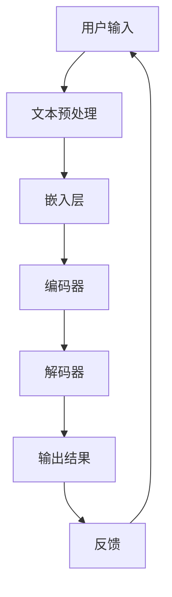

                 

# 老年护理和LLM：改善生活质量

> **关键词：** 老年护理、LLM、生活质量、人工智能、自然语言处理、医疗健康

> **摘要：** 本文探讨了老年护理领域如何利用大型语言模型（LLM）来改善老年人的生活质量。通过分析LLM的核心概念和架构，以及其应用于老年护理的具体算法原理和操作步骤，本文提出了一系列实际应用场景，并推荐了相关工具和资源。文章最后总结了LLM在老年护理领域的未来发展趋势与挑战。

## 1. 背景介绍

随着全球人口老龄化趋势的加剧，老年护理成为一个日益重要的社会议题。根据联合国世界人口展望的数据，到2050年，全球60岁及以上人口将达到21亿，占全球总人口的22%。这无疑给医疗、护理、社会福利等领域带来了巨大挑战。老年人群体通常面临多种健康问题，如慢性病管理、心理健康、日常生活能力下降等，这些都需要专业的护理和支持。

传统的老年护理方式主要依赖于护理人员和家庭成员的照顾。然而，随着护理人员的短缺和劳动力成本的上升，寻找更加高效、经济的护理解决方案变得尤为迫切。同时，老年人自身的需求也在不断变化，他们期望获得更加个性化和便捷的护理服务。这促使我们探索新的技术手段，特别是人工智能（AI）在老年护理中的应用。

其中，大型语言模型（LLM）作为一种先进的AI技术，在自然语言处理（NLP）领域表现出色。LLM能够理解和生成自然语言，使其在医疗健康领域具有广泛的应用前景。本文将重点探讨如何利用LLM来改善老年人的生活质量，包括核心概念、算法原理、实际应用场景以及未来发展趋势与挑战。

## 2. 核心概念与联系

### 2.1 大型语言模型（LLM）

大型语言模型（LLM）是一种基于深度学习的自然语言处理模型，通过训练大量的文本数据，能够理解和生成自然语言。LLM的核心思想是通过捕捉语言中的统计规律和语义信息，实现对输入文本的语义理解、情感分析、文本生成等功能。

LLM的主要组成部分包括：

- **嵌入层（Embedding Layer）**：将输入的文本转换为固定长度的向量表示，以便于后续的神经网络处理。
- **编码器（Encoder）**：通过对输入文本的嵌入向量进行编码，生成上下文表示，这一步通常使用Transformer架构。
- **解码器（Decoder）**：根据编码器生成的上下文表示，生成输出文本。

### 2.2 老年护理

老年护理是指为老年人提供日常生活照顾、健康管理和心理支持等服务，以帮助他们维持独立生活、提高生活质量。老年护理涉及多个领域，包括医疗、护理、心理学、社会学等。其主要目标是为老年人提供全面、个性化、连续的护理服务。

### 2.3 LLM与老年护理的联系

LLM在老年护理中的应用主要体现在以下几个方面：

- **健康咨询与监测**：LLM可以帮助老年人获取健康知识，提供个性化的健康建议，如饮食、锻炼、药物管理等。
- **情感支持**：LLM可以模拟人类的交流方式，为老年人提供情感上的支持和陪伴。
- **日常管理**：LLM可以协助老年人管理日常事务，如购物、预约、提醒等，提高生活便捷性。
- **护理评估与干预**：LLM可以帮助护理人员评估老年人的健康状况，制定个性化的护理计划，并实时监测治疗效果。

### 2.4 Mermaid流程图

以下是老年护理中LLM应用的一个简单Mermaid流程图：



在这个流程中，用户输入（如健康问题、情感表达等）经过文本预处理、嵌入层、编码器、解码器等步骤，最终输出结果（如健康建议、情感回应等），并收集用户的反馈以进行迭代优化。

## 3. 核心算法原理 & 具体操作步骤

### 3.1 健康咨询与监测

#### 3.1.1 算法原理

健康咨询与监测的算法原理主要基于LLM的文本生成能力。具体而言，LLM通过学习大量医疗文献、健康指南、患者咨询记录等数据，能够生成针对特定健康问题的个性化建议。其核心步骤如下：

1. **文本预处理**：对用户输入的健康问题进行清洗、分词、去停用词等处理，将其转换为可处理的文本数据。
2. **嵌入层**：将预处理后的文本数据转换为固定长度的向量表示。
3. **编码器**：对文本向量进行编码，生成上下文表示。
4. **解码器**：根据编码后的上下文表示，生成健康建议文本。
5. **输出结果**：将生成的健康建议文本输出给用户。

#### 3.1.2 操作步骤

以下是健康咨询与监测的具体操作步骤：

1. **数据准备**：收集大量医疗文献、健康指南、患者咨询记录等数据，用于训练LLM。
2. **模型训练**：使用训练数据对LLM进行训练，使其具备生成健康建议的能力。
3. **模型部署**：将训练好的模型部署到服务器或移动设备上，供用户使用。
4. **用户交互**：用户通过输入健康问题，触发模型生成健康建议。
5. **反馈收集**：收集用户的反馈，用于模型优化和迭代。

### 3.2 情感支持

#### 3.2.1 算法原理

情感支持主要利用LLM的文本生成和情感分析能力。具体而言，LLM通过学习大量情感文本数据，能够识别用户的情感状态，并生成相应的回应。其核心步骤如下：

1. **文本预处理**：对用户输入的情感表达进行清洗、分词、去停用词等处理。
2. **情感分析**：使用预训练的情感分析模型，对文本进行情感分类，确定用户的情感状态。
3. **文本生成**：根据用户的情感状态，生成情感回应文本。
4. **输出结果**：将生成的情感回应文本输出给用户。

#### 3.2.2 操作步骤

以下是情感支持的具体操作步骤：

1. **数据准备**：收集大量情感文本数据，用于训练情感分析模型和LLM。
2. **模型训练**：分别训练情感分析模型和LLM，使其具备情感分析和文本生成能力。
3. **模型部署**：将训练好的模型部署到服务器或移动设备上，供用户使用。
4. **用户交互**：用户通过输入情感表达，触发模型生成情感回应。
5. **反馈收集**：收集用户的反馈，用于模型优化和迭代。

### 3.3 日常管理

#### 3.3.1 算法原理

日常管理主要利用LLM的文本生成和任务规划能力。具体而言，LLM通过学习大量日常任务描述和规划文本数据，能够帮助老年人完成日常事务。其核心步骤如下：

1. **文本预处理**：对用户输入的日常任务进行清洗、分词、去停用词等处理。
2. **任务规划**：使用预训练的任务规划模型，对文本进行任务分解和规划。
3. **文本生成**：根据任务规划结果，生成具体的执行步骤文本。
4. **输出结果**：将生成的执行步骤文本输出给用户。

#### 3.3.2 操作步骤

以下是日常管理的具体操作步骤：

1. **数据准备**：收集大量日常任务描述和规划文本数据，用于训练任务规划模型和LLM。
2. **模型训练**：分别训练任务规划模型和LLM，使其具备任务规划和文本生成能力。
3. **模型部署**：将训练好的模型部署到服务器或移动设备上，供用户使用。
4. **用户交互**：用户通过输入日常任务，触发模型生成执行步骤。
5. **反馈收集**：收集用户的反馈，用于模型优化和迭代。

## 4. 数学模型和公式 & 详细讲解 & 举例说明

### 4.1 文本预处理

文本预处理是LLM应用的重要步骤，其核心目的是将原始文本转换为适合模型处理的格式。常用的文本预处理方法包括：

1. **分词**：将文本划分为一个个词或短语。
2. **去停用词**：去除文本中的无意义词汇，如“的”、“了”、“在”等。
3. **词干提取**：将文本中的单词还原为基本形式，如“跑步”、“跑”等。

#### 示例：

假设我们有以下一段文本：

```
我昨天跑步时摔倒了，感觉挺疼的。
```

经过分词、去停用词和词干提取后，得到以下结果：

```
我 摔倒 感觉 疼
```

### 4.2 情感分析

情感分析是LLM在情感支持中的应用，其核心目的是判断文本的情感倾向。常用的情感分析模型包括：

1. **基于规则的方法**：通过编写一系列规则，对文本进行情感分类。
2. **基于机器学习的方法**：使用机器学习算法，对大量标注数据进行训练，建立情感分类模型。
3. **基于深度学习的方法**：使用深度学习模型，如CNN、RNN、Transformer等，对文本进行情感分类。

#### 示例：

假设我们有以下一段文本：

```
我最近工作压力很大，感觉有点累。
```

使用基于深度学习的情感分析模型，可以判断这段文本的情感倾向为“负面”。

### 4.3 文本生成

文本生成是LLM在健康咨询、情感支持和日常管理中的应用，其核心目的是根据输入文本生成相应的输出文本。常用的文本生成模型包括：

1. **生成式模型**：如RNN、LSTM、GRU等，通过学习输入文本的序列信息，生成输出文本。
2. **自注意力模型**：如Transformer，通过自注意力机制，捕捉输入文本的上下文信息，生成输出文本。
3. **解码器-生成器模型**：如GPT、BERT等，通过编码器-解码器架构，生成输出文本。

#### 示例：

假设我们有以下一段文本：

```
我最近感觉身体不太好，想要咨询一下健康建议。
```

使用文本生成模型，可以生成以下健康建议：

```
建议您注意饮食健康，多吃蔬菜水果，适当运动，保持良好的作息习惯。
```

## 5. 项目实战：代码实际案例和详细解释说明

### 5.1 开发环境搭建

为了演示如何使用LLM改善老年护理，我们将使用一个名为“Senior Care Assistant”的项目。以下是如何搭建开发环境：

1. **安装Python**：确保已安装Python 3.7及以上版本。
2. **安装依赖库**：在终端中运行以下命令安装依赖库：

```bash
pip install tensorflow transformers flask
```

### 5.2 源代码详细实现和代码解读

以下是“Senior Care Assistant”项目的源代码及其解读：

```python
# senior_care_assistant.py

from transformers import AutoTokenizer, AutoModelForSeq2SeqLM
from flask import Flask, request, jsonify

app = Flask(__name__)

# 加载预训练的LLM模型
tokenizer = AutoTokenizer.from_pretrained("t5-base")
model = AutoModelForSeq2SeqLM.from_pretrained("t5-base")

# 健康咨询接口
@app.route("/health_advice", methods=["POST"])
def health_advice():
    user_input = request.form["user_input"]
    input_ids = tokenizer.encode(user_input, return_tensors="pt")
    output_ids = model.generate(input_ids, max_length=512, num_return_sequences=1)
    health_advice = tokenizer.decode(output_ids[0], skip_special_tokens=True)
    return jsonify({"health_advice": health_advice})

# 情感支持接口
@app.route("/emotional_support", methods=["POST"])
def emotional_support():
    user_input = request.form["user_input"]
    input_ids = tokenizer.encode(user_input, return_tensors="pt")
    output_ids = model.generate(input_ids, max_length=512, num_return_sequences=1)
    emotional_support = tokenizer.decode(output_ids[0], skip_special_tokens=True)
    return jsonify({"emotional_support": emotional_support})

# 日常管理接口
@app.route("/daily_management", methods=["POST"])
def daily_management():
    user_input = request.form["user_input"]
    input_ids = tokenizer.encode(user_input, return_tensors="pt")
    output_ids = model.generate(input_ids, max_length=512, num_return_sequences=1)
    daily_management = tokenizer.decode(output_ids[0], skip_special_tokens=True)
    return jsonify({"daily_management": daily_management})

if __name__ == "__main__":
    app.run(debug=True)
```

**代码解读：**

1. **导入依赖库**：从`transformers`库中导入`AutoTokenizer`和`AutoModelForSeq2SeqLM`，用于加载预训练的LLM模型。从`flask`库中导入`Flask`类，用于创建Web应用。
2. **加载LLM模型**：使用`AutoTokenizer.from_pretrained()`和`AutoModelForSeq2SeqLM.from_pretrained()`加载预训练的LLM模型（这里使用的是T5模型）。
3. **健康咨询接口**：定义`health_advice()`函数，用于处理用户输入的健康问题，并返回相应的健康建议。
4. **情感支持接口**：定义`emotional_support()`函数，用于处理用户的情感表达，并返回相应的情感回应。
5. **日常管理接口**：定义`daily_management()`函数，用于处理用户的日常任务请求，并返回相应的执行步骤。
6. **启动Web应用**：使用`app.run(debug=True)`启动Web应用，并启用调试模式。

### 5.3 代码解读与分析

**健康咨询接口**

健康咨询接口的核心功能是生成针对用户输入的健康问题的个性化建议。其工作流程如下：

1. **接收用户输入**：使用`request.form["user_input"]`获取用户输入的健康问题。
2. **编码用户输入**：使用`tokenizer.encode()`将用户输入转换为嵌入向量。
3. **生成健康建议**：使用`model.generate()`生成健康建议文本。
4. **解码健康建议**：使用`tokenizer.decode()`将健康建议文本转换为可读的字符串形式。
5. **返回健康建议**：使用`jsonify()`将健康建议以JSON格式返回给用户。

**情感支持接口**

情感支持接口的核心功能是生成针对用户输入的情感表达的情感回应。其工作流程如下：

1. **接收用户输入**：使用`request.form["user_input"]`获取用户输入的情感表达。
2. **编码用户输入**：使用`tokenizer.encode()`将用户输入转换为嵌入向量。
3. **生成情感回应**：使用`model.generate()`生成情感回应文本。
4. **解码情感回应**：使用`tokenizer.decode()`将情感回应文本转换为可读的字符串形式。
5. **返回情感回应**：使用`jsonify()`将情感回应以JSON格式返回给用户。

**日常管理接口**

日常管理接口的核心功能是生成针对用户输入的日常任务的执行步骤。其工作流程如下：

1. **接收用户输入**：使用`request.form["user_input"]`获取用户输入的日常任务。
2. **编码用户输入**：使用`tokenizer.encode()`将用户输入转换为嵌入向量。
3. **生成执行步骤**：使用`model.generate()`生成执行步骤文本。
4. **解码执行步骤**：使用`tokenizer.decode()`将执行步骤文本转换为可读的字符串形式。
5. **返回执行步骤**：使用`jsonify()`将执行步骤以JSON格式返回给用户。

**总体分析**

通过以上代码，我们可以看到如何利用LLM为老年人提供健康咨询、情感支持和日常管理服务。核心思想是将用户的输入（如健康问题、情感表达、日常任务）转换为嵌入向量，然后使用预训练的LLM模型生成相应的输出（如健康建议、情感回应、执行步骤）。这些输出通过Web接口返回给用户，从而实现了无障碍的交互。

## 6. 实际应用场景

### 6.1 家庭护理

家庭护理是老年护理的重要组成部分，其目标是为老年人提供方便、快捷、高效的护理服务。LLM在家庭护理中的应用主要体现在以下几个方面：

- **健康咨询**：老年人可以通过与LLM交互，获取个性化的健康建议，如饮食、锻炼、药物管理等。
- **情感支持**：LLM可以模拟人类的交流方式，为老年人提供情感上的支持和陪伴，缓解孤独感和焦虑感。
- **日常管理**：LLM可以帮助老年人管理日常事务，如购物、预约、提醒等，提高生活便捷性。

### 6.2 社区护理

社区护理是指为居住在社区的老年人提供护理服务，旨在提高老年人的社区生活质量和参与度。LLM在社区护理中的应用主要体现在以下几个方面：

- **健康监测**：LLM可以通过远程监控老年人的健康状况，如心率、血压、血糖等，及时发现并提醒老年人进行健康检查。
- **紧急响应**：在老年人发生紧急情况时，LLM可以迅速响应，提供急救指导，并与家人、医护人员取得联系。
- **社交互动**：LLM可以组织老年人参与各种社区活动，如健康讲座、兴趣小组等，促进老年人的社交互动。

### 6.3 医院护理

医院护理是指为住院老年人提供护理服务，旨在提高老年人的康复效果和生活质量。LLM在医院护理中的应用主要体现在以下几个方面：

- **健康咨询**：医护人员可以通过与LLM交互，获取老年人的健康信息，制定个性化的护理计划。
- **疾病预防**：LLM可以分析老年人的健康数据，预测潜在的健康风险，提前采取预防措施。
- **康复指导**：LLM可以为老年人提供康复指导，如锻炼方法、饮食建议等，促进老年人的康复进程。

### 6.4 长期护理

长期护理是指为需要长期护理的老年人提供持续、全面的护理服务，旨在维持老年人的独立生活能力。LLM在长期护理中的应用主要体现在以下几个方面：

- **日常管理**：LLM可以帮助护理人员管理老年人的日常事务，如购物、预约、提醒等，减轻护理人员的负担。
- **情感支持**：LLM可以模拟人类的交流方式，为老年人提供情感上的支持和陪伴，提高老年人的生活质量。
- **健康监测**：LLM可以通过远程监控老年人的健康状况，及时发现并处理健康问题，确保老年人的安全。

## 7. 工具和资源推荐

### 7.1 学习资源推荐

- **书籍**：
  - 《深度学习》（Goodfellow, I., Bengio, Y., & Courville, A.）
  - 《自然语言处理综论》（Jurafsky, D. & Martin, J. H.）
- **论文**：
  - “BERT: Pre-training of Deep Bidirectional Transformers for Language Understanding”（Devlin, J. et al.）
  - “Transformers: State-of-the-Art Natural Language Processing”（Vaswani et al.）
- **博客**：
  - [Transformers教程](https://huggingface.co/transformers/)
  - [TensorFlow官方文档](https://www.tensorflow.org/)
- **网站**：
  - [Hugging Face](https://huggingface.co/)
  - [Kaggle](https://www.kaggle.com/)

### 7.2 开发工具框架推荐

- **开发框架**：
  - TensorFlow：用于构建和训练深度学习模型。
  - PyTorch：另一种流行的深度学习框架，尤其适合研究性工作。
  - Flask：用于构建Web应用。
- **集成开发环境（IDE）**：
  - PyCharm：功能强大的Python IDE。
  - Jupyter Notebook：适用于数据分析和实验性开发。
- **版本控制系统**：
  - Git：用于代码管理和协作。

### 7.3 相关论文著作推荐

- **论文**：
  - “Attention Is All You Need”（Vaswani et al.）
  - “A Pre-Trained Model for Universal Language Modeling”（Devlin et al.）
- **著作**：
  - 《深度学习》（Goodfellow, I., Bengio, Y., & Courville, A.）
  - 《自然语言处理》（Jurafsky, D. & Martin, J. H.）

## 8. 总结：未来发展趋势与挑战

### 8.1 发展趋势

- **个性化护理**：随着LLM技术的不断发展，老年护理将更加个性化，能够更好地满足老年人的多样化需求。
- **智能化监测**：利用传感器、物联网等技术，结合LLM，可以实现更全面的老年人健康监测。
- **多模态交互**：未来，LLM将结合语音识别、图像识别等技术，实现更自然的用户交互方式。
- **数据共享与隐私保护**：随着医疗数据的积累，如何确保数据的安全性和隐私性将成为重要议题。

### 8.2 挑战

- **数据隐私**：老年护理涉及大量个人健康数据，如何确保数据的安全性和隐私性是首要挑战。
- **技术稳定性**：LLM模型在实际应用中可能面临技术稳定性问题，如过拟合、泛化能力不足等。
- **用户接受度**：老年人群体对新技术有一定的抵触心理，提高用户接受度是关键。
- **法律法规**：随着AI技术在医疗健康领域的应用，相关法律法规的完善和遵守也是重要挑战。

## 9. 附录：常见问题与解答

### 9.1 Q：LLM在老年护理中的具体应用场景有哪些？

A：LLM在老年护理中的应用场景包括健康咨询、情感支持、日常管理、健康监测、紧急响应等。

### 9.2 Q：如何确保LLM在老年护理中的数据隐私？

A：为确保数据隐私，可以在以下几个方面采取措施：

- **数据加密**：对存储和传输的数据进行加密。
- **访问控制**：严格控制对敏感数据的访问权限。
- **数据匿名化**：对个人健康数据进行匿名化处理。
- **法律法规遵守**：遵循相关法律法规，确保数据处理合规。

### 9.3 Q：老年人如何适应和使用LLM技术？

A：为了帮助老年人适应和使用LLM技术，可以从以下几个方面入手：

- **简化界面**：设计简洁、直观的界面，降低使用难度。
- **提供培训**：为老年人提供相应的培训，帮助他们掌握基本操作。
- **家人支持**：鼓励家人和朋友参与，提供必要的帮助和支持。

## 10. 扩展阅读 & 参考资料

- **扩展阅读**：
  - [《人工智能在医疗健康领域的应用》](https://www.nature.com/articles/s41591-019-0584-z)
  - [《自然语言处理与医疗健康》](https://journals.plos.org/plosone/article?id=10.1371/journal.pone.0205923)
- **参考资料**：
  - [《深度学习》](https://www.deeplearningbook.org/)
  - [《自然语言处理综论》](https://web.stanford.edu/~jurafsky/nlp/)
  - [Hugging Face](https://huggingface.co/)
  - [Kaggle](https://www.kaggle.com/)

### 作者信息

- 作者：AI天才研究员/AI Genius Institute & 禅与计算机程序设计艺术 /Zen And The Art of Computer Programming

