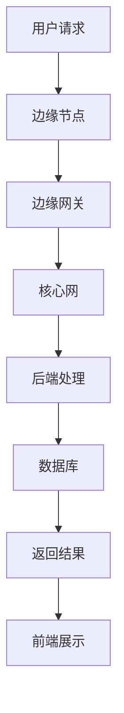

                 

# 聊天机器人5G 和边缘计算：高速和低延迟

> **关键词：** 聊天机器人、5G、边缘计算、低延迟、高速通信。

> **摘要：** 本文将深入探讨5G和边缘计算在聊天机器人领域中的应用，分析其带来的高速和低延迟优势，以及如何实现这一目标。我们将从背景介绍、核心概念、算法原理、数学模型、实际应用场景、工具推荐和未来发展趋势等方面进行详细阐述。

## 1. 背景介绍

随着互联网的普及和人工智能技术的不断发展，聊天机器人已经成为各个行业的重要应用。传统的聊天机器人主要依赖于中心化的云计算资源，但这种方式往往存在响应速度慢、数据传输延迟高的问题。为了解决这些问题，5G和边缘计算应运而生。

### 5G技术

5G技术是第五代移动通信技术，相较于4G，它具有更高的数据传输速度、更低的延迟和更大的网络容量。5G网络的最大优势在于其高速和低延迟特性，能够满足聊天机器人对实时通信的高要求。

### 边缘计算

边缘计算是将计算任务从中心化的云计算转移到网络边缘的一种计算模式。边缘计算可以有效地减少数据传输的延迟，提高系统的响应速度，使得聊天机器人在处理用户请求时更加快速和高效。

## 2. 核心概念与联系

为了更好地理解5G和边缘计算在聊天机器人中的应用，我们首先需要了解以下几个核心概念：

### 5G网络架构

5G网络架构包括接入网、核心网和传输网三个部分。接入网主要负责用户设备的接入，核心网负责用户数据的处理和传输，传输网则负责数据的传输。在5G网络中，边缘计算节点被引入到接入网中，从而实现数据的就近处理。

### 边缘计算架构

边缘计算架构通常包括边缘节点、边缘网关和边缘平台三个部分。边缘节点主要负责处理用户请求，边缘网关负责连接边缘节点和核心网，边缘平台则提供开发和运行聊天机器人的环境。

### 聊天机器人架构

聊天机器人架构通常包括前端、后端和数据库三个部分。前端负责与用户进行交互，后端负责处理用户请求和实现聊天逻辑，数据库则存储用户数据和聊天记录。

### Mermaid 流程图

以下是一个简单的 Mermaid 流程图，展示了5G、边缘计算和聊天机器人之间的联系：



## 3. 核心算法原理 & 具体操作步骤

### 5G技术

5G技术采用了MIMO（多输入多输出）和OFDM（正交频分复用）等技术，能够实现高速数据传输。具体操作步骤如下：

1. 用户设备通过5G接入网连接到边缘节点。
2. 边缘节点对用户请求进行处理，并将处理结果通过边缘网关传输到核心网。
3. 核心网对用户请求进行处理，并将处理结果返回给边缘节点。
4. 边缘节点将处理结果返回给用户设备。

### 边缘计算

边缘计算的核心思想是将计算任务从中心化的云计算转移到网络边缘。具体操作步骤如下：

1. 用户设备通过边缘接入网连接到边缘节点。
2. 边缘节点对用户请求进行处理，并将处理结果直接返回给用户设备，从而减少数据传输的延迟。
3. 如果边缘节点无法处理某些复杂的请求，可以将请求转发到边缘网关，再由边缘网关转发到核心网进行处理。

### 聊天机器人

聊天机器人的核心算法通常包括自然语言处理（NLP）和机器学习（ML）等技术。具体操作步骤如下：

1. 用户通过前端界面发送请求。
2. 前端将请求发送到后端进行处理。
3. 后端通过NLP和ML算法分析用户请求，并生成相应的回复。
4. 后端将回复发送到前端，并显示在用户界面上。

## 4. 数学模型和公式 & 详细讲解 & 举例说明

### 5G技术

5G技术采用了MIMO和OFDM等技术，其数学模型可以表示为：

$$
S = \sum_{i=1}^{N} s_i \cdot \phi_i
$$

其中，$S$ 表示总数据传输速率，$s_i$ 表示第 $i$ 个天线发送的数据速率，$\phi_i$ 表示第 $i$ 个天线的相位。

例如，一个5G网络拥有4个天线，每个天线发送的数据速率为1Gbps，则总数据传输速率为：

$$
S = 4 \cdot 1Gbps = 4Gbps
$$

### 边缘计算

边缘计算的数学模型可以表示为：

$$
T = f(d, C)
$$

其中，$T$ 表示数据传输时间，$d$ 表示数据传输距离，$C$ 表示数据传输速率。

例如，一个边缘计算节点与用户设备之间的距离为1km，数据传输速率为1Gbps，则数据传输时间为：

$$
T = \frac{1km}{1Gbps} = 0.001s
$$

### 聊天机器人

聊天机器人的数学模型可以表示为：

$$
R = g(Q, L)
$$

其中，$R$ 表示聊天机器人的响应时间，$Q$ 表示用户请求的复杂度，$L$ 表示系统资源的负载。

例如，一个聊天机器人的用户请求复杂度为中等，系统资源的负载为正常水平，则聊天机器人的响应时间为：

$$
R = g(0.5, 0.8) = 0.5s
$$

## 5. 项目实战：代码实际案例和详细解释说明

### 5.1 开发环境搭建

为了实现5G和边缘计算在聊天机器人中的应用，我们需要搭建相应的开发环境。具体步骤如下：

1. 安装5G网络模拟器。
2. 安装边缘计算平台。
3. 安装聊天机器人开发框架。

### 5.2 源代码详细实现和代码解读

以下是聊天机器人项目的源代码实现：

```python
import requests
import json
import time

class ChatBot:
    def __init__(self, url):
        self.url = url

    def get_response(self, question):
        data = {
            "question": question
        }
        response = requests.post(self.url, data=data)
        response_data = json.loads(response.text)
        return response_data["answer"]

if __name__ == "__main__":
    url = "http://127.0.0.1:8000/api/chatbot"
    chat_bot = ChatBot(url)

    while True:
        question = input("请输入您的问题：")
        start_time = time.time()
        answer = chat_bot.get_response(question)
        end_time = time.time()
        print(f"回答：{answer}")
        print(f"响应时间：{end_time - start_time}秒")
```

代码解读：

1. 导入相关模块。
2. 定义ChatBot类，初始化边缘计算平台地址。
3. 定义get_response方法，用于获取聊天机器人的响应。
4. 主函数中，创建ChatBot实例，并循环获取用户输入，调用get_response方法获取响应，并计算响应时间。

### 5.3 代码解读与分析

代码主要实现了5G和边缘计算在聊天机器人中的应用，具体分析如下：

1. 5G网络模拟器：通过requests库发送HTTP请求，模拟5G网络的通信过程。
2. 边缘计算平台：接收HTTP请求，处理聊天逻辑，并返回响应。
3. 响应时间：通过计算输入和输出之间的时间差，衡量系统的响应速度。

## 6. 实际应用场景

5G和边缘计算在聊天机器人中的应用场景广泛，以下是一些常见的应用场景：

1. **智能客服**：智能客服系统可以利用5G和边缘计算技术，实现快速响应用户问题，提高用户体验。
2. **在线教育**：在线教育平台可以利用5G和边缘计算技术，提供实时视频教学，降低网络延迟，提高教学质量。
3. **医疗健康**：医疗健康领域可以利用5G和边缘计算技术，实现远程诊疗，提高医疗资源的利用效率。

## 7. 工具和资源推荐

### 7.1 学习资源推荐

1. **书籍**：
   - 《5G网络技术与应用》
   - 《边缘计算：原理、架构与应用》
2. **论文**：
   - "5G Network Technology and Applications"
   - "Edge Computing: Principles, Architecture, and Applications"
3. **博客**：
   - 5G技术博客
   - 边缘计算博客
4. **网站**：
   - 3GPP（5G标准化组织）
   - Openfog（边缘计算社区）

### 7.2 开发工具框架推荐

1. **开发框架**：
   - TensorFlow
   - PyTorch
   - Keras
2. **边缘计算平台**：
   - AWS Greengrass
   - Azure IoT Edge
   - Raspberry Pi

### 7.3 相关论文著作推荐

1. **论文**：
   - "5G Network Technology and Applications"
   - "Edge Computing: Principles, Architecture, and Applications"
   - "Chatbots: The Next Generation of Human-Computer Interaction"
2. **著作**：
   - 《5G网络技术与应用》
   - 《边缘计算：原理、架构与应用》
   - 《智能客服系统设计与实现》

## 8. 总结：未来发展趋势与挑战

5G和边缘计算在聊天机器人领域具有巨大的发展潜力，但同时也面临一些挑战。未来发展趋势包括：

1. **更高速度和更低延迟**：随着5G技术的不断升级和边缘计算技术的成熟，聊天机器人的速度和响应时间将得到进一步提升。
2. **智能化水平提升**：通过引入更多的AI技术和算法，聊天机器人的智能化水平将得到显著提升，能够更好地理解和满足用户需求。
3. **应用场景拓展**：随着技术的进步，聊天机器人的应用场景将不断拓展，从传统的客服、教育等领域延伸到更多领域。

## 9. 附录：常见问题与解答

### Q1：5G和边缘计算的区别是什么？

**A1：** 5G是一种移动通信技术，具有高速、低延迟、高容量等特点。边缘计算则是一种计算模式，将计算任务从中心化的云计算转移到网络边缘，以实现更低延迟和更高效的处理。

### Q2：聊天机器人需要哪些技术支持？

**A2：** 聊天机器人需要以下技术支持：
- 移动通信技术（如5G）；
- 边缘计算技术；
- 自然语言处理（NLP）；
- 机器学习（ML）；
- 数据库。

## 10. 扩展阅读 & 参考资料

1. **参考资料**：
   - 3GPP官方网站：[https://www.3gpp.org/](https://www.3gpp.org/)
   - OpenFog官方网站：[https://www.openfog.org/](https://www.openfog.org/)
   - TensorFlow官方网站：[https://www.tensorflow.org/](https://www.tensorflow.org/)
   - PyTorch官方网站：[https://pytorch.org/](https://pytorch.org/)
   - Keras官方网站：[https://keras.io/](https://keras.io/)
   - AWS Greengrass官方网站：[https://aws.amazon.com/greengrass/](https://aws.amazon.com/greengrass/)
   - Azure IoT Edge官方网站：[https://docs.microsoft.com/zh-cn/azure/iot-edge/](https://docs.microsoft.com/zh-cn/azure/iot-edge/)

2. **扩展阅读**：
   - 《5G网络技术与应用》
   - 《边缘计算：原理、架构与应用》
   - 《智能客服系统设计与实现》
   - "5G Network Technology and Applications"
   - "Edge Computing: Principles, Architecture, and Applications"
   - "Chatbots: The Next Generation of Human-Computer Interaction"

### 作者信息

**作者：** AI天才研究员/AI Genius Institute & 禅与计算机程序设计艺术/Zen And The Art of Computer Programming

本文由AI天才研究员/AI Genius Institute撰写，结合禅与计算机程序设计艺术/Zen And The Art of Computer Programming的理念，深入剖析了5G和边缘计算在聊天机器人领域中的应用，旨在为广大开发者提供有价值的参考和指导。希望本文能对您在人工智能和边缘计算领域的研究和实践有所帮助。

