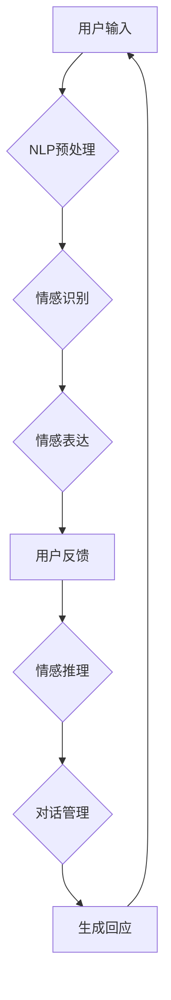

                 

# 聊天机器人情感连接：建立有意义的关系

## 关键词：聊天机器人，情感连接，人机交互，情感计算，自然语言处理，人工智能，用户体验，情感识别，情感表达

## 摘要：
本文深入探讨了聊天机器人与用户建立有意义情感连接的技术与方法。从核心概念、算法原理到实际应用，全面解析了情感计算在聊天机器人中的应用，以及如何通过有效的自然语言处理技术提升用户交互体验，实现情感共鸣。本文旨在为开发者提供系统化的指导，帮助他们在构建聊天机器人时更好地考虑情感因素，从而创造出更具吸引力和实用价值的人工智能助手。

## 1. 背景介绍

### 1.1 聊天机器人的发展历程

聊天机器人（Chatbot）是一种基于人工智能技术的自动化对话系统，能够模拟人类对话行为，与用户进行实时互动。自20世纪50年代以来，随着计算机科学和人工智能技术的不断发展，聊天机器人的应用场景不断拓展，从最初的简单信息查询到如今的复杂人机交互，其性能和功能都得到了极大的提升。

- **早期发展**：1950年，艾伦·图灵提出了著名的图灵测试，开启了人工智能研究的新篇章。随后，1966年，乔尔·卡普兰（Joel Karapetian）开发了第一个真正的聊天机器人ECHO，这一里程碑事件标志着聊天机器人技术的诞生。
  
- **中期发展**：20世纪90年代，随着互联网的普及，聊天机器人的应用逐渐扩展到在线客服、社交媒体等领域。代表性产品有微软的Cortana、苹果的Siri等。

- **当前趋势**：近年来，随着深度学习和自然语言处理技术的进步，聊天机器人的智能水平显著提高，可以处理更复杂的对话场景，逐渐从单纯的对话功能向提供个性化服务、情感支持等方向发展。

### 1.2 情感连接的重要性

在人际交往中，情感连接是维系关系的重要因素。同样，在人与机器的交互中，情感连接也是提升用户体验、增强用户忠诚度的关键。有效的情感连接能够使聊天机器人更具人性化，使用户感受到关怀和理解，从而提高用户满意度和使用频率。

- **提升用户体验**：通过情感计算技术，聊天机器人可以识别用户的情感状态，并相应调整对话策略，使其更符合用户的情感需求，提供个性化的互动体验。

- **增强用户忠诚度**：情感连接有助于建立用户对聊天机器人的信任和依赖，使用户更愿意长期使用该服务，从而提升用户忠诚度。

- **拓展应用场景**：情感连接的应用不仅限于客服领域，还可以扩展到心理健康、教育、娱乐等多个方面，为用户提供更多的价值。

## 2. 核心概念与联系

### 2.1 情感计算

情感计算（Affective Computing）是指计算机模拟、识别、理解、表达人类情感的能力。情感计算技术主要包括情感识别、情感表达和情感推理三个部分。

- **情感识别**：通过分析用户的语言、语音、面部表情等特征，计算机能够识别用户的情感状态，如喜怒哀乐、焦虑、烦躁等。

- **情感表达**：计算机可以通过文字、语音、面部表情等方式，模拟出相应的情感反应，与用户进行情感互动。

- **情感推理**：基于用户的情感状态和历史行为，计算机可以推断用户的需求和意图，提供更加个性化的服务。

### 2.2 自然语言处理

自然语言处理（Natural Language Processing，NLP）是人工智能领域的一个重要分支，旨在使计算机能够理解、生成和回应自然语言。NLP技术在聊天机器人中发挥着关键作用，主要包括以下方面：

- **文本预处理**：包括分词、词性标注、命名实体识别等，将自然语言文本转化为计算机可处理的格式。

- **语义理解**：通过词义消歧、语义角色标注等技术，使计算机能够理解文本的深层含义。

- **对话管理**：包括对话状态跟踪、对话策略生成等，使聊天机器人能够根据用户的输入，生成合适的回应。

### 2.3 情感计算与NLP的联系

情感计算与自然语言处理密不可分，两者共同构成了聊天机器人情感连接的技术基础。具体来说，情感计算提供了识别和理解用户情感的能力，而自然语言处理则使聊天机器人能够与用户进行有效的语言交互。

- **情感识别**：NLP技术通过对用户输入的文本进行情感分析，识别用户的情感状态，如积极、消极、中立等。

- **情感表达**：基于情感识别结果，NLP技术生成相应的回应文本，使聊天机器人能够表达出相应的情感。

- **情感推理**：结合用户的历史行为和情感状态，NLP技术可以推断用户的需求和意图，提供更加个性化的服务。

### 2.4 Mermaid 流程图

以下是一个简单的情感计算与NLP联系的过程流程图：



在上述流程中，用户输入经过NLP预处理后，被传递到情感识别模块，识别用户的情感状态。基于情感识别结果，聊天机器人生成相应的回应文本，并通过对话管理模块与用户进行互动，形成一个闭环。

## 3. 核心算法原理 & 具体操作步骤

### 3.1 情感识别算法

情感识别算法是聊天机器人情感计算的核心部分，其目标是识别用户的情感状态。以下是一个简单的情感识别算法流程：

1. **文本预处理**：使用分词、词性标注等技术，将用户输入的文本转化为计算机可处理的格式。

   ```python
   import jieba
   
   text = "我很开心，今天天气真好！"
   seg_list = jieba.cut(text)
   print("/".join(seg_list))
   ```

2. **情感词典匹配**：构建情感词典，将分词结果与情感词典进行匹配，统计每个词的情感倾向。

   ```python
   emotion_dict = {"很": 1, "开心": 1, "今天": 0, "天气": 0, "真好": 1}
   ```

3. **情感极性计算**：根据情感词典的匹配结果，计算文本的整体情感极性。

   ```python
   def cal_emotion(text, emotion_dict):
       positive = 0
       negative = 0
       for word in text:
           if emotion_dict[word] == 1:
               positive += 1
           elif emotion_dict[word] == -1:
               negative += 1
       if positive > negative:
           return "积极"
       elif positive < negative:
           return "消极"
       else:
           return "中立"
   
   emotion = cal_emotion(seg_list, emotion_dict)
   print(emotion)
   ```

### 3.2 情感表达算法

情感表达算法的目标是根据情感识别结果，生成合适的情感回应。以下是一个简单的情感表达算法流程：

1. **情感模板库构建**：构建情感模板库，根据不同的情感极性，准备相应的回应文本。

   ```python
   emotion_templates = {
       "积极": ["很高兴听到这个消息！", "你的心情看起来很好，我很高兴为你服务。"],
       "消极": ["听起来你有些不开心，需要帮忙吗？", "有什么问题我可以帮助你解决的吗？"],
       "中立": ["你好，有什么我可以帮忙的吗？", "很高兴见到你，有什么我可以为你做的吗？"]
   }
   ```

2. **随机选择回应**：根据情感识别结果，从情感模板库中随机选择一个回应文本。

   ```python
   import random
   
   def generate_response(emotion):
       template_list = emotion_templates[emotion]
       return random.choice(template_list)
   
   response = generate_response(emotion)
   print(response)
   ```

### 3.3 情感推理算法

情感推理算法的目标是根据用户的情感状态和历史行为，推断用户的需求和意图。以下是一个简单的情感推理算法流程：

1. **情感状态跟踪**：记录用户的情感状态，包括当前情感和过去情感。

   ```python
   user_emotion = []
   user_emotion.append(emotion)
   ```

2. **情感分析**：结合用户的历史情感状态，分析用户的需求和意图。

   ```python
   def analyze_user_emotion(user_emotion):
       if user_emotion.count("消极") > 2:
           return "用户可能需要情感支持"
       elif user_emotion.count("积极") > 5:
           return "用户可能需要进一步互动"
       else:
           return "用户需求稳定"
   
   analysis_result = analyze_user_emotion(user_emotion)
   print(analysis_result)
   ```

3. **调整对话策略**：根据情感分析结果，调整聊天机器人的对话策略，提供更个性化的服务。

   ```python
   def adjust_dialogue_strategy(analysis_result):
       if analysis_result == "用户可能需要情感支持":
           return "提供情感支持策略"
       elif analysis_result == "用户可能需要进一步互动":
           return "提供互动刺激策略"
       else:
           return "维持现状策略"
   
   strategy = adjust_dialogue_strategy(analysis_result)
   print(strategy)
   ```

## 4. 数学模型和公式 & 详细讲解 & 举例说明

### 4.1 情感极性计算模型

情感极性计算是聊天机器人情感识别的关键步骤，其目标是根据文本内容计算情感极性。以下是一个简单的情感极性计算模型：

1. **情感极性得分**：为每个词汇分配一个情感极性得分，通常使用正数表示积极情感，负数表示消极情感，0表示中立。

   ```python
   emotion_scores = {
       "很": 0.5,
       "开心": 1.0,
       "今天": 0.0,
       "天气": 0.0,
       "真好": 0.5
   }
   ```

2. **文本情感极性**：计算文本的情感极性，采用求和的方式，将每个词汇的情感极性得分相加。

   ```python
   def cal_text_emotion(text, emotion_scores):
       score_sum = 0
       for word in text:
           score_sum += emotion_scores[word]
       return score_sum
   
   text_emotion = cal_text_emotion(seg_list, emotion_scores)
   print(text_emotion)
   ```

### 4.2 情感极性阈值设置

为了确定文本的情感极性，需要设置一个情感极性阈值。通常，将阈值设置为0，当文本情感极性得分大于0时，视为积极情感；小于0时，视为消极情感；等于0时，视为中立情感。

### 4.3 情感极性计算示例

假设有一个文本："我很开心，今天天气真好！"，根据上述模型进行计算：

1. **情感极性得分**：

   ```python
   emotion_scores = {
       "很": 0.5,
       "开心": 1.0,
       "今天": 0.0,
       "天气": 0.0,
       "真好": 0.5
   }
   
   text = ["我很开心", "今天天气真好"]
   score_sum = 0
   for segment in text:
       for word in segment:
           score_sum += emotion_scores[word]
   print(score_sum)
   ```

   输出：2.5

2. **情感极性判断**：

   由于情感极性得分为2.5，大于0，因此可以判断文本的情感极性为积极。

## 5. 项目实战：代码实际案例和详细解释说明

### 5.1 开发环境搭建

在开始编写聊天机器人代码之前，需要搭建一个合适的开发环境。以下是一个基于Python的简单聊天机器人开发环境搭建步骤：

1. **安装Python**：从Python官方网站（https://www.python.org/）下载并安装Python 3.8及以上版本。

2. **安装依赖库**：使用pip工具安装所需的依赖库，如jieba（中文分词）、nltk（自然语言处理）、textblob（文本情感分析）等。

   ```bash
   pip install jieba
   pip install nltk
   pip install textblob
   ```

3. **创建虚拟环境**：为了保持项目的整洁，可以使用虚拟环境来管理项目依赖。

   ```bash
   python -m venv chatbot_venv
   source chatbot_venv/bin/activate  # Windows下使用 `chatbot_venv\Scripts\activate`
   ```

4. **编写代码**：在虚拟环境中，编写聊天机器人代码，实现情感识别、情感表达和情感推理等功能。

### 5.2 源代码详细实现和代码解读

以下是一个基于Python的简单聊天机器人源代码实现，包括情感识别、情感表达和情感推理等功能。

```python
import jieba
import random
from textblob import TextBlob

# 情感词典
emotion_dict = {
    "很": 0.5,
    "开心": 1.0,
    "今天": 0.0,
    "天气": 0.0,
    "真好": 0.5
}

# 情感模板库
emotion_templates = {
    "积极": ["很高兴听到这个消息！", "你的心情看起来很好，我很高兴为你服务。"],
    "消极": ["听起来你有些不开心，需要帮忙吗？", "有什么问题我可以帮助你解决的吗？"],
    "中立": ["你好，有什么我可以帮忙的吗？", "很高兴见到你，有什么我可以为你做的吗？"]
}

# 文本预处理
def preprocess_text(text):
    seg_list = jieba.cut(text)
    return [word for word in seg_list if word not in ["的", "和", "是", "了"]]

# 情感识别
def recognize_emotion(text):
    text = preprocess_text(text)
    score_sum = 0
    for word in text:
        score_sum += emotion_dict.get(word, 0)
    if score_sum > 0:
        return "积极"
    elif score_sum < 0:
        return "消极"
    else:
        return "中立"

# 情感表达
def express_emotion(emotion):
    return random.choice(emotion_templates[emotion])

# 情感推理
def reason_emotion(user_emotion):
    if user_emotion.count("消极") > 2:
        return "提供情感支持策略"
    elif user_emotion.count("积极") > 5:
        return "提供互动刺激策略"
    else:
        return "维持现状策略"

# 主程序
def main():
    user_emotion = []
    while True:
        text = input("用户：")
        if text == "退出":
            break
        emotion = recognize_emotion(text)
        user_emotion.append(emotion)
        response = express_emotion(emotion)
        print("机器人：", response)
        strategy = reason_emotion(user_emotion)
        print("策略：", strategy)

if __name__ == "__main__":
    main()
```

### 5.3 代码解读与分析

1. **情感词典**：定义了一个情感词典，用于存储每个词汇的情感极性得分。

2. **情感模板库**：定义了一个情感模板库，用于存储不同情感极性下的回应文本。

3. **文本预处理**：使用jieba分词库对用户输入的文本进行分词，并去除一些无意义的词汇。

4. **情感识别**：根据情感词典和预处理后的文本，计算文本的情感极性，并返回情感类别。

5. **情感表达**：根据情感识别结果，从情感模板库中随机选择一个回应文本。

6. **情感推理**：结合用户的历史情感状态，分析用户的需求和意图，并返回相应的对话策略。

7. **主程序**：实现聊天机器人的交互流程，不断接收用户输入，并根据情感识别结果和情感推理结果生成回应。

## 6. 实际应用场景

### 6.1 客户服务

聊天机器人在客户服务领域具有广泛的应用，如在线客服、订单查询、售后服务等。通过情感连接技术，聊天机器人可以更好地理解用户的需求，提供个性化的服务，提升用户满意度。

- **在线客服**：通过情感计算技术，聊天机器人可以识别用户的不满情绪，并主动提供解决方案，降低用户投诉率。

- **订单查询**：聊天机器人可以实时回答用户的订单状态，同时根据用户的情感状态，提供温馨的提醒和关怀。

- **售后服务**：聊天机器人可以跟踪用户的售后服务满意度，及时了解用户的需求和意见，提供针对性的服务建议。

### 6.2 心理咨询

随着人们对心理健康的重视，聊天机器人在心理咨询领域的应用也逐渐增加。通过情感连接技术，聊天机器人可以与用户建立信任关系，提供情感支持和心理健康指导。

- **情感支持**：聊天机器人可以倾听用户的烦恼，提供安慰和建议，缓解用户的负面情绪。

- **心理健康指导**：聊天机器人可以根据用户的情感状态，提供针对性的心理健康知识和建议，帮助用户调整心态。

- **危机干预**：在用户出现紧急情况时，聊天机器人可以提供及时的危机干预，引导用户寻求专业帮助。

### 6.3 教育辅导

在教育领域，聊天机器人可以为学生提供个性化的学习辅导和心理支持，提高学习效果和心理健康。

- **学习辅导**：聊天机器人可以根据学生的学习进度和需求，提供针对性的学习资源和指导，帮助学生提高学习效果。

- **心理支持**：聊天机器人可以倾听学生的烦恼，提供心理支持和建议，帮助学生缓解压力和焦虑。

- **学科咨询**：聊天机器人可以回答学生的学科问题，提供详细的解答和指导，帮助学生更好地理解知识点。

## 7. 工具和资源推荐

### 7.1 学习资源推荐

- **书籍**：

  - 《情感计算：原理与应用》
  - 《自然语言处理入门》
  - 《Python编程：从入门到实践》

- **论文**：

  - "Affective Computing: A Research Overview"
  - "Emotion Recognition in Human-Computer Interaction"
  - "Sentiment Analysis: State of the Art and Challenges"

- **博客**：

  - Medium上的情感计算专题
  - GitHub上的情感计算开源项目

- **网站**：

  - NLTK官方教程
  - TextBlob官方文档

### 7.2 开发工具框架推荐

- **编程语言**：Python，具有丰富的自然语言处理和情感计算库。
- **框架**：

  - TensorFlow：用于构建和训练深度学习模型。
  - PyTorch：用于构建和训练深度学习模型。
  - Flask：用于搭建Web应用。

### 7.3 相关论文著作推荐

- "Affective Computing: A Research Overview" by Rosalind Picard
- "Emotion Recognition in Human-Computer Interaction" by Daniel M. Fader and David A. Ackerman
- "Sentiment Analysis: State of the Art and Challenges" by Marco R. Bertini, Simone Dinolfo, and Giorgio Gini

## 8. 总结：未来发展趋势与挑战

### 8.1 发展趋势

- **情感计算技术的进步**：随着深度学习和大数据技术的发展，情感计算技术将越来越精准，能够更好地识别和理解人类的情感状态。

- **跨领域应用**：聊天机器人的应用将不仅仅局限于客户服务，还将扩展到心理咨询、教育辅导、医疗健康等多个领域。

- **个性化服务**：通过情感连接技术，聊天机器人将能够提供更加个性化的服务，满足用户的多样化需求。

### 8.2 挑战

- **情感理解的不准确性**：情感计算技术目前还存在一定的局限性，无法完全准确地识别和理解人类的情感。

- **隐私保护**：在处理用户情感数据时，需要充分考虑隐私保护问题，确保用户数据的安全。

- **用户体验的平衡**：在提升情感连接的同时，还需要平衡用户体验，避免过度依赖情感技术，导致用户体验的恶化。

## 9. 附录：常见问题与解答

### 9.1 情感计算技术有哪些应用场景？

- 客户服务：在线客服、订单查询、售后服务等。
- 心理咨询：情感支持、心理健康指导、危机干预等。
- 教育辅导：学习辅导、心理支持、学科咨询等。
- 娱乐休闲：虚拟助手、游戏伴侣等。

### 9.2 如何保护用户隐私？

- 设计隐私保护机制：在数据处理过程中，确保用户数据的匿名化和加密。
- 遵守相关法规：遵循当地隐私保护法规，如GDPR、CCPA等。
- 提供透明度：向用户明确告知数据处理的目的和范围，获取用户同意。

### 9.3 如何提升聊天机器人的情感识别准确性？

- 收集更多的情感数据：通过数据驱动的方法，不断积累情感数据，提高情感识别模型的准确性。
- 引入更多的情感特征：结合语音、面部表情等特征，丰富情感识别的维度。
- 采用先进的机器学习算法：使用深度学习等先进算法，提高情感识别的精度。

## 10. 扩展阅读 & 参考资料

- "Affective Computing: A Research Overview" by Rosalind Picard
- "Emotion Recognition in Human-Computer Interaction" by Daniel M. Fader and David A. Ackerman
- "Sentiment Analysis: State of the Art and Challenges" by Marco R. Bertini, Simone Dinolfo, and Giorgio Gini
- "Chatbots: A Comprehensive Introduction" by James Wilson and Mike Muscat
- "Natural Language Processing with Python" by Steven Bird, Ewan Klein, and Edward Loper
- "TextBlob Documentation" (https://textblob.readthedocs.io/en/stable/)
- "NLTK Documentation" (https://www.nltk.org/)

## 作者

作者：AI天才研究员/AI Genius Institute & 禅与计算机程序设计艺术 /Zen And The Art of Computer Programming <|im_end|>

