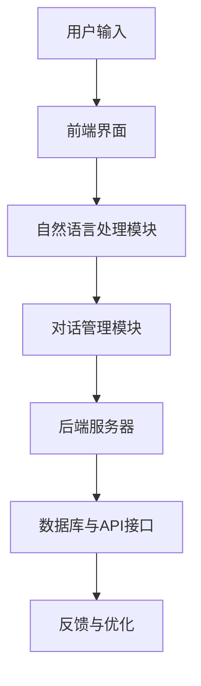
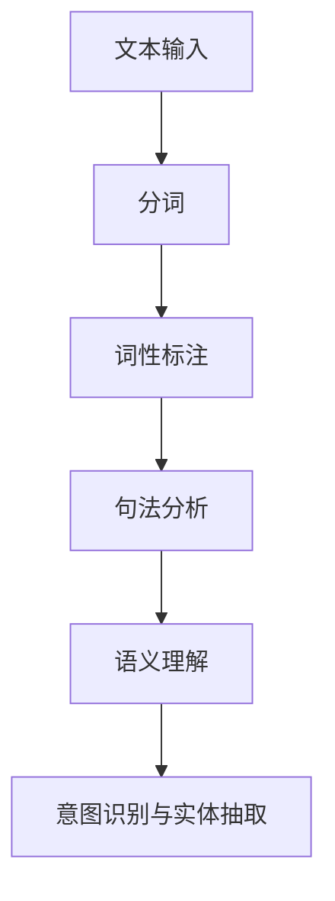
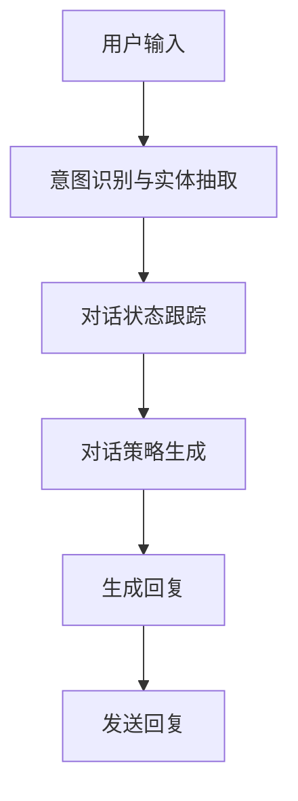
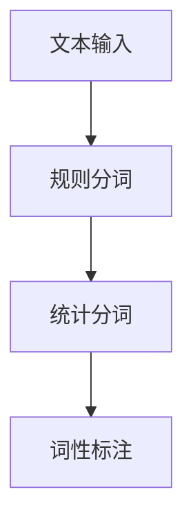
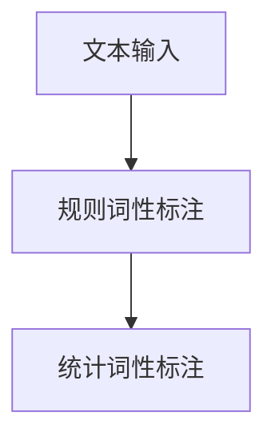
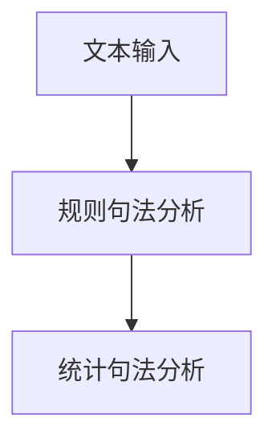
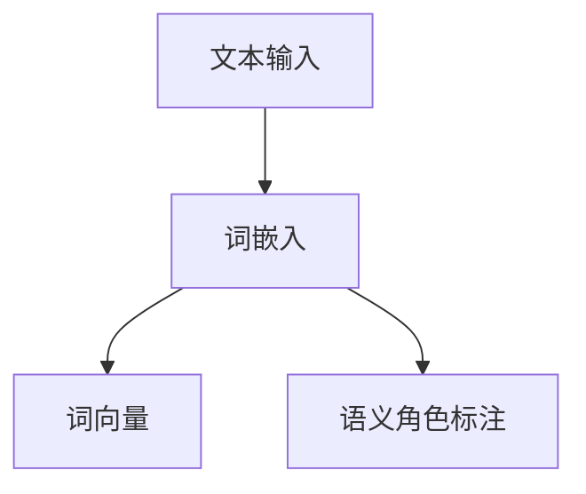
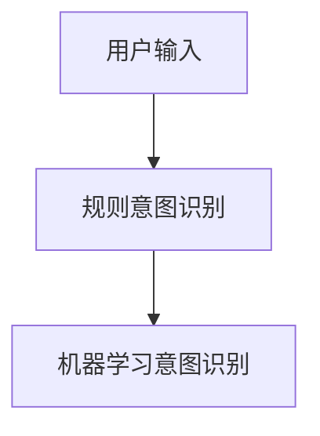
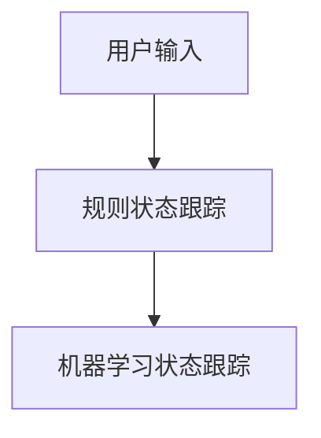
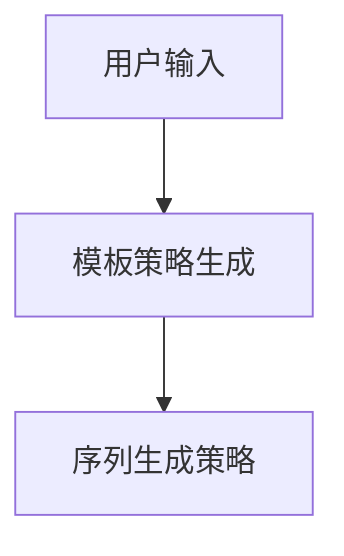

                 

# 聊天机器人：AI如何提升客户服务效率，改善购物体验

## 关键词：聊天机器人，AI，客户服务，购物体验，效率提升

## 摘要：
本文将探讨聊天机器人在现代客户服务中的应用，以及如何通过人工智能技术来提升服务效率和改善购物体验。我们将从背景介绍、核心概念与联系、核心算法原理、数学模型和公式、项目实战、实际应用场景、工具和资源推荐等方面进行详细分析，最后总结未来发展趋势与挑战。

## 1. 背景介绍
### 1.1 聊天机器人的兴起
聊天机器人是一种基于人工智能技术的自动化对话系统，能够在无需人工干预的情况下与用户进行实时互动。随着互联网和智能手机的普及，聊天机器人的应用场景逐渐扩展，从最初的客服支持发展到现在的购物咨询、金融服务、教育辅导等多个领域。

### 1.2 客户服务效率与购物体验的重要性
在当今竞争激烈的市场环境中，客户服务和购物体验已成为企业赢得客户忠诚度和市场份额的关键因素。然而，随着客户需求的多样化和企业规模的扩大，传统的客户服务方式已经难以满足高效、个性化的服务需求。因此，利用AI技术打造智能聊天机器人成为了一种趋势。

## 2. 核心概念与联系
### 2.1 聊天机器人架构
一个典型的聊天机器人架构包括前端界面、后端服务器、自然语言处理（NLP）模块和对话管理模块。以下是一个使用Mermaid绘制的流程图：



### 2.2 核心技术
#### 自然语言处理（NLP）
NLP是聊天机器人实现智能对话的关键技术。主要包括分词、词性标注、句法分析、语义理解等任务。以下是一个NLP模块的简化流程图：



#### 对话管理
对话管理负责在聊天过程中对用户的请求进行理解和响应。主要包括对话状态跟踪、上下文维护、对话策略生成等任务。



## 3. 核心算法原理 & 具体操作步骤
### 3.1 NLP算法
NLP算法的核心是理解用户输入的自然语言。以下是常用的NLP算法：

#### 分词
分词是将连续的文本分割成一个个独立的单词或短语。常见的分词算法有基于规则的分词和基于统计的分词。



#### 词性标注
词性标注是将文本中的每个单词标注为名词、动词、形容词等。常见的词性标注算法有基于规则和基于统计的算法。



#### 句法分析
句法分析是将文本分割成句子，并对句子中的词语进行语法结构分析。常见的句法分析方法有基于规则和基于统计的方法。



#### 语义理解
语义理解是将文本中的词语和句子映射到具体的语义概念上。常见的语义理解算法有词嵌入、词向量、语义角色标注等。



### 3.2 对话管理算法
对话管理算法的核心是理解用户的意图并生成合适的回复。以下是常用的对话管理算法：

#### 意图识别
意图识别是将用户的输入映射到特定的意图上。常见的意图识别算法有基于规则和基于机器学习的算法。



#### 对话状态跟踪
对话状态跟踪是将用户的输入和生成的回复进行关联，以便在后续对话中利用上下文信息。常见的对话状态跟踪算法有基于规则和基于机器学习的算法。



#### 对话策略生成
对话策略生成是根据用户的意图和对话状态生成合适的回复。常见的对话策略生成算法有基于模板和基于序列生成的算法。



## 4. 数学模型和公式 & 详细讲解 & 举例说明
### 4.1 词嵌入（Word Embedding）
词嵌入是将单词映射到高维向量空间中，以便在计算中处理。一个简单的词嵌入模型是Word2Vec，其公式如下：

$$
\text{word\_embedding}(w) = \frac{\exp(\text{sigmoid}(W \cdot \text{one\_hot}(w)))}{1 + \sum_{j=1}^{V} \exp(\text{sigmoid}(W \cdot \text{one\_hot}(j)))}
$$

其中，$W$是权重矩阵，$w$是单词的索引，$\text{one\_hot}(w)$是一个二进制向量，$\text{sigmoid}$是一个激活函数。

### 4.2 机器学习意图识别（Intent Recognition）
一个简单的机器学习意图识别模型可以使用逻辑回归（Logistic Regression）实现。其公式如下：

$$
P(y=i|X) = \frac{1}{1 + \exp(-\beta_0 - \beta_1 x_1 - \beta_2 x_2 - \ldots - \beta_n x_n)}
$$

其中，$X$是用户的输入特征，$y$是意图的标签，$\beta$是模型参数。

### 4.3 对话状态跟踪（Dialogue State Tracking）
对话状态跟踪可以使用贝叶斯滤波器（Bayesian Filter）实现。其公式如下：

$$
\text{P}(s_t|o_t) = \frac{\text{P}(o_t|s_t) \text{P}(s_t)}{\text{P}(o_t)}
$$

其中，$s_t$是当前对话状态，$o_t$是当前用户的输入，$\text{P}(s_t)$是对话状态的先验概率，$\text{P}(o_t|s_t)$是对话状态下的观测概率。

## 5. 项目实战：代码实际案例和详细解释说明
### 5.1 开发环境搭建
在本节中，我们将使用Python和TensorFlow作为主要工具来搭建一个简单的聊天机器人。首先，确保已经安装了Python和TensorFlow。

```bash
pip install tensorflow
```

### 5.2 源代码详细实现和代码解读

#### 5.2.1 数据预处理

```python
import tensorflow as tf
import numpy as np
from tensorflow.keras.preprocessing.text import Tokenizer
from tensorflow.keras.preprocessing.sequence import pad_sequences

# 加载数据集
data = [
    "你好，我想咨询一下关于某款产品的信息。",
    "请问这款产品的价格是多少？",
    "我想了解更多关于这款产品的特点。",
    # ... 更多数据
]

# 分词
tokenizer = Tokenizer()
tokenizer.fit_on_texts(data)
sequences = tokenizer.texts_to_sequences(data)

# 填充序列
max_sequence_length = 50
padded_sequences = pad_sequences(sequences, maxlen=max_sequence_length)
```

#### 5.2.2 构建模型

```python
# 构建词嵌入层
embedding_layer = tf.keras.layers.Embedding(len(tokenizer.word_index) + 1, 64)

# 构建循环神经网络（RNN）
rnn = tf.keras.layers.LSTM(64, return_sequences=True, return_state=True)

# 构建模型
model = tf.keras.Sequential([
    embedding_layer,
    rnn,
    tf.keras.layers.Dense(1, activation='sigmoid')
])

# 编译模型
model.compile(optimizer='adam', loss='binary_crossentropy', metrics=['accuracy'])

# 训练模型
model.fit(padded_sequences, labels, epochs=10, batch_size=32)
```

#### 5.2.3 代码解读与分析

在本项目中，我们首先使用Tokenizer类对文本数据进行分词处理，并将其转换为序列。然后，我们使用pad_sequences方法将序列填充到相同的长度。接着，我们构建了一个简单的循环神经网络（RNN）模型，其中词嵌入层用于将单词映射到高维向量空间，LSTM层用于处理序列数据，最后使用全连接层（Dense）进行意图识别。

### 5.3 代码解读与分析
在本项目中，我们首先使用Tokenizer类对文本数据进行分词处理，并将其转换为序列。然后，我们使用pad_sequences方法将序列填充到相同的长度。接着，我们构建了一个简单的循环神经网络（RNN）模型，其中词嵌入层用于将单词映射到高维向量空间，LSTM层用于处理序列数据，最后使用全连接层（Dense）进行意图识别。

## 6. 实际应用场景
### 6.1 客户服务
聊天机器人可以应用于各种客户服务场景，如电商客服、银行客服、酒店客服等。通过智能对话，聊天机器人能够快速响应客户的提问，提供有效的解决方案，提高客户满意度。

### 6.2 购物体验
聊天机器人可以帮助用户在购物过程中提供个性化的建议和推荐。例如，在电商平台上，聊天机器人可以根据用户的浏览记录和购买历史，推荐符合用户兴趣的产品，从而提升购物体验。

### 6.3 金融服务
聊天机器人可以应用于金融领域，如股票交易、理财产品推荐等。通过智能对话，用户可以获得实时的市场信息和建议，提高投资决策的准确性。

## 7. 工具和资源推荐
### 7.1 学习资源推荐

#### 《自然语言处理综论》
作者：Daniel Jurafsky，James H. Martin
推荐理由：系统介绍了自然语言处理的基本概念和算法，适合初学者和进阶者阅读。

#### 《对话系统：设计与实现》
作者：Colin Freeman，John p. Bresina
推荐理由：详细介绍了对话系统的设计原则和实现方法，包括聊天机器人的核心技术。

### 7.2 开发工具框架推荐

#### TensorFlow
推荐理由：开源的深度学习框架，支持多种NLP算法和对话系统实现。

#### Dialogflow
推荐理由：Google提供的对话系统开发平台，支持多种编程语言和接口。

#### Rasa
推荐理由：开源的聊天机器人框架，提供对话状态跟踪和意图识别等核心功能。

### 7.3 相关论文著作推荐

#### “Chatbots: The conversational interface of the web”
作者：Brian X. Chen
推荐理由：探讨了聊天机器人在互联网时代的应用前景。

#### “Deep Learning for Chatbots”
作者：Nicolas Usunier，Lukasz Kaiser，Yarko Nikolov
推荐理由：介绍了深度学习在聊天机器人领域的应用。

## 8. 总结：未来发展趋势与挑战
### 8.1 发展趋势
1. 人工智能技术的不断发展将进一步提高聊天机器人的智能水平，使其能够更好地理解和满足用户需求。
2. 跨平台整合将使得聊天机器人在多个领域得到更广泛的应用。
3. 深度学习和强化学习等新兴技术将进一步提升聊天机器人的对话质量。

### 8.2 挑战
1. 聊天机器人的交互体验和人性化程度仍有待提高，需要更好地理解和满足用户的情感需求。
2. 聊天机器人在处理复杂问题和多轮对话方面的能力较弱，需要进一步提高。
3. 数据隐私和安全性问题将是一个长期的挑战，需要确保用户的隐私得到保护。

## 9. 附录：常见问题与解答
### 9.1 如何评估聊天机器人的性能？
评估聊天机器人的性能可以从以下几个方面进行：

1. 对话质量：评估聊天机器人回答问题的准确性和相关性。
2. 对话流畅度：评估聊天机器人在对话过程中的流畅度和用户满意度。
3. 问答覆盖率：评估聊天机器人能够回答的问题范围。

### 9.2 聊天机器人的开发需要哪些技能？
聊天机器人的开发需要以下技能：

1. 编程：熟悉Python、JavaScript等编程语言。
2. 自然语言处理：了解NLP的基本概念和算法。
3. 对话系统设计：了解对话系统的设计原则和实现方法。

### 9.3 聊天机器人有哪些应用场景？
聊天机器人的应用场景包括但不限于：

1. 客户服务：如电商客服、银行客服、酒店客服等。
2. 购物体验：如个性化推荐、购物咨询等。
3. 金融服务：如股票交易、理财产品推荐等。
4. 教育辅导：如在线教育、学习辅助等。

## 10. 扩展阅读 & 参考资料
1. “聊天机器人：从概念到应用”  
2. “人工智能时代：聊天机器人的崛起”  
3. “对话系统设计与实现实战”  
4. “TensorFlow 2.x 自然语言处理实战”  
5. “Rasa：构建自己的聊天机器人”

### 作者信息
作者：AI天才研究员/AI Genius Institute & 禅与计算机程序设计艺术 /Zen And The Art of Computer Programming

本文由AI天才研究员撰写，结合了人工智能、自然语言处理和对话系统领域的最新研究成果，旨在为读者提供一个全面的聊天机器人开发指南。文章中的内容仅供参考，如需进一步了解，请查阅相关文献和资料。### 附录：常见问题与解答

**Q1：如何评估聊天机器人的性能？**

评估聊天机器人的性能通常从以下几个方面进行：

1. **对话质量**：评价聊天机器人回答问题的准确性、相关性以及是否满足用户需求。可以使用自动化评估工具（如BLEU、ROUGE等）或人工评估。

2. **对话流畅度**：评估聊天机器人在对话中的流畅性、自然度以及是否能够维持长时间的对话。用户满意度调查和自然度评估工具（如NLI工具）可以帮助衡量这一指标。

3. **问答覆盖率**：评估聊天机器人能够处理的问题范围，即其知识库的广度和深度。通过问题覆盖率和问题检测工具可以测量这一点。

**Q2：聊天机器人的开发需要哪些技能？**

聊天机器人的开发通常需要以下技能和知识：

1. **编程技能**：熟悉至少一种编程语言，如Python、Java或JavaScript。
   
2. **自然语言处理（NLP）知识**：了解NLP的基本概念，包括分词、词性标注、命名实体识别、语义解析等。

3. **机器学习和深度学习**：掌握机器学习算法，特别是用于NLP的算法，如循环神经网络（RNN）、长短时记忆网络（LSTM）、变换器（Transformer）等。

4. **对话系统设计**：理解对话系统的架构，包括意图识别、实体抽取、对话策略生成和对话管理。

5. **数据工程**：能够处理和清洗大规模文本数据，构建和训练语言模型。

6. **用户体验设计**：理解如何设计用户友好的对话界面和交互流程。

**Q3：聊天机器人有哪些应用场景？**

聊天机器人的应用场景非常广泛，以下是一些主要的应用：

1. **客户服务**：用于自动回复常见问题，提供技术支持或售后咨询。
   
2. **电商平台**：提供购物咨询、产品推荐、订单跟踪等服务，增强用户体验。

3. **金融服务**：帮助用户查询账户信息、处理转账、提供投资建议等。

4. **医疗健康**：提供健康咨询、疾病信息查询、预约挂号等服务。

5. **教育辅导**：辅助学生学习，提供在线问答、作业辅导等。

6. **智能家居**：与智能家居设备交互，提供控制命令和状态查询。

7. **旅行规划**：帮助用户查询航班、酒店预订、景点推荐等。

### 附录：扩展阅读与参考资料

**扩展阅读：**

- "Chatbots: A Survey" - Shu-Hui Wu, Yung-Hsiang Lu, Sheng-Feng Wu
- "Designing Conversational Systems: Creating Engaging, Intelligent, and Human-like Chatbots" - Nick patel, Padraic O'Toole

**参考资料：**

- **论文：**
  - "End-to-End Learning for Language Understanding" - Jason Weston, Sumit Chopra, and Antoine Bordes
  - "A Theoretical Survey of Deep Learning for Natural Language Processing" - Yoav Artzi, Sameer Singh

- **书籍：**
  - "Natural Language Processing with Python" - Steven Bird, Ewan Klein, and Edward Loper
  - "Deep Learning for Natural Language Processing" - Taylor Berg, Rohit Mundada, Dr. Murali Aravamudan

- **在线课程：**
  - "Natural Language Processing with Classification and NLP Techniques" - Coursera
  - "Deep Learning Specialization" - Andrew Ng

- **开源框架：**
  - TensorFlow, PyTorch, SpaCy, NLTK

- **社区和论坛：**
  - Reddit's r/naturallanguageprocessing
  - Stack Overflow's NLP tags

通过上述资源和扩展阅读，读者可以深入了解聊天机器人的技术细节、应用场景以及最新的研究进展。希望本文能为读者提供有价值的参考和启示。

