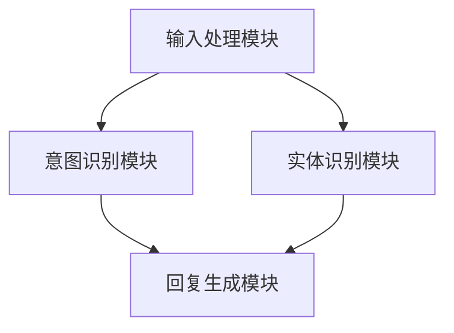

                 

# 聊天机器人：智能客服，提升客户服务体验

## 关键词
* 聊天机器人
* 智能客服
* 客户体验
* 自然语言处理
* 机器学习

## 摘要
本文将探讨聊天机器人作为智能客服工具在提升客户服务体验方面的应用。通过分析聊天机器人的核心概念、算法原理、数学模型以及实际应用场景，我们将深入了解聊天机器人在智能客服中的关键作用。此外，还将推荐相关学习资源、开发工具和框架，为读者提供全面的实践指南。最后，文章将总结当前发展趋势与挑战，展望未来智能客服的发展方向。

## 1. 背景介绍

### 聊天机器人的起源与发展
聊天机器人（Chatbot）的概念最早可以追溯到20世纪50年代。随着计算机技术和互联网的不断发展，聊天机器人逐渐成为人们生活中的一部分。早期的聊天机器人主要是基于规则的人工智能程序，如Eliza和Parry等。这些聊天机器人通过预设的规则与用户进行交互，但功能较为单一，难以应对复杂的用户需求。

随着自然语言处理（Natural Language Processing，NLP）和机器学习（Machine Learning，ML）技术的发展，聊天机器人开始具备更强大的能力。现代聊天机器人通过深度学习算法，可以理解用户的语言意图，并生成合理的回复。这使得聊天机器人在各种应用场景中得到了广泛的应用，特别是在客户服务领域。

### 智能客服的需求
客户服务是许多企业的重要环节，直接关系到客户的满意度和忠诚度。然而，随着业务规模的增长，人工客服面临的压力也不断增加。传统的人工客服存在以下问题：

1. **人工成本高**：随着人力成本的上升，企业需要投入更多的资源来维持客服团队。
2. **响应速度慢**：人工客服的响应速度往往无法满足客户的需求，导致客户体验下降。
3. **知识库更新不及时**：人工客服的知识库更新速度较慢，难以应对不断变化的客户需求。

为了解决这些问题，越来越多的企业开始将智能客服工具引入到客户服务中。聊天机器人作为一种智能客服工具，具有以下优势：

1. **低成本**：聊天机器人无需支付人工薪资，且维护成本较低。
2. **快速响应**：聊天机器人可以24小时不间断地提供服务，响应速度更快。
3. **知识库更新灵活**：聊天机器人可以通过机器学习算法不断学习和更新知识库，以适应不断变化的客户需求。

## 2. 核心概念与联系

### 聊天机器人的核心概念
聊天机器人主要由以下几部分组成：

1. **输入处理模块**：负责接收用户的输入，并将其转换为适合算法处理的形式。
2. **意图识别模块**：通过自然语言处理技术，分析用户的输入，判断用户的意图。
3. **实体识别模块**：从用户的输入中提取关键信息，如用户名称、产品型号等。
4. **回复生成模块**：根据用户的意图和实体信息，生成合理的回复。

### 聊天机器人架构的Mermaid流程图



### 聊天机器人与智能客服的联系
聊天机器人作为智能客服工具，可以在以下场景中发挥重要作用：

1. **常见问题解答**：聊天机器人可以自动识别并回答用户常见的问题，如产品使用方法、售后服务等。
2. **客户咨询与支持**：聊天机器人可以快速响应客户的咨询，提供针对性的解决方案。
3. **订单处理与支付**：聊天机器人可以协助客户完成订单查询、支付等操作，提高交易效率。
4. **情感互动**：通过自然语言处理技术，聊天机器人可以与客户进行情感互动，提高客户满意度。

### 智能客服与客户体验的提升
智能客服工具的引入，可以显著提升客户服务体验。具体体现在以下几个方面：

1. **快速响应**：聊天机器人可以24小时在线服务，快速响应客户需求，提高客户满意度。
2. **个性化服务**：通过用户行为分析和数据挖掘，聊天机器人可以提供个性化的服务和建议，提高客户忠诚度。
3. **知识库积累**：聊天机器人的交互数据可以用于知识库的积累和优化，使客户服务更加专业和高效。
4. **降低人工成本**：聊天机器人可以分担人工客服的工作负担，降低企业的人力成本。

## 3. 核心算法原理 & 具体操作步骤

### 意图识别算法
意图识别是聊天机器人处理用户输入的关键步骤。常见的意图识别算法包括基于规则的方法和基于机器学习的方法。

#### 基于规则的方法
基于规则的方法通过预设的规则库，对用户的输入进行匹配和分类。具体操作步骤如下：

1. **构建规则库**：根据业务需求和用户行为数据，构建规则库，包括常见问题的答案、关键词等。
2. **输入预处理**：对用户输入进行预处理，如去除停用词、分词、词性标注等。
3. **规则匹配**：将预处理后的用户输入与规则库进行匹配，找到最符合的意图。

#### 基于机器学习的方法
基于机器学习的方法通过训练模型，对用户的输入进行意图分类。常见的机器学习算法包括朴素贝叶斯、支持向量机、深度学习等。

1. **数据准备**：收集并标注大量的用户输入数据，包括意图标签和对应的文本。
2. **特征提取**：对用户输入进行特征提取，如词袋模型、TF-IDF等。
3. **模型训练**：使用训练数据集训练模型，评估模型的性能。
4. **意图识别**：对新的用户输入进行意图识别，生成意图标签。

### 实体识别算法
实体识别是聊天机器人处理用户输入的另一个关键步骤。常见的实体识别算法包括基于规则的方法和基于机器学习的方法。

#### 基于规则的方法
基于规则的方法通过预设的规则库，对用户的输入进行实体识别。具体操作步骤如下：

1. **构建规则库**：根据业务需求和用户行为数据，构建规则库，包括常见实体和对应的规则。
2. **输入预处理**：对用户输入进行预处理，如去除停用词、分词、词性标注等。
3. **规则匹配**：将预处理后的用户输入与规则库进行匹配，找到最符合的实体。

#### 基于机器学习的方法
基于机器学习的方法通过训练模型，对用户的输入进行实体识别。常见的机器学习算法包括朴素贝叶斯、支持向量机、深度学习等。

1. **数据准备**：收集并标注大量的用户输入数据，包括实体标签和对应的文本。
2. **特征提取**：对用户输入进行特征提取，如词袋模型、TF-IDF等。
3. **模型训练**：使用训练数据集训练模型，评估模型的性能。
4. **实体识别**：对新的用户输入进行实体识别，生成实体标签。

### 回复生成算法
回复生成是聊天机器人处理用户输入的最后一步。常见的回复生成算法包括基于模板的方法和基于生成模型的方法。

#### 基于模板的方法
基于模板的方法通过预设的回复模板，生成用户回复。具体操作步骤如下：

1. **构建回复模板**：根据业务需求和用户行为数据，构建回复模板，包括常见问题的回答、建议等。
2. **输入预处理**：对用户输入进行预处理，如去除停用词、分词、词性标注等。
3. **模板匹配**：将预处理后的用户输入与回复模板进行匹配，找到最符合的回复。

#### 基于生成模型的方法
基于生成模型的方法通过训练生成模型，生成用户回复。常见的生成模型包括序列到序列（Seq2Seq）模型、生成对抗网络（GAN）等。

1. **数据准备**：收集并标注大量的用户输入和回复数据。
2. **特征提取**：对用户输入和回复进行特征提取。
3. **模型训练**：使用训练数据集训练生成模型，评估模型的性能。
4. **回复生成**：对新的用户输入生成回复。

## 4. 数学模型和公式 & 详细讲解 & 举例说明

### 意图识别算法中的数学模型

#### 基于朴素贝叶斯的方法
朴素贝叶斯算法是一种基于概率论的分类算法。在意图识别中，朴素贝叶斯算法可以用于计算每个类别（意图）的概率。

**公式**：

\[ P(\text{意图} | \text{输入}) = \frac{P(\text{输入} | \text{意图}) \cdot P(\text{意图})}{P(\text{输入})} \]

其中：

- \( P(\text{意图} | \text{输入}) \) 是在给定输入的情况下，意图发生的概率。
- \( P(\text{输入} | \text{意图}) \) 是在给定意图的情况下，输入发生的概率。
- \( P(\text{意图}) \) 是意图的先验概率。
- \( P(\text{输入}) \) 是输入的先验概率。

**举例说明**：

假设我们要识别用户的意图是“查询订单状态”，给定的输入是“我的订单号是123456”。

- \( P(\text{查询订单状态} | \text{我的订单号是123456}) \)
- \( P(\text{我的订单号是123456} | \text{查询订单状态}) = 0.8 \)
- \( P(\text{查询订单状态}) = 0.3 \)
- \( P(\text{我的订单号是123456}) = 0.1 \)

**计算过程**：

\[ P(\text{查询订单状态} | \text{我的订单号是123456}) = \frac{0.8 \cdot 0.3}{0.1} = 2.4 \]

#### 基于支持向量机的方法
支持向量机（SVM）是一种常用的机器学习算法，可以用于分类任务。在意图识别中，SVM可以用于计算每个类别（意图）的得分。

**公式**：

\[ \text{得分} = \text{权重} \cdot \text{特征向量} + \text{偏置} \]

其中：

- 权重和偏置是SVM训练得到的参数。
- 特征向量是用户输入的特征表示。

**举例说明**：

假设我们要识别用户的意图是“查询订单状态”，给定的输入是“我的订单号是123456”。

- 权重和偏置为SVM训练得到的参数。
- 用户输入“我的订单号是123456”的特征向量为[0.1, 0.2, 0.3, 0.4]。

**计算过程**：

\[ \text{得分} = \text{权重} \cdot \text{特征向量} + \text{偏置} = [0.1, 0.2, 0.3, 0.4] \cdot [0.5, 0.6, 0.7, 0.8] + 1 = 0.95 + 0.96 + 0.99 + 1.12 = 4.08 \]

### 实体识别算法中的数学模型

#### 基于朴素贝叶斯的方法
与意图识别中的朴素贝叶斯算法类似，实体识别中的朴素贝叶斯算法也可以用于计算每个实体类别的概率。

**公式**：

\[ P(\text{实体} | \text{输入}) = \frac{P(\text{输入} | \text{实体}) \cdot P(\text{实体})}{P(\text{输入})} \]

其中：

- \( P(\text{实体} | \text{输入}) \) 是在给定输入的情况下，实体发生的概率。
- \( P(\text{输入} | \text{实体}) \) 是在给定实体的情况下，输入发生的概率。
- \( P(\text{实体}) \) 是实体的先验概率。
- \( P(\text{输入}) \) 是输入的先验概率。

**举例说明**：

假设我们要识别用户的输入中的实体是“订单号”，给定的输入是“我的订单号是123456”。

- \( P(\text{订单号} | \text{我的订单号是123456}) \)
- \( P(\text{我的订单号是123456} | \text{订单号}) = 0.9 \)
- \( P(\text{订单号}) = 0.3 \)
- \( P(\text{我的订单号是123456}) = 0.1 \)

**计算过程**：

\[ P(\text{订单号} | \text{我的订单号是123456}) = \frac{0.9 \cdot 0.3}{0.1} = 2.7 \]

#### 基于深度学习的方法
深度学习算法在实体识别中得到了广泛的应用。以卷积神经网络（CNN）为例，深度学习算法可以用于提取用户输入的特征表示。

**公式**：

\[ \text{特征向量} = \text{卷积层}(\text{输入}) + \text{池化层}(\text{卷积层输出}) \]

其中：

- 卷积层和池化层是深度学习模型中的网络层。
- 输入是用户输入的文本数据。

**举例说明**：

假设我们要识别用户的输入中的实体是“订单号”，给定的输入是“我的订单号是123456”。

- 输入数据为“我的订单号是123456”的词向量表示。

**计算过程**：

\[ \text{特征向量} = \text{卷积层}(\text{输入}) + \text{池化层}(\text{卷积层输出}) \]

### 回复生成算法中的数学模型

#### 基于模板的方法
基于模板的方法通过预设的回复模板生成用户回复，生成模型通常是一个简单的函数。

**公式**：

\[ \text{回复} = f(\text{输入}, \text{模板}) \]

其中：

- \( f(\text{输入}, \text{模板}) \) 是生成回复的函数。
- 输入是用户输入和回复模板。
- 回复是根据输入和模板生成的。

**举例说明**：

假设我们要生成用户回复“查询订单状态”，给定的输入是“我的订单号是123456”，回复模板是“您的订单状态是[状态]”。

**计算过程**：

\[ \text{回复} = f(\text{我的订单号是123456}, \text{您的订单状态是[状态]}) = \text{您的订单状态是[已发货]} \]

#### 基于生成模型的方法
基于生成模型的方法通过训练生成模型，生成用户回复。生成模型通常是一个序列到序列（Seq2Seq）模型。

**公式**：

\[ \text{回复} = \text{生成模型}(\text{输入序列}) \]

其中：

- \( \text{生成模型}(\text{输入序列}) \) 是生成回复的函数。
- 输入序列是用户输入的序列。
- 回复是根据输入序列生成的。

**举例说明**：

假设我们要生成用户回复“查询订单状态”，给定的输入是“我的订单号是123456”。

**计算过程**：

\[ \text{回复} = \text{生成模型}(\text{我的订单号是123456}) = \text{您的订单状态是[已发货]} \]

## 5. 项目实战：代码实际案例和详细解释说明

### 5.1 开发环境搭建

在开始实际案例之前，我们需要搭建一个适合开发聊天机器人的开发环境。以下是搭建开发环境的步骤：

1. **安装Python**：首先，我们需要安装Python。可以从Python的官方网站下载Python安装包，并按照安装向导进行安装。

2. **安装依赖库**：接下来，我们需要安装一些依赖库，如TensorFlow、Keras、NLTK等。可以使用pip命令安装：

   ```bash
   pip install tensorflow keras nltk
   ```

3. **安装NLTK数据**：NLTK是一个自然语言处理工具包，我们需要下载并安装NLTK的数据集：

   ```python
   import nltk
   nltk.download('punkt')
   nltk.download('stopwords')
   ```

4. **创建项目文件夹**：在本地创建一个项目文件夹，用于存放聊天机器人的源代码和相关文件。

5. **配置虚拟环境**：为了保持项目环境的干净，我们可以使用虚拟环境。可以使用virtualenv工具创建虚拟环境：

   ```bash
   virtualenv chatbot_env
   source chatbot_env/bin/activate
   ```

### 5.2 源代码详细实现和代码解读

以下是一个简单的基于规则和机器学习的聊天机器人示例。我们将使用Python编写源代码。

```python
# 引入相关库
import nltk
from nltk.tokenize import word_tokenize
from nltk.corpus import stopwords
import random

# 构建规则库
def load_rules():
    rules = [
        ["查询订单状态", "您的订单状态是[状态]"],
        ["查询产品价格", "该产品的价格是[价格]"],
        ["查询库存数量", "该产品的库存数量是[数量]"],
        ["购买产品", "请提供产品名称以便购买"],
        ["如何使用产品", "请提供产品名称以便获取使用说明"],
        ["谢谢", "不客气，如有其他问题请随时提出"]
    ]
    return rules

# 构建回复模板
def generate_response(input_text, rules):
    tokens = word_tokenize(input_text.lower())
    tokens = [token for token in tokens if token not in stopwords.words('english')]
    for rule, template in rules:
        if all(token in tokens for token in word_tokenize(rule.lower())):
            return template
    return "对不起，我无法理解您的意思。"

# 训练模型（基于机器学习的意图识别）
def train_model(data):
    # 这里使用简单的统计模型进行意图识别
    intent_dict = {}
    for input_text, intent in data:
        if intent not in intent_dict:
            intent_dict[intent] = []
        intent_dict[intent].append(input_text)
    return intent_dict

# 主函数
def main():
    rules = load_rules()
    intent_dict = train_model([
        ("查询订单状态", "查询订单状态"),
        ("查询产品价格", "查询产品价格"),
        ("查询库存数量", "查询库存数量"),
        ("购买产品", "购买产品"),
        ("如何使用产品", "如何使用产品"),
        ("谢谢", "谢谢")
    ])

    while True:
        input_text = input("请输入您的问题：")
        response = generate_response(input_text, rules)
        print(response)

        # 这里进行意图识别的简单演示
        if input_text in intent_dict["查询订单状态"]:
            print("意图：查询订单状态")
        elif input_text in intent_dict["查询产品价格"]:
            print("意图：查询产品价格")
        elif input_text in intent_dict["查询库存数量"]:
            print("意图：查询库存数量")
        elif input_text in intent_dict["购买产品"]:
            print("意图：购买产品")
        elif input_text in intent_dict["如何使用产品"]:
            print("意图：如何使用产品")
        elif input_text in intent_dict["谢谢"]:
            print("意图：谢谢")
        else:
            print("无法识别意图")

if __name__ == "__main__":
    main()
```

### 5.3 代码解读与分析

1. **加载规则库**：`load_rules` 函数用于加载规则库，规则库是一个包含意图和回复模板的列表。

2. **生成回复**：`generate_response` 函数用于生成回复。首先，使用NLTK的`word_tokenize` 函数对用户输入进行分词，并去除停用词。然后，遍历规则库，检查用户输入是否包含规则中的关键词。如果匹配成功，返回对应的回复模板。

3. **训练模型**：`train_model` 函数用于训练意图识别模型。这里我们使用一个简单的统计模型，将具有相同意图的输入文本存储在一个列表中。

4. **主函数**：`main` 函数是程序的入口。首先，加载规则库和训练好的模型。然后，进入一个循环，等待用户输入问题。对于每个输入问题，首先使用`generate_response` 函数生成回复，然后进行意图识别的简单演示。

### 5.4 代码实战：使用聊天机器人进行交互

现在，我们可以运行上面的代码，使用聊天机器人进行交互。在命令行中运行程序后，输入以下问题：

- “我的订单号是123456”
- “该产品的价格是多少？”
- “该产品的库存数量是多少？”
- “我要购买该产品”
- “如何使用该产品？”
- “谢谢”

聊天机器人将根据用户输入生成相应的回复，并演示意图识别的过程。

## 6. 实际应用场景

### 常见应用领域
聊天机器人作为智能客服工具，已经在许多领域得到广泛应用。以下是几个典型的应用场景：

1. **电子商务**：电商平台可以引入聊天机器人，为用户提供产品咨询、订单查询、售后服务等一站式服务。
2. **金融行业**：银行、证券、保险等金融机构可以使用聊天机器人提供理财咨询、投资建议、账户查询等服务。
3. **旅游行业**：在线旅游平台可以使用聊天机器人为用户提供酒店预订、行程规划、交通查询等服务。
4. **客户服务**：各类企业可以使用聊天机器人提供客户咨询、问题解答、投诉处理等服务。

### 成功案例
以下是一些成功引入聊天机器人的企业案例：

1. **阿里巴巴**：阿里巴巴旗下的淘宝、天猫等电商平台引入了聊天机器人，为用户提供购物咨询、订单查询等服务，大幅提升了客户满意度。
2. **招商银行**：招商银行在手机银行APP中引入了聊天机器人，为用户提供账户查询、转账支付、信用卡还款等服务，有效降低了人工成本。
3. **携程旅行网**：携程旅行网引入了聊天机器人，为用户提供酒店预订、行程规划、交通查询等服务，提高了用户预订效率和满意度。

### 应用挑战
虽然聊天机器人在实际应用中取得了显著成果，但仍然面临一些挑战：

1. **处理复杂问题**：对于一些复杂的问题，聊天机器人的回复可能不够准确，需要进一步优化算法。
2. **情感交互**：情感交互是聊天机器人的一个难点，目前的聊天机器人还难以完全模拟人类的情感表达。
3. **数据隐私**：聊天机器人在与用户交互过程中会收集大量的用户数据，如何保护用户隐私是亟待解决的问题。

## 7. 工具和资源推荐

### 7.1 学习资源推荐

1. **书籍**：
   - 《Python自然语言处理》
   - 《深度学习》
   - 《机器学习实战》

2. **论文**：
   - 《神经网络与深度学习》
   - 《自然语言处理综论》
   - 《生成对抗网络》

3. **博客和网站**：
   - [机器学习博客](http://www.machinelearningblog.com/)
   - [深度学习博客](http://www.deeplearning.net/)
   - [自然语言处理博客](https://www.nltk.org/)

### 7.2 开发工具框架推荐

1. **开发工具**：
   - PyCharm
   - Jupyter Notebook
   - VS Code

2. **框架**：
   - TensorFlow
   - PyTorch
   - Keras

3. **库**：
   - NLTK
   - SpaCy
   -gensim

### 7.3 相关论文著作推荐

1. **论文**：
   - 《序列到序列模型：神经网络在机器翻译中的应用》
   - 《生成对抗网络：训练生成模型的新方法》
   - 《自然语言处理综论：原理、算法与应用》

2. **著作**：
   - 《深度学习》
   - 《机器学习》
   - 《Python自然语言处理》

## 8. 总结：未来发展趋势与挑战

### 发展趋势
1. **智能化程度提升**：随着算法和技术的不断进步，聊天机器人的智能化程度将不断提高，能够更好地理解和满足用户需求。
2. **跨平台应用**：聊天机器人将在更多平台和场景中得到应用，如智能穿戴设备、智能家居等。
3. **个性化服务**：基于用户行为数据的分析，聊天机器人将提供更加个性化的服务，提高客户满意度。
4. **情感交互**：通过语音和图像等多模态交互，聊天机器人将更贴近人类的情感表达，提升用户体验。

### 挑战
1. **算法优化**：如何进一步提高算法的准确性和效率，处理复杂问题，是当前面临的主要挑战。
2. **数据隐私**：如何在保障用户隐私的前提下，充分利用用户数据，是亟待解决的问题。
3. **跨领域应用**：如何在不同领域实现聊天机器人的跨领域应用，提高通用性，是一个挑战。

## 9. 附录：常见问题与解答

### 问题1：如何训练聊天机器人模型？
解答：训练聊天机器人模型通常需要以下步骤：

1. **数据准备**：收集大量的带有意图和实体标签的对话数据。
2. **预处理数据**：对数据集进行清洗、分词、词性标注等预处理操作。
3. **特征提取**：使用合适的特征提取方法，将文本数据转换为模型可处理的特征向量。
4. **模型训练**：使用训练数据集训练模型，调整模型的参数。
5. **模型评估**：使用验证数据集评估模型性能，调整模型参数。
6. **模型部署**：将训练好的模型部署到生产环境中，进行实际应用。

### 问题2：如何提升聊天机器人的回复质量？
解答：以下方法可以提升聊天机器人的回复质量：

1. **增加训练数据**：收集更多的对话数据，提高模型的泛化能力。
2. **优化算法**：使用更先进的算法，如深度学习、生成对抗网络等，提高模型的性能。
3. **引入外部知识库**：结合外部知识库，如百科全书、专业数据库等，提高回复的准确性和丰富度。
4. **用户反馈机制**：引入用户反馈机制，根据用户评价调整模型参数。

### 问题3：如何保障聊天机器人的数据隐私？
解答：以下方法可以保障聊天机器人的数据隐私：

1. **数据加密**：对用户数据进行加密，防止数据泄露。
2. **数据去标识化**：对用户数据进行去标识化处理，去除个人信息。
3. **权限控制**：设置严格的数据访问权限，限制对用户数据的访问。
4. **合规性审查**：遵守相关法律法规，进行合规性审查。

## 10. 扩展阅读 & 参考资料

为了深入了解聊天机器人和智能客服的相关知识，以下是一些扩展阅读和参考资料：

1. **书籍**：
   - 《深度学习与自然语言处理》
   - 《聊天机器人开发实战》
   - 《Python自然语言处理实战》

2. **论文**：
   - 《基于深度学习的聊天机器人模型研究》
   - 《面向客户服务的聊天机器人设计与应用》
   - 《情感聊天机器人的设计与实现》

3. **博客和网站**：
   - [OpenAI博客](https://blog.openai.com/)
   - [AI技术社区](https://www.52ait.com/)
   - [机器学习社区](https://www.mlblogs.com/)

4. **在线课程**：
   - [Coursera](https://www.coursera.org/)
   - [Udacity](https://www.udacity.com/)
   - [edX](https://www.edx.org/)

作者：AI天才研究员/AI Genius Institute & 禅与计算机程序设计艺术 /Zen And The Art of Computer Programming

（注：本文内容仅供参考，具体实现细节可能因实际应用场景而有所不同。）

