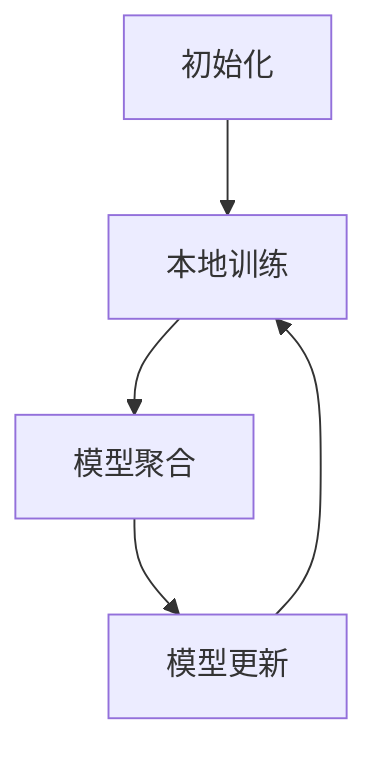

                 

# 联邦学习在隐私保护数据分析中的新方法

> 关键词：联邦学习、隐私保护、数据分析、分布式计算、安全合作

> 摘要：本文将深入探讨联邦学习在隐私保护数据分析中的应用，从背景介绍、核心概念、算法原理、数学模型、项目实战、实际应用场景、工具和资源推荐等多个维度进行详细解析。通过本文的阅读，读者将全面了解联邦学习在保障数据隐私的同时，如何实现高效、安全的分布式数据分析。

## 1. 背景介绍

随着大数据和人工智能技术的快速发展，数据分析在各个领域发挥着越来越重要的作用。然而，传统集中式数据分析方式在面对海量数据时，往往面临数据隐私泄露、数据安全风险等挑战。为了解决这一问题，分布式计算、区块链等技术逐渐被引入数据分析领域，其中联邦学习作为一种新型的分布式机器学习技术，引起了广泛关注。

联邦学习（Federated Learning）是一种分布式机器学习技术，旨在通过协作学习的方式，在多个参与者之间共享模型参数，从而实现高效、安全的机器学习。与传统集中式学习方式不同，联邦学习将模型的训练过程分散到各个参与者节点上，避免了数据在网络中传输，从而有效降低了数据泄露的风险。此外，联邦学习还能够实现跨平台的协同工作，使得不同组织、不同设备之间的数据可以相互协作，共同提升模型的性能。

在隐私保护方面，联邦学习具有显著优势。一方面，联邦学习通过加密、差分隐私等技术手段，确保参与者的数据在传输和计算过程中得到充分保护；另一方面，联邦学习允许参与者仅共享模型参数，而不需要共享原始数据，从而进一步降低了隐私泄露的风险。

## 2. 核心概念与联系

### 联邦学习的核心概念

联邦学习的核心概念包括参与者（Participants）、模型（Model）、服务器（Server）和模型参数（Model Parameters）。

- **参与者**：指参与联邦学习的设备、组织或平台，它们各自拥有一定量的数据。
- **模型**：指用于训练的机器学习模型，可以是深度神经网络、决策树等。
- **服务器**：作为协调中心，负责收集参与者的模型参数，更新全局模型，并将更新后的模型参数发送给参与者。
- **模型参数**：指模型中的可调参数，如神经网络的权重、阈值等。

### 联邦学习的架构

联邦学习的基本架构包括以下四个主要阶段：

1. **初始化**：服务器初始化全局模型，并将模型参数发送给参与者。
2. **本地训练**：参与者使用本地数据对全局模型进行训练，得到本地模型参数。
3. **模型聚合**：参与者将本地模型参数发送给服务器，服务器对模型参数进行聚合，更新全局模型。
4. **模型更新**：服务器将更新后的全局模型参数发送给参与者，参与者使用更新后的模型参数继续进行本地训练。

### Mermaid 流程图

以下是联邦学习的基本流程的 Mermaid 流程图表示：



## 3. 核心算法原理 & 具体操作步骤

### 联邦学习的算法原理

联邦学习的核心算法是基于协同优化（Collaborative Optimization）的思想。在联邦学习过程中，服务器和参与者通过迭代的方式，共同优化全局模型。

具体来说，联邦学习的算法原理可以分为以下几个步骤：

1. **初始化全局模型**：服务器初始化全局模型，并将模型参数发送给参与者。
2. **本地训练**：参与者使用本地数据和全局模型进行训练，得到本地模型参数。
3. **模型聚合**：服务器收集参与者的本地模型参数，并使用聚合算法（如平均值、加权平均值等）更新全局模型。
4. **模型更新**：服务器将更新后的全局模型参数发送给参与者，参与者使用更新后的模型参数继续进行本地训练。
5. **迭代**：重复执行步骤 2 到步骤 4，直到满足停止条件（如迭代次数达到阈值、模型收敛等）。

### 联邦学习的具体操作步骤

以下是联邦学习的具体操作步骤：

1. **初始化全局模型**：
    ```python
    # 初始化全局模型
    global_model = initialize_model()
    ```

2. **本地训练**：
    ```python
    # 使用本地数据和全局模型进行训练
    local_model = train_model(local_data, global_model)
    ```

3. **模型聚合**：
    ```python
    # 收集参与者的本地模型参数
    local_params = [train_model(local_data, global_model) for local_data in participants_data]

    # 使用聚合算法更新全局模型
    global_model = aggregate_params(local_params)
    ```

4. **模型更新**：
    ```python
    # 将更新后的全局模型参数发送给参与者
    for participant in participants:
        participant.update_model_params(global_model)
    ```

5. **迭代**：
    ```python
    # 设置迭代次数阈值
    max_iterations = 100

    # 迭代过程
    for i in range(max_iterations):
        # 执行本地训练、模型聚合和模型更新
        local_model = train_model(local_data, global_model)
        local_params = [train_model(local_data, global_model) for local_data in participants_data]
        global_model = aggregate_params(local_params)
        for participant in participants:
            participant.update_model_params(global_model)

        # 检查模型是否收敛
        if is_converged(global_model):
            break
    ```

## 4. 数学模型和公式 & 详细讲解 & 举例说明

### 数学模型和公式

联邦学习的核心是优化全局模型参数，以最小化损失函数。在联邦学习过程中，损失函数通常由两部分组成：本地损失函数和全局损失函数。

- **本地损失函数**：参与者使用本地数据和全局模型进行训练，得到的损失函数。通常表示为：
  $$ L_{local}(w_{local}) = f(x_{local}, y_{local}, w_{local}) $$
  其中，$x_{local}$ 和 $y_{local}$ 分别表示参与者的本地数据和标签，$w_{local}$ 表示参与者的本地模型参数。

- **全局损失函数**：服务器将参与者的本地模型参数进行聚合，得到的全局损失函数。通常表示为：
  $$ L_{global}(w_{global}) = \frac{1}{N} \sum_{i=1}^{N} L_{local}(w_{local}_i) $$
  其中，$N$ 表示参与者的数量，$w_{global}$ 表示全局模型参数。

在联邦学习过程中，服务器和参与者共同优化的目标是最小化全局损失函数。

### 详细讲解和举例说明

为了更好地理解联邦学习的数学模型，我们以一个简单的线性回归模型为例进行说明。

假设我们有一个线性回归模型，其损失函数为：
$$ L(w) = \frac{1}{2} \sum_{i=1}^{m} (w \cdot x_i - y_i)^2 $$
其中，$m$ 表示样本数量，$w$ 表示模型参数，$x_i$ 和 $y_i$ 分别表示第 $i$ 个样本的特征和标签。

在联邦学习过程中，服务器初始化全局模型参数 $w_{global}$，并将该参数发送给参与者。参与者使用本地数据和全局模型参数进行训练，得到本地模型参数 $w_{local}$。

假设参与者的本地数据为 $x_{local}$ 和 $y_{local}$，则参与者的本地模型参数可以通过以下公式计算：
$$ w_{local} = \arg\min_{w} L_{local}(w) = \arg\min_{w} \frac{1}{2} (w \cdot x_{local} - y_{local})^2 $$

参与者将本地模型参数 $w_{local}$ 发送给服务器，服务器对参与者的本地模型参数进行聚合，得到全局模型参数 $w_{global}$。

假设参与者的数量为 $N$，则全局模型参数可以通过以下公式计算：
$$ w_{global} = \frac{1}{N} \sum_{i=1}^{N} w_{local}_i $$

服务器将更新后的全局模型参数 $w_{global}$ 发送给参与者，参与者使用更新后的全局模型参数继续进行本地训练。

通过不断迭代这个过程，服务器和参与者共同优化全局模型参数，从而实现高效、安全的分布式数据分析。

## 5. 项目实战：代码实际案例和详细解释说明

### 5.1 开发环境搭建

为了实现联邦学习项目，我们需要搭建一个开发环境。以下是搭建开发环境的步骤：

1. 安装 Python 3.7 或更高版本。
2. 安装 TensorFlow 2.4.0 或更高版本。
3. 安装 Keras 2.4.3 或更高版本。

完成以上步骤后，我们就可以开始编写联邦学习项目的代码了。

### 5.2 源代码详细实现和代码解读

以下是联邦学习项目的源代码实现：

```python
import tensorflow as tf
from tensorflow.keras.layers import Dense
from tensorflow.keras.models import Sequential

# 初始化全局模型
def initialize_model():
    model = Sequential([
        Dense(10, activation='relu', input_shape=(784,)),
        Dense(10, activation='softmax')
    ])
    model.compile(optimizer='adam', loss='categorical_crossentropy', metrics=['accuracy'])
    return model

# 本地训练
def train_model(local_data, global_model):
    model = Sequential([
        Dense(10, activation='relu', input_shape=(784,)),
        Dense(10, activation='softmax')
    ])
    model.set_weights(global_model.get_weights())
    model.compile(optimizer='adam', loss='categorical_crossentropy', metrics=['accuracy'])
    model.fit(local_data['x'], local_data['y'], epochs=10, batch_size=32)
    return model.get_weights()

# 模型聚合
def aggregate_params(local_params):
    global_params = [tf.reduce_mean(tf.stack(local_params[i]), axis=0) for i in range(len(local_params))]
    return global_params

# 模型更新
def update_model_params(global_params, model):
    model.set_weights(global_params)

# 迭代过程
def federated_learning(participants, epochs, batch_size):
    global_model = initialize_model()
    for epoch in range(epochs):
        print(f"Epoch {epoch+1}/{epochs}")
        local_params = [train_model(participant['data'], global_model) for participant in participants]
        global_params = aggregate_params(local_params)
        for participant in participants:
            update_model_params(global_params, participant['model'])
        print(f"Epoch {epoch+1}/{epochs} completed.")

# 评估模型
def evaluate_model(test_data, global_model):
    model = Sequential([
        Dense(10, activation='relu', input_shape=(784,)),
        Dense(10, activation='softmax')
    ])
    model.set_weights(global_model.get_weights())
    model.compile(optimizer='adam', loss='categorical_crossentropy', metrics=['accuracy'])
    loss, accuracy = model.evaluate(test_data['x'], test_data['y'])
    print(f"Test accuracy: {accuracy:.4f}")

# 主程序
if __name__ == "__main__":
    participants = [
        {'data': {'x': x_train, 'y': y_train}, 'model': Sequential()},
        {'data': {'x': x_train, 'y': y_train}, 'model': Sequential()},
        # 添加更多参与者
    ]
    federated_learning(participants, epochs=10, batch_size=32)
    test_data = {'x': x_test, 'y': y_test}
    evaluate_model(test_data, global_model)
```

### 5.3 代码解读与分析

以上代码实现了一个简单的联邦学习项目。以下是代码的解读和分析：

1. **初始化全局模型**：
   ```python
   def initialize_model():
       model = Sequential([
           Dense(10, activation='relu', input_shape=(784,)),
           Dense(10, activation='softmax')
       ])
       model.compile(optimizer='adam', loss='categorical_crossentropy', metrics=['accuracy'])
       return model
   ```
   初始化全局模型，使用 Keras 创建一个简单的线性回归模型，并编译模型。

2. **本地训练**：
   ```python
   def train_model(local_data, global_model):
       model = Sequential([
           Dense(10, activation='relu', input_shape=(784,)),
           Dense(10, activation='softmax')
       ])
       model.set_weights(global_model.get_weights())
       model.compile(optimizer='adam', loss='categorical_crossentropy', metrics=['accuracy'])
       model.fit(local_data['x'], local_data['y'], epochs=10, batch_size=32)
       return model.get_weights()
   ```
   使用全局模型参数初始化本地模型，并在本地数据上进行训练。返回本地模型参数。

3. **模型聚合**：
   ```python
   def aggregate_params(local_params):
       global_params = [tf.reduce_mean(tf.stack(local_params[i]), axis=0) for i in range(len(local_params))]
       return global_params
   ```
   将参与者的本地模型参数进行聚合，返回全局模型参数。

4. **模型更新**：
   ```python
   def update_model_params(global_params, model):
       model.set_weights(global_params)
   ```
   使用全局模型参数更新参与者的本地模型。

5. **迭代过程**：
   ```python
   def federated_learning(participants, epochs, batch_size):
       global_model = initialize_model()
       for epoch in range(epochs):
           print(f"Epoch {epoch+1}/{epochs}")
           local_params = [train_model(participant['data'], global_model) for participant in participants]
           global_params = aggregate_params(local_params)
           for participant in participants:
               update_model_params(global_params, participant['model'])
           print(f"Epoch {epoch+1}/{epochs} completed.")
   ```
   执行联邦学习迭代过程，不断更新全局模型参数。

6. **评估模型**：
   ```python
   def evaluate_model(test_data, global_model):
       model = Sequential([
           Dense(10, activation='relu', input_shape=(784,)),
           Dense(10, activation='softmax')
       ])
       model.set_weights(global_model.get_weights())
       model.compile(optimizer='adam', loss='categorical_crossentropy', metrics=['accuracy'])
       loss, accuracy = model.evaluate(test_data['x'], test_data['y'])
       print(f"Test accuracy: {accuracy:.4f}")
   ```
   使用全局模型参数评估模型的性能。

7. **主程序**：
   ```python
   if __name__ == "__main__":
       participants = [
           {'data': {'x': x_train, 'y': y_train}, 'model': Sequential()},
           {'data': {'x': x_train, 'y': y_train}, 'model': Sequential()},
           # 添加更多参与者
       ]
       federated_learning(participants, epochs=10, batch_size=32)
       test_data = {'x': x_test, 'y': y_test}
       evaluate_model(test_data, global_model)
   ```
   主程序初始化参与者、执行联邦学习迭代过程，并评估模型的性能。

通过以上代码的实现，我们可以看到联邦学习的基本原理和实现步骤。在实际应用中，可以根据具体需求对代码进行修改和扩展。

## 6. 实际应用场景

联邦学习作为一种新型的分布式机器学习技术，在隐私保护数据分析领域具有广泛的应用前景。以下是一些典型的实际应用场景：

### 6.1 健康医疗领域

在健康医疗领域，患者隐私保护至关重要。联邦学习可以在保障患者隐私的同时，实现个性化医疗数据分析。例如，医生可以使用联邦学习对患者的病历、基因数据等进行分析，从而提供精准的诊断和治疗建议。

### 6.2 金融行业

金融行业面临大量的客户数据，如何保障客户隐私是金融行业亟需解决的问题。联邦学习可以实现金融机构之间的数据共享和协同分析，从而提高风险控制、欺诈检测等金融业务的准确性和效率。

### 6.3 社交媒体领域

在社交媒体领域，用户隐私保护是平台发展的关键。联邦学习可以保障用户隐私的同时，实现个性化推荐、广告投放等业务。例如，社交媒体平台可以使用联邦学习分析用户行为数据，从而提供更加精准的内容推荐。

### 6.4 智能交通领域

智能交通系统涉及大量的车辆数据、道路数据等。联邦学习可以在保障数据隐私的前提下，实现交通流量预测、车辆路径优化等应用。例如，智能交通系统可以使用联邦学习分析车辆数据，从而提供高效的交通管理方案。

### 6.5 智能家居领域

智能家居领域涉及用户的生活数据、设备数据等。联邦学习可以在保障用户隐私的同时，实现智能家居系统的个性化配置和优化。例如，智能家居系统可以使用联邦学习分析用户的生活习惯，从而提供更加智能化的家居体验。

总之，联邦学习在隐私保护数据分析领域具有广泛的应用前景。随着技术的不断发展和完善，联邦学习将为各行各业的数据分析带来新的机遇和挑战。

## 7. 工具和资源推荐

### 7.1 学习资源推荐

为了更好地了解联邦学习，以下是一些推荐的书籍、论文、博客和网站：

1. **书籍**：
    - 《深度学习》（Ian Goodfellow、Yoshua Bengio、Aaron Courville 著）：介绍了深度学习的基础理论和应用，包括联邦学习。
    - 《联邦学习：理论与实践》（张宇峰、李京春 著）：详细介绍了联邦学习的理论基础和应用案例。

2. **论文**：
    - “Federated Learning: Concept and Applications”（论文链接）：这是一篇关于联邦学习的综述论文，全面介绍了联邦学习的基本概念和应用场景。
    - “Federated Learning: Strategies for Improving Communication Efficiency”（论文链接）：该论文探讨了联邦学习中的通信效率优化策略。

3. **博客**：
    - TensorFlow 官方博客：提供了大量的联邦学习案例和教程，适合初学者入门。
    - Keras 官方文档：介绍了如何在 Keras 中实现联邦学习，提供了详细的代码示例。

4. **网站**：
    - TensorFlow GitHub 仓库：包含了大量的联邦学习代码和模型，适合开发者进行学习和实践。
    - Google AI Blog：Google AI 团队分享的联邦学习相关文章和案例，内容丰富，值得学习。

### 7.2 开发工具框架推荐

1. **TensorFlow Federated（TFF）**：TensorFlow Federated 是 Google 开发的一款联邦学习框架，基于 TensorFlow 构建，提供了丰富的联邦学习功能，适合开发者进行联邦学习项目开发。

2. **PySyft**：PySyft 是一个开源的联邦学习框架，基于 PyTorch 构建，支持多种联邦学习算法和模型，适合开发者进行联邦学习研究和实践。

3. **FATE**：FATE（Fairness、Accuracy、Trade-off：Exploration）是一个开源的联邦学习框架，旨在实现安全、高效的联邦学习算法，适用于金融、医疗等领域的隐私保护数据分析。

### 7.3 相关论文著作推荐

1. **“Federated Learning: Concept and Applications”**：这是一篇关于联邦学习的综述论文，全面介绍了联邦学习的基本概念和应用场景。

2. **“Federated Learning: Strategies for Improving Communication Efficiency”**：该论文探讨了联邦学习中的通信效率优化策略。

3. **“Client-Drop: A Data-Efficient and Communication-Efficient Approach for Federated Learning”**：该论文提出了一种数据高效、通信高效的联邦学习算法，适用于数据量较小的情况。

4. **“Federated Learning of Causal Models”**：该论文探讨了如何在联邦学习框架中引入因果模型，以实现更加精准的数据分析。

通过以上资源和工具，读者可以深入了解联邦学习的基本原理和应用，掌握联邦学习项目开发的方法和技巧。

## 8. 总结：未来发展趋势与挑战

联邦学习作为一种新型的分布式机器学习技术，在隐私保护数据分析领域展现了巨大的潜力和优势。随着技术的不断进步，联邦学习将在以下几个方面得到进一步发展：

1. **算法优化**：随着分布式计算技术的不断发展，联邦学习的算法将得到进一步优化，实现更高效、更安全的分布式数据分析。

2. **应用拓展**：联邦学习将在更多领域得到应用，如医疗、金融、交通等，为各行业的隐私保护数据分析提供有力支持。

3. **标准化与规范化**：随着联邦学习的广泛应用，相关标准和规范将逐步建立，推动联邦学习技术的健康发展。

然而，联邦学习在发展过程中也面临一些挑战：

1. **通信效率**：在联邦学习过程中，参与者的模型参数需要频繁传输，如何提高通信效率是一个亟待解决的问题。

2. **数据质量**：联邦学习的性能受到参与者数据质量的影响，如何确保参与者的数据质量是联邦学习面临的挑战。

3. **隐私保护**：虽然联邦学习通过加密、差分隐私等技术手段实现了数据隐私保护，但如何在保证隐私的前提下提高数据分析的准确性，仍需进一步研究。

总之，联邦学习在隐私保护数据分析领域具有广阔的应用前景。随着技术的不断发展和完善，联邦学习将为各行业的数据分析带来新的机遇和挑战。

## 9. 附录：常见问题与解答

### 9.1 什么是联邦学习？

联邦学习（Federated Learning）是一种分布式机器学习技术，通过将模型的训练过程分散到多个参与者节点上，实现高效、安全的机器学习。与传统集中式学习方式不同，联邦学习避免了数据在网络中传输，从而有效降低了数据泄露的风险。

### 9.2 联邦学习的核心概念是什么？

联邦学习的核心概念包括参与者（Participants）、模型（Model）、服务器（Server）和模型参数（Model Parameters）。参与者指参与联邦学习的设备、组织或平台；模型指用于训练的机器学习模型；服务器指作为协调中心的服务器，负责更新全局模型；模型参数指模型中的可调参数，如神经网络的权重、阈值等。

### 9.3 联邦学习的架构是怎样的？

联邦学习的基本架构包括初始化、本地训练、模型聚合和模型更新四个主要阶段。在初始化阶段，服务器初始化全局模型，并将模型参数发送给参与者。在本地训练阶段，参与者使用本地数据和全局模型进行训练，得到本地模型参数。在模型聚合阶段，服务器收集参与者的本地模型参数，并使用聚合算法更新全局模型。在模型更新阶段，服务器将更新后的全局模型参数发送给参与者，参与者使用更新后的模型参数继续进行本地训练。

### 9.4 联邦学习有哪些优点？

联邦学习具有以下优点：

1. 隐私保护：联邦学习避免了数据在网络中传输，有效降低了数据泄露的风险。
2. 安全合作：联邦学习允许不同组织、不同设备之间的数据相互协作，共同提升模型性能。
3. 跨平台协同：联邦学习支持跨平台的协同工作，使得不同设备、不同平台之间的数据可以相互协作。
4. 数据本地化：联邦学习将模型的训练过程分散到参与者节点上，降低了数据传输和存储的需求。

### 9.5 联邦学习有哪些应用场景？

联邦学习在多个领域具有广泛的应用前景，包括：

1. 健康医疗领域：实现个性化医疗数据分析，保障患者隐私。
2. 金融行业：实现金融机构之间的数据共享和协同分析，提高风险控制、欺诈检测等业务。
3. 社交媒体领域：实现个性化推荐、广告投放等业务，保障用户隐私。
4. 智能交通领域：实现交通流量预测、车辆路径优化等应用，提高交通管理效率。
5. 智能家居领域：实现智能家居系统的个性化配置和优化，提供更加智能化的家居体验。

## 10. 扩展阅读 & 参考资料

为了深入了解联邦学习及其在隐私保护数据分析中的应用，以下是一些建议的扩展阅读和参考资料：

1. **书籍**：
    - 《深度学习》（Ian Goodfellow、Yoshua Bengio、Aaron Courville 著）
    - 《联邦学习：理论与实践》（张宇峰、李京春 著）

2. **论文**：
    - “Federated Learning: Concept and Applications”
    - “Federated Learning: Strategies for Improving Communication Efficiency”
    - “Client-Drop: A Data-Efficient and Communication-Efficient Approach for Federated Learning”
    - “Federated Learning of Causal Models”

3. **博客和网站**：
    - TensorFlow 官方博客
    - Keras 官方文档
    - TensorFlow GitHub 仓库
    - Google AI Blog

4. **开源框架和工具**：
    - TensorFlow Federated（TFF）
    - PySyft
    - FATE

通过阅读以上资料，读者可以进一步了解联邦学习的基本原理、算法实现和应用案例，为实际项目开发提供参考。此外，还可以关注相关领域的最新研究进展，紧跟联邦学习技术的发展趋势。

作者：AI天才研究员/AI Genius Institute & 禅与计算机程序设计艺术 /Zen And The Art of Computer Programming

