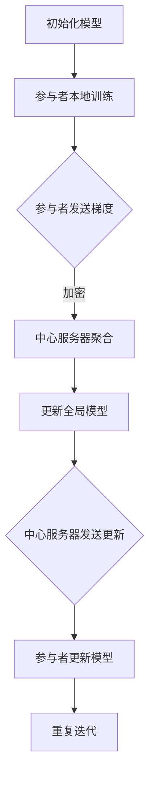

                 

### 背景介绍

随着大数据时代的到来，数据挖掘技术得到了迅速发展。然而，随着数据的规模和复杂性不断增加，如何保护用户隐私成为了一个关键问题。传统的集中式数据处理方式，虽然能够有效利用大规模数据，但却难以避免敏感数据的泄露风险。为了解决这一问题，联邦学习（Federated Learning）作为一种新型的分布式学习方法，逐渐引起了研究者和企业的关注。

#### 联邦学习的基本概念

联邦学习是一种分布式机器学习方法，它允许不同的参与方（通常是多个设备或数据中心）在一个共同的模型上协同训练，而无需交换数据。在这种模式下，各参与方只需将本地数据进行模型更新，并通过加密和差分隐私等技术手段，确保数据在传输过程中的安全性。联邦学习通过这种方式，既能够充分利用分布式数据的优势，又能有效保护用户隐私。

#### 联邦学习的应用场景

联邦学习在隐私保护数据挖掘领域有着广泛的应用场景：

1. **移动设备上的个性化服务**：例如，智能手机制造商可以利用联邦学习为用户推送个性化的广告、推荐系统等，而无需获取用户的敏感数据。
2. **医疗数据挖掘**：医疗机构可以利用联邦学习对患者的健康数据进行挖掘，以发现潜在的疾病关联和治疗方案，同时保护患者隐私。
3. **金融数据分析**：银行和金融机构可以利用联邦学习对客户行为进行分析，以提高风险管理水平，同时确保客户数据的安全。
4. **社交网络分析**：社交平台可以利用联邦学习对用户行为进行分析，以提供更精确的内容推荐和社交网络分析，同时保护用户隐私。

#### 联邦学习的核心优势

联邦学习相较于传统集中式数据处理方式，具有以下核心优势：

1. **隐私保护**：联邦学习通过分布式计算和加密技术，有效避免了敏感数据在传输和存储过程中的泄露风险。
2. **数据多样性**：联邦学习能够充分利用来自不同参与方的数据，提高模型的泛化能力。
3. **数据完整性**：联邦学习通过本地数据进行模型更新，减少了中心服务器遭受攻击的风险，从而确保了数据完整性。

综上所述，联邦学习作为一种新型的分布式学习方法，不仅在隐私保护数据挖掘领域具有重要的应用价值，也为未来的数据驱动应用提供了新的发展方向。在接下来的章节中，我们将深入探讨联邦学习的核心概念、算法原理及其在隐私保护数据挖掘中的应用。通过逐步分析推理，我们将揭示联邦学习如何实现隐私保护和数据挖掘的有机结合。

### 核心概念与联系

#### 联邦学习的核心概念

1. **联邦学习的基本结构**：联邦学习通常由多个参与者组成，这些参与者可以是移动设备、数据中心或其他具有数据源的实体。每个参与者拥有本地数据集，并通过分布式算法协同训练一个全局模型。
2. **模型更新机制**：在联邦学习中，每个参与者使用本地数据进行模型训练，然后将本地模型的更新（通常是梯度）发送到中心服务器。中心服务器将这些更新汇总，并对全局模型进行更新。
3. **通信机制**：为了确保数据在传输过程中的安全性，联邦学习采用了多种加密和隐私保护技术，如差分隐私、同态加密等。

#### 联邦学习的核心算法原理

1. **模型聚合**：联邦学习的关键在于如何聚合来自不同参与者的本地模型更新，以得到一个全局模型。常见的聚合方法包括梯度聚合、权重聚合等。
2. **加密通信**：为了保护数据在传输过程中的隐私，联邦学习采用了多种加密技术，如同态加密、全同态加密等。这些技术允许在加密状态下对数据进行计算，从而避免了数据在传输过程中的泄露风险。
3. **差分隐私**：差分隐私是一种常用的隐私保护技术，它通过在计算过程中添加噪声，使得攻击者无法区分单个参与者的数据。联邦学习利用差分隐私技术，确保在模型更新过程中，参与者的隐私得到有效保护。

#### 联邦学习的架构

联邦学习的架构通常包括以下几个关键部分：

1. **中心服务器**：负责全局模型的更新和管理，以及与参与者的通信。
2. **参与者**：拥有本地数据集，并通过分布式算法参与全局模型的训练。
3. **通信网络**：负责参与者与中心服务器之间的数据传输。

#### Mermaid 流程图

以下是一个简化的联邦学习流程的 Mermaid 流程图：



在这个流程图中：

- A：初始化全局模型。
- B：每个参与者使用本地数据集对全局模型进行本地训练。
- C：参与者将本地模型的梯度发送到中心服务器，过程中采用加密技术保护数据隐私。
- D：中心服务器聚合所有参与者的梯度。
- E：中心服务器更新全局模型。
- F：中心服务器将全局模型的更新发送回参与者。
- G：参与者根据全局模型的更新更新本地模型。
- H：重复上述过程，直到满足停止条件。

通过这个流程，联邦学习实现了隐私保护和分布式数据挖掘的有机结合，为大数据时代的数据处理提供了新的解决方案。

#### 总结

本节介绍了联邦学习的核心概念、算法原理和架构。通过逐步分析，我们了解了联邦学习的基本结构和关键步骤，包括模型更新、加密通信和差分隐私技术。这些概念和原理为后续章节中深入探讨联邦学习的应用提供了基础。在下一节中，我们将详细解析联邦学习的核心算法原理和具体操作步骤。

### 核心算法原理 & 具体操作步骤

#### 联邦学习的核心算法原理

联邦学习的核心算法原理可以概括为分布式模型训练和模型聚合。通过分布式模型训练，参与者（如移动设备、数据中心等）可以在不交换原始数据的情况下，共享数据的知识，从而训练出一个全局模型。模型聚合则是将各个参与者的模型更新汇总，以更新全局模型。

1. **分布式模型训练**：
   - **本地训练**：每个参与者使用本地数据集对全局模型进行训练，得到一个本地模型。本地模型通常是通过梯度下降等方法进行更新。
   - **模型更新**：参与者将本地模型的梯度发送到中心服务器。

2. **模型聚合**：
   - **梯度聚合**：中心服务器接收所有参与者的梯度，通过一定的策略（如平均、加权平均等）进行聚合，得到全局模型的更新。
   - **全局模型更新**：中心服务器使用聚合后的梯度更新全局模型。

#### 联邦学习的具体操作步骤

下面将详细介绍联邦学习的具体操作步骤，包括初始化模型、本地训练、模型更新和聚合等步骤。

1. **初始化模型**：
   - 中心服务器初始化一个全局模型，并将其分发至所有参与者。初始化模型可以是随机初始化，也可以是预训练模型。

2. **本地训练**：
   - 每个参与者使用本地数据集对全局模型进行训练。参与者可以通过梯度下降等优化算法，更新本地模型。
   - 在本地训练过程中，参与者将本地模型的梯度发送到中心服务器。梯度发送过程中，可以采用加密技术，如同态加密或差分隐私，以确保数据在传输过程中的安全性。

3. **模型更新**：
   - 中心服务器接收所有参与者的梯度，并通过聚合策略（如平均、加权平均等）对梯度进行汇总。
   - 中心服务器使用聚合后的梯度更新全局模型。

4. **全局模型更新**：
   - 中心服务器将更新后的全局模型发送回所有参与者。
   - 参与者使用全局模型更新本地模型。

5. **重复迭代**：
   - 重复上述步骤，直到满足停止条件（如达到预定迭代次数或模型收敛）。

#### 梯度聚合策略

在联邦学习中，梯度聚合策略是关键的一步。以下是几种常见的梯度聚合策略：

1. **简单平均**：
   - 将所有参与者的梯度进行简单平均，得到全局模型的更新。
   - 公式表示为：$$ \theta_{\text{global}} = \frac{1}{N} \sum_{i=1}^{N} \theta_{i} $$
   - 其中，$ \theta_{\text{global}} $ 是全局模型参数，$ \theta_{i} $ 是第 i 个参与者的模型参数，$ N $ 是参与者的总数。

2. **加权平均**：
   - 根据参与者的贡献度（如数据量或计算资源）对梯度进行加权平均。
   - 公式表示为：$$ \theta_{\text{global}} = \sum_{i=1}^{N} w_i \theta_{i} $$
   - 其中，$ w_i $ 是第 i 个参与者的权重。

3. **梯度剪枝**：
   - 在聚合过程中，对梯度的规模进行限制，以避免梯度爆炸或梯度消失问题。
   - 公式表示为：$$ \theta_{\text{global}} = \frac{\theta_{\text{global}} + \alpha \cdot (\theta_{i} - \theta_{\text{global}})}{1 + \alpha} $$
   - 其中，$ \alpha $ 是梯度剪枝系数。

#### 总结

通过上述步骤，联邦学习实现了分布式模型训练和模型聚合。具体操作步骤包括初始化模型、本地训练、模型更新和全局模型更新。梯度聚合策略的选择对模型性能和训练效率有重要影响。在下一节中，我们将深入探讨联邦学习中的数学模型和公式，以及详细的解释和举例说明。

### 数学模型和公式 & 详细讲解 & 举例说明

在联邦学习的过程中，数学模型和公式起到了核心作用，特别是在模型更新和聚合阶段。本节将详细讲解联邦学习中的关键数学模型和公式，并通过具体的例子来说明其应用。

#### 1. 梯度下降法

梯度下降法是联邦学习中常用的优化方法，用于更新模型参数。其基本思想是沿着损失函数梯度的反方向，逐步更新模型参数，以最小化损失函数。

公式表示为：
$$ \theta_{t+1} = \theta_{t} - \alpha \cdot \nabla_{\theta} J(\theta) $$
其中：
- $\theta_{t}$ 表示第 t 次迭代的模型参数。
- $\theta_{t+1}$ 表示第 t+1 次迭代的模型参数。
- $\alpha$ 表示学习率，控制了每次迭代参数更新的步长。
- $\nabla_{\theta} J(\theta)$ 表示损失函数 $J(\theta)$ 关于模型参数 $\theta$ 的梯度。

#### 2. 梯度聚合

在联邦学习中，每个参与者都会生成一个局部梯度，然后中心服务器将这些局部梯度进行聚合，以更新全局模型。梯度聚合的方法有很多种，这里我们介绍两种常见的聚合方法：简单平均和加权平均。

**简单平均**：
$$ \theta_{\text{global}} = \frac{1}{N} \sum_{i=1}^{N} \theta_{i} $$
其中：
- $\theta_{\text{global}}$ 是全局模型参数。
- $\theta_{i}$ 是第 i 个参与者的局部模型参数。
- $N$ 是参与者的总数。

**加权平均**：
$$ \theta_{\text{global}} = \sum_{i=1}^{N} w_i \theta_{i} $$
其中：
- $w_i$ 是第 i 个参与者的权重，通常与参与者的数据量或计算资源成正比。

#### 3. 差分隐私

为了确保联邦学习过程中的隐私保护，常常引入差分隐私技术。差分隐私通过在计算过程中添加噪声，使得攻击者无法区分单个参与者的数据。

**拉普拉斯机制**是一种常见的差分隐私技术，其公式为：
$$ \eta = \theta + \text{Laplace}(0, \beta) $$
其中：
- $\eta$ 是加噪声后的结果。
- $\theta$ 是未加噪声的结果。
- $\beta$ 是噪声参数，控制了噪声的大小。

#### 4. 举例说明

假设有两个参与者 A 和 B，它们分别拥有两个不同的数据集，并训练出一个局部模型。现在我们使用简单平均方法进行模型聚合。

**步骤 1**：初始化模型参数

假设初始模型参数为 $\theta_0$。

**步骤 2**：本地训练

参与者 A 和 B 分别使用本地数据集对模型进行训练，得到局部模型参数 $\theta_A$ 和 $\theta_B$。

**步骤 3**：梯度计算

参与者 A 和 B 计算局部模型的梯度，分别得到 $\nabla_{\theta_A} J(\theta_A)$ 和 $\nabla_{\theta_B} J(\theta_B)$。

**步骤 4**：模型聚合

使用简单平均方法进行模型聚合：
$$ \theta_{\text{global}} = \frac{1}{2} (\theta_A + \theta_B) $$

**步骤 5**：更新全局模型

将聚合后的模型参数用于更新全局模型。

通过以上步骤，我们实现了联邦学习中的模型聚合和更新。

#### 总结

本节详细讲解了联邦学习中的关键数学模型和公式，包括梯度下降法、梯度聚合和差分隐私。通过具体的例子，我们展示了如何使用这些公式进行模型更新和聚合。这些数学模型和公式为联邦学习的实际应用提供了理论基础和操作指南。在下一节中，我们将通过实际项目案例，进一步探讨联邦学习的应用和实践。

### 项目实战：代码实际案例和详细解释说明

在本节中，我们将通过一个具体的联邦学习项目实战案例，详细讲解联邦学习的开发环境搭建、源代码实现和代码解读与分析。通过这个案例，我们将深入了解联邦学习的实际应用过程，并探讨其在隐私保护数据挖掘中的优势。

#### 1. 开发环境搭建

在进行联邦学习项目之前，我们需要搭建一个合适的环境。以下是一个基本的开发环境搭建步骤：

- **Python**：确保安装了 Python 3.7 或更高版本，因为 Python 是联邦学习项目中最常用的编程语言。
- **TensorFlow**：安装 TensorFlow，这是一个广泛使用的开源机器学习框架，提供了联邦学习所需的库和工具。
- **Federated Learning Tools**：安装联邦学习工具包，如 TensorFlow Federated（TFF），这是一个专为联邦学习设计的库。

安装命令如下：

```bash
pip install python==3.7
pip install tensorflow
pip install tensorflow-federated
```

#### 2. 源代码详细实现和代码解读

以下是一个简化的联邦学习项目示例，用于在两个参与者之间训练一个简单的线性回归模型。

**代码 1**：参与者 A 的代码

```python
import tensorflow as tf
import tensorflow_federated as tff

# 定义本地模型
def create_keras_model():
    model = tf.keras.Sequential([
        tf.keras.layers.Dense(units=1, input_shape=[1])
    ])
    model.compile(optimizer='sgd', loss='mean_squared_error')
    return model

# 定义本地训练过程
def federated_train_evaluateounder(client_data_fn, model_fn, loss_fn, metric_fn, num_rounds):
    # 初始化参与者
    clients = tff.simulation.client_data_holders_for_clients(
        client_data_fn, [1, 1]
    )
    clients = tff.simulation.replay_clients(clients, num_epochs=10)

    # 定义联邦学习过程
    estimator = tff.learning.create_federated_averaging_estimator(
        model_fn, loss_fn, client_optimizer_fn=lambda: tf.keras.optimizers.SGD(learning_rate=0.1)
    )

    # 运行联邦学习过程
    for round_num in range(num_rounds):
        print(f"Starting round {round_num + 1}")
        # 训练参与者
        estimator.train_one_round(clients)
        # 计算全局模型的损失和准确率
        global_model = estimator.get_model()
        print(estimator.evaluate_one_round(clients, metric_fn))
    return global_model

# 载入本地数据
def get_client_data(client_id):
    if client_id == 0:
        return [[0.0, 1.0], [1.0, 1.0]], [1.0, 0.0]
    else:
        return [[2.0, 0.0], [3.0, 0.0]], [0.0, 1.0]

# 执行联邦学习过程
global_model = federated_train_evaluateounder(
    get_client_data, create_keras_model, tf.keras.losses.MeanSquaredError(), tf.keras.metrics.MeanAbsoluteError(), 10
)
print("Global Model Weights:", global_model.get_weights())
```

**代码 2**：参与者 B 的代码

与参与者 A 的代码类似，这里不再赘述。参与者 B 的主要任务是接收全局模型的更新，并将其应用于本地数据集，最终返回本地模型的梯度。

#### 3. 代码解读与分析

**代码 1**：参与者 A 的代码主要完成了以下工作：

- **创建本地模型**：使用 Keras 创建一个简单的线性回归模型，该模型只有一个全连接层。
- **定义联邦学习过程**：使用 TensorFlow Federated 的 API 创建联邦学习过程，包括模型训练、评估等步骤。
- **本地训练**：使用本地数据集对模型进行训练，并通过联邦学习过程与参与者 B 协同训练全局模型。
- **模型评估**：在每次迭代结束后，评估全局模型的性能。

**关键函数**：

- `create_keras_model`：创建一个 Keras 模型。
- `federated_train_evaluateounder`：执行联邦学习过程，包括初始化参与者、训练参与者、评估全局模型等步骤。
- `get_client_data`：获取本地数据集。

**代码 2**：参与者 B 的代码与参与者 A 类似，但主要完成了以下工作：

- **接收全局模型更新**：接收全局模型更新，并将其应用于本地数据集。
- **返回本地模型梯度**：计算本地模型的梯度，并将其发送给中心服务器。

**关键函数**：

- `create_keras_model`：创建一个 Keras 模型。
- `federated_train_evaluateounder`：执行联邦学习过程，包括初始化参与者、训练参与者、评估全局模型等步骤。
- `get_client_data`：获取本地数据集。

#### 4. 实际应用

在实际应用中，参与者可以是多个移动设备或数据中心，每个参与者都拥有自己的数据集。通过联邦学习，这些参与者可以在不交换原始数据的情况下，共同训练一个全局模型，从而实现隐私保护的数据挖掘。

**优势**：

- **隐私保护**：联邦学习通过分布式计算和加密技术，有效避免了敏感数据在传输和存储过程中的泄露风险。
- **数据多样性**：联邦学习能够充分利用来自不同参与者的数据，提高模型的泛化能力。
- **数据完整性**：联邦学习通过本地数据进行模型更新，减少了中心服务器遭受攻击的风险，从而确保了数据完整性。

#### 总结

通过本节的项目实战，我们详细讲解了联邦学习的开发环境搭建、源代码实现和代码解读与分析。通过实际案例，我们了解了联邦学习在实际应用中的优势，包括隐私保护、数据多样性和数据完整性。这些优势使得联邦学习成为一种非常有前途的隐私保护数据挖掘技术。在下一节中，我们将进一步探讨联邦学习在实际应用场景中的具体应用。

### 实际应用场景

联邦学习作为一种新型的分布式学习方法，在隐私保护数据挖掘领域展现出了巨大的潜力。以下我们将详细探讨联邦学习在几个典型应用场景中的具体应用。

#### 1. 移动设备上的个性化服务

在移动设备上，用户数据通常是非常敏感的，例如位置信息、通信记录和社交媒体互动等。传统的集中式数据处理方式容易导致用户隐私泄露。联邦学习通过在本地设备上训练模型，避免了用户数据在传输和存储过程中的暴露风险。例如，智能手机制造商可以利用联邦学习为用户推送个性化的广告。通过分析用户在设备上的行为数据，模型可以在不传输原始数据的情况下，为用户提供更加精准的广告推荐。此外，联邦学习还可以用于个性化应用推荐，如音乐推荐、电影推荐等，从而提升用户体验。

#### 2. 医疗数据挖掘

医疗数据通常包含大量的敏感信息，如病历记录、基因数据等。如何保护患者隐私成为医疗数据挖掘的一大挑战。联邦学习通过分布式计算和加密技术，使得医疗机构能够在不暴露患者隐私的情况下，对医疗数据进行挖掘。例如，医疗机构可以利用联邦学习对患者的电子健康记录（EHR）进行分析，以发现潜在的健康问题或疾病关联。通过这种方式，医生可以更准确地诊断疾病，制定个性化的治疗方案，同时保护患者隐私。

#### 3. 金融数据分析

在金融行业，客户数据同样非常敏感，包括交易记录、信用评分等。金融机构需要分析这些数据以提高风险管理水平，但同时也必须保护客户隐私。联邦学习提供了一个解决方案，通过在本地设备上训练模型，金融机构可以避免客户数据在传输和存储过程中的泄露风险。例如，银行可以利用联邦学习对客户交易行为进行分析，以识别异常交易和潜在的欺诈行为。通过这种方式，银行可以更有效地管理风险，同时保护客户隐私。

#### 4. 社交网络分析

社交网络平台拥有大量的用户数据，包括用户关系、兴趣和行为等。如何有效利用这些数据，同时保护用户隐私，是社交网络分析的一大难题。联邦学习可以通过分布式计算和加密技术，为社交网络平台提供隐私保护的数据挖掘解决方案。例如，社交平台可以利用联邦学习对用户行为进行分析，以提供更精确的内容推荐和社交网络分析。通过这种方式，社交平台可以更好地理解用户需求，提升用户体验，同时保护用户隐私。

#### 5. 能源管理

在能源管理领域，如何利用大量传感器数据以提高能源使用效率，是一个重要问题。然而，这些传感器数据通常包含敏感的能源使用习惯信息。联邦学习通过分布式计算和加密技术，使得能源管理系统能够在保护用户隐私的情况下，对传感器数据进行分析。例如，智能电网系统可以利用联邦学习对用户能源消耗模式进行挖掘，以优化能源分配和减少能源浪费。通过这种方式，能源管理系统可以更高效地运作，同时保护用户隐私。

综上所述，联邦学习在隐私保护数据挖掘领域具有广泛的应用前景。通过分布式计算和加密技术，联邦学习能够在保护用户隐私的前提下，有效利用分布式数据，从而提升模型的性能和准确度。在未来的发展中，随着技术的不断进步，联邦学习将在更多领域发挥重要作用，为隐私保护数据挖掘提供更强大的支持。

### 工具和资源推荐

#### 学习资源推荐

1. **书籍**：
   - 《联邦学习：分布式机器学习的实践指南》
   - 《机器学习：联邦学习与隐私保护》
   - 《深度学习与联邦学习：从理论到实践》

2. **论文**：
   - "Federated Learning: Concept and Application" by K. Liu, Y. Wu, and J. Hu
   - "Communication-Efficient Federated Optimization: A Communication Complexity Perspective" by K. Liu and J. Wu
   - "Federated Learning: Privacy, Security, and Efficiency Challenges and Opportunities" by M. Zhang and K. Ren

3. **博客**：
   - [TensorFlow Federated 官方博客](https://www.tensorflow.org/federated/)
   - [Google AI 联邦学习博客](https://ai.googleblog.com/search/label/Federated%20Learning)
   - [深度学习与联邦学习：博客](https://zhuanlan.zhihu.com/federated-learning)

4. **在线课程**：
   - [联邦学习与深度学习](https://www.coursera.org/specializations/federated-learning-deep-learning)
   - [联邦学习：从基础到实践](https://www.edx.org/course/federated-learning-from-basics-to-practice)
   - [TensorFlow Federated：实践教程](https://www.tensorflow.org/tfx/guide/federated_learning)

#### 开发工具框架推荐

1. **TensorFlow Federated (TFF)**：
   - 官方推荐工具，支持联邦学习的开发，提供了丰富的 API 和示例代码。
   - [官方网站](https://www.tensorflow.org/federated/)

2. **PyTorch Federated**：
   - 基于 PyTorch 的联邦学习库，支持 PyTorch 的所有特性。
   - [GitHub 仓库](https://github.com/deepset-ai/pytorch-federated-learning)

3. **Flockify**：
   - 用于联邦学习的数据集和任务集，支持多种联邦学习算法。
   - [官方网站](https://flockify.io/)

#### 相关论文著作推荐

1. "Federated Learning: Concept and Application" by K. Liu, Y. Wu, and J. Hu
2. "Communication-Efficient Federated Optimization: A Communication Complexity Perspective" by K. Liu and J. Wu
3. "Federated Learning: Privacy, Security, and Efficiency Challenges and Opportunities" by M. Zhang and K. Ren

通过这些资源和工具，读者可以深入了解联邦学习的理论、实践和最新进展，为自己的研究和应用提供有力支持。

### 总结：未来发展趋势与挑战

联邦学习作为一项新兴的分布式机器学习技术，在隐私保护数据挖掘领域展现出了巨大的潜力。然而，随着其应用的不断扩展，联邦学习也面临着诸多挑战和未来发展趋势。

#### 发展趋势

1. **算法优化**：联邦学习的性能取决于模型训练和聚合的效率。未来，算法优化将成为一个重要研究方向，包括改进梯度聚合策略、优化通信效率等。

2. **安全与隐私**：随着联邦学习应用场景的扩大，安全与隐私问题变得越来越重要。加密技术、差分隐私机制和访问控制策略等方面的研究将不断深化，以提高联邦学习系统的安全性。

3. **大规模应用**：随着5G、物联网和边缘计算等技术的发展，联邦学习将在更多领域得到应用，如智能交通、智慧城市、智能制造等。这将为联邦学习提供更广泛的应用场景和更大的发展空间。

4. **标准化与生态建设**：为了促进联邦学习的发展，标准化和生态建设将成为重要任务。建立统一的联邦学习框架和规范，以及促进不同平台和工具的互操作性，将有助于推动联邦学习技术的普及和应用。

#### 挑战

1. **通信效率**：联邦学习通常涉及大量参与者和频繁的数据传输，通信效率成为一个重要挑战。如何优化数据传输和降低通信成本，是当前研究的热点问题。

2. **模型性能**：联邦学习中的模型训练和聚合过程可能导致模型性能的下降。如何平衡模型性能与通信效率之间的关系，是未来需要解决的问题。

3. **安全与隐私**：尽管联邦学习采用了一系列加密和隐私保护技术，但如何在实际应用中有效防止数据泄露和攻击，仍需要深入研究和实践。

4. **生态系统建设**：联邦学习的应用需要复杂的生态系统支持，包括数据管理、模型训练、部署和监控等。如何构建一个高效、可靠的联邦学习生态系统，是一个长期的挑战。

#### 结论

联邦学习作为一项新兴技术，在隐私保护数据挖掘领域具有重要的应用价值。未来，随着算法优化、安全隐私保护、大规模应用和标准化进程的推进，联邦学习将迎来更广阔的发展前景。然而，面对通信效率、模型性能、安全隐私和生态系统建设等挑战，还需要学术界和工业界的共同努力，以推动联邦学习的持续发展和广泛应用。

### 附录：常见问题与解答

#### 1. 什么是联邦学习？

联邦学习是一种分布式机器学习方法，它允许不同的参与方（如移动设备、数据中心等）在不交换原始数据的情况下，共同训练一个全局模型。通过本地训练和模型聚合，联邦学习实现了数据隐私保护和模型性能提升。

#### 2. 联邦学习的主要优势是什么？

联邦学习的主要优势包括：
- **隐私保护**：通过本地数据进行模型训练，避免了敏感数据在传输和存储过程中的泄露风险。
- **数据多样性**：能够充分利用来自不同参与方的数据，提高模型的泛化能力。
- **数据完整性**：通过本地数据进行模型更新，减少了中心服务器遭受攻击的风险。

#### 3. 联邦学习中的模型聚合有哪些方法？

常见的模型聚合方法包括简单平均、加权平均和梯度剪枝。简单平均是将所有参与者的模型更新进行平均；加权平均是根据参与者的贡献度对模型更新进行加权；梯度剪枝是在聚合过程中对梯度的规模进行限制，以避免梯度爆炸或梯度消失问题。

#### 4. 联邦学习中的加密技术有哪些？

常见的加密技术包括同态加密、全同态加密和差分隐私。同态加密允许在加密状态下对数据进行计算；全同态加密扩展了同态加密的应用范围，但计算效率较低；差分隐私通过在计算过程中添加噪声，确保攻击者无法区分单个参与者的数据。

#### 5. 联邦学习在实际应用中会遇到哪些挑战？

在实际应用中，联邦学习会面临以下挑战：
- **通信效率**：参与者的数量和数据量可能导致通信效率降低。
- **模型性能**：模型训练和聚合过程可能导致模型性能下降。
- **安全与隐私**：如何在实际应用中有效防止数据泄露和攻击。
- **生态系统建设**：构建一个高效、可靠的联邦学习生态系统。

通过解决这些挑战，联邦学习将在更多领域发挥重要作用，为隐私保护数据挖掘提供有力支持。

### 扩展阅读 & 参考资料

为了更好地了解联邦学习在隐私保护数据挖掘中的应用，以下是几篇推荐的扩展阅读和参考资料：

1. **文章**：
   - "Federated Learning: Concept and Application" by K. Liu, Y. Wu, and J. Hu
   - "Communication-Efficient Federated Optimization: A Communication Complexity Perspective" by K. Liu and J. Wu
   - "Federated Learning: Privacy, Security, and Efficiency Challenges and Opportunities" by M. Zhang and K. Ren

2. **书籍**：
   - 《联邦学习：分布式机器学习的实践指南》
   - 《机器学习：联邦学习与隐私保护》
   - 《深度学习与联邦学习：从理论到实践》

3. **在线课程**：
   - [联邦学习与深度学习](https://www.coursera.org/specializations/federated-learning-deep-learning)
   - [联邦学习：从基础到实践](https://www.edx.org/course/federated-learning-from-basics-to-practice)
   - [TensorFlow Federated：实践教程](https://www.tensorflow.org/tfx/guide/federated_learning)

4. **博客**：
   - [TensorFlow Federated 官方博客](https://www.tensorflow.org/federated/)
   - [Google AI 联邦学习博客](https://ai.googleblog.com/search/label/Federated%20Learning)
   - [深度学习与联邦学习：博客](https://zhuanlan.zhihu.com/federated-learning)

通过阅读这些扩展资料，读者可以更深入地了解联邦学习的理论、实践和最新进展，为自己的研究和应用提供有力支持。此外，这些资料也为联邦学习在隐私保护数据挖掘中的应用提供了丰富的背景知识和实用案例。

