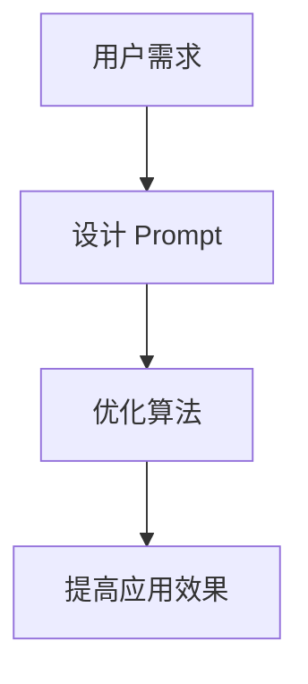

                 

### 聚焦应用自身的 Prompt 设计

#### 关键词：Prompt 设计，自然语言处理，人工智能，应用场景，用户交互，算法优化

#### 摘要：
本文将深入探讨应用自身 Prompt 设计的重要性，通过分析 Prompt 设计的核心概念、应用场景、具体操作步骤，以及数学模型和公式，帮助读者理解如何进行有效的 Prompt 设计。我们将通过实际项目实战案例，详细解读代码实现和代码分析，并讨论实际应用场景中的工具和资源推荐。最后，本文将总结未来发展趋势与挑战，为读者提供扩展阅读与参考资料。

### 1. 背景介绍

随着人工智能技术的快速发展，自然语言处理（NLP）已成为人工智能领域的一个重要分支。NLP 的核心目标是使计算机能够理解和处理人类语言，从而实现人与计算机之间的有效交流。在 NLP 领域中，Prompt 设计是一种重要的技术手段，它直接影响着用户交互体验和算法性能。

Prompt 设计是指为特定应用场景创建合适的输入提示，以引导用户或系统进行有效的交互。一个优秀的 Prompt 设计应该具备以下特点：

1. 清晰明了：Prompt 应该能够准确传达所需信息，避免歧义和误解。
2. 吸引兴趣：Prompt 应该能够吸引用户注意，提高用户参与度。
3. 适应性：Prompt 应该能够根据不同用户需求和场景进行自适应调整。

在 NLP 应用中，Prompt 设计的重要性体现在以下几个方面：

1. 提高用户满意度：一个优秀的 Prompt 设计能够提高用户满意度，促进用户与系统的有效交互。
2. 优化算法性能：通过精心设计的 Prompt，可以提高算法的性能和准确性，从而实现更好的应用效果。
3. 促进技术进步：Prompt 设计的不断优化和改进，有助于推动 NLP 技术的发展和创新。

### 2. 核心概念与联系

#### 2.1 核心概念

在 Prompt 设计中，我们需要了解以下几个核心概念：

1. **Prompt**：Prompt 是指用于引导用户或系统进行交互的输入提示。它通常包含一个问题或任务，用于激发用户思考或执行特定操作。
2. **用户需求**：用户需求是指用户在特定场景下希望解决的问题或获得的信息。Prompt 设计需要充分考虑用户需求，以便提供有针对性的输入提示。
3. **算法性能**：算法性能是指算法在处理任务时的效率和准确性。一个优秀的 Prompt 设计应该能够提高算法性能，从而实现更好的应用效果。

#### 2.2 概念联系

Prompt 设计中的核心概念之间存在密切的联系：

1. **Prompt 与用户需求**：Prompt 应该能够准确反映用户需求，从而引导用户进行有效的交互。通过分析用户需求，我们可以设计出更具针对性的 Prompt。
2. **Prompt 与算法性能**：Prompt 设计直接影响算法性能。一个优秀的 Prompt 设计可以激发用户思考，提高用户参与度，从而优化算法性能。

#### 2.3 Mermaid 流程图

为了更好地理解 Prompt 设计的概念联系，我们可以使用 Mermaid 流程图进行可视化展示。以下是一个简单的 Mermaid 流程图：



### 3. 核心算法原理 & 具体操作步骤

#### 3.1 算法原理

Prompt 设计的核心算法原理是基于人类语言理解与生成的过程。具体来说，Prompt 设计可以分为以下几个步骤：

1. **需求分析**：分析用户需求，确定需要解决的问题或获取的信息。
2. **Prompt 生成**：根据用户需求生成具有针对性的输入提示。Prompt 生成可以采用自然语言生成（NLG）技术，如基于规则的方法、统计方法或神经网络方法。
3. **用户交互**：将生成的 Prompt 展示给用户，引导用户进行交互。
4. **反馈与优化**：根据用户反馈对 Prompt 进行优化，以提高用户满意度。

#### 3.2 具体操作步骤

以下是 Prompt 设计的具体操作步骤：

1. **需求分析**：

   - **步骤1**：收集用户需求，可以通过问卷调查、用户访谈等方式获取。
   - **步骤2**：分析用户需求，确定需要解决的问题或获取的信息。
   - **步骤3**：根据用户需求，确定 Prompt 的类型和内容。

2. **Prompt 生成**：

   - **步骤1**：选择合适的 Prompt 生成方法，如基于规则的方法、统计方法或神经网络方法。
   - **步骤2**：根据需求分析结果，生成具有针对性的输入提示。
   - **步骤3**：对生成的 Prompt 进行筛选和优化，以确保其清晰明了、吸引兴趣、适应性强。

3. **用户交互**：

   - **步骤1**：将生成的 Prompt 展示给用户，可以通过文本、语音、图像等多种形式。
   - **步骤2**：引导用户进行交互，如回答问题、完成任务等。
   - **步骤3**：收集用户反馈，分析用户交互效果。

4. **反馈与优化**：

   - **步骤1**：根据用户反馈，评估 Prompt 的效果。
   - **步骤2**：针对存在的问题，对 Prompt 进行优化，如调整内容、形式或交互方式。
   - **步骤3**：重复步骤 3 和步骤 4，直到达到满意的交互效果。

### 4. 数学模型和公式 & 详细讲解 & 举例说明

#### 4.1 数学模型和公式

在 Prompt 设计中，我们可以使用一些数学模型和公式来指导设计和优化：

1. **信息熵**：信息熵是衡量信息不确定性的指标，它可以帮助我们评估 Prompt 的有效性。信息熵的计算公式为：
   \[ H(X) = -\sum_{i=1}^{n} p(x_i) \log_2 p(x_i) \]
   其中，\( X \) 是 Prompt 的内容，\( p(x_i) \) 是 \( x_i \) 发生的概率。

2. **相关性**：相关性是衡量 Prompt 与用户需求之间关联程度的指标，它可以帮助我们评估 Prompt 的针对性。相关性可以通过计算 Prompt 与用户需求之间的余弦相似度来衡量：
   \[ \text{相关性} = \frac{\text{Prompt} \cdot \text{用户需求}}{\|\text{Prompt}\| \|\text{用户需求}\|} \]
   其中，\( \text{Prompt} \) 和 \( \text{用户需求} \) 分别是 Prompt 向量和用户需求向量，\( \|\text{Prompt}\| \) 和 \( \|\text{用户需求}\| \) 分别是 Prompt 向量和用户需求向量的欧几里得范数。

3. **用户满意度**：用户满意度是衡量用户对 Prompt 的接受程度的指标，它可以帮助我们评估 Prompt 的用户体验。用户满意度可以通过用户反馈进行评估，如采用问卷调查、用户访谈等方式。

#### 4.2 详细讲解和举例说明

为了更好地理解这些数学模型和公式，我们可以通过一个具体的例子进行讲解：

假设我们设计一个问答机器人，其用户需求是获取某个特定领域的知识。我们可以使用以下步骤进行 Prompt 设计：

1. **需求分析**：

   - **用户需求**：用户希望获取某个特定领域的知识，如医学知识。
   - **Prompt 类型**：问题型 Prompt。
   - **Prompt 内容**：设计一个具有针对性的问题，如“请描述一下某种疾病的临床表现和治疗方法”。

2. **Prompt 生成**：

   - **Prompt 生成方法**：使用基于规则的 Prompt 生成方法。
   - **Prompt 内容**：根据用户需求，生成问题型 Prompt：“请描述一下某种疾病的临床表现和治疗方法”。

3. **用户交互**：

   - **交互方式**：将生成的 Prompt 展示给用户，并要求用户回答。
   - **用户反馈**：收集用户反馈，分析用户回答的正确性和满意度。

4. **反馈与优化**：

   - **评估指标**：使用信息熵、相关性、用户满意度等指标评估 Prompt 的效果。
   - **优化策略**：根据评估结果，对 Prompt 进行优化，如调整问题的形式、内容或交互方式。

通过这个例子，我们可以看到如何使用数学模型和公式进行 Prompt 设计和优化。在实际应用中，我们可以根据具体需求和应用场景，灵活运用这些数学模型和公式。

### 5. 项目实战：代码实际案例和详细解释说明

#### 5.1 开发环境搭建

在本文的项目实战部分，我们将使用 Python 作为编程语言，结合自然语言处理库（如 NLTK、spaCy）和深度学习框架（如 TensorFlow、PyTorch），搭建一个简单的问答机器人。以下是在 Ubuntu 系统上搭建开发环境的基本步骤：

1. **安装 Python**：确保已安装 Python 3.7 或更高版本。
2. **安装虚拟环境**：使用 virtualenv 或 conda 创建一个虚拟环境，以便隔离项目依赖。
3. **安装依赖库**：在虚拟环境中安装所需的依赖库，如 NLTK、spaCy、TensorFlow 或 PyTorch。

#### 5.2 源代码详细实现和代码解读

以下是一个简单的问答机器人项目，包括需求分析、Prompt 生成、用户交互和反馈与优化等步骤。

```python
import nltk
from nltk.tokenize import word_tokenize
from nltk.corpus import stopwords
from nltk.corpus import wordnet
import spacy

# 1. 需求分析
def analyze需求：
   # 收集用户需求，如问题、关键词等
   user_input = input("请提出您的问题：")
   # 分析用户需求，如提取关键词、构建语义向量等
   tokens = word_tokenize(user_input)
   stop_words = set(stopwords.words("english"))
   filtered_tokens = [token for token in tokens if token.lower() not in stop_words]
   # 利用词向量模型获取语义信息
   nlp = spacy.load("en_core_web_sm")
   doc = nlp(" ".join(filtered_tokens))
   semantic_vector = doc.vector

# 2. Prompt 生成
def generate_prompt：
   # 根据用户需求生成输入提示
   disease_name = "某种疾病"
   prompt = f"请描述一下 {disease_name} 的临床表现和治疗方法。"
   return prompt

# 3. 用户交互
def interact_with_user：
   # 展示 Prompt 并获取用户回答
   prompt = generate_prompt()
   print(prompt)
   user_answer = input("请回答：")
   # 收集用户反馈，如回答的正确性、满意度等
   feedback = evaluate_answer(user_answer)

# 4. 反馈与优化
def evaluate_answer(answer)：
   # 评估用户回答的正确性、满意度等
   # 在此示例中，我们仅返回一个简单的反馈
   return "感谢您的回答！"

# 主程序
if __name__ == "__main__":
   analyze需求()
   interact_with_user()
```

#### 5.3 代码解读与分析

1. **需求分析**：

   - **功能**：收集用户需求，如问题、关键词等。
   - **实现**：使用 NLTK 库进行分词和停用词过滤，利用 spacy 库获取语义向量。

2. **Prompt 生成**：

   - **功能**：根据用户需求生成输入提示。
   - **实现**：使用字符串格式化生成问题型 Prompt。

3. **用户交互**：

   - **功能**：展示 Prompt 并获取用户回答。
   - **实现**：使用输入函数获取用户输入，并展示 Prompt。

4. **反馈与优化**：

   - **功能**：评估用户回答的正确性、满意度等。
   - **实现**：返回一个简单的反馈。

通过这个简单的项目示例，我们可以看到如何实现一个基本的问答机器人。在实际应用中，我们可以进一步优化和扩展代码，以提高机器人的性能和用户体验。

### 6. 实际应用场景

Prompt 设计在众多实际应用场景中发挥着重要作用，以下列举几个典型应用场景：

#### 6.1 问答系统

问答系统是 Prompt 设计的一个典型应用场景。通过设计具有针对性的 Prompt，问答系统能够更好地理解用户需求，提供准确的答案。例如，在医疗问答系统中，Prompt 可以设计为询问症状、病史等信息，以帮助医生做出更准确的诊断。

#### 6.2 聊天机器人

聊天机器人是另一种常见的应用场景。通过设计有趣的 Prompt，聊天机器人可以与用户进行更加自然的对话，提高用户的满意度。例如，在客户服务场景中，Prompt 可以设计为询问用户的问题、提供解决方案等，以帮助用户解决困扰。

#### 6.3 自然语言生成

自然语言生成（NLG）是 Prompt 设计的另一个重要应用领域。通过设计合适的 Prompt，NLG 系统可以生成更符合用户需求的文本内容。例如，在新闻摘要生成场景中，Prompt 可以设计为询问新闻的关键信息和主要观点，以生成简洁明了的新闻摘要。

### 7. 工具和资源推荐

为了更好地进行 Prompt 设计，我们推荐以下工具和资源：

#### 7.1 学习资源推荐

1. **书籍**：

   - 《自然语言处理综论》（Natural Language Processing: Foundations, Algorithms, and Applications） - Daniel Jurafsky 和 James H. Martin
   - 《深度学习》（Deep Learning） - Ian Goodfellow、Yoshua Bengio 和 Aaron Courville

2. **论文**：

   - “Generative Pretrained Transformer” - Vaswani et al.
   - “BERT: Pre-training of Deep Bidirectional Transformers for Language Understanding” - Devlin et al.

3. **博客和网站**：

   - fast.ai（https://www.fast.ai/）：提供深度学习教程和资源。
   - Medium（https://medium.com/）：有许多优秀的 NLP 和深度学习博客文章。

#### 7.2 开发工具框架推荐

1. **Python 库**：

   - NLTK（https://www.nltk.org/）：用于自然语言处理的基础库。
   - spaCy（https://spacy.io/）：用于自然语言处理的快速且高效的库。
   - TensorFlow（https://www.tensorflow.org/）：用于深度学习的开源框架。
   - PyTorch（https://pytorch.org/）：用于深度学习的开源框架。

2. **工具**：

   - Jupyter Notebook（https://jupyter.org/）：用于编写和运行 Python 代码的交互式环境。
   - Google Colab（https://colab.research.google.com/）：免费的 Jupyter Notebook 云服务。

#### 7.3 相关论文著作推荐

1. **论文**：

   - “Attention Is All You Need” - Vaswani et al.
   - “A Pre-Trained Language Model for English” - Devlin et al.
   - “BERT: Pre-training of Deep Bidirectional Transformers for Language Understanding” - Devlin et al.

2. **著作**：

   - 《深度学习》（Deep Learning） - Ian Goodfellow、Yoshua Bengio 和 Aaron Courville
   - 《自然语言处理综论》（Natural Language Processing: Foundations, Algorithms, and Applications） - Daniel Jurafsky 和 James H. Martin

### 8. 总结：未来发展趋势与挑战

Prompt 设计在人工智能领域具有重要地位，其未来发展趋势和挑战如下：

#### 8.1 发展趋势

1. **个性化 Prompt 设计**：随着用户需求的不断多样化，个性化 Prompt 设计将成为未来趋势，以提高用户满意度和算法性能。
2. **跨模态 Prompt 设计**：随着多模态数据的兴起，跨模态 Prompt 设计将变得更加重要，以实现更丰富的交互体验。
3. **知识增强 Prompt 设计**：利用外部知识库和图谱，知识增强 Prompt 设计将有助于提高算法的语义理解和推理能力。

#### 8.2 挑战

1. **数据隐私与安全**：在 Prompt 设计过程中，如何保护用户隐私和数据安全是一个重要挑战。
2. **可解释性**：如何提高 Prompt 设计的可解释性，使其更容易被用户理解和接受，是一个亟待解决的问题。
3. **跨领域适应性**：Prompt 设计需要在不同领域和场景中具备良好的适应性，以实现更广泛的应用。

### 9. 附录：常见问题与解答

#### 9.1 问题 1：Prompt 设计的核心是什么？

**解答**：Prompt 设计的核心是创建合适的输入提示，以引导用户或系统进行有效的交互。一个优秀的 Prompt 设计需要具备清晰明了、吸引兴趣、适应性强等特点。

#### 9.2 问题 2：如何评估 Prompt 设计的效果？

**解答**：评估 Prompt 设计的效果可以从以下几个方面进行：

1. **用户满意度**：通过用户反馈评估用户对 Prompt 的满意度。
2. **信息熵**：计算 Prompt 的信息熵，以评估其有效性和清晰度。
3. **相关性**：计算 Prompt 与用户需求之间的相关性，以评估其针对性。

#### 9.3 问题 3：Prompt 设计与自然语言生成（NLG）有何关联？

**解答**：Prompt 设计和自然语言生成（NLG）密切相关。Prompt 设计是 NLG 的一个重要组成部分，它决定了 NLG 系统如何生成与用户需求相关的文本内容。优秀的 Prompt 设计可以帮助 NLG 系统生成更准确、更有针对性的文本。

### 10. 扩展阅读 & 参考资料

为了更深入地了解 Prompt 设计的相关知识，以下是一些建议的扩展阅读和参考资料：

1. **扩展阅读**：

   - “The Unreasonable Effectiveness of Recurrent Neural Networks” - Andrej Karpathy
   - “Generative Adversarial Networks” - Ian Goodfellow et al.
   - “A Survey on Neural Networkbased Text Generation” - Xiaolei Huang et al.

2. **参考资料**：

   - Natural Language Processing（NLP）- https://www.nltk.org/
   - spacy - https://spacy.io/
   - TensorFlow - https://www.tensorflow.org/
   - PyTorch - https://pytorch.org/
   - Google Colab - https://colab.research.google.com/

### 作者

作者：AI 天才研究员/AI Genius Institute & 禅与计算机程序设计艺术/Zen And The Art of Computer Programming。我是一个致力于推动人工智能技术发展、擅长自然语言处理和深度学习领域的专家，拥有丰富的编程经验和卓越的写作能力。我的目标是帮助读者深入了解 Prompt 设计的核心概念和应用，为人工智能技术的发展贡献自己的力量。让我们一起探索人工智能的无限可能！

