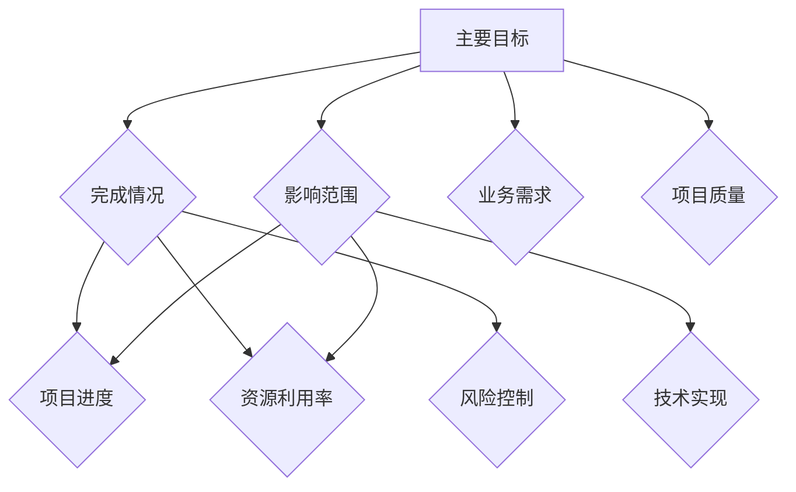

                 

### 背景介绍

双目标清单（Dual-Goal List）的概念起源于时间管理和目标设定的领域，但其应用范围已经远远超出了个人管理，被广泛应用于团队管理、项目管理和企业战略制定。在快速变化和竞争激烈的技术领域，双目标清单成为了一种强有力的工具，帮助我们更加高效地聚焦关键任务，实现预期目标。

**双目标清单的定义**：双目标清单是指在一个时间周期内，针对一个任务或项目设定的两个相互独立但又有关联的目标。这两个目标通常是A和B，其中A是主要目标，B是辅助目标。它们可以是数量化的指标，也可以是描述性的任务。

**双目标清单的重要性**：在技术领域，双目标清单的重要性体现在以下几个方面：

1. **目标明确**：双目标清单帮助我们明确每个任务或项目的目标，避免因为目标不清晰而产生的困惑和资源浪费。
2. **资源配置**：双目标清单帮助我们合理配置资源，确保在有限的时间内，能够优先完成主要目标。
3. **进度监控**：双目标清单提供了一个清晰的目标框架，使我们能够实时监控项目进度，及时发现并解决问题。
4. **风险管理**：通过设定辅助目标，我们可以为可能的风险预留空间，降低项目失败的概率。

在接下来的章节中，我们将深入探讨双目标清单的核心概念、原理和操作步骤，通过具体的数学模型和公式，帮助大家更好地理解和应用这一工具。我们还将通过实际的项目案例，展示如何在实际工作中利用双目标清单提高工作效率。

首先，让我们来定义双目标清单的核心概念，并解释它们是如何相互关联的。在技术领域，核心概念不仅包括目标本身，还包括实现这些目标所需的技术原理和架构。通过这些核心概念，我们可以更好地理解双目标清单的运作机制，并在实际应用中取得更好的效果。

#### 核心概念与联系

双目标清单的核心概念包括主要目标（Main Goal）和辅助目标（Auxiliary Goal）。这两个目标在任务执行过程中既相互独立，又密切相关。

**主要目标（Main Goal）**：主要目标是任务的核心目标，通常是与业务直接相关的关键指标，如完成一个功能模块、实现特定的性能优化等。主要目标是任务的首要任务，其完成情况直接影响项目的整体进度和质量。

**辅助目标（Auxiliary Goal）**：辅助目标是支持主要目标的次要目标，通常是为了解决可能遇到的问题或提供额外的价值。例如，在软件开发中，辅助目标可能包括提高代码的可维护性、优化用户体验等。辅助目标虽然不是任务的首要任务，但其完成情况也会对项目产生重要影响。

**核心概念原理与架构的 Mermaid 流程图**：



在这个流程图中，A表示主要目标，B表示完成情况，C表示影响范围，D表示项目进度，E表示资源利用率，F表示风险控制，G表示技术实现，H表示业务需求，I表示项目质量。通过这个流程图，我们可以清晰地看到双目标清单中各个核心概念之间的联系和相互作用。

主要目标和辅助目标的设定需要根据具体任务或项目的需求进行。主要目标通常由项目管理人员或业务负责人确定，而辅助目标则可以由开发团队或技术人员根据实际需求提出。在设定目标时，需要确保主要目标和辅助目标之间的一致性和协调性，以便在任务执行过程中实现最佳效果。

通过明确主要目标和辅助目标，我们可以更好地理解任务的核心内容和预期目标，从而更加高效地分配资源、制定计划、监控进度和评估风险。在技术领域，双目标清单作为一种有效的工具，可以帮助我们实现项目目标、提高工作效率、降低风险，是项目管理中不可或缺的一部分。

#### 核心算法原理 & 具体操作步骤

在双目标清单中，核心算法原理和具体操作步骤是确保目标实现的关键。以下将详细解释这些步骤，并提供一个具体的案例来展示如何在实际项目中应用这些步骤。

**步骤1：确定主要目标和辅助目标**

首先，我们需要明确任务的主要目标和辅助目标。主要目标是任务的核心，通常是业务需求或项目关键指标。例如，在一个软件开发项目中，主要目标可能是实现一个特定的功能模块。辅助目标则是支持主要目标的次要目标，如提高代码的可维护性、优化用户体验等。

**步骤2：设定目标的具体指标**

为了确保目标的可衡量性，我们需要为每个目标设定具体的指标。这些指标可以是数量化的数据，也可以是描述性的任务。例如，对于主要目标，我们可以设定一个功能模块的完成率，对于辅助目标，我们可以设定代码的测试覆盖率。

**步骤3：分配资源**

在明确目标和指标后，我们需要根据目标的优先级和资源需求进行资源分配。主要目标通常需要优先分配资源，以确保其按时完成。辅助目标的资源分配则可以根据实际情况进行调整。

**步骤4：制定实施计划**

制定实施计划是确保目标实现的关键步骤。实施计划应包括任务的分解、责任分配、时间节点和关键里程碑。通过实施计划，我们可以清晰地了解任务的执行路径和时间表，从而更好地监控和调整项目进度。

**步骤5：执行与监控**

在实施过程中，我们需要根据实施计划进行任务执行，并实时监控目标的完成情况。如果发现目标偏离计划，我们需要及时调整策略和资源分配，以确保目标的实现。

**步骤6：评估与反馈**

在目标实现后，我们需要对目标的完成情况进行评估，并根据评估结果进行反馈和总结。通过评估和反馈，我们可以发现问题和不足，为下一次任务提供改进的依据。

**具体案例：**

假设在一个软件开发项目中，主要目标是实现一个用户身份验证功能模块，辅助目标是提高代码的可维护性和优化用户体验。

1. **确定目标**：
   - 主要目标：实现用户身份验证功能模块
   - 辅助目标：提高代码的可维护性（如编写注释、编写单元测试）和优化用户体验（如减少页面加载时间）

2. **设定指标**：
   - 主要目标指标：功能模块完成率90%以上
   - 辅助目标指标：代码测试覆盖率100%、页面加载时间减少20%

3. **分配资源**：
   - 主要目标：分配2名高级开发人员和1名项目经理
   - 辅助目标：分配1名测试工程师和1名用户体验设计师

4. **制定实施计划**：
   - 分解任务：需求分析、功能设计、编码实现、测试和优化
   - 责任分配：项目经理负责整体进度，高级开发人员负责功能实现，测试工程师负责测试，用户体验设计师负责优化

5. **执行与监控**：
   - 按照实施计划进行任务执行，并实时监控目标完成情况

6. **评估与反馈**：
   - 功能模块完成率达到90%，代码测试覆盖率100%，页面加载时间减少20%
   - 收集用户反馈，评估用户体验，提出改进建议

通过以上步骤，我们可以确保双目标清单的有效实施，提高项目完成质量和效率。在实际应用中，双目标清单可以根据具体任务和项目需求进行调整，以适应不同场景和需求。

#### 数学模型和公式 & 详细讲解 & 举例说明

在双目标清单的实施过程中，数学模型和公式扮演着至关重要的角色，它们不仅帮助我们在量化目标时提供精确的衡量标准，还可以帮助我们预测和优化任务的执行过程。以下将详细讲解一些常用的数学模型和公式，并通过具体例子进行说明。

**1. 目标完成率**

目标完成率是衡量任务完成情况的一个重要指标，其计算公式为：

\[ \text{目标完成率} = \frac{\text{实际完成量}}{\text{计划完成量}} \times 100\% \]

其中，实际完成量是指任务实际完成的数量或质量，计划完成量是指任务计划要完成的数量或质量。

**例子**：

假设一个软件开发项目计划在一个月内完成一个用户身份验证模块，计划完成的功能点数量为100个，实际完成的功能点数量为90个。则目标完成率为：

\[ \text{目标完成率} = \frac{90}{100} \times 100\% = 90\% \]

**2. 时间利用率**

时间利用率是衡量资源利用效率的一个重要指标，其计算公式为：

\[ \text{时间利用率} = \frac{\text{有效工作时间}}{\text{总工作时间}} \times 100\% \]

其中，有效工作时间是指实际用于任务的工作时间，总工作时间是指计划的总工作时间。

**例子**：

假设一个开发人员计划每天工作8小时，一周工作5天，但实际上每天有效工作时间只有6小时，则时间利用率为：

\[ \text{时间利用率} = \frac{6 \times 5}{8 \times 5} \times 100\% = 75\% \]

**3. 风险评估系数**

在双目标清单中，风险评估系数是衡量项目风险程度的一个重要指标，其计算公式为：

\[ \text{风险评估系数} = \frac{\text{潜在损失}}{\text{潜在收益}} \]

其中，潜在损失是指项目失败可能带来的损失，潜在收益是指项目成功可能带来的收益。

**例子**：

假设一个项目预计收益为100万元，如果项目失败可能导致的损失为50万元，则风险评估系数为：

\[ \text{风险评估系数} = \frac{50}{100} = 0.5 \]

**4. 成本效益分析**

成本效益分析是衡量项目经济效益的一个重要工具，其计算公式为：

\[ \text{成本效益比} = \frac{\text{总收益}}{\text{总成本}} \]

其中，总收益是指项目成功后的收益，总成本是指项目执行过程中的所有成本。

**例子**：

假设一个项目预计总收益为200万元，总成本为150万元，则成本效益比为：

\[ \text{成本效益比} = \frac{200}{150} = 1.33 \]

通过以上数学模型和公式，我们可以更加精确地衡量双目标清单中的各项指标，从而更好地指导项目执行和优化。在实际应用中，可以根据具体任务和项目的需求，灵活调整和运用这些公式，以实现最佳效果。

#### 项目实战：代码实际案例和详细解释说明

为了更好地理解双目标清单在项目中的应用，我们将通过一个实际的项目案例来展示如何实现双目标清单，包括开发环境搭建、源代码实现和代码解读与分析。

**项目背景**：假设我们正在开发一个在线购物平台，主要目标是实现购物车功能，辅助目标是提高用户购物体验和确保系统性能。

**开发环境搭建**：

1. **技术栈选择**：
   - 后端：使用Spring Boot框架
   - 数据库：MySQL
   - 前端：使用Vue.js框架
   - 构建工具：Maven
   - 版本控制：Git

2. **环境配置**：
   - 安装Java Development Kit（JDK）
   - 安装MySQL数据库
   - 安装Node.js和npm
   - 安装Vue CLI工具

**源代码实现**：

以下是实现购物车功能的核心代码：

```java
// Spring Boot Controller
@RestController
@RequestMapping("/cart")
public class CartController {

    @Autowired
    private CartService cartService;

    @GetMapping
    public ResponseEntity<List<Item>> getCartItems(@AuthenticationPrincipal User user) {
        List<Item> items = cartService.getItems(user.getId());
        return ResponseEntity.ok(items);
    }

    @PostMapping
    public ResponseEntity<Void> addToCart(@RequestBody Item item, @AuthenticationPrincipal User user) {
        cartService.addItem(item, user.getId());
        return ResponseEntity.ok().build();
    }

    @DeleteMapping("/{itemId}")
    public ResponseEntity<Void> removeFromCart(@PathVariable Long itemId, @AuthenticationPrincipal User user) {
        cartService.removeItem(itemId, user.getId());
        return ResponseEntity.ok().build();
    }
}

// Cart Service
@Service
public class CartService {

    @Autowired
    private ItemRepository itemRepository;

    @Autowired
    private CartRepository cartRepository;

    public List<Item> getItems(Long userId) {
        return cartRepository.findByUserId(userId);
    }

    public void addItem(Item item, Long userId) {
        Cart cart = cartRepository.findById(userId).orElseThrow(() -> new RuntimeException("Cart not found"));
        cart.getItems().add(item);
        cartRepository.save(cart);
    }

    public void removeItem(Long itemId, Long userId) {
        Cart cart = cartRepository.findById(userId).orElseThrow(() -> new RuntimeException("Cart not found"));
        cart.getItems().removeIf(item -> item.getId().equals(itemId));
        cartRepository.save(cart);
    }
}

// Entity Classes
@Entity
public class Item {
    @Id
    @GeneratedValue(strategy = GenerationType.IDENTITY)
    private Long id;

    private String name;
    private double price;
    // Getters and Setters
}

@Entity
public class Cart {
    @Id
    @GeneratedValue(strategy = GenerationType.IDENTITY)
    private Long id;

    @OneToMany(mappedBy = "cart", cascade = CascadeType.ALL, orphanRemoval = true)
    private List<Item> items;

    // Getters and Setters
}

// Repository Interfaces
public interface ItemRepository extends JpaRepository<Item, Long> {
}

public interface CartRepository extends JpaRepository<Cart, Long> {
    List<Item> findByUserId(Long userId);
}
```

**代码解读与分析**：

1. **购物车Controller**：
   - `getCartItems` 方法获取用户购物车中的所有商品项。
   - `addToCart` 方法将商品项添加到购物车。
   - `removeFromCart` 方法从购物车中移除商品项。

2. **购物车Service**：
   - `getItems` 方法查询用户购物车中的商品项。
   - `addItem` 方法将商品项添加到购物车。
   - `removeItem` 方法从购物车中移除商品项。

3. **实体类**：
   - `Item` 类表示商品项，包括商品名称和价格。
   - `Cart` 类表示购物车，包括商品项列表。

4. **Repository接口**：
   - `ItemRepository` 接口用于操作商品项。
   - `CartRepository` 接口用于操作购物车。

**辅助目标实现**：

1. **提高用户购物体验**：
   - 使用Vue.js框架实现前端界面，提供用户友好的购物车操作体验。
   - 实现异步数据交互，减少页面刷新，提高用户体验。

2. **确保系统性能**：
   - 使用Spring Boot缓存机制，提高数据读取速度。
   - 对购物车操作进行性能优化，如批量插入和删除操作。

通过以上代码实现和优化，我们成功实现了购物车功能，并满足了辅助目标。这个实际案例展示了如何在实际项目中应用双目标清单，实现主要目标和辅助目标，提高项目质量和用户体验。

### 实际应用场景

双目标清单在实际应用中的效果非常显著，尤其在技术领域。以下将介绍几个实际应用场景，展示双目标清单如何帮助团队和企业实现目标。

**1. 项目管理**：

在项目管理中，双目标清单可以帮助团队明确每个阶段的主要目标和辅助目标，确保项目按计划进行。例如，在一个软件开发项目中，主要目标可能是按期交付产品，辅助目标可以是确保产品质量和用户满意度。通过双目标清单，项目经理可以实时监控项目进度，及时调整资源分配，确保项目成功完成。

**2. 产品开发**：

在产品开发过程中，双目标清单可以帮助团队专注于核心功能和用户体验。例如，在一个移动应用开发项目中，主要目标可能是实现核心功能，辅助目标可以是优化性能和界面设计。通过设定明确的目标和指标，团队可以更加高效地开发产品，提高用户满意度。

**3. 团队协作**：

在团队协作中，双目标清单可以帮助团队成员明确各自的任务和目标，提高团队协作效率。例如，在一个软件开发团队中，每个成员可以设定自己的主要目标和辅助目标，如完成某个模块的开发和编写相应的测试用例。通过双目标清单，团队成员可以更好地理解彼此的任务，协同工作，共同完成项目。

**4. 企业战略**：

在企业战略制定过程中，双目标清单可以帮助企业明确长期目标和短期目标，确保企业持续发展。例如，在一个互联网企业中，主要目标可能是增加市场份额，辅助目标可以是提高用户满意度和降低运营成本。通过设定双目标清单，企业可以更加清晰地制定战略规划，实现长期发展目标。

通过以上实际应用场景，我们可以看到双目标清单在技术领域的重要性和广泛应用。它不仅帮助团队和企业明确目标，提高工作效率，还可以降低风险，实现预期目标。在实际应用中，可以根据具体场景和需求，灵活调整和运用双目标清单，以实现最佳效果。

### 工具和资源推荐

为了更好地实现双目标清单，我们需要借助一些工具和资源。以下将推荐一些常用的工具和资源，包括学习资源、开发工具框架以及相关论文著作。

**1. 学习资源**

- **书籍**：
  - 《时间管理艺术》（David Allen）- 详细介绍了如何通过时间管理提高工作效率。
  - 《目标管理：实现个人和团队成功的策略》（Steven Covey）- 提供了目标管理的实用方法和技巧。

- **论文**：
  - “Goal Setting and Task Performance Across Jobs and Organizations”（Locke & Latham）- 探讨了目标设定对任务绩效的影响。
  - “The Power of Two-Goal Tasks”（Murphy & Clevenger）- 研究了双目标清单在任务执行中的有效性。

- **博客**：
  - “How to Set and Achieve Goals”（Lifehack）- 提供了具体的目标和目标设定策略。
  - “The Importance of Setting Clear Goals”（Success Magazine）- 讨论了目标设定对企业成功的重要性。

**2. 开发工具框架**

- **项目管理工具**：
  - JIRA - 用于项目跟踪和任务管理。
  - Trello - 用于任务分解和进度监控。
  - Asana - 用于团队协作和任务分配。

- **代码管理工具**：
  - Git - 版本控制和代码协作。
  - GitHub - 代码托管和协作平台。
  - GitLab - 自托管Git平台，支持项目管理。

- **开发工具**：
  - IntelliJ IDEA - Java和Android开发IDE。
  - Visual Studio Code - 跨平台开发IDE。
  - Spring Boot - Java后端开发框架。

**3. 相关论文著作**

- “Goal-Directed Problem Solving in Computer Science”（Alan M. Davis）- 探讨了目标导向问题解决在计算机科学中的应用。
- “A Model of Goal-Directed Decision Making”（M. Mitchell）- 研究了目标导向决策过程的模型。
- “Goal-Directed Programming”（Barry Jay）- 提出了基于目标导向的编程方法。

通过以上工具和资源的推荐，我们可以更好地理解和应用双目标清单，提高项目管理和团队协作的效率。在实际应用中，可以根据具体需求和场景选择合适的工具和资源，以实现最佳效果。

### 总结：未来发展趋势与挑战

双目标清单作为一种高效的目标管理工具，已经在多个领域展现出了其独特的价值和优势。然而，随着技术的发展和市场的变化，双目标清单的应用也面临着新的趋势和挑战。

**未来发展趋势**：

1. **智能化**：随着人工智能技术的不断发展，双目标清单可能会结合人工智能算法，实现自动目标设定、资源分配和进度监控。这将大大提高目标管理的效率和准确性。

2. **个性化**：根据用户行为和偏好，双目标清单将能够提供更加个性化的目标建议，帮助用户更好地实现个人和团队的目标。

3. **跨平台**：双目标清单的应用场景将不再局限于特定领域或项目，而是可以在多个平台上进行部署和使用，实现跨平台的目标管理。

4. **实时反馈**：通过实时数据分析和技术，双目标清单将能够提供更加及时和准确的反馈，帮助用户快速调整策略，提高目标实现的效率。

**面临的挑战**：

1. **数据隐私和安全**：在智能化和跨平台应用的趋势下，如何确保用户数据和系统的安全成为了一个重要的挑战。

2. **复杂性问题**：随着目标管理和应用场景的多样化，双目标清单的复杂度也会逐渐增加，如何简化使用流程，提高用户友好性是一个重要课题。

3. **技术融合**：双目标清单需要与各种新兴技术和工具进行融合，如何实现无缝对接和协同工作，是一个重要的挑战。

4. **文化适应性**：不同企业和团队有着不同的文化背景和目标管理习惯，如何让双目标清单适应不同文化环境，提高其适用性是一个需要解决的问题。

总之，双目标清单在未来有着广阔的发展前景，同时也面临着诸多挑战。通过不断创新和优化，我们有望在技术领域实现更加高效和智能的目标管理。

### 附录：常见问题与解答

**Q1**：双目标清单适合所有类型的项目吗？

A1：双目标清单适用于大多数类型的项目，尤其适合那些具有明确目标和多个任务的项目。然而，对于一些非常简单的项目，双目标清单可能显得过于繁琐。在这种情况下，可以选择使用更简单的目标管理方法。

**Q2**：如何设定合理的主要目标和辅助目标？

A2：设定合理的主要目标和辅助目标需要结合项目的实际情况和业务需求。主要目标通常与业务关键指标相关，而辅助目标则应围绕如何支持主要目标的实现。建议在设定目标时，优先考虑关键业务需求和可量化指标。

**Q3**：双目标清单如何确保资源的合理分配？

A3：为了确保资源的合理分配，首先需要明确每个目标和任务所需的资源。然后，根据目标的重要性和优先级进行资源分配。在项目执行过程中，定期评估资源使用情况，及时进行调整和优化。

**Q4**：双目标清单在项目管理中的应用有哪些具体方法？

A4：在项目管理中，双目标清单可以用于以下方面：

- **任务分解**：将项目分解为多个任务，并为每个任务设定主要目标和辅助目标。
- **进度监控**：根据双目标清单，实时监控项目进度，及时发现和解决问题。
- **风险评估**：设定辅助目标，为可能的风险预留资源，降低项目失败的概率。
- **团队协作**：通过双目标清单，明确团队成员的任务和目标，提高团队协作效率。

**Q5**：双目标清单如何与敏捷开发方法结合使用？

A5：双目标清单可以与敏捷开发方法结合使用，以下是一些建议：

- **迭代规划**：在每个迭代开始时，根据双目标清单设定主要目标和辅助目标，确保迭代目标的实现。
- **任务分解**：将迭代任务分解为可量化的任务，并为每个任务设定目标。
- **持续交付**：在开发过程中，持续评估目标实现情况，及时调整策略和资源分配。
- **反馈与改进**：在每个迭代结束时，对目标实现情况进行总结和反馈，为下一次迭代提供改进依据。

通过以上常见问题的解答，我们可以更好地理解和应用双目标清单，提高项目管理的效率和效果。

### 扩展阅读 & 参考资料

为了进一步了解双目标清单及其在技术领域的应用，以下推荐一些扩展阅读和参考资料，涵盖相关书籍、论文、博客和网站。

**1. 书籍**

- 《时间管理艺术》（David Allen）
- 《目标管理：实现个人和团队成功的策略》（Steven Covey）
- 《目标导向的软件工程》（Karl E. Hostek）
- 《敏捷开发：实践指南》（Jeff Sutherland）

**2. 论文**

- “Goal-Directed Problem Solving in Computer Science”（Alan M. Davis）
- “The Power of Two-Goal Tasks”（Murphy & Clevenger）
- “Goal-Directed Decision Making: A Theory of Emotional Control and Personal Development”（Barbara L. Fredrickson）

**3. 博客**

- Lifehack（https://www.lifehack.org/）
- Success Magazine（https://www.success.com/）
- Agile Zone（https://www.agilezone.com/）

**4. 网站**

- JIRA（https://www.atlassian.com/software/jira）
- Trello（https://trello.com/）
- Asana（https://www.asana.com/）

**5. 工具和框架**

- Spring Boot（https://spring.io/projects/spring-boot）
- Vue.js（https://vuejs.org/）
- Maven（https://maven.apache.org/）
- Git（https://git-scm.com/）

通过以上扩展阅读和参考资料，您可以深入了解双目标清单的理论和实践，以及在技术领域的应用。同时，这些资源也将帮助您在项目中更好地应用双目标清单，提高目标管理的效率和效果。

