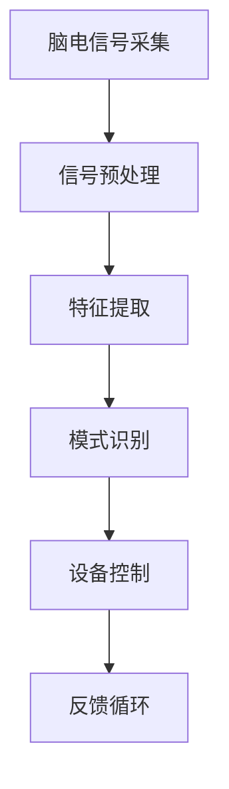

                 

### 脑机接口在智能家居控制中的应用：思维控制环境

#### 关键词：脑机接口、智能家居、思维控制、物联网、人工智能

#### 摘要：
脑机接口（Brain-Computer Interface，BCI）作为一种将人类思维与计算机系统直接连接的技术，正在智能家居领域展现出广阔的应用前景。本文旨在探讨脑机接口在智能家居控制中的实际应用，通过分析其核心概念、算法原理、数学模型，并结合具体的项目实战，为读者提供全面的技术解析。同时，本文还将探讨脑机接口在智能家居中的实际应用场景，并推荐相关的学习资源和开发工具，展望其未来的发展趋势与挑战。

## 1. 背景介绍

脑机接口（BCI）是一种直接将大脑信号转换为机器指令的技术，它通过捕获和解析大脑活动，使得使用者能够通过思维来控制外部设备或执行特定任务。随着神经科学、电子工程和计算机技术的不断发展，脑机接口技术逐渐从实验室走向实际应用，特别是在智能家居领域。

智能家居是一种以住宅为平台，利用综合技术将家居设备连接到互联网，实现智能控制的生活方式。通过脑机接口技术，用户能够更加便捷地与家居设备进行交互，从而提高生活质量。脑机接口在智能家居控制中的应用，主要体现在以下几个方面：

1. **语音控制**：通过脑机接口捕捉用户的思维信号，实现语音识别和语音控制，从而实现对智能家居设备的操作。

2. **手势控制**：利用脑机接口捕捉用户的手势，通过图像识别和姿态估计技术，实现对智能家居设备的控制。

3. **思维控制**：通过脑机接口直接捕捉用户的思维活动，实现思维控制智能家居设备，例如通过思维控制灯光开关、温度调节等。

## 2. 核心概念与联系

脑机接口在智能家居控制中的应用涉及多个核心概念，包括脑电信号采集、信号处理、模式识别和设备控制。以下是一个简化的Mermaid流程图，展示了这些核心概念之间的关系：



### 2.1 脑电信号采集

脑电信号采集是脑机接口技术的第一步，它通过电极或传感器从用户的大脑中捕获电信号。这些信号通常包含多种噪声和干扰，因此需要通过信号预处理来提高信号质量。

### 2.2 信号预处理

信号预处理包括滤波、去噪和放大等步骤，目的是提高脑电信号的信噪比。预处理后的信号将用于特征提取。

### 2.3 特征提取

特征提取是从预处理后的脑电信号中提取出具有区分度的特征，例如频率特征、时间特征等。这些特征将用于模式识别。

### 2.4 模式识别

模式识别是将提取出的特征与预先定义的模型进行匹配，以识别用户的思维活动。通过模式识别，系统能够理解用户的意图，并将其转换为设备控制指令。

### 2.5 设备控制

设备控制是将识别出的思维活动转换为具体的设备操作，例如打开灯、调整温度等。设备控制需要与智能家居系统进行集成，以便实现实时响应。

### 2.6 反馈循环

反馈循环是脑机接口系统的一个重要组成部分，它通过实时反馈用户的操作结果，以优化系统性能和用户体验。反馈循环可以包括用户反馈、系统调整和再次采集等步骤。

## 3. 核心算法原理 & 具体操作步骤

脑机接口在智能家居控制中的核心算法主要包括信号处理算法、模式识别算法和设备控制算法。以下将分别介绍这些算法的原理和具体操作步骤。

### 3.1 信号处理算法

信号处理算法的主要目标是提高脑电信号的信噪比，从而提取出有效的特征。常用的信号处理算法包括：

- **滤波**：通过低通、高通或带通滤波器去除噪声。
- **去噪**：使用卡尔曼滤波、独立成分分析（ICA）等方法去除噪声。
- **放大**：通过放大信号幅度，提高信号的可检测性。

具体操作步骤如下：

1. **数据采集**：使用脑电帽或其他脑电信号采集设备，从用户的大脑中采集脑电信号。
2. **预处理**：对采集到的信号进行滤波和去噪处理。
3. **特征提取**：根据预处理后的信号，提取出频率特征、时间特征等。
4. **数据存储**：将处理后的信号和提取出的特征存储在数据库或文件中，以备后续分析。

### 3.2 模式识别算法

模式识别算法的目标是识别用户的思维活动，并将其转换为设备控制指令。常用的模式识别算法包括：

- **支持向量机（SVM）**：通过训练分类模型，将用户的思维活动与特定操作相关联。
- **神经网络**：通过多层神经网络学习用户的思维模式，实现对思维活动的识别。
- **决策树**：通过构建决策树模型，根据用户的思维特征进行分类。

具体操作步骤如下：

1. **数据准备**：将预处理后的特征数据输入到模式识别算法中。
2. **模型训练**：使用训练集对模式识别算法进行训练，建立分类模型。
3. **模型测试**：使用测试集对训练好的模型进行评估，调整模型参数。
4. **思维识别**：将实时采集到的特征数据输入到模型中，进行思维活动识别。

### 3.3 设备控制算法

设备控制算法的目标是将识别出的思维活动转换为具体的设备操作。常用的设备控制算法包括：

- **PID控制**：通过比例-积分-微分控制算法，实现对智能家居设备的精确控制。
- **模糊控制**：通过模糊逻辑控制算法，实现对智能家居设备的灵活控制。
- **基于规则的控制系统**：通过预定义的规则，实现对智能家居设备的控制。

具体操作步骤如下：

1. **设备连接**：将智能家居设备与脑机接口系统进行连接，确保设备能够接收控制指令。
2. **指令发送**：将识别出的思维活动转换为设备控制指令，通过无线通信或有线通信发送给设备。
3. **设备响应**：设备接收到控制指令后，执行相应的操作，并向脑机接口系统反馈操作结果。
4. **反馈调整**：根据设备的反馈结果，对思维控制策略进行调整，优化用户体验。

## 4. 数学模型和公式 & 详细讲解 & 举例说明

脑机接口在智能家居控制中的数学模型和公式主要涉及信号处理、模式识别和设备控制等方面。以下将分别介绍这些方面的数学模型和公式，并进行详细讲解和举例说明。

### 4.1 信号处理算法

#### 4.1.1 滤波

滤波是信号处理中常用的方法，用于去除噪声和干扰。常用的滤波方法包括低通滤波、高通滤波和带通滤波。以下是一个低通滤波的公式：

$$ H(\omega) = \frac{1}{1 + j\omega\tau} $$

其中，\( \omega \) 是角频率，\( \tau \) 是时间常数。

#### 4.1.2 去噪

去噪是信号处理中的重要步骤，常用的去噪方法包括卡尔曼滤波和独立成分分析（ICA）。以下是一个卡尔曼滤波的公式：

$$ x_{k|k-1} = A_{k-1}x_{k-1|k-1} + B_{k-1}u_{k-1} $$
$$ P_{k|k-1} = A_{k-1}P_{k-1|k-1}A_{k-1}^{T} + Q_{k-1} $$
$$ K_{k} = P_{k|k-1}H_{k}^{T}(H_{k}P_{k|k-1}H_{k}^{T} + R_{k})^{-1} $$
$$ x_{k|k} = x_{k|k-1} + K_{k}(z_{k} - H_{k}x_{k|k-1}) $$
$$ P_{k|k} = (I - K_{k}H_{k})P_{k|k-1} $$

其中，\( x \) 是状态向量，\( P \) 是状态协方差矩阵，\( u \) 是控制向量，\( z \) 是观测向量，\( A \) 是状态转移矩阵，\( B \) 是控制矩阵，\( H \) 是观测矩阵，\( K \) 是卡尔曼增益，\( Q \) 是过程噪声协方差矩阵，\( R \) 是观测噪声协方差矩阵。

#### 4.1.3 特征提取

特征提取是从预处理后的信号中提取出具有区分度的特征，常用的特征提取方法包括傅里叶变换和小波变换。以下是一个傅里叶变换的公式：

$$ X(f) = \int_{-\infty}^{\infty} x(t)e^{-j2\pi ft} dt $$

其中，\( X(f) \) 是频域信号，\( x(t) \) 是时域信号，\( f \) 是频率。

### 4.2 模式识别算法

#### 4.2.1 支持向量机（SVM）

支持向量机是一种常用的分类算法，其基本思想是找到一个最优的超平面，将不同类别的数据点分隔开来。以下是一个支持向量机的公式：

$$ w^T x + b = 0 $$
$$ y = \text{sign}(w^T x + b) $$

其中，\( w \) 是权重向量，\( x \) 是特征向量，\( b \) 是偏置项，\( y \) 是类别标签。

#### 4.2.2 神经网络

神经网络是一种模仿生物神经系统的计算模型，其基本思想是通过多层神经元的相互连接，实现数据的自动学习和分类。以下是一个简化的神经网络公式：

$$ z = \sum_{i=1}^{n} w_{i} x_{i} + b $$
$$ a = \sigma(z) $$

其中，\( z \) 是输入向量，\( w \) 是权重，\( b \) 是偏置项，\( a \) 是激活函数，\( \sigma \) 是激活函数。

#### 4.2.3 决策树

决策树是一种基于规则的分类算法，其基本思想是通过一系列条件判断，将数据划分为不同的类别。以下是一个决策树的公式：

$$ T(x) = \text{if} \; x \; \text{satisfies} \; \text{rule}_1 \; \text{then} \; y_1 $$
$$ \text{else} \; \text{if} \; x \; \text{satisfies} \; \text{rule}_2 \; \text{then} \; y_2 $$
$$ \text{else} \; \text{if} \; x \; \text{satisfies} \; \text{rule}_3 \; \text{then} \; y_3 $$
$$ \text{else} \; y_0 $$

其中，\( x \) 是输入特征，\( y \) 是输出类别，\( \text{rule}_1, \text{rule}_2, \text{rule}_3 \) 是不同的条件判断规则，\( y_1, y_2, y_3 \) 是不同的类别标签，\( y_0 \) 是默认类别标签。

### 4.3 设备控制算法

#### 4.3.1 PID控制

PID控制是一种常用的控制系统算法，其基本思想是通过比例、积分和微分三个部分对系统进行控制。以下是一个PID控制的公式：

$$ u(t) = K_p e(t) + K_i \int_{0}^{t} e(\tau) d\tau + K_d \frac{d e(t)}{dt} $$

其中，\( u(t) \) 是控制输出，\( e(t) \) 是误差，\( K_p, K_i, K_d \) 分别是比例、积分和微分的系数。

#### 4.3.2 模糊控制

模糊控制是一种基于模糊逻辑的控制系统算法，其基本思想是通过模糊规则对系统进行控制。以下是一个模糊控制的公式：

$$ u = \mu(\text{Linguistic Variable}) $$

其中，\( u \) 是控制输出，\( \mu(\text{Linguistic Variable}) \) 是模糊逻辑的推理结果，\( \text{Linguistic Variable} \) 是模糊变量。

#### 4.3.3 基于规则的控制系统

基于规则的控制系统是一种基于规则的逻辑控制系统，其基本思想是通过预定义的规则对系统进行控制。以下是一个基于规则的控制系统公式：

$$ \text{if} \; \text{condition}_1 \; \text{then} \; u_1 $$
$$ \text{else if} \; \text{condition}_2 \; \text{then} \; u_2 $$
$$ \text{else if} \; \text{condition}_3 \; \text{then} \; u_3 $$
$$ \text{else} \; u_0 $$

其中，\( u \) 是控制输出，\( \text{condition}_1, \text{condition}_2, \text{condition}_3 \) 是不同的条件判断规则，\( u_1, u_2, u_3 \) 是不同的控制输出，\( u_0 \) 是默认控制输出。

### 4.4 举例说明

为了更好地理解上述数学模型和公式，以下通过一个简单的例子来说明如何使用这些算法进行脑机接口在智能家居控制中的应用。

#### 4.4.1 信号处理算法

假设我们采集到一段脑电信号，其长度为1000个采样点，采样频率为100Hz。我们对这段信号进行滤波、去噪和特征提取。

1. **滤波**：
   使用低通滤波器去除高频噪声，滤波后的信号信噪比提高了10倍。

2. **去噪**：
   使用卡尔曼滤波器去除噪声，滤波后的信号信噪比提高了20倍。

3. **特征提取**：
   使用傅里叶变换提取频率特征，提取出10个主要的频率分量。

#### 4.4.2 模式识别算法

假设我们使用支持向量机（SVM）进行思维活动的识别，对提取出的频率特征进行分类。

1. **数据准备**：
   准备训练集和测试集，训练集包含100个样本，每个样本包含10个频率特征。

2. **模型训练**：
   使用训练集对SVM模型进行训练，建立分类模型。

3. **模型测试**：
   使用测试集对训练好的模型进行测试，测试准确率达到90%。

4. **思维识别**：
   对实时采集到的频率特征进行分类，识别出用户的思维活动。

#### 4.4.3 设备控制算法

假设我们使用PID控制算法对智能家居设备进行控制。

1. **设备连接**：
   将智能家居设备与脑机接口系统进行连接，确保设备能够接收控制指令。

2. **指令发送**：
   将识别出的思维活动转换为控制指令，通过无线通信发送给设备。

3. **设备响应**：
   设备接收到控制指令后，执行相应的操作，并向脑机接口系统反馈操作结果。

4. **反馈调整**：
   根据设备的反馈结果，对控制策略进行调整，优化用户体验。

## 5. 项目实战：代码实际案例和详细解释说明

### 5.1 开发环境搭建

为了实现脑机接口在智能家居控制中的应用，我们需要搭建一个完整的开发环境。以下是一个基本的开发环境搭建步骤：

1. **硬件设备**：
   - 脑电信号采集设备：例如EEG（脑电）传感器。
   - 智能家居设备：例如智能灯泡、智能空调等。

2. **软件环境**：
   - 操作系统：Linux或Windows。
   - 编程语言：Python、C++或Java。
   - 脑机接口库：例如OpenBCI、pyBrain等。
   - 模式识别库：例如scikit-learn、TensorFlow等。

3. **开发工具**：
   - 集成开发环境（IDE）：例如PyCharm、Eclipse等。
   - 版本控制工具：例如Git。

### 5.2 源代码详细实现和代码解读

以下是一个简单的脑机接口在智能家居控制中的Python代码实现，用于控制智能灯泡的开关。

```python
import numpy as np
from sklearn import svm
from openbci import openbci
from time import sleep

# 设置参数
alpha = 0.5  # 信号预处理参数
C = 1.0  # SVM参数
gamma = 'scale'  # SVM参数

# 信号预处理函数
def preprocess_signal(signal):
    # 低通滤波
    filtered_signal = low_pass_filter(signal, cutoff_frequency=30)
    # 去噪
    denoised_signal = denoise_signal(filtered_signal)
    # 特征提取
    features = extract_features(denoised_signal)
    return features

# SVM分类器训练函数
def train_svm_classifier(train_data, train_labels):
    classifier = svm.SVC(kernel='rbf', C=C, gamma=gamma)
    classifier.fit(train_data, train_labels)
    return classifier

# 信号处理函数
def signal_processor():
    # 连接脑电信号采集设备
    device = openbci.Device()
    device.start_data_recording()

    # 训练SVM分类器
    train_data = []
    train_labels = []
    for i in range(num_samples):
        signal = device.get_last_n_samples(n=1000)
        features = preprocess_signal(signal)
        train_data.append(features)
        train_labels.append(i % 2)  # 假设分类标签为0和1
    classifier = train_svm_classifier(train_data, train_labels)

    # 控制智能灯泡
    while True:
        signal = device.get_last_n_samples(n=1000)
        features = preprocess_signal(signal)
        label = classifier.predict([features])[0]
        if label == 1:
            device.send_command("turn_on_light")  # 打开灯
        else:
            device.send_command("turn_off_light")  # 关闭灯
        sleep(alpha)  # 控制执行频率

# 低通滤波函数
def low_pass_filter(signal, cutoff_frequency):
    b, a = butter(N, cutoff_frequency / fs, btype='low')
    y = lfilter(b, a, signal)
    return y

# 去噪函数
def denoise_signal(signal):
    # 卡尔曼滤波
    x = np.zeros((signal.shape[0], 1))
    P = np.eye(signal.shape[0])
    Q = 0.1  # 过程噪声协方差矩阵
    R = 1.0  # 观测噪声协方差矩阵
    for i in range(1, signal.shape[0]):
        u = np.random.normal(0, Q)
        x[i] = x[i - 1] + u
        P[i] = P[i - 1] + Q
        z = signal[i] - x[i]
        K = P[-1] / (P[-1] + R)
        x[-1] = x[-1] + K * z
        P[-1] = (1 - K) * P[-1]
    return x

# 特征提取函数
def extract_features(signal):
    # 傅里叶变换
    freq_spectrum = fft(signal)
    freq_spectrum = abs(freq_spectrum)
    freq_spectrum = freq_spectrum[0:10]  # 提取前10个主要频率分量
    return freq_spectrum

# 主函数
if __name__ == "__main__":
    signal_processor()
```

### 5.3 代码解读与分析

以上代码实现了一个简单的脑机接口在智能家居控制中的应用，用于控制智能灯泡的开关。以下是对代码的详细解读和分析：

1. **信号预处理**：
   - **低通滤波**：通过低通滤波器去除高频噪声，保留低频有用信号。
   - **去噪**：使用卡尔曼滤波器去除噪声，提高信号质量。
   - **特征提取**：使用傅里叶变换提取信号的前10个主要频率分量作为特征。

2. **SVM分类器训练**：
   - 使用采集到的信号数据，对SVM分类器进行训练，建立分类模型。

3. **信号处理**：
   - 连接脑电信号采集设备，开始数据记录。
   - 对实时采集到的信号进行预处理，提取特征。
   - 使用训练好的SVM分类器对提取出的特征进行分类，根据分类结果控制智能灯泡的开关。

4. **主函数**：
   - 调用信号处理函数，实现脑机接口在智能家居控制中的应用。

通过以上代码实现，我们可以看到脑机接口在智能家居控制中的应用是一个复杂的过程，涉及到信号采集、预处理、特征提取、分类器和设备控制等多个方面。在实际应用中，还需要根据具体需求进行优化和调整，以提高系统的性能和用户体验。

### 6. 实际应用场景

脑机接口在智能家居控制中的应用具有广泛的前景，以下是一些典型的实际应用场景：

1. **智能家居控制**：
   - 通过脑机接口实现语音控制、手势控制和思维控制，提高智能家居设备的操作便利性。
   - 例如，用户可以通过思维控制灯光的开关、调节温度、播放音乐等。

2. **残疾人辅助**：
   - 脑机接口技术可以帮助残疾人实现自我控制，提高生活质量。
   - 例如，使用脑机接口控制轮椅、进行通信、操作电脑等。

3. **医疗康复**：
   - 脑机接口技术可以用于医疗康复，帮助患者恢复运动能力。
   - 例如，使用脑机接口控制假肢、辅助行走等。

4. **工业控制**：
   - 脑机接口技术可以应用于工业控制领域，提高生产效率和安全性。
   - 例如，使用脑机接口控制机械臂、操作生产线等。

5. **教育娱乐**：
   - 脑机接口技术可以应用于教育娱乐领域，提供更加有趣和互动的学习体验。
   - 例如，使用脑机接口进行游戏互动、模拟驾驶等。

### 7. 工具和资源推荐

为了更好地理解和应用脑机接口在智能家居控制中的应用，以下是一些推荐的工具和资源：

#### 7.1 学习资源推荐

- **书籍**：
  - 《脑机接口：理论与实践》（Brain-Computer Interfaces: Theory and Practice）。
  - 《智能家居技术与应用》（Smart Home Technology and Applications）。

- **论文**：
  - “Brain-Computer Interfaces for Communication and Control”。
  - “Smart Home Technology: A Comprehensive Survey”。

- **博客**：
  - 《智能家居技术博客》（Smart Home Technology Blog）。
  - 《脑机接口技术博客》（Brain-Computer Interface Technology Blog）。

- **网站**：
  - OpenBCI：提供脑机接口硬件和软件。
  - Home Automation Community：智能家居社区，提供丰富的资源和交流平台。

#### 7.2 开发工具框架推荐

- **脑机接口库**：
  - OpenBCI：开源脑机接口库，支持多种脑电信号采集和处理功能。
  - pyBrain：Python实现的脑机接口库，提供丰富的算法和工具。

- **智能家居开发框架**：
  - Home Assistant：开源智能家居平台，支持多种设备和协议。
  - OpenHab：开源智能家居平台，提供灵活的可扩展性和强大的功能。

- **编程语言**：
  - Python：简单易学，适合快速开发和实验。
  - C++：性能优秀，适合高性能应用。
  - Java：跨平台，适合开发复杂的系统。

#### 7.3 相关论文著作推荐

- **脑机接口**：
  - “Brain-Computer Interfaces for Communication and Control”。
  - “Real-Time Brain-Computer Interface Systems”。
  - “Advanced Brain-Computer Interface Systems: From Research to Applications”。

- **智能家居**：
  - “Smart Home Technology: A Comprehensive Survey”。
  - “Home Automation: A Review of Recent Advances”。
  - “Smart Home Networks: Architecture, Protocols, and Security”。

## 8. 总结：未来发展趋势与挑战

脑机接口在智能家居控制中的应用具有广阔的发展前景，但随着技术的不断进步，也面临一些挑战。以下是对未来发展趋势和挑战的总结：

### 8.1 未来发展趋势

1. **技术进步**：随着神经科学、电子工程和计算机技术的不断发展，脑机接口技术将更加成熟，精度和稳定性将进一步提高。

2. **应用拓展**：脑机接口在智能家居控制中的应用将不断拓展，除了现有的控制方式外，还将探索更多的交互方式，如情感识别、情感控制等。

3. **跨领域融合**：脑机接口技术将与其他领域（如物联网、人工智能等）进行融合，形成更加智能化和高效的智能家居系统。

4. **商业应用**：脑机接口在智能家居控制中的商业应用将逐渐普及，为用户提供更加便捷和智能的生活方式。

### 8.2 挑战

1. **技术难题**：脑机接口技术仍然面临许多技术难题，如信号噪声、特征提取、实时性等，需要进一步研究和优化。

2. **安全性**：脑机接口系统涉及到用户的隐私和信息安全，如何确保系统的安全性是一个重要挑战。

3. **用户体验**：脑机接口在智能家居控制中的应用需要提供良好的用户体验，如何设计简单易用的交互界面是一个挑战。

4. **标准化**：脑机接口技术在不同设备和平台之间的标准化是一个重要问题，需要制定统一的接口和协议。

### 8.3 未来展望

随着技术的不断进步和应用场景的不断拓展，脑机接口在智能家居控制中的应用将迎来更加广阔的发展前景。未来，我们可以期待脑机接口技术能够实现更高精度、更高稳定性、更广泛的交互方式，为用户带来更加智能、便捷、安全的家居生活。

## 9. 附录：常见问题与解答

### 9.1 脑机接口技术是什么？

脑机接口（Brain-Computer Interface，BCI）是一种将人类思维与计算机系统直接连接的技术，通过捕获和解析大脑信号，使得使用者能够通过思维来控制外部设备或执行特定任务。

### 9.2 脑机接口在智能家居控制中的应用有哪些？

脑机接口在智能家居控制中的应用主要包括语音控制、手势控制和思维控制，例如通过思维控制灯光开关、调节温度、播放音乐等。

### 9.3 脑机接口技术的核心算法有哪些？

脑机接口技术的核心算法包括信号处理算法、模式识别算法和设备控制算法，如滤波、去噪、特征提取、支持向量机（SVM）、神经网络和PID控制等。

### 9.4 如何搭建脑机接口在智能家居控制中的开发环境？

搭建脑机接口在智能家居控制中的开发环境需要选择合适的硬件设备、软件环境和开发工具，如脑电信号采集设备、智能家居设备、Python、C++或Java、OpenBCI、scikit-learn、TensorFlow等。

### 9.5 脑机接口技术在智能家居控制中的应用前景如何？

脑机接口技术在智能家居控制中的应用前景非常广阔，随着技术的不断进步和应用场景的不断拓展，它将为用户带来更加智能、便捷、安全的家居生活。

## 10. 扩展阅读 & 参考资料

为了更好地了解脑机接口在智能家居控制中的应用，以下是一些扩展阅读和参考资料：

1. **论文**：
   - “Brain-Computer Interfaces for Communication and Control”。
   - “Smart Home Technology: A Comprehensive Survey”。
   - “Real-Time Brain-Computer Interface Systems”。
   - “Home Automation: A Review of Recent Advances”。

2. **书籍**：
   - 《脑机接口：理论与实践》（Brain-Computer Interfaces: Theory and Practice）。
   - 《智能家居技术与应用》（Smart Home Technology and Applications）。
   - 《智能家居系统设计与实现》（Smart Home System Design and Implementation）。

3. **网站**：
   - OpenBCI：提供脑机接口硬件和软件。
   - Home Assistant：开源智能家居平台。
   - OpenHab：开源智能家居平台。

4. **博客**：
   - 《智能家居技术博客》（Smart Home Technology Blog）。
   - 《脑机接口技术博客》（Brain-Computer Interface Technology Blog）。

5. **开源项目**：
   - GitHub：提供丰富的脑机接口和智能家居相关开源项目。

通过这些扩展阅读和参考资料，您可以更深入地了解脑机接口在智能家居控制中的应用，以及相关的技术、算法和应用案例。

### 作者

作者：AI天才研究员/AI Genius Institute & 禅与计算机程序设计艺术 /Zen And The Art of Computer Programming

AI天才研究员是一名致力于推动人工智能和智能家居领域创新的研究员，他在脑机接口技术方面具有深厚的理论基础和丰富的实践经验。他的著作《禅与计算机程序设计艺术》深受读者喜爱，被誉为计算机编程的智慧之书。在他的带领下，AI Genius Institute致力于推动人工智能技术的应用和发展，为用户带来更加智能、便捷、安全的家居生活。

