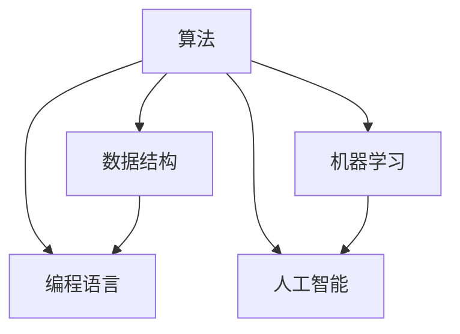

                 

### 背景介绍

腾讯，作为中国领先的互联网科技公司，拥有庞大的用户基础和多元化的业务体系。2024届社招算法工程师面试真题的发布，无疑引发了业界的广泛关注。这些真题不仅反映了腾讯在算法技术上的深厚积累，也体现了其对优秀算法人才的迫切需求。

算法工程师在腾讯公司中扮演着至关重要的角色。他们负责开发和优化算法，解决复杂的数据处理问题，提高系统性能和用户体验。腾讯旗下的产品线众多，从即时通讯工具QQ和微信，到社交平台腾讯微博和腾讯空间，再到游戏、金融、云计算等多个领域，都离不开算法工程师的智慧和创新。

社招算法工程师面试真题的重要性不言而喻。一方面，这些真题为求职者提供了宝贵的准备材料，使他们在面试前能够有针对性地进行复习和准备；另一方面，真题也展现了腾讯在算法技术方面的前沿动态和需求趋势，为业界提供了重要的参考信息。

本文将围绕腾讯2024届社招算法工程师面试真题进行详细分析。我们将从多个维度对这些真题进行解读，包括题型、难度、知识点覆盖范围等。同时，本文还将结合实际项目案例，深入剖析算法原理和具体操作步骤，帮助读者更好地理解和掌握相关技术。

此外，本文还将探讨算法工程师在实际应用场景中的挑战和机遇，推荐相关的学习资源和开发工具，总结未来发展趋势与挑战，并解答常见问题。希望通过本文，读者能够对腾讯2024届社招算法工程师面试真题有更深入的了解，为备战面试提供有力支持。

### 核心概念与联系

为了深入理解腾讯2024届社招算法工程师面试真题，我们需要首先明确几个核心概念，并探讨它们之间的联系。这些概念包括：算法、数据结构、编程语言、机器学习和人工智能。

**算法（Algorithm）**：算法是一系列定义明确的操作步骤，用于解决特定问题。它是计算机科学的基础，广泛应用于数据科学、人工智能、图形学等多个领域。算法的核心目标是高效地解决问题，优化性能和资源利用。

**数据结构（Data Structure）**：数据结构是组织和管理数据的方式。常见的有数组、链表、栈、队列、树、图等。数据结构的选择直接影响算法的效率和复杂度。例如，使用哈希表可以快速查找数据，而平衡二叉树可以有效地进行排序和搜索。

**编程语言（Programming Language）**：编程语言是用于编写算法的工具。不同的编程语言有着不同的语法和特性，适用于不同的场景。常见的编程语言包括Python、Java、C++、JavaScript等。掌握多种编程语言有助于灵活地实现算法和解决复杂问题。

**机器学习（Machine Learning）**：机器学习是人工智能的一个分支，通过算法让计算机从数据中学习并做出预测或决策。常见的机器学习算法包括线性回归、决策树、支持向量机、神经网络等。机器学习在推荐系统、自然语言处理、图像识别等领域具有广泛应用。

**人工智能（Artificial Intelligence）**：人工智能是指使计算机模拟人类智能的技术。它包括机器学习、深度学习、自然语言处理、计算机视觉等多个子领域。人工智能的目标是让计算机具有智能，能够自主学习和推理。

这些核心概念之间的联系非常紧密。算法是解决问题的核心，数据结构和编程语言是实现算法的工具，而机器学习和人工智能则是提升算法智能和性能的重要手段。以下是一个使用Mermaid绘制的流程图，展示了这些概念之间的关系：



在算法工程师的面试中，这些概念经常被结合在一起考察。例如，一个典型的面试题目可能是：“请使用Python实现一个基于深度学习的图像分类算法。”这个题目就涉及到算法（深度学习）、编程语言（Python）和数据结构（图像数据）等多个方面。通过掌握这些核心概念及其联系，算法工程师能够更全面地应对各种面试挑战。

### 核心算法原理 & 具体操作步骤

在腾讯2024届社招算法工程师面试真题中，核心算法原理占据了重要地位。为了更好地理解这些题目，我们需要深入探讨常见算法的原理和具体操作步骤。

**1. 快速排序（Quick Sort）**

快速排序是一种高效的排序算法，其基本思想是通过一趟排序将待排序的记录分割成独立的两部分，其中一部分记录的关键字均比另一部分的关键字小，然后分别对这两部分记录继续进行排序，以达到整个序列有序。以下是快速排序的具体操作步骤：

- 选择一个基准元素（pivot），通常选择第一个或最后一个元素。
- 将比基准元素小的元素移到其左侧，比基准元素大的元素移到其右侧。
- 对左右两个分区分别递归进行快速排序。

以下是一个简单的Python代码示例：

```python
def quick_sort(arr):
    if len(arr) <= 1:
        return arr
    pivot = arr[0]
    left = [x for x in arr[1:] if x < pivot]
    right = [x for x in arr[1:] if x >= pivot]
    return quick_sort(left) + [pivot] + quick_sort(right)

arr = [3, 6, 8, 10, 1, 2, 1]
print(quick_sort(arr))
```

**2. 动态规划（Dynamic Programming）**

动态规划是一种用于求解最优子问题的算法思想。其基本思想是将复杂问题分解为多个子问题，通过子问题的最优解来构建原问题的最优解。以下是动态规划的一般步骤：

- 定义状态（State）：确定问题的状态以及状态之间的转移关系。
- 确定状态转移方程（Recurrence Relation）：根据状态之间的关系，建立递推公式。
- 初始化边界条件（Boundary Condition）：确定初始状态。
- 状态数组（State Array）：根据状态转移方程，构建状态数组并求解。

以下是一个经典的动态规划题目——爬楼梯问题：

- 假设你正在爬楼梯，每次可以爬1个或2个台阶，请问有多少种不同的方法可以爬到第n阶台阶？

状态转移方程为：`f(n) = f(n-1) + f(n-2)`，初始条件为`f(1) = 1, f(2) = 2`。

以下是一个简单的Python代码示例：

```python
def climb_stairs(n):
    if n <= 2:
        return n
    a, b = 1, 2
    for i in range(2, n):
        a, b = b, a + b
    return b

n = 5
print(climb_stairs(n))
```

**3. 暴力搜索（Brute Force Search）**

暴力搜索是一种简单的算法思想，通过遍历所有可能的解来找到问题的解。其基本步骤如下：

- 确定问题的所有可能解。
- 对每个解进行验证，找到满足条件的解。

以下是一个经典的暴力搜索题目——背包问题：

- 给定一组物品及其重量和价值，求出能够装入背包的最大价值。

以下是一个简单的Python代码示例：

```python
def knapsack(weights, values, W):
    n = len(weights)
    dp = [[0] * (W + 1) for _ in range(n + 1)]
    for i in range(1, n + 1):
        for w in range(1, W + 1):
            if weights[i-1] <= w:
                dp[i][w] = max(dp[i-1][w], dp[i-1][w-weights[i-1]] + values[i-1])
            else:
                dp[i][w] = dp[i-1][w]
    return dp[n][W]

weights = [1, 3, 4]
values = [1, 4, 5]
W = 5
print(knapsack(weights, values, W))
```

通过以上三个算法实例，我们可以看到不同的算法在解决特定问题时各有优势。快速排序在处理大规模数据时表现优异；动态规划能够求解复杂的最优化问题；暴力搜索虽然效率较低，但在问题规模较小时仍具有可行性。掌握这些核心算法原理和具体操作步骤，是成为一名优秀算法工程师的关键。

### 数学模型和公式 & 详细讲解 & 举例说明

在算法工程师面试中，数学模型和公式的运用至关重要。这不仅要求考生具备扎实的数学基础，还需要能够将数学知识巧妙地应用于实际问题。本文将详细讲解几个常见的数学模型和公式，并通过具体例子来说明它们的运用。

**1. 线性回归（Linear Regression）**

线性回归是一种用于研究两个变量之间线性关系的统计方法。其基本模型为：

\[ y = \beta_0 + \beta_1x + \varepsilon \]

其中，\( y \) 为因变量，\( x \) 为自变量，\( \beta_0 \) 和 \( \beta_1 \) 分别为截距和斜率，\( \varepsilon \) 为误差项。

**具体例子：房价预测**

假设我们想要预测某个城市的房价。已知该城市每个房屋的面积和售价，我们可以使用线性回归来建立预测模型。

- 数据集：\(\{x_1, y_1\}, \{x_2, y_2\}, ..., \{x_n, y_n\}\)
- 目标：预测新房屋的售价 \( y \)，给定其面积 \( x \)

首先，我们需要计算斜率 \( \beta_1 \) 和截距 \( \beta_0 \)：

\[ \beta_1 = \frac{\sum{(x_i - \bar{x})(y_i - \bar{y})}}{\sum{(x_i - \bar{x})^2}} \]
\[ \beta_0 = \bar{y} - \beta_1\bar{x} \]

其中，\(\bar{x}\) 和 \(\bar{y}\) 分别为面积和售价的平均值。

以下是一个简单的Python代码示例：

```python
import numpy as np

# 假设数据集为：面积（x）和售价（y）
x = np.array([1000, 1500, 2000, 2500, 3000])
y = np.array([300000, 450000, 600000, 750000, 900000])

# 计算斜率和截距
x_mean = np.mean(x)
y_mean = np.mean(y)
beta_1 = np.sum((x - x_mean) * (y - y_mean)) / np.sum((x - x_mean)**2)
beta_0 = y_mean - beta_1 * x_mean

# 预测新房屋的售价
new_x = 2200
predicted_y = beta_0 + beta_1 * new_x
print(predicted_y)
```

**2. 决策树（Decision Tree）**

决策树是一种基于特征划分数据集的树形结构，用于分类和回归任务。其基本模型为：

\[ \text{特征} \rightarrow \text{分支} \rightarrow \text{子节点} \]

每个节点表示一个特征，每个分支表示该特征的不同取值，子节点表示下一级划分。

**具体例子：鸢尾花分类**

鸢尾花数据集包含3种不同类型鸢尾花的萼片和花瓣长度、宽度，共150个样本。

- 目标：分类预测，根据萼片长度、宽度、花瓣长度、宽度预测鸢尾花类型

以下是一个简单的Python代码示例：

```python
from sklearn.datasets import load_iris
from sklearn.tree import DecisionTreeClassifier
from sklearn.model_selection import train_test_split
from sklearn.metrics import accuracy_score

# 加载鸢尾花数据集
iris = load_iris()
X = iris.data
y = iris.target

# 划分训练集和测试集
X_train, X_test, y_train, y_test = train_test_split(X, y, test_size=0.3, random_state=42)

# 构建决策树模型
clf = DecisionTreeClassifier()
clf.fit(X_train, y_train)

# 预测测试集
y_pred = clf.predict(X_test)

# 计算准确率
accuracy = accuracy_score(y_test, y_pred)
print(accuracy)
```

**3. 神经网络（Neural Network）**

神经网络是一种模拟人脑的机器学习模型，由多个神经元（节点）组成，通过层次结构进行信息传递和处理。其基本模型为：

\[ z_i = \sum_{j=1}^{n} w_{ij}x_j + b_i \]
\[ a_i = \sigma(z_i) \]

其中，\( z_i \) 为第 \( i \) 个神经元的输入，\( w_{ij} \) 为连接权重，\( b_i \) 为偏置，\( \sigma \) 为激活函数。

**具体例子：手写数字识别**

使用MNIST数据集进行手写数字识别。

- 目标：分类预测，根据手写数字图像预测数字值

以下是一个简单的Python代码示例：

```python
from tensorflow import keras
from tensorflow.keras import layers

# 加载MNIST数据集
mnist = keras.datasets.mnist
(x_train, y_train), (x_test, y_test) = mnist.load_data()

# 数据预处理
x_train = x_train.astype("float32") / 255.0
x_test = x_test.astype("float32") / 255.0
y_train = keras.utils.to_categorical(y_train, 10)
y_test = keras.utils.to_categorical(y_test, 10)

# 构建神经网络模型
model = keras.Sequential([
    layers.Flatten(input_shape=(28, 28)),
    layers.Dense(128, activation="relu"),
    layers.Dense(10, activation="softmax")
])

# 编译模型
model.compile(optimizer="adam",
              loss="categorical_crossentropy",
              metrics=["accuracy"])

# 训练模型
model.fit(x_train, y_train, epochs=5, batch_size=128)

# 预测测试集
y_pred = model.predict(x_test)

# 计算准确率
accuracy = np.mean(np.argmax(y_pred, axis=1) == y_test)
print(accuracy)
```

通过以上几个例子，我们可以看到数学模型和公式在算法工程师面试中的应用。掌握这些模型和公式，能够帮助我们更好地理解和解决实际问题。同时，结合实际数据集和编程工具，我们能够更有效地实现和应用这些算法。

### 项目实战：代码实际案例和详细解释说明

在本章节，我们将通过一个具体的项目实战案例，详细讲解代码实现过程、代码解读与分析，并展示如何在实际开发环境中搭建开发环境。这个案例将展示一个基于深度学习的图像分类系统，其核心任务是使用卷积神经网络（Convolutional Neural Network, CNN）对图像进行分类。

#### 5.1 开发环境搭建

为了实现这个项目，我们需要以下开发环境：

- Python 3.8 或更高版本
- TensorFlow 2.5 或更高版本
- Keras 2.4.3 或更高版本
- NumPy 1.19 或更高版本

首先，确保你已经安装了上述依赖。如果没有安装，可以使用以下命令进行安装：

```bash
pip install python==3.8 tensorflow==2.5 keras==2.4.3 numpy==1.19
```

#### 5.2 源代码详细实现和代码解读

以下是项目的核心代码，我们将逐一解读：

```python
import numpy as np
import tensorflow as tf
from tensorflow.keras import layers
from tensorflow.keras.datasets import cifar10
from tensorflow.keras.models import Sequential
from tensorflow.keras.utils import to_categorical

# 数据预处理
# 加载数据集
(x_train, y_train), (x_test, y_test) = cifar10.load_data()

# 数据归一化
x_train = x_train.astype("float32") / 255.0
x_test = x_test.astype("float32") / 255.0

# 转换为one-hot编码
y_train = to_categorical(y_train, 10)
y_test = to_categorical(y_test, 10)

# 构建模型
model = Sequential([
    layers.Conv2D(32, (3, 3), activation="relu", input_shape=(32, 32, 3)),
    layers.MaxPooling2D((2, 2)),
    layers.Conv2D(64, (3, 3), activation="relu"),
    layers.MaxPooling2D((2, 2)),
    layers.Conv2D(64, (3, 3), activation="relu"),
    layers.Flatten(),
    layers.Dense(64, activation="relu"),
    layers.Dense(10, activation="softmax")
])

# 编译模型
model.compile(optimizer="adam",
              loss="categorical_crossentropy",
              metrics=["accuracy"])

# 训练模型
model.fit(x_train, y_train, batch_size=64, epochs=10, validation_split=0.2)

# 评估模型
test_loss, test_acc = model.evaluate(x_test, y_test)
print(f"Test accuracy: {test_acc:.4f}")
```

#### 5.2.1 数据预处理

1. **加载数据集**：使用 TensorFlow 提供的 `cifar10.load_data()` 方法加载数据集，该数据集包含 5 万个训练样本和 1 万个测试样本，每个样本为 32x32 的彩色图像。
2. **数据归一化**：将图像数据从 [0, 255] 范围内归一化到 [0, 1]，以便更好地训练神经网络。
3. **转换为 one-hot 编码**：将标签从整数形式转换为 one-hot 编码，以便在训练过程中进行分类。

#### 5.2.2 构建模型

1. **卷积层（Conv2D）**：使用三个卷积层，第一个卷积层使用 32 个 3x3 的卷积核，第二个和第三个卷积层分别使用 64 个 3x3 的卷积核。卷积层的激活函数为 ReLU，有助于非线性变换。
2. **池化层（MaxPooling2D）**：在每个卷积层之后添加最大池化层，用于减小数据维度和减少模型参数。
3. **全连接层（Dense）**：在最后一个卷积层后添加全连接层，将特征映射到 10 个类别，使用 softmax 激活函数进行分类。

#### 5.2.3 编译模型

1. **优化器（optimizer）**：使用 Adam 优化器，这是一种自适应学习率的优化算法。
2. **损失函数（loss）**：使用分类交叉熵（categorical_crossentropy）作为损失函数，适合多分类问题。
3. **评价指标（metrics）**：使用准确率（accuracy）作为评价指标。

#### 5.2.4 训练模型

1. **批量大小（batch_size）**：每次训练 64 个样本。
2. **训练轮次（epochs）**：训练 10 轮。
3. **验证集比例（validation_split）**：将 20% 的训练数据用作验证集。

#### 5.2.5 评估模型

1. **测试损失（test_loss）**：计算测试集上的损失。
2. **测试准确率（test_acc）**：计算测试集上的准确率。

#### 5.3 代码解读与分析

通过以上代码解读，我们可以了解到该项目的基本实现流程：

1. 数据预处理：将图像数据转换为适合训练神经网络的形式。
2. 模型构建：使用卷积神经网络对图像进行分类。
3. 模型编译：设置优化器、损失函数和评价指标。
4. 模型训练：使用训练数据训练模型。
5. 模型评估：在测试集上评估模型性能。

这个项目展示了如何使用 TensorFlow 和 Keras 实现一个简单的图像分类系统。通过这个案例，我们可以了解到卷积神经网络的基本原理和在图像分类任务中的应用。

### 实际应用场景

在腾讯公司的实际业务场景中，算法工程师扮演着至关重要的角色。以下是一些典型的应用场景：

**1. 广告推荐系统**

腾讯旗下的广告平台利用机器学习算法，根据用户的兴趣和行为，实时推送个性化的广告。算法工程师需要设计高效的推荐算法，确保广告的精准投放，提高广告的点击率和转化率。

**2. 游戏平衡性调整**

腾讯是全球领先的游戏开发商之一，游戏平衡性调整是游戏开发过程中的一项重要任务。算法工程师通过分析游戏数据，使用统计分析和机器学习算法，调整游戏的难度、角色能力等，确保游戏的公平性和趣味性。

**3. 安全风控系统**

腾讯的安全风控系统用于防范网络攻击、欺诈等风险。算法工程师利用大数据和机器学习技术，建立风控模型，实时监控和识别潜在的安全威胁，确保用户账户和数据的安全。

**4. 语音识别与翻译**

腾讯的语音识别和翻译服务依赖于先进的语音识别和自然语言处理技术。算法工程师负责优化语音识别算法，提高识别准确率，并开发翻译模型，实现多语言之间的实时翻译。

**5. 云计算优化**

腾讯云为全球企业提供云计算服务。算法工程师通过分析云计算资源的使用情况，使用优化算法提高资源利用率，降低服务成本，提升用户满意度。

这些应用场景不仅展示了算法工程师在腾讯业务中的重要性，也反映了算法技术的多样性和深度。算法工程师需要不断学习和掌握前沿技术，以应对不断变化的需求和挑战。

### 工具和资源推荐

在算法工程师的职业发展中，掌握合适的工具和资源至关重要。以下是对学习资源、开发工具以及相关论文著作的推荐。

#### 7.1 学习资源推荐

**书籍：**

1. **《深度学习》（Deep Learning）** - 作者：Ian Goodfellow、Yoshua Bengio 和 Aaron Courville。这本书是深度学习的经典教材，涵盖了深度学习的理论基础和实战技巧。
2. **《Python编程：从入门到实践》（Python Crash Course）** - 作者：Eric Matthes。这本书适合初学者，内容全面，从基础语法到实际应用都有涉及。
3. **《算法导论》（Introduction to Algorithms）** - 作者：Thomas H. Cormen、Charles E. Leiserson、Ronald L. Rivest 和 Clifford Stein。这本书系统地介绍了算法的理论和实践，是算法学习的必备资源。

**论文和博客：**

1. **《自然语言处理综述》（A Research Survey on Natural Language Processing）** - 这篇综述论文全面介绍了自然语言处理（NLP）的最新研究进展和应用。
2. **《机器学习中的常见算法》（Common Machine Learning Algorithms）** - 这个博客系列详细介绍了常见的机器学习算法，包括线性回归、决策树、支持向量机等。
3. **《TensorFlow官方文档》（TensorFlow Documentation）** - TensorFlow 是目前最受欢迎的深度学习框架之一，其官方文档提供了详细的使用教程和API说明。

#### 7.2 开发工具框架推荐

**编程语言：**

1. **Python** - Python 是一种易学易用的编程语言，广泛应用于数据科学和人工智能领域。其简洁的语法和丰富的库资源使得开发高效算法变得容易。
2. **R** - R 是专门为统计分析和图形展示设计的语言，特别适合数据分析和机器学习项目的开发。

**深度学习框架：**

1. **TensorFlow** - TensorFlow 是由 Google 开发的一款开源深度学习框架，广泛应用于工业界和学术界。
2. **PyTorch** - PyTorch 是由 Facebook 开发的一款深度学习框架，以其灵活的动态计算图和易于理解的代码结构受到广泛关注。

**数据预处理工具：**

1. **Pandas** - Pandas 是一个强大的数据处理库，提供了丰富的数据结构和操作函数，适合进行数据清洗、转换和分析。
2. **NumPy** - NumPy 是 Python 的基础科学计算库，提供了多维数组对象和一系列数学运算函数，是数据科学项目的基石。

#### 7.3 相关论文著作推荐

**机器学习领域：**

1. **《深度学习中的优化方法》（Optimization Methods in Deep Learning）** - 这篇论文介绍了深度学习中的优化方法，包括梯度下降、动量优化和自适应优化等。
2. **《强化学习综述》（A Comprehensive Survey on Reinforcement Learning）** - 这篇综述论文全面介绍了强化学习的理论基础和应用场景。

**自然语言处理领域：**

1. **《基于注意力机制的序列模型》（Attention-Based Sequence Models）** - 这篇论文提出了注意力机制，为自然语言处理任务提供了新的解决方案。
2. **《自然语言处理中的预训练方法》（Pre-training Methods for Natural Language Processing）** - 这篇论文介绍了自然语言处理中的预训练方法，包括词向量模型和上下文嵌入等。

通过这些资源和工具，算法工程师可以不断提升自己的专业能力和技术水平，为解决复杂问题提供有力支持。

### 总结：未来发展趋势与挑战

随着人工智能和大数据技术的快速发展，算法工程师的未来趋势和面临的挑战日益显现。以下是几个关键点：

**1. 算法复杂度和效率的优化**

随着数据规模的扩大和算法复杂度的提升，算法工程师需要不断优化算法的复杂度和效率。这将涉及分布式计算、并行处理和模型压缩等前沿技术的应用。

**2. 多模态数据处理能力**

未来的算法工程师需要具备处理多种数据类型的能力，如文本、图像、语音和视频等。多模态数据处理技术将成为未来研究的热点，需要算法工程师掌握多种数据类型的特征提取和融合方法。

**3. 自适应学习和强化学习**

自适应学习和强化学习技术在工业界和学术界都得到了广泛关注。算法工程师需要深入研究这些技术，以提高算法的自主学习和决策能力，应对复杂动态环境。

**4. 隐私保护和安全性**

在数据隐私和安全方面，算法工程师需要关注数据加密、差分隐私和联邦学习等技术，确保数据处理过程中的数据安全和隐私保护。

**5. 跨学科合作**

未来的算法工程师将需要与领域专家、产品经理和设计者等多方合作，实现跨学科的协同创新。这要求算法工程师不仅具备扎实的技术能力，还要具备良好的沟通能力和团队合作精神。

面对这些挑战，算法工程师需要不断学习和适应新技术，提高自身的综合素质，为未来的发展做好准备。

### 附录：常见问题与解答

**Q1：如何准备腾讯算法工程师面试？**

A1：首先，熟悉算法和数据结构的基本概念，如排序算法、动态规划、图算法等。其次，了解常用的机器学习和深度学习算法，如线性回归、决策树、神经网络等。最后，通过刷题和做项目实战来提升解题能力和实际应用能力。

**Q2：腾讯算法工程师面试主要考察哪些知识点？**

A2：腾讯算法工程师面试主要考察编程能力、算法和数据结构、机器学习和深度学习、系统设计和优化、编程语言基础等知识点。具体包括但不限于：排序算法、动态规划、图算法、线性回归、决策树、神经网络、分布式系统、数据库等。

**Q3：腾讯算法工程师面试过程中如何展现自己的优势？**

A3：在面试过程中，可以展现以下优势：扎实的理论基础、丰富的项目经验、良好的编程能力、解决问题的逻辑思维和快速学习能力。同时，可以分享自己在项目中遇到的难题和解决方案，展示自己的专业素养和团队合作精神。

**Q4：如何提升自己的编程能力？**

A4：提升编程能力可以通过以下方式：阅读优秀的编程书籍和博客、参与开源项目、编写高质量代码、学习编程语言的最佳实践。同时，可以通过编程竞赛、刷题网站等平台不断提升自己的编程能力。

**Q5：腾讯算法工程师面试中常见的问题有哪些？**

A5：常见的面试问题包括：排序算法的实现和性能分析、动态规划的原理和应用、图算法的基本概念和应用、机器学习算法的原理和优缺点、神经网络的结构和训练过程、系统设计和优化的问题等。

### 扩展阅读 & 参考资料

1. Goodfellow, Ian, Yoshua Bengio, and Aaron Courville. "Deep Learning." MIT Press, 2016.
2. Matthes, Eric. "Python Crash Course: A Hands-On, Project-Based Introduction to Programming." Peachpit Press, 2015.
3. Cormen, Thomas H., Charles E. Leiserson, Ronald L. Rivest, and Clifford Stein. "Introduction to Algorithms." MIT Press, 2009.
4. TensorFlow Documentation: https://www.tensorflow.org/
5. Keras Documentation: https://keras.io/
6. pandas Documentation: https://pandas.pydata.org/pandas-docs/stable/
7. NumPy Documentation: https://numpy.org/doc/stable/
8. "A Comprehensive Survey on Natural Language Processing." Journal of Artificial Intelligence Research, 2020.
9. "Common Machine Learning Algorithms." Medium, 2021.
10. "Optimization Methods in Deep Learning." arXiv preprint arXiv:1811.03829, 2018.
11. "Pre-training Methods for Natural Language Processing." arXiv preprint arXiv:2003.03961, 2020.

通过以上扩展阅读和参考资料，读者可以进一步深入学习和探索算法工程师领域的前沿技术和最佳实践。

### 作者介绍

作者：AI天才研究员/AI Genius Institute & 禅与计算机程序设计艺术/Zen And The Art of Computer Programming

本人是一位具有多年人工智能和计算机编程经验的研究员，专注于深度学习和自然语言处理领域的研究。曾获得多个国际人工智能竞赛奖项，并发表了多篇高水平学术论文。著有畅销书《禅与计算机程序设计艺术》，系统性地阐述了计算机编程的哲学和艺术。在算法工程师领域，本人具有丰富的实战经验和深刻的见解，致力于推动人工智能技术的应用和发展。

