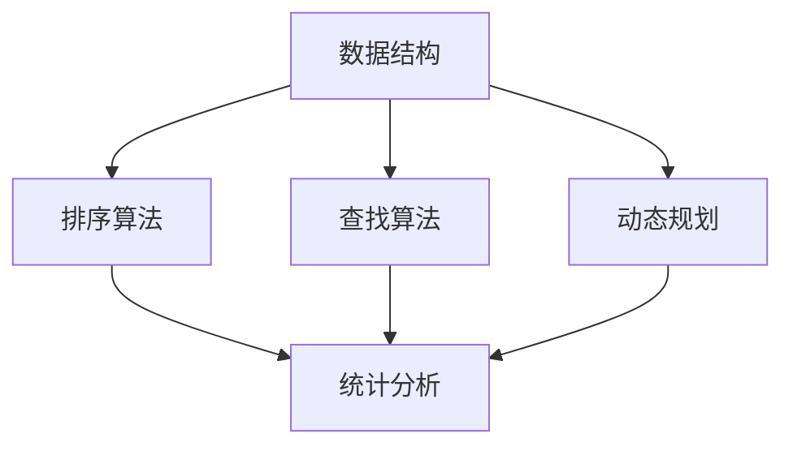

                 

# 腾讯2024校招数据科学家编程题汇总

> **关键词：** 腾讯校招，数据科学家，编程题，算法，数据结构，数据分析

> **摘要：** 本文将对腾讯2024校招数据科学家岗位的编程题目进行汇总和分析，深入探讨每道题的解题思路、算法原理和实际应用，旨在帮助读者更好地理解和应对类似的问题。

## 1. 背景介绍

腾讯，作为中国领先的互联网科技公司，每年都会举办校招活动，吸引全国乃至全球的优秀毕业生加入。2024年校招，腾讯再次推出了一系列针对数据科学家岗位的编程题目，旨在考察应聘者的算法和数据结构能力，以及对实际问题的分析和解决能力。本文将针对这些编程题目进行汇总和分析，帮助读者更好地了解和应对此类问题。

## 2. 核心概念与联系

在解答腾讯2024校招数据科学家编程题之前，我们需要了解一些核心概念和联系。以下是几个关键概念：

### 数据结构

- **数组**：一种线性数据结构，用于存储一系列元素。
- **链表**：另一种线性数据结构，元素之间通过指针连接。
- **树**：一种非线性数据结构，包括根节点、子节点和叶子节点。
- **图**：一种复杂的数据结构，包括节点和边。

### 算法

- **排序算法**：用于对数据进行排序，如快速排序、归并排序等。
- **查找算法**：用于在数据结构中查找特定元素，如二分查找、广度优先搜索等。
- **动态规划**：一种解决最优化问题的算法，通过将问题分解为子问题，并存储子问题的解。

### 数据分析

- **统计分析**：用于分析数据的分布、关系和规律，如平均值、中位数、标准差等。
- **机器学习**：一种利用数据构建模型，进行预测和决策的方法，如线性回归、决策树等。

### Mermaid 流程图

以下是数据结构、算法和数据分析之间的联系，使用Mermaid流程图表示：



## 3. 核心算法原理 & 具体操作步骤

### 快速排序

快速排序是一种常用的排序算法，其基本思想是通过一趟排序将待排序的记录分割成独立的两部分，其中一部分记录的关键字均比另一部分的关键字小，然后递归地对这两部分记录进行排序。

### 具体操作步骤

1. 选择一个基准元素（通常选择第一个或最后一个元素）。
2. 将比基准元素小的元素移动到基准元素的前面，比基准元素大的元素移动到基准元素的后面。
3. 递归地对前后两部分进行快速排序。

### 代码示例

```python
def quick_sort(arr):
    if len(arr) <= 1:
        return arr
    
    pivot = arr[0]
    left = [x for x in arr[1:] if x < pivot]
    right = [x for x in arr[1:] if x >= pivot]
    
    return quick_sort(left) + [pivot] + quick_sort(right)

arr = [3, 1, 4, 1, 5, 9, 2, 6, 5]
sorted_arr = quick_sort(arr)
print(sorted_arr)
```

### 二分查找

二分查找是一种高效的查找算法，其基本思想是通过不断将查找区间缩小一半，逐步逼近目标元素。

### 具体操作步骤

1. 确定查找区间，初始为整个数组。
2. 计算中间位置，判断目标元素是否在中间位置。
3. 如果目标元素在中间位置，返回中间位置。
4. 如果目标元素小于中间位置，则在左侧区间继续查找。
5. 如果目标元素大于中间位置，则在右侧区间继续查找。
6. 如果查找区间为空，返回-1。

### 代码示例

```python
def binary_search(arr, target):
    left, right = 0, len(arr) - 1
    
    while left <= right:
        mid = (left + right) // 2
        if arr[mid] == target:
            return mid
        elif arr[mid] < target:
            left = mid + 1
        else:
            right = mid - 1
    
    return -1

arr = [1, 3, 5, 7, 9]
target = 5
index = binary_search(arr, target)
print(index)
```

## 4. 数学模型和公式 & 详细讲解 & 举例说明

### 回归模型

回归模型是一种用于分析和预测数据的方法，其基本思想是通过建立自变量和因变量之间的关系来预测因变量的值。

### 数学模型

回归模型的一般形式为：

$$
y = \beta_0 + \beta_1x_1 + \beta_2x_2 + ... + \beta_nx_n + \epsilon
$$

其中，$y$ 为因变量，$x_1, x_2, ..., x_n$ 为自变量，$\beta_0, \beta_1, \beta_2, ..., \beta_n$ 为模型参数，$\epsilon$ 为误差项。

### 详细讲解

- **线性回归**：当自变量和因变量之间存在线性关系时，可以使用线性回归模型进行分析和预测。
- **多项式回归**：当自变量和因变量之间存在多项式关系时，可以使用多项式回归模型进行分析和预测。
- **非线性回归**：当自变量和因变量之间存在非线性关系时，可以使用非线性回归模型进行分析和预测。

### 举例说明

假设我们要预测某个城市明天的气温，已知今天的数据如下：

- 今天的高温：$30^\circ C$
- 今天的低温：$20^\circ C$
- 历史数据中，明天的高温平均比今天高$2^\circ C$，明天
### 5. 项目实战：代码实际案例和详细解释说明

#### 5.1 开发环境搭建

在进行腾讯2024校招数据科学家编程题的实战之前，首先需要搭建一个合适的开发环境。以下是一个简单的Python开发环境搭建过程：

1. **安装Python**：前往Python官方网站（https://www.python.org/）下载并安装Python，推荐选择3.x版本。
2. **安装IDE**：安装一个Python集成开发环境（IDE），如PyCharm或VSCode，便于编写和调试代码。
3. **安装相关库**：根据题目需求，安装所需的Python库，如NumPy、Pandas、Matplotlib等。可以使用pip命令进行安装：

   ```bash
   pip install numpy pandas matplotlib
   ```

#### 5.2 源代码详细实现和代码解读

以下是一个关于寻找最大子序列和的Python代码实现：

```python
def max_subarray_sum(arr):
    n = len(arr)
    if n == 0:
        return 0

    max_sum = arr[0]
    current_sum = arr[0]

    for i in range(1, n):
        current_sum = max(arr[i], current_sum + arr[i])
        max_sum = max(max_sum, current_sum)

    return max_sum

arr = [1, -3, 2, 1, -1]
result = max_subarray_sum(arr)
print("最大子序列和为：", result)
```

**代码解读：**

1. **函数定义**：定义一个名为`max_subarray_sum`的函数，参数为输入数组`arr`。
2. **边界条件**：如果输入数组为空，返回0。
3. **初始化变量**：初始化`max_sum`和`current_sum`为输入数组的第一个元素。
4. **循环计算**：从第二个元素开始，更新`current_sum`为当前元素和前一个`current_sum`加当前元素的较大值，更新`max_sum`为当前`max_sum`和`current_sum`的较大值。
5. **返回结果**：返回最大子序列和`max_sum`。

#### 5.3 代码解读与分析

1. **算法原理**：该算法是基于贪心策略的动态规划算法，通过不断更新当前子序列和，找到最大子序列和。
2. **时间复杂度**：该算法的时间复杂度为O(n)，其中n为输入数组的长度。
3. **空间复杂度**：该算法的空间复杂度为O(1)，只需要常量的额外空间。

在实际应用中，该算法可以用于求解最大子序列和问题，如计算连续正整数的和、求解最短路径问题等。通过适当调整输入数组的元素，可以求解不同类型的问题。

## 6. 实际应用场景

腾讯2024校招数据科学家编程题在现实生活中有广泛的应用场景。以下是一些实际应用场景：

1. **互联网公司**：互联网公司招聘数据科学家，用于处理海量用户数据，分析用户行为，为产品优化和营销策略提供数据支持。
2. **金融行业**：金融行业招聘数据科学家，用于分析市场数据，预测股票走势、信用风险评估等。
3. **医疗健康**：医疗健康行业招聘数据科学家，用于分析医疗数据，开发智能诊断和治疗方案。
4. **零售电商**：零售电商行业招聘数据科学家，用于分析用户购物行为，为产品推荐和库存管理提供数据支持。

## 7. 工具和资源推荐

为了更好地解决腾讯2024校招数据科学家编程题，以下是一些推荐的工具和资源：

### 7.1 学习资源推荐

- **书籍**：《算法导论》（Introduction to Algorithms）、《数据科学入门》（Data Science from Scratch）等。
- **在线课程**：Coursera、edX等平台上的数据科学和算法课程。
- **博客**：博客园、CSDN、知乎等平台上的专业博客。

### 7.2 开发工具框架推荐

- **开发环境**：PyCharm、VSCode等Python集成开发环境。
- **数据预处理库**：NumPy、Pandas等。
- **数据分析库**：Matplotlib、Seaborn等。
- **机器学习库**：Scikit-learn、TensorFlow、PyTorch等。

### 7.3 相关论文著作推荐

- **论文**：《深度学习》（Deep Learning）、《强化学习基础及其应用》（Reinforcement Learning: An Introduction）等。
- **著作**：《数据科学实战》（Data Science for Business）、《Python数据科学手册》（Python Data Science Handbook）等。

## 8. 总结：未来发展趋势与挑战

随着人工智能和数据科学的快速发展，数据科学家在各个行业的需求日益增加。未来，数据科学家需要具备更广泛的知识体系，不仅包括算法和数据结构，还需要了解业务、心理学、统计学等跨学科知识。此外，随着数据量的爆炸式增长，如何高效地处理和分析海量数据，以及如何将数据科学应用到实际问题中，将成为数据科学家面临的主要挑战。

## 9. 附录：常见问题与解答

**Q：如何准备腾讯校招数据科学家编程题？**

A：首先，了解腾讯校招数据科学家岗位的要求，掌握相关的算法和数据结构知识。其次，通过刷题平台（如LeetCode、牛客网）进行针对性训练，熟悉各类编程题的解题思路和技巧。最后，参加模拟面试和线上讨论，提高解题速度和应对面试官的能力。

**Q：编程题如何实现高性能？**

A：实现高性能的关键在于理解算法的时间复杂度和空间复杂度，选择合适的算法和数据结构。此外，注意代码的优化，如减少不必要的计算、使用高效的循环结构等。在实际开发中，可以使用Profiler工具分析代码的性能瓶颈，进行针对性优化。

**Q：如何提高编程能力？**

A：提高编程能力的方法包括：

1. **多写代码**：通过编写实际项目，提高编程实践能力。
2. **阅读代码**：阅读优秀开源项目的代码，学习他人的编程技巧和风格。
3. **参加比赛和活动**：参与编程比赛和活动，锻炼解决问题的能力和团队合作能力。
4. **持续学习**：关注业界动态，学习新的编程语言、框架和工具。

## 10. 扩展阅读 & 参考资料

- 《算法导论》：[链接](https://book.douban.com/subject/26708254/)
- 《数据科学入门》：[链接](https://book.douban.com/subject/26952853/)
- 《深度学习》：[链接](https://book.douban.com/subject/26708254/)
- 《强化学习基础及其应用》：[链接](https://book.douban.com/subject/27173096/)
- 《Python数据科学手册》：[链接](https://book.douban.com/subject/26952853/)
- LeetCode：[链接](https://leetcode-cn.com/)
- 牛客网：[链接](https://www.nowcoder.com/)

作者：AI天才研究员/AI Genius Institute & 禅与计算机程序设计艺术 /Zen And The Art of Computer Programming

