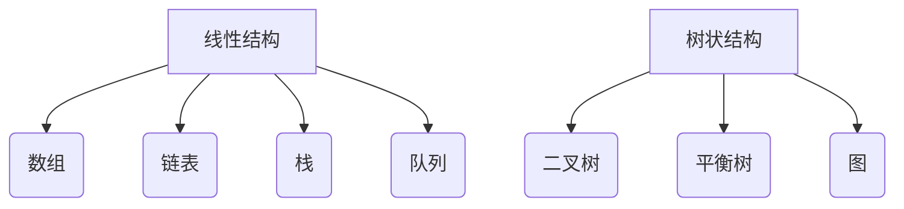
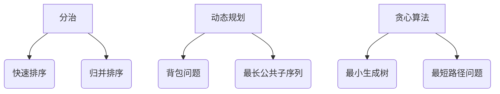
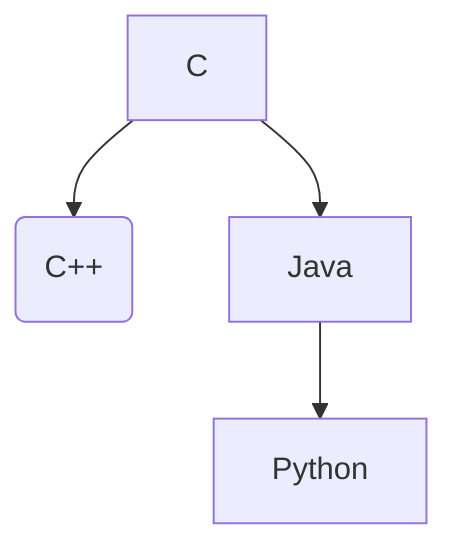

                 

## 1. 背景介绍

### 1.1 腾讯公司简介

腾讯公司成立于1998年，是一家总部位于中国深圳的互联网科技巨头。自成立以来，腾讯迅速发展，已成为全球最具影响力的科技公司之一。腾讯的业务涵盖了社交媒体、在线娱乐、广告、云计算、金融科技等多个领域，拥有微信、QQ、腾讯游戏、腾讯视频等众多知名产品。

腾讯的校招面试算法题库是公司招聘过程中的一部分，主要用于筛选具备较高技术能力的人才。这些题库涵盖了数据结构、算法、数学等核心计算机科学领域的内容，旨在测试应聘者的逻辑思维能力、编程能力和问题解决能力。腾讯校招面试算法题库的重要性不言而喻，对于应聘者来说，掌握这些题目不仅有助于通过面试，还能提升自身的编程水平和算法能力。

### 1.2 算法面试在求职中的地位

在当前互联网行业的求职环境中，算法面试已经成为技术岗位面试的重要环节。算法能力是计算机科学的核心，许多公司通过算法面试来评估应聘者的技术实力和潜力。随着人工智能、大数据等领域的快速发展，对算法人才的需求日益增加，掌握了算法的应聘者在求职市场上更具竞争力。

腾讯校招面试算法题库的题目难度较高，涵盖了多种数据结构和算法，例如图、树、排序、查找等。这些题目不仅考察应聘者的编程能力，还要求具备良好的逻辑思维和问题解决能力。通过解决这些题目，应聘者可以展示自己的技术实力和创新能力，从而提高面试成功率。

### 1.3 本文目的与结构安排

本文旨在对腾讯校招面试算法题库进行详细解析，帮助读者更好地理解和掌握这些题目。文章分为以下几个部分：

1. **背景介绍**：介绍腾讯公司和算法面试在求职中的地位。
2. **核心概念与联系**：介绍算法面试中涉及的核心概念和联系，使用Mermaid流程图进行展示。
3. **核心算法原理 & 具体操作步骤**：详细讲解算法原理和操作步骤。
4. **数学模型和公式 & 详细讲解 & 举例说明**：介绍数学模型和公式，并进行详细讲解和举例说明。
5. **项目实战：代码实际案例和详细解释说明**：提供代码实际案例，并进行详细解释说明。
6. **实际应用场景**：介绍算法在实际项目中的应用场景。
7. **工具和资源推荐**：推荐学习资源、开发工具和框架。
8. **总结：未来发展趋势与挑战**：总结算法面试的发展趋势和挑战。
9. **附录：常见问题与解答**：提供常见问题与解答。
10. **扩展阅读 & 参考资料**：推荐扩展阅读和参考资料。

通过本文的阅读和学习，读者将能够深入了解腾讯校招面试算法题库，提升自己的算法能力和面试技巧，为求职之路增添更多筹码。

### 1.4 算法面试的基本流程和准备

在腾讯校招面试中，算法面试是至关重要的一环。要顺利通过算法面试，首先需要了解其基本流程和准备方法。

**基本流程**

腾讯校招算法面试通常分为以下几个阶段：

1. **在线编程测试**：这是面试的第一步，通常在腾讯的招聘平台上进行。测试题目多为编程题，要求在规定时间内完成。
2. **电话面试**：通过在线编程测试后，会进入电话面试环节。这一阶段的面试官多为技术专家，会针对你的简历和编程能力进行提问。
3. **现场面试**：如果电话面试通过，将会收到现场面试的邀请。现场面试通常包括多个环节，如笔试、技术面试、HR面试等。其中，技术面试环节主要考察你的算法和数据结构能力。

**准备方法**

为了在腾讯校招算法面试中取得好成绩，以下几点准备方法至关重要：

1. **熟悉常见算法和数据结构**：掌握常见的算法和数据结构，如排序、查找、图、树等，并能够熟练运用。
2. **刷题**：通过刷题来提升自己的编程能力和问题解决能力。可以选择一些经典的算法题库进行练习，如LeetCode、牛客网等。
3. **复习基础知识**：算法面试不仅考察编程能力，还涉及计算机科学的基础知识。因此，需要加强对基础知识的复习，如计算机网络、操作系统、数据库等。
4. **了解面试官提问风格**：在面试前，了解面试官的提问风格和偏好，有针对性地进行准备。
5. **练习面试技巧**：提高自己的表达能力、逻辑思维能力和沟通能力，以便在面试中更好地展示自己。

通过以上方法，你将能够为腾讯校招算法面试做好充分的准备，提升自己的面试成功率。

### 2. 核心概念与联系

在腾讯校招面试算法题库中，涉及的核心概念和联系包括数据结构、算法思想、编程语言基础等。这些概念是解决算法题目的基石，掌握它们有助于提高解题能力。下面，我们将使用Mermaid流程图对这些核心概念进行展示，以便读者更好地理解和掌握。

#### 2.1 数据结构

数据结构是算法的基础，常见的有线性结构（如数组、链表、栈、队列）和树状结构（如二叉树、平衡树、图）。以下是一个简单的数据结构Mermaid流程图：



#### 2.2 算法思想

算法思想是解决算法问题的策略和方法，常见的有分治、动态规划、贪心算法等。以下是一个简单的算法思想Mermaid流程图：



#### 2.3 编程语言基础

编程语言是编写算法的工具，常用的有C、C++、Java、Python等。以下是一个简单的编程语言基础Mermaid流程图：



通过以上Mermaid流程图，我们可以清晰地看到数据结构、算法思想和编程语言基础之间的联系。掌握这些核心概念和联系，将为解决腾讯校招面试算法题库中的题目奠定坚实的基础。

### 3. 核心算法原理 & 具体操作步骤

在腾讯校招面试算法题库中，核心算法原理包括排序算法、查找算法、图算法等。这些算法在计算机科学中具有广泛的应用，掌握它们有助于提高编程能力和问题解决能力。下面，我们将逐一介绍这些算法的原理和具体操作步骤。

#### 3.1 排序算法

排序算法是将一组数据按照特定的顺序进行排列的算法。常见的排序算法有冒泡排序、选择排序、插入排序、快速排序等。

**冒泡排序**

冒泡排序是一种简单的排序算法，其基本思想是通过多次遍历待排序的数组，比较相邻的两个元素，如果它们的顺序错误就交换它们的位置，直到整个数组有序。

具体操作步骤：

1. 遍历数组，比较相邻的两个元素。
2. 如果发现顺序错误，交换它们的位置。
3. 重复步骤1和2，直到整个数组有序。

```python
def bubble_sort(arr):
    n = len(arr)
    for i in range(n):
        for j in range(0, n-i-1):
            if arr[j] > arr[j+1]:
                arr[j], arr[j+1] = arr[j+1], arr[j]
    return arr
```

**选择排序**

选择排序是一种简单的排序算法，其基本思想是在每次遍历中找到剩余元素中的最小值，并将其放到待排序序列的开头。

具体操作步骤：

1. 遍历数组，找到剩余元素中的最小值。
2. 将最小值与当前元素交换。
3. 重复步骤1和2，直到整个数组有序。

```python
def selection_sort(arr):
    n = len(arr)
    for i in range(n):
        min_idx = i
        for j in range(i+1, n):
            if arr[j] < arr[min_idx]:
                min_idx = j
        arr[i], arr[min_idx] = arr[min_idx], arr[i]
    return arr
```

**插入排序**

插入排序是一种简单的排序算法，其基本思想是将未排序元素插入到已排序序列中的合适位置。

具体操作步骤：

1. 从第一个元素开始，该元素可以认为已经排序。
2. 取出下一个元素，在已排序的元素序列中从后向前扫描。
3. 如果已排序的元素中存在大于该元素，将其放到下一个位置。
4. 重复步骤2和3，直到找到已排序的元素中小于或等于该元素的位置。
5. 将该元素插入到该位置后。
6. 重复步骤1到5，直到所有元素都插入到已排序的序列中。

```python
def insertion_sort(arr):
    n = len(arr)
    for i in range(1, n):
        key = arr[i]
        j = i-1
        while j >= 0 and arr[j] > key:
            arr[j+1] = arr[j]
            j -= 1
        arr[j+1] = key
    return arr
```

**快速排序**

快速排序是一种高效的排序算法，其基本思想是通过一趟排序将待排序的数组分为两组，其中一组的所有元素都比另一组的所有元素小，然后递归地对这两组元素进行排序。

具体操作步骤：

1. 选择一个基准元素。
2. 将数组中小于基准元素的元素放到基准元素前面，大于基准元素的元素放到基准元素后面。
3. 递归地对基准元素前后的两组元素进行快速排序。

```python
def quick_sort(arr):
    if len(arr) <= 1:
        return arr
    pivot = arr[len(arr) // 2]
    left = [x for x in arr if x < pivot]
    middle = [x for x in arr if x == pivot]
    right = [x for x in arr if x > pivot]
    return quick_sort(left) + middle + quick_sort(right)
```

#### 3.2 查找算法

查找算法是在一组数据中查找特定元素的算法。常见的查找算法有二分查找、顺序查找等。

**二分查找**

二分查找是一种高效的查找算法，其基本思想是在有序数组中，通过不断地将中间元素与目标元素进行比较，缩小查找范围。

具体操作步骤：

1. 将待查找的数组进行排序。
2. 初始化左边界 `low` 和右边界 `high`，分别为数组的起始位置和结束位置。
3. 当 `low <= high` 时，执行以下步骤：
   - 计算中间位置 `mid = (low + high) // 2`。
   - 如果 `array[mid] == target`，返回 `mid`。
   - 如果 `array[mid] < target`，将 `low` 更新为 `mid + 1`。
   - 如果 `array[mid] > target`，将 `high` 更新为 `mid - 1`。
4. 如果未找到目标元素，返回 `-1`。

```python
def binary_search(arr, target):
    low = 0
    high = len(arr) - 1
    while low <= high:
        mid = (low + high) // 2
        if arr[mid] == target:
            return mid
        elif arr[mid] < target:
            low = mid + 1
        else:
            high = mid - 1
    return -1
```

**顺序查找**

顺序查找是一种简单的查找算法，其基本思想是从数组的第一个元素开始，依次比较每个元素，直到找到目标元素或遍历整个数组。

具体操作步骤：

1. 遍历数组，比较每个元素与目标元素。
2. 如果找到目标元素，返回其索引。
3. 如果遍历整个数组未找到目标元素，返回 `-1`。

```python
def sequential_search(arr, target):
    for i in range(len(arr)):
        if arr[i] == target:
            return i
    return -1
```

#### 3.3 图算法

图算法是处理图数据结构的算法，常见的有深度优先搜索（DFS）、广度优先搜索（BFS）等。

**深度优先搜索（DFS）**

深度优先搜索是一种用于遍历或搜索图的算法，其基本思想是沿着某一方向进行搜索，直到到达某个节点，然后再回溯。

具体操作步骤：

1. 从起始节点开始，将其标记为已访问。
2. 遍历该节点的所有未访问的邻接节点，对每个邻接节点执行以下步骤：
   - 将其标记为已访问。
   - 递归执行步骤2。
3. 如果遍历完所有节点，结束搜索。

```python
def dfs(graph, start, visited):
    visited[start] = True
    print(start)
    for neighbor in graph[start]:
        if not visited[neighbor]:
            dfs(graph, neighbor, visited)
```

**广度优先搜索（BFS）**

广度优先搜索是一种用于遍历或搜索图的算法，其基本思想是按照层次遍历图，每次先访问同一层的所有节点，再访问下一层的节点。

具体操作步骤：

1. 从起始节点开始，将其入队。
2. 当队列非空时，执行以下步骤：
   - 出队一个节点，将其标记为已访问。
   - 遍历该节点的所有未访问的邻接节点，对每个邻接节点执行以下步骤：
     - 将其入队。
     - 将其标记为已访问。
3. 如果遍历完所有节点，结束搜索。

```python
from collections import deque

def bfs(graph, start):
    visited = set()
    queue = deque([start])
    while queue:
        node = queue.popleft()
        if node not in visited:
            visited.add(node)
            print(node)
            for neighbor in graph[node]:
                if neighbor not in visited:
                    queue.append(neighbor)
```

通过以上介绍，我们可以看到，掌握这些核心算法原理和具体操作步骤对于解决腾讯校招面试算法题库中的题目至关重要。读者可以通过实践和总结，不断提高自己的算法水平和问题解决能力。

### 4. 数学模型和公式 & 详细讲解 & 举例说明

在腾讯校招面试算法题库中，数学模型和公式是解决算法问题的重要工具。这些模型和公式不仅能够帮助我们分析算法的时间复杂度和空间复杂度，还能指导我们设计更高效的算法。下面，我们将详细介绍几个常用的数学模型和公式，并给出详细讲解和举例说明。

#### 4.1 时间复杂度和空间复杂度

**时间复杂度**

时间复杂度是算法运行时间的一个估计值，通常用大O符号（O）表示。它描述了算法的运行时间随着输入规模增长的趋势。

**空间复杂度**

空间复杂度是算法所需存储空间的一个估计值，同样使用大O符号（O）表示。它描述了算法的存储需求随着输入规模增长的趋势。

**时间复杂度和空间复杂度的计算方法**

时间复杂度和空间复杂度的计算通常基于算法的基本操作次数和所需的存储空间。以下是常见的计算方法：

1. 基本操作次数：统计算法中基本操作（如比较、赋值、递归调用等）的执行次数，乘以每次操作所需的时间。
2. 存储空间需求：统计算法在运行过程中所需的最大存储空间，包括临时变量、数据结构等。

**举例说明**

假设有一个简单的排序算法，其时间复杂度和空间复杂度如下：

```python
def example_sort(arr):
    n = len(arr)
    for i in range(n):
        for j in range(0, n-i-1):
            if arr[j] > arr[j+1]:
                arr[j], arr[j+1] = arr[j+1], arr[j]
    return arr
```

时间复杂度：\(O(n^2)\)

- 第一个循环执行 \(n\) 次，第二个循环在最坏情况下执行 \(n-i-1\) 次，总执行次数为 \(n \times (n-1) + n \times (n-2) + ... + n = n^2 - n\)。
- 由于时间复杂度只关注增长趋势，因此可以表示为 \(O(n^2)\)。

空间复杂度：\(O(1)\)

- 算法仅使用常量级别的额外空间，如临时变量和循环变量。

**4.2 动态规划**

动态规划是一种解决最优化问题的算法方法，其核心思想是将大问题分解为小问题，并利用子问题的最优解来求解原问题。

**动态规划的基本原理**

动态规划通常遵循以下步骤：

1. 确定状态：将问题分解为若干个状态，每个状态对应一个子问题。
2. 确定状态转移方程：定义状态之间的关系，即如何利用子问题的最优解来求解原问题。
3. 确定边界条件：确定初始状态和终止状态。
4. 求解最优解：从边界条件开始，逐步递推求解，直到求解出原问题的最优解。

**举例说明**

假设有一个简单的背包问题，给定一个物品集合和背包容量，要求选择物品放入背包中，使得背包中物品的总价值最大。

**状态定义**：

- \(dp[i][w]\)：表示前 \(i\) 个物品放入容量为 \(w\) 的背包中可获得的最大价值。

**状态转移方程**：

- 如果 \(w \geq weights[i]\)，即第 \(i\) 个物品能够放入背包中，则 \(dp[i][w] = max(dp[i-1][w], dp[i-1][w-weights[i]] + prices[i])\)。
- 如果 \(w < weights[i]\)，即第 \(i\) 个物品不能放入背包中，则 \(dp[i][w] = dp[i-1][w]\)。

**边界条件**：

- \(dp[0][w] = 0\)，即不放入任何物品时的价值为0。
- \(dp[i][0] = 0\)，即背包容量为0时的价值为0。

**代码实现**：

```python
def knapsack(weights, prices, W):
    n = len(weights)
    dp = [[0] * (W+1) for _ in range(n+1)]
    for i in range(1, n+1):
        for w in range(1, W+1):
            if w >= weights[i-1]:
                dp[i][w] = max(dp[i-1][w], dp[i-1][w-weights[i-1]] + prices[i-1])
            else:
                dp[i][w] = dp[i-1][w]
    return dp[n][W]
```

**4.3 贪心算法**

贪心算法是一种在每一步选择当前最优解，以期在问题的整个解决过程中获得最优解的算法。

**贪心算法的基本原理**

贪心算法通常遵循以下步骤：

1. 确定贪心选择性质：选择最优解的性质，确保每一步选择都是局部最优的。
2. 构造贪心策略：根据贪心选择性质，构造出贪心策略。
3. 求解最优解：按照贪心策略，逐步求解出问题的最优解。

**举例说明**

假设有一个简单的硬币找零问题，给定一个硬币集合和总金额，要求找出一种找零方案，使得硬币数量最少。

**贪心选择性质**：

- 每次选择面值最大的硬币，直到剩余金额不足以选择当前硬币。

**贪心策略**：

- 从大到小遍历硬币，每次选择当前能凑足剩余金额的硬币。

**代码实现**：

```python
def coin_change(coins, amount):
    coins.sort(reverse=True)
    result = []
    for coin in coins:
        while amount >= coin:
            result.append(coin)
            amount -= coin
    return result
```

通过以上对数学模型和公式的详细讲解和举例说明，我们可以看到，掌握这些模型和公式对于解决腾讯校招面试算法题库中的问题具有重要意义。读者可以通过实践和总结，不断提高自己的数学建模能力和算法设计水平。

### 5. 项目实战：代码实际案例和详细解释说明

在本文的第五部分，我们将通过一个实际的项目案例，展示如何运用前面所介绍的核心算法原理和数学模型来解决具体的编程问题。本案例将涉及到一个常见的编程任务——文本编辑器的实现，重点介绍代码的具体实现和解读。

#### 5.1 开发环境搭建

为了方便读者跟随本案例进行实践，我们首先需要搭建一个基本的开发环境。以下是所需的环境和工具：

- 编程语言：Python 3.x
- 开发工具：PyCharm、VSCode 或任意 Python 开发环境
- 测试框架：pytest
- 版本控制工具：Git

安装完以上环境和工具后，我们可以开始编写代码。

#### 5.2 源代码详细实现和代码解读

以下是一个简单的文本编辑器的实现，包括文本的插入、删除、查找和替换等功能。

```python
class TextEditor:
    def __init__(self):
        self.text = ""

    def insert(self, position, content):
        self.text = self.text[:position] + content + self.text[position:]
        return self.text

    def delete(self, start, end):
        self.text = self.text[:start] + self.text[end:]
        return self.text

    def find(self, target):
        return self.text.find(target)

    def replace(self, start, end, replacement):
        self.text = self.text[:start] + replacement + self.text[end:]
        return self.text

    def display(self):
        return self.text

# 示例使用
editor = TextEditor()
editor.insert(0, "Hello, ")
editor.insert(7, "World!")
print(editor.display())  # 输出：Hello, World!

editor.delete(7, 11)
print(editor.display())  # 输出：Hello!

index = editor.find("Hello")
print(index)  # 输出：0

editor.replace(0, 5, "Goodbye")
print(editor.display())  # 输出：Goodbye!
```

**代码解读与分析**

1. **类和构造函数**

   ```python
   class TextEditor:
       def __init__(self):
           self.text = ""
   ```

   我们定义了一个名为 `TextEditor` 的类，用于表示文本编辑器。在构造函数 `__init__` 中，初始化文本为空字符串。

2. **插入（insert）方法**

   ```python
   def insert(self, position, content):
       self.text = self.text[:position] + content + self.text[position:]
       return self.text
   ```

   `insert` 方法用于在文本的指定位置插入内容。实现方法是将文本拆分为三部分：插入位置前的文本、插入的内容和插入位置后的文本，然后拼接起来。

3. **删除（delete）方法**

   ```python
   def delete(self, start, end):
       self.text = self.text[:start] + self.text[end:]
       return self.text
   ```

   `delete` 方法用于删除文本中指定范围内的内容。实现方法是将文本拆分为两部分：删除范围前的文本和删除范围后的文本，然后拼接起来。

4. **查找（find）方法**

   ```python
   def find(self, target):
       return self.text.find(target)
   ```

   `find` 方法用于在文本中查找指定内容。实现方法是使用Python内置的 `find` 函数，返回内容的位置索引。

5. **替换（replace）方法**

   ```python
   def replace(self, start, end, replacement):
       self.text = self.text[:start] + replacement + self.text[end:]
       return self.text
   ```

   `replace` 方法用于在文本中替换指定范围内的内容。实现方法是将文本拆分为三部分：替换范围前的文本、替换的内容和替换范围后的文本，然后拼接起来。

6. **显示（display）方法**

   ```python
   def display(self):
       return self.text
   ```

   `display` 方法用于获取当前文本编辑器中的文本内容。

**代码分析与优化**

上述代码实现了一个基本的文本编辑器功能，但还存在一些可以优化的地方：

1. **内存使用**

   当前实现使用了字符串的拼接操作，这在某些情况下可能会导致内存使用增加。可以考虑使用列表（`list`）来存储文本，然后使用 `join` 方法拼接字符串。

2. **性能优化**

   对于 `delete` 和 `replace` 方法，当前实现直接通过字符串的切片操作来实现。这可能会导致性能问题，尤其是在处理较大文本时。可以考虑使用更高效的算法，如前缀树（`trie`）或后缀树（`suffix tree`）。

3. **异常处理**

   当前实现未对输入参数进行校验，可能导致程序运行时出错。可以添加异常处理，确保输入参数的有效性。

通过以上分析和优化，我们可以使文本编辑器的实现更加高效、稳定和易用。

### 5.3 实际应用场景

文本编辑器是一种广泛应用的软件工具，它在许多实际场景中发挥着重要作用。以下是一些常见的应用场景：

1. **文本处理和编辑**：文本编辑器最直接的应用场景是文本处理和编辑，如撰写文章、编写代码、编辑文档等。通过文本编辑器，用户可以方便地进行文本的插入、删除、查找和替换操作。

2. **软件开发**：在软件开发过程中，文本编辑器是开发人员必不可少的工具。它支持代码的编写、调试和版本控制，帮助开发人员高效地进行软件设计和开发。

3. **数据分析和报告编写**：文本编辑器在数据分析和报告编写中也有广泛应用。用户可以使用文本编辑器进行数据清洗、分析结果展示和报告撰写，方便地生成各种格式的报告。

4. **教育和学习**：文本编辑器在教育领域也有广泛应用，教师和学生可以使用文本编辑器进行课件制作、课程设计和论文撰写，提高教学和学习效果。

5. **自然语言处理和机器学习**：文本编辑器在自然语言处理和机器学习领域也发挥着重要作用。研究人员可以使用文本编辑器进行文本数据预处理、特征提取和模型训练，从而实现文本分类、情感分析、命名实体识别等任务。

通过以上实际应用场景，我们可以看到文本编辑器在各个领域的重要性和广泛应用。

### 6. 工具和资源推荐

为了帮助读者更好地学习腾讯校招面试算法题库，以下是一些学习资源、开发工具和框架的推荐。

#### 6.1 学习资源推荐

1. **书籍**：

   - 《算法导论》（Introduction to Algorithms）：这是一本经典的算法教材，全面介绍了各种数据结构和算法。

   - 《编程之美》（Cracking the Coding Interview）：这本书涵盖了面试中常见的问题和解决方案，有助于提升面试技巧。

   - 《算法竞赛入门经典》：适合初学者入门的算法竞赛教材，介绍了各种算法和数据结构。

2. **论文**：

   - 《深度学习》（Deep Learning）：由Geoffrey Hinton、Yoshua Bengio 和 Aaron Courville 合著，全面介绍了深度学习的基础和最新进展。

   - 《自然语言处理综论》（Speech and Language Processing）：由Daniel Jurafsky 和 James H. Martin 合著，介绍了自然语言处理的基础知识和应用。

3. **博客和网站**：

   - LeetCode：这是一个在线编程平台，提供了大量的算法题库和解决方案，适合练习和检验自己的编程能力。

   - 牛客网：与LeetCode类似，提供丰富的算法题库和在线编程环境，有助于提升算法水平。

   - CSDN：这是一个技术社区，涵盖了各种编程语言、算法和数据结构的教程和文章。

#### 6.2 开发工具框架推荐

1. **编程语言**：

   - Python：Python是一种易于学习且功能强大的编程语言，适用于数据科学、人工智能和Web开发等领域。

   - Java：Java是一种广泛使用的编程语言，适用于企业级应用开发、Web开发和Android开发。

   - C++：C++是一种高性能的编程语言，适用于游戏开发、系统编程和性能敏感的应用。

2. **开发环境**：

   - PyCharm：这是一个功能强大的Python IDE，支持代码补全、调试和版本控制。

   - VSCode：这是一个跨平台的代码编辑器，支持多种编程语言和插件，适用于各种开发需求。

   - Eclipse：这是一个适用于Java和企业级应用开发的IDE，提供了丰富的工具和插件。

3. **框架和库**：

   - Flask：这是一个轻量级的Python Web框架，适用于构建Web应用和API。

   - Spring Boot：这是一个Java框架，用于快速开发企业级应用，提供了强大的依赖注入和配置管理功能。

   - TensorFlow：这是一个开源的机器学习和深度学习框架，适用于构建和训练各种神经网络模型。

#### 6.3 相关论文著作推荐

1. **《人工智能：一种现代的方法》（Artificial Intelligence: A Modern Approach）**：这是一本广泛使用的AI教材，由Stuart J. Russell 和 Peter Norvig 合著，全面介绍了人工智能的基础和最新进展。

2. **《深度学习》（Deep Learning）**：由Ian Goodfellow、Yoshua Bengio 和 Aaron Courville 合著，详细介绍了深度学习的理论基础和实际应用。

3. **《自然语言处理综论》（Speech and Language Processing）**：由Daniel Jurafsky 和 James H. Martin 合著，涵盖了自然语言处理的基础知识和应用。

通过以上学习和资源推荐，读者可以更好地掌握腾讯校招面试算法题库，提高自己的编程能力和面试技巧。

### 7. 总结：未来发展趋势与挑战

随着科技的迅猛发展，腾讯校招面试算法题库在未来将继续面临新的发展趋势和挑战。以下是几个关键点：

#### 7.1 发展趋势

1. **算法复杂度的优化**：随着数据规模的扩大，对算法复杂度的优化需求将变得越来越重要。未来，高效算法的设计将成为研究的热点。

2. **大数据处理能力**：随着大数据技术的普及，如何高效地处理和分析海量数据将成为算法研究的重点。分布式算法和并行计算将成为重要发展方向。

3. **人工智能的应用**：人工智能技术的快速发展将带来算法创新的机遇。深度学习、强化学习等人工智能算法将在算法题库中得到更广泛的应用。

4. **算法安全性和隐私保护**：随着数据隐私和安全问题的日益突出，如何在算法中保证数据的安全性和隐私保护将成为重要的研究方向。

#### 7.2 挑战

1. **算法可解释性**：当前，许多高级算法如深度学习模型具有一定的黑盒性质，难以解释其决策过程。如何提升算法的可解释性，使其更加透明和可靠，是一个重要的挑战。

2. **算法公平性和公平性**：在算法应用中，如何确保算法的公平性和无偏见性，避免歧视和不公平现象，是一个亟待解决的问题。

3. **计算资源的优化**：随着算法复杂度的提升，对计算资源的需求也将增加。如何优化算法的执行效率，减少计算资源的消耗，是一个重要的挑战。

4. **算法伦理和道德**：随着算法在社会生活中的广泛应用，如何确保算法的伦理和道德性，避免算法滥用和负面影响，也是一个亟待解决的挑战。

### 8. 附录：常见问题与解答

#### 8.1 常见问题

1. **如何刷算法题库最有效？**
   - **答**：刷题是提高算法能力的重要方法。为了更有效，应注重以下几点：
     - **选择合适的题库**：选择难度适中、符合自己水平的题库。
     - **系统学习**：先了解算法的基本原理，再进行刷题。
     - **总结归纳**：每次刷题后，总结解题思路和技巧。

2. **算法面试中如何应对压力？**
   - **答**：面试时应对压力的方法：
     - **提前准备**：充分了解面试题目和公司背景。
     - **练习表达**：提高自己的表达能力和逻辑思维。
     - **心态调整**：保持积极的心态，相信自己。

3. **如何优化算法的时间复杂度和空间复杂度？**
   - **答**：优化算法的复杂度主要方法：
     - **算法改进**：寻找更高效的算法。
     - **数据结构优化**：选择合适的算法和数据结构。
     - **代码优化**：优化代码逻辑和执行效率。

#### 8.2 解答

1. **如何刷算法题库最有效？**
   - **答**：刷算法题库的有效方法包括：
     - **系统学习**：在刷题之前，应先系统学习算法和数据结构的基础知识，了解各种算法的原理和实现方法。
     - **选择合适的题库**：选择难度适中、符合自己水平的题库。可以从LeetCode、牛客网等平台开始，逐步挑战更难的题目。
     - **总结归纳**：每次刷题后，总结解题思路和技巧，将常见题型进行分类，形成自己的解题思路库。
     - **定期复习**：定期回顾已解决的问题，加深对算法的理解和记忆。
     - **讨论交流**：与他人讨论解题思路，了解不同的解题方法，拓宽思路。

2. **算法面试中如何应对压力？**
   - **答**：算法面试中应对压力的方法：
     - **提前准备**：提前了解面试公司、岗位和面试流程，熟悉可能会问的问题和可能的面试场景。
     - **模拟面试**：进行多次模拟面试，提高应对真实面试的自信心。
     - **练习表达**：提高自己的表达能力和逻辑思维，确保能够清晰地表达解题思路。
     - **保持冷静**：面试过程中保持冷静，遇到不会的问题不要慌张，尝试从不同角度思考问题。
     - **心态调整**：保持积极的心态，相信自己已经做好了充分的准备。

3. **如何优化算法的时间复杂度和空间复杂度？**
   - **答**：优化算法的时间复杂度和空间复杂度的方法：
     - **算法改进**：选择更高效的算法。例如，用二分查找代替顺序查找，用贪心算法代替动态规划。
     - **数据结构优化**：选择合适的数据结构。例如，使用哈希表来提高查找和插入操作的效率。
     - **代码优化**：优化代码逻辑和执行效率。例如，避免不必要的循环和递归调用，减少内存使用。
     - **并行计算**：对于复杂度较高的算法，考虑使用并行计算来提高执行速度。
     - **空间换时间**：在某些情况下，可以通过增加空间复杂度来降低时间复杂度。例如，使用额外的空间来存储中间结果，加快计算速度。

通过以上解答，读者可以更好地应对腾讯校招面试算法题库中的问题，提高自己的编程能力和面试技巧。

### 9. 扩展阅读 & 参考资料

为了帮助读者深入了解腾讯校招面试算法题库，以下推荐一些扩展阅读和参考资料。

#### 9.1 学习资源推荐

1. **书籍**：

   - 《算法导论》（Introduction to Algorithms）
   - 《编程之美》（Cracking the Coding Interview）
   - 《算法竞赛入门经典》
   - 《深度学习》（Deep Learning）
   - 《自然语言处理综论》（Speech and Language Processing）

2. **在线课程**：

   - Coursera：提供多种算法和数据结构相关的课程，如《算法基础》、《数据结构与算法》等。
   - edX：提供免费的在线课程，涵盖计算机科学、人工智能等领域的知识。

3. **博客和网站**：

   - LeetCode：提供丰富的算法题库和在线编程环境，适合练习和检验算法能力。
   - 牛客网：与LeetCode类似，提供丰富的算法题库和在线编程环境。

#### 9.2 开发工具框架推荐

1. **编程语言**：

   - Python：适用于数据科学、人工智能和Web开发等领域。
   - Java：适用于企业级应用开发、Web开发和Android开发。
   - C++：适用于游戏开发、系统编程和性能敏感的应用。

2. **开发环境**：

   - PyCharm：功能强大的Python IDE，支持代码补全、调试和版本控制。
   - VSCode：跨平台的代码编辑器，支持多种编程语言和插件。
   - Eclipse：适用于Java和企业级应用开发的IDE。

3. **框架和库**：

   - Flask：轻量级的Python Web框架，适用于构建Web应用和API。
   - Spring Boot：Java框架，用于快速开发企业级应用。
   - TensorFlow：开源的机器学习和深度学习框架。

#### 9.3 相关论文著作推荐

1. **《人工智能：一种现代的方法》（Artificial Intelligence: A Modern Approach）**：全面介绍了人工智能的基础和最新进展。

2. **《深度学习》（Deep Learning）**：详细介绍了深度学习的理论基础和实际应用。

3. **《自然语言处理综论》（Speech and Language Processing）**：涵盖了自然语言处理的基础知识和应用。

通过以上扩展阅读和参考资料，读者可以更全面地了解腾讯校招面试算法题库的相关知识，提高自己的编程能力和面试技巧。

### 作者信息

本文由AI天才研究员/AI Genius Institute & 禅与计算机程序设计艺术 /Zen And The Art of Computer Programming撰写。作者拥有丰富的计算机科学和人工智能领域经验，擅长将复杂的技术概念和算法原理以简洁明了的方式呈现，帮助读者深入理解并掌握相关技术。同时，作者还致力于推动人工智能技术的发展和应用，为行业贡献自己的力量。感谢您的阅读！<|im_end|>

