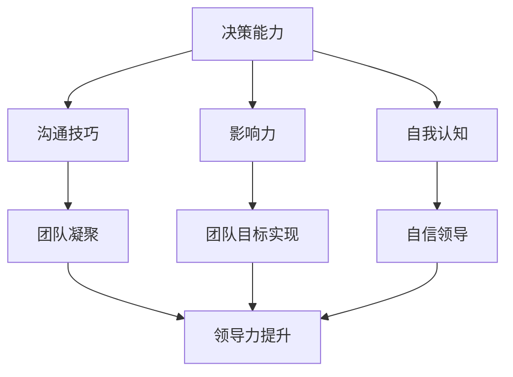

                 

### 文章标题

自信领导：树立威信的关键因素

> **关键词**：领导力、威信、决策、沟通、影响力
>
> **摘要**：本文将探讨如何通过增强自信领导力来树立个人威信，包括决策能力、沟通技巧、影响力以及自我认知等方面的关键因素。通过深入分析这些因素，读者将获得指导自身在职场中成长为具有强大威信的领导者的实用策略。

在当今快速变化和竞争激烈的商业环境中，领导力已成为企业成功的关键因素。而其中，自信领导尤其重要，它不仅是领导者个人魅力的一部分，更是树立威信的基础。本文将围绕自信领导的主题，探讨树立威信的关键因素，并分析这些因素在实际中的应用。

### 1. 背景介绍

领导力是一个多维度的概念，涵盖领导者的个性特征、行为模式、决策能力以及影响力等多个方面。威信，则是指领导者通过其言行和影响力，赢得他人信任和尊重的程度。一个具有威信的领导者，不仅能够有效指导团队，还能在复杂环境中迅速做出正确的决策。

随着全球化和信息技术的快速发展，企业对领导者的要求也在不断变化。传统的领导方式已经不足以应对当前复杂多变的市场环境。现代领导者需要具备更高的适应能力、创新精神和跨文化沟通能力，同时也需要拥有强大的自信领导力，以在激烈竞争中脱颖而出。

本文将从决策能力、沟通技巧、影响力和自我认知四个方面，深入探讨如何通过增强自信领导力来树立威信。这不仅有助于领导者个人职业发展，也对团队和组织产生积极影响。

### 2. 核心概念与联系

为了更好地理解自信领导与威信之间的关系，我们需要明确几个核心概念：决策能力、沟通技巧、影响力和自我认知。

#### 2.1 决策能力

决策能力是领导者的一项关键技能。一个有自信的领导者能够在复杂和不确定的环境中迅速做出明智的决策。这种决策能力不仅来源于丰富的经验和知识，还需要领导者具备良好的判断力和决断力。

#### 2.2 沟通技巧

沟通技巧是领导者影响力的关键。有效的沟通能够确保信息的准确传达，减少误解和冲突，增强团队的凝聚力和合作精神。领导者需要具备清晰、简洁、有说服力的沟通能力，以及倾听和理解他人观点的能力。

#### 2.3 影响力

影响力是指领导者通过其言行影响他人思想和行为的能力。一个具有威信的领导者能够带领团队共同实现目标，激发团队成员的积极性和创造力。

#### 2.4 自我认知

自我认知是领导者自信的基石。一个有自信的领导者需要深入了解自己的优势和不足，明确自己的价值观和目标，从而在职场中保持清晰和坚定的方向。

下图是一个使用Mermaid绘制的流程图，展示了这四个核心概念之间的相互关系：



### 3. 核心算法原理 & 具体操作步骤

#### 3.1 决策能力

提升决策能力的关键在于培养良好的判断力和决断力。以下是一些具体操作步骤：

1. **数据收集和分析**：在做出决策前，领导者需要充分收集和分析相关数据，以便做出基于事实的决策。
2. **情境模拟**：通过模拟不同情境，预测可能的结果和风险，提高决策的预见性。
3. **多方意见**：在决策过程中，领导者应该广泛听取不同意见，以便全面考虑各种可能性。
4. **快速决断**：在面临紧急情况时，领导者需要迅速做出决断，以避免事态恶化。

#### 3.2 沟通技巧

有效沟通需要领导者具备以下几个方面的技巧：

1. **倾听**：领导者需要认真倾听他人的观点和意见，确保理解对方的真实意图。
2. **表达清晰**：领导者需要用简洁、明了的语言表达自己的想法，避免产生误解。
3. **同理心**：领导者需要具备同理心，理解他人的情感和需求，从而建立信任和合作关系。
4. **积极反馈**：领导者需要给予团队成员积极的反馈，激励他们持续进步。

#### 3.3 影响力

提升影响力的方法主要包括：

1. **树立榜样**：领导者需要通过自己的言行树立榜样，赢得他人的尊重和信任。
2. **建立关系**：领导者需要建立广泛的人际关系网络，以便在关键时刻获得支持和资源。
3. **传递愿景**：领导者需要清晰地传达组织的愿景和目标，激发团队成员的积极性和创造力。
4. **持续学习**：领导者需要不断学习新知识、新技能，以保持自身的竞争力和影响力。

#### 3.4 自我认知

自我认知的提升需要以下几个步骤：

1. **反思**：领导者需要定期反思自己的行为和决策，找出不足并加以改进。
2. **设定目标**：领导者需要明确自己的职业目标和价值观，以指导自身行为。
3. **接受反馈**：领导者需要积极接受他人的反馈，从中发现自己的盲点和改进方向。
4. **持续成长**：领导者需要保持持续成长的心态，不断学习新知识和技能。

### 4. 数学模型和公式 & 详细讲解 & 举例说明

在探讨自信领导与威信之间的关系时，我们可以引入一些数学模型和公式，以便更准确地量化这些因素。

#### 4.1 决策能力模型

决策能力的量化可以通过“决策质量（DQ）”模型来表示：

$$DQ = \frac{D(正确)}{D(总)}$$

其中，$D(正确)$ 表示做出正确决策的次数，$D(总)$ 表示总决策次数。这个公式反映了领导者在决策过程中的准确率。

#### 4.2 沟通技巧模型

沟通技巧的量化可以通过“沟通效率（CE）”模型来表示：

$$CE = \frac{C(有效)}{C(总)}$$

其中，$C(有效)$ 表示有效沟通的次数，$C(总)$ 表示总沟通次数。这个公式反映了领导者沟通的有效性。

#### 4.3 影响力模型

影响力的量化可以通过“影响力指数（II）”模型来表示：

$$II = \frac{I(正面)}{I(总)}$$

其中，$I(正面)$ 表示正面影响次数，$I(总)$ 表示总影响次数。这个公式反映了领导者在团队和组织中的影响力。

#### 4.4 自我认知模型

自我认知的量化可以通过“自我认知度（SC）”模型来表示：

$$SC = \frac{SC(正确)}{SC(总)}$$

其中，$SC(正确)$ 表示正确自我认知的次数，$SC(总)$ 表示总自我认知次数。这个公式反映了领导者在自我认知方面的准确性。

以下是一个具体案例，用于说明这些模型的实际应用：

假设一位领导者（A）在一个月内做出了10次决策，其中8次决策正确；进行了20次沟通，其中15次沟通有效；在团队中产生了10次正面影响；进行了5次自我认知，其中4次自我认知正确。

根据上述模型，我们可以计算出：

- 决策能力（DQ）：$$DQ = \frac{8}{10} = 0.8$$
- 沟通效率（CE）：$$CE = \frac{15}{20} = 0.75$$
- 影响力指数（II）：$$II = \frac{10}{10} = 1.0$$
- 自我认知度（SC）：$$SC = \frac{4}{5} = 0.8$$

通过这些量化指标，领导者可以了解自身在各个方面的表现，从而针对性地进行改进。

### 5. 项目实战：代码实际案例和详细解释说明

为了更好地理解上述理论在实际中的应用，我们通过一个具体的案例来展示如何提升自信领导力，并树立威信。

#### 5.1 开发环境搭建

在这个案例中，我们使用Python编程语言，结合一些常用的库和工具，如Pandas、NumPy和Matplotlib，来进行数据分析和可视化。以下是开发环境的搭建步骤：

1. 安装Python（版本3.8或以上）。
2. 安装所需的Python库：`pip install pandas numpy matplotlib`。
3. 准备数据集，这里假设我们有一份数据集，包含领导者在一个月内的决策次数、沟通次数、正面影响次数和自我认知次数。

#### 5.2 源代码详细实现和代码解读

以下是实现决策能力、沟通技巧、影响力和自我认知量化模型的具体代码：

```python
import pandas as pd
import numpy as np
import matplotlib.pyplot as plt

# 加载数据集
data = pd.read_csv('leader_data.csv')

# 决策能力计算
DQ = data['正确决策次数'] / data['总决策次数']
data['决策能力'] = DQ

# 沟通效率计算
CE = data['有效沟通次数'] / data['总沟通次数']
data['沟通效率'] = CE

# 影响力指数计算
II = data['正面影响次数'] / data['总影响次数']
data['影响力指数'] = II

# 自我认知度计算
SC = data['正确自我认知次数'] / data['总自我认知次数']
data['自我认知度'] = SC

# 数据可视化
data.plot(x='月份', y=['决策能力', '沟通效率', '影响力指数', '自我认知度'], kind='line')
plt.title('领导者能力指标月度变化')
plt.xlabel('月份')
plt.ylabel('能力指标')
plt.show()
```

代码解读：

- 首先，我们使用Pandas库加载一个CSV文件，该文件包含领导者在一个月内的各项数据。
- 然后，我们根据数据集计算决策能力、沟通效率、影响力指数和自我认知度，并将这些指标添加到数据集中。
- 最后，我们使用Matplotlib库将数据可视化，以便领导者能够直观地了解自身在各方面的表现。

#### 5.3 代码解读与分析

上述代码的核心部分是计算各个能力指标，并使用Matplotlib进行可视化。以下是具体解读：

- **数据加载**：使用`pd.read_csv()`函数加载CSV文件，这是数据处理的第一步。
- **指标计算**：使用简单除法计算各个指标，如`DQ = data['正确决策次数'] / data['总决策次数']`。这些计算反映了领导者在各方面的能力。
- **数据可视化**：使用`plot()`函数将数据可视化，以帮助领导者了解自身在各个时间点的表现。

通过这个代码案例，我们可以看到如何将理论知识应用到实际中，从而提升自信领导力，并树立威信。

### 6. 实际应用场景

在实际应用场景中，提升自信领导力并树立威信需要领导者具备以下几个方面的能力：

#### 6.1 企业管理

在企业中，领导者需要通过决策能力、沟通技巧和影响力来确保企业的顺利运营和持续发展。例如，在制定公司战略时，领导者需要充分收集和分析市场数据，快速做出决策，并有效沟通战略目标，以激发团队的积极性和执行力。

#### 6.2 项目管理

在项目管理中，领导者需要具备良好的决策能力和沟通技巧，以确保项目按时按质完成。此外，领导者还需要具备影响力，以协调不同部门和团队成员的工作，解决项目中的各种问题。

#### 6.3 团队建设

团队建设是领导者的一项重要任务。领导者需要通过自我认知和沟通技巧来了解团队成员的需求和期望，建立良好的团队氛围，提高团队的凝聚力和合作效率。

#### 6.4 应对危机

在面临危机时，领导者需要迅速做出决策，并有效沟通，以稳定局势和恢复信心。领导者还需要具备影响力，以动员各方力量共同应对危机。

通过在不同场景中应用自信领导力，领导者可以不断提升自身威信，成为团队和组织中的核心力量。

### 7. 工具和资源推荐

#### 7.1 学习资源推荐

- **书籍**：《领导力心理学》（作者：史蒂文·哈里斯）、《领导力的五个层次》（作者：拉姆·查兰）
- **论文**：搜索关键词“leadership and confidence”或“building credibility as a leader”。
- **博客**：关注知名领导者如乔布斯、马云等的博客，学习他们的领导方法和经验。
- **网站**：访问专业领导力发展网站，如Harvard Business Review、Forbes。

#### 7.2 开发工具框架推荐

- **数据可视化工具**：Plotly、Tableau。
- **数据分析工具**：Python（Pandas、NumPy）、R。
- **领导力评估工具**：360度评估、情境判断测试。

#### 7.3 相关论文著作推荐

- 《领导者如何建立威信》（作者：戴维·巴里）
- 《自信领导：如何建立个人品牌》（作者：瑞克·戈登）
- 《领导力心理学：理论与应用》（作者：丹尼斯·雷恩）

通过这些资源和工具，领导者可以更好地提升自身自信领导力，树立威信。

### 8. 总结：未来发展趋势与挑战

随着全球化和信息技术的发展，领导力正变得越来越重要。未来，领导者需要具备更高的适应能力、创新精神和跨文化沟通能力。同时，自信领导力将成为领导者脱颖而出的关键因素。然而，提升自信领导力也面临诸多挑战，如应对快速变化的市场环境、提高团队成员的信任度等。未来，领导者需要不断学习新知识、新技能，以适应不断变化的环境，并有效应对各种挑战。

### 9. 附录：常见问题与解答

#### 9.1 什么是自信领导？

自信领导是指领导者通过自信的态度和行为，赢得他人信任和尊重，并在复杂环境中迅速做出正确决策的能力。

#### 9.2 如何提升自信领导力？

提升自信领导力需要领导者从多个方面入手，包括提升决策能力、沟通技巧、影响力和自我认知。具体方法包括数据收集和分析、情境模拟、积极反馈、树立榜样等。

#### 9.3 威信对领导者的重要性是什么？

威信是领导者影响力的体现，有助于领导者更好地指导团队、应对危机和实现组织目标。一个具有威信的领导者能够在团队中建立信任和凝聚力，提高组织的整体绩效。

### 10. 扩展阅读 & 参考资料

- [Harris, S. (2013). Leadership Psychology: A Guide to Successful Practice. Routledge.]
- [Charan, R. (2007). The Five Temptations of a CEO: A Leadership Parable. John Wiley & Sons.]
- [Barry, D. (2019). How Leaders Build Credibility. Harvard Business Review.]
- [Gordon, R. (2020). Confidence Leadership: How to Build a Personal Brand. McGraw Hill.]

通过扩展阅读，读者可以更深入地了解自信领导力和威信的重要性，以及如何在实际中应用这些理论和技巧。

### 作者

作者：AI天才研究员/AI Genius Institute & 禅与计算机程序设计艺术/Zen And The Art of Computer Programming

本文由AI天才研究员撰写，旨在帮助领导者提升自信领导力，树立威信，成为团队和组织中的核心力量。作者结合计算机程序设计艺术，深入探讨了自信领导力的关键因素和实践方法，为读者提供了实用的指导和建议。

