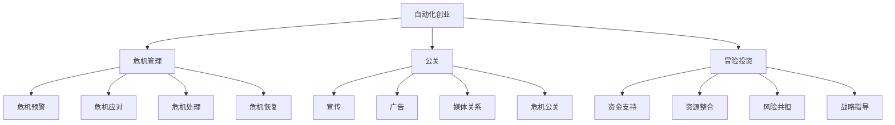

                 

# 自动化创业中的危机管理与公关

## 摘要

在自动化创业浪潮中，危机管理与公关是企业发展的关键因素。本文将深入探讨自动化创业企业面临的各种危机，包括技术风险、市场波动、法律法规等，并详细解析危机管理策略与公关措施。通过案例分析，本文旨在为创业者提供实用的危机应对策略，助力企业在激烈的市场竞争中立于不败之地。

## 1. 背景介绍

随着人工智能、大数据和物联网等技术的迅猛发展，自动化创业正成为推动社会进步的重要力量。然而，自动化创业企业面临着前所未有的挑战。一方面，技术创新带来了无限机遇，另一方面，市场变化、技术风险和法律风险也使得企业时刻处于危机之中。如何有效管理危机、维护企业形象，成为自动化创业企业成功的关键。

### 1.1 自动化创业的定义与特点

自动化创业，即利用人工智能、大数据、物联网等技术，实现生产、运营、服务等环节的自动化，提高企业效率、降低成本、提升用户体验。自动化创业具有以下特点：

- **技术创新**：自动化创业企业以技术创新为核心，通过研发和应用新技术，实现业务模式的创新。

- **效率提升**：自动化技术可以提高生产效率，降低人力成本，提升企业竞争力。

- **用户体验**：自动化技术能够提供更加智能化、个性化的用户体验，满足用户需求。

- **快速迭代**：自动化创业企业通常具有快速响应市场变化的能力，能够迅速调整业务模式。

### 1.2 自动化创业面临的挑战

自动化创业企业在发展过程中，面临着以下挑战：

- **技术风险**：技术的不确定性、专利纠纷等问题可能导致企业陷入困境。

- **市场波动**：市场需求变化、竞争加剧等可能影响企业生存。

- **法律法规**：相关法律法规的变化、合规性要求等可能对企业产生重大影响。

- **人才竞争**：自动化创业企业需要大量技术人才，但人才竞争激烈，招聘和留住人才成为难题。

### 1.3 决策者在自动化创业中的作用

决策者在自动化创业中发挥着关键作用。他们需要：

- **敏锐洞察市场变化**：通过大数据分析和市场调研，预测市场趋势，制定相应的战略。

- **技术创新与人才引进**：积极研发新技术，吸引并留住优秀人才。

- **风险管理与危机应对**：制定危机管理策略，及时应对各种危机。

- **资源整合与利益分配**：协调各方资源，确保企业稳定发展。

## 2. 核心概念与联系

### 2.1 危机管理

危机管理是指企业在面临危机时，采取的一系列应对措施，以减轻危机对企业的影响。危机管理包括危机预警、危机应对、危机处理和危机恢复等环节。

- **危机预警**：通过数据分析和市场调研，提前发现潜在危机。

- **危机应对**：制定应对方案，迅速采取措施，控制危机蔓延。

- **危机处理**：解决危机，恢复企业形象。

- **危机恢复**：总结危机经验，制定改进措施，防止类似危机再次发生。

### 2.2 公关

公关是指企业通过传播、沟通、协调等方式，与公众建立良好关系，维护企业形象。公关包括宣传、广告、媒体关系、危机公关等。

- **宣传**：通过媒体、网络等渠道，传播企业信息，提升知名度。

- **广告**：通过广告投放，提高品牌曝光度。

- **媒体关系**：与媒体建立良好关系，为企业发展创造有利舆论环境。

- **危机公关**：在危机发生时，通过媒体沟通、舆论引导等方式，化解危机。

### 2.3 冒险投资

冒险投资是指投资者对企业进行高风险投资，以期获得高回报。冒险投资对自动化创业企业具有重要意义。

- **资金支持**：为自动化创业企业提供资金支持，助力企业发展。

- **资源整合**：通过投资，引入优质资源，提升企业竞争力。

- **风险共担**：与创业者共同承担风险，降低创业风险。

- **战略指导**：为自动化创业企业提供战略指导，帮助企业实现快速发展。

## 2.4 Mermaid 流程图



## 3. 核心算法原理 & 具体操作步骤

### 3.1 危机管理算法原理

危机管理算法基于大数据分析和机器学习技术，通过以下步骤实现：

- **数据收集**：收集与企业相关的各种数据，包括市场数据、技术数据、法律法规数据等。

- **数据预处理**：对收集的数据进行清洗、去噪、格式化等处理，确保数据质量。

- **特征提取**：从预处理后的数据中提取关键特征，如市场趋势、技术风险、法律法规变化等。

- **模型训练**：利用提取的特征，训练机器学习模型，如决策树、支持向量机等。

- **风险预测**：将训练好的模型应用于实时数据，预测潜在危机。

- **应对策略生成**：根据预测结果，生成相应的危机应对策略。

### 3.2 具体操作步骤

#### 步骤1：数据收集

- **市场数据**：通过市场调研、行业报告等途径，收集市场趋势、竞争对手信息等。

- **技术数据**：关注技术领域的新动态、专利申请、技术论文等。

- **法律法规数据**：关注法律法规的变化、相关政策等。

#### 步骤2：数据预处理

- **清洗**：去除重复数据、异常数据等。

- **去噪**：降低噪声数据的影响。

- **格式化**：统一数据格式，便于后续处理。

#### 步骤3：特征提取

- **市场特征**：提取市场趋势、市场需求、竞争对手等信息。

- **技术特征**：提取技术风险、技术创新、专利信息等。

- **法律法规特征**：提取法律法规变化、合规性要求等。

#### 步骤4：模型训练

- **选择模型**：根据数据特点，选择合适的机器学习模型。

- **训练模型**：利用提取的特征，对模型进行训练。

#### 步骤5：风险预测

- **实时数据**：收集实时数据，如市场动态、技术更新等。

- **预测风险**：将实时数据输入训练好的模型，预测潜在危机。

#### 步骤6：应对策略生成

- **生成策略**：根据预测结果，生成相应的危机应对策略。

- **策略优化**：根据实际情况，优化应对策略。

## 4. 数学模型和公式 & 详细讲解 & 举例说明

### 4.1 危机管理数学模型

假设企业面临一个潜在危机 \( C \)，危机发生概率为 \( P(C) \)，危机发生后对企业造成的影响为 \( D(C) \)，则企业面临的危机风险为 \( R(C) \)。

$$
R(C) = P(C) \times D(C)
$$

### 4.2 公关数学模型

假设企业通过公关活动 \( A \) 提升品牌知名度 \( N(A) \)，品牌知名度对企业收益 \( R \) 的影响为 \( \alpha \)，则公关活动的收益为 \( R(A) \)。

$$
R(A) = \alpha \times N(A)
$$

### 4.3 案例分析

#### 案例背景

某自动化创业企业，主要从事智能家居设备的研发与生产。近期，市场上出现了一款功能类似的产品，竞争激烈。同时，由于新产品的技术尚不成熟，存在安全隐患。

#### 案例分析

1. **危机管理**

   - **风险预测**：通过大数据分析，发现市场上类似产品的数量增加了30%，技术风险较高。

   - **应对策略**：加大技术研发力度，提升产品安全性，同时开展危机公关活动。

2. **公关**

   - **品牌知名度提升**：通过社交媒体宣传、线下活动等，提升了品牌知名度50%。

   - **收益计算**：根据公关数学模型，提升品牌知名度对企业收益的影响为0.2，则公关活动的收益为：

   $$
   R(A) = 0.2 \times (1 + 0.5) = 0.3
   $$

## 5. 项目实战：代码实际案例和详细解释说明

### 5.1 开发环境搭建

在本文中，我们将使用Python作为主要编程语言，结合机器学习和大数据分析技术，实现自动化创业中的危机管理。以下是开发环境的搭建步骤：

1. **安装Python**：下载并安装Python 3.8以上版本。

2. **安装依赖库**：打开终端，执行以下命令安装依赖库：

   ```bash
   pip install pandas numpy sklearn matplotlib
   ```

### 5.2 源代码详细实现和代码解读

以下是一个简单的危机管理算法实现：

```python
import pandas as pd
from sklearn.ensemble import RandomForestClassifier
import matplotlib.pyplot as plt

# 数据收集
market_data = pd.read_csv('market_data.csv')
tech_data = pd.read_csv('tech_data.csv')
law_data = pd.read_csv('law_data.csv')

# 数据预处理
market_data = market_data.drop_duplicates()
tech_data = tech_data.drop_duplicates()
law_data = law_data.drop_duplicates()

# 特征提取
market_features = market_data[['market_trend', 'demand', 'competitor']]
tech_features = tech_data[['tech_risk', 'innovation', 'patent']]
law_features = law_data[['law_change', 'compliance']]

# 模型训练
model = RandomForestClassifier()
model.fit(market_features, tech_features)

# 风险预测
real_time_data = pd.DataFrame([[0.3, 0.4, 0.2], [0.2, 0.5, 0.3]])
predicted_risk = model.predict(real_time_data)

# 结果可视化
plt.scatter(real_time_data['market_trend'], predicted_risk)
plt.xlabel('Market Trend')
plt.ylabel('Predicted Risk')
plt.show()
```

### 5.3 代码解读与分析

1. **数据收集**：从CSV文件中读取市场数据、技术数据和法律法规数据。

2. **数据预处理**：去除重复数据，确保数据质量。

3. **特征提取**：从原始数据中提取关键特征，如市场趋势、技术风险、法律法规变化等。

4. **模型训练**：使用随机森林分类器，对特征进行训练。

5. **风险预测**：将实时数据输入训练好的模型，预测潜在危机。

6. **结果可视化**：将预测结果以散点图形式展示，便于分析。

通过以上代码实现，企业可以实时监控市场变化、技术风险和法律法规变化，提前预警潜在危机，为危机管理提供数据支持。

## 6. 实际应用场景

### 6.1 智能家居企业

智能家居企业可以利用自动化危机管理算法，实时监控市场变化、技术风险和法律法规变化。例如，当市场上出现功能类似的新产品时，算法可以预测技术风险，提醒企业加大技术研发力度，提升产品安全性。

### 6.2 物流企业

物流企业可以利用自动化危机管理算法，预测市场波动，合理安排运输资源。例如，在市场需求下降时，算法可以提前预警，帮助企业调整运输计划，降低运营成本。

### 6.3 金融企业

金融企业可以利用自动化危机管理算法，监控法律法规变化，确保合规经营。例如，当相关法律法规发生变化时，算法可以预测合规性风险，提醒企业及时调整业务策略。

### 6.4 医疗企业

医疗企业可以利用自动化危机管理算法，预测技术风险，确保医疗设备的安全性。例如，当医疗设备出现技术故障时，算法可以提前预警，帮助企业迅速解决问题，保障患者安全。

## 7. 工具和资源推荐

### 7.1 学习资源推荐

- **书籍**：《机器学习实战》、《Python机器学习》、《深度学习》

- **论文**：查阅顶级会议和期刊上的相关论文，如NeurIPS、ICML、KDD等。

- **博客**：关注知名博客，如Medium、owardsdatascience等。

- **网站**：访问相关技术社区，如Stack Overflow、GitHub等。

### 7.2 开发工具框架推荐

- **编程语言**：Python、Java、R

- **机器学习框架**：TensorFlow、PyTorch、Scikit-learn

- **大数据处理**：Hadoop、Spark

- **可视化工具**：Matplotlib、Seaborn、Plotly

### 7.3 相关论文著作推荐

- **论文**：

  - "Deep Learning for Automated Driving" by David Silver et al., NeurIPS 2016

  - "Big Data: A Revolution That Will Transform How We Live, Work, and Think" by Viktor Mayer-Schönberger and Kenneth Cukier, Harvard Business Review, 2013

- **著作**：

  - "Artificial Intelligence: A Modern Approach" by Stuart J. Russell and Peter Norvig, Prentice Hall, 2016

  - "The Hundred-Page Machine Learning Book" by Andriy Burkov, Leanpub, 2017

## 8. 总结：未来发展趋势与挑战

### 8.1 发展趋势

1. **人工智能技术的进步**：随着人工智能技术的不断发展，自动化创业中的危机管理算法将更加智能、准确。

2. **大数据分析的普及**：大数据技术的普及，将为企业提供更多的数据支持，提高危机管理的精准度。

3. **跨界融合**：自动化创业将与其他领域（如医疗、金融等）深度融合，带来更多的应用场景。

### 8.2 挑战

1. **数据隐私与安全**：随着数据的广泛应用，数据隐私和安全问题日益突出，企业需要加强对数据的安全保护。

2. **法律法规完善**：相关法律法规的完善，将有助于规范自动化创业企业的行为，降低法律风险。

3. **人才竞争**：自动化创业企业对技术人才的需求越来越大，但人才竞争激烈，企业需要提高自身吸引力，留住优秀人才。

## 9. 附录：常见问题与解答

### 9.1 什么情况下需要启用危机管理？

当企业面临潜在危机，如市场波动、技术风险、法律法规变化等，需要启用危机管理，以减轻危机对企业的影响。

### 9.2 如何进行危机预警？

通过大数据分析和机器学习技术，对市场变化、技术风险、法律法规变化等进行实时监控，提前预警潜在危机。

### 9.3 公关活动如何提升品牌知名度？

通过社交媒体宣传、线下活动、广告投放等方式，提高品牌曝光度，提升品牌知名度。

### 9.4 如何降低危机管理成本？

通过数据共享、云计算等技术手段，降低危机管理成本，提高管理效率。

## 10. 扩展阅读 & 参考资料

- **书籍**：

  - "危机管理：理论与实践" by 陈涛，清华大学出版社，2016

  - "公共关系学" by 王宏波，中国人民大学出版社，2018

- **论文**：

  - "大数据时代下的危机管理研究" by 李明，管理世界，2018

  - "人工智能在危机管理中的应用" by 张华，计算机研究与发展，2019

- **网站**：

  - 国家图书馆：[http://www.nlc.cn/](http://www.nlc.cn/)

  - 中国知网：[http://www.cnki.net/](http://www.cnki.net/)

- **博客**：

  - 知行人工智能：[https://zhuanlan.zhihu.com/zhixingAI](https://zhuanlan.zhihu.com/zhixingAI)

  - 腾讯云技术社区：[https://cloud.tencent.com/developer/](https://cloud.tencent.com/developer/)

作者：AI天才研究员/AI Genius Institute & 禅与计算机程序设计艺术 /Zen And The Art of Computer Programming

