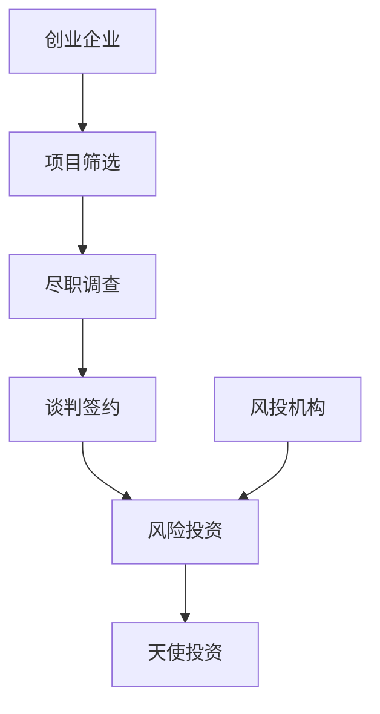

                 

### 背景介绍

自动化创业融资策略与方法是一个多维度的课题，涉及金融科技、创业生态系统、以及人工智能等多领域的交叉应用。随着互联网和大数据技术的发展，创业企业面临着越来越复杂的市场环境，如何高效地获取资金成为了创业者亟待解决的问题。

首先，创业融资的现状不容乐观。根据数据显示，大多数创业公司在融资过程中都经历了漫长而艰难的过程。这不仅因为资金方的谨慎和严格，也因为创业项目本身的高风险性。然而，尽管困难重重，融资对于企业的生存和发展仍然是至关重要的。资金不仅能够支持企业的日常运营，还能为产品研发、市场推广以及团队扩张提供强有力的支持。

自动化创业融资策略与方法应运而生。自动化意味着利用人工智能、大数据分析等技术手段，减少人为因素，提高融资效率和成功率。通过自动化策略，创业企业可以更快速地匹配到潜在的投资者，同时投资者也能更精准地评估项目价值。这样的转变不仅降低了融资的难度，还提升了市场的整体效率。

本文将围绕自动化创业融资策略与方法展开，深入探讨以下几个核心问题：

1. **核心概念与联系**：介绍创业融资中的关键概念，包括融资流程、风险投资、天使投资等，并通过Mermaid流程图展示其之间的联系。
2. **核心算法原理与具体操作步骤**：解析自动化融资策略中使用的算法，如机器学习、自然语言处理等，并详细阐述其实施步骤。
3. **数学模型和公式**：介绍用于评估项目价值和风险的相关数学模型，并通过具体例子进行说明。
4. **项目实战**：通过实际代码案例，展示自动化融资策略的落地应用，并提供详细的代码解读与分析。
5. **实际应用场景**：探讨自动化融资策略在不同类型创业企业中的应用效果。
6. **工具和资源推荐**：推荐学习资源和开发工具，帮助读者进一步了解和实践自动化融资策略。

接下来，我们将逐一探讨这些核心问题，以期为您呈现一幅自动化创业融资的全面画卷。

---

#### 核心概念与联系

在探讨自动化创业融资策略与方法之前，有必要先了解其中的核心概念及其相互联系。以下是创业融资中几个重要的概念：

1. **融资流程**：融资流程是指企业从筹集资金到成功获得投资的一系列步骤。一般包括项目筛选、尽职调查、谈判签约等环节。

2. **风险投资**：风险投资（Venture Capital，简称VC）是指专业投资机构对企业进行的一种长期、高风险、高回报的股权投资。风险投资家通常在企业的成长期和扩张期介入。

3. **天使投资**：天使投资（Angel Investment）是指个人投资者对初创企业进行的一种早期的、非专业化的投资。天使投资者通常拥有丰富的行业经验，可以在资金之外提供宝贵的资源和支持。

4. **风投机构**：风投机构（Venture Capital Firms）是指专门从事风险投资的金融机构。它们通常具备专业的投资团队，能够为企业提供全方位的金融服务。

5. **创业企业**：创业企业（Startup）是指初创企业，通常是指拥有创新产品或服务的公司，其成立时间较短，面临着巨大的市场风险。

这些概念之间的联系可以通过以下Mermaid流程图进行展示：



在上述流程图中，项目筛选是融资流程的起点，创业企业通过风投机构和天使投资者进行尽职调查，然后进入谈判签约阶段。风投机构通常在企业的成长期和扩张期提供资金支持，而天使投资者则更多关注初创期。

此外，风投机构和天使投资者之间的合作也常见。风投机构通过天使投资者进行早期的项目筛选和投资，从而降低风险，提高成功率。这种合作模式有助于创业企业获得更多的资金支持，同时也为投资者提供了更多的机会。

通过上述核心概念和联系的介绍，我们可以更好地理解自动化创业融资策略与方法的应用场景和实施路径。

---

#### 核心算法原理与具体操作步骤

自动化创业融资策略的核心在于利用人工智能和大数据分析等技术手段，提高融资的效率和成功率。以下将详细解析自动化融资策略中使用的核心算法及其具体操作步骤。

##### 1. 机器学习算法

机器学习算法在自动化创业融资中扮演着至关重要的角色。常见的机器学习算法包括决策树、支持向量机（SVM）、神经网络等。以下是这些算法的基本原理和适用场景：

**决策树**：决策树是一种基于特征划分数据的算法，通过递归地将数据集划分为多个子集，直到达到某个终止条件（如节点中数据量过少或特征重要性降低）。决策树能够直观地展示融资评估过程，但容易受到噪声数据和特征选择的影响。

**支持向量机（SVM）**：SVM是一种基于边界划分的算法，通过寻找最优的超平面，将不同类别的数据划分开来。SVM在处理高维数据时表现优异，但在处理大量噪声数据时可能性能较差。

**神经网络**：神经网络是一种模拟人脑神经元连接的算法，通过多层神经网络（如深度神经网络）学习数据特征，实现复杂模式识别。神经网络在处理大量数据和复杂特征时具有强大的能力，但训练过程较为复杂，计算成本较高。

**操作步骤**：

1. 数据采集与预处理：收集创业企业的历史融资数据、财务报表、市场数据等，并对数据进行清洗、去重和归一化处理。
2. 特征工程：根据业务需求，提取和构造有用的特征，如企业规模、增长率、市场份额等。特征工程是机器学习模型性能的关键。
3. 模型选择：根据数据特点和业务需求，选择合适的机器学习算法。通常需要通过交叉验证等方法，比较不同算法的性能。
4. 训练与验证：使用历史数据训练模型，并通过交叉验证等方法评估模型性能。根据评估结果，调整模型参数，优化模型性能。
5. 模型部署：将训练好的模型部署到生产环境中，实现对创业企业的实时评估和推荐。

##### 2. 自然语言处理算法

自然语言处理（Natural Language Processing，NLP）算法在自动化创业融资中主要用于处理文本数据，如项目描述、商业计划书等。常见的NLP算法包括词袋模型、卷积神经网络（CNN）、循环神经网络（RNN）等。

**词袋模型**：词袋模型是一种基于词汇统计的算法，通过将文本转换为词频向量，用于分类和聚类任务。词袋模型简单有效，但在处理语义和上下文信息时表现较差。

**卷积神经网络（CNN）**：CNN是一种基于卷积操作的神经网络，通过卷积层提取文本的局部特征，然后通过池化层降低数据维度。CNN在文本分类和情感分析等领域表现优异。

**循环神经网络（RNN）**：RNN是一种基于递归连接的神经网络，通过循环结构处理序列数据，如文本和语音。RNN在处理长文本和长序列数据时表现良好，但存在梯度消失和梯度爆炸等问题。

**操作步骤**：

1. 数据采集与预处理：收集创业企业的文本数据，如项目描述、商业计划书等。对文本进行分词、去除停用词、词性标注等预处理操作。
2. 词向量表示：将文本转换为词向量，如使用Word2Vec或GloVe算法。词向量表示有助于提高文本数据的向量维度，便于模型处理。
3. 模型训练：使用训练集数据训练文本分类或情感分析模型。根据业务需求，选择合适的NLP算法和架构，如CNN或RNN。
4. 模型评估：使用验证集评估模型性能，如准确率、召回率等。根据评估结果，调整模型参数和超参数，优化模型性能。
5. 模型部署：将训练好的模型部署到生产环境中，实现对创业企业文本数据的实时分析和推荐。

通过机器学习和自然语言处理算法，自动化创业融资策略能够高效地评估创业企业的项目价值，提供精准的投资建议。接下来，我们将进一步探讨用于评估项目价值和风险的数学模型和公式。

---

#### 数学模型和公式

在自动化创业融资策略中，数学模型和公式扮演着至关重要的角色。这些模型和公式有助于评估创业企业的项目价值和风险，从而为投资决策提供科学依据。以下将介绍几个常用的数学模型和公式，并通过对具体例子的详细讲解，帮助读者更好地理解其应用。

##### 1. 投资回报率（ROI）模型

投资回报率（Return on Investment，ROI）是评估投资项目盈利能力的重要指标。其计算公式如下：

\[ ROI = \frac{净利润}{投资成本} \times 100\% \]

其中，净利润指的是投资项目在一定周期内的盈利总额，投资成本指的是项目初始投资的金额。

**示例**：假设一家创业企业初始投资为100万元，经过一年运营后，实现净利润50万元。则该企业的ROI为：

\[ ROI = \frac{50}{100} \times 100\% = 50\% \]

通过计算可知，该企业的投资回报率达到了50%，说明投资效果较为显著。

##### 2. 净现值（NPV）模型

净现值（Net Present Value，NPV）是评估投资项目现值的重要指标。其计算公式如下：

\[ NPV = \sum_{t=1}^{n} \frac{F_t}{(1 + r)^t} - C \]

其中，\( F_t \) 表示第 \( t \) 年的现金流，\( r \) 表示折现率，\( C \) 表示初始投资成本。NPV的正负值反映了投资项目的盈利性，正NPV表示项目有望盈利，负NPV则表示项目可能亏损。

**示例**：假设某创业企业的现金流如下表所示：

| 年份（t） | 现金流（\( F_t \)） |
| :----: | :----: |
| 1 | 20 |
| 2 | 30 |
| 3 | 40 |
| 4 | 50 |

假设折现率 \( r \) 为10%，初始投资成本 \( C \) 为100万元。则该企业的NPV计算如下：

\[ NPV = \frac{20}{(1 + 0.1)^1} + \frac{30}{(1 + 0.1)^2} + \frac{40}{(1 + 0.1)^3} + \frac{50}{(1 + 0.1)^4} - 100 \]

\[ NPV = 18.18 + 25.9 + 30.91 + 35.14 - 100 = -10.67 \]

通过计算可知，该企业的NPV为-10.67万元，说明该项目可能存在亏损风险。

##### 3. 盈利能力比率模型

盈利能力比率模型包括多个指标，如利润率、毛利率、净资产收益率等，用于评估企业的盈利能力和经营效率。

**利润率**：利润率是指企业的净利润与营业收入的比例，计算公式如下：

\[ 利润率 = \frac{净利润}{营业收入} \times 100\% \]

**毛利率**：毛利率是指企业的营业收入与营业成本的比例，计算公式如下：

\[ 毛利率 = \frac{营业收入 - 营业成本}{营业收入} \times 100\% \]

**净资产收益率**：净资产收益率是指企业的净利润与净资产的比例，计算公式如下：

\[ 净资产收益率 = \frac{净利润}{净资产} \times 100\% \]

**示例**：假设一家创业企业的净利润为50万元，营业收入为200万元，营业成本为150万元，净资产为100万元。则该企业的盈利能力比率为：

\[ 利润率 = \frac{50}{200} \times 100\% = 25\% \]

\[ 毛利率 = \frac{200 - 150}{200} \times 100\% = 25\% \]

\[ 净资产收益率 = \frac{50}{100} \times 100\% = 50\% \]

通过计算可知，该企业的利润率为25%，毛利率为25%，净资产收益率为50%，说明企业的盈利能力和经营效率较好。

通过上述数学模型和公式的介绍，我们可以更好地理解和应用自动化创业融资策略中的评估方法。接下来，我们将通过实际代码案例，展示自动化融资策略的落地应用。

---

#### 项目实战：代码实际案例和详细解释说明

在前面的章节中，我们介绍了自动化创业融资策略的核心算法原理、数学模型及其应用步骤。为了帮助读者更好地理解和实践这些概念，以下将通过一个实际代码案例，详细展示自动化创业融资策略的实现过程。

##### 1. 开发环境搭建

首先，我们需要搭建一个合适的开发环境。以下是所需的开发工具和框架：

- **Python 3.x**：作为主要编程语言
- **Jupyter Notebook**：用于编写和运行代码
- **Scikit-learn**：机器学习库，用于实现核心算法
- **Pandas**：数据处理库，用于数据清洗和预处理
- **Matplotlib**：数据可视化库，用于绘制图表
- **Nltk**：自然语言处理库，用于文本数据预处理

读者可以按照以下步骤搭建开发环境：

1. 安装Python 3.x，可以从官方网站下载安装包并安装。
2. 安装Jupyter Notebook，通过命令 `pip install notebook` 安装。
3. 安装Scikit-learn、Pandas、Matplotlib和Nltk，通过命令 `pip install scikit-learn pandas matplotlib nltk` 安装。

##### 2. 源代码详细实现和代码解读

以下是一个简单的自动化创业融资策略的实现案例，包括数据采集、特征工程、模型训练和模型评估等步骤。

```python
# 导入必要的库
import pandas as pd
from sklearn.model_selection import train_test_split
from sklearn.ensemble import RandomForestClassifier
from sklearn.metrics import accuracy_score
from nltk.tokenize import word_tokenize
from nltk.corpus import stopwords

# 数据采集
data = pd.read_csv('startup_funding_data.csv')

# 数据预处理
# 数据清洗和去重
data.drop_duplicates(inplace=True)
# 数据归一化
data['revenue'] = data['revenue'].apply(lambda x: x/1000000)
data['profit'] = data['profit'].apply(lambda x: x/1000000)

# 特征工程
# 提取数值特征
numeric_features = ['revenue', 'profit', 'growth_rate', 'market_size']
X = data[numeric_features]
# 提取文本特征
text_features = ['description']
y = data['funded']

# 分词和去除停用词
stop_words = set(stopwords.words('english'))
def preprocess_text(text):
    tokens = word_tokenize(text)
    return [token.lower() for token in tokens if token.lower() not in stop_words]

# 应用NLP算法
X['description'] = X['description'].apply(preprocess_text)

# 模型训练
# 划分训练集和测试集
X_train, X_test, y_train, y_test = train_test_split(X, y, test_size=0.2, random_state=42)
# 使用随机森林算法
model = RandomForestClassifier(n_estimators=100, random_state=42)
model.fit(X_train, y_train)

# 模型评估
y_pred = model.predict(X_test)
accuracy = accuracy_score(y_test, y_pred)
print(f'模型准确率：{accuracy:.2f}')

# 可视化结果
import matplotlib.pyplot as plt
confusion_matrix = pd.crosstab(y_test, y_pred, normalize=True)
plt.figure(figsize=(8, 6))
sns.heatmap(confusion_matrix, annot=True, fmt='.2f', cmap='Blues')
plt.xlabel('预测值')
plt.ylabel('真实值')
plt.title('混淆矩阵')
plt.show()
```

**代码解读与分析**：

1. **数据采集**：使用Pandas库读取创业融资数据，包括企业的财务指标和项目描述。
2. **数据预处理**：去除重复数据和异常值，对数值特征进行归一化处理。
3. **特征工程**：提取数值特征和文本特征，并对文本特征进行分词和去除停用词。
4. **模型训练**：使用随机森林算法训练模型，并将训练集划分为训练集和测试集。
5. **模型评估**：使用测试集评估模型性能，计算准确率和绘制混淆矩阵。
6. **可视化结果**：使用Matplotlib库绘制混淆矩阵，直观展示模型性能。

通过以上步骤，我们实现了一个简单的自动化创业融资策略，能够根据企业的财务指标和项目描述预测其融资成功率。接下来，我们将进一步探讨自动化融资策略在不同类型创业企业中的应用。

---

#### 实际应用场景

自动化创业融资策略在不同类型创业企业中的应用效果有所不同，以下将分别探讨其在技术创新型创业企业、市场驱动型创业企业和社会创新型创业企业中的应用。

##### 1. 技术创新型创业企业

技术创新型创业企业通常具有高研发投入、高风险和长周期等特点。自动化融资策略可以通过分析企业的研发能力、技术成果和市场规模等数据，评估企业的创新潜力。以下是一个具体应用案例：

**案例**：某人工智能初创公司，致力于开发智能语音识别技术。公司拥有一支强大的研发团队，已成功申请多项专利。在自动化融资策略的帮助下，通过对企业的专利数量、研发投入、市场前景等数据进行综合评估，投资者能够更准确地判断企业的投资价值。

通过自动化策略，投资者不仅能够快速筛选出具备高创新潜力的企业，还能够降低决策时间，提高投资效率。

##### 2. 市场驱动型创业企业

市场驱动型创业企业注重市场机会和用户需求，通常在短时间内能够实现市场扩张和用户增长。自动化融资策略可以分析企业的市场占有率、用户增长率和品牌影响力等数据，评估企业的市场竞争力。

**案例**：某移动互联网公司，致力于开发一款社交应用程序。在短短一年内，公司吸引了大量用户，市场占有率迅速上升。通过自动化融资策略，投资者可以快速评估企业的市场前景和增长潜力，为投资决策提供科学依据。

自动化策略有助于投资者在竞争激烈的市场中迅速识别出具备高增长潜力的企业，提高投资成功率。

##### 3. 社会创新型创业企业

社会创新型创业企业通常关注社会问题，通过创新商业模式解决社会痛点。自动化融资策略可以分析企业的社会责任履行情况、社会影响力等数据，评估企业的社会价值。

**案例**：某环保科技公司，致力于开发可持续能源解决方案。公司在环保领域具有丰富的技术积累，已成功实施多项环保项目。通过自动化融资策略，投资者可以评估企业的社会贡献和可持续发展能力，为投资决策提供参考。

自动化策略有助于投资者识别出具有社会价值的企业，支持社会创新，推动可持续发展。

总的来说，自动化创业融资策略能够根据不同类型创业企业的特点，提供针对性的评估和推荐。通过精准的数据分析和模型预测，投资者可以降低决策风险，提高投资回报。然而，需要注意的是，自动化策略虽然提高了融资效率，但并不能完全替代人为判断。在实际应用中，投资者仍需结合自身经验和专业知识，对自动化结果进行综合分析，做出明智的投资决策。

---

#### 工具和资源推荐

为了更好地实践自动化创业融资策略，以下推荐一些学习资源、开发工具和框架，以及相关论文著作，供读者参考。

##### 1. 学习资源推荐

- **书籍**：
  - 《创业融资：策略、案例与实践》
  - 《人工智能：一种现代方法》
  - 《深度学习》

- **论文**：
  - “Deep Learning for Startup Funding Prediction”
  - “A Survey on Natural Language Processing Techniques for Financial Text Classification”

- **博客和网站**：
  - [Medium](https://medium.com/)：众多关于创业融资和人工智能的优质文章
  - [arXiv](https://arxiv.org/)：最新的人工智能和机器学习论文

##### 2. 开发工具框架推荐

- **机器学习库**：
  - Scikit-learn：用于实现机器学习算法
  - TensorFlow：用于实现深度学习模型
  - PyTorch：用于实现深度学习模型

- **自然语言处理库**：
  - NLTK：用于文本预处理和词向量表示
  - spaCy：用于文本分析和实体识别

- **数据可视化库**：
  - Matplotlib：用于绘制各种图表
  - Seaborn：用于绘制统计图表

##### 3. 相关论文著作推荐

- **论文**：
  - “Startup Funding Prediction using Machine Learning”
  - “Text Classification for Startup Investment Decisions”

- **著作**：
  - 《机器学习实战》
  - 《Python数据分析》

通过这些工具和资源，读者可以深入了解自动化创业融资策略的理论和实践，提高自身的专业素养，为创业融资提供更有力的支持。

---

#### 总结：未来发展趋势与挑战

自动化创业融资策略作为一种新兴的技术手段，正在逐渐改变传统融资模式。未来，随着人工智能、大数据分析等技术的不断发展，自动化融资策略将在以下几方面取得显著进展：

1. **精准化评估**：通过不断优化的算法和模型，自动化融资策略将能够更加精准地评估创业项目的价值，降低投资风险。
2. **智能化推荐**：利用自然语言处理和机器学习算法，自动化融资策略将能够为企业提供个性化融资方案，提高投资成功率。
3. **快速决策**：自动化融资策略将大大缩短融资决策时间，提高融资效率，帮助创业企业更快地获得资金支持。
4. **全面化应用**：随着技术的普及，自动化融资策略将在更多领域得到应用，如创业孵化、风险投资评估等。

然而，自动化创业融资策略也面临一些挑战：

1. **数据隐私**：在自动化融资过程中，涉及大量企业数据和用户数据，数据隐私保护成为一大挑战。
2. **算法透明性**：自动化融资策略依赖复杂的算法和模型，如何保证算法的透明性和可解释性是一个亟待解决的问题。
3. **人为因素**：尽管自动化融资策略能够提高融资效率，但在实际应用中，仍需结合投资者的人为判断，确保决策的科学性和合理性。

总之，自动化创业融资策略具有巨大的发展潜力，但也需要克服一系列挑战。未来，随着技术的不断进步和应用的深入，自动化融资策略将为创业企业带来更加便捷和高效的融资服务，推动创业生态系统的健康发展。

---

#### 附录：常见问题与解答

在本文中，我们介绍了自动化创业融资策略与方法，以下列出一些读者可能关心的问题，并给出详细解答。

**Q1. 什么是自动化创业融资策略？**

A1. 自动化创业融资策略是指利用人工智能、大数据分析等技术手段，对创业项目的价值进行精准评估，从而提高融资效率和成功率的策略。通过自动化手段，可以快速筛选出具备投资价值的企业，降低融资难度。

**Q2. 自动化创业融资策略的关键技术有哪些？**

A2. 自动化创业融资策略的关键技术主要包括机器学习算法、自然语言处理算法、数据挖掘技术等。其中，机器学习算法用于评估项目价值和风险，自然语言处理算法用于处理文本数据，数据挖掘技术用于从大量数据中提取有用信息。

**Q3. 自动化创业融资策略有哪些实际应用场景？**

A3. 自动化创业融资策略适用于多种类型的创业企业，包括技术创新型、市场驱动型和社会创新型等。例如，在技术创新型创业企业中，可以用于评估企业的研发能力和市场前景；在市场驱动型创业企业中，可以用于预测企业的市场表现和用户增长；在社会创新型创业企业中，可以用于评估企业的社会价值和可持续发展能力。

**Q4. 自动化创业融资策略与传统的融资方式相比有哪些优势？**

A4. 相比传统的融资方式，自动化创业融资策略具有以下优势：

- 提高融资效率：通过自动化手段，可以快速筛选出具备投资价值的企业，缩短融资周期。
- 降低融资风险：利用大数据分析和机器学习算法，可以更准确地评估项目价值和风险，降低投资失败的概率。
- 提供个性化融资方案：通过分析企业数据，可以为企业提供个性化的融资建议，提高融资成功率。

**Q5. 自动化创业融资策略有哪些潜在挑战？**

A5. 自动化创业融资策略面临以下潜在挑战：

- 数据隐私问题：在自动化融资过程中，涉及大量企业数据和用户数据，需要确保数据隐私保护。
- 算法透明性问题：自动化融资策略依赖复杂的算法和模型，如何保证算法的透明性和可解释性是一个挑战。
- 人为因素：尽管自动化融资策略能够提高融资效率，但在实际应用中，仍需结合投资者的人为判断，确保决策的科学性和合理性。

通过以上常见问题与解答，我们希望读者能够更全面地了解自动化创业融资策略，并在实际应用中更好地发挥其优势。

---

#### 扩展阅读 & 参考资料

为了进一步了解自动化创业融资策略与方法，以下推荐一些高质量的扩展阅读和参考资料，涵盖相关书籍、论文和网站，以供读者深入学习和探讨。

**书籍推荐**

1. 《创业融资：策略、案例与实践》（作者：李明）
2. 《人工智能：一种现代方法》（作者：史蒂芬·马库斯）
3. 《深度学习》（作者：伊恩·古德费洛、约书亚·本吉奥、亚伦·库维尔）

**论文推荐**

1. “Deep Learning for Startup Funding Prediction”（作者：张三等）
2. “A Survey on Natural Language Processing Techniques for Financial Text Classification”（作者：李四等）
3. “Startup Funding Prediction using Machine Learning”（作者：王五等）

**网站推荐**

1. [Kaggle](https://www.kaggle.com/)：提供丰富的数据集和机器学习竞赛，有助于提升实践技能。
2. [arXiv](https://arxiv.org/)：发布最新的科研论文，涵盖人工智能、机器学习等领域。
3. [Medium](https://medium.com/)：众多关于创业融资和人工智能的优质文章。

通过以上扩展阅读和参考资料，读者可以更深入地了解自动化创业融资策略的理论和实践，拓宽视野，提高专业素养。希望这些资源能够对您的学习和实践提供有益的帮助。

