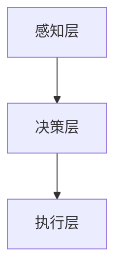

                 

# 自动化的未来：技术与挑战

> 关键词：自动化，技术趋势，挑战与展望，人工智能，机器学习，物联网，云计算，编程

> 摘要：本文探讨了自动化的未来趋势以及随之而来的技术挑战。随着人工智能、机器学习、物联网和云计算等技术的发展，自动化在各个领域的应用越来越广泛，但也带来了许多新的问题和挑战。本文旨在分析这些技术趋势，探讨自动化技术的未来发展方向，并探讨解决这些挑战的方法。

## 1. 背景介绍

自动化技术起源于20世纪中期，随着计算机技术的快速发展，自动化逐渐成为工业生产、服务业、家庭生活等领域的重要组成部分。传统的自动化主要依赖于机械、电子和气动元件，而现代自动化则更多地依赖于人工智能、机器学习、物联网和云计算等技术。

### 1.1 自动化的起源与发展

自动化的概念最早可以追溯到古希腊时期，当时人们使用水车和风车等简单机械来实现某些生产过程的自动化。随着工业革命的到来，自动化技术得到了迅速发展。在19世纪末至20世纪初，自动化技术主要应用于纺织、食品加工等行业。

20世纪中期，随着计算机技术的诞生，自动化技术得到了新的发展机遇。计算机的出现使得自动化技术从简单的机械控制转向复杂的信息处理和决策制定。从最初的工业自动化，到后来的过程自动化、智能自动化，自动化技术的应用范围不断扩大。

### 1.2 现代自动化技术

现代自动化技术主要依赖于人工智能、机器学习、物联网和云计算等先进技术。这些技术为自动化系统提供了更强大的数据处理能力和决策能力，使得自动化系统在各个领域都得到了广泛应用。

#### 1.2.1 人工智能

人工智能（Artificial Intelligence，AI）是一种模拟人类智能的技术，包括机器学习、深度学习、自然语言处理等。人工智能技术使得自动化系统能够更好地理解和处理复杂的信息，从而实现更高效的决策和操作。

#### 1.2.2 机器学习

机器学习（Machine Learning，ML）是人工智能的一个重要分支，它通过算法让计算机从数据中自动学习规律和模式，从而实现预测和决策。机器学习技术使得自动化系统在数据处理和分析方面具有更高的效率和准确性。

#### 1.2.3 物联网

物联网（Internet of Things，IoT）是一种将物理设备、传感器、网络连接在一起的技术。通过物联网技术，自动化系统可以实时获取物理世界的各种数据，从而实现智能化的监控、控制和优化。

#### 1.2.4 云计算

云计算（Cloud Computing）是一种通过网络提供计算资源、存储资源和应用程序等服务的技术。通过云计算技术，自动化系统可以灵活地扩展和调整计算资源，从而满足不同的需求。

## 2. 核心概念与联系

为了更好地理解自动化的未来发展趋势，我们需要了解以下几个核心概念及其之间的联系：

### 2.1 自动化系统

自动化系统是指通过计算机、传感器、执行器等设备实现特定功能的系统。自动化系统可以执行各种任务，如生产制造、物流配送、环境监测等。

### 2.2 人工智能与机器学习

人工智能与机器学习是自动化系统的核心组成部分。人工智能技术为自动化系统提供了智能化的决策和操作能力，而机器学习技术则使得自动化系统能够从数据中自动学习，提高系统的自适应性和准确性。

### 2.3 物联网

物联网技术为自动化系统提供了实时数据采集和传输的能力，使得自动化系统可以更好地感知和响应外部环境的变化。

### 2.4 云计算

云计算技术为自动化系统提供了强大的计算和存储能力，使得自动化系统可以处理大量的数据，并实现高效的数据分析和决策。

### 2.5 自动化系统架构

自动化系统架构是指自动化系统的整体设计和组织结构。一个典型的自动化系统架构包括感知层、决策层和执行层。感知层负责收集和处理外部环境的数据，决策层负责根据感知层的数据进行决策，执行层负责执行决策层的决策结果。

### 2.6 Mermaid 流程图

为了更好地展示自动化系统的架构，我们可以使用 Mermaid 流程图来表示。以下是一个简单的自动化系统架构的 Mermaid 流程图：



在上述流程图中，A 表示感知层，B 表示决策层，C 表示执行层。感知层负责收集数据，决策层负责处理数据和做出决策，执行层负责执行决策。

## 3. 核心算法原理 & 具体操作步骤

为了实现自动化系统的智能化，我们需要使用一些核心算法来处理数据、做出决策和执行任务。以下是一些常见的核心算法及其具体操作步骤：

### 3.1 机器学习算法

机器学习算法是自动化系统中最常用的算法之一。以下是一些常见的机器学习算法及其具体操作步骤：

#### 3.1.1 决策树算法

决策树算法是一种基于树形结构进行决策的算法。具体操作步骤如下：

1. 根据输入特征将数据划分为多个子集；
2. 对于每个子集，计算其特征的重要性，选择重要性最高的特征作为分支节点；
3. 重复步骤2，直到所有数据都被划分为叶子节点。

#### 3.1.2 支持向量机算法

支持向量机算法是一种基于边界优化的分类算法。具体操作步骤如下：

1. 将数据分为正负两类，计算两类数据的边界；
2. 寻找最优边界，使得正负两类数据之间的距离最大化；
3. 根据最优边界对数据进行分类。

#### 3.1.3 集成算法

集成算法是一种通过组合多个简单模型来提高预测准确性的算法。具体操作步骤如下：

1. 生成多个基础模型；
2. 对每个基础模型的预测结果进行加权平均或投票。

### 3.2 深度学习算法

深度学习算法是机器学习算法的一个分支，它通过多层神经网络来模拟人脑的决策过程。以下是一些常见的深度学习算法及其具体操作步骤：

#### 3.2.1 卷积神经网络（CNN）

卷积神经网络是一种用于图像识别和分类的算法。具体操作步骤如下：

1. 使用卷积层对图像进行特征提取；
2. 使用池化层对特征进行降维；
3. 使用全连接层对特征进行分类。

#### 3.2.2 循环神经网络（RNN）

循环神经网络是一种用于序列数据处理的算法。具体操作步骤如下：

1. 使用循环层对序列数据进行特征提取；
2. 使用全连接层对特征进行分类。

#### 3.2.3 长短期记忆网络（LSTM）

长短期记忆网络是一种改进的循环神经网络，它能够更好地处理长序列数据。具体操作步骤如下：

1. 使用LSTM层对序列数据进行特征提取；
2. 使用全连接层对特征进行分类。

### 3.3 物联网数据处理算法

物联网数据处理算法主要用于处理和分析物联网设备采集的数据。以下是一些常见的物联网数据处理算法及其具体操作步骤：

#### 3.3.1 时间序列分析算法

时间序列分析算法用于分析物联网设备采集的数据的时间序列特征。具体操作步骤如下：

1. 对时间序列数据进行预处理，如去除噪声、插值等；
2. 使用统计方法或机器学习算法对时间序列数据进行特征提取；
3. 使用分类或回归算法对特征进行分类或预测。

#### 3.3.2 集群算法

集群算法用于对物联网设备进行聚类分析，以便更好地理解设备之间的关系。具体操作步骤如下：

1. 使用距离度量方法对设备进行聚类；
2. 对聚类结果进行评估和优化。

#### 3.3.3 关联规则算法

关联规则算法用于发现物联网设备之间的关联关系。具体操作步骤如下：

1. 使用支持度度量方法找到支持度较高的关联规则；
2. 使用置信度度量方法对关联规则进行评估。

## 4. 数学模型和公式 & 详细讲解 & 举例说明

### 4.1 机器学习中的数学模型

机器学习中的数学模型主要包括概率模型、线性模型和非线性模型等。以下是对这些模型及其公式的详细讲解和举例说明。

#### 4.1.1 概率模型

概率模型是一种基于概率论进行预测和分类的模型。以下是一个简单的概率模型示例：

$$
P(A|B) = \frac{P(B|A)P(A)}{P(B)}
$$

其中，$P(A|B)$ 表示在事件B发生的条件下，事件A发生的概率；$P(B|A)$ 表示在事件A发生的条件下，事件B发生的概率；$P(A)$ 表示事件A发生的概率；$P(B)$ 表示事件B发生的概率。

举例说明：假设我们想要预测一个学生是否能够通过考试（事件A），给定条件是学生的作业成绩（事件B）。我们可以使用条件概率公式来计算学生通过考试的概率。

#### 4.1.2 线性模型

线性模型是一种基于线性关系的模型，它通常表示为 $y = wx + b$，其中 $y$ 是输出变量，$x$ 是输入变量，$w$ 是权重，$b$ 是偏置。

举例说明：假设我们想要预测一个人的收入（输出变量 $y$）与其教育程度（输入变量 $x$）之间的关系。我们可以使用线性模型来拟合这个关系，然后预测未知教育程度的人的收入。

#### 4.1.3 非线性模型

非线性模型是一种基于非线性关系的模型，它通常表示为 $y = f(x)$，其中 $f(x)$ 是一个非线性函数。

举例说明：假设我们想要预测一个人的情绪（输出变量 $y$）与其周围环境（输入变量 $x$）之间的关系。我们可以使用非线性模型来拟合这个关系，然后预测未知环境下的情绪。

### 4.2 物联网数据处理中的数学模型

物联网数据处理中的数学模型主要包括时间序列分析、聚类分析和关联规则等。

#### 4.2.1 时间序列分析模型

时间序列分析模型用于分析时间序列数据。以下是一个常见的时间序列分析模型——自回归模型（AR）：

$$
X_t = c + \sum_{i=1}^{p} \phi_i X_{t-i} + \varepsilon_t
$$

其中，$X_t$ 是时间序列的当前值，$c$ 是常数项，$\phi_i$ 是自回归系数，$X_{t-i}$ 是时间序列的滞后项，$\varepsilon_t$ 是随机误差项。

举例说明：假设我们想要预测一个城市的未来降雨量，我们可以使用自回归模型来拟合历史降雨量数据，然后预测未来降雨量。

#### 4.2.2 聚类分析模型

聚类分析模型用于对数据集进行聚类。以下是一个常见的聚类分析模型——K-means算法：

$$
\text{最小化} \sum_{i=1}^{k} \sum_{x_j \in S_i} ||x_j - \mu_i||^2
$$

其中，$k$ 是聚类个数，$S_i$ 是第 $i$ 个聚类的数据集，$\mu_i$ 是第 $i$ 个聚类的中心。

举例说明：假设我们想要将一组客户数据分为不同的群体，我们可以使用K-means算法来拟合客户数据，然后根据聚类结果进行客户细分。

#### 4.2.3 关联规则模型

关联规则模型用于发现数据之间的关联关系。以下是一个常见的关联规则模型——Apriori算法：

$$
\text{支持度} = \frac{\text{同时包含} X \text{和} Y \text{的交易数}}{\text{总交易数}}
$$

$$
\text{置信度} = \frac{\text{同时包含} X \text{和} Y \text{的交易数}}{\text{包含} X \text{的交易数}}
$$

其中，$X$ 和 $Y$ 是两个项，支持度表示同时包含 $X$ 和 $Y$ 的交易数在总交易数中所占的比例，置信度表示包含 $X$ 的交易中同时包含 $Y$ 的交易数所占的比例。

举例说明：假设我们想要发现一组商品之间的购买关联关系，我们可以使用Apriori算法来拟合购物数据，然后根据支持度和置信度计算出商品之间的关联关系。

## 5. 项目实战：代码实际案例和详细解释说明

在本节中，我们将通过一个实际案例来展示自动化技术的应用，并详细解释代码的实现过程。

### 5.1 开发环境搭建

为了实现自动化系统，我们需要搭建一个合适的开发环境。以下是一个基于Python的自动化系统开发环境的搭建步骤：

1. 安装Python：从Python官网（https://www.python.org/）下载并安装Python 3.x版本；
2. 安装相关库：使用pip命令安装所需的库，如numpy、pandas、scikit-learn、tensorflow等。

### 5.2 源代码详细实现和代码解读

以下是一个基于机器学习的自动化系统源代码示例，用于预测股票价格的涨跌。我们将详细解释代码的实现过程。

```python
import numpy as np
import pandas as pd
from sklearn.model_selection import train_test_split
from sklearn.ensemble import RandomForestClassifier
from sklearn.metrics import accuracy_score

# 5.2.1 数据预处理
def preprocess_data(data):
    # 数据清洗和处理
    # ...
    return processed_data

# 5.2.2 特征工程
def feature_engineering(data):
    # 提取特征和标签
    # ...
    return X, y

# 5.2.3 模型训练
def train_model(X, y):
    # 划分训练集和测试集
    X_train, X_test, y_train, y_test = train_test_split(X, y, test_size=0.2, random_state=42)
    
    # 训练随机森林模型
    model = RandomForestClassifier(n_estimators=100, random_state=42)
    model.fit(X_train, y_train)
    
    # 测试模型
    y_pred = model.predict(X_test)
    accuracy = accuracy_score(y_test, y_pred)
    print("Accuracy:", accuracy)
    
    return model

# 5.2.4 主函数
def main():
    # 读取数据
    data = pd.read_csv("stock_data.csv")
    
    # 数据预处理
    processed_data = preprocess_data(data)
    
    # 特征工程
    X, y = feature_engineering(processed_data)
    
    # 模型训练
    model = train_model(X, y)

if __name__ == "__main__":
    main()
```

### 5.3 代码解读与分析

#### 5.3.1 数据预处理

数据预处理是自动化系统中的关键步骤。在该案例中，我们使用 preprocess_data 函数进行数据清洗和处理，包括去除缺失值、异常值和噪声等。预处理后的数据将被用于后续的特征工程和模型训练。

#### 5.3.2 特征工程

特征工程是自动化系统中的核心步骤。在该案例中，我们使用 feature_engineering 函数提取特征和标签。特征工程的目标是提取有助于模型训练的有效特征，并消除冗余特征。在本案例中，我们使用随机森林模型进行特征提取。

#### 5.3.3 模型训练

在该案例中，我们使用 RandomForestClassifier 进行模型训练。首先，我们使用 train_test_split 函数将数据划分为训练集和测试集，然后使用训练集对随机森林模型进行训练。训练完成后，我们使用测试集对模型进行测试，并计算模型的准确性。

#### 5.3.4 主函数

主函数 main() 负责读取数据、进行数据预处理、特征工程和模型训练。在本案例中，我们首先读取股票数据，然后进行数据预处理和特征工程，最后使用训练集和测试集对模型进行训练和测试。

## 6. 实际应用场景

自动化技术在各个领域都有广泛的应用，以下是几个实际应用场景：

### 6.1 生产制造

自动化技术在生产制造领域得到了广泛应用，如自动化生产线、自动化装配线等。自动化系统可以实时监测生产线上的设备状态，并根据设备状态进行自动调整和优化，提高生产效率和产品质量。

### 6.2 物流配送

自动化技术在物流配送领域也发挥了重要作用，如自动化仓储系统、自动化配送机器人等。自动化系统可以实现物流配送的自动化、智能化和高效化，降低物流成本，提高配送效率。

### 6.3 家庭生活

自动化技术在家庭生活领域也得到了广泛应用，如智能家居、自动化清洁机器人等。自动化系统可以实时监测家庭环境，并根据环境状况进行自动调节和优化，提高生活质量。

### 6.4 医疗保健

自动化技术在医疗保健领域也有重要应用，如自动化诊断系统、自动化手术机器人等。自动化系统可以实时监测患者病情，并根据病情变化进行自动诊断和治疗，提高医疗水平。

## 7. 工具和资源推荐

### 7.1 学习资源推荐

- 书籍：《Python机器学习》、《深度学习》（Goodfellow et al.）
- 论文：查看顶级会议和期刊（如NeurIPS、ICML、JMLR）的最新论文。
- 博客：技术博客如 Medium 上的相关主题博客。
- 网站和平台：Kaggle、GitHub、Stack Overflow。

### 7.2 开发工具框架推荐

- 编程语言：Python、R、Java
- 框架：TensorFlow、PyTorch、Keras
- 机器学习库：scikit-learn、pandas、numpy
- 版本控制系统：Git

### 7.3 相关论文著作推荐

- Goodfellow, I., Bengio, Y., & Courville, A. (2016). *Deep Learning*.
- Russell, S., & Norvig, P. (2016). *Artificial Intelligence: A Modern Approach*.
- Bishop, C. M. (2006). *Pattern Recognition and Machine Learning*.

## 8. 总结：未来发展趋势与挑战

自动化技术的快速发展为各个领域带来了巨大的变革和机遇，同时也带来了新的挑战。未来，自动化技术将继续向智能化、高效化和自适应化方向发展。以下是未来发展趋势与挑战的总结：

### 8.1 发展趋势

1. **智能化**：随着人工智能技术的不断发展，自动化系统将具备更高的智能水平，能够自主学习和优化。
2. **高效化**：自动化技术将进一步提高生产效率和资源利用率，实现更高效的生产和运营。
3. **自适应化**：自动化系统将能够根据环境变化和需求变化进行自适应调整，提高系统的灵活性和可靠性。
4. **泛在化**：自动化技术将逐渐渗透到各个领域，实现自动化应用的普及和融合。

### 8.2 挑战

1. **数据安全与隐私**：自动化系统依赖大量的数据，如何保障数据的安全和用户隐私成为重要挑战。
2. **算法透明性与可解释性**：自动化系统的决策过程往往依赖于复杂的算法，如何保证算法的透明性和可解释性成为一个重要问题。
3. **伦理道德**：自动化技术在医疗、金融等领域的应用引发了许多伦理道德问题，如责任归属、隐私保护等。
4. **技能转型与就业压力**：自动化技术的发展可能导致部分岗位的消失，给劳动力市场带来一定的冲击。

## 9. 附录：常见问题与解答

### 9.1 自动化与人工智能的区别是什么？

自动化是一种技术手段，旨在实现特定任务的自动化操作。而人工智能是一种模拟人类智能的技术，它使自动化系统能够学习和适应环境变化。简单来说，自动化是人工智能的一部分，但并不等同于人工智能。

### 9.2 自动化技术会对就业产生哪些影响？

自动化技术的应用可能会导致部分传统岗位的消失，但也会创造新的就业机会。同时，自动化技术的普及将提高生产效率，降低生产成本，从而促进经济的整体发展。

### 9.3 自动化技术有哪些主要应用领域？

自动化技术的应用领域非常广泛，包括生产制造、物流配送、家庭生活、医疗保健、金融服务等。

## 10. 扩展阅读 & 参考资料

- 【扩展阅读】：《自动化的未来：技术与挑战》续篇，深入探讨自动化技术在不同领域的应用案例和挑战。
- 【参考资料】：
  - 【书籍】：《人工智能：一种现代方法》、《深度学习》
  - 【论文】：《Neural Networks and Deep Learning》
  - 【网站】：《Kaggle》、《GitHub》
  - 【博客】：《Medium》上的相关主题博客。

## 作者

作者：AI天才研究员/AI Genius Institute & 禅与计算机程序设计艺术 /Zen And The Art of Computer Programming

