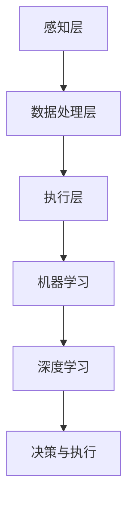

                 

# 自动化领域的最新发展方向

## 关键词
- 自动化技术
- 人工智能
- 工业自动化
- 软件自动化
- 物联网自动化
- 自动化测试
- 自适应自动化
- 智能自动化

## 摘要
本文将深入探讨自动化领域的最新发展趋势。随着技术的不断进步，自动化正在从传统的制造业扩展到更广泛的行业，包括金融服务、医疗保健、交通运输等。本文将首先介绍自动化技术的核心概念和原理，然后详细分析当前主流的自动化算法和工具，最后讨论自动化技术的实际应用场景和未来面临的挑战。通过本文的阅读，读者将对自动化技术的最新发展有一个全面的了解，并能够预见到其在未来各个领域的应用潜力。

## 1. 背景介绍

自动化（Automation）是指使用机械、电子或计算机技术来代替人工完成各种任务。随着工业革命的兴起，自动化技术在制造业中得到了广泛应用，如流水线生产、数控机床、机器人等。然而，随着人工智能（AI）和物联网（IoT）技术的发展，自动化不再局限于制造业，而是开始渗透到社会的各个角落。

### 1.1 自动化技术的起源和发展

自动化的概念可以追溯到古代，例如水钟和自动机械装置。然而，现代自动化技术的起源可以追溯到20世纪初期，当时自动化机械逐渐应用于工厂生产。第二次世界大战后，自动化技术进一步发展，特别是在制造业中，流水线生产成为主流。随着计算机技术的发展，自动化技术逐渐向计算机控制转变。

### 1.2 自动化技术的分类

自动化技术主要可以分为以下几类：

- **机械自动化**：通过机械装置来实现任务的自动化，如机器人、自动化生产线等。
- **电气自动化**：利用电气元件和控制电路来实现自动化，如PLC（可编程逻辑控制器）。
- **软件自动化**：使用软件工具来实现任务的自动化，如自动化测试、自动化部署等。
- **物联网自动化**：通过物联网设备来实现自动化，如智能家居、智能交通等。

### 1.3 自动化技术的重要性

自动化技术不仅提高了生产效率和产品质量，还大大降低了人力成本和错误率。在现代社会，自动化技术已经成为提高国家竞争力的重要手段。随着人工智能和物联网技术的进一步发展，自动化技术将发挥更加重要的作用。

## 2. 核心概念与联系

### 2.1 自动化技术的核心概念

- **任务自动化**：将重复性或繁琐的任务自动化。
- **适应性自动化**：系统能够根据环境变化自动调整。
- **智能自动化**：结合人工智能技术，使系统能够自主学习和决策。
- **人机协作**：人与自动化系统之间的互动和协作。

### 2.2 自动化技术的架构


- **感知层**：传感器和物联网设备收集数据。
- **数据处理层**：计算机和算法处理数据。
- **执行层**：执行自动化任务，如机器人、自动化设备等。

### 2.3 自动化技术与人工智能的联系

人工智能（AI）是自动化技术的核心驱动力之一。通过机器学习、深度学习等人工智能技术，自动化系统能够实现更高程度的自适应性和智能化。以下是一个简单的 Mermaid 流程图，展示了自动化技术与人工智能的联系：



## 3. 核心算法原理 & 具体操作步骤

### 3.1 机器学习算法

机器学习是自动化技术的重要分支。以下是几种常见的机器学习算法：

#### 3.1.1 支持向量机（SVM）

- **原理**：通过寻找最佳决策边界来分类数据。
- **操作步骤**：
  1. 收集和预处理数据。
  2. 训练SVM模型。
  3. 使用模型进行预测。

#### 3.1.2 决策树

- **原理**：通过一系列规则来分类数据。
- **操作步骤**：
  1. 收集和预处理数据。
  2. 构建决策树模型。
  3. 使用模型进行预测。

#### 3.1.3 神经网络

- **原理**：模拟人脑神经元之间的连接和交互。
- **操作步骤**：
  1. 收集和预处理数据。
  2. 构建神经网络模型。
  3. 训练模型。
  4. 使用模型进行预测。

### 3.2 深度学习算法

深度学习是机器学习的进一步发展。以下是几种常见的深度学习算法：

#### 3.2.1 卷积神经网络（CNN）

- **原理**：擅长处理图像数据。
- **操作步骤**：
  1. 收集和预处理图像数据。
  2. 构建CNN模型。
  3. 训练模型。
  4. 使用模型进行图像分类或识别。

#### 3.2.2 循环神经网络（RNN）

- **原理**：擅长处理序列数据。
- **操作步骤**：
  1. 收集和预处理序列数据。
  2. 构建RNN模型。
  3. 训练模型。
  4. 使用模型进行序列预测或分类。

## 4. 数学模型和公式 & 详细讲解 & 举例说明

### 4.1 机器学习中的数学模型

在机器学习中，数学模型是非常重要的。以下是一些基本的数学模型和公式：

#### 4.1.1 决策树

- **原理**：通过一系列规则来分类数据。
- **公式**：

  $$h(x) = \sum_{i=1}^{n} r_i(x) \cdot y_i$$

  其中，$h(x)$ 表示决策函数，$r_i(x)$ 表示第$i$个规则的输出，$y_i$ 表示样本的类别标签。

#### 4.1.2 神经网络

- **原理**：模拟人脑神经元之间的连接和交互。
- **公式**：

  $$y = \sigma(\sum_{i=1}^{n} w_i \cdot x_i + b)$$

  其中，$y$ 表示输出，$\sigma$ 表示激活函数，$w_i$ 表示权重，$x_i$ 表示输入特征，$b$ 表示偏置。

### 4.2 深度学习中的数学模型

在深度学习中，数学模型更加复杂。以下是一些基本的数学模型和公式：

#### 4.2.1 卷积神经网络（CNN）

- **原理**：擅长处理图像数据。
- **公式**：

  $$h(x) = f(\sum_{i=1}^{k} w_i \cdot \phi(x_i) + b)$$

  其中，$h(x)$ 表示卷积操作，$f$ 表示激活函数，$w_i$ 表示卷积核，$\phi(x_i)$ 表示输入图像，$b$ 表示偏置。

#### 4.2.2 循环神经网络（RNN）

- **原理**：擅长处理序列数据。
- **公式**：

  $$h_t = \sigma(W_h h_{t-1} + W_x x_t + b)$$

  其中，$h_t$ 表示第$t$个时刻的隐藏状态，$\sigma$ 表示激活函数，$W_h$ 和$W_x$ 分别表示隐藏状态和输入的权重矩阵，$b$ 表示偏置。

### 4.3 举例说明

#### 4.3.1 决策树分类

假设我们有以下数据集：

| 样本 | 特征1 | 特征2 | 类别 |
|------|-------|-------|------|
| 1    | 0     | 0     | 0    |
| 2    | 1     | 0     | 1    |
| 3    | 0     | 1     | 1    |
| 4    | 1     | 1     | 0    |

我们可以构建一个简单的决策树，根据特征1和特征2的值来分类。

#### 4.3.2 神经网络分类

假设我们有以下数据集：

| 样本 | 特征1 | 特征2 | 类别 |
|------|-------|-------|------|
| 1    | 0     | 0     | 0    |
| 2    | 1     | 0     | 1    |
| 3    | 0     | 1     | 1    |
| 4    | 1     | 1     | 0    |

我们可以构建一个简单的神经网络，使用两个隐藏层来分类。

## 5. 项目实战：代码实际案例和详细解释说明

### 5.1 开发环境搭建

为了实现自动化技术，我们需要搭建一个合适的开发环境。以下是搭建一个基于Python的自动化测试环境的步骤：

1. 安装Python：从官网（https://www.python.org/downloads/）下载并安装Python。
2. 安装pip：使用以下命令安装pip：

   ```bash
   python -m ensurepip
   ```

3. 安装自动化测试库：使用以下命令安装常用的自动化测试库，如Selenium、pytest等：

   ```bash
   pip install selenium pytest
   ```

### 5.2 源代码详细实现和代码解读

以下是一个使用Selenium进行Web自动化测试的简单案例：

```python
from selenium import webdriver
from selenium.webdriver.common.keys import Keys

# 创建Chrome浏览器实例
driver = webdriver.Chrome()

# 打开百度首页
driver.get("https://www.baidu.com")

# 在搜索框中输入关键词
search_box = driver.find_element_by_id("kw")
search_box.send_keys("自动化")

# 点击搜索按钮
search_button = driver.find_element_by_id("su")
search_button.click()

# 等待搜索结果加载
driver.implicitly_wait(10)

# 获取搜索结果并打印
results = driver.find_elements_by_css_selector(".result.c-container")
for result in results:
    print(result.text)

# 关闭浏览器
driver.quit()
```

### 5.3 代码解读与分析

- **代码结构**：该代码分为三个部分：浏览器实例创建、网页操作、结果处理。
- **浏览器实例创建**：使用Selenium创建Chrome浏览器实例。
- **网页操作**：打开百度首页，输入关键词，点击搜索按钮。
- **结果处理**：等待搜索结果加载，获取搜索结果并打印。

通过这个案例，我们可以看到如何使用Selenium进行Web自动化测试。实际项目中，可以根据需要扩展和优化代码，如添加异常处理、断言等。

## 6. 实际应用场景

自动化技术在各个领域都有广泛的应用，以下是几个典型的应用场景：

### 6.1 制造业

在制造业中，自动化技术被广泛应用于生产线控制、质量检测、设备维护等。例如，工业机器人可以替代人工完成焊接、喷涂、装配等重复性工作，提高生产效率和产品质量。

### 6.2 金融服务

在金融服务领域，自动化技术用于交易处理、风险控制、客户服务等。例如，自动化交易系统可以实时分析市场数据，自动执行交易策略，提高交易效率。

### 6.3 医疗保健

在医疗保健领域，自动化技术用于医疗设备控制、患者数据管理、智能诊断等。例如，智能医疗设备可以自动检测患者的生命体征，实时上传数据，帮助医生进行远程诊断和治疗。

### 6.4 交通运输

在交通运输领域，自动化技术用于智能交通管理、自动驾驶、无人机配送等。例如，自动驾驶汽车可以减少交通事故，提高交通效率，无人机可以快速配送物品，解决偏远地区的物流问题。

## 7. 工具和资源推荐

### 7.1 学习资源推荐

- **书籍**：
  - 《深度学习》（Ian Goodfellow、Yoshua Bengio、Aaron Courville 著）
  - 《机器学习》（Tom Mitchell 著）
  - 《Python自动化测试实战》（Harry Percival 著）

- **论文**：
  - 《A Theoretical Analysis of the Voted Classifier》（Michael I. Jordan、Sindhu Rajamani 著）
  - 《Deep Learning》（Yoshua Bengio、Yann LeCun、Geoffrey Hinton 著）

- **博客**：
  - Medium上的“Deep Learning”系列博客
  - 知乎上的“机器学习”话题

- **网站**：
  - Coursera（提供各种在线课程）
  - edX（提供各种在线课程）

### 7.2 开发工具框架推荐

- **Python**：适用于数据分析、Web开发、自动化测试等。
- **TensorFlow**：适用于深度学习研究和开发。
- **Selenium**：适用于Web自动化测试。
- **JUnit**：适用于Java自动化测试。
- **pytest**：适用于Python自动化测试。

### 7.3 相关论文著作推荐

- **论文**：
  - 《Deep Learning》（Yoshua Bengio、Yann LeCun、Geoffrey Hinton 著）
  - 《Reinforcement Learning: An Introduction》（Richard S. Sutton、Andrew G. Barto 著）

- **著作**：
  - 《人工智能：一种现代方法》（Stuart Russell、Peter Norvig 著）
  - 《机器学习实战》（Peter Harrington 著）

## 8. 总结：未来发展趋势与挑战

### 8.1 发展趋势

- **智能化**：随着人工智能技术的发展，自动化系统将变得更加智能化，能够自主学习和决策。
- **自适应化**：自动化系统将能够根据环境和任务需求自适应调整，提高系统的灵活性和适应性。
- **融合化**：自动化技术将与其他技术（如物联网、大数据等）深度融合，形成更加复杂和高效的自动化系统。
- **普及化**：自动化技术将渗透到更多领域，成为提高生产效率、降低人力成本的重要手段。

### 8.2 挑战

- **技术挑战**：如何进一步提高自动化系统的智能化水平，使其能够处理更复杂、更动态的任务。
- **伦理挑战**：自动化技术带来的伦理问题，如就业影响、隐私保护等。
- **安全挑战**：自动化系统在运行过程中可能出现的安全问题，如数据泄露、系统崩溃等。
- **标准化挑战**：自动化技术的标准化，以促进不同系统之间的兼容性和互操作性。

## 9. 附录：常见问题与解答

### 9.1 什么是自动化技术？

自动化技术是指使用机械、电子或计算机技术来代替人工完成各种任务。通过自动化技术，可以显著提高生产效率、降低人力成本和错误率。

### 9.2 自动化技术有哪些分类？

自动化技术主要可以分为机械自动化、电气自动化、软件自动化和物联网自动化。

### 9.3 什么是机器学习？

机器学习是一种人工智能技术，通过数据驱动的方式让计算机系统从数据中学习规律，并进行预测或决策。

### 9.4 自动化技术在制造业中的应用有哪些？

自动化技术在制造业中的应用包括生产线的自动化控制、质量检测、设备维护、物流管理等。

## 10. 扩展阅读 & 参考资料

- 《深度学习》（Ian Goodfellow、Yoshua Bengio、Aaron Courville 著）
- 《机器学习》（Tom Mitchell 著）
- 《Python自动化测试实战》（Harry Percival 著）
- Coursera上的“深度学习”课程
- edX上的“机器学习”课程
- 知乎上的“机器学习”话题
- Medium上的“深度学习”系列博客
- 《人工智能：一种现代方法》（Stuart Russell、Peter Norvig 著）
- 《机器学习实战》（Peter Harrington 著）
- 《Reinforcement Learning: An Introduction》（Richard S. Sutton、Andrew G. Barto 著）
- 《自动化技术基础》（吴启迪 著）
- 《工业自动化系统设计与应用》（王晓宁 著）<|author|>

