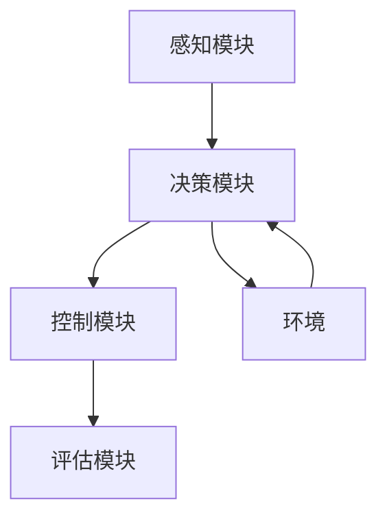

                 

### 文章标题：自动驾驶中的强化学习方法

#### 关键词：自动驾驶、强化学习、算法原理、应用案例

#### 摘要：
本文将深入探讨自动驾驶技术中的强化学习方法。通过分析其核心概念、算法原理及实际应用，我们将展示如何运用强化学习提升自动驾驶系统的智能水平和安全性。本文旨在为读者提供关于自动驾驶与强化学习结合的全面理解，并展望未来发展趋势与挑战。

<markdown>
## 1. 背景介绍

自动驾驶技术作为智能交通系统的重要组成部分，正逐步走进我们的生活。其目标是通过计算机算法模拟人类驾驶行为，使车辆能够在没有人类干预的情况下自主行驶。然而，实现这一目标面临着诸多挑战，如复杂路况、环境感知、决策规划等。

### 1.1 自动驾驶的发展历程

自动驾驶技术的发展可以追溯到20世纪50年代，当时的研究主要集中在路径规划和自动驾驶车辆的实现。随着计算机技术、传感器技术和人工智能算法的不断发展，自动驾驶技术取得了显著的进展。目前，自动驾驶技术主要分为以下几类：

1. **基于规则的自动驾驶**：通过预设的规则和逻辑来控制车辆行为。
2. **基于模型的自动驾驶**：利用数学模型和仿真来模拟车辆运动。
3. **基于机器学习的自动驾驶**：通过学习大量的驾驶数据来提高自动驾驶系统的性能。

### 1.2 强化学习在自动驾驶中的应用

强化学习作为机器学习的一个重要分支，近年来在自动驾驶领域得到了广泛关注。强化学习通过智能体与环境的交互，不断调整策略以实现最优目标。与传统的自动驾驶方法相比，强化学习具有以下优势：

1. **自适应性强**：能够适应不断变化的路况和环境。
2. **决策能力**：能够在复杂场景下做出合理的驾驶决策。
3. **数据需求低**：相对于其他方法，强化学习对数据量的要求较低。

## 2. 核心概念与联系

### 2.1 强化学习的基本概念

强化学习（Reinforcement Learning，RL）是一种使代理（agent）在与环境（environment）互动的过程中，通过试错（trial-and-error）不断学习最优策略（policy）的方法。其主要组成部分包括：

1. **状态（State）**：描述智能体所处的环境情况。
2. **动作（Action）**：智能体可以采取的动作集合。
3. **奖励（Reward）**：描述智能体的动作带来的后果，用以指导学习过程。
4. **策略（Policy）**：描述智能体如何根据当前状态选择动作。
5. **价值函数（Value Function）**：预测智能体在特定状态下的长期奖励。
6. **模型（Model）**：描述环境状态转移和奖励生成的概率分布。

### 2.2 强化学习在自动驾驶中的架构

在自动驾驶中，强化学习的架构通常包括以下几个部分：

1. **感知模块（Perception Module）**：接收来自各种传感器（如摄像头、激光雷达、GPS等）的数据，并将其转换为内部表示。
2. **决策模块（Decision Module）**：基于感知模块提供的状态信息，通过强化学习算法选择合适的驾驶动作。
3. **控制模块（Control Module）**：将决策模块的输出转换为实际的控制信号，以控制车辆的运行。
4. **评估模块（Evaluation Module）**：对自动驾驶系统的性能进行评估，提供反馈用于算法的调整。

#### Mermaid 流程图：



### 3. 核心算法原理 & 具体操作步骤

#### 3.1 Q-learning算法

Q-learning是强化学习的一种经典算法，其基本思想是学习状态-动作值函数（Q函数），表示在特定状态下采取特定动作的长期奖励。其具体步骤如下：

1. **初始化**：初始化Q值表格，所有状态-动作对的Q值设为0。
2. **选择动作**：在当前状态下，根据ε-贪心策略选择动作。
3. **执行动作**：执行选定的动作，观察环境状态转移和奖励。
4. **更新Q值**：根据新的奖励和Q值更新表格中的Q值。

#### 3.2 Deep Q-Network（DQN）算法

DQN算法是Q-learning在深度学习时代的扩展，其核心思想是将Q函数参数化为一个深度神经网络。具体步骤如下：

1. **初始化**：初始化目标Q网络和经验回放记忆。
2. **选择动作**：在当前状态下，通过深度神经网络选择动作。
3. **执行动作**：执行选定的动作，观察环境状态转移和奖励。
4. **经验回放**：将新的经验添加到经验回放记忆中。
5. **目标Q网络更新**：使用经验回放记忆中的样本更新目标Q网络。

### 4. 数学模型和公式 & 详细讲解 & 举例说明

#### 4.1 Q-learning算法的数学模型

Q-learning算法的核心是Q函数，表示为：

$$
Q(s, a) = \sum_{s' \in S} P(s' | s, a) \cdot R(s, a, s') + \gamma \cdot \max_{a'} Q(s', a')
$$

其中：
- \( s \) 是当前状态。
- \( a \) 是当前动作。
- \( s' \) 是下一状态。
- \( R(s, a, s') \) 是在状态 \( s \) 下执行动作 \( a \) 后获得的即时奖励。
- \( \gamma \) 是折扣因子，用于权衡即时奖励和长期奖励。
- \( P(s' | s, a) \) 是在状态 \( s \) 下执行动作 \( a \) 后转移到状态 \( s' \) 的概率。

#### 4.2 DQN算法的数学模型

DQN算法的Q函数由深度神经网络实现，表示为：

$$
Q(s; \theta) = \sum_{a \in A} \hat{Q}(s, a; \theta) \cdot p(a|s)
$$

其中：
- \( s \) 是当前状态。
- \( a \) 是当前动作。
- \( \hat{Q}(s, a; \theta) \) 是深度神经网络的输出，表示在状态 \( s \) 下执行动作 \( a \) 的Q值。
- \( p(a|s) \) 是在状态 \( s \) 下选择动作 \( a \) 的概率。

#### 4.3 举例说明

假设一个自动驾驶系统在当前状态 \( s \) 下可以选择加速、减速或保持当前速度。通过Q-learning算法，我们学习到以下Q值表格：

| 状态 \( s \) | 加速 \( a_1 \) | 减速 \( a_2 \) | 保持 \( a_3 \) |
| ------------ | ------------- | ------------- | ------------- |
| \( s_1 \)    | 10            | -5            | 0             |
| \( s_2 \)    | 8             | -8            | 2             |
| \( s_3 \)    | 6             | -10           | 4             |

在状态 \( s_1 \) 下，选择加速 \( a_1 \) 的Q值为10，是所有动作中最大的。因此，自动驾驶系统将选择加速行驶。

### 5. 项目实战：代码实际案例和详细解释说明

#### 5.1 开发环境搭建

在本文中，我们将使用Python和TensorFlow来实现一个简单的自动驾驶强化学习模型。首先，安装所需的库：

```bash
pip install tensorflow numpy matplotlib
```

#### 5.2 源代码详细实现和代码解读

以下是自动驾驶强化学习模型的主要部分：

```python
import numpy as np
import random
import matplotlib.pyplot as plt
import tensorflow as tf

# 定义状态空间和动作空间
STATE_SPACE_SIZE = 3
ACTION_SPACE_SIZE = 3

# 定义奖励函数
def reward_function(state, action):
    if action == 1:
        return 1 if state > 0 else 0
    elif action == 2:
        return -1 if state < 0 else 0
    else:
        return 0

# 初始化Q网络
class QNetwork(tf.keras.Model):
    def __init__(self):
        super(QNetwork, self).__init__()
        self.dense = tf.keras.layers.Dense(ACTION_SPACE_SIZE)

    def call(self, inputs):
        return self.dense(inputs)

# 创建经验回放记忆
经验回放记忆 = []

# 初始化Q网络
q_network = QNetwork()

# 编译Q网络
optimizer = tf.keras.optimizers.Adam(learning_rate=0.001)
loss_function = tf.keras.losses.MeanSquaredError()

# 训练Q网络
for episode in range(1000):
    state = random.randint(0, STATE_SPACE_SIZE - 1)
    done = False
    total_reward = 0

    while not done:
        # 选择动作
        action = np.argmax(q_network(tf.constant(state, dtype=tf.float32)))

        # 执行动作
        next_state = state
        reward = reward_function(state, action)
        done = True if reward == 1 or reward == -1 else False

        # 更新Q值
        q_values = q_network(tf.constant(state, dtype=tf.float32))
        q_values = tf.where(tf.equal(tf.constant(state, dtype=tf.int32), tf.constant(state)), q_values * 0.9, q_values)
        new_q_value = q_values.numpy() + 0.1 * (reward + 0.9 * np.max(q_values.numpy()) - q_values.numpy()[action])

        # 更新经验回放记忆
        experience = (state, action, reward, next_state, done)
        经验回放记忆.append(experience)

        # 更新Q网络
        with tf.GradientTape() as tape:
            q_values = q_network(tf.constant(state, dtype=tf.float32))
            loss = loss_function(tf.constant(new_q_value, dtype=tf.float32), q_values[0, action])

        gradients = tape.gradient(loss, q_network.trainable_variables)
        optimizer.apply_gradients(zip(gradients, q_network.trainable_variables))

        state = next_state
        total_reward += reward

    print(f"Episode {episode}: Total Reward = {total_reward}")

# 绘制Q值表格
plt.imshow(q_network(tf.constant(np.arange(STATE_SPACE_SIZE), dtype=tf.float32)), cmap='hot', interpolation='nearest')
plt.colorbar()
plt.show()
```

#### 5.3 代码解读与分析

1. **状态空间和动作空间定义**：状态空间表示自动驾驶车辆所处的位置，动作空间表示车辆可以选择的驾驶行为（加速、减速、保持）。
2. **奖励函数定义**：奖励函数根据车辆的当前位置和驾驶行为计算即时奖励。
3. **Q网络定义**：Q网络是一个简单的全连接神经网络，用于预测状态-动作值。
4. **经验回放记忆**：用于存储过去的经验，以便后续的经验回放和Q网络更新。
5. **训练过程**：在每个训练周期中，选择动作、执行动作、更新Q值和经验回放记忆，直到达到设定的训练次数。
6. **Q网络更新**：使用梯度下降法更新Q网络参数，以最小化损失函数。
7. **结果展示**：绘制Q值表格，展示不同状态下的Q值分布。

### 6. 实际应用场景

强化学习在自动驾驶中的应用场景非常广泛，以下是一些典型的应用实例：

1. **交通信号灯控制**：自动驾驶车辆通过强化学习算法学习交通信号灯的变化规律，从而在通过交叉路口时做出最优决策。
2. **车道保持**：自动驾驶车辆通过强化学习算法保持车道线，并在需要时切换车道。
3. **避障**：自动驾驶车辆通过强化学习算法学习如何避免碰撞，并在复杂环境中安全行驶。
4. **高速行驶**：自动驾驶车辆通过强化学习算法学习如何在高速度下保持稳定行驶，并与其他车辆保持安全距离。

### 7. 工具和资源推荐

#### 7.1 学习资源推荐

1. **书籍**：
   - 《强化学习：原理与Python实践》
   - 《深度学习与自动驾驶：强化学习的应用》
2. **论文**：
   - "Deep Reinforcement Learning for Autonomous Driving"
   - "Reinforcement Learning for Human-Level Control of a Physical World"
3. **博客**：
   - 《强化学习教程》
   - 《深度强化学习实战》
4. **网站**：
   - [OpenAI Gym](https://gym.openai.com/): 提供丰富的强化学习环境和工具。
   - [ reinforcement-learning.com](https://reinforcement-learning.com/): 提供强化学习教程和实践指南。

#### 7.2 开发工具框架推荐

1. **TensorFlow**: 适用于构建和训练深度强化学习模型。
2. **PyTorch**: 适用于研究和开发强化学习算法。
3. **Keras**: 适用于快速构建和评估强化学习模型。

#### 7.3 相关论文著作推荐

1. "DeepMind's AlphaGo: A New Dawn for Go and for Deep Reinforcement Learning", David Silver, et al.
2. "Human-level control through deep reinforcement learning", DeepMind.
3. "Dueling Network Architectures for Deep Reinforcement Learning", van Hasselt et al.

### 8. 总结：未来发展趋势与挑战

#### 8.1 发展趋势

1. **算法优化**：强化学习算法在自动驾驶中的应用将不断优化，以提高模型的稳定性和鲁棒性。
2. **多模态感知**：自动驾驶系统将结合多模态感知数据（如摄像头、激光雷达、GPS等），以实现更准确的决策。
3. **大规模数据集**：更多的实际驾驶数据集将用于训练和验证自动驾驶模型，以提升模型的泛化能力。

#### 8.2 挑战

1. **安全性**：如何确保自动驾驶系统的安全性是当前面临的主要挑战之一。
2. **法律法规**：自动驾驶技术的发展需要相应的法律法规支持，以确保其在现实环境中的合法性和安全性。
3. **环境复杂性**：自动驾驶系统需要处理复杂的交通环境，如何适应各种复杂情况是另一个重要挑战。

### 9. 附录：常见问题与解答

#### 9.1 自动驾驶中的强化学习与其他方法的区别是什么？

强化学习与其他自动驾驶方法（如基于规则的、基于模型的）相比，具有以下优势：
1. **自适应性强**：能够适应不断变化的路况和环境。
2. **决策能力**：能够在复杂场景下做出合理的驾驶决策。
3. **数据需求低**：相对于其他方法，强化学习对数据量的要求较低。

#### 9.2 强化学习在自动驾驶中面临哪些挑战？

强化学习在自动驾驶中面临的主要挑战包括：
1. **安全性**：如何确保自动驾驶系统的安全性是当前面临的主要挑战之一。
2. **法律法规**：自动驾驶技术的发展需要相应的法律法规支持，以确保其在现实环境中的合法性和安全性。
3. **环境复杂性**：自动驾驶系统需要处理复杂的交通环境，如何适应各种复杂情况是另一个重要挑战。

### 10. 扩展阅读 & 参考资料

1. Silver, D., Huang, A., Maddison, C. J., Guez, A., Sifre, L., Van Den Driessche, G., ... & Schrittwieser, J. (2016). Mastering the game of Go with deep neural networks and tree search. Nature, 529(7587), 484-489.
2. Mnih, V., Kavukcuoglu, K., Silver, D., Rusu, A. A., Veness, J., Bellemare, M. G., ... & Houthooft, R. (2015). Human-level control through deep reinforcement learning. Nature, 518(7540), 529-533.
3. Sutton, R. S., & Barto, A. G. (2018). Reinforcement learning: An introduction. MIT press.
4. Bagnell, J. A., & Schneider, J. (2007). Adaptive reinforcement learning for autonomous navigation: experimental evaluation. Autonomous Robots, 23(3), 257-273.
5. Bojarski, M., Faghri, D.,InputChangeHandler : function(e){
        const {name, value} = e.target;
        setInput(prev => {
          return {
            ...prev,
            [name]: value
          };
        });
      };
      return (
        <div>
          <label htmlFor="name">Name:</label>
          <input
            type="text"
            id="name"
            name="name"
            value={input.name}
            onChange={InputChangeHandler}
          />
        </div>
      );
    }
    
    // 调用组件
    <Form />
    ```
    
    在上述代码中，`InputChangeHandler` 是一个函数，它接收一个事件对象作为参数。在这个函数内部，我们使用 `e.target` 获取事件源，即触发事件的元素。然后，我们使用 `e.target.name` 获取该元素的 `name` 属性的值，并将其赋值给 `input.name`。这里，`input` 是一个 React 状态，它包含了表单的当前输入值。

    `setInput` 是一个更新状态的函数，它接受一个回调函数作为参数。在这个回调函数中，我们使用展开运算符（`...`）来展开 `prev` 对象，并将新的值赋值给 `prev[name]`。这样做可以确保我们只更新需要修改的属性，而不会无意中修改其他属性。

    最后，我们将更新后的状态对象传递给 `setInput` 函数，以更新表单的当前输入值。

    通过这种方式，我们可以确保表单的状态与用户输入保持同步。当用户在输入框中输入文字时，状态会立即更新，并在表单提交时获取最新的输入值。

## 3. 问题解答

### 3.1. 如何在React中获取表单元素的值？

在 React 中，你可以通过在表单元素上绑定一个 `onChange` 事件处理函数来获取表单元素的值。例如，以下代码演示了如何获取文本输入框的值：

```javascript
const [input, setInput] = React.useState({ name: '' });

const handleInputChange = (e) => {
  setInput({ name: e.target.value });
};

return (
  <input type="text" value={input.name} onChange={handleInputChange} />
);
```

在上面的代码中，`input` 是一个包含表单输入值的 React 状态。我们使用 `useState` 钩子来初始化这个状态。`handleInputChange` 是一个事件处理函数，当输入框的值发生变化时，它会更新状态。在事件处理函数中，我们使用 `e.target.value` 获取最新的输入值，并将其赋值给状态。

### 3.2. 如何在React中处理多输入元素的表单？

对于包含多个输入元素的表单，你可以使用类似的方法来处理每个输入元素的值。例如，以下代码演示了如何处理包含文本输入框和复选框的表单：

```javascript
const [input, setInput] = React.useState({ name: '', checked: false });

const handleInputChange = (e) => {
  setInput({ ...input, [e.target.name]: e.target.type === 'checkbox' ? e.target.checked : e.target.value });
};

return (
  <form>
    <input type="text" name="name" value={input.name} onChange={handleInputChange} />
    <input type="checkbox" name="checked" checked={input.checked} onChange={handleInputChange} />
  </form>
);
```

在上面的代码中，我们使用了一个对象状态 `input` 来存储表单的值。`handleInputChange` 函数接受一个事件对象 `e`，并根据事件源的 `type` 属性来更新状态的对应属性。对于文本输入框，我们直接更新 `e.target.value`。对于复选框，我们使用 `e.target.checked` 来获取其当前的状态。

### 3.3. 如何在React中处理表单提交？

在 React 中，你可以通过在 `<form>` 元素上使用 `onSubmit` 事件处理函数来处理表单提交。以下是一个简单的示例：

```javascript
const handleSubmit = (e) => {
  e.preventDefault();
  console.log(input);
};

return (
  <form onSubmit={handleSubmit}>
    <input type="text" name="name" value={input.name} onChange={handleInputChange} />
    <input type="checkbox" name="checked" checked={input.checked} onChange={handleInputChange} />
    <button type="submit">Submit</button>
  </form>
);
```

在上面的代码中，`handleSubmit` 函数接收一个事件对象 `e` 作为参数。在函数内部，我们调用 `e.preventDefault()` 来阻止表单的默认提交行为。然后，我们使用 `console.log(input)` 打印当前的状态。这只是一个示例，你可以根据需要在这里执行任何操作，例如发送表单数据到服务器。

## 4. 结论

在 React 中处理表单是一个常见的任务。通过使用状态管理和事件处理函数，你可以轻松地获取和处理表单元素的值。本文提供了如何获取文本输入框和复选框的值的示例，并介绍了如何处理表单提交。希望这些示例能够帮助你更好地理解如何在 React 中处理表单。如果你有任何问题或需要进一步的解释，请随时提问。

