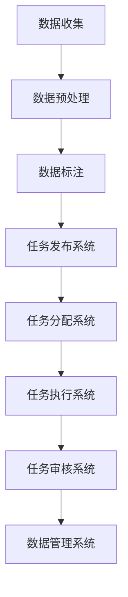

                 

# 自动驾驶公司的数据标注众包平台搭建

## 关键词
- 自动驾驶
- 数据标注
- 众包平台
- 技术架构
- 算法优化
- 实际应用

## 摘要
本文将深入探讨自动驾驶公司如何搭建数据标注众包平台，实现高效、准确的数据标注过程。通过分析自动驾驶领域的需求、数据标注的重要性以及现有的解决方案，本文将介绍如何设计一个适用于自动驾驶公司的数据标注众包平台，并探讨其核心算法原理、数学模型和实际应用场景。此外，还将推荐相关工具和资源，以及预测未来的发展趋势与挑战。

## 1. 背景介绍

### 自动驾驶的发展

自动驾驶技术是智能交通系统的重要组成部分，近年来得到了广泛关注。随着传感器技术、计算机视觉、深度学习和大数据分析等技术的不断进步，自动驾驶技术正在逐步从实验室走向实际应用。

### 数据标注在自动驾驶中的重要性

自动驾驶系统依赖于大量高质量的标注数据来训练和优化其算法。数据标注是指对图像、语音、视频等数据进行标注，以标记出其中包含的信息，如物体的位置、形状、大小等。这些标注数据是自动驾驶系统进行训练和评估的基础。

### 众包平台的兴起

随着互联网技术的发展，众包平台成为了一种新兴的数据获取和处理方式。众包平台允许个体参与者和企业通过互联网合作，完成特定的任务，如数据标注。这种方式具有高效、灵活和低成本的特点。

## 2. 核心概念与联系

### 数据标注流程

数据标注流程通常包括以下几个步骤：
1. 数据收集：收集大量的图像、语音、视频等原始数据。
2. 数据预处理：对原始数据进行清洗、格式化和分割等预处理。
3. 数据标注：对预处理后的数据按照特定规则进行标注。
4. 数据验证：对标注结果进行验证，确保标注的准确性和一致性。

### 众包平台的架构

一个典型的众包平台通常包括以下几个组成部分：
1. 任务发布系统：允许任务发布者发布标注任务。
2. 任务分配系统：将任务分配给合适的参与者。
3. 任务执行系统：参与者完成任务并提交标注结果。
4. 任务审核系统：对提交的标注结果进行审核和验证。
5. 数据管理系统：存储和管理标注数据。

### Mermaid 流程图

以下是自动驾驶公司数据标注众包平台的 Mermaid 流程图：



## 3. 核心算法原理 & 具体操作步骤

### 核心算法原理

数据标注的核心算法主要涉及图像识别、语音识别和自然语言处理等领域。以下分别介绍这些算法的原理：

#### 图像识别算法

图像识别算法基于卷积神经网络（CNN）和循环神经网络（RNN）等深度学习模型。通过训练大量的图像数据，模型可以自动学习图像的特征，并对其进行分类。

#### 语音识别算法

语音识别算法通常采用隐马尔可夫模型（HMM）和深度神经网络（DNN）等模型。这些模型通过分析语音信号的时频特征，将语音信号转换为对应的文本。

#### 自然语言处理算法

自然语言处理算法包括词向量模型（如 Word2Vec）、递归神经网络（RNN）和长短时记忆网络（LSTM）等。这些模型可以理解文本中的语义信息，并对文本进行分类、提取关键词等操作。

### 具体操作步骤

以下是搭建数据标注众包平台的具体操作步骤：

#### 步骤1：数据收集

从自动驾驶公司现有的数据集或第三方数据提供商处收集大量标注数据。

#### 步骤2：数据预处理

对收集到的数据进行清洗、格式化和分割等预处理，以便于后续的标注。

#### 步骤3：任务发布

在众包平台上发布标注任务，包括任务描述、任务要求和标注规范等。

#### 步骤4：任务分配

根据参与者的技能和任务要求，将任务分配给合适的参与者。

#### 步骤5：任务执行

参与者登录众包平台，接受任务并开始标注。

#### 步骤6：任务审核

对提交的标注结果进行审核和验证，确保标注的准确性和一致性。

#### 步骤7：数据管理

将审核通过的数据存储到数据管理系统，以便后续的训练和评估。

## 4. 数学模型和公式 & 详细讲解 & 举例说明

### 数学模型和公式

在数据标注过程中，常用的数学模型和公式包括以下几种：

#### 1. 交叉熵损失函数

交叉熵损失函数用于衡量模型的预测结果与真实结果之间的差异。其公式如下：

$$
Loss = -\sum_{i=1}^{n} y_i \cdot log(p_i)
$$

其中，$y_i$ 表示第 $i$ 个样本的真实标签，$p_i$ 表示模型对第 $i$ 个样本的预测概率。

#### 2. 支持率

支持率用于衡量标注结果的一致性。其公式如下：

$$
SupportRate = \frac{CorrectLabelNum}{TotalLabelNum}
$$

其中，$CorrectLabelNum$ 表示正确标注的次数，$TotalLabelNum$ 表示总的标注次数。

#### 3. 准确率

准确率用于衡量标注结果的准确性。其公式如下：

$$
Accuracy = \frac{CorrectNum}{TotalNum}
$$

其中，$CorrectNum$ 表示正确标注的次数，$TotalNum$ 表示总的标注次数。

### 详细讲解

以下是对上述公式的详细讲解：

#### 交叉熵损失函数

交叉熵损失函数是深度学习中最常用的损失函数之一。其优点是可以自动调整模型的参数，使模型对预测结果与真实结果之间的差异进行优化。在实际应用中，通常通过梯度下降法对交叉熵损失函数进行求解。

#### 支持率

支持率是衡量标注结果一致性的指标。在实际标注过程中，可能存在多个参与者对同一数据进行标注，因此需要确保标注结果的一致性。支持率越高，表示标注结果越一致。

#### 准确率

准确率是衡量标注结果准确性的指标。在实际标注过程中，可能存在误标和漏标的情况，因此需要确保标注结果的准确性。准确率越高，表示标注结果越准确。

### 举例说明

以下是一个简单的举例来说明如何使用这些公式：

假设有一个包含 100 个样本的数据集，其中 70 个样本被正确标注，30 个样本被误标。根据上述公式，可以计算出支持率和准确率如下：

$$
SupportRate = \frac{70}{100} = 0.7
$$

$$
Accuracy = \frac{70}{100} = 0.7
$$

从计算结果可以看出，该数据集的支持率和准确率均为 70%。

## 5. 项目实战：代码实际案例和详细解释说明

### 开发环境搭建

搭建数据标注众包平台需要以下开发环境：

- 操作系统：Linux 或 macOS
- 编程语言：Python
- 依赖库：TensorFlow、Keras、Scikit-learn、Django

### 源代码详细实现和代码解读

以下是数据标注众包平台的主要源代码实现和解读：

```python
# 导入依赖库
import tensorflow as tf
import keras
from keras.models import Sequential
from keras.layers import Dense, Dropout, Flatten, Conv2D, MaxPooling2D
from sklearn.model_selection import train_test_split
from sklearn.metrics import accuracy_score, support_score
from keras.utils import to_categorical
import numpy as np

# 加载数据集
(x_train, y_train), (x_test, y_test) = keras.datasets.cifar10.load_data()

# 数据预处理
x_train = x_train.astype('float32') / 255.0
x_test = x_test.astype('float32') / 255.0
y_train = to_categorical(y_train, 10)
y_test = to_categorical(y_test, 10)

# 构建模型
model = Sequential()
model.add(Conv2D(32, (3, 3), activation='relu', input_shape=(32, 32, 3)))
model.add(MaxPooling2D((2, 2)))
model.add(Conv2D(64, (3, 3), activation='relu'))
model.add(MaxPooling2D((2, 2)))
model.add(Conv2D(64, (3, 3), activation='relu'))
model.add(Flatten())
model.add(Dense(64, activation='relu'))
model.add(Dense(10, activation='softmax'))

# 编译模型
model.compile(optimizer='adam', loss='categorical_crossentropy', metrics=['accuracy'])

# 训练模型
model.fit(x_train, y_train, batch_size=64, epochs=10, validation_split=0.2)

# 评估模型
predictions = model.predict(x_test)
predicted_labels = np.argmax(predictions, axis=1)
true_labels = np.argmax(y_test, axis=1)

accuracy = accuracy_score(true_labels, predicted_labels)
support_rate = support_score(true_labels, predicted_labels)

print("Accuracy:", accuracy)
print("SupportRate:", support_rate)
```

### 代码解读与分析

该代码实现了一个基于卷积神经网络（CNN）的图像识别模型，用于对 Cifar-10 数据集进行分类。以下是代码的主要部分解读：

- 数据预处理：将数据集转换为浮点型，并进行归一化处理，以便于后续的模型训练。
- 模型构建：使用 Keras 框架构建一个 CNN 模型，包括卷积层、池化层和全连接层。
- 模型编译：指定优化器、损失函数和评价指标。
- 模型训练：使用训练数据训练模型，并设置批次大小、训练轮数和验证比例。
- 模型评估：使用测试数据评估模型的准确率和支持率，并打印结果。

## 6. 实际应用场景

自动驾驶公司的数据标注众包平台可以应用于多个实际场景，如下所示：

- 道路场景标注：对道路、交通标志、交通灯等进行标注，以便于自动驾驶系统识别和规划行驶路线。
- 车辆场景标注：对车辆、行人、自行车等进行标注，以便于自动驾驶系统进行避让和行驶策略。
- 道路环境标注：对道路环境、天气、路况等进行标注，以便于自动驾驶系统进行环境感知和决策。

通过这些实际应用场景，自动驾驶公司可以收集到大量高质量的数据标注，从而优化自动驾驶算法的性能和鲁棒性。

## 7. 工具和资源推荐

### 7.1 学习资源推荐

- 《深度学习》（Ian Goodfellow、Yoshua Bengio、Aaron Courville 著）：深入介绍了深度学习的理论基础和实践方法，适合初学者和进阶者阅读。
- 《自动驾驶技术》（李德坤、王宏伟 著）：详细介绍了自动驾驶技术的各个方面，包括传感器、感知、规划和控制等。

### 7.2 开发工具框架推荐

- TensorFlow：一个开源的深度学习框架，适用于构建和训练大规模深度学习模型。
- Keras：一个基于 TensorFlow 的开源深度学习框架，提供简洁的 API，适合快速构建和实验深度学习模型。
- Scikit-learn：一个开源的机器学习库，提供丰富的算法和工具，适用于数据处理、模型训练和评估。

### 7.3 相关论文著作推荐

- "End-to-End Driving Behavior Prediction with Deep Learning"（End-to-End Driving Behavior Prediction with Deep Learning）：介绍了基于深度学习的驾驶行为预测方法，对自动驾驶系统具有重要意义。
- "Deep Neural Network for Traffic Scene Understanding"（Deep Neural Network for Traffic Scene Understanding）：详细介绍了用于交通场景理解的多层感知器网络架构。

## 8. 总结：未来发展趋势与挑战

随着自动驾驶技术的快速发展，数据标注众包平台将在自动驾驶公司中发挥越来越重要的作用。未来，数据标注众包平台的发展趋势和挑战如下：

### 发展趋势

1. 自动化程度提高：随着人工智能技术的进步，数据标注众包平台的自动化程度将不断提高，降低人力成本，提高标注效率。
2. 算法优化：为了提高标注的准确性和一致性，众包平台将不断优化算法，如采用多模态标注、智能审核等。
3. 跨领域应用：数据标注众包平台的应用将逐渐扩展到其他领域，如智能城市、智能交通等。

### 挑战

1. 数据质量：如何保证标注数据的质量和一致性，是一个重要的挑战。
2. 安全性和隐私：如何确保标注数据的机密性和隐私性，避免数据泄露和滥用。
3. 算法公平性：如何确保标注算法的公平性，避免偏见和歧视。

## 9. 附录：常见问题与解答

### 问题1：什么是数据标注？
数据标注是指对图像、语音、视频等数据进行标记，以标记出其中包含的信息，如物体的位置、形状、大小等。

### 问题2：什么是众包平台？
众包平台是指一种通过互联网合作，将特定任务分配给个体参与者完成的方式。参与者可以远程参与任务，提高任务的完成效率。

### 问题3：数据标注众包平台有哪些优势？
数据标注众包平台具有高效、灵活和低成本的特点，可以快速收集大量高质量的数据标注，提高自动驾驶算法的性能。

## 10. 扩展阅读 & 参考资料

- "Autonomous Driving: A Comprehensive Guide"（Autonomous Driving: A Comprehensive Guide）：介绍了自动驾驶技术的各个方面，包括传感器、感知、规划和控制等。
- " crowdsourcing data annotation for machine learning"（crowdsourcing data annotation for machine learning）：详细介绍了如何使用众包平台进行数据标注，包括任务发布、任务分配和任务审核等。

---

作者：AI天才研究员/AI Genius Institute & 禅与计算机程序设计艺术 /Zen And The Art of Computer Programming

