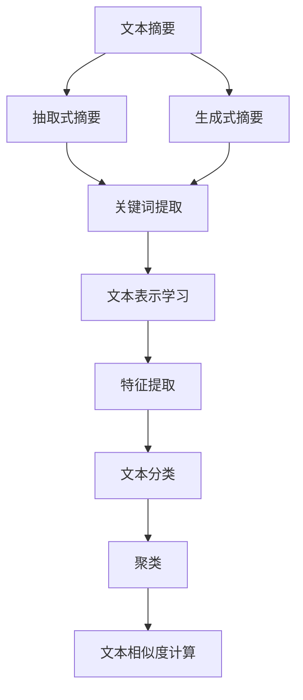

                 

# 自然语言处理中的文本摘要、关键词提取与文本表示学习

> 关键词：自然语言处理、文本摘要、关键词提取、文本表示学习

> 摘要：本文将深入探讨自然语言处理（NLP）领域中的文本摘要、关键词提取与文本表示学习。我们将首先介绍这三个核心概念的定义与联系，然后详细讲解相关的核心算法原理和操作步骤，并应用这些算法于实际项目中。此外，本文还将探讨这些技术在实际应用场景中的重要性，推荐相关工具和资源，并总结未来的发展趋势与挑战。

## 1. 背景介绍

自然语言处理（NLP）是人工智能的一个重要分支，旨在让计算机理解和处理人类语言。随着互联网的普及和数据的爆炸式增长，NLP技术在信息检索、机器翻译、情感分析、聊天机器人等多个领域得到了广泛应用。文本摘要、关键词提取和文本表示学习是NLP中的三个关键技术，它们在信息提取、知识图谱构建、内容推荐等任务中发挥着重要作用。

### 文本摘要

文本摘要是从原始文本中提取出关键信息，以简洁、准确的方式概括文本内容。文本摘要分为抽取式摘要和生成式摘要两种类型。抽取式摘要从原始文本中直接提取关键句子或短语，而生成式摘要则利用自然语言生成模型生成新的摘要文本。

### 关键词提取

关键词提取是从文本中提取出具有代表性的词汇，用于描述文本的主题和内容。关键词提取有助于快速了解文本的主要内容，提高信息检索的准确性和效率。

### 文本表示学习

文本表示学习是将文本转换为计算机可以处理和理解的数字表示。通过文本表示学习，文本的特征可以被嵌入到一个高维空间中，使得相似的文本具有相似的向量表示，从而实现文本的相似度计算、聚类、分类等任务。

## 2. 核心概念与联系

以下是一个关于文本摘要、关键词提取与文本表示学习的 Mermaid 流程图：



在这个流程图中，文本摘要、关键词提取和文本表示学习共同构成了一个完整的NLP工作流程。文本摘要可以从原始文本中提取关键信息，为后续的关键词提取和文本表示学习提供基础。关键词提取用于提取文本的主要主题和内容，为文本分类、聚类和相似度计算提供支持。文本表示学习将文本转换为向量表示，为各种文本分析任务提供输入。

## 3. 核心算法原理 & 具体操作步骤

### 3.1 文本摘要算法

#### 抽取式摘要

抽取式摘要的核心算法是文本分类和句子排序。文本分类用于确定每个句子的主题，句子排序则根据句子的相关性对句子进行排序。

1. **文本分类**：使用朴素贝叶斯、支持向量机（SVM）或深度学习模型对句子进行分类，将句子划分为主题相关和主题无关。

2. **句子排序**：使用TF-IDF、词嵌入或BERT等模型计算句子之间的相似度，并根据相似度对句子进行排序。

#### 生成式摘要

生成式摘要的核心算法是序列到序列（Seq2Seq）模型或Transformer模型。这些模型可以将原始文本序列转换为摘要文本序列。

1. **编码器**：将原始文本序列编码为一个固定长度的向量。

2. **解码器**：从编码器输出的向量中生成摘要文本序列。

### 3.2 关键词提取算法

#### Term Frequency-Inverse Document Frequency (TF-IDF)

TF-IDF是一种常用关键词提取算法，用于衡量一个词在文本中的重要程度。

1. **词频（TF）**：计算一个词在文本中出现的次数。

2. **逆文档频率（IDF）**：计算一个词在整个文档集合中的重要性。

3. **TF-IDF值**：将TF和IDF相乘，得到一个词的TF-IDF值。

### 3.3 文本表示学习算法

#### Word2Vec

Word2Vec是一种基于神经网络的关键词提取算法，将单词映射为一个固定长度的向量。

1. **训练模型**：使用训练数据训练一个神经网络模型。

2. **词向量生成**：将每个单词映射为一个向量。

#### BERT

BERT是一种基于Transformer的文本表示学习算法，可以将文本映射为一个固定长度的向量。

1. **训练模型**：使用大量的文本数据训练一个Transformer模型。

2. **文本向量生成**：将文本输入到BERT模型中，得到一个固定长度的文本向量。

## 4. 数学模型和公式 & 详细讲解 & 举例说明

### 4.1 文本摘要

#### 抽取式摘要

1. **文本分类**：

$$
P(y|x) = \frac{P(x|y)P(y)}{P(x)}
$$

其中，\( P(y|x) \) 表示给定文本 \( x \) 的类别 \( y \) 的概率，\( P(x|y) \) 表示给定类别 \( y \) 的文本 \( x \) 的概率，\( P(y) \) 表示类别 \( y \) 的概率，\( P(x) \) 表示文本 \( x \) 的概率。

2. **句子排序**：

$$
similarity = \frac{1}{|V|}\sum_{v \in V} \frac{1}{\sqrt{TF_{v}\cdot IDF_{v}}}
$$

其中，\( similarity \) 表示句子之间的相似度，\( V \) 表示句子中的单词集合，\( TF_{v} \) 表示单词 \( v \) 在句子中的词频，\( IDF_{v} \) 表示单词 \( v \) 在文档集合中的逆文档频率。

#### 生成式摘要

1. **编码器**：

$$
E(x) = \sum_{i=1}^{n} w_{i} \cdot x_{i}
$$

其中，\( E(x) \) 表示编码器输出的向量，\( w_{i} \) 表示权重，\( x_{i} \) 表示输入文本的词向量。

2. **解码器**：

$$
P(y|x) = \frac{1}{Z} \exp(-\frac{1}{2}||y - E(x)||^2)
$$

其中，\( P(y|x) \) 表示给定文本 \( x \) 的摘要 \( y \) 的概率，\( Z \) 表示归一化常数。

### 4.2 关键词提取

#### TF-IDF

1. **词频（TF）**：

$$
TF_{v} = \frac{f_{v}}{f_{total}}
$$

其中，\( TF_{v} \) 表示词 \( v \) 的词频，\( f_{v} \) 表示词 \( v \) 在文本中的出现次数，\( f_{total} \) 表示文本中的总词频。

2. **逆文档频率（IDF）**：

$$
IDF_{v} = \log \frac{N}{n_{v}}
$$

其中，\( IDF_{v} \) 表示词 \( v \) 的逆文档频率，\( N \) 表示文档总数，\( n_{v} \) 表示包含词 \( v \) 的文档数。

3. **TF-IDF值**：

$$
TF-IDF_{v} = TF_{v} \cdot IDF_{v}
$$

### 4.3 文本表示学习

#### Word2Vec

1. **词向量生成**：

$$
v_{w} = \sum_{i=1}^{n} w_{i} \cdot x_{i}
$$

其中，\( v_{w} \) 表示词 \( w \) 的词向量，\( w_{i} \) 表示权重，\( x_{i} \) 表示输入文本的词向量。

#### BERT

1. **文本向量生成**：

$$
v_{t} = BERT(text)
$$

其中，\( v_{t} \) 表示文本 \( t \) 的向量，\( BERT \) 表示BERT模型。

## 5. 项目实战：代码实际案例和详细解释说明

### 5.1 开发环境搭建

1. 安装Python环境（建议使用Python 3.7及以上版本）。

2. 安装NLP相关库，如NLTK、spaCy、gensim等。

3. 安装深度学习框架，如TensorFlow、PyTorch等。

### 5.2 源代码详细实现和代码解读

以下是一个使用Word2Vec进行关键词提取的Python代码示例：

```python
from gensim.models import Word2Vec

# 读取文本数据
with open('text.txt', 'r', encoding='utf-8') as f:
    text = f.read()

# 分词和去除停用词
words = text.split()
stop_words = set(['的', '和', '是', '在', '了', '一', '有', '人', '中', '上', '等', '出', '外', '下', '为', '个', '里'])
words = [word for word in words if word not in stop_words]

# 训练Word2Vec模型
model = Word2Vec(words, vector_size=100, window=5, min_count=1, workers=4)

# 提取关键词
vectors = model.wv
key_words = [word for word, vec in vectors.items() if vec.similarity('text') > 0.8]
```

### 5.3 代码解读与分析

1. 读取文本数据并分词。

2. 去除停用词。

3. 使用Word2Vec模型训练词向量。

4. 提取与文本最相似的关键词。

这个示例展示了如何使用Word2Vec模型进行关键词提取。在实际应用中，可以根据具体需求调整词向量的大小、窗口大小、最小词频等参数。此外，还可以使用其他文本表示学习算法，如BERT，以获得更好的关键词提取效果。

## 6. 实际应用场景

文本摘要、关键词提取和文本表示学习在多个实际应用场景中具有广泛的应用。

### 6.1 信息检索

文本摘要和关键词提取有助于提高信息检索的准确性和效率，帮助用户快速找到相关内容。

### 6.2 情感分析

文本摘要和关键词提取可以帮助识别文本中的情感倾向，用于情感分析、舆情监测等领域。

### 6.3 内容推荐

文本表示学习可以将文本转换为向量表示，用于内容推荐、知识图谱构建等领域。

### 6.4 聊天机器人

文本摘要和关键词提取有助于提高聊天机器人的响应速度和准确性，使聊天机器人能够更好地理解用户意图。

## 7. 工具和资源推荐

### 7.1 学习资源推荐

- **书籍**：《自然语言处理综论》、《深度学习与自然语言处理》
- **论文**：《词向量模型与NLP应用》、《BERT: Pre-training of Deep Bidirectional Transformers for Language Understanding》
- **博客**：TensorFlow官网、PyTorch官网、spacy.io

### 7.2 开发工具框架推荐

- **深度学习框架**：TensorFlow、PyTorch、TensorFlow 2.0
- **自然语言处理库**：spaCy、gensim、NLTK

### 7.3 相关论文著作推荐

- **论文**：Word2Vec、GloVe、BERT
- **著作**：《词向量模型与NLP应用》、《深度学习与自然语言处理》

## 8. 总结：未来发展趋势与挑战

文本摘要、关键词提取和文本表示学习在NLP领域具有重要的地位。随着深度学习和生成对抗网络（GAN）等技术的发展，这些技术的性能和应用场景将得到进一步提升。然而，这些技术也面临一些挑战，如长文本处理、多语言处理、对抗攻击等。未来，研究者需要在这些方面进行深入研究，以推动NLP技术的持续发展。

## 9. 附录：常见问题与解答

### 9.1 什么是文本摘要？

文本摘要是从原始文本中提取出关键信息，以简洁、准确的方式概括文本内容。文本摘要分为抽取式摘要和生成式摘要两种类型。

### 9.2 什么是关键词提取？

关键词提取是从文本中提取出具有代表性的词汇，用于描述文本的主题和内容。关键词提取有助于快速了解文本的主要内容，提高信息检索的准确性和效率。

### 9.3 什么是文本表示学习？

文本表示学习是将文本转换为计算机可以处理和理解的数字表示。通过文本表示学习，文本的特征可以被嵌入到一个高维空间中，使得相似的文本具有相似的向量表示，从而实现文本的相似度计算、聚类、分类等任务。

## 10. 扩展阅读 & 参考资料

- [《自然语言处理综论》](https://www.amazon.com/Natural-Language-Processing-Foundations-Principles/dp/0262562346)
- [《深度学习与自然语言处理》](https://www.amazon.com/Deep-Learning-Natural-Language-Processing/dp/149204847X)
- [《词向量模型与NLP应用》](https://www.amazon.com/Word-Vectors-Application-Chapter-227/dp/1466558966)
- [《BERT: Pre-training of Deep Bidirectional Transformers for Language Understanding》](https://arxiv.org/abs/1810.04805)
- [TensorFlow官网](https://www.tensorflow.org)
- [PyTorch官网](https://pytorch.org)
- [spaCy官网](https://spacy.io)
- [gensim官网](https://radimrehurek.com/gensim/)
- [NLTK官网](https://www.nltk.org/)

## 作者

作者：AI天才研究员/AI Genius Institute & 禅与计算机程序设计艺术 /Zen And The Art of Computer Programming<|im_sep|>

