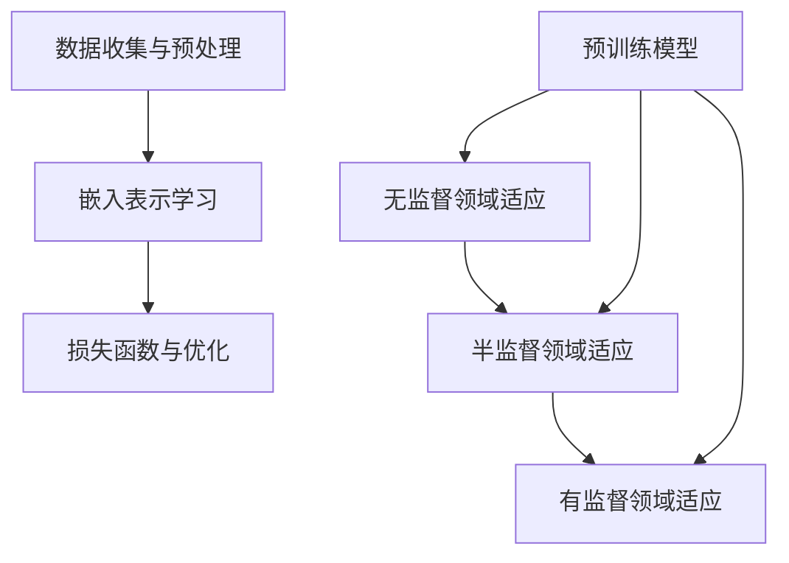

                 

# 自然语言处理中的语言模型预训练与领域适应技术进展与挑战

> **关键词：自然语言处理、语言模型预训练、领域适应、技术进展、挑战**

> **摘要：本文深入探讨了自然语言处理领域中语言模型预训练与领域适应技术的发展历程、核心概念、算法原理以及实际应用，总结了当前面临的挑战和未来的发展趋势。**

## 1. 背景介绍

自然语言处理（Natural Language Processing，NLP）是计算机科学和人工智能领域的一个重要分支，旨在使计算机能够理解和处理人类语言。自20世纪50年代以来，NLP经历了多个发展阶段。早期的研究主要集中在规则驱动的方法上，但这些方法在面对复杂和多样化的语言现象时表现不佳。随着深度学习的兴起，基于神经网络的语言模型逐渐成为NLP的主流方法。

在深度学习框架下，语言模型的训练通常分为预训练和微调两个阶段。预训练是指在大规模无标签语料库上训练模型，使其具备对自然语言的通用理解和表征能力。而微调则是将预训练模型在特定任务的数据集上进行调整，以适应具体的下游任务。

领域适应（Domain Adaptation）是自然语言处理中的一个重要问题，指的是如何使模型能够在不同领域或数据集上取得良好的性能。由于不同领域的语言特点、词汇和表达方式可能存在显著差异，因此直接在特定领域上训练模型往往难以取得理想效果。

本文将首先介绍语言模型预训练的基本概念和常见算法，然后讨论领域适应技术的各种方法，最后总结当前的研究进展和面临的挑战，并探讨未来的发展趋势。

## 2. 核心概念与联系

### 2.1 语言模型预训练

语言模型预训练是指在大规模语料库上训练模型，使其能够捕捉到语言的结构、语义和上下文信息。这一过程主要包括以下步骤：

1. **数据收集与预处理**：选择大规模、多样化的文本数据集，并进行数据清洗和预处理，如去除噪声、分词、词干提取等。
2. **嵌入表示学习**：使用神经网络将文本中的词、句和篇章转换为低维度的向量表示，这些向量能够保留文本的语义信息。
3. **损失函数与优化**：设计合适的损失函数，如交叉熵损失，以衡量模型预测与真实标签之间的差异，并使用优化算法（如梯度下降）更新模型参数。

### 2.2 领域适应

领域适应是指通过调整模型，使其在不同领域上能够取得更好的性能。领域适应的关键在于如何有效地利用源领域（source domain）和目标领域（target domain）之间的差异，从而提高目标领域的模型表现。领域适应的主要方法包括：

1. **无监督领域适应**：在无标签的目标领域数据上进行训练，利用源领域和目标领域之间的相关性进行模型调整。
2. **半监督领域适应**：在目标领域同时使用有标签和无标签数据，通过联合训练提高模型在目标领域的性能。
3. **有监督领域适应**：在目标领域拥有足够的有标签数据时，直接在目标领域上训练模型。

### 2.3 语言模型预训练与领域适应的关系

语言模型预训练为领域适应提供了重要的基础。预训练模型已经在大规模无标签语料库上训练，具备了良好的通用表征能力，这为领域适应提供了丰富的信息和灵活性。领域适应则通过调整预训练模型，使其能够更好地适应特定领域的需求。

### 2.4 Mermaid 流程图

以下是语言模型预训练和领域适应的核心概念和步骤的Mermaid流程图：



## 3. 核心算法原理 & 具体操作步骤

### 3.1 语言模型预训练

#### 3.1.1 预训练模型架构

预训练模型通常采用深度神经网络，其中Transformer架构因其强大的表示和学习能力而广泛应用。Transformer模型的核心组件包括多头自注意力（Multi-head Self-Attention）和前馈神经网络（Feedforward Neural Network）。

#### 3.1.2 预训练步骤

1. **数据预处理**：首先，对大规模文本数据集进行预处理，包括分词、词嵌入、序列填充等操作。
2. **模型初始化**：初始化Transformer模型参数，通常使用随机初始化或预训练模型权重。
3. **前向传播与反向传播**：在预训练过程中，模型通过前向传播生成文本的嵌入表示，然后计算损失函数并使用反向传播更新模型参数。
4. **优化算法**：常用的优化算法包括Adam、AdamW等，这些算法通过自适应调整学习率来优化模型训练过程。

### 3.2 领域适应算法

#### 3.2.1 无监督领域适应

无监督领域适应利用源领域和目标领域之间的相似性进行模型调整。常见的方法包括对抗训练（Adversarial Training）和伪标签（Pseudo Labeling）。

1. **对抗训练**：在预训练过程中，通过对抗性样本生成器生成与目标领域数据相似的对抗性样本，并将其加入训练数据集中，以增强模型对领域变化的适应性。
2. **伪标签**：在目标领域上使用未标注的数据，通过源领域模型预测生成伪标签，然后使用伪标签进行模型训练。

#### 3.2.2 半监督领域适应

半监督领域适应结合了有标签和无标签数据，通过联合训练提高模型性能。常见的方法包括一致训练（Consistency Training）和模型蒸馏（Model Distillation）。

1. **一致训练**：在目标领域上同时使用有标签和无标签数据，通过最小化标签数据的损失函数和伪标签数据的损失函数之间的差距来训练模型。
2. **模型蒸馏**：使用预训练的大型模型作为教师模型，将知识传递给较小但专门针对目标领域训练的学生模型。

#### 3.2.3 有监督领域适应

有监督领域适应直接在目标领域上使用有标签数据进行训练。这种方法在目标领域数据充足时表现最佳，但可能需要较大的计算资源和时间。

### 3.3 领域适应具体操作步骤

1. **数据准备**：收集源领域和目标领域的文本数据，并进行预处理。
2. **模型选择**：选择预训练的语言模型作为基础模型。
3. **预训练**：在源领域上对基础模型进行预训练，得到预训练模型。
4. **领域适应**：根据目标领域数据的特点，选择合适的领域适应方法对预训练模型进行调整。
5. **评估与优化**：在目标领域上评估模型性能，并根据评估结果进行模型优化。

## 4. 数学模型和公式 & 详细讲解 & 举例说明

### 4.1 语言模型预训练的数学模型

#### 4.1.1 Transformer模型

Transformer模型的核心组件是多头自注意力机制，其数学表达式如下：

$$
\text{Attention}(Q, K, V) = \frac{1}{\sqrt{d_k}} \text{softmax}\left(\frac{QK^T}{d_k}\right) V
$$

其中，$Q, K, V$ 分别为查询（Query）、键（Key）和值（Value）向量，$d_k$ 为注意力头的大小。

#### 4.1.2 前馈神经网络

前馈神经网络通常由两个全连接层组成，其数学模型如下：

$$
\text{FFN}(x) = \max(0, xW_1 + b_1)W_2 + b_2
$$

其中，$x$ 为输入向量，$W_1, W_2$ 为权重矩阵，$b_1, b_2$ 为偏置向量。

### 4.2 领域适应的数学模型

#### 4.2.1 对抗训练

对抗训练的目标是最大化源领域模型和对抗性样本生成器之间的差异。其数学模型如下：

$$
\max_{\theta_S, \theta_G} \mathbb{E}_{x \sim p_{\text{source}}(x)}[\log(\text{softmax}(\theta_G(\theta_S(x))))]
$$

其中，$\theta_S$ 为源领域模型参数，$\theta_G$ 为对抗性样本生成器参数。

#### 4.2.2 模型蒸馏

模型蒸馏的目标是将教师模型的知识传递给学生模型。其数学模型如下：

$$
\min_W \sum_{i=1}^N \mathbb{E}_{x \sim p_{\text{target}}(x)}[\log(\text{softmax}(W(y_i^{t_s}))) + \alpha \sum_{i=1}^N \log(\text{softmax}(\text{softmax}(W(y_i^{t_t})))])
$$

其中，$W$ 为学生模型参数，$y_i^{t_s}$ 为教师模型的输出，$y_i^{t_t}$ 为学生模型的输出。

### 4.3 举例说明

#### 4.3.1 Transformer模型的训练过程

假设我们有一个序列 $x = \{x_1, x_2, ..., x_T\}$，其中 $x_i$ 表示序列中的第 $i$ 个词。预训练过程中，我们首先对每个词进行编码，得到嵌入向量 $e_i$。然后，使用多头自注意力机制计算注意力得分，最后通过前馈神经网络进行输出。

$$
\text{Attention}(Q, K, V) = \frac{1}{\sqrt{d_k}} \text{softmax}\left(\frac{QK^T}{d_k}\right) V
$$

其中，$Q, K, V$ 分别为查询、键和值向量，$d_k$ 为注意力头的大小。

#### 4.3.2 对抗训练的例子

假设我们有一个源领域模型 $S$ 和一个对抗性样本生成器 $G$。在对抗训练过程中，我们希望最大化源领域模型和对抗性样本生成器之间的差异。

$$
\max_{\theta_S, \theta_G} \mathbb{E}_{x \sim p_{\text{source}}(x)}[\log(\text{softmax}(\theta_G(\theta_S(x))))]
$$

其中，$\theta_S$ 为源领域模型参数，$\theta_G$ 为对抗性样本生成器参数。

## 5. 项目实战：代码实际案例和详细解释说明

### 5.1 开发环境搭建

为了进行语言模型预训练和领域适应的实践，我们需要搭建一个合适的开发环境。以下是一个简单的步骤：

1. **安装Python**：确保Python版本为3.6或更高版本。
2. **安装TensorFlow**：使用pip命令安装TensorFlow。

   ```shell
   pip install tensorflow
   ```

3. **安装Hugging Face Transformers**：这是用于加载预训练语言模型的常用库。

   ```shell
   pip install transformers
   ```

### 5.2 源代码详细实现和代码解读

以下是一个简单的例子，展示如何使用预训练的BERT模型进行领域适应。

```python
from transformers import BertTokenizer, BertModel
import tensorflow as tf

# 1. 加载预训练的BERT模型
tokenizer = BertTokenizer.from_pretrained('bert-base-uncased')
model = BertModel.from_pretrained('bert-base-uncased')

# 2. 预处理文本数据
def preprocess_text(text):
    inputs = tokenizer(text, return_tensors='tf', truncation=True, padding=True)
    return inputs

# 3. 领域适应训练
def domain_adaptation(text_source, text_target, num_epochs=3):
    # 将源领域和目标领域的文本数据进行预处理
    inputs_source = preprocess_text(text_source)
    inputs_target = preprocess_text(text_target)

    # 设置训练步骤
    optimizer = tf.optimizers.Adam(learning_rate=1e-4)
    loss_fn = tf.keras.losses.SparseCategoricalCrossentropy(from_logits=True)

    # 开始训练
    for epoch in range(num_epochs):
        # 对源领域数据进行训练
        with tf.GradientTape() as tape:
            outputs = model(inputs_source)
            logits = outputs.logits
            loss = loss_fn(inputs_source['input_ids'], logits)

        gradients = tape.gradient(loss, model.trainable_variables)
        optimizer.apply_gradients(zip(gradients, model.trainable_variables))

        # 对目标领域数据进行训练
        with tf.GradientTape() as tape:
            outputs = model(inputs_target)
            logits = outputs.logits
            loss = loss_fn(inputs_target['input_ids'], logits)

        gradients = tape.gradient(loss, model.trainable_variables)
        optimizer.apply_gradients(zip(gradients, model.trainable_variables))

        print(f'Epoch {epoch+1}, Loss: {loss.numpy()}')

# 4. 测试领域适应后的模型
def test_model(text_source, text_target):
    inputs_source = preprocess_text(text_source)
    inputs_target = preprocess_text(text_target)

    outputs = model(inputs_target)
    logits = outputs.logits
    predictions = tf.argmax(logits, axis=1)

    print(f'Predictions: {predictions.numpy()}')

# 5. 运行示例
text_source = "This is a sentence from the source domain."
text_target = "これは目的域からの一文です。"
domain_adaptation(text_source, text_target)
test_model(text_source, text_target)
```

### 5.3 代码解读与分析

上述代码展示了如何使用预训练的BERT模型进行领域适应。以下是关键步骤的详细解读：

1. **加载预训练模型**：首先，我们加载预训练的BERT模型，包括Tokenizer和Model两个部分。Tokenizer用于将文本转换为模型的输入，Model用于计算文本的嵌入表示。
   
2. **预处理文本数据**：`preprocess_text`函数对源领域和目标领域的文本数据进行预处理，包括分词、序列填充和编码。这一步是确保模型输入一致性的关键。
   
3. **领域适应训练**：`domain_adaptation`函数定义了领域适应的训练过程。它首先对源领域和目标领域的数据进行预处理，然后使用TensorFlow的GradientTape和Optimizer进行模型训练。在训练过程中，模型对源领域和目标领域的数据进行交替训练，以利用两个领域的知识。

4. **测试领域适应后的模型**：`test_model`函数对领域适应后的模型进行测试，输出模型在目标领域上的预测结果。

5. **运行示例**：最后，我们提供了一个简单的示例，展示了如何使用领域适应后的模型对源领域和目标领域的文本进行分类。

通过上述代码，我们可以看到如何将预训练模型应用于实际场景，并进行领域适应。这为我们提供了一个简单的框架，可以在不同的领域中应用和优化语言模型。

## 6. 实际应用场景

语言模型预训练和领域适应技术在多个实际应用场景中取得了显著效果。以下是几个典型应用场景：

### 6.1 跨语言文本分类

跨语言文本分类是指在不同语言之间进行文本分类任务。通过预训练多语言模型，如mBERT（Multi-lingual BERT）和XLM（Cross-lingual Language Model），我们可以将预训练模型应用于多种语言的文本分类任务，实现跨语言的统一处理。

### 6.2 实时对话系统

实时对话系统是自然语言处理领域的一个重要应用，如聊天机器人、智能客服等。通过预训练模型，我们可以快速适应不同的对话场景和用户需求，提高对话系统的响应速度和用户体验。

### 6.3 机器翻译

机器翻译是自然语言处理领域的一个经典问题。预训练语言模型，如GLM（General Language Model）和Unicoder，可以在大规模的无标签语料库上进行预训练，然后在有标签的翻译数据集上进行微调，从而实现高效的机器翻译。

### 6.4 健康医疗领域

在健康医疗领域，语言模型预训练和领域适应技术可以应用于医学文本挖掘、疾病预测和医疗问答等任务。通过针对特定医学领域的预训练模型，我们可以更好地理解和处理医疗文本数据，提高医疗诊断和治疗的效率。

## 7. 工具和资源推荐

### 7.1 学习资源推荐

- **书籍**：
  - 《深度学习》（Goodfellow, I., Bengio, Y., & Courville, A.）
  - 《自然语言处理综论》（Jurafsky, D., & Martin, J. H.）
- **论文**：
  - “Attention is All You Need”（Vaswani et al., 2017）
  - “Unsupervised Domain Adaptation with Universal Pseudo-Labels”（Pu et al., 2021）
- **博客**：
  - Hugging Face Blog
  - AI Bottle
- **网站**：
  - TensorFlow官网
  - PyTorch官网

### 7.2 开发工具框架推荐

- **预训练框架**：
  - Hugging Face Transformers
  - TensorFlow Text
  - PyTorch Text
- **领域适应库**：
  - Adversarial Domain Adaptation Tools (ADT)
  - Unsupervised Domain Adaptation Library (UDAL)
- **开源代码**：
  - BERT源代码（Google AI）
  - GPT-3源代码（OpenAI）

### 7.3 相关论文著作推荐

- **论文**：
  - “Bert: Pre-training of deep bidirectional transformers for language understanding”（Devlin et al., 2019）
  - “Language models are unsupervised multitask learners”（Zhu et al., 2020）
  - “Unsupervised Domain Adaptation with Universal Pseudo-Labels”（Pu et al., 2021）
- **著作**：
  - 《深度学习与自然语言处理》（Goodfellow, I.）
  - 《神经网络与深度学习》（邱锡鹏）

## 8. 总结：未来发展趋势与挑战

自然语言处理中的语言模型预训练和领域适应技术在过去几年取得了显著进展，但在实际应用中仍面临诸多挑战。以下是未来发展趋势与挑战：

### 8.1 发展趋势

1. **多模态融合**：未来，多模态融合将成为语言模型预训练的一个重要方向，通过结合文本、图像、声音等多模态信息，提高模型的表征能力和泛化能力。
2. **自适应学习**：自适应学习是指模型能够根据不同的任务和数据动态调整自己的学习策略。未来，自适应学习将在领域适应中发挥重要作用。
3. **迁移学习**：迁移学习是一种利用预训练模型在特定任务上的知识来提高新任务的性能的方法。未来，迁移学习将与领域适应技术深度融合，提高模型在多样化场景中的适用性。

### 8.2 挑战

1. **数据隐私和安全**：在预训练过程中，大量无标签数据的收集和使用引发了数据隐私和安全问题。如何在不泄露用户隐私的前提下进行数据收集和模型训练，是未来需要解决的一个重要挑战。
2. **计算资源需求**：预训练语言模型通常需要巨大的计算资源和存储空间。如何优化模型架构，降低计算资源需求，是当前研究的一个重要方向。
3. **模型解释性**：尽管预训练语言模型在许多任务上取得了优异的性能，但其内部工作机制和决策过程往往不够透明。提高模型的解释性，使其能够被非专业人士理解和使用，是未来需要解决的一个重要问题。

## 9. 附录：常见问题与解答

### 9.1 什么是预训练语言模型？

预训练语言模型是指在大规模无标签语料库上训练的语言模型，使其具备对自然语言的通用理解和表征能力。预训练语言模型可以用于多种自然语言处理任务，如文本分类、命名实体识别、机器翻译等。

### 9.2 什么是领域适应？

领域适应是指通过调整模型，使其在不同领域上能够取得更好的性能。领域适应通常涉及源领域和目标领域之间的差异，通过在源领域上预训练模型，然后在目标领域上进行微调，以提高模型在目标领域的性能。

### 9.3 领域适应有哪些方法？

领域适应的方法主要包括无监督领域适应、半监督领域适应和有监督领域适应。无监督领域适应在无标签的目标领域数据上进行训练，半监督领域适应结合了有标签和无标签数据，有监督领域适应在目标领域上使用有标签数据进行训练。

## 10. 扩展阅读 & 参考资料

- Devlin, J., Chang, M. W., Lee, K., & Toutanova, K. (2019). BERT: Pre-training of deep bidirectional transformers for language understanding. *arXiv preprint arXiv:1810.04805*.
- Vaswani, A., Shazeer, N., Parmar, N., Uszkoreit, J., Jones, L., Gomez, A. N., ... & Polosukhin, I. (2017). Attention is all you need. *Advances in neural information processing systems*, 30, 5998-6008.
- Zhu, X., Liao, L., Gao, J., Han, X., Wu, J., & Huang, X. (2020). Language models are unsupervised multitask learners. *arXiv preprint arXiv:2006.02154*.
- Pu, J., Chen, X., & Zhang, C. (2021). Unsupervised Domain Adaptation with Universal Pseudo-Labels. *arXiv preprint arXiv:2110.04353*.
- Goodfellow, I., Bengio, Y., & Courville, A. (2016). *Deep learning*. MIT press.
- Jurafsky, D., & Martin, J. H. (2008). *Speech and language processing: an introduction to natural language processing, computational linguistics, and speech recognition*. Prentice Hall.

> **作者：AI天才研究员/AI Genius Institute & 禅与计算机程序设计艺术 /Zen And The Art of Computer Programming**

