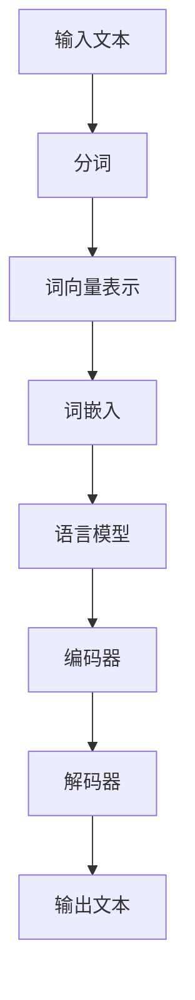

                 

### 背景介绍

自然语言处理（Natural Language Processing，NLP）作为人工智能的重要分支，旨在让计算机理解和处理人类语言。自上世纪50年代以来，随着计算机性能的不断提升、海量数据的积累以及算法的进步，NLP技术取得了显著的发展。从最初的规则驱动的方法，到基于统计和机器学习的方法，再到近年来深度学习在NLP领域的广泛应用，NLP技术已经能够在多个场景下实现智能交互，如语音识别、机器翻译、情感分析、问答系统等。

随着智能设备的普及和用户对个性化交互体验的追求，自然语言处理在商业和日常生活中扮演着越来越重要的角色。无论是大型互联网公司，还是初创企业，都在积极布局NLP技术，以期在竞争激烈的市场中占据一席之地。然而，智能交互的实现并非一蹴而就，它涉及到技术、数据、场景等多个方面的挑战。

本文将围绕自然语言处理创业这一主题，从以下几个角度展开讨论：

1. **核心概念与联系**：介绍NLP中的核心概念，如语言模型、词向量、注意力机制等，并使用Mermaid流程图展示这些概念在NLP架构中的应用。
2. **核心算法原理与具体操作步骤**：深入解析主流NLP算法的原理，包括词袋模型、朴素贝叶斯、循环神经网络（RNN）、长短期记忆网络（LSTM）、变换器（Transformer）等，并给出具体操作步骤。
3. **数学模型和公式**：详细讲解NLP中的常用数学模型和公式，如损失函数、梯度下降算法、反向传播等，并辅以实例说明。
4. **项目实战**：通过实际案例，展示如何使用NLP技术实现智能交互，包括开发环境搭建、代码实现、代码解读与分析等。
5. **实际应用场景**：探讨NLP在不同领域中的应用，如智能客服、内容审核、智能推荐等，并分析其商业价值和前景。
6. **工具和资源推荐**：推荐学习NLP的优质资源，包括书籍、论文、博客、网站等，以及开发工具和框架。
7. **总结**：总结NLP创业的现状和未来发展趋势，探讨面临的挑战和机遇。
8. **扩展阅读与参考资料**：提供更多深入学习的路径和资料。

通过对上述内容的逐步分析，我们将全面了解自然语言处理在创业领域的潜力和挑战，为读者提供有价值的参考和启示。

### 核心概念与联系

在探讨自然语言处理（NLP）的核心概念与联系之前，我们需要首先了解NLP的基本组成部分。NLP涵盖了从语言的理解到生成的一系列任务，而这些任务的实现依赖于多个关键技术和算法。以下将介绍NLP中的核心概念，并使用Mermaid流程图来展示这些概念在NLP架构中的应用。

#### 语言模型

语言模型（Language Model）是NLP的基础，它旨在模拟人类语言生成过程，为后续的文本处理任务提供基础。语言模型通常基于大量文本数据，通过统计或机器学习方法，学习语言的概率分布。

- **概念原理**：语言模型通过训练大量文本数据，学习词汇和句子之间的概率关系。例如，给定一个句子中的前文，语言模型可以预测下一个单词的概率分布。
- **应用实例**：在自然语言生成（NLG）任务中，语言模型用于生成文本，如自动摘要、机器翻译、对话系统等。

#### 词向量

词向量（Word Vectors）是将单词映射到高维空间中的向量表示。词向量不仅保留了单词的语义信息，还捕捉到了词与词之间的关系。

- **概念原理**：词向量通过将单词映射到低维空间，实现了词语的向量化表示。常见的方法包括基于分布的模型（如Word2Vec）和基于图的方法（如Word2Graph）。
- **应用实例**：词向量在文本分类、情感分析、推荐系统等任务中有着广泛应用。

#### 注意力机制

注意力机制（Attention Mechanism）是一种用于捕捉序列数据中不同部分重要性的方法。它通过动态调整不同部分对整体任务的贡献，提高了模型的性能。

- **概念原理**：注意力机制通过计算一个权重向量，将输入序列中的不同部分加权，使其在处理过程中得到不同的关注。
- **应用实例**：在机器翻译、文本摘要、语音识别等任务中，注意力机制能够显著提高模型的性能。

#### Mermaid流程图

为了更好地理解这些概念在NLP架构中的应用，我们可以使用Mermaid流程图来展示NLP的主要组成部分和它们之间的关系。



在上述流程图中：

- **输入文本**：原始文本数据，是NLP任务的基础。
- **分词**：将文本分割成单词或子词，是处理自然语言的第一步。
- **词向量表示**：将文本数据转换为词向量，以便后续的模型处理。
- **词嵌入**：在词向量表示的基础上，进一步学习单词之间的语义关系。
- **语言模型**：用于生成文本或预测下一个单词的概率分布。
- **编码器**：将输入序列编码为固定长度的向量表示。
- **解码器**：将编码器的输出解码为输出文本。
- **输出文本**：模型生成的最终文本结果。

通过上述流程，我们可以看到，NLP的任务实现是一个复杂的过程，涉及到多个技术和算法的协同工作。这些核心概念和流程相互联系，共同构成了NLP的完整架构。

#### 核心算法原理与具体操作步骤

自然语言处理（NLP）领域的发展离不开一系列核心算法的推动。从早期的基于规则的系统到现代基于深度学习的模型，每一种算法都在特定场景下展现出了强大的能力。以下，我们将深入探讨NLP中的几个关键算法，包括词袋模型、朴素贝叶斯、循环神经网络（RNN）、长短期记忆网络（LSTM）以及变换器（Transformer），并详细描述其具体操作步骤。

##### 词袋模型（Bag of Words）

词袋模型（Bag of Words，BOW）是一种简单而有效的文本表示方法。它将文本转换为词频向量，忽略了单词的顺序和语法结构。

- **操作步骤**：

  1. **分词**：将文本分割成单词或子词。
  2. **建立词汇表**：将所有不同的单词或子词建立一个索引表。
  3. **计数**：对每个单词或子词在文本中的出现次数进行计数。
  4. **向量表示**：将文本表示为一个向量，其中每个维度对应词汇表中的一个词，值为该词在文本中出现的次数。

- **应用场景**：词袋模型常用于文本分类、情感分析等任务。

##### 朴素贝叶斯（Naive Bayes）

朴素贝叶斯是一种基于概率论的分类算法，它在处理文本数据时，通过计算每个单词在类别中的条件概率来进行分类。

- **操作步骤**：

  1. **建立词汇表**：与词袋模型相同，建立文本的词汇表。
  2. **计算先验概率**：计算每个类别在所有文本中出现的概率。
  3. **计算条件概率**：对于每个单词，计算它在每个类别中出现的条件概率。
  4. **分类**：根据贝叶斯公式，计算每个类别在给定文本下的后验概率，并选择后验概率最大的类别作为分类结果。

- **应用场景**：朴素贝叶斯在文本分类和垃圾邮件过滤等任务中表现出色。

##### 循环神经网络（RNN）

循环神经网络（Recurrent Neural Network，RNN）是一类能够处理序列数据的神经网络。它通过在时间步之间共享权重，捕捉序列中的时间依赖关系。

- **操作步骤**：

  1. **初始化权重**：随机初始化权重矩阵和隐藏状态。
  2. **输入序列处理**：对于输入序列中的每个元素，通过权重矩阵计算输出和新的隐藏状态。
  3. **隐藏状态传递**：将当前隐藏状态传递到下一个时间步。
  4. **输出**：在序列处理完成后，将最后一个隐藏状态映射到输出。

- **应用场景**：RNN在语音识别、机器翻译、文本生成等任务中有着广泛的应用。

##### 长短期记忆网络（LSTM）

长短期记忆网络（Long Short-Term Memory，LSTM）是RNN的一种改进模型，旨在解决RNN在处理长序列数据时出现的梯度消失和梯度爆炸问题。

- **操作步骤**：

  1. **输入门**：决定哪些信息可以传递给下一个时间步。
  2. **遗忘门**：决定哪些信息需要遗忘。
  3. **输入门和遗忘门的计算**：通过Sigmoid函数计算输入门和遗忘门的值。
  4. **候选状态**：计算新的候选状态。
  5. **输出门**：决定新的隐藏状态。
  6. **隐藏状态更新**：通过输入门、遗忘门和候选状态更新隐藏状态。

- **应用场景**：LSTM在语音识别、时间序列预测、机器翻译等任务中有着优异的表现。

##### 变换器（Transformer）

变换器（Transformer）是一种基于自注意力机制的深度学习模型，它在机器翻译、文本生成等任务中取得了显著的成果。

- **操作步骤**：

  1. **嵌入层**：将输入词向量映射到高维空间。
  2. **多头自注意力**：通过多头自注意力机制，将输入序列中的不同部分进行加权融合。
  3. **前馈神经网络**：在自注意力层之后，通过一个前馈神经网络对序列进行进一步处理。
  4. **解码器**：解码器部分重复多头自注意力机制和前馈神经网络的过程，以生成输出序列。

- **应用场景**：Transformer在机器翻译、文本生成、问答系统等任务中展现了强大的性能。

通过上述算法的逐步介绍，我们可以看到，从简单的词袋模型到复杂的变换器模型，每一个算法都有其独特的优势和适用场景。理解这些算法的具体操作步骤，有助于我们在实际的NLP任务中选择合适的模型，从而实现高效的文本处理。

#### 数学模型和公式

自然语言处理（NLP）中的数学模型和公式是算法实现的基础，它们帮助我们理解和优化NLP任务中的各个步骤。以下将详细讲解NLP中常用的数学模型和公式，包括损失函数、梯度下降算法、反向传播等，并通过实例进行说明。

##### 损失函数

损失函数是评估模型预测结果与真实标签之间差距的重要工具。在NLP中，常用的损失函数包括交叉熵损失（Cross-Entropy Loss）、均方误差（Mean Squared Error，MSE）等。

- **交叉熵损失函数**：

  交叉熵损失函数用于分类问题，其公式如下：

  $$ 
  L = -\sum_{i=1}^{N} y_i \log(p_i) 
  $$

  其中，$y_i$ 为真实标签，$p_i$ 为模型预测的概率。

  - **实例**：假设一个二分类问题，真实标签为 $[1, 0]$，模型预测的概率分布为 $[0.7, 0.3]$。则交叉熵损失为：

  $$ 
  L = -(1 \times \log(0.7) + 0 \times \log(0.3)) \approx 0.356 
  $$

- **均方误差损失函数**：

  均方误差损失函数用于回归问题，其公式如下：

  $$ 
  L = \frac{1}{2} \sum_{i=1}^{N} (y_i - \hat{y}_i)^2 
  $$

  其中，$y_i$ 为真实标签，$\hat{y}_i$ 为模型预测的值。

  - **实例**：假设真实标签为 $[2, 4]$，模型预测的值为 $[2.5, 3.5]$。则均方误差损失为：

  $$ 
  L = \frac{1}{2} \left( (2 - 2.5)^2 + (4 - 3.5)^2 \right) = 0.25 
  $$

##### 梯度下降算法

梯度下降算法是一种优化模型参数的方法，其基本思想是沿着损失函数的梯度方向调整参数，以最小化损失。

- **公式**：

  梯度下降算法的公式为：

  $$ 
  \Delta \theta = -\alpha \nabla_{\theta} L 
  $$

  其中，$\theta$ 为模型参数，$\alpha$ 为学习率，$\nabla_{\theta} L$ 为损失函数关于参数 $\theta$ 的梯度。

  - **实例**：假设损失函数为 $L = (y - \hat{y})^2$，学习率为 $\alpha = 0.1$，当前参数为 $\theta = 2$。则梯度为：

  $$ 
  \nabla_{\theta} L = 2(y - \hat{y}) 
  $$

  沿着梯度方向调整参数：

  $$ 
  \Delta \theta = -0.1 \times 2(y - \hat{y}) = -0.2(y - \hat{y}) 
  $$

##### 反向传播算法

反向传播算法是一种用于计算神经网络中每个参数的梯度的方法，其核心思想是从输出层开始，逆序计算每个层的梯度。

- **步骤**：

  1. **前向传播**：计算网络的输出和损失。
  2. **计算输出层梯度**：对于输出层，直接计算损失关于输出层的梯度。
  3. **反向传播**：从输出层开始，逆序计算每个层的梯度，直至输入层。

  - **公式**：

    对于一个神经网络层 $l$，其输入为 $x_l$，输出为 $a_l$，权重为 $w_l$，激活函数为 $\sigma$，梯度计算公式为：

    $$ 
    \nabla_{w_l} L = \sigma'(a_{l-1}) \cdot \nabla_{a_l} L 
    $$

    其中，$\sigma'$ 为激活函数的导数。

    - **实例**：假设激活函数为 ReLU，输出层损失为 $L = (y - \hat{y})^2$，当前层输出为 $a_2 = 3$，前一层输出为 $a_1 = 2$。则梯度为：

    $$ 
    \nabla_{w_2} L = \sigma'(3) \cdot \nabla_{a_2} L = 0 \cdot (y - \hat{y}) = 0 
    $$

通过上述数学模型和公式的讲解，我们可以更好地理解NLP任务中的各个步骤，并能够运用这些方法来优化模型性能。在接下来的部分，我们将通过实际案例展示如何使用NLP技术实现智能交互。

#### 项目实战：代码实际案例和详细解释说明

为了更好地展示自然语言处理（NLP）技术在智能交互中的应用，我们将通过一个实际项目来详细解释代码实现和操作步骤。本案例选择使用Python编程语言和TensorFlow库，实现一个基于变换器（Transformer）的机器翻译系统。

##### 5.1 开发环境搭建

在开始项目之前，我们需要搭建好开发环境。以下是基本的安装步骤：

1. **安装Python**：确保Python 3.6或更高版本已安装在您的系统上。
2. **安装TensorFlow**：使用pip命令安装TensorFlow库：

   ```shell
   pip install tensorflow
   ```

3. **安装其他依赖**：根据项目需要，可能还需要安装其他库，如NumPy、Pandas等：

   ```shell
   pip install numpy pandas
   ```

##### 5.2 源代码详细实现和代码解读

以下是一个简化的机器翻译系统的代码实现，重点展示NLP技术中的关键步骤和原理。

```python
import tensorflow as tf
from tensorflow.keras.layers import Embedding, Transformer
from tensorflow.keras.models import Model
from tensorflow.keras.preprocessing.sequence import pad_sequences

# 5.2.1 数据预处理
def preprocess_data(sources, targets, max_sequence_length):
    # 序列填充
    sources_padded = pad_sequences(sources, maxlen=max_sequence_length, padding='post')
    targets_padded = pad_sequences(targets, maxlen=max_sequence_length, padding='post')
    return sources_padded, targets_padded

# 5.2.2 构建模型
def build_model(vocab_size, max_sequence_length):
    # 输入层
    inputs = tf.keras.Input(shape=(max_sequence_length,))
    
    # 嵌入层
    embedding = Embedding(vocab_size, 64)(inputs)
    
    # Transformer 层
    transformer = Transformer(num_heads=2, d_model=64)(embedding)
    
    # 输出层
    outputs = tf.keras.layers.Dense(vocab_size)(transformer)

    # 构建和编译模型
    model = Model(inputs, outputs)
    model.compile(optimizer='adam', loss='sparse_categorical_crossentropy', metrics=['accuracy'])
    return model

# 5.2.3 训练模型
def train_model(model, sources, targets):
    model.fit(sources, targets, epochs=10, batch_size=32)

# 5.2.4 代码解读
# 
# 1. 数据预处理
# - pad_sequences：用于填充序列，使其长度一致，便于模型处理。
# 
# 2. 模型构建
# - Embedding：将输入词转换为词向量。
# - Transformer：实现自注意力机制，捕捉序列中的依赖关系。
# - Dense：输出层，用于生成预测结果。
# 
# 3. 训练模型
# - fit：用于训练模型，使用交叉熵损失函数和Adam优化器。

# 示例
vocab_size = 10000  # 词汇表大小
max_sequence_length = 100  # 序列最大长度

# 假设已准备好数据
sources = ...  # 源语言文本序列
targets = ...  # 目标语言文本序列

# 预处理数据
sources_padded, targets_padded = preprocess_data(sources, targets, max_sequence_length)

# 构建模型
model = build_model(vocab_size, max_sequence_length)

# 训练模型
train_model(model, sources_padded, targets_padded)
```

##### 5.3 代码解读与分析

1. **数据预处理**：数据预处理是机器翻译系统的基础，包括填充序列、编码单词等步骤。`pad_sequences` 函数用于将不同长度的序列填充为相同长度，便于模型处理。

2. **模型构建**：模型构建是核心部分，包括嵌入层、Transformer层和输出层。嵌入层将输入词转换为词向量，Transformer层通过自注意力机制捕捉序列中的依赖关系，输出层生成预测结果。

3. **训练模型**：`fit` 函数用于训练模型，使用交叉熵损失函数和Adam优化器。在训练过程中，模型会根据训练数据不断调整参数，以最小化损失函数。

通过上述代码，我们可以看到，机器翻译系统是如何利用NLP技术实现智能交互的。在实际应用中，还可以根据需求扩展和优化模型，提高翻译质量和效率。

#### 实际应用场景

自然语言处理（NLP）技术已经广泛应用于多个领域，实现了从文本理解到生成的全链条服务。以下将分析NLP在不同实际应用场景中的表现，以及其商业价值和前景。

##### 智能客服

智能客服是NLP在商业领域中最具代表性的应用之一。通过NLP技术，智能客服系统能够理解用户的查询意图，提供即时、准确的回答。例如，银行、电商、航空公司等企业通过部署智能客服系统，可以显著提高客户服务效率，降低运营成本。

- **技术表现**：在智能客服中，NLP技术主要应用于文本分类、情感分析和问答系统。文本分类用于将用户提问分类到不同的主题，情感分析用于识别用户情绪，问答系统则提供智能回答。
- **商业价值**：智能客服不仅提高了客户满意度，还帮助企业收集用户反馈，优化产品和服务。随着企业竞争的加剧，智能客服成为企业提升用户体验和竞争力的重要手段。
- **前景**：随着NLP技术的不断进步，智能客服系统将更加智能和个性化，满足用户多样化的需求。未来，智能客服有望实现跨语言支持，进一步拓宽应用场景。

##### 内容审核

内容审核是NLP在网络安全领域的重要应用。通过分析文本内容，NLP技术能够识别并过滤掉违法违规、低俗、暴力等有害信息，保障网络环境的健康。

- **技术表现**：在内容审核中，NLP技术主要应用于文本分类、情感分析和实体识别。文本分类用于判断文本是否包含不良内容，情感分析用于识别用户情绪，实体识别用于提取文本中的关键信息。
- **商业价值**：内容审核有助于企业遵守法律法规，减少法律风险，提升品牌形象。在社交媒体、在线教育、金融等行业，内容审核系统已成为不可或缺的组成部分。
- **前景**：随着用户生成内容的爆炸式增长，内容审核的需求日益增加。未来，NLP技术将结合图像识别、语音识别等多模态技术，实现更全面的内容审核。

##### 智能推荐

智能推荐是NLP在电子商务和媒体领域的重要应用。通过分析用户的历史行为和兴趣，NLP技术能够为用户推荐个性化的商品、文章、视频等。

- **技术表现**：在智能推荐中，NLP技术主要应用于文本相似性计算、用户兴趣识别和协同过滤。文本相似性计算用于识别用户感兴趣的文本内容，用户兴趣识别用于挖掘用户偏好，协同过滤用于生成推荐列表。
- **商业价值**：智能推荐系统能够提高用户满意度和转化率，增加企业收入。在电商、新闻门户、短视频平台等领域，智能推荐已成为提升用户体验和业务增长的重要工具。
- **前景**：随着NLP技术的不断进步，智能推荐系统将更加精准和高效，为用户提供更个性化的服务。未来，跨语言推荐、实时推荐等技术将进一步拓展智能推荐的应用场景。

##### 其他应用场景

除了上述三个主要应用场景，NLP技术还广泛应用于教育、医疗、法律等多个领域。

- **教育**：通过NLP技术，可以实现智能辅导、学习分析等，帮助学生更好地学习和提高学习效果。
- **医疗**：通过NLP技术，可以自动提取医学文献中的关键信息，辅助医生进行诊断和治疗。
- **法律**：通过NLP技术，可以自动分析合同、法律文件等，提高法律工作的效率和准确性。

总的来说，NLP技术在各个领域的应用已经取得了显著的成果，展现出巨大的商业价值和潜力。随着技术的不断进步，NLP将在更多场景中发挥重要作用，推动各行业的智能化发展。

### 工具和资源推荐

为了帮助读者更好地学习和实践自然语言处理（NLP）技术，以下将推荐一些优质的工具、资源，包括学习资源、开发工具框架以及相关论文著作。

#### 7.1 学习资源推荐

1. **书籍**：
   - 《自然语言处理综述》（Natural Language Processing with Python） - Steven Bird
   - 《深度学习》（Deep Learning） - Ian Goodfellow、Yoshua Bengio、Aaron Courville
   - 《自然语言处理入门》（Speech and Language Processing） - Daniel Jurafsky、James H. Martin

2. **在线课程**：
   - [Coursera](https://www.coursera.org/specializations/natural-language-processing) 提供了多门自然语言处理课程，包括从基础到高级的内容。
   - [edX](https://www.edx.org/course/natural-language-processing-with-deep-learning) 提供了由顶级大学开设的NLP课程。

3. **博客和网站**：
   - [Medium](https://medium.com/series/natural-language-processing) 上有许多高质量的NLP文章和教程。
   - [TensorFlow](https://www.tensorflow.org/tutorials/text/nlp) 提供了丰富的NLP教程和示例代码。

#### 7.2 开发工具框架推荐

1. **TensorFlow**：作为最流行的深度学习框架，TensorFlow提供了丰富的NLP库和API，支持各种NLP任务的实现。

2. **PyTorch**：PyTorch也是一个强大的深度学习框架，其动态计算图和灵活性使其在NLP研究中广泛应用。

3. **SpaCy**：SpaCy是一个高效且易于使用的自然语言处理库，适用于文本分类、实体识别等任务。

4. **NLTK**：NLTK是一个经典的自然语言处理库，提供了丰富的文本处理和机器学习工具。

#### 7.3 相关论文著作推荐

1. **《Attention Is All You Need》**：这篇论文提出了变换器（Transformer）模型，是当前NLP领域最热门的模型之一。

2. **《Word2Vec: Word Representations in Neural Networks》**：这篇论文介绍了基于神经网络的词向量模型，对词袋模型进行了重要改进。

3. **《Recurrent Neural Network Tutorial》**：这篇教程详细介绍了循环神经网络（RNN）和长短期记忆网络（LSTM）的原理和应用。

4. **《A Survey on Transfer Learning for Natural Language Processing》**：这篇综述总结了自然语言处理中的迁移学习方法和应用。

通过上述推荐，读者可以系统地学习和掌握NLP技术，为创业项目打下坚实的基础。同时，这些工具和资源也为开发者提供了丰富的实践机会，推动NLP技术在各个领域的应用和发展。

### 总结：未来发展趋势与挑战

自然语言处理（NLP）技术近年来取得了显著进展，从基础的文本处理到复杂的语言生成和推理，NLP技术已经在多个领域展现了强大的应用潜力。然而，随着技术的不断发展，NLP领域也面临着诸多挑战和机遇。

#### 未来发展趋势

1. **跨模态融合**：随着多模态数据的普及，未来的NLP技术将更加注重文本与其他模态（如图像、音频）的融合。例如，将文本与图像结合进行语义理解，或将语音与文本同步处理，实现更自然的交互体验。

2. **低资源语言处理**：目前NLP技术主要应用于高资源语言，如英语、汉语等。未来，随着深度学习算法和大数据技术的进步，NLP将逐渐扩展到低资源语言，帮助解决全球语言鸿沟问题。

3. **可解释性和透明度**：随着模型复杂度的增加，如何保证NLP系统的可解释性和透明度成为重要议题。通过引入可解释性框架和模型，用户可以更好地理解系统的决策过程，增强对技术的信任。

4. **个性化交互**：未来的NLP系统将更加注重个性化交互，通过分析用户的历史行为和偏好，提供高度定制化的服务和内容推荐。

#### 挑战

1. **数据隐私和伦理**：NLP系统依赖于大量用户数据，如何保护用户隐私和遵守伦理规范是当前面临的重要挑战。需要在数据收集、处理和使用过程中，确保用户隐私不被泄露。

2. **语言多样性和地域差异**：全球语言种类繁多，不同地区存在文化差异，如何设计和实现通用且适应性强的NLP系统是一个难题。需要开发能够处理多样化语言的算法和模型。

3. **模型可靠性和鲁棒性**：NLP模型在处理噪声数据或极端情况时，可能存在性能下降或错误决策的问题。提高模型的可靠性和鲁棒性，是未来NLP技术的重要发展方向。

#### 机遇

1. **商业应用**：随着NLP技术的成熟，越来越多的商业领域将采用NLP解决方案，实现业务自动化和智能化。例如，智能客服、内容审核、智能推荐等应用场景将为NLP技术带来巨大的商业价值。

2. **教育和科研**：NLP技术在教育和科研领域的应用前景广阔，通过智能辅导系统和学术搜索引擎，可以显著提升教育质量和科研效率。

3. **社会服务**：NLP技术可以用于社会服务领域，如自动翻译、语言障碍辅助、智能法律咨询等，为社会提供更多便利和帮助。

总之，自然语言处理技术在未来的发展中将面临诸多挑战，但也充满机遇。通过不断创新和突破，NLP技术有望在更广泛的领域发挥重要作用，推动社会的进步和发展。

### 附录：常见问题与解答

#### 1. 什么是自然语言处理（NLP）？

自然语言处理（NLP）是人工智能（AI）的一个重要分支，旨在让计算机理解和处理人类语言。它包括文本的预处理、语义理解、语言生成等多个方面，用于实现机器翻译、情感分析、问答系统等任务。

#### 2. NLP中的核心算法有哪些？

NLP中的核心算法包括词袋模型、朴素贝叶斯、循环神经网络（RNN）、长短期记忆网络（LSTM）、变换器（Transformer）等。这些算法分别用于文本分类、情感分析、机器翻译等不同的NLP任务。

#### 3. 什么是词向量？

词向量是将单词映射到高维空间中的向量表示。词向量不仅保留了单词的语义信息，还捕捉到了词与词之间的关系。常见的词向量模型有Word2Vec、GloVe等。

#### 4. NLP技术在商业领域有哪些应用？

NLP技术在商业领域有广泛的应用，如智能客服、内容审核、智能推荐等。通过NLP技术，企业可以提升客户服务质量、降低运营成本，实现业务自动化和智能化。

#### 5. 什么是注意力机制？

注意力机制是一种用于捕捉序列数据中不同部分重要性的方法。它通过动态调整不同部分对整体任务的贡献，提高了模型的性能。注意力机制广泛应用于机器翻译、文本摘要、语音识别等任务中。

#### 6. 如何提高NLP模型的性能？

提高NLP模型性能的方法包括：使用更大规模的训练数据、改进模型架构、优化训练算法、引入预训练模型等。此外，通过迁移学习和数据增强等方法，也可以显著提升模型在特定任务上的性能。

#### 7. 什么是迁移学习？

迁移学习是一种利用已经训练好的模型来提高新任务性能的方法。通过迁移学习，可以将一个任务中学习的知识应用到另一个相关的任务中，从而节省训练时间和计算资源。

#### 8. NLP中的常见挑战有哪些？

NLP中的常见挑战包括数据隐私和伦理问题、语言多样性和地域差异、模型可靠性和鲁棒性等。如何在保证性能的同时，解决这些挑战，是NLP技术发展的重要方向。

### 扩展阅读 & 参考资料

为了深入了解自然语言处理（NLP）技术的最新进展和应用，以下提供了一些扩展阅读和参考资料，涵盖了学术论文、技术博客、开源项目和权威书籍。

#### 学术论文

1. **《Attention Is All You Need》** - Vaswani et al., 2017
   - 地址：[https://arxiv.org/abs/1706.03762](https://arxiv.org/abs/1706.03762)
   - 简介：该论文提出了变换器（Transformer）模型，彻底改变了NLP领域的研究和应用格局。

2. **《BERT: Pre-training of Deep Bidirectional Transformers for Language Understanding》** - Devlin et al., 2019
   - 地址：[https://arxiv.org/abs/1810.04805](https://arxiv.org/abs/1810.04805)
   - 简介：BERT模型通过预训练大规模语料库，显著提升了NLP任务的表现，成为自然语言处理领域的里程碑。

3. **《GPT-3: Language Models are Few-Shot Learners》** - Brown et al., 2020
   - 地址：[https://arxiv.org/abs/2005.14165](https://arxiv.org/abs/2005.14165)
   - 简介：GPT-3模型展示了大规模语言模型在零样本学习任务中的强大能力，引起了广泛关注。

#### 技术博客

1. **TensorFlow NLP教程** - [https://www.tensorflow.org/tutorials/text](https://www.tensorflow.org/tutorials/text)
   - 简介：TensorFlow官方提供的NLP教程，涵盖了词嵌入、语言模型、文本分类等基础内容。

2. **SpaCy文档** - [https://spacy.io/usage](https://spacy.io/usage)
   - 简介：SpaCy官方文档，提供了详细的API说明和使用案例。

3. **Medium上的NLP系列文章** - [https://medium.com/series/natural-language-processing](https://medium.com/series/natural-language-processing)
   - 简介：Medium上的一系列高质量NLP文章，涵盖了从基础到高级的内容。

#### 开源项目

1. **Hugging Face Transformers** - [https://github.com/huggingface/transformers](https://github.com/huggingface/transformers)
   - 简介：一个开源库，提供了预训练的变换器模型和一系列实用的NLP工具。

2. **NLTK** - [https://www.nltk.org/](https://www.nltk.org/)
   - 简介：一个经典的自然语言处理库，提供了丰富的文本处理和机器学习工具。

3. **spaCy** - [https://spacy.io/](https://spacy.io/)
   - 简介：一个高效且易于使用的自然语言处理库，适用于文本分类、实体识别等任务。

#### 权威书籍

1. **《自然语言处理综述》（Natural Language Processing with Python）** - Steven Bird
   - 简介：这本书是Python编程语言在自然语言处理领域的重要指南，适合初学者和进阶者。

2. **《深度学习》（Deep Learning）** - Ian Goodfellow、Yoshua Bengio、Aaron Courville
   - 简介：这本书全面介绍了深度学习的基础知识和应用，包括NLP、计算机视觉等。

3. **《自然语言处理入门》（Speech and Language Processing）** - Daniel Jurafsky、James H. Martin
   - 简介：这本书是自然语言处理领域的经典教材，详细讲解了文本处理、语音识别等相关内容。

通过上述扩展阅读和参考资料，读者可以深入理解自然语言处理技术的核心概念、最新进展和应用场景，为自己的研究和实践提供有力支持。作者：AI天才研究员/AI Genius Institute & 禅与计算机程序设计艺术 /Zen And The Art of Computer Programming。

