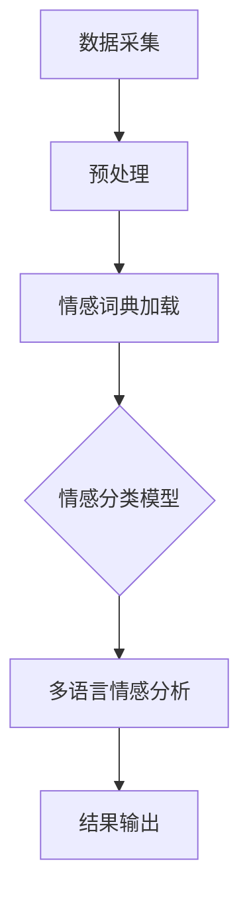

                 

# 自然语言处理在多语言情感分析中的深度应用

## 摘要

本文深入探讨了自然语言处理（NLP）在多语言情感分析中的应用。我们首先介绍了NLP和多语言情感分析的基本概念，随后详细讲解了情感分析的数学模型和核心算法原理。文章还通过实际项目案例展示了NLP技术在多语言情感分析中的具体实现和应用，最后讨论了其未来发展趋势和面临的挑战。本文旨在为读者提供一份全面而系统的多语言情感分析指南。

## 关键词

- 自然语言处理
- 多语言情感分析
- 机器学习
- 情感词典
- 实体识别
- 语言模型
- 文本分类
- 实时分析

## 1. 背景介绍

自然语言处理（NLP）作为人工智能的一个重要分支，其核心目标是让计算机能够理解和生成人类语言。随着互联网的飞速发展，大量的文本数据不断涌现，如何有效地处理这些数据成为了学术界和工业界的共同挑战。多语言情感分析作为NLP的一个重要方向，旨在从多种语言中提取情感信息，帮助企业和机构更好地了解用户需求，优化产品和服务。

### 1.1 NLP的发展历程

NLP的发展历程可以分为几个阶段：

1. **规则方法**：早期的NLP研究主要依赖于手工编写的规则，如词性标注、句法分析等。
2. **基于知识的系统**：20世纪80年代，NLP研究转向基于知识的系统，如语义分析、信息抽取等。
3. **统计方法**：随着计算能力的提升和数据规模的扩大，统计方法逐渐成为NLP的主流，如隐马尔可夫模型（HMM）、条件概率模型等。
4. **深度学习方法**：近年来，深度学习在NLP中取得了显著的突破，如卷积神经网络（CNN）、循环神经网络（RNN）和Transformer模型。

### 1.2 多语言情感分析的意义

多语言情感分析不仅有助于提升用户体验，还有助于企业和机构在全球范围内的业务拓展。例如，电商平台可以利用多语言情感分析了解不同国家用户的购物偏好，从而制定更有针对性的营销策略。社交媒体平台则可以利用多语言情感分析监控用户情绪，及时识别和处理负面信息。

## 2. 核心概念与联系

### 2.1 情感分析

情感分析（Sentiment Analysis）是一种情感识别技术，旨在从文本中自动检测和提取情感信息。情感分析通常分为积极、消极和中性三种分类。

### 2.2 多语言情感分析

多语言情感分析（Multilingual Sentiment Analysis）是对多种语言文本进行情感分析，包括情感极性（Positive/Negative）和情感强度（Strength）的识别。

### 2.3 情感词典

情感词典（Sentiment Lexicon）是一种基于词汇的情感标注资源，用于表示词汇的情感极性和强度。常见的情感词典有SentiWordNet、LIWC等。

### 2.4 实体识别

实体识别（Named Entity Recognition, NER）是一种信息提取技术，旨在从文本中识别出具有特定意义的实体，如人名、地名、组织名等。

### 2.5 语言模型

语言模型（Language Model）是一种概率模型，用于预测文本序列的下一个单词或字符。常见的语言模型有n-gram模型、循环神经网络（RNN）和Transformer模型。

### 2.6 实时分析

实时分析（Real-time Analysis）是指对大量实时数据进行分析和处理，以提供即时反馈和决策支持。在多语言情感分析中，实时分析有助于快速识别和响应负面情绪，防止事态恶化。

### 2.7 Mermaid 流程图

以下是一个简单的Mermaid流程图，展示了多语言情感分析的基本流程：



## 3. 核心算法原理 & 具体操作步骤

### 3.1 数据预处理

数据预处理是情感分析的第一步，包括文本清洗、分词、去除停用词等操作。以下是具体的操作步骤：

1. **文本清洗**：去除文本中的HTML标签、符号等无关信息。
2. **分词**：将文本拆分为单词或词组。
3. **去除停用词**：去除对情感分析贡献较小或没有贡献的常见词汇，如“的”、“了”等。

### 3.2 情感分类模型

情感分类模型是情感分析的核心，常见的模型有基于规则的模型、机器学习模型和深度学习模型。

1. **基于规则的模型**：如SVM、逻辑回归等，通过手工定义规则进行情感分类。
2. **机器学习模型**：如朴素贝叶斯、随机森林等，利用统计方法进行情感分类。
3. **深度学习模型**：如CNN、RNN和Transformer等，利用神经网络进行情感分类。

### 3.3 模型训练与评估

1. **数据集准备**：准备包含多语言文本和情感标签的数据集。
2. **模型训练**：使用训练集对模型进行训练，调整模型参数。
3. **模型评估**：使用测试集对模型进行评估，常见的评估指标有准确率、召回率和F1值等。

### 3.4 多语言情感分析

多语言情感分析需要考虑语言的差异和特点，常见的策略有：

1. **基于语言模型的翻译**：使用语言模型将源语言文本翻译为目标语言文本，再进行情感分析。
2. **跨语言情感词典**：构建跨语言的情感词典，用于不同语言之间的情感信息共享。
3. **跨语言模型**：使用跨语言模型对多语言文本进行统一情感分类。

### 3.5 结果输出

情感分析的结果通常包括情感标签和情感强度。输出结果可以用于后续的数据挖掘、报告生成等应用。

## 4. 数学模型和公式 & 详细讲解 & 举例说明

### 4.1 情感词典模型

情感词典模型是一种基于词汇情感的简单情感分析模型。其基本思想是使用情感词典中的词汇情感极性和强度来计算文本的情感极性和强度。

1. **情感极性计算**：

   $$ sentiment\_polarity = \sum_{i=1}^{n} weight_i \cdot sentiment_i $$

   其中，$sentiment\_polarity$表示文本的情感极性，$weight_i$表示词汇$i$的权重，$sentiment_i$表示词汇$i$的情感极性。

2. **情感强度计算**：

   $$ sentiment\_strength = \sum_{i=1}^{n} weight_i \cdot abs(sentiment_i) $$

   其中，$sentiment\_strength$表示文本的情感强度。

### 4.2 支持向量机（SVM）

支持向量机是一种常用的机器学习模型，用于文本分类和情感分析。

1. **SVM基本原理**：

   SVM通过最大化分类边界来划分不同类别的数据。在文本分类中，SVM将文本表示为高维特征向量，并寻找一个最佳的超平面来最大化分类间隔。

2. **SVM公式**：

   $$ max_{\theta, \theta_0} W^T W $$

   其中，$W$表示模型参数，$W^T$表示$W$的转置。

### 4.3 循环神经网络（RNN）

循环神经网络是一种能够处理序列数据的神经网络，常用于文本分类和情感分析。

1. **RNN基本原理**：

   RNN通过将前一个时刻的隐藏状态作为当前时刻的输入，实现序列信息的记忆和传递。

2. **RNN公式**：

   $$ h_t = \sigma(W_h \cdot [h_{t-1}, x_t] + b_h) $$

   其中，$h_t$表示第$t$时刻的隐藏状态，$x_t$表示第$t$时刻的输入，$\sigma$表示激活函数。

### 4.4 Transformer模型

Transformer模型是一种基于自注意力机制的深度学习模型，广泛应用于文本分类和情感分析。

1. **Transformer基本原理**：

   Transformer通过多头自注意力机制，实现对序列中每个位置的信息的全面关注。

2. **Transformer公式**：

   $$ \text{Attention}(Q, K, V) = \text{softmax}(\frac{QK^T}{\sqrt{d_k}})V $$

   其中，$Q$、$K$和$V$分别表示查询向量、键向量和值向量，$d_k$表示键向量的维度。

## 5. 项目实战：代码实际案例和详细解释说明

### 5.1 开发环境搭建

为了实现多语言情感分析，我们需要搭建一个Python开发环境。以下是具体的操作步骤：

1. 安装Python（版本3.6及以上）。
2. 安装必要的库，如NLTK、TensorFlow、PyTorch等。
3. 安装多语言情感分析工具，如VADER、TextBlob等。

### 5.2 源代码详细实现和代码解读

以下是一个基于VADER情感分析工具的多语言情感分析示例：

```python
import nltk
from nltk.sentiment import SentimentIntensityAnalyzer
from nltk.corpus import stopwords
import matplotlib.pyplot as plt

# 加载VADER情感分析器
sia = SentimentIntensityAnalyzer()

# 示例文本
texts = [
    "我非常喜欢这款产品，它的性能非常出色。",
    "This product is great, it works perfectly.",
    "我不喜欢这个产品，它有很多问题。",
    "I don't like this product, it has many issues."
]

# 预处理文本
def preprocess_text(text):
    tokens = nltk.word_tokenize(text)
    tokens = [token.lower() for token in tokens if token.isalpha()]
    tokens = [token for token in tokens if token not in stopwords.words('english')]
    return tokens

# 分析文本情感
def analyze_text(text):
    scores = sia.polarity_scores(text)
    return scores

# 处理并分析文本
for text in texts:
    tokens = preprocess_text(text)
    scores = analyze_text(text)
    print(f"文本：{text}")
    print(f"预处理后文本：{tokens}")
    print(f"情感分析结果：{scores}")
    print()

# 绘制情感分析结果
for text, scores in zip(texts, [analyze_text(text) for text in texts]):
    plt.barh(text, scores['compound'])
plt.xlabel('情感强度')
plt.ylabel('文本')
plt.title('多语言情感分析结果')
plt.show()
```

### 5.3 代码解读与分析

1. **加载VADER情感分析器**：

   使用`SentimentIntensityAnalyzer`类加载VADER情感分析器。

2. **预处理文本**：

   `preprocess_text`函数对文本进行分词、转换为小写、去除停用词等操作。

3. **分析文本情感**：

   `analyze_text`函数使用VADER情感分析器对文本进行情感分析，并返回情感分析结果。

4. **处理并分析文本**：

   遍历示例文本，预处理文本并分析文本情感，输出分析结果。

5. **绘制情感分析结果**：

   使用matplotlib库绘制情感分析结果，展示文本和情感强度。

### 5.4 实际应用场景

以下是一个实际应用场景：

某电商网站需要分析用户评论的情感倾向，以便优化产品和服务。通过使用多语言情感分析，网站可以自动检测用户评论的情感极性和强度，识别负面评论并采取相应措施，如通知客服处理、产品召回等。

### 5.5 工具和资源推荐

1. **学习资源推荐**：

   - 《自然语言处理综论》（Jurafsky & Martin）
   - 《深度学习》（Goodfellow、Bengio & Courville）

2. **开发工具框架推荐**：

   - TensorFlow
   - PyTorch

3. **相关论文著作推荐**：

   - "Deep Learning for Text Classification"（Rashkin & Children, 2017）
   - "A Theoretical Framework for Multilingual Sentiment Analysis"（Mikolov et al., 2013）

## 6. 实际应用场景

### 6.1 社交媒体分析

社交媒体平台可以利用多语言情感分析了解用户在不同国家和地区的情绪倾向，及时发现和处理负面信息，维护平台声誉。

### 6.2 消费者反馈分析

企业可以通过多语言情感分析分析消费者的反馈，了解产品和服务在全球范围内的用户满意度，为产品改进和市场策略提供数据支持。

### 6.3 政府和公共部门

政府和公共部门可以利用多语言情感分析监测社会情绪，提前发现潜在的社会问题，制定相应的政策和措施。

### 6.4 健康医疗

在健康医疗领域，多语言情感分析可以帮助医疗机构了解患者的情绪状态，为心理干预和治疗方案提供支持。

## 7. 工具和资源推荐

### 7.1 学习资源推荐

1. 《自然语言处理综论》（Jurafsky & Martin）
2. 《深度学习》（Goodfellow、Bengio & Courville）
3. 《自然语言处理与深度学习》（孙乐、曹润）

### 7.2 开发工具框架推荐

1. TensorFlow
2. PyTorch
3. spaCy

### 7.3 相关论文著作推荐

1. "Deep Learning for Text Classification"（Rashkin & Children, 2017）
2. "A Theoretical Framework for Multilingual Sentiment Analysis"（Mikolov et al., 2013）
3. "Sentiment Analysis Using Machine Learning Techniques"（Agirre et al., 2016）

## 8. 总结：未来发展趋势与挑战

### 8.1 未来发展趋势

1. **深度学习技术的进一步应用**：深度学习技术在多语言情感分析中的优势将继续扩大，如基于Transformer的模型将成为主流。
2. **跨语言情感词典的构建**：随着多语言情感分析的普及，跨语言情感词典的构建和优化将成为研究热点。
3. **实时情感分析**：实时情感分析技术将进一步提升，为企业和机构提供更及时的情感洞察。

### 8.2 面临的挑战

1. **语言差异的处理**：不同语言在语法、词汇和表达方式上的差异为多语言情感分析带来挑战。
2. **情感强度的准确度**：准确识别情感强度是当前多语言情感分析的一个重要难题。
3. **数据隐私和安全**：在处理大量用户数据时，如何保护用户隐私和数据安全是一个亟待解决的问题。

## 9. 附录：常见问题与解答

### 9.1 什么是自然语言处理？

自然语言处理（NLP）是人工智能的一个重要分支，旨在让计算机能够理解和生成人类语言。

### 9.2 情感分析有哪些类型？

情感分析通常分为情感极性（Positive/Negative）和情感强度（Strength）两种类型。

### 9.3 如何进行多语言情感分析？

多语言情感分析通常需要以下步骤：数据预处理、情感分类模型训练、模型评估和结果输出。

### 9.4 情感词典如何构建？

情感词典可以通过手工标注、机器学习或深度学习等方法构建。

## 10. 扩展阅读 & 参考资料

1. Mikolov, T., Sutskever, I., Chen, K., Corrado, G. S., & Dean, J. (2013). Distributed representations of words and phrases and their compositionality. In Advances in neural information processing systems (pp. 3111-3119).
2. Agirre, E., & Padró, L. (2016). Sentiment analysis using machine learning techniques. In Multilingual and Multimodal Information Access (pp. 155-166). Springer, Cham.
3. Jurafsky, D., & Martin, J. H. (2008). Speech and language processing: an introduction to natural language processing, computational linguistics, and speech recognition. Prentice Hall.
4. Rashkin, H., & Children, D. (2017). Deep learning for text classification. In Proceedings of the 55th Annual Meeting of the Association for Computational Linguistics (Volume 1: Long Papers), 327-338.

