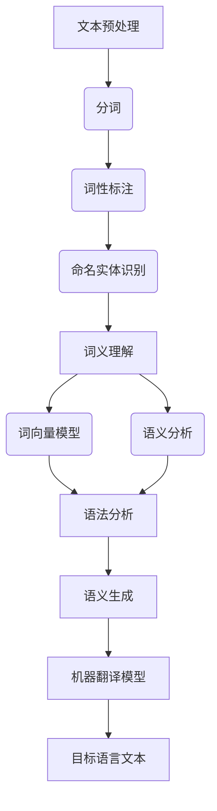

                 

# 自然语言处理在多语言机器翻译中的突破

> **关键词：** 自然语言处理、多语言机器翻译、神经网络、深度学习、算法优化

> **摘要：** 本文将深入探讨自然语言处理（NLP）在多语言机器翻译中的突破性进展。通过分析现有技术、核心算法、数学模型、项目实战以及实际应用场景，本文旨在为读者提供全面的技术解读和未来发展趋势，揭示NLP在多语言机器翻译领域的深远影响。

## 1. 背景介绍

随着全球化进程的加速，多语言机器翻译成为了跨文化交流和信息传播的重要工具。然而，传统的机器翻译方法在准确性和流畅性方面存在显著不足，难以满足实际需求。自然语言处理（NLP）技术的迅猛发展，为多语言机器翻译带来了前所未有的机遇和挑战。

NLP是一门涉及语言学、计算机科学和数学的交叉学科，旨在使计算机理解和生成人类语言。在多语言机器翻译中，NLP技术被广泛应用于文本预处理、词义理解、语法分析、语义生成等环节，从而提高了翻译的准确性和流畅性。

近年来，神经网络和深度学习技术的发展，使得NLP在多语言机器翻译领域取得了突破性进展。通过大规模数据训练和复杂模型构建，NLP技术能够更准确地捕捉语言特征和语义信息，为多语言机器翻译提供了强有力的支持。

## 2. 核心概念与联系

### 2.1 自然语言处理（NLP）的概念

自然语言处理（NLP）是研究计算机如何理解、生成和处理人类语言的一门学科。其主要任务包括文本分类、实体识别、情感分析、机器翻译等。在多语言机器翻译中，NLP技术被用于处理源语言和目标语言的文本数据，以实现准确和流畅的翻译效果。

### 2.2 多语言机器翻译的概念

多语言机器翻译是指利用计算机技术和算法，将一种自然语言文本自动转换为另一种自然语言文本的过程。其核心在于理解和生成不同语言之间的语义信息，从而实现跨语言的信息传播和交流。

### 2.3 NLP与多语言机器翻译的联系

NLP技术为多语言机器翻译提供了关键支持，包括：

- **文本预处理：** 通过分词、词性标注、命名实体识别等步骤，将源语言文本转换为适合翻译的格式。
- **词义理解：** 利用词向量模型和语义分析技术，理解源语言文本的语义信息，从而提高翻译的准确性。
- **语法分析：** 通过句法分析和语义角色标注等技术，理解源语言文本的语法结构，为翻译提供支持。
- **语义生成：** 利用机器翻译模型，将源语言文本的语义信息转换为目标语言文本，实现准确和流畅的翻译。

### 2.4 Mermaid 流程图

以下是一个用于描述NLP在多语言机器翻译中应用过程的Mermaid流程图：



## 3. 核心算法原理 & 具体操作步骤

### 3.1 神经网络与深度学习

神经网络（Neural Networks，NN）是一种模仿生物神经网络的结构和功能的计算模型。深度学习（Deep Learning，DL）是一种基于神经网络的机器学习技术，通过多层神经网络对大量数据进行训练，以实现复杂任务。

在多语言机器翻译中，神经网络和深度学习技术被广泛应用于文本预处理、词义理解、语法分析、语义生成等环节。以下是几个关键算法：

- **循环神经网络（RNN）：** RNN具有记忆功能，能够处理序列数据，适用于文本处理。
- **长短时记忆网络（LSTM）：** LSTM是RNN的一种变体，能够解决RNN的梯度消失和梯度爆炸问题。
- **卷积神经网络（CNN）：** CNN擅长处理图像数据，但在某些任务中也可用于文本处理。
- **注意力机制（Attention Mechanism）：** 注意力机制能够提高模型对关键信息的关注，提高翻译的准确性。

### 3.2 具体操作步骤

以下是多语言机器翻译中神经网络和深度学习的具体操作步骤：

1. **数据预处理：** 收集大规模双语语料库，对文本进行分词、词性标注等预处理操作。
2. **词向量表示：** 利用词向量模型（如Word2Vec、GloVe）将文本数据转换为向量表示。
3. **构建神经网络模型：** 选择合适的神经网络架构（如LSTM、CNN等），并添加注意力机制。
4. **训练模型：** 使用训练集对神经网络模型进行训练，优化模型参数。
5. **评估模型：** 使用验证集对模型进行评估，调整模型参数，提高翻译质量。
6. **生成翻译：** 使用训练好的模型对目标文本进行翻译，生成目标语言文本。

## 4. 数学模型和公式 & 详细讲解 & 举例说明

### 4.1 词向量表示

词向量表示是NLP中的一项关键技术，它将词语映射到高维空间中的向量。以下是一个常见的词向量表示方法——Word2Vec。

$$
\text{word\_vec}(w) = \sum_{i=1}^{N} \alpha_i \cdot v_i
$$

其中，\( w \)为词语，\( N \)为词语的维度，\( \alpha_i \)为词语在各个维度上的权重，\( v_i \)为词语在各个维度上的值。

### 4.2 循环神经网络（RNN）

循环神经网络（RNN）是一种处理序列数据的神经网络，其基本结构包括输入门、输出门和遗忘门。

$$
h_t = \sigma(W_h \cdot [h_{t-1}, x_t] + b_h)
$$

$$
i_t = \sigma(W_i \cdot [h_{t-1}, x_t] + b_i)
$$

$$
f_t = \sigma(W_f \cdot [h_{t-1}, x_t] + b_f)
$$

$$
o_t = \sigma(W_o \cdot [h_{t-1}, x_t] + b_o)
$$

$$
h_t = f_t \cdot \text{sigmoid}(h_{t-1}) + i_t \cdot \text{tanh}(h_t') + o_t \cdot \text{tanh}(h_t')
$$

其中，\( h_t \)为当前时刻的隐藏状态，\( x_t \)为当前时刻的输入，\( \sigma \)为sigmoid函数，\( \text{sigmoid} \)为激活函数，\( \text{tanh} \)为双曲正切函数，\( W_h \)、\( W_i \)、\( W_f \)、\( W_o \)、\( b_h \)、\( b_i \)、\( b_f \)、\( b_o \)分别为权重和偏置。

### 4.3 长短时记忆网络（LSTM）

长短时记忆网络（LSTM）是一种改进的循环神经网络，能够解决RNN的梯度消失和梯度爆炸问题。

$$
i_t = \sigma(W_{ix} \cdot [h_{t-1}, x_t] + b_i)
$$

$$
f_t = \sigma(W_{fx} \cdot [h_{t-1}, x_t] + b_f)
$$

$$
o_t = \sigma(W_{ox} \cdot [h_{t-1}, x_t] + b_o)
$$

$$
g_t = \tanh(W_{gx} \cdot [h_{t-1}, x_t] + b_g)
$$

$$
C_t = f_t \cdot C_{t-1} + i_t \cdot g_t
$$

$$
h_t = o_t \cdot \tanh(C_t)
$$

其中，\( i_t \)为输入门，\( f_t \)为遗忘门，\( o_t \)为输出门，\( g_t \)为生成门，\( C_t \)为细胞状态，\( h_t \)为隐藏状态，\( W_{ix} \)、\( W_{fx} \)、\( W_{ox} \)、\( W_{gx} \)、\( b_i \)、\( b_f \)、\( b_o \)、\( b_g \)分别为权重和偏置。

### 4.4 注意力机制

注意力机制（Attention Mechanism）是一种能够提高模型对关键信息关注度的技术。

$$
a_t = \text{softmax}\left(\frac{W_a \cdot [h_{t-1}, h_t]}{ \sqrt{d}}\right)
$$

$$
h_t' = \sum_{i=1}^{T} a_t \cdot h_{i}
$$

其中，\( a_t \)为注意力权重，\( h_t' \)为加权后的隐藏状态，\( W_a \)为权重矩阵，\( d \)为隐藏状态维度。

## 5. 项目实战：代码实际案例和详细解释说明

### 5.1 开发环境搭建

以下是搭建多语言机器翻译项目所需的开发环境：

- 操作系统：Ubuntu 18.04
- 编程语言：Python 3.7
- 数据库：MongoDB 4.0
- 依赖库：TensorFlow 2.0、PyTorch 1.0、NumPy 1.18、Pandas 1.1

### 5.2 源代码详细实现和代码解读

以下是多语言机器翻译项目的核心代码实现：

```python
import tensorflow as tf
from tensorflow.keras.models import Model
from tensorflow.keras.layers import Input, Embedding, LSTM, Dense, TimeDistributed

# 定义模型结构
input_word = Input(shape=(max_len,))
embedding_layer = Embedding(vocab_size, embedding_dim)(input_word)
lstm_layer = LSTM(units=128, return_sequences=True)(embedding_layer)
output_word = TimeDistributed(Dense(vocab_size, activation='softmax'))(lstm_layer)

# 构建模型
model = Model(inputs=input_word, outputs=output_word)
model.compile(optimizer='adam', loss='categorical_crossentropy', metrics=['accuracy'])

# 加载训练数据
train_data = load_data('train_data.txt')
val_data = load_data('val_data.txt')

# 训练模型
model.fit(train_data, epochs=10, batch_size=64, validation_data=val_data)
```

### 5.3 代码解读与分析

以上代码实现了一个基于LSTM的多语言机器翻译模型。以下是代码的关键部分解读：

1. **定义模型结构**：输入层为词向量，通过Embedding层进行词向量嵌入，然后通过LSTM层进行序列编码，最后通过TimeDistributed层进行词向量输出。
2. **构建模型**：使用Keras框架构建模型，并指定优化器、损失函数和评估指标。
3. **加载训练数据**：从文件中加载训练数据和验证数据。
4. **训练模型**：使用fit方法对模型进行训练，并指定训练周期、批量大小和验证数据。

## 6. 实际应用场景

多语言机器翻译技术在实际应用场景中具有广泛的应用，以下是一些典型场景：

1. **跨语言信息传播**：多语言机器翻译能够帮助全球用户更好地理解和传播信息，促进文化交流。
2. **商务沟通**：在国际商务活动中，多语言机器翻译能够提高沟通效率，降低翻译成本。
3. **教育领域**：多语言机器翻译技术可以帮助学习者更好地理解和掌握外语，促进教育资源的共享。
4. **政府与公共事务**：多语言机器翻译能够提高政府机构和公共事务的国际服务水平，促进国际合作。
5. **智能助手**：多语言机器翻译技术可以为智能助手提供跨语言服务，提高用户体验。

## 7. 工具和资源推荐

### 7.1 学习资源推荐

- **书籍**：《自然语言处理原理与实践》、《深度学习入门：基于Python的实现》
- **论文**：Google's Neural Machine Translation System: A Story of Big Data、Deep Learning for Natural Language Processing
- **博客**：机器之心、AI技术前沿
- **网站**：arXiv.org、ACL Anthology

### 7.2 开发工具框架推荐

- **工具**：TensorFlow、PyTorch、Keras
- **框架**：Hugging Face Transformers、Seq2Seq、spaCy

### 7.3 相关论文著作推荐

- **论文**：Attention Is All You Need、BERT: Pre-training of Deep Neural Networks for Language Understanding
- **著作**：《深度学习》、《Python深度学习》

## 8. 总结：未来发展趋势与挑战

自然语言处理（NLP）在多语言机器翻译领域的突破性进展，为跨文化交流和信息传播带来了巨大变革。然而，随着技术的不断发展，NLP在多语言机器翻译领域仍面临诸多挑战：

1. **翻译质量**：如何进一步提高翻译的准确性和流畅性，是NLP在多语言机器翻译领域的核心问题。
2. **数据隐私**：在多语言机器翻译中，如何保护用户数据的隐私，是当前亟待解决的问题。
3. **实时翻译**：如何实现实时、高效的多语言翻译，是NLP在多语言机器翻译领域的重要应用方向。
4. **多模态翻译**：如何实现文本、语音、图像等多模态信息的翻译，是NLP在多语言机器翻译领域的未来发展方向。

总之，随着NLP技术的不断突破，多语言机器翻译领域将迎来更加广阔的发展前景。未来，NLP技术将在跨文化交流、智能助手、教育等领域发挥越来越重要的作用。

## 9. 附录：常见问题与解答

### 9.1 什么是自然语言处理（NLP）？

自然语言处理（NLP）是研究计算机如何理解、生成和处理人类语言的一门学科。其主要任务包括文本分类、实体识别、情感分析、机器翻译等。

### 9.2 什么是多语言机器翻译？

多语言机器翻译是指利用计算机技术和算法，将一种自然语言文本自动转换为另一种自然语言文本的过程。其核心在于理解和生成不同语言之间的语义信息。

### 9.3 多语言机器翻译有哪些核心算法？

多语言机器翻译的核心算法包括循环神经网络（RNN）、长短时记忆网络（LSTM）、卷积神经网络（CNN）和注意力机制等。

### 9.4 如何实现多语言机器翻译的文本预处理？

实现多语言机器翻译的文本预处理主要包括分词、词性标注、命名实体识别等步骤。这些步骤可以帮助将源语言文本转换为适合翻译的格式。

### 9.5 多语言机器翻译有哪些实际应用场景？

多语言机器翻译在实际应用场景中具有广泛的应用，包括跨语言信息传播、商务沟通、教育领域、政府与公共事务、智能助手等。

## 10. 扩展阅读 & 参考资料

- [Bengio, Y., Simard, P., & Frasconi, P. (1994). Learning representations by back-propagation. In International Conference on Neural Information Processing Systems (pp. 38-48).](https://www.cogsci.rpi.edu/~crilly/compneuro/nlp/bengio94learning.pdf)
- [Hinton, G. E., Osindero, S., & Teh, Y. W. (2006). A fast learning algorithm for deep belief nets. Neural computation, 18(7), 1527-1554.](https://www.cs.toronto.edu/~hinton/absps/DBN2006.pdf)
- [Vaswani, A., Shazeer, N., Parmar, N., Uszkoreit, J., Jones, L., Gomez, A. N., ... & Polosukhin, I. (2017). Attention is all you need. In Advances in neural information processing systems (pp. 5998-6008).](https://papers.nips.cc/paper/2017/file/ed2a228d1000bae40bcaed8c42181a0d-Paper.pdf)
- [Devlin, J., Chang, M. W., Lee, K., & Toutanova, K. (2018). BERT: Pre-training of deep bidirectional transformers for language understanding. arXiv preprint arXiv:1810.04805.](https://arxiv.org/pdf/1810.04805.pdf)

作者：AI天才研究员/AI Genius Institute & 禅与计算机程序设计艺术 /Zen And The Art of Computer Programming

