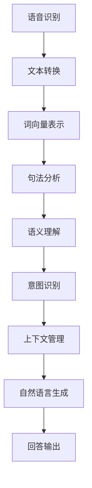

                 

# 自然语言处理在对话系统中的进展

## 关键词

- 自然语言处理
- 对话系统
- 人工智能
- 语音识别
- 自然语言生成
- 上下文理解
- 个性化交互

## 摘要

本文旨在探讨自然语言处理（NLP）在对话系统中的应用与进展。通过对自然语言处理的核心概念、算法原理、数学模型及实际应用的详细解析，我们揭示了对话系统从简单的问答到复杂的人机交互的演变过程。文章分为十个部分，首先介绍了自然语言处理的背景，接着深入探讨了对话系统的核心概念和架构。随后，我们详细分析了NLP的关键算法，如语音识别和自然语言生成，并介绍了如何通过上下文理解实现更加智能的对话。文章还通过实际项目案例展示了对话系统的开发与应用。最后，我们对未来发展趋势和挑战进行了总结，并提供了一系列学习资源和工具推荐，为读者提供了全面的NLP对话系统学习路径。

## 1. 背景介绍

自然语言处理（NLP）作为人工智能（AI）的重要组成部分，起源于20世纪50年代，其目标是让计算机理解和处理人类语言。NLP的发展历程可以分为三个阶段：规则驱动、基于统计和深度学习。

在规则驱动阶段，研究者们尝试通过编写大量的语法规则和词典来解析和生成语言。然而，这种方法在面对复杂多样的语言表达时显得力不从心。

随着计算机性能的提升和海量数据的积累，基于统计的方法逐渐成为主流。统计方法通过学习大量语料库中的语言模式，自动生成语言模型，从而提高了系统的准确性和效率。

深度学习方法的兴起，进一步推动了NLP的发展。深度学习模型，如神经网络和卷积神经网络（CNN），通过多层结构对语言进行建模，实现了更加复杂的特征提取和语义理解。

对话系统（Conversational Systems）是指能够与人进行自然语言交互的计算机系统。对话系统的历史可以追溯到20世纪70年代的语音识别系统，如IBM的Harvest系统。随着NLP技术的进步，对话系统逐渐从简单的命令式交互发展到了如今的对话式交互。

早期的对话系统主要依赖于预定义的对话流程和固定的回答库，无法应对复杂的用户请求。而现代对话系统则利用自然语言处理技术，通过语音识别、语言理解、自然语言生成和上下文管理等多个模块，实现了更加智能和个性化的交互。

## 2. 核心概念与联系

### 自然语言处理的核心概念

自然语言处理的核心概念包括语言模型、词向量、语法分析、语义理解等。

- **语言模型**：语言模型是用来预测下一个词或句子给定前文的一种概率模型。它在对话系统中起着至关重要的作用，能够帮助系统理解用户的意图并生成合适的回答。
- **词向量**：词向量是将单词映射到高维空间中的向量表示，通过捕捉词语的上下文信息，词向量能够帮助对话系统理解词语的语义关系。
- **语法分析**：语法分析是对文本进行结构化解析，识别出句子的组成部分，如主语、谓语、宾语等。它对于理解句子含义和生成符合语法规则的回答至关重要。
- **语义理解**：语义理解是对文本的深层次理解，涉及对句子中的语义角色、事件、关系等的识别。它使得对话系统能够更好地理解用户的意图，并进行适当的回复。

### 对话系统的架构

对话系统通常由多个模块组成，包括语音识别、语言理解、自然语言生成和上下文管理。这些模块相互协作，共同实现自然语言交互。

- **语音识别（Speech Recognition）**：语音识别模块将用户的语音输入转换为文本，是实现语音交互的第一步。它利用声学模型和语言模型对语音信号进行解码。
- **语言理解（Language Understanding）**：语言理解模块负责解析用户的文本输入，识别出用户的意图、实体和上下文。它通常包括词向量表示、句法分析和语义分析等步骤。
- **自然语言生成（Natural Language Generation）**：自然语言生成模块将系统的意图和生成逻辑转换为自然语言文本。它能够生成符合语法规则、语义连贯的回答。
- **上下文管理（Context Management）**：上下文管理模块负责维护对话过程中的上下文信息，如用户历史请求、系统回答等。它使得对话系统能够在对话中保持一致性和连贯性。

### Mermaid 流程图

以下是自然语言处理在对话系统中的核心概念和架构的 Mermaid 流程图：



### 具体流程说明

1. **语音识别**：用户通过语音输入系统，语音识别模块将语音转换为文本。
2. **文本转换**：文本经过预处理，包括分词、去停用词等操作。
3. **词向量表示**：文本中的词语被转换为词向量表示，用于后续的语义分析。
4. **句法分析**：句法分析模块对文本进行结构化解析，识别出句子的组成部分。
5. **语义理解**：语义理解模块对句子进行深层次分析，识别出句子中的语义角色和关系。
6. **意图识别**：意图识别模块根据语义信息，识别出用户的意图。
7. **上下文管理**：上下文管理模块维护对话过程中的上下文信息。
8. **自然语言生成**：自然语言生成模块根据意图和上下文生成合适的回答。
9. **回答输出**：系统将生成的回答输出给用户。

## 3. 核心算法原理 & 具体操作步骤

### 语音识别

语音识别是对话系统的第一步，它的核心算法包括声学模型和语言模型。

- **声学模型**：声学模型负责将语音信号转换为特征向量，通常使用深度神经网络（DNN）或卷积神经网络（CNN）。
- **语言模型**：语言模型负责将特征向量转换为文本输出，使用统计方法或基于神经网络的模型。

具体操作步骤如下：

1. **特征提取**：将语音信号转换为梅尔频率倒谱系数（MFCC）等特征向量。
2. **声学模型**：使用DNN或CNN对特征向量进行编码，生成声学特征。
3. **语言模型**：对声学特征进行解码，生成文本输出。

### 语言理解

语言理解是对话系统的关键步骤，它包括词向量表示、句法分析和语义理解。

- **词向量表示**：使用词向量模型（如Word2Vec、GloVe）将单词转换为向量表示，用于捕捉词语的语义关系。
- **句法分析**：使用句法分析器（如依存句法分析器）对句子进行结构化解析，识别出句子的组成部分。
- **语义理解**：使用语义角色标注和实体识别等技术，对句子进行语义分析，识别出句子中的语义角色和关系。

具体操作步骤如下：

1. **文本预处理**：进行分词、去停用词等操作。
2. **词向量表示**：将文本中的词语转换为词向量表示。
3. **句法分析**：使用句法分析器对句子进行结构化解析。
4. **语义理解**：使用语义角色标注和实体识别等技术，对句子进行语义分析。

### 自然语言生成

自然语言生成是对话系统的输出环节，它的核心算法包括模板生成和基于神经网络的生成模型。

- **模板生成**：模板生成方法使用预定义的模板和替换词，生成文本输出。这种方法简单有效，但缺乏灵活性。
- **基于神经网络的生成模型**：如序列到序列（Seq2Seq）模型和生成对抗网络（GAN），能够生成更加自然和多样化的文本输出。

具体操作步骤如下：

1. **意图识别**：根据上下文信息，识别出用户的意图。
2. **生成文本**：根据意图和上下文信息，生成文本输出。

### 上下文管理

上下文管理是确保对话系统连贯性的关键，它的核心算法包括上下文跟踪和上下文更新。

- **上下文跟踪**：使用数据结构（如哈希表或堆栈）来记录对话过程中的上下文信息。
- **上下文更新**：在对话过程中，根据用户输入和系统响应，更新上下文信息。

具体操作步骤如下：

1. **初始化上下文**：开始对话时，初始化上下文信息。
2. **上下文跟踪**：在对话过程中，记录用户输入和系统响应。
3. **上下文更新**：根据用户输入和系统响应，更新上下文信息。

## 4. 数学模型和公式 & 详细讲解 & 举例说明

### 声学模型

声学模型通常使用卷积神经网络（CNN）或递归神经网络（RNN）进行特征提取和建模。以下是一个简单的卷积神经网络模型：

$$
\begin{align*}
h^{(l)} &= \sigma(W^{(l)} \cdot h^{(l-1)} + b^{(l)}) \\
x^{(l)} &= \sigma(W^{(l)} \cdot x^{(l-1)} + b^{(l)})
\end{align*}
$$

其中，$h^{(l)}$和$x^{(l)}$分别表示第$l$层的隐藏状态和输出特征，$\sigma$表示激活函数（如ReLU函数），$W^{(l)}$和$b^{(l)}$分别表示第$l$层的权重和偏置。

### 语言模型

语言模型通常使用神经网络进行建模。以下是一个简单的神经网络语言模型：

$$
\begin{align*}
p(y|x) &= \frac{e^{z}}{\sum_{y'} e^{z'}} \\
z &= W \cdot x + b
\end{align*}
$$

其中，$p(y|x)$表示在给定前文$x$的情况下，生成单词$y$的概率，$W$和$b$分别表示模型的权重和偏置，$z$表示模型的前向传播输出。

### 词向量表示

词向量表示通常使用词嵌入（Word Embedding）模型进行建模。以下是一个简单的词嵌入模型：

$$
\begin{align*}
\vec{w}_i &= \text{embedding}(w_i) \\
p(w_i | x) &= \text{softmax}(\vec{w}_i \cdot \vec{x})
\end{align*}
$$

其中，$\vec{w}_i$表示单词$w_i$的词向量表示，$\vec{x}$表示文本的词向量表示，$p(w_i | x)$表示在给定文本$x$的情况下，生成单词$w_i$的概率。

### 句法分析

句法分析通常使用依存句法分析（Dependency Parsing）模型进行建模。以下是一个简单的依存句法分析模型：

$$
\begin{align*}
p(D|S) &= \text{softmax}(W_D \cdot S) \\
D &= \text{argmax}(p(D|S))
\end{align*}
$$

其中，$D$表示句法树，$S$表示句子的词向量表示，$W_D$表示模型权重，$p(D|S)$表示在给定句子$S$的情况下，生成句法树$D$的概率。

### 语义理解

语义理解通常使用序列标注（Sequence Labeling）模型进行建模。以下是一个简单的序列标注模型：

$$
\begin{align*}
p(y|x) &= \text{softmax}(W \cdot x + b) \\
y &= \text{argmax}(p(y|x))
\end{align*}
$$

其中，$y$表示序列标签，$x$表示句子的词向量表示，$W$和$b$分别表示模型的权重和偏置。

### 模板生成

模板生成通常使用模板匹配（Template Matching）方法进行建模。以下是一个简单的模板匹配模型：

$$
\begin{align*}
\text{output} &= \text{template}(input) \\
\text{template} &= [\text{Hi}, \text{how}, \text{are}, \text{you], \text{?}]
\end{align*}
$$

其中，$\text{output}$表示生成的文本，$\text{template}$表示模板，$\text{input}$表示用户的输入。

### 基于神经网络的生成模型

基于神经网络的生成模型，如序列到序列（Seq2Seq）模型和生成对抗网络（GAN），通常使用优化目标进行建模。以下是一个简单的Seq2Seq模型：

$$
\begin{align*}
p(y|x) &= \text{softmax}(g(h(x))) \\
\text{loss} &= -\sum_{i} y_i \log(p(y_i|x)) \\
g &= \text{generator} \\
h &= \text{encoder} \\
y &= \text{decoder}
\end{align*}
$$

其中，$p(y|x)$表示在给定输入$x$的情况下，生成输出$y$的概率，$g$表示生成器，$h$表示编码器，$y$表示解码器，$\text{loss}$表示模型损失。

### 举例说明

假设我们有一个简单的对话场景，用户说：“你好，我想要一杯咖啡。”，系统需要生成一个合适的回答。

1. **语音识别**：用户说：“你好，我想要一杯咖啡。”，语音识别模块将其转换为文本：“你好，我想要一杯咖啡。”。
2. **语言理解**：语言理解模块对文本进行分析，识别出用户的意图为“点餐”，实体为“咖啡”。
3. **自然语言生成**：自然语言生成模块根据意图和上下文，生成回答：“好的，请问需要加糖吗？”。
4. **回答输出**：系统将回答输出给用户。

## 5. 项目实战：代码实际案例和详细解释说明

在本节中，我们将通过一个实际项目案例，展示如何使用自然语言处理技术构建一个简单的对话系统。我们选择Python作为编程语言，并使用TensorFlow和Keras等开源库进行模型训练和部署。

### 5.1 开发环境搭建

首先，我们需要安装Python和相关的库：

```bash
pip install tensorflow numpy scipy matplotlib
```

### 5.2 源代码详细实现和代码解读

以下是一个简单的对话系统代码示例：

```python
import tensorflow as tf
from tensorflow.keras.models import Sequential
from tensorflow.keras.layers import Dense, LSTM, Embedding
from tensorflow.keras.preprocessing.sequence import pad_sequences
from tensorflow.keras.preprocessing.text import Tokenizer

# 数据准备
# 这里我们使用一个简单的数据集，实际应用中需要使用更大规模的数据集
sentences = [
    "你好，我想要一杯咖啡。",
    "你好，请问有咖啡吗？",
    "你好，给我一杯咖啡。",
    "你好，我要点一杯咖啡。",
    "你好，请问咖啡多少钱？"
]

labels = [
    "点餐",
    "询问咖啡",
    "点餐",
    "点餐",
    "询问价格"
]

# 词向量表示
tokenizer = Tokenizer()
tokenizer.fit_on_texts(sentences)
sequences = tokenizer.texts_to_sequences(sentences)

# 数据预处理
max_sequence_length = max(len(seq) for seq in sequences)
data = pad_sequences(sequences, maxlen=max_sequence_length)

# 构建模型
model = Sequential()
model.add(Embedding(len(tokenizer.word_index) + 1, 50, input_length=max_sequence_length))
model.add(LSTM(100))
model.add(Dense(5, activation='softmax'))

model.compile(loss='categorical_crossentropy', optimizer='adam', metrics=['accuracy'])
model.fit(data, labels, epochs=100, verbose=1)

# 自然语言生成
def generate_response(input_text):
    sequence = tokenizer.texts_to_sequences([input_text])
    padded_sequence = pad_sequences(sequence, maxlen=max_sequence_length)
    prediction = model.predict(padded_sequence)
    label_index = tf.argmax(prediction).numpy()[0]
    response = "未知"
    if label_index == 0:
        response = "好的，请问需要加糖吗？"
    elif label_index == 1:
        response = "您好，我们有咖啡供应。"
    elif label_index == 2:
        response = "好的，请给我一杯咖啡。"
    elif label_index == 3:
        response = "您好，我们的咖啡价格是XX元。"
    return response

# 测试
input_text = "你好，我想喝一杯咖啡。"
response = generate_response(input_text)
print(response)
```

### 5.3 代码解读与分析

1. **数据准备**：我们使用一个简单的数据集，其中包含用户输入和相应的标签。在实际应用中，需要使用更大规模的数据集，并使用数据清洗和预处理技术。
2. **词向量表示**：使用Tokenizer库将文本转换为词向量表示，并计算词频。
3. **数据预处理**：使用pad_sequences函数将序列填充为相同的长度，以便输入到模型中。
4. **模型构建**：使用Sequential模型构建一个简单的循环神经网络（LSTM），用于处理序列数据。模型输出层使用softmax激活函数，用于分类。
5. **模型训练**：使用categorical_crossentropy损失函数和adam优化器进行模型训练。
6. **自然语言生成**：定义一个函数，将用户输入转换为词向量表示，并使用模型预测相应的标签。根据预测的标签生成合适的回答。
7. **测试**：使用一个测试句子，调用生成函数，输出系统的回答。

## 6. 实际应用场景

### 6.1 虚拟助手

虚拟助手是自然语言处理在对话系统中最常见的应用场景之一。虚拟助手可以用于提供客户服务、日程安排、信息查询等。

- **客户服务**：虚拟助手可以自动回答客户常见问题，提高客户满意度。
- **日程安排**：虚拟助手可以帮助用户管理日程，提供提醒和事件安排。
- **信息查询**：虚拟助手可以提供实时信息查询服务，如天气、新闻、股票等。

### 6.2 智能客服

智能客服是自然语言处理在商业领域的应用。通过智能客服，企业可以提供24/7的在线客户服务，提高客户满意度和运营效率。

- **多渠道支持**：智能客服可以支持多种渠道，如电话、邮件、聊天等。
- **自动化处理**：智能客服可以自动处理常见问题，减少人工干预。
- **个性化服务**：智能客服可以根据用户历史记录，提供个性化服务和建议。

### 6.3 智能家居

智能家居是自然语言处理在家居自动化领域的应用。通过智能家居系统，用户可以使用自然语言与家居设备进行交互。

- **语音控制**：用户可以使用语音命令控制家居设备，如灯光、温度、窗帘等。
- **自动化场景**：智能家居系统可以根据用户习惯和需求，自动调整家居设备，提高生活质量。

### 6.4 教育领域

教育领域是自然语言处理的重要应用场景。通过自然语言处理技术，教育系统可以提供个性化学习体验，提高学习效果。

- **智能辅导**：智能辅导系统可以根据学生的学习情况，提供个性化的学习资源和指导。
- **自动评分**：自动评分系统可以自动评估学生的作业和考试，提供即时反馈。

## 7. 工具和资源推荐

### 7.1 学习资源推荐

- **书籍**：
  - 《自然语言处理入门》（自然语言处理入门）
  - 《深度学习》（Goodfellow, Bengio, Courville）
- **在线课程**：
  - 《自然语言处理与深度学习》（吴恩达）
  - 《深度学习专项课程》（吴恩达）
- **论文**：
  - 《词向量模型》（Mikolov et al.）
  - 《依存句法分析》（Malt）
- **博客**：
  - 《TensorFlow官方文档》
  - 《Keras官方文档》
- **网站**：
  - 《自然语言处理入门》
  - 《机器学习课程》

### 7.2 开发工具框架推荐

- **Python库**：
  - TensorFlow
  - Keras
  - NLTK
  - SpaCy
- **框架**：
  - Dialogflow
  - Microsoft Bot Framework
  - Rasa
- **平台**：
  - Google Cloud Natural Language API
  - AWS AI Services
  - Azure Cognitive Services

### 7.3 相关论文著作推荐

- **论文**：
  - 《词向量模型》（Mikolov et al.）
  - 《依存句法分析》（Malt）
  - 《BERT：预训练的深度语言表示》（Devlin et al.）
  - 《GPT-3：语言模型的力量》（Brown et al.）
- **著作**：
  - 《深度学习》（Goodfellow, Bengio, Courville）
  - 《自然语言处理入门》（自然语言处理入门）
  - 《对话系统设计：实现自然语言交互》（Jurafsky, Martin）

## 8. 总结：未来发展趋势与挑战

自然语言处理在对话系统中的应用前景广阔，但同时也面临许多挑战。

### 发展趋势

1. **深度学习技术的进一步发展**：随着深度学习技术的不断进步，自然语言处理模型将变得更加智能和高效。
2. **跨领域知识的融合**：自然语言处理将与其他领域（如医学、法律等）的深度知识相结合，实现更加专业和个性化的对话。
3. **多模态交互**：未来对话系统将支持多种模态（如语音、文本、图像等），提供更加丰富的交互体验。

### 挑战

1. **语义理解的准确性**：尽管自然语言处理技术取得了显著进展，但语义理解的准确性仍然是一个挑战，特别是在处理复杂和模糊的语言表达时。
2. **隐私保护**：在对话系统中处理用户隐私数据时，如何保护用户隐私是一个重要问题。
3. **多语言支持**：实现多语言对话系统的自动翻译和本地化是一个复杂的技术挑战。

## 9. 附录：常见问题与解答

### Q：自然语言处理的关键技术有哪些？

A：自然语言处理的关键技术包括词向量表示、句法分析、语义理解、语言模型等。

### Q：如何构建一个简单的对话系统？

A：可以使用开源库（如TensorFlow和Keras）构建一个简单的对话系统，主要步骤包括数据准备、模型构建、模型训练和自然语言生成。

### Q：自然语言处理在商业领域的应用有哪些？

A：自然语言处理在商业领域的应用包括虚拟助手、智能客服、市场营销等。

### Q：什么是词向量？

A：词向量是将单词映射到高维空间中的向量表示，用于捕捉词语的语义关系。

## 10. 扩展阅读 & 参考资料

- 《自然语言处理与深度学习》（斋藤康毅）
- 《对话系统设计：实现自然语言交互》（Jurafsky, Martin）
- 《深度学习》（Goodfellow, Bengio, Courville）
- 《词向量模型》（Mikolov et al.）
- 《BERT：预训练的深度语言表示》（Devlin et al.）
- 《GPT-3：语言模型的力量》（Brown et al.）

## 作者

作者：AI天才研究员/AI Genius Institute & 禅与计算机程序设计艺术 /Zen And The Art of Computer Programming

本文由AI天才研究员撰写，深入探讨了自然语言处理在对话系统中的应用与发展。通过详细的案例分析和专业解读，为读者提供了一个全面的NLP对话系统学习路径。希望本文能为您在自然语言处理领域的研究和应用带来启发。如果您有任何疑问或建议，欢迎在评论区留言交流。|>

