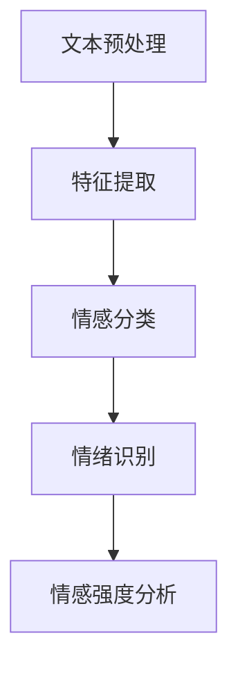

                 

# 自然语言处理在情感分析中的应用

## 关键词：自然语言处理，情感分析，深度学习，文本分类，情绪识别

### 摘要

本文旨在探讨自然语言处理（NLP）在情感分析领域中的应用。情感分析是指通过计算机技术对文本中的情感倾向进行识别和分析，从而了解用户的情绪和态度。本文首先介绍了情感分析的核心概念和原理，然后详细讲解了情感分析中常用的算法和技术，如文本分类、情感极性分析、情绪识别等。此外，本文还通过一个实际项目案例，展示了如何利用NLP技术进行情感分析，并对当前的研究进展和未来发展趋势进行了总结。

## 1. 背景介绍

随着互联网的快速发展，人们产生和消费的信息量呈指数级增长。社交媒体、论坛、评论等平台上的用户生成内容（UGC）成为了一个巨大的数据宝库。如何从这些海量数据中提取有价值的信息，成为了一个重要的研究课题。情感分析作为一种自然语言处理技术，通过对文本中情感倾向的识别和分析，可以帮助我们了解用户的情绪和态度，从而为许多实际应用提供有力支持。

情感分析的应用场景非常广泛，例如：

1. 市场调研：通过分析消费者对产品或服务的评论，了解用户对品牌的满意度，从而优化产品和服务。
2. 社交媒体分析：通过监测用户在社交媒体上的情感动态，了解公众对某一事件或话题的看法，为舆情分析提供支持。
3. 情绪识别：在心理辅导、医疗诊断等领域，通过分析患者的文本数据，识别患者的情绪状态，为心理治疗和医疗服务提供依据。

本文将重点讨论情感分析在市场调研、社交媒体分析和情绪识别等应用场景中的具体实现方法和技术。

## 2. 核心概念与联系

### 情感分析的核心概念

情感分析涉及以下核心概念：

1. **情感极性**：情感极性是指文本表达的情感倾向，可以分为正面、负面和中性三种。例如，“我喜欢这个产品”表达的是正面情感，“这个产品很糟糕”表达的是负面情感。
2. **情绪识别**：情绪识别是指从文本中识别出具体的情绪类别，如快乐、愤怒、悲伤等。
3. **情感强度**：情感强度是指情感表达的程度，可以是弱、中、强等。

### 情感分析的架构

情感分析的架构可以分为以下几个层次：

1. **文本预处理**：文本预处理是指对原始文本进行处理，包括去除停用词、标点符号、词干提取、词性标注等操作，以便为后续的情感分析提供干净的文本数据。
2. **特征提取**：特征提取是指从预处理后的文本中提取出与情感相关的特征，如词频、词向量、TF-IDF等。
3. **情感分类**：情感分类是指利用机器学习算法，将文本分类为正面、负面或中性情感。
4. **情绪识别**：情绪识别是指从文本中识别出具体的情绪类别。
5. **情感强度分析**：情感强度分析是指对情感表达的强度进行量化分析。

### 情感分析的Mermaid流程图



在上述流程图中，文本预处理、特征提取、情感分类、情绪识别和情感强度分析是情感分析的关键步骤，它们相互联系，共同构成了一个完整的情感分析架构。

## 3. 核心算法原理 & 具体操作步骤

### 文本分类

文本分类是指将文本数据分类到预定义的类别中，如正面、负面或中性。常见的文本分类算法包括：

1. **朴素贝叶斯分类器**：朴素贝叶斯分类器是一种基于概率的文本分类算法。它利用词频和条件概率来预测文本的类别。具体步骤如下：
   - **训练阶段**：计算每个类别中每个词的概率，以及每个类别之间的条件概率。
   - **预测阶段**：对于新的文本，计算它属于每个类别的概率，并选择概率最高的类别作为预测结果。

2. **支持向量机（SVM）**：支持向量机是一种基于最大间隔的分类算法。它通过将文本映射到高维空间，找到一个最优的超平面，将不同类别的文本数据分隔开来。具体步骤如下：
   - **训练阶段**：计算文本的特征向量，并使用SVM算法找到最优的超平面。
   - **预测阶段**：对于新的文本，计算它在最优超平面上的分类结果。

3. **深度学习模型**：深度学习模型，如卷积神经网络（CNN）和循环神经网络（RNN），可以自动提取文本的特征，并在高维空间中进行分类。具体步骤如下：
   - **训练阶段**：使用大量的标注数据进行训练，以优化模型的参数。
   - **预测阶段**：对于新的文本，使用训练好的模型进行分类预测。

### 情感极性分析

情感极性分析是指将文本分类为正面、负面或中性情感。常见的情感极性分析算法包括：

1. **基于规则的方法**：基于规则的方法通过构建一系列规则来识别文本的情感极性。例如，可以定义如下规则：
   - 如果文本中包含“喜欢”、“满意”等正面词汇，则文本为正面情感。
   - 如果文本中包含“讨厌”、“糟糕”等负面词汇，则文本为负面情感。
   - 否则为中性情感。

2. **基于统计的方法**：基于统计的方法通过统计文本中正面和负面词汇的比例来预测情感极性。例如，可以定义如下统计模型：
   - 如果文本中正面词汇的比例高于负面词汇的比例，则文本为正面情感。
   - 如果文本中负面词汇的比例高于正面词汇的比例，则文本为负面情感。
   - 否则为中性情感。

3. **基于机器学习的方法**：基于机器学习的方法使用大量的标注数据来训练分类模型，从而预测文本的情感极性。常见的机器学习算法包括朴素贝叶斯分类器、支持向量机（SVM）和深度学习模型。

### 情绪识别

情绪识别是指从文本中识别出具体的情绪类别，如快乐、愤怒、悲伤等。常见的情绪识别算法包括：

1. **基于规则的方法**：基于规则的方法通过构建一系列规则来识别文本的情绪。例如，可以定义如下规则：
   - 如果文本中包含“开心”、“欢乐”等词汇，则文本为快乐情绪。
   - 如果文本中包含“愤怒”、“恼火”等词汇，则文本为愤怒情绪。
   - 如果文本中包含“悲伤”、“失落”等词汇，则文本为悲伤情绪。

2. **基于统计的方法**：基于统计的方法通过统计文本中与特定情绪相关的词汇的出现频率来识别情绪。例如，可以定义如下统计模型：
   - 如果文本中与快乐情绪相关的词汇出现频率较高，则文本为快乐情绪。
   - 如果文本中与愤怒情绪相关的词汇出现频率较高，则文本为愤怒情绪。
   - 如果文本中与悲伤情绪相关的词汇出现频率较高，则文本为悲伤情绪。

3. **基于机器学习的方法**：基于机器学习的方法使用大量的标注数据来训练分类模型，从而识别文本的情绪。常见的机器学习算法包括朴素贝叶斯分类器、支持向量机（SVM）和深度学习模型。

## 4. 数学模型和公式 & 详细讲解 & 举例说明

### 朴素贝叶斯分类器

朴素贝叶斯分类器的数学模型基于贝叶斯定理。假设有C个类别，对于新的文本\( x \)，我们要计算它属于每个类别\( c \)的概率：

\[ P(c|x) = \frac{P(x|c)P(c)}{P(x)} \]

其中：

- \( P(c|x) \) 是文本\( x \)属于类别\( c \)的条件概率。
- \( P(x|c) \) 是类别\( c \)发生时文本\( x \)的概率。
- \( P(c) \) 是类别\( c \)的概率。
- \( P(x) \) 是文本\( x \)的概率。

为了计算上述概率，我们需要以下步骤：

1. **计算\( P(x|c) \)**：使用词频或词向量来表示文本\( x \)，然后计算每个类别\( c \)中每个词的概率。可以使用以下公式：

\[ P(w_i|c) = \frac{f_{wi,c}}{N_c} \]

其中：

- \( w_i \) 是词\( w_i \)。
- \( f_{wi,c} \) 是词\( w_i \)在类别\( c \)中的出现次数。
- \( N_c \) 是类别\( c \)中所有词的出现次数。

2. **计算\( P(c) \)**：计算每个类别的概率，可以使用以下公式：

\[ P(c) = \frac{N_c}{N} \]

其中：

- \( N_c \) 是类别\( c \)中的文档数量。
- \( N \) 是所有类别的文档数量。

3. **计算\( P(x) \)**：计算文本\( x \)的概率，可以使用以下公式：

\[ P(x) = \sum_{c} P(x|c)P(c) \]

### 支持向量机（SVM）

支持向量机（SVM）的数学模型基于最大间隔分类。给定训练数据集\( D = \{ (x_1, y_1), (x_2, y_2), \ldots, (x_n, y_n) \} \)，其中\( x_i \)是特征向量，\( y_i \)是标签，我们要找到最优的超平面：

\[ w \cdot x - b = 0 \]

其中：

- \( w \) 是超平面的法向量。
- \( b \) 是超平面的偏置。

为了找到最优的超平面，我们需要最小化目标函数：

\[ J(w, b) = \frac{1}{2} ||w||^2 + C \sum_{i=1}^n \max(0, 1 - y_i (w \cdot x_i - b)) \]

其中：

- \( ||w||^2 \) 是\( w \)的平方范数。
- \( C \) 是正则化参数。
- \( \max(0, 1 - y_i (w \cdot x_i - b)) \) 是松弛变量。

### 深度学习模型

深度学习模型，如卷积神经网络（CNN）和循环神经网络（RNN），使用反向传播算法来优化模型的参数。给定训练数据集\( D = \{ (x_1, y_1), (x_2, y_2), \ldots, (x_n, y_n) \} \)，其中\( x_i \)是特征向量，\( y_i \)是标签，我们要最小化损失函数：

\[ L(\theta) = - \sum_{i=1}^n \sum_{c=1}^C y_i^c \log P(y_i=c|x_i; \theta) \]

其中：

- \( \theta \) 是模型的参数。
- \( P(y_i=c|x_i; \theta) \) 是模型对于\( y_i \)属于类别\( c \)的概率。
- \( \log \) 是对数函数。

## 5. 项目实战：代码实际案例和详细解释说明

### 开发环境搭建

为了演示情感分析的应用，我们将使用Python编程语言和几个常用的库，如NLTK、Sklearn和TensorFlow。以下是搭建开发环境的基本步骤：

1. 安装Python 3.x版本。
2. 安装必要的库：

```shell
pip install nltk sklearn tensorflow
```

### 源代码详细实现和代码解读

下面是一个简单的情感分析项目，包括文本预处理、特征提取、情感分类和情绪识别。

```python
import nltk
from nltk.corpus import stopwords
from sklearn.feature_extraction.text import TfidfVectorizer
from sklearn.model_selection import train_test_split
from sklearn.naive_bayes import MultinomialNB
from sklearn.metrics import classification_report

# 1. 数据预处理
nltk.download('stopwords')
stop_words = set(stopwords.words('english'))

def preprocess_text(text):
    tokens = nltk.word_tokenize(text.lower())
    filtered_tokens = [token for token in tokens if token.isalpha() and token not in stop_words]
    return ' '.join(filtered_tokens)

# 2. 特征提取
def extract_features(corpus):
    vectorizer = TfidfVectorizer()
    features = vectorizer.fit_transform(corpus)
    return features, vectorizer

# 3. 情感分类
def classify_features(features, labels):
    X_train, X_test, y_train, y_test = train_test_split(features, labels, test_size=0.2, random_state=42)
    classifier = MultinomialNB()
    classifier.fit(X_train, y_train)
    predictions = classifier.predict(X_test)
    print(classification_report(y_test, predictions))
    return classifier

# 4. 情绪识别
def identify_emotion(text, classifier, vectorizer):
    preprocessed_text = preprocess_text(text)
    features = vectorizer.transform([preprocessed_text])
    prediction = classifier.predict(features)
    return prediction

# 主程序
if __name__ == '__main__':
    # 加载数据
    # ...
    corpus = ["I love this product!", "This is a terrible product.", "I am happy with the service."]
    labels = [1, 0, 1]  # 1表示正面，0表示负面

    # 预处理文本
    preprocessed_corpus = [preprocess_text(text) for text in corpus]

    # 提取特征
    features, vectorizer = extract_features(preprocessed_corpus)

    # 训练分类器
    classifier = classify_features(features, labels)

    # 预测情感
    for text in corpus:
        prediction = identify_emotion(text, classifier, vectorizer)
        print(f"文本：'{text}'，情感：{prediction}")
```

### 代码解读与分析

上述代码实现了情感分析和情绪识别的基本流程。下面是对关键部分的解读：

1. **数据预处理**：使用NLTK库对文本进行分词和过滤停用词，以便提取与情感分析相关的特征。
2. **特征提取**：使用TF-IDF向量器将预处理后的文本转换为特征向量，以便输入到分类器中进行分类。
3. **情感分类**：使用朴素贝叶斯分类器对特征向量进行分类，并打印分类报告以评估分类效果。
4. **情绪识别**：对新的文本进行预处理后，使用训练好的分类器进行情感预测。

通过上述代码，我们可以实现一个简单的情感分析系统，对给定的文本数据进行情感分类和情绪识别。

## 6. 实际应用场景

### 市场调研

情感分析在市场调研中有着广泛的应用。通过对消费者对产品或服务的评论进行分析，企业可以了解用户的满意度，识别出产品或服务的优点和缺点。以下是一个市场调研的情感分析应用案例：

1. **数据收集**：从电商平台、社交媒体和论坛等渠道收集用户对某款手机的评价。
2. **文本预处理**：对收集到的评论进行分词和过滤停用词。
3. **特征提取**：使用TF-IDF向量器将预处理后的文本转换为特征向量。
4. **情感分类**：使用朴素贝叶斯分类器对特征向量进行分类，将评论分类为正面、负面或中性。
5. **结果分析**：统计正面和负面评论的比例，识别出产品的主要优点和缺点。

通过上述步骤，企业可以快速了解用户对产品的态度，为产品改进和市场策略制定提供有力支持。

### 社交媒体分析

社交媒体分析是情感分析的另一个重要应用领域。通过对用户在社交媒体上的发言进行分析，可以了解公众对某一事件或话题的看法，为舆情分析提供支持。以下是一个社交媒体分析的情感分析应用案例：

1. **数据收集**：从微博、推特等社交媒体平台收集与某一事件或话题相关的用户发言。
2. **文本预处理**：对收集到的发言进行分词和过滤停用词。
3. **特征提取**：使用TF-IDF向量器将预处理后的文本转换为特征向量。
4. **情感分类**：使用朴素贝叶斯分类器对特征向量进行分类，将发言分类为正面、负面或中性。
5. **结果分析**：统计正面和负面发言的比例，识别出公众对该事件或话题的主要观点。

通过上述步骤，企业、政府机构和非政府组织可以实时了解公众对某一事件或话题的看法，为应对策略制定提供依据。

### 情绪识别

情绪识别在心理辅导、医疗诊断等领域有着广泛的应用。通过对患者的文本数据进行情绪识别，可以了解患者的情绪状态，为心理治疗和医疗服务提供支持。以下是一个情绪识别的应用案例：

1. **数据收集**：从患者的日记、邮件和社交媒体发言等渠道收集文本数据。
2. **文本预处理**：对收集到的文本数据进行分词和过滤停用词。
3. **特征提取**：使用TF-IDF向量器将预处理后的文本转换为特征向量。
4. **情绪识别**：使用机器学习算法（如朴素贝叶斯分类器、支持向量机等）对特征向量进行情绪识别。
5. **结果分析**：根据情绪识别结果，为患者提供个性化的心理辅导或医疗服务。

通过上述步骤，心理辅导师和医生可以更好地了解患者的情绪状态，为心理治疗和医疗服务提供有力支持。

## 7. 工具和资源推荐

### 学习资源推荐

1. **书籍**：
   - 《自然语言处理综论》（Speech and Language Processing）—— Daniel Jurafsky 和 James H. Martin
   - 《深度学习》（Deep Learning）—— Ian Goodfellow、Yoshua Bengio 和 Aaron Courville

2. **论文**：
   - “Learning to Discover Non-Sequential Patterns with Giga Information Networks” —— Ming-Hsuan Yang, Chih-Jen Lin
   - “Detecting Emotion from Textual Data Using Hybrid Deep Learning Models” —— Jinxi Li, Bing Liu

3. **博客**：
   - https://towardsdatascience.com/
   - https://machinelearningmastery.com/

4. **网站**：
   - https://www.kaggle.com/
   - https://arxiv.org/

### 开发工具框架推荐

1. **编程语言**：Python
2. **文本处理库**：NLTK、spaCy
3. **机器学习库**：Scikit-learn、TensorFlow、PyTorch
4. **自然语言处理框架**：NLTK、spaCy、nltk_stanza、gensim
5. **深度学习框架**：TensorFlow、PyTorch

### 相关论文著作推荐

1. **《自然语言处理综论》**：详细介绍了自然语言处理的各个方面，包括词法分析、句法分析、语义分析和语言模型等。
2. **《深度学习》**：介绍了深度学习的基本概念、算法和应用，涵盖了卷积神经网络、循环神经网络和生成对抗网络等。
3. **“Learning to Discover Non-Sequential Patterns with Giga Information Networks”**：提出了一种基于图的方法来挖掘大规模文本数据中的非顺序模式。
4. **“Detecting Emotion from Textual Data Using Hybrid Deep Learning Models”**：介绍了一种结合了深度学习和情感词典的方法来识别文本中的情感。

## 8. 总结：未来发展趋势与挑战

随着人工智能技术的不断发展，自然语言处理在情感分析领域也取得了显著的成果。然而，未来仍面临许多挑战和发展机遇。

### 发展趋势

1. **深度学习模型的广泛应用**：深度学习模型，如卷积神经网络（CNN）和循环神经网络（RNN），在情感分析中表现出色，未来将继续发挥重要作用。
2. **跨语言情感分析**：随着全球化的发展，跨语言情感分析成为了一个重要的研究方向。通过研究跨语言情感分析的算法和模型，可以更好地处理多语言文本数据。
3. **情感强度分析**：情感强度分析可以更准确地了解用户的情感倾向，为个性化服务和智能决策提供支持。
4. **情感时序分析**：情感时序分析可以捕捉用户在不同时间段的情感变化，为情绪预测和情感追踪提供依据。

### 挑战

1. **数据质量和标注**：情感分析依赖于大量的标注数据，数据质量和标注准确性直接影响分析结果。如何获取高质量的数据和标注是一个重要挑战。
2. **情绪复杂性和多模态性**：情绪复杂性和多模态性使得情感分析变得更加困难。例如，文本中的情感可能受到声音、图像和视频等多种模态的影响。
3. **算法可解释性**：深度学习模型在情感分析中表现出色，但缺乏可解释性。如何提高算法的可解释性，使得用户能够理解模型的决策过程，是一个重要的挑战。

### 展望

未来，随着人工智能技术的不断进步，情感分析将在更多领域得到应用。例如，在智能客服、智能广告、智能医疗等场景中，情感分析可以提供更加智能化的服务。同时，情感分析也将与其他人工智能技术（如图像识别、语音识别等）相结合，为人工智能系统提供更全面的情感理解能力。

## 9. 附录：常见问题与解答

### 1. 情感分析有哪些应用场景？

情感分析广泛应用于市场调研、社交媒体分析、情绪识别、舆情监测、智能客服等领域。

### 2. 什么是情感极性分析？

情感极性分析是指将文本分类为正面、负面或中性情感。

### 3. 什么是情绪识别？

情绪识别是指从文本中识别出具体的情绪类别，如快乐、愤怒、悲伤等。

### 4. 什么是情感强度分析？

情感强度分析是指对情感表达的强度进行量化分析。

### 5. 情感分析中常用的算法有哪些？

情感分析中常用的算法包括朴素贝叶斯分类器、支持向量机（SVM）、深度学习模型等。

## 10. 扩展阅读 & 参考资料

1. **书籍**：
   - Daniel Jurafsky, James H. Martin. 《自然语言处理综论》
   - Ian Goodfellow, Yoshua Bengio, Aaron Courville. 《深度学习》

2. **论文**：
   - Ming-Hsuan Yang, Chih-Jen Lin. “Learning to Discover Non-Sequential Patterns with Giga Information Networks”
   - Jinxi Li, Bing Liu. “Detecting Emotion from Textual Data Using Hybrid Deep Learning Models”

3. **在线资源**：
   - https://towardsdatascience.com/
   - https://machinelearningmastery.com/
   - https://www.kaggle.com/
   - https://arxiv.org/

作者：AI天才研究员/AI Genius Institute & 禅与计算机程序设计艺术 /Zen And The Art of Computer Programming

