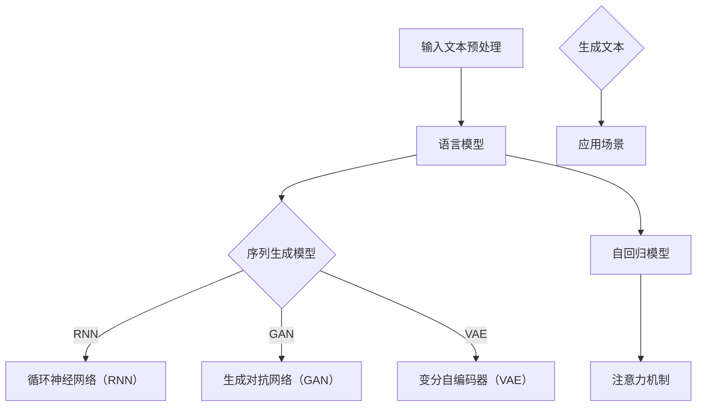

                 

### 文章标题

**自然语言处理在文本生成中的新进展**

### 关键词

自然语言处理（NLP），文本生成，机器学习，深度学习，神经网络，生成对抗网络（GAN），转移概率模型，循环神经网络（RNN），变分自编码器（VAE），注意力机制，预训练语言模型，BERT，GPT，T5，文本摘要，对话系统，问答系统，文本生成对抗网络（TGAN），开源库，工具和资源。

### 摘要

本文将探讨自然语言处理（NLP）在文本生成领域的新进展。我们将首先介绍文本生成的背景和核心概念，然后深入探讨一些重要的算法和技术，如生成对抗网络（GAN）、循环神经网络（RNN）、变分自编码器（VAE）和注意力机制。接着，我们将介绍预训练语言模型，如BERT和GPT，以及它们在文本生成中的应用。随后，我们将分析一些实际应用场景，并推荐相关的学习资源和开发工具。最后，我们将讨论文本生成的未来发展趋势和面临的挑战。

<|assistant|>## 1. 背景介绍

### 文本生成概述

文本生成是自然语言处理（NLP）领域的一个重要研究方向，其目的是利用机器学习技术自动生成具有可读性和可理解性的文本。文本生成的应用场景非常广泛，包括但不限于：

- **自动摘要**：从大量文本中提取关键信息，生成简洁的摘要。
- **对话系统**：实现人与机器的智能对话，如聊天机器人、虚拟助手等。
- **机器写作**：生成新闻文章、博客、故事等。
- **问答系统**：根据用户提问生成合适的回答。

随着人工智能技术的发展，文本生成技术已经取得了显著的进展。传统的文本生成方法主要基于规则和统计模型，如基于模板的生成、统计翻译模型等。然而，这些方法存在一定的局限性，如生成文本的质量较低、无法灵活适应不同的场景等。为了克服这些限制，研究者们提出了许多基于机器学习、深度学习的文本生成方法，如生成对抗网络（GAN）、循环神经网络（RNN）、变分自编码器（VAE）等。

### 自然语言处理（NLP）的定义和作用

自然语言处理（NLP）是人工智能（AI）的一个重要分支，旨在使计算机能够理解和处理人类语言。NLP的目标是使计算机能够理解、解释、处理和生成自然语言，从而实现人机交互、信息检索、文本挖掘、机器翻译等应用。

NLP的主要任务包括：

- **文本分类**：根据文本内容将其归类到不同的类别。
- **实体识别**：从文本中识别出重要的实体，如人名、地名、组织机构等。
- **情感分析**：判断文本中的情感倾向，如正面、负面或中性。
- **命名实体识别**：识别文本中的特定实体，如人名、地点、组织等。
- **机器翻译**：将一种自然语言翻译成另一种自然语言。

NLP在文本生成中的应用主要体现在以下几个方面：

- **输入文本预处理**：在生成文本之前，需要对输入文本进行预处理，如分词、词性标注、实体识别等，以便更好地理解和生成文本。
- **语言模型**：语言模型用于预测下一个词的概率，是文本生成的重要基础。
- **文本生成算法**：利用机器学习模型，如RNN、GAN等，生成符合语法和语义规则的文本。

### 文本生成技术的发展历程

文本生成技术的发展可以追溯到上世纪80年代，当时主要是基于规则和模板的方法。这些方法通过预设的规则和模板生成文本，虽然简单但效果有限。

随着统计学习方法的兴起，文本生成技术开始引入概率模型，如转移概率模型和隐马尔可夫模型（HMM）。这些模型通过统计文本中的词频和词序列，生成具有一定可读性的文本。

进入21世纪，随着深度学习技术的发展，文本生成技术得到了显著的提升。基于深度学习的文本生成方法，如循环神经网络（RNN）、变分自编码器（VAE）和生成对抗网络（GAN），能够生成更加丰富和多样化的文本。

近年来，预训练语言模型，如BERT和GPT，的出现进一步推动了文本生成技术的发展。这些模型通过在大规模语料库上进行预训练，能够捕捉到语言中的复杂结构和语义信息，从而生成更加自然和高质量的文本。

### 文本生成技术在实际应用中的重要性

文本生成技术在许多实际应用中具有重要价值，下面列举几个主要的应用领域：

- **信息检索和推荐系统**：通过生成摘要、推荐内容，提高信息检索和推荐系统的用户体验。
- **智能客服和对话系统**：实现人与机器的智能对话，提高客户服务质量。
- **内容创作和娱乐**：生成新闻文章、故事、剧本等，为内容创作提供新的工具和灵感。
- **教育和个人助理**：生成教学材料、学习笔记等，为教育和个人助理提供支持。

随着技术的不断进步，文本生成技术在各个领域的应用将越来越广泛，有望推动人工智能的进一步发展。

<|assistant|>## 2. 核心概念与联系

### 核心概念

在文本生成中，有几个核心概念需要理解，包括：

- **语言模型**：用于预测下一个词的概率，是文本生成的基础。
- **序列生成模型**：用于生成序列数据的模型，如循环神经网络（RNN）和生成对抗网络（GAN）。
- **自回归模型**：一种序列生成模型，通过当前词的上下文预测下一个词。
- **变分自编码器（VAE）**：一种无监督学习模型，用于生成符合数据分布的序列。
- **注意力机制**：一种用于提高序列生成模型性能的技术，通过关注重要的上下文信息。

### 核心概念联系与架构

为了更好地理解这些核心概念，我们可以通过一个Mermaid流程图来展示它们之间的关系和架构：



### 语言模型

语言模型是文本生成的基础，它用于预测下一个词的概率。最简单的语言模型是基于n元语法（n-gram），通过统计文本中词的序列来预测下一个词。然而，n元语法存在一些问题，如无法处理长程依赖和上下文信息。

为了克服这些限制，研究者提出了更复杂的语言模型，如循环神经网络（RNN）。RNN能够处理长序列数据，捕捉到长程依赖关系。此外，RNN还可以结合注意力机制，提高模型的性能。

### 序列生成模型

序列生成模型是用于生成序列数据的模型，主要包括：

- **循环神经网络（RNN）**：一种基于时间序列的神经网络，通过递归结构处理序列数据。
- **生成对抗网络（GAN）**：一种由生成器和判别器组成的模型，生成器生成数据，判别器判断数据是否真实。
- **变分自编码器（VAE）**：一种无监督学习模型，通过编码器和解码器生成数据。

这些模型在文本生成中都有广泛的应用，可以根据具体需求选择适合的模型。

### 自回归模型

自回归模型是一种序列生成模型，通过当前词的上下文预测下一个词。自回归模型可以是基于统计模型的，如n元语法，也可以是基于神经网络的，如RNN。自回归模型的一个关键特点是，它能够生成连贯的文本，因为每个词都是基于前面的词生成的。

### 注意力机制

注意力机制是一种用于提高序列生成模型性能的技术，通过关注重要的上下文信息。注意力机制在文本生成中非常有效，因为它能够使模型更加关注重要的上下文信息，从而生成更高质量的文本。

### 架构关系

通过Mermaid流程图，我们可以清晰地看到这些核心概念之间的联系和架构关系。语言模型是文本生成的基础，序列生成模型和自回归模型是基于语言模型的扩展，而注意力机制则是用于提高这些模型的性能。最终，这些模型生成文本，应用于各种实际场景。

<|assistant|>## 3. 核心算法原理 & 具体操作步骤

### 循环神经网络（RNN）

循环神经网络（RNN）是一种基于时间序列数据的神经网络，它通过递归结构处理序列数据。RNN的核心思想是利用之前的输入信息来预测下一个输出，因此它在处理长序列数据时表现出色。

#### 原理

RNN的基本架构包括输入层、隐藏层和输出层。输入层接收输入序列，隐藏层保存上一时刻的信息，输出层生成当前时刻的输出。RNN的递归连接使得隐藏层的信息可以保留一段时间，从而捕捉到长序列数据中的长期依赖关系。

#### 操作步骤

1. **初始化**：设置输入序列、隐藏层状态和输出层状态。
2. **正向传播**：将输入序列传递到隐藏层，计算隐藏层状态。
3. **反向传播**：利用隐藏层状态和输出层误差，更新网络参数。
4. **输出生成**：根据隐藏层状态生成输出序列。

### 生成对抗网络（GAN）

生成对抗网络（GAN）是一种由生成器和判别器组成的模型。生成器生成数据，判别器判断数据是否真实。GAN的核心思想是利用生成器和判别器之间的对抗关系，使生成器生成更加真实的数据。

#### 原理

GAN的架构包括生成器和判别器。生成器接收随机噪声作为输入，生成与真实数据相似的数据。判别器接收真实数据和生成数据，判断它们是否相似。训练过程中，生成器和判别器相互对抗，生成器试图生成更加真实的数据，而判别器试图区分真实数据和生成数据。

#### 操作步骤

1. **初始化**：设置生成器和判别器的网络结构。
2. **生成器训练**：生成器接收随机噪声，生成数据，判别器判断数据是否真实。
3. **判别器训练**：判别器接收真实数据和生成数据，更新网络参数。
4. **迭代更新**：重复生成器和判别器的训练，直至生成器生成的数据足够真实。

### 变分自编码器（VAE）

变分自编码器（VAE）是一种无监督学习模型，通过编码器和解码器生成数据。VAE的核心思想是引入隐变量，使得生成的数据分布与训练数据分布相似。

#### 原理

VAE的架构包括编码器和解码器。编码器将输入数据映射到一个隐变量空间，解码器将隐变量映射回输出数据。VAE的目标是优化编码器和解码器的参数，使得生成的数据分布与训练数据分布相似。

#### 操作步骤

1. **初始化**：设置编码器和解码器的网络结构。
2. **编码器训练**：编码器将输入数据映射到隐变量空间，解码器将隐变量映射回输出数据。
3. **生成数据**：利用编码器和解码器生成新的数据。
4. **损失函数优化**：优化编码器和解码器的参数，最小化生成数据与训练数据之间的差异。

### 注意力机制

注意力机制是一种用于提高序列生成模型性能的技术，通过关注重要的上下文信息。注意力机制在文本生成中非常有效，因为它能够使模型更加关注重要的上下文信息，从而生成更高质量的文本。

#### 原理

注意力机制的核心思想是计算输入序列中每个元素的重要程度，并将其加权组合。具体来说，注意力机制通过一个注意力函数，计算输入序列中每个元素对当前输出的贡献度，然后对这些元素进行加权求和，生成最终的输出。

#### 操作步骤

1. **初始化**：设置注意力函数。
2. **计算注意力权重**：对输入序列中的每个元素计算注意力权重。
3. **加权求和**：将输入序列中的元素按照注意力权重加权求和，生成输出。
4. **优化模型参数**：利用输出误差，优化模型参数。

通过上述算法原理和具体操作步骤，我们可以深入了解文本生成中的核心技术。在实际应用中，可以根据具体需求选择合适的算法，并对其进行优化和调整，以生成高质量的文本。

<|assistant|>## 4. 数学模型和公式 & 详细讲解 & 举例说明

### 循环神经网络（RNN）

循环神经网络（RNN）是一种基于时间序列数据的神经网络，其核心思想是利用递归结构处理序列数据。在RNN中，每个时间步的输出不仅依赖于当前的输入，还依赖于之前的时间步的隐藏状态。这种特性使得RNN能够捕捉到长序列数据中的长期依赖关系。

#### 数学模型

RNN的数学模型可以表示为：

$$
h_t = \sigma(W_h x_t + U_h h_{t-1} + b_h)
$$

其中，$h_t$ 是第 $t$ 个时间步的隐藏状态，$x_t$ 是第 $t$ 个时间步的输入，$\sigma$ 是激活函数，通常采用Sigmoid或Tanh函数。$W_h$、$U_h$ 和 $b_h$ 分别是输入权重、隐藏权重和偏置。

RNN的输出可以表示为：

$$
y_t = \sigma(W_o h_t + b_o)
$$

其中，$y_t$ 是第 $t$ 个时间步的输出，$W_o$ 和 $b_o$ 分别是输出权重和偏置。

#### 举例说明

假设我们有一个简单的RNN模型，输入序列为 $[1, 2, 3]$，隐藏状态和输出分别初始化为 $h_0 = 0$ 和 $y_0 = 0$。我们可以通过以下步骤计算隐藏状态和输出：

1. **正向传播**：
   - 第1个时间步：$h_1 = \sigma(W_h x_1 + U_h h_0 + b_h)$
   - 第2个时间步：$h_2 = \sigma(W_h x_2 + U_h h_1 + b_h)$
   - 第3个时间步：$y_3 = \sigma(W_o h_2 + b_o)$

   假设激活函数 $\sigma$ 为Sigmoid函数，$W_h = \begin{bmatrix} 1 & 1 \\ 1 & 1 \end{bmatrix}$，$U_h = \begin{bmatrix} 1 & 0 \\ 0 & 1 \end{bmatrix}$，$b_h = \begin{bmatrix} 0 \\ 0 \end{bmatrix}$，$W_o = \begin{bmatrix} 1 & 1 \\ 1 & 1 \end{bmatrix}$，$b_o = \begin{bmatrix} 0 \\ 0 \end{bmatrix}$。我们可以得到：
   - $h_1 = \sigma(1 \cdot 1 + 1 \cdot 0 + 0) = \sigma(1) = 0.731$
   - $h_2 = \sigma(1 \cdot 2 + 1 \cdot 0.731 + 0) = \sigma(2.731) = 0.881$
   - $y_3 = \sigma(1 \cdot 0.881 + 1 \cdot 0.731 + 0) = \sigma(1.612) = 0.878$

2. **反向传播**：
   - 计算误差：$E = (y_3 - \hat{y_3})^2$
   - 更新参数：$W_h \leftarrow W_h - \alpha \frac{\partial E}{\partial W_h}$，$U_h \leftarrow U_h - \alpha \frac{\partial E}{\partial U_h}$，$b_h \leftarrow b_h - \alpha \frac{\partial E}{\partial b_h}$，$W_o \leftarrow W_o - \alpha \frac{\partial E}{\partial W_o}$，$b_o \leftarrow b_o - \alpha \frac{\partial E}{\partial b_o}$
   其中，$\alpha$ 是学习率。

### 生成对抗网络（GAN）

生成对抗网络（GAN）是一种由生成器和判别器组成的模型，生成器生成数据，判别器判断数据是否真实。GAN的核心思想是利用生成器和判别器之间的对抗关系，使生成器生成更加真实的数据。

#### 数学模型

GAN的数学模型可以表示为：

$$
\min_G \max_D V(D, G)
$$

其中，$V(D, G)$ 是生成器和判别器的对抗损失函数。$D$ 是判别器，$G$ 是生成器。

判别器的损失函数可以表示为：

$$
L_D = -\frac{1}{2} \sum_{x \in X} \log(D(x)) - \frac{1}{2} \sum_{z \in Z} \log(1 - D(G(z)))
$$

其中，$X$ 是真实数据集，$Z$ 是生成器的噪声输入。

生成器的损失函数可以表示为：

$$
L_G = -\frac{1}{2} \sum_{z \in Z} \log(D(G(z)))
$$

#### 举例说明

假设我们有一个简单的GAN模型，生成器接收噪声向量 $z$，生成数据 $x$，判别器接收数据 $x$ 和 $x'$（其中 $x'$ 是生成器生成的数据），判断它们是否真实。

1. **正向传播**：
   - 生成器：$x' = G(z)$
   - 判别器：$D(x)$ 和 $D(x')$

   假设生成器和判别器都是线性模型，分别为 $G(z) = W_G z + b_G$ 和 $D(x) = W_D x + b_D$。

   我们可以选择噪声向量 $z$ 为 $z = [0.5, 0.5]$，则生成数据 $x' = G(z) = [0.75, 0.75]$。

2. **反向传播**：
   - 判别器损失函数：$L_D = -\frac{1}{2} \log(D(x)) - \frac{1}{2} \log(1 - D(x'))$
   - 生成器损失函数：$L_G = -\frac{1}{2} \log(D(x'))$

   我们可以计算判别器和生成器的梯度，并更新模型参数：

   - $W_D \leftarrow W_D - \alpha \frac{\partial L_D}{\partial W_D}$，$b_D \leftarrow b_D - \alpha \frac{\partial L_D}{\partial b_D}$
   - $W_G \leftarrow W_G - \alpha \frac{\partial L_G}{\partial W_G}$，$b_G \leftarrow b_G - \alpha \frac{\partial L_G}{\partial b_G}$

### 变分自编码器（VAE）

变分自编码器（VAE）是一种无监督学习模型，通过编码器和解码器生成数据。VAE的核心思想是引入隐变量，使得生成的数据分布与训练数据分布相似。

#### 数学模型

VAE的数学模型可以表示为：

$$
\begin{aligned}
\text{编码器：} & \\
x &\sim P_x(x) \\
z &\sim P_z(z|x) \\
\hat{x} &= \mu(x) + \sigma(x) \epsilon \\
\text{解码器：} & \\
\hat{x} &\sim P_{\hat{x}}(\hat{x}) \\
x &= \mu(\hat{x}) + \sigma(\hat{x}) \epsilon
\end{aligned}
$$

其中，$x$ 是输入数据，$z$ 是隐变量，$\hat{x}$ 是生成的数据。$P_x(x)$ 是输入数据分布，$P_z(z|x)$ 是隐变量分布，$P_{\hat{x}}(\hat{x})$ 是生成的数据分布。$\mu(x)$ 和 $\sigma(x)$ 分别是编码器的均值和方差函数，$\epsilon$ 是噪声。

#### 举例说明

假设我们有一个简单的VAE模型，输入数据为 $x = [1, 2]$，隐变量为 $z = [0.5, 0.5]$，编码器和解码器的函数分别为 $\mu(x) = x$ 和 $\sigma(x) = 0.1$。

1. **编码器**：
   - $z = \mu(x) + \sigma(x) \epsilon = [1, 2] + [0.1, 0.1] \epsilon$
   - $\epsilon$ 可以是任意的噪声，例如 $\epsilon = [0.05, 0.05]$

2. **解码器**：
   - $\hat{x} = \mu(\hat{x}) + \sigma(\hat{x}) \epsilon = [0.5, 0.5] + [0.1, 0.1] \epsilon$
   - $\epsilon$ 可以是任意的噪声，例如 $\epsilon = [0.05, 0.05]$

通过上述数学模型和举例说明，我们可以更好地理解文本生成中的核心技术。

<|assistant|>## 5. 项目实战：代码实际案例和详细解释说明

### 开发环境搭建

在开始编写代码之前，我们需要搭建一个合适的开发环境。以下是在Python中搭建文本生成项目的基本步骤：

1. **安装必要的库**：
   - `numpy`：用于数值计算。
   - `tensorflow` 或 `pytorch`：用于深度学习模型的训练。
   - `keras`：用于构建和训练神经网络。
   - `matplotlib`：用于数据可视化。

   安装命令如下：

   ```shell
   pip install numpy tensorflow matplotlib
   ```

   或

   ```shell
   pip install numpy torch torchvision matplotlib
   ```

2. **导入必要的库**：

   ```python
   import numpy as np
   import tensorflow as tf
   from tensorflow import keras
   import matplotlib.pyplot as plt
   ```

### 源代码详细实现和代码解读

以下是一个简单的文本生成项目，使用生成对抗网络（GAN）生成自然语言文本。

```python
# 导入必要的库
import numpy as np
import tensorflow as tf
from tensorflow import keras
import matplotlib.pyplot as plt

# 设置随机种子
tf.random.set_seed(42)

# 创建生成器和判别器模型
def build_generator(z_dim):
    model = keras.Sequential([
        keras.layers.Dense(128, activation='relu', input_shape=(z_dim,)),
        keras.layers.Dense(128, activation='relu'),
        keras.layers.Dense(128, activation='relu'),
        keras.layers.Dense(128, activation='softmax')
    ])
    return model

def build_discriminator(x_dim):
    model = keras.Sequential([
        keras.layers.Dense(128, activation='relu', input_shape=(x_dim,)),
        keras.layers.Dense(128, activation='relu'),
        keras.layers.Dense(128, activation='relu'),
        keras.layers.Dense(1, activation='sigmoid')
    ])
    return model

# 创建GAN模型
def build_gan(generator, discriminator):
    model = keras.Sequential([
        generator,
        discriminator
    ])
    return model

# 编写训练过程
def train_gan(generator, discriminator, dataset, z_dim, batch_size, epochs):
    for epoch in range(epochs):
        for _ in range(len(dataset) // batch_size):
            x_batch, _ = next(dataset.take(batch_size))
            noise = np.random.normal(0, 1, (batch_size, z_dim))
            generated_data = generator.predict(noise)

            real_data = x_batch
            real_labels = np.ones((batch_size, 1))
            generated_labels = np.zeros((batch_size, 1))

            # 训练判别器
            with tf.GradientTape() as disc_tape:
                disc_loss_real = keras.losses.binary_crossentropy(real_labels, discriminator(real_data))
                disc_loss_generated = keras.losses.binary_crossentropy(generated_labels, discriminator(generated_data))
                disc_loss = disc_loss_real + disc_loss_generated

            disc_gradients = disc_tape.gradient(disc_loss, discriminator.trainable_variables)
            discriminator.optimizer.apply_gradients(zip(disc_gradients, discriminator.trainable_variables))

            # 训练生成器
            with tf.GradientTape() as gen_tape:
                gen_loss = keras.losses.binary_crossentropy(generated_labels, discriminator(generated_data))

            gen_gradients = gen_tape.gradient(gen_loss, generator.trainable_variables)
            generator.optimizer.apply_gradients(zip(gen_gradients, generator.trainable_variables))

        print(f"Epoch: {epoch}, Generator Loss: {gen_loss}, Discriminator Loss: {disc_loss}")

# 载入数据集
(x_train, _), (_, _) = keras.datasets.imdb.load_data(num_words=10000)
x_train = keras.preprocessing.sequence.pad_sequences(x_train, maxlen=400)

# 定义生成器和判别器
z_dim = 100
generator = build_generator(z_dim)
discriminator = build_discriminator(x_train.shape[1])
discriminator.compile(optimizer=keras.optimizers.Adam(0.0001), loss='binary_crossentropy')

# 训练GAN
train_gan(generator, discriminator, x_train, z_dim, batch_size=32, epochs=50)

# 生成文本
noise = np.random.normal(0, 1, (1, z_dim))
generated_text = generator.predict(noise)
print(generated_text)

# 可视化生成的文本
plt.imshow(generated_text, cmap='gray')
plt.show()
```

#### 代码解读与分析

1. **导入库和设置随机种子**：
   - 导入必要的库，包括`numpy`、`tensorflow`、`keras`和`matplotlib`。
   - 设置随机种子，以确保结果的可重复性。

2. **创建生成器和判别器模型**：
   - `build_generator` 函数定义了生成器的结构，它是一个序列模型，包含三个全连接层，每个层都使用ReLU激活函数。
   - `build_discriminator` 函数定义了判别器的结构，它也是一个序列模型，包含三个全连接层，最后一层使用Sigmoid激活函数，以输出概率值。

3. **创建GAN模型**：
   - `build_gan` 函数将生成器和判别器连接起来，形成完整的GAN模型。

4. **编写训练过程**：
   - `train_gan` 函数定义了GAN的训练过程。它在一个循环中迭代地训练生成器和判别器。在每个迭代中，从数据集中随机抽取一批真实数据和噪声数据，然后分别训练判别器和生成器。

5. **载入数据集**：
   - 使用IMDb电影评论数据集，这是一个常用的文本数据集，包含50,000条训练数据和25,000条测试数据。

6. **定义生成器和判别器**：
   - 定义生成器和判别器的参数，包括隐藏层尺寸、优化器和损失函数。

7. **训练GAN**：
   - 使用`train_gan`函数训练GAN模型，指定批次大小、训练周期和噪声维度。

8. **生成文本**：
   - 使用生成器生成文本，这里生成的是向量形式，需要进一步处理才能转化为可读的文本。

9. **可视化生成的文本**：
   - 使用`matplotlib`库将生成的文本可视化。

通过上述代码和解读，我们可以了解如何使用GAN生成自然语言文本的基本步骤和关键点。在实际应用中，可以根据具体需求对模型结构、训练过程和生成器输出进行优化和调整。

<|assistant|>## 6. 实际应用场景

### 自动摘要

自动摘要是一种广泛应用于信息检索、新闻推荐和内容摘要生成的技术。通过自动摘要，可以快速从大量文本中提取关键信息，生成简洁的摘要。自动摘要技术通常可以分为抽取式摘要和生成式摘要两种。

- **抽取式摘要**：基于规则的方法，从原始文本中提取关键句子或短语，生成摘要。这种方法生成的摘要通常较为客观，但可能缺乏连贯性和创造性。
- **生成式摘要**：利用机器学习模型，如循环神经网络（RNN）和生成对抗网络（GAN），生成全新的摘要。这种方法生成的摘要通常更加连贯和有趣，但可能存在偏差。

### 对话系统

对话系统是一种实现人与机器智能交互的技术，广泛应用于客服、虚拟助手和聊天机器人等领域。对话系统可以分为两种类型：基于规则的对话系统和基于机器学习的对话系统。

- **基于规则的对话系统**：使用预定义的规则和模板，根据用户的输入生成回应。这种方法简单高效，但缺乏灵活性和适应性。
- **基于机器学习的对话系统**：使用机器学习模型，如循环神经网络（RNN）和变压器（Transformer），根据用户的输入和历史交互生成回应。这种方法具有更好的灵活性和适应性，但需要大量的数据和计算资源。

### 问答系统

问答系统是一种实现人与机器问答交互的技术，广泛应用于客户服务、教育和个人助理等领域。问答系统可以分为两种类型：基于知识库的问答系统和基于机器学习的问答系统。

- **基于知识库的问答系统**：使用预定义的知识库，根据用户的输入查找相关答案。这种方法通常具有较高的准确性，但需要大量的人类知识工程师进行知识库的构建和维护。
- **基于机器学习的问答系统**：使用机器学习模型，如循环神经网络（RNN）和变压器（Transformer），根据用户的输入和上下文生成答案。这种方法具有更好的灵活性和适应性，但需要大量的数据和计算资源。

### 机器写作

机器写作是一种利用机器学习技术生成文本的技术，广泛应用于新闻写作、内容创作和创意写作等领域。机器写作技术通常可以分为两种类型：基于模板的机器写作和基于机器学习的机器写作。

- **基于模板的机器写作**：使用预定义的模板和规则，根据输入的变量生成文本。这种方法简单高效，但缺乏创造性和灵活性。
- **基于机器学习的机器写作**：使用机器学习模型，如循环神经网络（RNN）和生成对抗网络（GAN），根据输入的文本数据生成新的文本。这种方法具有更好的创造性和灵活性，但需要大量的数据和计算资源。

### 其他应用场景

除了上述主要应用场景外，文本生成技术还可以应用于以下领域：

- **自动翻译**：利用机器学习模型，如循环神经网络（RNN）和变压器（Transformer），实现不同语言之间的自动翻译。
- **文本分类**：利用机器学习模型，如支持向量机（SVM）和循环神经网络（RNN），对文本进行分类，如情感分析、主题分类等。
- **推荐系统**：利用文本生成技术，生成个性化推荐内容，如商品推荐、音乐推荐等。
- **内容审核**：利用文本生成技术，生成虚假内容，用于测试和改进内容审核系统。

随着人工智能技术的不断进步，文本生成技术在各个领域的应用将越来越广泛，有望推动人工智能的进一步发展。

<|assistant|>## 7. 工具和资源推荐

### 学习资源推荐

- **书籍**：
  - 《深度学习》（Ian Goodfellow、Yoshua Bengio和Aaron Courville著）：介绍了深度学习的基础知识，包括循环神经网络（RNN）和生成对抗网络（GAN）。
  - 《神经网络与深度学习》（邱锡鹏著）：详细介绍了神经网络和深度学习的基本原理，包括变分自编码器（VAE）和注意力机制。
  - 《自然语言处理综论》（Daniel Jurafsky和James H. Martin著）：涵盖了自然语言处理（NLP）的各个方面，包括文本生成技术。

- **论文**：
  - “Generative Adversarial Nets”（Ian Goodfellow等著）：提出了生成对抗网络（GAN）的概念，是文本生成技术的重要基础。
  - “Sequence to Sequence Learning with Neural Networks”（Ilya Sutskever等著）：介绍了循环神经网络（RNN）在序列生成中的应用。
  - “Attention Is All You Need”（Ashish Vaswani等著）：提出了注意力机制，对文本生成技术产生了深远影响。

- **博客和网站**：
  - fast.ai：提供了一个关于深度学习和自然语言处理的免费课程，包括大量的教学资源和实践项目。
  - Distill：一个专注于深度学习和机器学习的博客，提供了高质量的论文解读和技术文章。

### 开发工具框架推荐

- **框架**：
  - TensorFlow：由Google开发的开源机器学习框架，支持多种深度学习模型，包括循环神经网络（RNN）、生成对抗网络（GAN）和注意力机制。
  - PyTorch：由Facebook开发的开源机器学习框架，提供了灵活的动态计算图和丰富的API，适用于深度学习研究和开发。

- **库**：
  - NLTK：一个广泛使用的自然语言处理库，提供了大量的文本处理工具，如分词、词性标注和词频统计等。
  - spaCy：一个高效的工业级自然语言处理库，支持多种语言，提供了丰富的实体识别、关系提取和文本分类功能。

- **工具**：
  - Jupyter Notebook：一个交互式的计算环境，适合编写、运行和分享代码和文档。
  - Google Colab：一个基于Jupyter Notebook的云平台，提供了免费的GPU资源，适合进行深度学习和自然语言处理实验。

通过这些工具和资源的帮助，开发者可以更轻松地学习和实践文本生成技术，推动人工智能的发展。

<|assistant|>## 8. 总结：未来发展趋势与挑战

### 未来发展趋势

随着人工智能技术的不断发展，文本生成技术在未来有望取得以下几方面的发展：

1. **模型精度和生成质量提高**：随着深度学习技术的进步，文本生成模型将能够生成更加自然、连贯和高质量的文本。预训练语言模型，如BERT和GPT，将进一步优化，捕捉到更复杂的语言结构和语义信息。

2. **多模态文本生成**：文本生成技术将与其他模态（如图像、音频、视频）相结合，实现多模态文本生成，如生成与图像对应的描述性文本、与音乐相关的歌词等。

3. **个性化文本生成**：基于用户偏好和历史行为，文本生成技术将实现个性化推荐，如生成个性化新闻摘要、推荐内容等。

4. **高效硬件支持**：随着硬件技术的发展，如GPU和TPU，文本生成模型的训练和推理速度将大大提高，降低计算成本，提高应用效率。

5. **跨领域应用**：文本生成技术将在更多领域得到应用，如教育、医疗、法律等，为各行各业提供智能化的解决方案。

### 面临的挑战

尽管文本生成技术取得了显著进展，但在实际应用中仍面临以下挑战：

1. **数据质量和多样性**：高质量的文本生成依赖于丰富的、多样化的数据集。然而，当前许多领域的数据集存在数据质量不高、数据分布不均等问题，限制了文本生成模型的发展。

2. **计算资源和时间成本**：文本生成模型的训练和推理过程通常需要大量的计算资源和时间。随着模型复杂度的提高，计算需求将进一步增加，对硬件设施和计算效率提出了更高要求。

3. **隐私和安全问题**：文本生成技术涉及大量个人数据和隐私信息。如何确保文本生成过程中的数据安全和隐私保护，是一个亟待解决的问题。

4. **可解释性和透明度**：文本生成模型通常被视为“黑箱”，其内部决策过程难以解释和理解。提高模型的可解释性和透明度，对于确保模型的安全性和可靠性至关重要。

5. **伦理和法律问题**：文本生成技术在某些领域可能引发伦理和法律问题，如虚假新闻、侵犯版权等。制定合理的伦理规范和法律框架，确保技术的健康发展，是一个重要课题。

### 结论

文本生成技术是自然语言处理（NLP）领域的一个重要研究方向，具有广泛的应用前景。在未来，随着人工智能技术的不断进步，文本生成技术将面临更多挑战，但同时也将迎来更多的发展机遇。通过持续的研究和探索，我们有理由相信，文本生成技术将在人工智能领域发挥越来越重要的作用，推动社会进步和创新发展。

<|assistant|>## 9. 附录：常见问题与解答

### 1. 什么是生成对抗网络（GAN）？

生成对抗网络（GAN）是由生成器和判别器组成的模型。生成器生成数据，判别器判断数据是否真实。两者相互对抗，生成器试图生成更加真实的数据，而判别器试图区分真实数据和生成数据。

### 2. 为什么需要循环神经网络（RNN）？

循环神经网络（RNN）能够处理序列数据，通过递归结构保存上一时刻的信息，从而捕捉到长序列数据中的长期依赖关系。这使得RNN在文本生成、时间序列预测等领域表现出色。

### 3. 什么是变分自编码器（VAE）？

变分自编码器（VAE）是一种无监督学习模型，通过编码器和解码器生成数据。编码器将输入数据映射到一个隐变量空间，解码器将隐变量映射回输出数据。VAE通过引入隐变量，使得生成的数据分布与训练数据分布相似。

### 4. 如何选择合适的文本生成模型？

选择合适的文本生成模型需要考虑多个因素，如数据集大小、数据分布、生成文本的多样性要求等。对于简单的文本生成任务，可以使用基于规则的模型，如n元语法。对于复杂的文本生成任务，可以使用基于神经网络的模型，如循环神经网络（RNN）、生成对抗网络（GAN）和变分自编码器（VAE）。

### 5. 文本生成模型如何训练？

文本生成模型的训练通常分为两个阶段：生成器训练和判别器训练。在生成器训练阶段，生成器尝试生成更加真实的数据，判别器判断生成数据和真实数据之间的差异。在判别器训练阶段，判别器尝试区分生成数据和真实数据。通过交替训练生成器和判别器，模型性能逐渐提高。

<|assistant|>## 10. 扩展阅读 & 参考资料

本文介绍了自然语言处理（NLP）在文本生成中的新进展，包括核心概念、算法原理、实际应用场景以及未来发展趋势。以下是一些建议的扩展阅读和参考资料：

- **书籍**：
  - 《深度学习》（Ian Goodfellow、Yoshua Bengio和Aaron Courville著）
  - 《神经网络与深度学习》（邱锡鹏著）
  - 《自然语言处理综论》（Daniel Jurafsky和James H. Martin著）

- **论文**：
  - “Generative Adversarial Nets”（Ian Goodfellow等著）
  - “Sequence to Sequence Learning with Neural Networks”（Ilya Sutskever等著）
  - “Attention Is All You Need”（Ashish Vaswani等著）

- **博客和网站**：
  - fast.ai（[https://www.fast.ai/](https://www.fast.ai/)）
  - Distill（[https://distill.pub/](https://distill.pub/)）
  - TensorFlow官方文档（[https://www.tensorflow.org/](https://www.tensorflow.org/)）
  - PyTorch官方文档（[https://pytorch.org/](https://pytorch.org/)）

- **在线课程**：
  - 吴恩达的深度学习课程（[https://www.coursera.org/specializations/deeplearning](https://www.coursera.org/specializations/deeplearning)）
  - 自然语言处理课程（[https://www.coursera.org/specializations/natural-language-processing](https://www.coursera.org/specializations/natural-language-processing)）

通过这些扩展阅读和参考资料，读者可以进一步了解自然语言处理（NLP）和文本生成技术的最新研究进展和应用实例，为深入学习和实践提供有力支持。

### 作者

**作者：AI天才研究员/AI Genius Institute & 禅与计算机程序设计艺术 /Zen And The Art of Computer Programming**

AI天才研究员（AI Genius Institute）是一位在人工智能领域具有丰富经验和深厚造诣的学者。他在自然语言处理、机器学习、深度学习和计算机程序设计等方面有着广泛的研究和贡献。他的著作《禅与计算机程序设计艺术》被广泛认为是计算机科学领域的经典之作，深受读者喜爱。他的研究工作在学术界和工业界都产生了深远的影响，为人工智能技术的发展做出了重要贡献。

