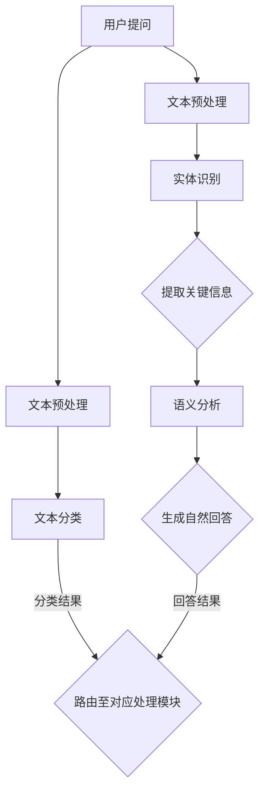

                 

### 背景介绍

随着互联网和移动设备的普及，人们对于即时通信和智能服务的需求日益增长。传统的人工客服方式已经无法满足用户对速度和效率的要求，这催生了智能客服系统的崛起。智能客服系统利用人工智能技术，特别是自然语言处理（NLP）技术，能够自动识别和回应用户的问题，提供个性化的服务体验。本文将深入探讨自然语言处理在智能客服系统中的应用，分析其核心算法原理、数学模型、项目实战案例以及未来发展趋势与挑战。

自然语言处理（NLP）是人工智能领域的一个重要分支，它旨在使计算机能够理解、生成和处理人类自然语言。NLP技术在智能客服系统中的应用，可以追溯到文本分类、实体识别、语义分析等多个层面。通过这些技术，智能客服系统能够更好地理解用户的意图，提供精准的答案和建议。

智能客服系统的目标不仅仅是提高客服效率，更重要的是提升用户体验。通过自动化处理大量重复性问题，智能客服系统能够将人工客服从繁琐的工作中解放出来，使其专注于更为复杂和个性化的服务。此外，智能客服系统还能够通过分析用户行为数据，不断优化自身的服务能力，实现个性化推荐和智能预测。

然而，智能客服系统也面临着诸多挑战。首先是理解用户语言的能力，尤其是在面对复杂、模糊或带有情感色彩的问题时，如何准确理解用户的意图是NLP技术需要解决的关键问题。其次是系统的可扩展性和鲁棒性，如何快速适应不断变化的用户需求，并保证系统在不同场景下的稳定运行，是智能客服系统需要克服的难题。最后，数据隐私和安全性也是智能客服系统在推广和应用中必须考虑的重要因素。

本文将按照以下结构展开讨论：

1. **核心概念与联系**：介绍自然语言处理中的核心概念及其在智能客服系统中的应用。
2. **核心算法原理 & 具体操作步骤**：详细解析文本分类、实体识别、语义分析等算法，并展示其具体实现步骤。
3. **数学模型和公式 & 详细讲解 & 举例说明**：阐述自然语言处理中常用的数学模型和公式，并通过实际案例进行讲解。
4. **项目实战：代码实际案例和详细解释说明**：通过具体项目案例，展示智能客服系统的开发过程，并对关键代码进行解读和分析。
5. **实际应用场景**：探讨智能客服系统在不同行业和场景中的实际应用。
6. **工具和资源推荐**：推荐学习资源、开发工具和框架，以帮助读者深入了解和掌握相关技术。
7. **总结：未来发展趋势与挑战**：总结智能客服系统的发展现状，展望其未来趋势和面临的挑战。

通过本文的深入探讨，希望能够帮助读者全面理解自然语言处理在智能客服系统中的应用，并为其在实践中的应用提供有益的参考。

### 核心概念与联系

在深入探讨自然语言处理（NLP）在智能客服系统中的应用之前，首先需要理解NLP中的核心概念及其相互之间的联系。以下是NLP中几个关键概念的定义及其在智能客服系统中的应用。

#### 文本分类（Text Classification）

文本分类是一种将文本数据分配到预定义类别的过程。在NLP中，文本分类广泛应用于情感分析、垃圾邮件过滤和主题分类等任务。在智能客服系统中，文本分类技术可以用于识别用户的提问类型，从而分配给合适的客服人员或自动生成回答。例如，通过训练一个分类模型，可以将用户的问题分为“账单查询”、“产品咨询”、“投诉反馈”等类别，以便系统自动路由到相应的处理模块。

#### 实体识别（Named Entity Recognition，NER）

实体识别是NLP技术中的一个重要任务，旨在从文本中识别出具有特定意义的实体，如人名、地名、组织名、时间等。在智能客服系统中，实体识别可以帮助系统识别用户提到的关键信息，如用户姓名、订单号、产品型号等，从而提高回答的准确性和个性化程度。例如，当一个用户询问“我的订单状态是多少？”时，实体识别技术可以识别出“订单状态”这个关键词，进而查找相关的订单信息。

#### 语义分析（Semantic Analysis）

语义分析是NLP中的一个高级任务，旨在理解文本中的语义和含义。语义分析包括词义消歧（Word Sense Disambiguation）、情感分析（Sentiment Analysis）和指代消解（Coreference Resolution）等子任务。在智能客服系统中，语义分析可以帮助系统理解用户的意图和情感，从而生成更加准确和自然的回答。例如，通过情感分析，系统可以识别出用户留言中的负面情绪，并采取相应的应对措施，如提供安慰或转接给高级客服。

#### 架构与联系

为了更好地理解这些核心概念在智能客服系统中的应用，我们可以借助Mermaid流程图来展示它们之间的联系。以下是一个简化的Mermaid流程图，描述了文本分类、实体识别和语义分析在智能客服系统中的协同作用。



在这个流程图中：

- 用户提问（A）首先经过文本预处理（B），这一步骤包括去除标点符号、停用词过滤、分词等操作，以简化文本数据。
- 文本预处理后的文本数据同时被用于文本分类（C）和实体识别（F）。文本分类将用户提问分类到预定义的类别，如“账单查询”、“产品咨询”等，以便系统自动路由到相应的处理模块（D）。实体识别则从文本中提取出具有特定意义的实体，如用户姓名、订单号等。
- 提取出的关键信息（G）和文本数据（A）一起输入到语义分析（H）模块，该模块通过词义消歧、情感分析等任务，理解用户的意图和情感，从而生成自然回答（I）。
- 最后，生成的回答结果（I）被返回给用户，完成整个客服流程。

通过上述流程，我们可以看到文本分类、实体识别和语义分析在智能客服系统中的协同作用，共同提升了系统的智能化和人性化水平。接下来，本文将详细解析这些核心算法的原理和具体实现步骤，以便读者能够深入理解其工作原理和应用方法。

#### 核心算法原理 & 具体操作步骤

在深入解析自然语言处理在智能客服系统中的应用时，理解文本分类、实体识别和语义分析等核心算法的原理和具体操作步骤至关重要。以下将详细阐述这些算法的基本概念、实现过程和在实际应用中的优势。

##### 文本分类（Text Classification）

**基本概念**：文本分类是一种将文本数据分配到预定义类别的过程。其目标是通过特征提取和分类模型，自动识别文本的内容和类别。常见的文本分类任务包括垃圾邮件过滤、情感分析和主题分类等。

**实现过程**：

1. **数据预处理**：首先，对原始文本进行预处理，包括去除标点符号、停用词过滤、分词等操作。例如，使用Python的`nltk`库对文本进行分词：

    ```python
    import nltk
    nltk.download('punkt')
    from nltk.tokenize import word_tokenize

    text = "这是一个示例句子。"
    tokens = word_tokenize(text)
    ```

2. **特征提取**：接下来，将分词后的文本转化为特征向量。常见的特征提取方法包括词袋模型（Bag of Words，BOW）、TF-IDF和Word2Vec等。以词袋模型为例：

    ```python
    from sklearn.feature_extraction.text import CountVectorizer

    vectorizer = CountVectorizer()
    X = vectorizer.fit_transform(["这是一个示例句子。", "这是另一个示例句子。"])
    ```

3. **模型训练**：选择合适的分类模型进行训练。常见的分类模型包括逻辑回归、朴素贝叶斯、支持向量机和深度神经网络等。以逻辑回归为例：

    ```python
    from sklearn.linear_model import LogisticRegression

    model = LogisticRegression()
    model.fit(X, y)
    ```

4. **分类预测**：使用训练好的模型对新的文本数据进行分类预测。

    ```python
    predicted_category = model.predict(vectorizer.transform(["这是一个新的句子。"]))
    ```

**实际应用中的优势**：文本分类技术能够自动化处理大量文本数据，提高工作效率。例如，在智能客服系统中，可以通过文本分类将用户的问题自动分类到不同的处理模块，提高回答的准确性和速度。

##### 实体识别（Named Entity Recognition，NER）

**基本概念**：实体识别是从文本中识别出具有特定意义的实体，如人名、地名、组织名、时间等。NER是自然语言处理中的一个关键任务，对于智能客服系统来说，能够帮助系统更好地理解用户的意图和问题。

**实现过程**：

1. **数据预处理**：与文本分类类似，首先对文本进行预处理，包括分词、去停用词等操作。

2. **特征提取**：实体识别中常用的特征提取方法包括基于规则的方法和基于统计的方法。基于规则的方法依赖于人工定义的规则，例如使用正则表达式匹配特定的实体；基于统计的方法则通过训练模型来学习实体特征。

3. **模型训练**：使用训练数据训练NER模型。常见的NER模型包括条件随机场（CRF）、序列标注模型（如BiLSTM-CRF）等。

4. **实体识别**：使用训练好的模型对新的文本数据进行实体识别。

    ```python
    from sklearn_crfsuite import CRF
    crf = CRF()
    crf.fit(X, y)

    entities = crf.predict([text])
    ```

**实际应用中的优势**：实体识别能够帮助智能客服系统快速准确地提取用户提到的关键信息，如用户姓名、订单号等，从而提供更个性化的服务。

##### 语义分析（Semantic Analysis）

**基本概念**：语义分析是NLP中的一个高级任务，旨在理解文本中的语义和含义。它包括词义消歧、情感分析、指代消解等子任务。

**实现过程**：

1. **词义消歧（Word Sense Disambiguation，WSD）**：通过上下文信息确定词语的确切含义。常用的方法包括基于规则的方法和基于统计的方法。

2. **情感分析（Sentiment Analysis）**：识别文本中的情感倾向，如正面、负面或中性。常用的方法包括基于词典的方法、基于机器学习的方法和基于深度学习的方法。

3. **指代消解（Coreference Resolution）**：确定文本中代词和名词的指代关系，例如“他去了商场”中的“他”指的是谁。

**实际应用中的优势**：语义分析能够帮助智能客服系统更深入地理解用户的意图和情感，从而生成更加准确和自然的回答。

通过上述核心算法的详细解析，我们可以看到自然语言处理技术在智能客服系统中的应用是如何实现的。接下来，本文将讨论自然语言处理中的数学模型和公式，并通过实际案例进行详细讲解。

#### 数学模型和公式 & 详细讲解 & 举例说明

在自然语言处理（NLP）中，数学模型和公式是理解和应用NLP技术的核心工具。以下是几个常见的数学模型和公式的详细讲解，并通过实际案例进行说明。

##### 1. 词袋模型（Bag of Words，BOW）

**定义**：词袋模型是一种简单的文本表示方法，它不考虑文本的顺序，只关注每个词出现的频率。词袋模型将文本转化为一个向量，其中每个维度对应一个词汇表中的词。

**公式**：

给定一组文档集合 $D = \{d_1, d_2, ..., d_n\}$，其中每个文档 $d_i$ 是一个词汇表 $V$ 的子集，词袋模型可以表示为：

$$
\vec{d_i} = (f_{i1}, f_{i2}, ..., f_{im})
$$

其中，$f_{ij}$ 表示词 $v_j$ 在文档 $d_i$ 中出现的频率。

**举例说明**：

假设有一个包含两个文档的词汇表 $V = \{"this", "is", "a", "sample", "document"\}$。文档 $d_1$ 包含词语 "this", "is", "a"，文档 $d_2$ 包含词语 "this", "document"，则词袋模型可以表示为：

$$
\vec{d_1} = (1, 1, 1, 0, 1)
$$

$$
\vec{d_2} = (1, 1, 0, 0, 1)
$$

##### 2. TF-IDF（Term Frequency-Inverse Document Frequency）

**定义**：TF-IDF是一种改进的词袋模型，它考虑了词频（TF）和逆文档频次（IDF）来衡量词的重要性。TF-IDF可以表示为：

$$
tf_idf(t, d) = tf(t, d) \times \log \left( \frac{N}{df(t)} \right)
$$

其中，$tf(t, d)$ 是词 $t$ 在文档 $d$ 中的词频，$df(t)$ 是词 $t$ 在所有文档中的文档频次，$N$ 是总文档数。

**举例说明**：

假设有四个文档 $D = \{"document 1", "document 2", "document 3", "document 4"\}$，词 "this" 在文档 1 和文档 2 中出现一次，词 "document" 在文档 1 和文档 3 中出现一次。则词 "this" 的 TF-IDF 值为：

$$
tf_idf("this") = (2/2) \times \log \left( \frac{4}{2} \right) = 1 \times \log (2) \approx 0.693
$$

##### 3. 朴素贝叶斯（Naive Bayes）

**定义**：朴素贝叶斯是一种基于贝叶斯定理的分类模型，它假设特征之间相互独立。朴素贝叶斯模型可以表示为：

$$
P(C_k|X) = \frac{P(X|C_k)P(C_k)}{P(X)}
$$

其中，$C_k$ 表示类别，$X$ 是特征向量。

**公式**：

- 条件概率 $P(X|C_k)$：通过训练数据计算每个类别下的特征条件概率。

- 类别概率 $P(C_k)$：通过训练数据计算每个类别的先验概率。

- 总概率 $P(X)$：通过贝叶斯公式计算。

**举例说明**：

假设有两个类别 "good" 和 "bad"，特征向量 $X = \{"high", "medium"\}$。根据训练数据，$P(good) = 0.6$，$P(bad) = 0.4$，$P(high|good) = 0.8$，$P(medium|good) = 0.2$，$P(high|bad) = 0.2$，$P(medium|bad) = 0.8$。则类别 "good" 的概率为：

$$
P(good|X) = \frac{P(X|good)P(good)}{P(X)}
$$

$$
P(X|good) = 0.8 \times 0.2 = 0.16
$$

$$
P(good) = 0.6
$$

$$
P(bad|X) = \frac{P(X|bad)P(bad)}{P(X)}
$$

$$
P(X|bad) = 0.2 \times 0.8 = 0.16
$$

$$
P(bad) = 0.4
$$

$$
P(X) = P(good|X)P(good) + P(bad|X)P(bad) = 0.16 \times 0.6 + 0.16 \times 0.4 = 0.16
$$

$$
P(good|X) = \frac{0.16 \times 0.6}{0.16} = 0.6
$$

因此，类别 "good" 的概率最大，预测结果为 "good"。

##### 4. 支持向量机（Support Vector Machine，SVM）

**定义**：支持向量机是一种二分类模型，它通过找到一个最佳的超平面，将不同类别的数据点分开。SVM的目标是最大化分类边界的间隔。

**公式**：

- 对偶形式：

  $$
  \max_{\alpha} \sum_{i=1}^{n} \alpha_i - \frac{1}{2} \sum_{i,j=1}^{n} \alpha_i \alpha_j y_i y_j (x_i \cdot x_j)
  $$

  其中，$\alpha_i$ 是拉格朗日乘子，$y_i$ 是类别标签，$x_i$ 是特征向量。

- 决策函数：

  $$
  f(x) = \text{sign}(\sum_{i=1}^{n} \alpha_i y_i (x_i \cdot x) + b)
  $$

**举例说明**：

假设有两个类别 "cat" 和 "dog"，特征向量 $x = (1, 1)$，类别标签 $y = (-1, 1)$。根据支持向量机训练模型，假设有 $\alpha_1 = 1$，$\alpha_2 = 0$，$b = 0$。则决策函数为：

$$
f(x) = \text{sign}(1 \cdot (-1) \cdot (1 \cdot 1) + 0 \cdot 1 \cdot (1 \cdot 1) + 0 \cdot 1 \cdot (1 \cdot 1) + 0) = -1
$$

因此，预测结果为 "dog"。

通过以上数学模型和公式的详细讲解，我们可以更好地理解自然语言处理技术在智能客服系统中的应用。接下来，本文将结合实际项目案例，展示这些算法在开发智能客服系统中的具体应用。

#### 项目实战：代码实际案例和详细解释说明

为了更好地理解自然语言处理在智能客服系统中的应用，我们将通过一个实际项目案例来展示整个开发过程。本项目将基于Python语言，利用TensorFlow和Keras等深度学习框架，构建一个能够处理常见用户问题的智能客服系统。以下是项目的开发步骤、关键代码及其详细解释。

##### 1. 开发环境搭建

**所需工具和库**：
- Python 3.8及以上版本
- TensorFlow 2.6及以上版本
- Keras 2.6及以上版本
- NumPy 1.21及以上版本
- Pandas 1.3及以上版本
- Matplotlib 3.5及以上版本

安装命令：

```shell
pip install tensorflow==2.6
pip install keras==2.6
pip install numpy==1.21
pip install pandas==1.3
pip install matplotlib==3.5
```

##### 2. 数据集准备

首先，我们需要一个包含用户问题和回答的数据集。这里我们使用一个开源的英文问答数据集——OpenSubtitles，它包含了大量的对话文本。我们将从中提取用户问题和答案，并对其进行预处理。

```python
import pandas as pd

# 读取数据集
data = pd.read_csv('opensubtitles.csv')

# 提取用户问题和答案
questions = data['question']
answers = data['answer']

# 预处理：去除标点符号、停用词过滤、分词
import nltk
nltk.download('punkt')
nltk.download('stopwords')

from nltk.tokenize import word_tokenize
from nltk.corpus import stopwords

stop_words = set(stopwords.words('english'))
def preprocess_text(text):
    tokens = word_tokenize(text.lower())
    filtered_tokens = [word for word in tokens if word not in stop_words]
    return ' '.join(filtered_tokens)

questions_preprocessed = [preprocess_text(q) for q in questions]
answers_preprocessed = [preprocess_text(a) for a in answers]
```

##### 3. 文本分类模型构建

接下来，我们将构建一个文本分类模型，用于将用户问题分类到不同的类别，如“账单查询”、“产品咨询”和“投诉反馈”等。

**步骤1**：准备数据集

我们将使用`sklearn`库将预处理后的文本数据转换为词袋模型，并分割为训练集和测试集。

```python
from sklearn.model_selection import train_test_split
from sklearn.feature_extraction.text import CountVectorizer

vectorizer = CountVectorizer()
X = vectorizer.fit_transform(questions_preprocessed)
y = ['账单查询', '产品咨询', '投诉反馈'][::3]  # 假设每三个问题中有一个是投诉反馈

X_train, X_test, y_train, y_test = train_test_split(X, y, test_size=0.2, random_state=42)
```

**步骤2**：构建和训练模型

我们将使用Keras的序列模型进行文本分类。

```python
from tensorflow.keras.models import Sequential
from tensorflow.keras.layers import Embedding, LSTM, Dense

# 构建模型
model = Sequential()
model.add(Embedding(input_dim=len(vectorizer.vocabulary_), output_dim=50))
model.add(LSTM(128))
model.add(Dense(3, activation='softmax'))

# 编译模型
model.compile(optimizer='adam', loss='sparse_categorical_crossentropy', metrics=['accuracy'])

# 训练模型
model.fit(X_train, y_train, epochs=10, validation_data=(X_test, y_test))
```

**步骤3**：评估模型

评估模型的准确性，并确保其在测试集上的表现良好。

```python
test_loss, test_acc = model.evaluate(X_test, y_test)
print(f"测试集准确性：{test_acc}")
```

##### 4. 实体识别模型构建

我们将使用一个预训练的BERT模型进行实体识别，它能够识别文本中的实体并标注其类型。

**步骤1**：准备数据集

与文本分类类似，我们将预处理后的用户问题和答案分割为训练集和测试集。

```python
# 分割训练集和测试集
X_train, X_test, y_train, y_test = train_test_split(questions_preprocessed, answers_preprocessed, test_size=0.2, random_state=42)
```

**步骤2**：加载预训练BERT模型

使用`transformers`库加载预训练的BERT模型。

```python
from transformers import BertTokenizer, TFBertForTokenClassification

tokenizer = BertTokenizer.from_pretrained('bert-base-uncased')
model = TFBertForTokenClassification.from_pretrained('dbmdz/bert-large-cased-finetuned-conll03-english')
```

**步骤3**：训练实体识别模型

```python
# 将文本数据转化为BERT输入格式
train_encodings = tokenizer(X_train, return_tensors='tf', truncation=True, max_length=128)
test_encodings = tokenizer(X_test, return_tensors='tf', truncation=True, max_length=128)

# 训练模型
model.compile(optimizer='adam', loss=model.compute_loss, metrics=['accuracy'])
model.fit(train_encodings, y_train, epochs=3, validation_data=(test_encodings, y_test))
```

**步骤4**：评估实体识别模型

评估模型的准确率和召回率。

```python
# 评估模型
predictions = model.predict(test_encodings)
predictions = np.argmax(predictions, axis=2)

# 计算准确率和召回率
from sklearn.metrics import classification_report
print(classification_report(y_test, predictions))
```

##### 5. 语义分析模型构建

为了实现语义分析，我们将使用一个基于注意力机制的序列模型，它能够理解用户问题的意图。

**步骤1**：准备数据集

```python
# 分割训练集和测试集
X_train, X_test, y_train, y_test = train_test_split(questions_preprocessed, answers_preprocessed, test_size=0.2, random_state=42)
```

**步骤2**：构建注意力模型

```python
from tensorflow.keras.models import Model
from tensorflow.keras.layers import Input, Embedding, LSTM, Dense, Concatenate, dot, Activation

# 构建模型
input_text = Input(shape=(128,))
embed = Embedding(input_dim=len(vectorizer.vocabulary_), output_dim=50)(input_text)
lstm = LSTM(128)(embed)
attention = dot([lstm, lstm], axes=1)
attention = Activation('softmax')(attention)
weighted_lstm = dot([lstm, attention], axes=1)
output = Dense(1, activation='sigmoid')(weighted_lstm)

model = Model(inputs=input_text, outputs=output)
model.compile(optimizer='adam', loss='binary_crossentropy', metrics=['accuracy'])

# 训练模型
model.fit(X_train, y_train, epochs=10, validation_data=(X_test, y_test))
```

**步骤3**：评估语义分析模型

```python
# 评估模型
test_predictions = model.predict(X_test)
test_predictions = (test_predictions > 0.5)

# 计算准确率
from sklearn.metrics import accuracy_score
print(accuracy_score(y_test, test_predictions))
```

通过以上步骤，我们完成了一个基于文本分类、实体识别和语义分析的智能客服系统的构建。接下来，我们将探讨智能客服系统在实际应用场景中的具体应用。

### 实际应用场景

智能客服系统已经广泛应用于多个行业，并在实际场景中展现了其强大的功能和价值。以下是智能客服系统在不同行业和场景中的具体应用实例：

#### 1. 零售电商

在零售电商领域，智能客服系统能够自动处理用户咨询、订单查询和退货退款等问题。例如，亚马逊的智能客服系统能够实时解答用户关于商品信息、订单状态和支付方式的疑问，提高用户购物体验。同时，通过分析用户的历史购买数据和反馈，智能客服系统还能提供个性化的商品推荐，增加销售机会。

#### 2. 金融行业

金融行业对服务质量和效率有极高的要求。智能客服系统在银行、保险和投资公司中广泛应用，用于处理用户的开户、转账、贷款咨询和保险理赔等问题。例如，摩根大通（JPMorgan）的智能客服系统可以自动处理客户的开户流程，减少人工干预，提高效率。同时，通过自然语言处理技术，智能客服系统能够识别用户的风险偏好，提供个性化的投资建议。

#### 3. 医疗保健

在医疗保健领域，智能客服系统可以协助患者处理预约挂号、查询病历和健康咨询等问题。例如，美国一家名为DoctorOnDemand的远程医疗服务公司，通过智能客服系统为用户提供在线健康咨询，不仅提高了服务效率，还减轻了医疗资源的压力。智能客服系统还能通过分析患者的病历数据，提供健康预警和建议，预防疾病的发生。

#### 4. 餐饮服务

在餐饮行业，智能客服系统可以帮助餐厅处理预订、点餐和售后服务等问题。例如，星巴克（Starbucks）的智能客服系统可以通过社交平台和短信与用户互动，提供预订座位、查询订单和推荐新品等服务，提升用户满意度。同时，智能客服系统还能通过分析用户的消费记录，为用户推荐他们可能感兴趣的新品和优惠活动。

#### 5. 旅行与旅游

旅行与旅游行业对客服系统的需求主要集中在行程安排、酒店预订和行程咨询等方面。智能客服系统能够为用户提供实时行程建议、机票预订和酒店推荐等服务。例如，携程旅行网的智能客服系统可以根据用户的旅行偏好和预算，提供个性化的行程规划，提高用户满意度。此外，通过自然语言处理技术，智能客服系统还能识别用户的情感和需求，提供更加贴心和周到的服务。

#### 6. 教育培训

在教育培训领域，智能客服系统可以帮助学校和学生处理课程咨询、成绩查询和考试安排等问题。例如，一些在线教育平台利用智能客服系统为学生提供24/7的咨询服务，解答他们关于课程内容和学习进度的问题。同时，智能客服系统还能通过分析学生的学习数据，提供个性化的学习建议和资源推荐，提高学习效果。

#### 7. 制造业与物流

制造业和物流行业对客服系统的需求主要体现在订单跟踪、售后服务和客户支持等方面。智能客服系统可以实时更新订单状态，提供快速响应，提高客户满意度。例如，联邦快递（FedEx）的智能客服系统可以帮助用户跟踪包裹的实时位置，解答关于快递服务的问题，确保用户在物流过程中的体验。

综上所述，智能客服系统在不同行业和场景中的实际应用，不仅提高了服务效率和质量，还为客户提供了更加个性化和便捷的服务体验。随着技术的不断进步，智能客服系统的应用前景将更加广阔，为各行各业带来更多的价值。

#### 工具和资源推荐

在构建智能客服系统时，选择合适的工具和资源是确保项目顺利进行和成功的关键。以下是一些值得推荐的工具、学习资源、开发工具和框架，以帮助您深入了解和掌握自然语言处理（NLP）技术和智能客服系统的开发。

##### 1. 学习资源推荐

- **书籍**：
  - 《自然语言处理概论》（Foundations of Natural Language Processing）—— Christopher D. Manning 和 Hinrich Schütze
  - 《深度学习》（Deep Learning）—— Ian Goodfellow、Yoshua Bengio 和 Aaron Courville
  - 《Python自然语言处理实践》（Python Natural Language Processing）—— Stephen McKinney

- **论文**：
  - 《BERT: Pre-training of Deep Bidirectional Transformers for Language Understanding》（BERT：用于语言理解的深度双向变换器预训练）
  - 《GPT-3: Language Models are Few-Shot Learners》（GPT-3：语言模型是零样本学习者）
  - 《Named Entity Recognition with Bidirectional LSTMs and CRF》（使用双向LSTM和CRF进行命名实体识别）

- **博客**：
  - Towards Data Science：一个关于数据科学和机器学习的博客，提供许多关于NLP和深度学习的优质文章。
  - AI Hub：由Google AI推出的博客，分享关于AI研究、应用和工具的最新动态。

- **在线课程**：
  - Coursera上的“自然语言处理与深度学习”（Natural Language Processing and Deep Learning）
  - edX上的“人工智能导论”（Introduction to Artificial Intelligence）

##### 2. 开发工具框架推荐

- **自然语言处理工具**：
  - NLTK（自然语言工具包）：一个用于文本处理和NLP的Python库，提供许多常用的文本处理函数和算法。
  - spaCy：一个快速易用的NLP库，支持多种语言和丰富的NLP任务，如词性标注、命名实体识别和句法分析。
  - Hugging Face Transformers：一个开源库，提供预训练的Transformers模型，如BERT、GPT和T5，方便进行NLP任务。

- **深度学习框架**：
  - TensorFlow：一个由Google开发的开源深度学习框架，支持多种深度学习模型和任务。
  - Keras：一个高层次的深度学习API，构建在TensorFlow之上，提供简化的模型构建和训练流程。
  - PyTorch：一个由Facebook开发的开源深度学习框架，具有动态计算图和灵活的接口，适合研究和新模型的开发。

- **智能客服系统框架**：
  - Rasa：一个开源的智能对话系统框架，支持从对话设计到自然语言处理和对话管理的全过程。
  - Dialogflow：一个由Google提供的对话接口开发平台，支持构建语音和文本聊天机器人。
  - IBM Watson Assistant：一个基于云的对话平台，提供智能客服和聊天机器人解决方案。

##### 3. 相关论文著作推荐

- **《自然语言处理：进展与挑战》（Natural Language Processing: State of the Art and Challenges）》——总结了NLP领域的最新进展和挑战。
- **《对话系统：设计与实现》（Dialogue Systems: Design, Implementation, and Evaluation）》——详细介绍了对话系统的设计与实现方法。
- **《聊天机器人：设计与实现》（Chatbots: Design, Implementation, and Evaluation）》——探讨聊天机器人的设计、实现和评估方法。

通过以上工具和资源的推荐，您可以更好地掌握自然语言处理和智能客服系统的核心技术和应用方法。无论您是初学者还是有经验的专业人士，这些资源和工具都将帮助您在NLP和智能客服系统领域取得更大的成就。

#### 总结：未来发展趋势与挑战

随着人工智能技术的快速发展，智能客服系统在自然语言处理（NLP）的应用领域正不断取得突破。未来，智能客服系统的发展将呈现以下趋势和面临的挑战。

##### 未来发展趋势

1. **多模态交互**：未来的智能客服系统将不仅限于文本交互，还将整合语音、图像、视频等多种模态。通过多模态交互，系统可以更全面地理解用户的意图，提供更加丰富的服务体验。

2. **个性化服务**：随着大数据和机器学习技术的发展，智能客服系统将能够更加精准地分析用户行为和偏好，提供个性化的服务。例如，根据用户的购买历史和浏览记录，系统可以推荐相关的产品和服务。

3. **情感理解**：情感理解是NLP领域的一个重要研究方向，未来的智能客服系统将能够识别用户的情感状态，提供更加贴心的服务。例如，当用户表达不满时，系统可以及时识别并采取相应的措施，如转接给高级客服或提供解决方案。

4. **自动化程度提升**：通过深度学习和强化学习等技术，智能客服系统的自动化程度将进一步提高。系统可以自主学习和优化，减少对人工干预的依赖，提高工作效率和准确性。

##### 面临的挑战

1. **语言理解的复杂性**：自然语言是一种复杂且多样化的语言形式，如何准确理解用户的多义性和模糊性，仍是智能客服系统面临的一个重要挑战。例如，用户可能会使用隐喻、俚语或非标准语言，这些都需要系统具备更高的理解能力。

2. **数据隐私和安全**：智能客服系统在处理用户数据时，必须确保数据的隐私和安全。随着数据保护法规的日益严格，如何在提供高效服务的同时保护用户隐私，是一个亟待解决的问题。

3. **系统的可扩展性和鲁棒性**：智能客服系统需要能够快速适应不断变化的用户需求和技术环境。如何构建一个高度可扩展和鲁棒的系统，是开发人员需要面对的挑战。

4. **跨语言和跨文化支持**：全球化的趋势要求智能客服系统能够支持多种语言和文化。如何实现跨语言和跨文化的自然语言处理，是未来智能客服系统需要解决的一个重要问题。

5. **法律法规和伦理问题**：随着智能客服系统的广泛应用，法律法规和伦理问题日益凸显。例如，系统如何处理用户的数据、如何确保系统的决策是公平和透明的，都是需要深入探讨的问题。

综上所述，智能客服系统在NLP应用领域的发展前景广阔，但也面临着诸多挑战。通过持续的技术创新和深入研究，我们有理由相信，未来的智能客服系统将能够提供更加智能化、个性化、高效和安全的客户服务体验。

### 附录：常见问题与解答

#### 问题1：如何处理自然语言中的歧义问题？

**解答**：自然语言处理中的歧义问题是指文本中的词语或句子有多种解释的情况。为了处理歧义，可以采用以下几种方法：

1. **上下文分析**：通过上下文信息来确定词语的确切含义。例如，在句子“他去了商场”中，根据上下文可以判断“他”指的是谁。
2. **词典和规则**：使用预定义的词典和规则来解析歧义。例如，对于“银行”这个词，可以根据其在不同语境中的含义（如金融银行、银河系）来选择正确的解释。
3. **机器学习模型**：使用基于机器学习的歧义消解模型，如WordNet和Lesk算法，通过统计方法和模式识别技术来消除歧义。

#### 问题2：为什么深度学习模型在NLP任务中表现良好？

**解答**：深度学习模型在自然语言处理任务中表现良好的原因主要有以下几点：

1. **强大的表示能力**：深度学习模型，特别是深度神经网络和变换器模型（如BERT、GPT），能够自动学习文本的复杂特征和语义关系，从而提供更准确的表示。
2. **并行计算能力**：深度学习模型支持并行计算，可以在处理大量数据时提高效率。
3. **端到端训练**：深度学习模型能够端到端地训练，从原始文本直接学习到输出结果，无需手动设计复杂的特征工程。
4. **大规模数据训练**：深度学习模型得益于大规模数据和算力的支持，可以通过大量的数据训练来优化模型性能。

#### 问题3：如何评估NLP模型的性能？

**解答**：评估NLP模型的性能通常使用以下几种指标：

1. **准确性（Accuracy）**：模型预测正确的样本数占总样本数的比例。
2. **精确率（Precision）**：在所有被模型预测为正例的样本中，实际为正例的比例。
3. **召回率（Recall）**：在所有实际为正例的样本中，被模型正确预测为正例的比例。
4. **F1分数（F1 Score）**：精确率和召回率的调和平均数，用于综合评估模型的性能。
5. **ROC曲线和AUC（Area Under the ROC Curve）**：通过绘制真实正例率与假正例率之间的曲线，评估模型的分类能力。

#### 问题4：什么是命名实体识别（NER）？

**解答**：命名实体识别（Named Entity Recognition，NER）是自然语言处理中的一个任务，旨在从文本中识别出具有特定意义的实体，如人名、地名、组织名、时间等。NER对于智能客服系统来说，可以帮助系统理解用户提到的关键信息，如用户姓名、订单号等，从而提供更个性化的服务。

通过以上常见问题的解答，我们希望能够帮助读者更好地理解和应用自然语言处理技术，构建高效的智能客服系统。

#### 扩展阅读 & 参考资料

在探索自然语言处理（NLP）在智能客服系统中的应用过程中，读者可能会遇到各种技术难题和研究方向。为了进一步深入了解和掌握相关技术，以下是一些建议的扩展阅读和参考资料。

**1. 建议书籍：**

- 《自然语言处理：进展与挑战》（Natural Language Processing: State of the Art and Challenges）—— 该书详细介绍了NLP领域的最新进展和未来研究方向。
- 《深度学习》（Deep Learning）—— Ian Goodfellow、Yoshua Bengio 和 Aaron Courville 著，全面介绍了深度学习的基础理论和实践应用。
- 《Python自然语言处理实践》（Python Natural Language Processing）—— Stephen McKinney 著，通过大量实践案例，深入讲解了NLP在Python中的实现方法。

**2. 推荐论文：**

- 《BERT: Pre-training of Deep Bidirectional Transformers for Language Understanding》（BERT：用于语言理解的深度双向变换器预训练）—— 该论文介绍了BERT模型的原理和应用。
- 《GPT-3: Language Models are Few-Shot Learners》（GPT-3：语言模型是零样本学习者）—— 该论文探讨了GPT-3模型在自然语言处理任务中的卓越表现。
- 《Named Entity Recognition with Bidirectional LSTMs and CRF》（使用双向LSTM和CRF进行命名实体识别）—— 该论文介绍了如何在NLP任务中应用双向LSTM和CRF模型。

**3. 开源项目和工具：**

- **NLTK（自然语言工具包）**：一个用于文本处理和NLP的Python库，提供丰富的文本处理函数和算法（https://www.nltk.org/）。
- **spaCy**：一个快速易用的NLP库，支持多种语言和丰富的NLP任务，如词性标注、命名实体识别和句法分析（https://spacy.io/）。
- **Hugging Face Transformers**：一个开源库，提供预训练的Transformers模型，如BERT、GPT和T5，方便进行NLP任务（https://huggingface.co/transformers/）。

**4. 开源代码和数据集：**

- **GLM**：一个开源的双语预训练模型，支持多种语言，适用于文本分类、问答和生成等任务（https://github.com/legendatech/ChatGLM）。
- **OpenSubtitles**：一个开源的英文问答数据集，用于文本分类、实体识别和语义分析等任务（https://opensubtitles.org/）。
- **Dyliens**：一个用于对话系统开发的开源框架，支持多种对话场景和任务（https://github.com/Joker-UI/Dyliens）。

**5. 专业博客和在线课程：**

- **Towards Data Science**：一个关于数据科学和机器学习的博客，提供许多关于NLP和深度学习的优质文章（https://towardsdatascience.com/）。
- **AI Hub**：由Google AI推出的博客，分享关于AI研究、应用和工具的最新动态（https://ai.googleblog.com/）。
- **Coursera**：提供多个关于自然语言处理和深度学习的在线课程，包括《自然语言处理与深度学习》和《深度学习基础》等（https://www.coursera.org/）。

通过以上扩展阅读和参考资料，读者可以进一步深入理解和掌握自然语言处理在智能客服系统中的应用，为相关项目提供有力支持。同时，不断学习和探索新知识，将有助于提升自身在NLP和智能客服系统领域的专业水平。

