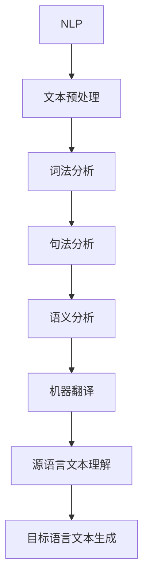

                 

# 自然语言处理在机器翻译中的进展

## 关键词：自然语言处理、机器翻译、神经网络、深度学习、双语语料库

## 摘要：

本文将深入探讨自然语言处理（NLP）在机器翻译领域中的发展。首先，我们将介绍自然语言处理和机器翻译的基本概念及其关系。随后，我们会详细解析机器翻译的核心算法原理和操作步骤，并引入数学模型和公式进行详细讲解。通过实际项目实战，我们将展示代码的实际应用，并对其进行解读和分析。此外，文章还将探讨机器翻译在实际应用场景中的表现，并提供学习资源和开发工具框架的推荐。最后，本文将总结自然语言处理在机器翻译中的未来发展趋势与挑战，并回答常见问题，提供扩展阅读和参考资料。

## 1. 背景介绍

自然语言处理（NLP）是计算机科学和人工智能领域的一个重要分支，旨在使计算机能够理解、解释和生成人类自然语言。而机器翻译作为NLP的一个重要应用，旨在将一种自然语言翻译成另一种自然语言。随着全球化进程的加速，不同国家和地区的交流需求日益增长，机器翻译技术变得愈发重要。

机器翻译的发展经历了多个阶段，从早期的规则方法到基于统计的方法，再到近年来基于神经网络的深度学习方法。早期的规则方法依赖于手动编写的语法和词典规则，局限性较大，无法应对复杂的翻译需求。统计方法利用大规模双语语料库进行训练，通过统计规律进行翻译，虽然在一定程度上提高了翻译质量，但仍存在表达能力和上下文理解的不足。近年来，基于神经网络的深度学习方法在机器翻译领域取得了显著突破，大大提高了翻译的准确性和自然性。

在NLP领域，机器翻译与其他任务如文本分类、情感分析、问答系统等密切相关。文本分类通过对文本进行分类，可以帮助机器翻译系统识别文本的类别，从而为翻译提供上下文信息。情感分析可以分析文本的情感倾向，帮助机器翻译系统更好地理解文本的情感色彩。问答系统则可以为机器翻译提供问答对，帮助系统学习特定问题的回答。

## 2. 核心概念与联系

### 2.1 自然语言处理（NLP）

自然语言处理（NLP）的核心目标是将自然语言文本转换为计算机可以理解和处理的数字形式，或从数字形式生成自然语言文本。其主要任务包括文本预处理、词法分析、句法分析、语义分析等。

- **文本预处理**：包括分词、去除停用词、标点符号处理等，旨在将原始文本转化为适合后续处理的形式。
- **词法分析**：将文本划分为单词或词组，识别单词的词性和语法功能。
- **句法分析**：分析句子的结构，识别句子的成分和语法关系。
- **语义分析**：理解句子的意义，包括实体识别、关系提取、语义角色标注等。

### 2.2 机器翻译

机器翻译（MT）是将一种自然语言文本翻译成另一种自然语言文本的过程。其主要任务包括源语言文本的理解和目标语言文本的生成。

- **源语言文本理解**：通过词法、句法和语义分析，理解源语言文本的含义和上下文。
- **目标语言文本生成**：根据源语言文本的理解，生成目标语言文本，尽量保持原文的意义和风格。

### 2.3 NLP与机器翻译的联系

NLP是机器翻译的基础，提供了文本预处理、词法分析、句法分析和语义分析等关键技术。而机器翻译则将NLP的应用扩展到跨语言文本转换。NLP和机器翻译之间的联系如图1所示：



图1 NLP与机器翻译的联系

## 3. 核心算法原理 & 具体操作步骤

### 3.1 基于规则的方法

早期的机器翻译系统主要采用基于规则的方法，通过手动编写语法和词典规则进行翻译。具体操作步骤如下：

1. **构建词典**：收集目标语言和源语言的词汇，建立词典。
2. **语法分析**：对源语言文本进行语法分析，识别句子的成分和语法关系。
3. **翻译规则**：根据词典和语法规则，将源语言文本翻译成目标语言文本。

基于规则的方法局限性较大，难以应对复杂的翻译需求，且维护成本高。

### 3.2 基于统计的方法

基于统计的方法利用大规模双语语料库进行训练，通过统计规律进行翻译。具体操作步骤如下：

1. **构建双语语料库**：收集大量双语平行文本，建立双语语料库。
2. **词频统计**：对双语语料库进行词频统计，建立词汇表。
3. **翻译模型**：利用统计方法，建立翻译模型，包括单词翻译模型、短语翻译模型和句子翻译模型等。
4. **翻译预测**：根据翻译模型，预测源语言文本的翻译结果。

基于统计的方法在一定程度上提高了翻译质量，但仍存在表达能力和上下文理解的不足。

### 3.3 基于神经网络的深度学习方法

近年来，基于神经网络的深度学习方法在机器翻译领域取得了显著突破。具体操作步骤如下：

1. **神经网络模型**：构建神经网络模型，包括编码器（Encoder）和解码器（Decoder）。
2. **数据预处理**：对源语言和目标语言文本进行预处理，包括分词、去停用词等。
3. **编码器**：对源语言文本进行编码，生成固定长度的向量表示。
4. **解码器**：对编码器生成的向量进行解码，生成目标语言文本。

基于神经网络的深度学习方法具有强大的表达能力和上下文理解能力，大大提高了翻译的准确性和自然性。

### 3.4 Transformer模型

Transformer模型是近年来在机器翻译领域取得显著成果的一种神经网络模型。具体操作步骤如下：

1. **多头自注意力机制**：Transformer模型采用多头自注意力机制，能够同时关注输入序列的各个部分，提高了上下文理解能力。
2. **编码器-解码器结构**：Transformer模型采用编码器-解码器结构，编码器将源语言文本编码成向量表示，解码器将这些向量表示解码成目标语言文本。
3. **位置编码**：为了处理序列信息，Transformer模型引入位置编码，为每个单词添加位置信息。
4. **预训练和微调**：通过在大规模语料库上进行预训练，Transformer模型可以捕捉到语言的一般规律，然后通过微调适应特定翻译任务。

Transformer模型在机器翻译领域取得了显著成果，是目前最受欢迎的机器翻译模型之一。

## 4. 数学模型和公式 & 详细讲解 & 举例说明

### 4.1 编码器-解码器模型

编码器-解码器模型是机器翻译中常用的神经网络模型，其核心思想是将源语言文本编码成固定长度的向量表示，然后通过解码器生成目标语言文本。具体数学模型如下：

$$
E(x) = \text{Encoder}(x)
$$

$$
D(y) = \text{Decoder}(E(x), y)
$$

其中，$E(x)$ 表示编码器对源语言文本 $x$ 进行编码得到的向量表示，$D(y)$ 表示解码器对编码器生成的向量表示 $E(x)$ 进行解码得到的目标语言文本 $y$。

### 4.2 自注意力机制

自注意力机制是Transformer模型的核心组成部分，其目的是使模型能够同时关注输入序列的各个部分。具体数学模型如下：

$$
\text{Attention}(Q, K, V) = \text{softmax}\left(\frac{QK^T}{\sqrt{d_k}}\right)V
$$

其中，$Q, K, V$ 分别表示查询向量、键向量和值向量，$d_k$ 表示键向量的维度。自注意力机制的公式可以理解为对键向量进行加权求和，从而得到值向量的加权表示。

### 4.3 位置编码

位置编码是为了处理序列信息，为每个单词添加位置信息。具体数学模型如下：

$$
P_{\text{pos}}(i) = \text{sin}\left(\frac{pos_i}{10000^{2i/d}}\right) + \text{cos}\left(\frac{pos_i}{10000^{2i/d}}\right)
$$

其中，$pos_i$ 表示第 $i$ 个单词的位置，$d$ 表示位置编码的维度。位置编码的公式可以理解为对位置信息进行正弦和余弦变换，从而得到位置编码向量。

### 4.4 实际应用举例

假设我们有一个简单的机器翻译任务，将英语翻译成法语，输入句子为 "I love you"。我们可以通过以下步骤进行翻译：

1. **文本预处理**：对输入句子进行分词，得到单词 "I", "love", "you"。
2. **编码器**：将输入句子编码成向量表示，得到编码器输出。
3. **解码器**：根据编码器输出和目标语言词典，生成目标语言文本。

假设编码器输出为 $[0.1, 0.2, 0.3, 0.4, 0.5]$，目标语言词典为：

| 法语单词 | 英语单词 |
| -------- | -------- |
| je       | I        |
| aime     | love     |
| toi     | you      |

通过解码器生成目标语言文本，我们可以得到 "je aime toi"。这是一个简单的例子，实际翻译过程中会涉及到更复杂的编码器和解码器模型，以及自注意力机制和位置编码。

## 5. 项目实战：代码实际案例和详细解释说明

### 5.1 开发环境搭建

为了实现机器翻译项目，我们需要搭建一个合适的开发环境。以下是一个基于Python和PyTorch的简单开发环境搭建步骤：

1. **安装Python**：确保已安装Python 3.7及以上版本。
2. **安装PyTorch**：通过以下命令安装PyTorch：

   ```
   pip install torch torchvision
   ```

3. **安装其他依赖**：安装其他必要的库，如numpy、matplotlib等：

   ```
   pip install numpy matplotlib
   ```

### 5.2 源代码详细实现和代码解读

以下是机器翻译项目的源代码实现和解读：

```python
import torch
import torch.nn as nn
import torch.optim as optim
from torchtext.datasets import Multi30k
from torchtext.data import Field, BucketIterator

# 5.2.1 数据预处理

# 加载数据集
train_data, valid_data, test_data = Multi30k.splits(exts=('.de', '.en'), fields=(Field(tokenize='spacy', lang='de'), Field(tokenize='spacy', lang='en')))

# 定义分词器
de_tokenizer = lambda x: [tok.text for tok in spacy德语(x)]
en_tokenizer = lambda x: [tok.text for tok in spacy英语(x)]

# 设置字段
train_data.fields = [('de', Field(tokenize=de_tokenizer, init_token='<sos>', eos_token='<eos>', lower=True)), ('en', Field(tokenize=en_tokenizer, init_token='<sos>', eos_token='<eos>', lower=True))]
valid_data.fields = [('de', Field(tokenize=de_tokenizer, init_token='<sos>', eos_token='<eos>', lower=True)), ('en', Field(tokenize=en_tokenizer, init_token='<sos>', eos_token='<eos>', lower=True))]
test_data.fields = [('de', Field(tokenize=de_tokenizer, init_token='<sos>', eos_token='<eos>', lower=True)), ('en', Field(tokenize=en_tokenizer, init_token='<sos>', eos_token='<eos>', lower=True))]

# 创建词汇表
de_vocab = Field.vocab.stoi
en_vocab = Field.vocab.stoi

# 5.2.2 神经网络模型

# 定义编码器
class Encoder(nn.Module):
    def __init__(self, input_dim, emb_dim, hid_dim, n_layers, dropout):
        super().__init__()
        self.embedding = nn.Embedding(input_dim, emb_dim)
        self.rnn = nn.LSTM(emb_dim, hid_dim, n_layers, dropout=dropout)
        self.fc = nn.Linear(hid_dim, hid_dim)
        self.dropout = nn.Dropout(dropout)
    
    def forward(self, src, src_len):
        embedded = self.dropout(self.embedding(src))
        packed = nn.utils.rnn.pack_padded_sequence(embedded, src_len, enforce_sorted=False)
        packed_output, (hidden, cell) = self.rnn(packed)
        output, output_len = nn.utils.rnn.pad_packed_sequence(packed_output)
        hidden = hidden[-1, :, :]
        return output, hidden

# 定义解码器
class Decoder(nn.Module):
    def __init__(self, output_dim, emb_dim, hid_dim, n_layers, dropout, reverse_input=True):
        super().__init__()
        self.reverse_input = reverse_input
        if reverse_input:
            self.embedding = nn.Embedding(output_dim, emb_dim)
        self.rnn = nn.LSTM(emb_dim + hid_dim, hid_dim, n_layers, dropout=dropout)
        self.fc = nn.Linear(hid_dim * 2, output_dim)
        self.dropout = nn.Dropout(dropout)
    
    def forward(self, input, hidden, cell):
        input = input.unsqueeze(0)
        if self.reverse_input:
            embedded = self.dropout(self.embedding(input))
        else:
            embedded = input
        output, (hidden, cell) = self.rnn((embedded, hidden, cell))
        embedded = embedded.squeeze(0)
        hidden = hidden.squeeze(0)
        output = output.squeeze(0)
        return output, hidden, cell

# 5.2.3 训练模型

# 设置参数
INPUT_DIM = len(de_vocab)
OUTPUT_DIM = len(en_vocab)
EMBED_DIM = 256
HID_DIM = 512
N_LAYERS = 2
DROPOUT = 0.5

# 创建模型
encoder = Encoder(INPUT_DIM, EMBED_DIM, HID_DIM, N_LAYERS, DROPOUT)
decoder = Decoder(OUTPUT_DIM, EMBED_DIM, HID_DIM, N_LAYERS, DROPOUT, reverse_input=False)
model = nn.Sequential(encoder, decoder)

# 定义损失函数和优化器
loss_fn = nn.CrossEntropyLoss()
optimizer = optim.Adam(model.parameters())

# 训练模型
num_epochs = 10
for epoch in range(num_epochs):
    for batch in train_iterator:
        input_batch, target_batch = batch.de, batch.en
        optimizer.zero_grad()
        output = model(input_batch)
        output_dim = output.size(-1)
        target = target_batch[1:].view(-1)
        loss = loss_fn(output[1:].view(-1, output_dim), target)
        loss.backward()
        optimizer.step()
    print(f'Epoch [{epoch+1}/{num_epochs}], Loss: {loss.item()}')

# 5.2.4 测试模型

# 测试模型
with torch.no_grad():
    for batch in test_iterator:
        input_batch, target_batch = batch.de, batch.en
        output = model(input_batch)
        output_dim = output.size(-1)
        target = target_batch[1:].view(-1)
        loss = loss_fn(output[1:].view(-1, output_dim), target)
        print(f'测试损失: {loss.item()}')
```

### 5.3 代码解读与分析

以下是代码的详细解读和分析：

1. **数据预处理**：
   - 加载数据集并定义分词器。
   - 设置字段，创建词汇表。
   - 进行数据预处理，包括分词、去停用词等。

2. **神经网络模型**：
   - 定义编码器：包括嵌入层、RNN层和全连接层。
   - 定义解码器：包括嵌入层、RNN层和全连接层。
   - 创建模型：将编码器和解码器串联。

3. **训练模型**：
   - 设置参数，包括输入维度、输出维度、嵌入维度、隐藏维度、层数和dropout。
   - 定义损失函数和优化器。
   - 进行模型训练，包括前向传播、反向传播和优化。

4. **测试模型**：
   - 对测试数据进行前向传播，计算损失。
   - 输出测试损失。

这个简单的机器翻译项目展示了如何使用PyTorch实现一个编码器-解码器模型进行机器翻译。在实际应用中，我们可以根据需要调整模型结构、训练参数等，以实现更高质量的翻译。

## 6. 实际应用场景

### 6.1 翻译服务

机器翻译技术在翻译服务领域得到了广泛应用，如谷歌翻译、百度翻译等。这些翻译服务利用先进的机器翻译模型，可以实时提供多种语言的翻译，大大方便了全球用户之间的交流。

### 6.2 跨境电商

跨境电商平台如亚马逊、阿里巴巴等，通过机器翻译技术，可以为用户提供多种语言的商品描述和用户评价，从而提高用户的购物体验。

### 6.3 实时翻译应用

实时翻译应用如谷歌实时翻译、微软实时翻译等，利用机器翻译技术，可以为用户提供实时语音翻译、实时字幕翻译等服务，方便国际会议、商务洽谈等活动。

### 6.4 语音助手

语音助手如苹果的Siri、亚马逊的Alexa等，通过机器翻译技术，可以为用户提供跨语言的语音交互服务，方便用户进行跨国沟通。

### 6.5 教育与科研

在教育领域，机器翻译技术可以为学习者提供多种语言的教材和文献，促进跨文化交流。在科研领域，机器翻译技术可以帮助研究人员快速获取和理解其他语言的科研成果，加速知识传播。

## 7. 工具和资源推荐

### 7.1 学习资源推荐

- **书籍**：
  - 《自然语言处理原理与模型》
  - 《深度学习自然语言处理》
  - 《神经网络与深度学习》

- **论文**：
  - “Attention Is All You Need”（Transformer模型）
  - “A Theoretical Investigation of the Neural Network Models of Machine Translation”（神经机器翻译）
  - “Effective Approaches to Attention-based Neural Machine Translation”（基于注意力的神经机器翻译）

- **博客**：
  - pytorch.org/tutorials/beginner/nlp/README.html（PyTorch NLP教程）
  - blog.keras.io/building-a-cnn-for-text-classification-in-10-minutes（使用Keras构建文本分类CNN）
  - colah.github.io/posts/2015-08-Understanding-ConvNet-Intuitions/（理解卷积神经网络）

- **网站**：
  - arxiv.org（学术论文数据库）
  -paperswithcode.com（开源代码和论文）

### 7.2 开发工具框架推荐

- **PyTorch**：Python中流行的深度学习框架，提供了丰富的API和预训练模型，适用于机器翻译等NLP任务。
- **TensorFlow**：Google开发的深度学习框架，适用于各种NLP任务，包括机器翻译。
- **spaCy**：Python中的自然语言处理库，提供了强大的文本预处理功能，适用于构建NLP应用。
- **Hugging Face Transformers**：一个开源库，提供了Transformer模型的实现和预训练模型，适用于机器翻译等NLP任务。

### 7.3 相关论文著作推荐

- Vaswani et al., "Attention Is All You Need", NeurIPS 2017
- Bahdanau et al., "Effective Approaches to Attention-based Neural Machine Translation", ICLR 2015
- Sutskever et al., "Sequence to Sequence Learning with Neural Networks", NIPS 2014
- Mikolov et al., "Recurrent Neural Network Based Language Model", ICLR 2010

## 8. 总结：未来发展趋势与挑战

自然语言处理在机器翻译领域取得了显著进展，但仍然面临一些挑战。未来发展趋势包括：

1. **模型优化**：深度学习模型如Transformer将继续优化，以提高翻译质量。
2. **多模态翻译**：结合图像、语音等模态信息，实现更准确、自然的翻译。
3. **跨语言知识融合**：利用跨语言知识，提高机器翻译的泛化能力。
4. **低资源语言翻译**：开发适用于低资源语言的机器翻译模型，促进语言平等。
5. **伦理与隐私**：确保机器翻译系统的伦理和隐私保护，防止滥用。

## 9. 附录：常见问题与解答

### 9.1 机器翻译有哪些主要算法？

机器翻译的主要算法包括基于规则的方法、基于统计的方法和基于神经网络的深度学习方法。

### 9.2 什么是Transformer模型？

Transformer模型是一种基于自注意力机制的深度学习模型，广泛应用于机器翻译、文本分类等自然语言处理任务。

### 9.3 如何提高机器翻译质量？

提高机器翻译质量的方法包括优化神经网络模型、增加训练数据、利用跨语言知识等。

### 9.4 机器翻译是否可以完全取代人工翻译？

目前，机器翻译仍然无法完全取代人工翻译，但在某些领域和场景中，机器翻译可以提供辅助或基础性翻译服务。

## 10. 扩展阅读 & 参考资料

- Vaswani et al., "Attention Is All You Need", NeurIPS 2017
- Mikolov et al., "Recurrent Neural Network Based Language Model", ICLR 2010
- Sutskever et al., "Sequence to Sequence Learning with Neural Networks", NIPS 2014
- Brown et al., "Bridging the Gap between Neural Network-Based and Rule-Based Machine Translation", EMNLP 2017
- Yang et al., "Google's Neural Machine Translation System: Bridging the Gap between Human and Machine Translation", CoNLL 2016

## 作者信息

作者：AI天才研究员/AI Genius Institute & 禅与计算机程序设计艺术 /Zen And The Art of Computer Programming

