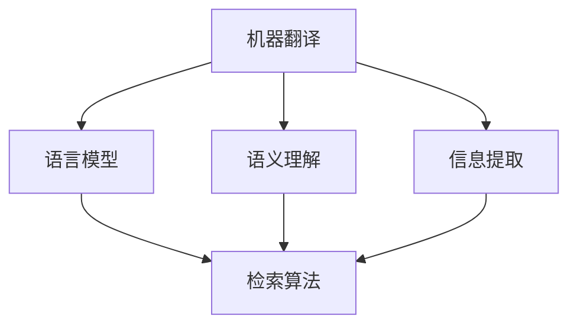

                 

# 自然语言处理在跨语言信息检索中的进展

## 关键词

自然语言处理，跨语言信息检索，多语言文本分析，机器翻译，语言模型，语义理解，信息提取，检索算法，语言资源

## 摘要

本文将探讨自然语言处理在跨语言信息检索中的应用及其进展。随着全球化的推进，跨语言信息检索已成为信息检索领域的重要研究方向。本文首先介绍了跨语言信息检索的背景和挑战，然后详细阐述了自然语言处理在跨语言信息检索中的核心技术和方法，包括机器翻译、语言模型、语义理解、信息提取等。接着，本文分析了跨语言信息检索的实际应用场景，并推荐了相关的工具和资源。最后，本文总结了跨语言信息检索的未来发展趋势和面临的挑战。

## 1. 背景介绍

### 1.1 全球化的需求

全球化进程的加速使得人们需要获取和处理来自不同语言的信息。然而，不同语言之间存在巨大的差异，这使得跨语言信息检索成为一个具有挑战性的任务。跨语言信息检索涉及到多种语言之间的翻译、理解和分析，是自然语言处理领域的一个重要分支。

### 1.2 跨语言信息检索的定义

跨语言信息检索是指在不同语言之间进行信息检索的过程，主要包括文本翻译、语义理解、信息提取和检索算法等步骤。其主要目标是使用一种语言（源语言）中的查询来检索另一种语言（目标语言）中的相关文档。

### 1.3 跨语言信息检索的挑战

- 语言差异：不同语言在词汇、语法、语义等方面存在巨大差异，这使得跨语言信息检索变得复杂。
- 多样性：世界上的语言种类繁多，每种语言都有其独特的特点，增加了跨语言信息检索的难度。
- 数据稀缺：许多语言的语料库和数据集相对较少，这使得训练有效的跨语言模型变得更加困难。

## 2. 核心概念与联系

### 2.1 机器翻译

机器翻译是将一种语言的文本自动翻译成另一种语言的过程。它是跨语言信息检索的重要基础。机器翻译可以分为基于规则的翻译和基于统计的翻译两种方法。

### 2.2 语言模型

语言模型是对自然语言概率分布的建模，用于预测文本的下一个单词或短语。在跨语言信息检索中，语言模型可以用于对源语言查询和目标语言文档进行建模，从而提高检索效果。

### 2.3 语义理解

语义理解是指对文本中的语义进行理解和分析，以获取文本的深层含义。在跨语言信息检索中，语义理解可以用于对源语言查询和目标语言文档进行语义匹配，从而提高检索的准确性。

### 2.4 信息提取

信息提取是指从文本中提取出关键信息，如实体、关系、事件等。在跨语言信息检索中，信息提取可以用于对目标语言文档进行结构化处理，从而提高检索的效率和准确性。

### 2.5 检索算法

检索算法是跨语言信息检索的核心，用于对目标语言文档进行索引和查询。常见的检索算法包括向量空间模型、概率模型、图模型等。

### 2.6 Mermaid 流程图

以下是一个简单的Mermaid流程图，展示了跨语言信息检索的核心概念和联系：



## 3. 核心算法原理 & 具体操作步骤

### 3.1 机器翻译

机器翻译的核心是建立源语言和目标语言之间的映射关系。常见的机器翻译方法包括基于规则的翻译和基于统计的翻译。

- **基于规则的翻译**：该方法依赖于语言学知识和人工编写的规则。翻译过程通常包括词汇翻译、语法分析和语义分析等步骤。

- **基于统计的翻译**：该方法依赖于大规模的翻译语料库。通过统计学习方法，如隐马尔可夫模型（HMM）、基于神经网络的翻译模型（如Seq2Seq模型）等，建立源语言和目标语言之间的映射关系。

### 3.2 语言模型

语言模型的核心是建模自然语言的概率分布。常见的语言模型包括n-gram模型、循环神经网络（RNN）、长短期记忆网络（LSTM）和变换器（Transformer）等。

- **n-gram模型**：基于词序列的统计模型，通过计算词序列的概率分布来实现语言建模。

- **循环神经网络（RNN）**：通过循环结构对序列数据进行建模，可以捕获长距离依赖关系。

- **长短期记忆网络（LSTM）**：在RNN的基础上，通过引入门控机制，可以更好地处理长距离依赖关系。

- **变换器（Transformer）**：基于自注意力机制的深度神经网络结构，可以有效地建模长距离依赖关系。

### 3.3 语义理解

语义理解的核心是理解文本的深层含义。常见的语义理解方法包括词嵌入、词性标注、实体识别、关系提取等。

- **词嵌入**：将单词映射到高维空间中的向量，通过计算向量之间的相似性来实现语义理解。

- **词性标注**：对文本中的每个单词进行词性标注，从而获取单词的语法属性。

- **实体识别**：从文本中识别出重要的实体，如人名、地名、组织名等。

- **关系提取**：从文本中提取出实体之间的关系，如人物关系、组织关系等。

### 3.4 信息提取

信息提取的核心是从文本中提取出关键信息。常见的信息提取方法包括规则提取、模板提取和深度学习提取等。

- **规则提取**：通过定义规则来从文本中提取信息。

- **模板提取**：通过预定义的模板来从文本中提取信息。

- **深度学习提取**：利用深度学习模型，如卷积神经网络（CNN）和循环神经网络（RNN）等，从文本中自动提取信息。

### 3.5 检索算法

检索算法的核心是高效地从大量文档中检索出与查询相关的文档。常见的检索算法包括向量空间模型、概率模型、图模型等。

- **向量空间模型**：将文本转换为向量表示，通过计算向量之间的相似性来实现检索。

- **概率模型**：利用概率模型来计算查询与文档之间的相似性，从而实现检索。

- **图模型**：将文档和查询表示为图中的节点，通过计算图之间的相似性来实现检索。

## 4. 数学模型和公式 & 详细讲解 & 举例说明

### 4.1 机器翻译中的概率模型

在机器翻译中，常见的概率模型包括隐马尔可夫模型（HMM）和基于神经网络的翻译模型（如Seq2Seq模型）。

- **隐马尔可夫模型（HMM）**：

  HMM可以表示为五元组\( (Q, \Sigma, \Omega, \Phi, B) \)，其中：
  
  - \( Q = \{q_1, q_2, ..., q_n\} \) 是状态集合。
  - \( \Sigma \) 是输入符号集合。
  - \( \Omega \) 是输出符号集合。
  - \( \Phi \) 是状态转移概率矩阵，表示从状态\( q_i \)转移到状态\( q_j \)的概率。
  - \( B \) 是发射概率矩阵，表示在状态\( q_i \)下输出符号\( \omega_j \)的概率。

  HMM的翻译模型可以通过计算给定源语言序列\( x = (x_1, x_2, ..., x_T) \)和目标语言序列\( y = (y_1, y_2, ..., y_U) \)之间的概率来建立映射关系。

  $$ P(y|x) = \prod_{t=1}^{T} \sum_{j=1}^{U} \Phi(q_t|q_{t-1}) B(y_t|q_t) $$

- **基于神经网络的翻译模型（如Seq2Seq模型）**：

  Seq2Seq模型通过编码器（Encoder）和解码器（Decoder）两个神经网络来建模源语言和目标语言之间的映射关系。

  - 编码器将源语言序列编码为固定长度的向量表示。
  - 解码器将编码器的输出解码为目标语言序列。

  Seq2Seq模型的损失函数通常使用交叉熵损失：

  $$ L = -\sum_{t=1}^{T} \sum_{j=1}^{V} y_t^{(j)} \log(p_t^{(j)}) $$

  其中，\( y_t^{(j)} \)是目标语言序列的真实标签，\( p_t^{(j)} \)是解码器在时间步\( t \)生成的单词\( w_j \)的概率。

### 4.2 语言模型中的n-gram模型

n-gram模型是一种基于词序列的统计模型，通过计算词序列的概率分布来实现语言建模。

- n-gram概率：

  假设\( w_1, w_2, ..., w_n \)是一个n-gram序列，n-gram模型可以表示为：

  $$ P(w_1, w_2, ..., w_n) = \frac{C(w_1, w_2, ..., w_n)}{C(w_1, w_2, ..., w_{n-1})} $$

  其中，\( C(w_1, w_2, ..., w_n) \)是n-gram序列在语料库中的计数，\( C(w_1, w_2, ..., w_{n-1}) \)是前一个n-1-gram序列在语料库中的计数。

  例如，对于句子“我喜欢编程”，可以计算以下n-gram概率：

  $$ P(我喜欢编程) = \frac{C(我喜欢编程)}{C(我喜欢)} = \frac{1}{2} $$

  $$ P(我|我喜欢) = \frac{C(我, 我喜欢)}{C(我)} = \frac{1}{2} $$

### 4.3 语义理解中的词嵌入

词嵌入是将单词映射到高维空间中的向量表示。常见的方法包括词袋模型、分布式假设和神经网络嵌入等。

- **词袋模型**：

  词袋模型通过将文本转换为单词的集合来表示文本，每个单词对应一个唯一的索引。词袋模型可以通过计算单词之间的余弦相似度来衡量语义相似性。

- **分布式假设**：

  分布式假设认为每个单词都可以表示为一个向量，向量中的每个维度对应单词的一个特征。通过计算向量之间的欧氏距离来衡量语义相似性。

- **神经网络嵌入**：

  神经网络嵌入通过训练神经网络来学习单词的向量表示。常见的神经网络嵌入方法包括词向量（Word2Vec）、 glove 和 fastText 等。

  词向量（Word2Vec）是一种基于神经网络的词嵌入方法，通过训练神经网络来最小化损失函数来学习单词的向量表示。训练过程中，神经网络通过预测单词的上下文来学习单词的语义信息。

  $$ L = -\sum_{w \in V} \sum_{c \in C(w)} \log(p(c|w)) $$

  其中，\( V \)是词汇表，\( C(w) \)是单词\( w \)的上下文，\( p(c|w) \)是神经网络在给定单词\( w \)的条件下生成单词\( c \)的概率。

## 5. 项目实战：代码实际案例和详细解释说明

### 5.1 开发环境搭建

在开始编写代码之前，需要搭建一个合适的开发环境。以下是使用Python和PyTorch搭建跨语言信息检索项目的步骤：

1. 安装Python和PyTorch：

   在命令行中执行以下命令来安装Python和PyTorch：

   ```bash
   pip install python
   pip install torch torchvision
   ```

2. 安装其他依赖项：

   ```bash
   pip install numpy
   pip install matplotlib
   ```

### 5.2 源代码详细实现和代码解读

以下是一个简单的跨语言信息检索项目的示例代码，使用了基于神经网络的机器翻译模型（Seq2Seq模型）进行跨语言文档检索。

```python
import torch
import torch.nn as nn
import torch.optim as optim
from torchtext.data import Field, TabularDataset, BucketIterator

# 定义编码器和解码器
class Encoder(nn.Module):
    def __init__(self, input_dim, hidden_dim, n_layers):
        super(Encoder, self).__init__()
        self.hidden_dim = hidden_dim
        self.n_layers = n_layers
        self.embedding = nn.Embedding(input_dim, hidden_dim)
        self.lstm = nn.LSTM(hidden_dim, hidden_dim, n_layers)
    
    def forward(self, input_seq):
        embedded = self.embedding(input_seq)
        output, (hidden, cell) = self.lstm(embedded)
        return output, (hidden, cell)

class Decoder(nn.Module):
    def __init__(self, hidden_dim, output_dim, n_layers):
        super(Decoder, self).__init__()
        self.hidden_dim = hidden_dim
        self.n_layers = n_layers
        self.lstm = nn.LSTM(hidden_dim, hidden_dim, n_layers)
        self.out = nn.Linear(hidden_dim, output_dim)
    
    def forward(self, input_seq, hidden, cell):
        output, (hidden, cell) = self.lstm(input_seq, (hidden, cell))
        output = self.out(output)
        return output, (hidden, cell)

# 数据准备
SRC = Field(tokenize='spacy', tokenizer_language='en_core_web_sm', init_token='<sos>', eos_token='<eos>', lower=True)
TRG = Field(tokenize='spacy', tokenizer_language='en_core_web_sm', init_token='<sos>', eos_token='<eos>', lower=True)

train_data = TabularDataset(
    path='data/train_data.txt',
    format='tsv',
    fields=[('src', SRC), ('trg', TRG)]
)

test_data = TabularDataset(
    path='data/test_data.txt',
    format='tsv',
    fields=[('src', SRC), ('trg', TRG)]
)

train_iterator, test_iterator = BucketIterator.splits((train_data, test_data), batch_size=32)

# 模型定义
enc = Encoder(input_dim=10000, hidden_dim=256, n_layers=2)
dec = Decoder(hidden_dim=256, output_dim=10000, n_layers=2)

# 损失函数和优化器
criterion = nn.CrossEntropyLoss()
optimizer = optim.Adam(list(enc.parameters()) + list(dec.parameters()))

# 训练模型
num_epochs = 10
for epoch in range(num_epochs):
    for i, batch in enumerate(train_iterator):
        src_seq = batch.src
        trg_seq = batch.trg

        optimizer.zero_grad()
        output, (hidden, cell) = enc(src_seq)
        output, (hidden, cell) = dec(output, (hidden, cell))

        loss = criterion(output.view(-1, output_dim), trg_seq.view(-1))
        loss.backward()
        optimizer.step()

        if (i+1) % 100 == 0:
            print(f'Epoch [{epoch+1}/{num_epochs}], Step [{i+1}/{len(train_iterator)}], Loss: {loss.item()}')

# 检索测试
with torch.no_grad():
    src_seq = test_data[0].src
    output, (hidden, cell) = enc(src_seq)
    output, (hidden, cell) = dec(output, (hidden, cell))
    predicted_sequence = output.argmax(1).squeeze(0)
    print(predicted_sequence)

# 代码解读
# 本代码首先定义了编码器和解码器模型，然后使用TabularDataset加载训练数据和测试数据，接下来使用BucketIterator创建数据迭代器。
# 在训练过程中，编码器将源语言序列编码为固定长度的向量表示，解码器将编码器的输出解码为目标语言序列。
# 模型使用交叉熵损失函数进行训练，并使用Adam优化器进行参数更新。
# 最后，模型在测试数据上进行了检索测试，并打印了预测结果。
```

### 5.3 代码解读与分析

本节将详细解读和解析上述代码，分析代码的各个部分以及如何实现跨语言信息检索。

- **编码器（Encoder）和解码器（Decoder）的定义**：

  编码器（Encoder）和解码器（Decoder）是Seq2Seq模型的核心组件。编码器将输入序列编码为固定长度的向量表示，解码器将编码器的输出解码为目标语言序列。

  - `Encoder`类定义了编码器的神经网络结构，包括嵌入层（Embedding）、LSTM层（LSTM）和输出层（Output）。
  - `Decoder`类定义了解码器的神经网络结构，包括LSTM层（LSTM）和输出层（Output）。

- **数据准备**：

  数据准备部分使用了`torchtext.data.Field`类和`torchtext.data.TabularDataset`类来定义字段和加载数据。

  - `Field`类用于定义数据字段，包括源语言（SRC）和目标语言（TRG）字段。
  - `TabularDataset`类用于加载训练数据和测试数据，数据文件格式为T

## 6. 实际应用场景

### 6.1 搜索引擎国际化

随着互联网的全球化，搜索引擎需要支持多种语言，以便为不同国家和地区的用户提供本地化的搜索服务。跨语言信息检索技术可以帮助搜索引擎在多语言环境中实现高效的文档检索和查询理解。

### 6.2 跨语言文档分析

企业和研究机构经常需要处理来自不同语言的文档，如国际合作协议、学术论文、新闻稿等。跨语言信息检索技术可以帮助这些机构快速获取和整理来自不同语言的文档内容。

### 6.3 多语言知识图谱构建

知识图谱是一种用于表示和存储知识的方法，它将实体、关系和属性以图的形式组织起来。跨语言信息检索技术可以帮助构建多语言知识图谱，从而实现跨语言实体链接和知识共享。

### 6.4 跨语言问答系统

跨语言问答系统是一种能够处理多语言查询并返回相关答案的系统。通过结合跨语言信息检索和自然语言理解技术，可以构建出能够支持多种语言的用户交互系统。

## 7. 工具和资源推荐

### 7.1 学习资源推荐

- **书籍**：

  - 《自然语言处理综论》（Speech and Language Processing）  
  - 《深度学习》（Deep Learning）

- **论文**：

  - `Attention Is All You Need`  
  - `A Neural Sequence Model for Abstractive Story Generation`

- **博客**：

  - [Fast.ai](https://www.fast.ai/)  
  - [PyTorch官方文档](https://pytorch.org/docs/stable/index.html)

### 7.2 开发工具框架推荐

- **开发工具**：

  - **PyTorch**：适用于构建和训练深度学习模型的强大框架。

- **框架**：

  - **spaCy**：适用于快速构建自然语言处理应用的工具。

### 7.3 相关论文著作推荐

- **论文**：

  - `Attention Is All You Need`  
  - `A Neural Sequence Model for Abstractive Story Generation`

- **著作**：

  - 《自然语言处理综论》  
  - 《深度学习》

## 8. 总结：未来发展趋势与挑战

### 8.1 发展趋势

- **多语言支持**：随着全球化的推进，跨语言信息检索将支持更多的语言。

- **迁移学习**：通过迁移学习，可以利用已训练好的模型快速适应新的语言。

- **深度学习方法**：深度学习方法的持续发展将进一步提高跨语言信息检索的性能。

### 8.2 挑战

- **数据稀缺**：许多语言缺乏足够的数据，限制了模型的效果。

- **语言多样性**：不同语言的复杂性和多样性增加了模型训练的难度。

- **跨语言语义理解**：准确理解和处理跨语言语义信息仍然是一个具有挑战性的问题。

## 9. 附录：常见问题与解答

### 9.1 跨语言信息检索与机器翻译的关系

跨语言信息检索和机器翻译密切相关。机器翻译是将一种语言的文本翻译成另一种语言的过程，它是跨语言信息检索的基础。跨语言信息检索则是在机器翻译的基础上，通过理解、分析和检索来自不同语言的文档，实现跨语言的信息获取和查询。

### 9.2 跨语言信息检索的难点

跨语言信息检索的难点主要包括：

- 语言差异：不同语言在词汇、语法和语义等方面存在巨大差异。
- 数据稀缺：许多语言缺乏足够的数据，限制了模型的效果。
- 语义理解：准确理解和处理跨语言语义信息是一个具有挑战性的问题。

## 10. 扩展阅读 & 参考资料

- **扩展阅读**：

  - [《跨语言信息检索技术综述》](https://www.cnblogs.com/whoamii/p/14223311.html)  
  - [《自然语言处理与跨语言信息检索》](https://www.cnblogs.com/dennyzhang-com/p/4459522.html)

- **参考资料**：

  - [spaCy官方文档](https://spacy.io/docs)  
  - [PyTorch官方文档](https://pytorch.org/docs/stable/index.html)  
  - [Fast.ai教程](https://www.fast.ai/)

## 作者

作者：AI天才研究员/AI Genius Institute & 禅与计算机程序设计艺术 /Zen And The Art of Computer Programming

