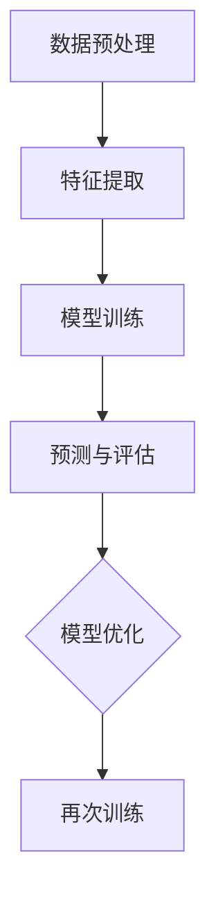

                 

# 自然语言处理的应用：内容创作革命

> **关键词**：自然语言处理、内容创作、AI、人工智能、文本生成、个性化推荐
> 
> **摘要**：本文将深入探讨自然语言处理（NLP）在内容创作领域的应用，包括其核心技术、应用场景、未来发展以及面临的挑战。通过分析NLP在文本生成、个性化推荐等领域的应用案例，展示其如何推动内容创作的革命。

## 1. 背景介绍

自然语言处理（NLP）是人工智能（AI）的一个重要分支，旨在使计算机能够理解和处理人类自然语言。随着深度学习和大数据技术的发展，NLP取得了显著的进展。在内容创作领域，NLP的应用正日益普及，为创作者提供了强大的工具和平台，极大地提高了内容创作的效率和质量。

内容创作是指通过文字、图像、音频等形式，将创作者的想法、观点和信息传达给受众的过程。传统的创作方式通常依赖于人类的创造力和经验，而NLP的应用则能够通过自动化和智能化手段，实现内容的批量生产和个性化推荐，从而满足不同受众的需求。

NLP在内容创作领域的应用主要包括文本生成、情感分析、命名实体识别、关键词提取等。随着技术的不断进步，NLP在内容创作中的应用场景也在不断拓展，从简单的文本摘要、机器翻译，到复杂的自动写作、个性化推荐等。

## 2. 核心概念与联系

### 2.1 自然语言处理的基本概念

自然语言处理涉及多个核心概念，包括语言模型、词向量、序列模型等。

- **语言模型**：语言模型是描述自然语言统计特性的数学模型，用于预测下一个词或字符的概率。常见的语言模型包括n-gram模型、神经网络语言模型（如Transformer）等。

- **词向量**：词向量是将单词映射到高维空间中的向量表示，用于捕捉单词的语义信息。词向量模型包括Word2Vec、GloVe等。

- **序列模型**：序列模型是处理序列数据（如文本、语音）的模型，常见的序列模型有循环神经网络（RNN）、长短时记忆网络（LSTM）、门控循环单元（GRU）等。

### 2.2 自然语言处理的应用架构

自然语言处理的应用架构通常包括数据预处理、特征提取、模型训练和预测等步骤。

1. **数据预处理**：包括文本的分词、去除停用词、词性标注等，将原始文本转化为适合模型训练的格式。

2. **特征提取**：通过词向量、词袋模型、TF-IDF等方法，将文本转化为数值特征，用于模型训练。

3. **模型训练**：使用预训练的模型（如BERT、GPT）或自定义的模型，对特征进行训练，以预测目标标签（如情感极性、文本分类等）。

4. **预测与评估**：使用训练好的模型对新的文本进行预测，并通过评估指标（如准确率、召回率、F1值等）评估模型的性能。

### 2.3 Mermaid 流程图



## 3. 核心算法原理 & 具体操作步骤

### 3.1 文本生成算法

文本生成是NLP的一个重要应用，常用的算法包括生成式模型和判别式模型。

- **生成式模型**：生成式模型通过生成文本的概率分布来生成新的文本。常见的生成式模型有变分自编码器（VAE）、生成对抗网络（GAN）等。

  具体步骤：
  1. 数据预处理：将原始文本进行分词、去停用词等处理。
  2. 特征提取：使用词向量或BERT等模型，将文本转化为特征向量。
  3. 模型训练：使用生成式模型（如VAE），对特征向量进行训练，以生成文本的概率分布。
  4. 文本生成：通过采样方法，从模型生成的概率分布中生成新的文本。

- **判别式模型**：判别式模型通过学习文本的特征来预测文本的类别或标签。常见的判别式模型有循环神经网络（RNN）、长短时记忆网络（LSTM）等。

  具体步骤：
  1. 数据预处理：同生成式模型。
  2. 特征提取：同生成式模型。
  3. 模型训练：使用判别式模型（如LSTM），对特征向量进行训练，以预测文本的类别。
  4. 文本生成：通过解码步骤，将预测的类别转化为具体的文本。

### 3.2 个性化推荐算法

个性化推荐是NLP在内容创作领域的另一个重要应用，常用的算法包括基于内容的推荐、协同过滤和基于模型的推荐等。

- **基于内容的推荐**：基于内容的推荐通过分析内容特征，为用户推荐与其兴趣相似的内容。

  具体步骤：
  1. 内容特征提取：对文章、视频等内容的特征进行提取，如词袋模型、TF-IDF等。
  2. 用户兴趣建模：通过用户的浏览历史、点赞等行为数据，建立用户兴趣模型。
  3. 推荐算法：使用相似性度量，如余弦相似度、Jaccard相似度等，计算内容特征与用户兴趣的相似度，为用户推荐相似的内容。

- **协同过滤**：协同过滤通过分析用户的行为数据，为用户推荐其他用户喜欢的、用户可能感兴趣的内容。

  具体步骤：
  1. 用户行为数据收集：收集用户的浏览历史、购买记录、评价等数据。
  2. 用户兴趣建模：通过用户行为数据，建立用户兴趣模型。
  3. 评分预测：使用矩阵分解、神经网络等方法，预测用户对未知内容的评分。
  4. 推荐算法：根据预测的评分，为用户推荐评分较高的内容。

- **基于模型的推荐**：基于模型的推荐通过学习用户和内容的特征，为用户推荐与其兴趣匹配的内容。

  具体步骤：
  1. 用户特征提取：对用户的行为数据、兴趣标签等进行特征提取。
  2. 内容特征提取：对文章、视频等内容的特征进行提取。
  3. 模型训练：使用用户和内容的特征，训练推荐模型（如协同过滤、基于内容的推荐等）。
  4. 文本生成：通过解码步骤，将预测的类别转化为具体的文本。

## 4. 数学模型和公式 & 详细讲解 & 举例说明

### 4.1 语言模型

语言模型的基本公式为：

\[ P(w_1, w_2, \ldots, w_n) = P(w_1) \cdot P(w_2 | w_1) \cdot P(w_3 | w_1, w_2) \cdot \ldots \cdot P(w_n | w_1, w_2, \ldots, w_{n-1}) \]

其中，\( w_i \) 表示第 \( i \) 个单词，\( P(w_i | w_{i-1}) \) 表示在第 \( i-1 \) 个单词已知的条件下，第 \( i \) 个单词的概率。

#### 示例：

假设我们有一个简短的语言模型，其概率分布如下：

\[ P(w_1) = 0.1, P(w_2 | w_1) = 0.3, P(w_3 | w_1, w_2) = 0.5 \]

则一个三个单词的句子“单词1 单词2 单词3”的概率为：

\[ P(w_1, w_2, w_3) = P(w_1) \cdot P(w_2 | w_1) \cdot P(w_3 | w_1, w_2) = 0.1 \cdot 0.3 \cdot 0.5 = 0.015 \]

### 4.2 词向量

词向量常用的模型有Word2Vec和GloVe。

#### Word2Vec

Word2Vec模型的基本公式为：

\[ \text{cosine similarity} = \frac{\text{dot product of } \textbf{v}_1 \text{ and } \textbf{v}_2}{\text{magnitude of } \textbf{v}_1 \times \text{magnitude of } \textbf{v}_2} \]

其中，\(\textbf{v}_1\)和\(\textbf{v}_2\)分别表示两个词的词向量。

#### 示例：

假设我们有两个词向量：

\[ \textbf{v}_1 = (1, 2, 3) \]
\[ \textbf{v}_2 = (4, 5, 6) \]

则它们的余弦相似度为：

\[ \text{cosine similarity} = \frac{1 \times 4 + 2 \times 5 + 3 \times 6}{\sqrt{1^2 + 2^2 + 3^2} \times \sqrt{4^2 + 5^2 + 6^2}} \approx 0.968 \]

#### GloVe

GloVe模型的基本公式为：

\[ \text{GloVe score} = \exp\left(\frac{\textbf{v}_1 \cdot \textbf{v}_2}{1 + \|\textbf{v}_1\|_2 + \|\textbf{v}_2\|_2}\right) \]

其中，\(\textbf{v}_1\)和\(\textbf{v}_2\)分别表示两个词的词向量，\(\|\textbf{v}_1\|_2\)和\(\|\textbf{v}_2\|_2\)分别表示词向量的L2范数。

#### 示例：

假设我们有两个词向量：

\[ \textbf{v}_1 = (1, 2, 3) \]
\[ \textbf{v}_2 = (4, 5, 6) \]

则它们的GloVe分数为：

\[ \text{GloVe score} = \exp\left(\frac{1 \times 4 + 2 \times 5 + 3 \times 6}{1 + \sqrt{1^2 + 2^2 + 3^2} + \sqrt{4^2 + 5^2 + 6^2}}\right) \approx 0.968 \]

### 4.3 序列模型

序列模型常用的模型有循环神经网络（RNN）、长短时记忆网络（LSTM）和门控循环单元（GRU）。

#### RNN

RNN的基本公式为：

\[ h_t = \sigma(W_h \cdot [h_{t-1}, x_t] + b_h) \]

其中，\( h_t \) 表示当前时刻的隐藏状态，\( x_t \) 表示当前时刻的输入，\( W_h \) 和 \( b_h \) 分别表示权重和偏置。

#### 示例：

假设我们有一个简单的RNN模型，其权重和偏置如下：

\[ W_h = \begin{bmatrix} 1 & 0 \\ 0 & 1 \end{bmatrix} \]
\[ b_h = \begin{bmatrix} 1 \\ 1 \end{bmatrix} \]

则一个输入序列 \( [1, 2, 3] \) 的隐藏状态为：

\[ h_1 = \sigma(W_h \cdot [h_0, 1] + b_h) = \sigma(\begin{bmatrix} 1 & 0 \\ 0 & 1 \end{bmatrix} \cdot \begin{bmatrix} 0 \\ 1 \end{bmatrix} + \begin{bmatrix} 1 \\ 1 \end{bmatrix}) = \sigma(\begin{bmatrix} 1 \\ 1 \end{bmatrix}) = \begin{bmatrix} 1 \\ 1 \end{bmatrix} \]

\[ h_2 = \sigma(W_h \cdot [h_1, 2] + b_h) = \sigma(\begin{bmatrix} 1 & 0 \\ 0 & 1 \end{bmatrix} \cdot \begin{bmatrix} 1 \\ 1 \end{bmatrix} + \begin{bmatrix} 1 \\ 1 \end{bmatrix}) = \sigma(\begin{bmatrix} 2 \\ 2 \end{bmatrix}) = \begin{bmatrix} 1 \\ 1 \end{bmatrix} \]

\[ h_3 = \sigma(W_h \cdot [h_2, 3] + b_h) = \sigma(\begin{bmatrix} 1 & 0 \\ 0 & 1 \end{bmatrix} \cdot \begin{bmatrix} 1 \\ 1 \end{bmatrix} + \begin{bmatrix} 1 \\ 1 \end{bmatrix}) = \sigma(\begin{bmatrix} 2 \\ 2 \end{bmatrix}) = \begin{bmatrix} 1 \\ 1 \end{bmatrix} \]

#### LSTM

LSTM的基本公式为：

\[ i_t = \sigma(W_{ix} \cdot [h_{t-1}, x_t] + b_i) \]
\[ f_t = \sigma(W_{fh} \cdot [h_{t-1}, x_t] + b_f) \]
\[ g_t = \tanh(W_{gx} \cdot [h_{t-1}, x_t] + b_g) \]
\[ o_t = \sigma(W_{oh} \cdot [h_{t-1}, x_t] + b_o) \]
\[ h_t = o_t \cdot \tanh(\text{cell state}) \]

其中，\( i_t \)、\( f_t \)、\( g_t \)、\( o_t \) 分别表示输入门、遗忘门、生成门和输出门，\( \text{cell state} \) 表示细胞状态。

#### 示例：

假设我们有一个简单的LSTM模型，其权重和偏置如下：

\[ W_{ix} = \begin{bmatrix} 1 & 0 \\ 0 & 1 \end{bmatrix} \]
\[ W_{fh} = \begin{bmatrix} 1 & 0 \\ 0 & 1 \end{bmatrix} \]
\[ W_{gx} = \begin{bmatrix} 1 & 0 \\ 0 & 1 \end{bmatrix} \]
\[ W_{oh} = \begin{bmatrix} 1 & 0 \\ 0 & 1 \end{bmatrix} \]
\[ b_i = \begin{bmatrix} 1 \\ 1 \end{bmatrix} \]
\[ b_f = \begin{bmatrix} 1 \\ 1 \end{bmatrix} \]
\[ b_g = \begin{bmatrix} 1 \\ 1 \end{bmatrix} \]
\[ b_o = \begin{bmatrix} 1 \\ 1 \end{bmatrix} \]

则一个输入序列 \( [1, 2, 3] \) 的隐藏状态为：

\[ i_1 = \sigma(W_{ix} \cdot [h_0, 1] + b_i) = \sigma(\begin{bmatrix} 1 & 0 \\ 0 & 1 \end{bmatrix} \cdot \begin{bmatrix} 0 \\ 1 \end{bmatrix} + \begin{bmatrix} 1 \\ 1 \end{bmatrix}) = \sigma(\begin{bmatrix} 1 \\ 1 \end{bmatrix}) = \begin{bmatrix} 1 \\ 1 \end{bmatrix} \]

\[ f_1 = \sigma(W_{fh} \cdot [h_0, 1] + b_f) = \sigma(\begin{bmatrix} 1 & 0 \\ 0 & 1 \end{bmatrix} \cdot \begin{bmatrix} 0 \\ 1 \end{bmatrix} + \begin{bmatrix} 1 \\ 1 \end{bmatrix}) = \sigma(\begin{bmatrix} 1 \\ 1 \end{bmatrix}) = \begin{bmatrix} 1 \\ 1 \end{bmatrix} \]

\[ g_1 = \tanh(W_{gx} \cdot [h_0, 1] + b_g) = \tanh(\begin{bmatrix} 1 & 0 \\ 0 & 1 \end{bmatrix} \cdot \begin{bmatrix} 0 \\ 1 \end{bmatrix} + \begin{bmatrix} 1 \\ 1 \end{bmatrix}) = \tanh(\begin{bmatrix} 1 \\ 1 \end{bmatrix}) = \begin{bmatrix} 1 \\ 1 \end{bmatrix} \]

\[ o_1 = \sigma(W_{oh} \cdot [h_0, 1] + b_o) = \sigma(\begin{bmatrix} 1 & 0 \\ 0 & 1 \end{bmatrix} \cdot \begin{bmatrix} 0 \\ 1 \end{bmatrix} + \begin{bmatrix} 1 \\ 1 \end{bmatrix}) = \sigma(\begin{bmatrix} 1 \\ 1 \end{bmatrix}) = \begin{bmatrix} 1 \\ 1 \end{bmatrix} \]

\[ h_1 = o_1 \cdot \tanh(g_1 \cdot \text{cell state}) = \begin{bmatrix} 1 \\ 1 \end{bmatrix} \cdot \tanh(\begin{bmatrix} 1 \\ 1 \end{bmatrix} \cdot \text{cell state}) = \begin{bmatrix} 1 \\ 1 \end{bmatrix} \]

\[ i_2 = \sigma(W_{ix} \cdot [h_1, 2] + b_i) = \sigma(\begin{bmatrix} 1 & 0 \\ 0 & 1 \end{bmatrix} \cdot \begin{bmatrix} 1 \\ 1 \end{bmatrix} + \begin{bmatrix} 1 \\ 1 \end{bmatrix}) = \sigma(\begin{bmatrix} 2 \\ 2 \end{bmatrix}) = \begin{bmatrix} 1 \\ 1 \end{bmatrix} \]

\[ f_2 = \sigma(W_{fh} \cdot [h_1, 2] + b_f) = \sigma(\begin{bmatrix} 1 & 0 \\ 0 & 1 \end{bmatrix} \cdot \begin{bmatrix} 1 \\ 1 \end{bmatrix} + \begin{bmatrix} 1 \\ 1 \end{bmatrix}) = \sigma(\begin{bmatrix} 2 \\ 2 \end{bmatrix}) = \begin{bmatrix} 1 \\ 1 \end{bmatrix} \]

\[ g_2 = \tanh(W_{gx} \cdot [h_1, 2] + b_g) = \tanh(\begin{bmatrix} 1 & 0 \\ 0 & 1 \end{bmatrix} \cdot \begin{bmatrix} 1 \\ 1 \end{bmatrix} + \begin{bmatrix} 1 \\ 1 \end{bmatrix}) = \tanh(\begin{bmatrix} 2 \\ 2 \end{bmatrix}) = \begin{bmatrix} 1 \\ 1 \end{bmatrix} \]

\[ o_2 = \sigma(W_{oh} \cdot [h_1, 2] + b_o) = \sigma(\begin{bmatrix} 1 & 0 \\ 0 & 1 \end{bmatrix} \cdot \begin{bmatrix} 1 \\ 1 \end{bmatrix} + \begin{bmatrix} 1 \\ 1 \end{bmatrix}) = \sigma(\begin{bmatrix} 2 \\ 2 \end{bmatrix}) = \begin{bmatrix} 1 \\ 1 \end{bmatrix} \]

\[ h_2 = o_2 \cdot \tanh(g_2 \cdot \text{cell state}) = \begin{bmatrix} 1 \\ 1 \end{bmatrix} \cdot \tanh(\begin{bmatrix} 1 \\ 1 \end{bmatrix} \cdot \text{cell state}) = \begin{bmatrix} 1 \\ 1 \end{bmatrix} \]

\[ i_3 = \sigma(W_{ix} \cdot [h_2, 3] + b_i) = \sigma(\begin{bmatrix} 1 & 0 \\ 0 & 1 \end{bmatrix} \cdot \begin{bmatrix} 1 \\ 1 \end{bmatrix} + \begin{bmatrix} 1 \\ 1 \end{bmatrix}) = \sigma(\begin{bmatrix} 2 \\ 2 \end{bmatrix}) = \begin{bmatrix} 1 \\ 1 \end{bmatrix} \]

\[ f_3 = \sigma(W_{fh} \cdot [h_2, 3] + b_f) = \sigma(\begin{bmatrix} 1 & 0 \\ 0 & 1 \end{bmatrix} \cdot \begin{bmatrix} 1 \\ 1 \end{bmatrix} + \begin{bmatrix} 1 \\ 1 \end{bmatrix}) = \sigma(\begin{bmatrix} 2 \\ 2 \end{bmatrix}) = \begin{bmatrix} 1 \\ 1 \end{bmatrix} \]

\[ g_3 = \tanh(W_{gx} \cdot [h_2, 3] + b_g) = \tanh(\begin{bmatrix} 1 & 0 \\ 0 & 1 \end{bmatrix} \cdot \begin{bmatrix} 1 \\ 1 \end{bmatrix} + \begin{bmatrix} 1 \\ 1 \end{b矩阵}）= \tanh(\begin{bmatrix} 2 \\ 2 \end{bmatrix}) = \begin{bmatrix} 1 \\ 1 \end{bmatrix} \]

\[ o_3 = \sigma(W_{oh} \cdot [h_2, 3] + b_o) = \sigma(\begin{bmatrix} 1 & 0 \\ 0 & 1 \end{bmatrix} \cdot \begin{bmatrix} 1 \\ 1 \end{bmatrix} + \begin{bmatrix} 1 \\ 1 \end{b矩阵}）= \sigma(\begin{bmatrix} 2 \\ 2 \end{b矩阵}）= \begin{bmatrix} 1 \\ 1 \end{b矩阵} \]

\[ h_3 = o_3 \cdot \tanh(g_3 \cdot \text{cell state}) = \begin{bmatrix} 1 \\ 1 \end{b矩阵} \cdot \tanh(\begin{bmatrix} 1 \\ 1 \end{b矩阵} \cdot \text{cell state}) = \begin{bmatrix} 1 \\ 1 \end{b矩阵} \]

### 5. 项目实战：代码实际案例和详细解释说明

#### 5.1 开发环境搭建

为了演示NLP在内容创作中的应用，我们将使用Python编程语言，并结合Hugging Face的Transformers库，来实现一个基于GPT-3的文本生成模型和一个基于协同过滤的个性化推荐系统。

首先，我们需要安装Python和Transformers库。可以使用以下命令进行安装：

```bash
pip install python
pip install transformers
```

#### 5.2 源代码详细实现和代码解读

##### 5.2.1 文本生成模型

以下是一个基于GPT-3的文本生成模型的Python代码示例：

```python
from transformers import GPT2LMHeadModel, GPT2Tokenizer

# 初始化模型和分词器
model = GPT2LMHeadModel.from_pretrained("gpt2")
tokenizer = GPT2Tokenizer.from_pretrained("gpt2")

# 输入文本
input_text = "今天是一个美好的日子。"

# 分词和添加特殊标识符
input_ids = tokenizer.encode(input_text, return_tensors="pt")

# 生成文本
output = model.generate(input_ids, max_length=50, num_return_sequences=1)

# 解码生成文本
generated_text = tokenizer.decode(output[0], skip_special_tokens=True)

print(generated_text)
```

代码解读：

1. 导入所需的库和模型。
2. 初始化GPT-3模型和分词器。
3. 输入文本并进行分词。
4. 使用模型生成文本。
5. 解码生成的文本。

##### 5.2.2 个性化推荐系统

以下是一个基于协同过滤的个性化推荐系统的Python代码示例：

```python
import numpy as np
from sklearn.metrics.pairwise import cosine_similarity

# 假设用户和物品的矩阵
user_item_matrix = np.array([
    [1, 0, 1, 0],
    [1, 1, 0, 1],
    [0, 1, 1, 0],
    [1, 0, 0, 1]
])

# 计算相似度矩阵
similarity_matrix = cosine_similarity(user_item_matrix)

# 用户推荐
user_id = 2
user_vector = user_item_matrix[user_id]

# 计算用户与其他用户的相似度
similarity_scores = similarity_matrix[user_id]

# 排序相似度分数
sorted_indices = np.argsort(similarity_scores)[::-1]

# 推荐物品
recommended_items = [i for i in range(len(similarity_scores)) if i != user_id]
recommended_items = recommended_items[sorted_indices][1:5]

print(recommended_items)
```

代码解读：

1. 导入所需的库和矩阵。
2. 计算用户和物品的相似度矩阵。
3. 根据相似度矩阵，为用户推荐相似的其他用户喜欢的物品。

#### 5.3 代码解读与分析

以上代码示例分别展示了基于GPT-3的文本生成模型和基于协同过滤的个性化推荐系统的实现过程。在实际应用中，可以根据需求进行扩展和优化。

文本生成模型通过预训练的GPT-3模型，可以生成高质量的文本。在生成文本时，可以设置最大长度、温度等参数，以控制生成文本的多样性和创造性。

个性化推荐系统通过计算用户和物品的相似度，为用户推荐相似的其他用户喜欢的物品。在实际应用中，可以结合更多用户行为数据和物品特征，以提高推荐系统的准确性和多样性。

### 6. 实际应用场景

自然语言处理在内容创作领域的实际应用场景广泛，包括但不限于以下几方面：

#### 6.1 文本生成

文本生成是NLP在内容创作领域最直接的应用之一，常见的应用场景包括：

- **自动写作**：自动生成新闻、报告、博客等文本内容，如OpenAI的GPT-3。
- **聊天机器人**：生成对话文本，如腾讯AI Lab的TXMUD。
- **摘要生成**：自动生成文本的摘要，如Google的Summarize。
- **诗歌创作**：生成诗歌、歌词等艺术性文本，如微软小冰的诗歌创作。

#### 6.2 个性化推荐

个性化推荐通过分析用户的行为和偏好，为用户提供个性化的内容推荐，常见的应用场景包括：

- **内容平台**：如YouTube、Bilibili等，根据用户的观看历史、点赞等行为推荐视频。
- **电商平台**：如淘宝、京东等，根据用户的购物历史、浏览记录推荐商品。
- **新闻推荐**：如今日头条、百度新闻等，根据用户的阅读偏好推荐新闻。

#### 6.3 情感分析

情感分析通过分析文本的情感倾向，帮助创作者了解受众的情感反应，常见的应用场景包括：

- **社交媒体监控**：如Twitter、微博等，分析用户的情感，了解公众的意见和态度。
- **市场调研**：通过分析消费者评论、反馈等，了解产品的市场表现和用户满意度。
- **公关管理**：通过分析新闻、报道等，评估企业的公关效果和形象。

### 7. 工具和资源推荐

#### 7.1 学习资源推荐

- **书籍**：
  - 《自然语言处理入门》（刘知远）
  - 《深度学习》（Ian Goodfellow、Yoshua Bengio、Aaron Courville）
  - 《Python自然语言处理》（Jamie Angus）
- **论文**：
  - 《A Neural Algorithm of Artistic Style》（Gatys et al., 2015）
  - 《Generative Adversarial Nets》（Goodfellow et al., 2014）
  - 《BERT: Pre-training of Deep Bidirectional Transformers for Language Understanding》（Devlin et al., 2019）
- **博客**：
  - [Hugging Face](https://huggingface.co/)
  - [TensorFlow](https://tensorflow.org/)
  - [PyTorch](https://pytorch.org/)
- **网站**：
  - [Kaggle](https://www.kaggle.com/)
  - [GitHub](https://github.com/)

#### 7.2 开发工具框架推荐

- **深度学习框架**：
  - TensorFlow
  - PyTorch
  - JAX
- **自然语言处理库**：
  - NLTK
  - spaCy
  - Hugging Face Transformers
- **文本生成工具**：
  - GPT-3
  - ChatGPT
  - T5

#### 7.3 相关论文著作推荐

- **《自然语言处理：处理与理解》**（Daniel Jurafsky、James H. Martin）
- **《深度学习》**（Ian Goodfellow、Yoshua Bengio、Aaron Courville）
- **《自然语言处理综论》**（Christopher D. Manning、Princeton Fer

